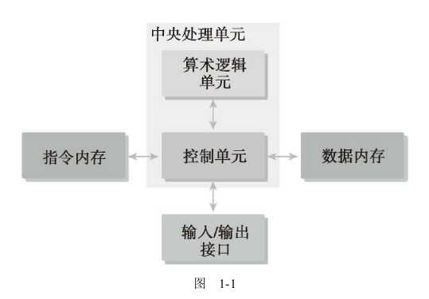
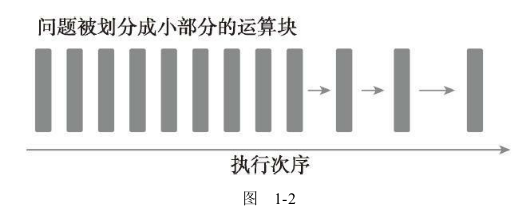
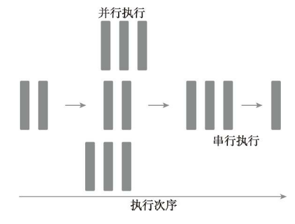
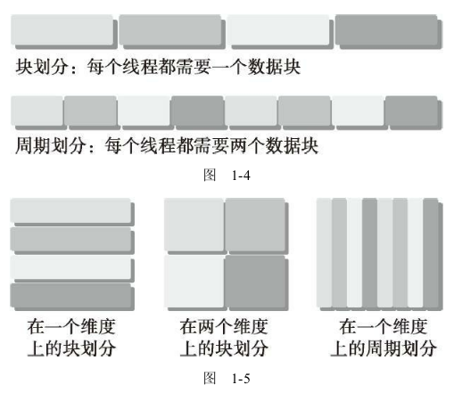
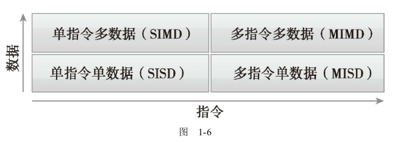
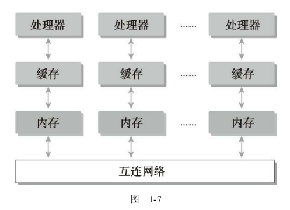
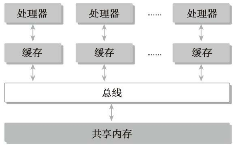

# 第1章 基于CUDA的异构并行计算

## 1.1 并行计算

并行计算通常涉及两个不同的计算技术领域。

* 计算机架构（硬件方面）
* 并行程序设计（软件方面）

计算机架构关注的是在结构级别上支持并行性，而并行编程设计关注的是充分使用计算机架构的计算能力来并发地解决问题。为了在软件中实现并行执行，硬件必须提供一个支持并行执行多进程或多线程的平台。
大多数现代处理器都应用了哈佛体系结构（Harvard architecture），如图1-1所示，它主要由3个部分组成。

在早期的计算机中，**一个芯片上只有一个CPU，这种结构被称为单核处理器**。现在，芯片设计的趋势是将**多个核心集成到一个单一的处理器上，以在体系结构级别支持并行性，这种形式通常被称为多核处理器**。因此，并行程序设计可以看作是将一个问题的计算分配给可用的核心以实现并行的过程。

### 1.1.1 串行编程和并行编程

如图1-2所示。这样的程序叫作串行程序

如图1-3所示，一个并行程序中可能会有一些串行部分。

### 1.1.2 并行性

在应用程序中有两种基本的并行类型。

* 任务并行
* 数据并行

当许多任务或函数可以独立地、大规模地并行执行时，这就是任务并行。任务并行的重点在于利用多核系统对任务进行分配。
当可以同时处理许多数据时，这就是数据并行。数据并行的重点在于利用多核系统对数据进行分配。
**CUDA编程非常适合解决数据并行计算的问题**。

数据并行程序设计的第一步是把数据依据线程进行划分，以使每个线程处理一部分数
据。通常来说，有两种方法可以对数据进行划分：块划分（blockpartitioning）和周期划分（cyclic partitioning）。在块划分中，一组连续的数据被分到一个块内。每个数据块以任意次序被安排给一个线程，线程通常在同一时间只处理一个数据块。在周期划分中，更少的数据被分到一个块内。相邻的线程处理相邻的数据块，每个线程可以处理多个数据块。为一个待处理的线程选择一个新的块，就意味着要跳过和现有线程一样多的数据块。

图1-4所示为对一维数据进行划分的两个例子。在块划分中，每个线程仅需处理数据
的一部分，而在周期划分中，每个线程要处理数据的多个部分。图1-5所示为对二维数据
进行划分的3个例子：沿y轴的块划分，沿x轴和y轴的块划分，以及沿x轴的周期划分。其余的划分方式为沿x轴的块划分，沿x轴和y轴的周期划分，以及沿y轴的周期划分留作练
习。

通常，数据是在一维空间中存储的。即便是多维逻辑数据，仍然要被映射到一维物理
地址空间中。如何在线程中分配数据不仅与数据的物理储存方式密切相关，并且与每个线
程的执行次序也有很大关系。组织线程的方式对程序的性能有很大的影响

数据划分
对数据划分有两种基本的方法：

* 块划分：每个线程作用于一部分数据，通常这些数据具有相同大小。
* 周期划分：每个线程作用于数据的多部分。

程序性能通常对块的大小比较敏感。块划分与周期划分中划分方式的选择与计算机架构有密切关系。

### 1.1.3 计算机架构

弗林分类法（Flynn’s Taxonomy），它根据指令和数据进入CPU的方式，将计算机架构分为4种不同
的类型（如图1-6所示）。

* 单指令单数据（SISD）：SISD指的是传统计算机：一种串行架构。在这种计算机上只有一个核心。在任何时间点上只有一个指令流在处理一个数据流
* 单指令多数据（SIMD）：SIMD是一种并行架构类型。在这种计算机上有多个核心。在任何时间点上所有的核心只有一个指令流处理不同的数据流。向量机是一种典型的SIMD类型的计算机，现在大多数计算机都采用了SIMD架构。SIMD最大的优势或许就是，在CPU上编写代码时，程序员可以继续按串行逻辑思考但对并行数据操作实现并行加速，而其他细节则由编译器来负责
* 多指令单数据（MISD）：MISD类架构比较少见，在这种架构中，每个核心通过使用多个指令流处理同一个数据流。
* 多指令多数据（MIMD）：MIMD是一种并行架构，在这种架构中，多个核心使用多个指令流来异步处理多个数据流，从而实现空间上的并行性。许多MIMD架构还包括SIMD执行的子组件。

延迟是一个操作从开始到完成所需要的时间，常用微秒来表示。

带宽是单位时间内可处理的数据量，通常表示为MB/s或GB/s。吞吐量是单位时间内成功处理的运算数量，通常表

示为gflops（即每秒十亿次的浮点运算数量），特别是在重点使用浮点计算的科学计算领域经常用到。

延迟用来衡量完成一次操作的时间，而吞吐量用来衡量在给定的单位时间内处理的操作量。

计算机架构也能根据内存组织方式进行进一步划分，一般可以分成下面两种类型。

* 分布式内存的多节点系统
* 共享内存的多处理器系统

在多节点系统中，大型计算引擎是由许多网络连接的处理器构成的。每个处理器有自己的本地内存，而且处理器之间可以通过网络进行通信。图1-7所示为一个典型的分布式内存的多节点系统，这种系统常被称作集群。

多处理器架构的大小通常是从双处理器到几十个或几百个处理器之间。这些处理器要么是与同一个物理内存相关联（如图1-8所示），要么共用一个低延迟的链路（如PCI-Express或PCIe）。

GPU代表了一种众核架构，几乎包括了前文描述的所有并行结构：多线程、MIMD（多指令多数据）、SIMD（单指令多数据），以及指令级并行。**NVIDIA公司称这种架构为SIMT（单指令多线程）**。

## 