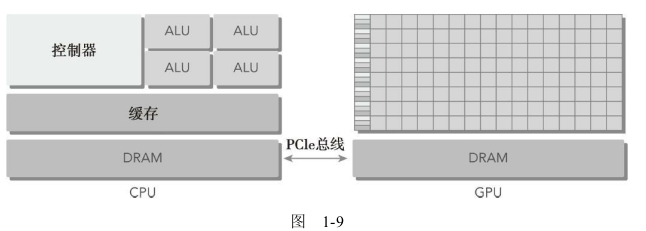
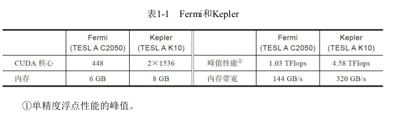
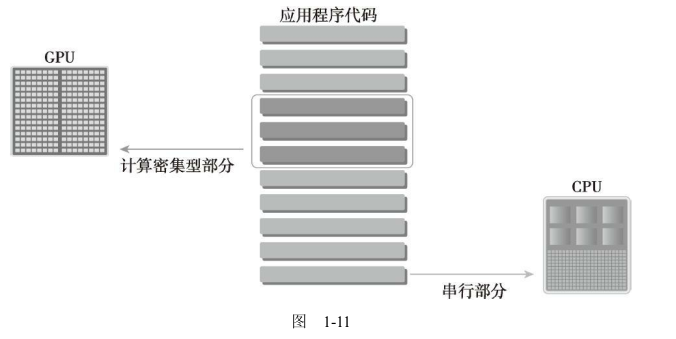
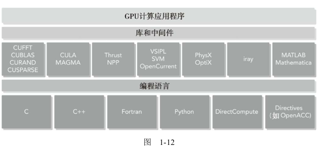
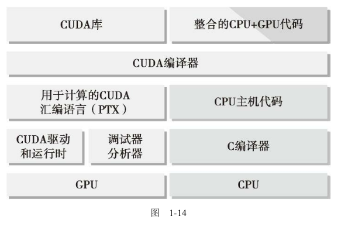

## 1.2 异构计算

同构计算使用的是同一架构下的一个或多个处理器来执行一个应用。而异构计算则使用一个处理器架构来执行一个应用，为任务选择适合它的架构，使其最终对性能有所改进。

### 1.2.1 异构架构

GPU不是一个独立运行的平台而是CPU的协处理器。因此，GPU必须通过PCIe总线与基于CPU的主机相连来进行操作，如图1-9所示。这就是为什么CPU所在的位置被称作主机端而GPU所在的位置被称作设备端。



一个异构应用包括两个部分。

* 主机代码
* 设备代码

主机代码在CPU上运行，设备代码在GPU上运行。异构平台上执行的应用通常由CPU初始化。在设备端加载计算密集型任务之前，CPU代码负责管理设备端的环境、代码和数据。

以下是描述GPU容量的两个重要特征。

* CUDA核心数量
* 内存大小

相应的，有两种不同的指标来评估GPU的性能。

* 峰值计算性能
* 内存带宽

峰值计算性能是用来评估计算容量的一个指标，通常定义为每秒能处理的单精度或双精度浮点运算的数量。峰值性能通常用GFlops（每秒十亿次浮点运算）或TFlops（每秒万亿次浮点运算）来表示。内存带宽是从内存中读取或写入数据的比率。内存带宽通常用GB/s表示。表1-1所示为Fermi架构和Kepler架构的一些性能指标。



计算能力
NVIDIA使用一个术语“计算能力”（compute capability）来描述整个Tesla系列的GPU加速器的硬件版本。表1-2给出了Tesla产品的各个版本及其计算能力。**具有相同主版本号的设备具有相同的核心架构**。

* 主版本NO.3是Kepler类架构。
* 主版本NO.2是Fermi类架构。
* 主版本NO.1是Tesla类架构。

### 1.2.2 异构计算范例

CPU计算适合处理控制密集型任务，GPU计算适合处理包含数据并行的计算密集型任务。GPU与CPU结合后，能有效提高大规模计算问题的处理速度与性能

因为CPU和GPU的功能互补性导致了CPU＋GPU的异构并行计算架构的发展，这两种处理器的类型能使应用程序获得最佳的运行效果。因此，为获得最佳性能，你可以同时使用CPU和GPU来执行你的应用程序，在CPU上执行串行部分或任务并行部分，在GPU上执行数据密集型并行部分，如图1-11所示



为了支持使用CPU＋GPU异构系统架构来执行应用程序，NVIDIA设计了一个被称为CUDA的编程模型。这个新的编程模型是本书将要介绍的重点。

### 1.2.3 CUDA：一种异构计算平台

通过使用CUDA，你可以像在CPU上那样，通过GPU来进行计算。



NVIDIA的CUDA nvcc编译器在编译过程中将设备代码从主机代码中分离出来。如图1-14所示



## 1.3 用GPU输出Hello World

如果这是你第一次使用CUDA，在Linux系统中，你可能想使用以下命令来检查CUDA编译器是否正确安装

通常的结果可能是：

```shell
zmurder@zmurder:~/WorkSpace/zyd/newaddr$ which nvcc
/usr/local/cuda/bin/nvcc
zmurder@zmurder:~/WorkSpace/zyd/newaddr$
```

写一个CUDA C程序，你需要以下几个步骤：

1. 用专用扩展名.cu来创建一个源文件。
2. 使用CUDA nvcc编译器来编译程序。
3. 从命令行运行可执行文件，这个文件有可在GPU上运行的内核代码。

把代码保存到hello.cu中，然后使用nvcc编译器来编译。CUDA nvcc编译器和gcc编译器及其他编译器有相似的语义。

```c
#include "../common/common.h"
#include <stdio.h>

/*
 * A simple introduction to programming in CUDA. This program prints "Hello
 * World from GPU! from 10 CUDA threads running on the GPU.
 */

__global__ void helloFromGPU()
{
    printf("Hello World from GPU!\n");
}

int main(int argc, char **argv)
{
    printf("Hello World from CPU!\n");

    helloFromGPU<<<1, 10>>>();
    CHECK(cudaDeviceReset());
    return 0;
}
```

编译

```shell
nvcc -arch sm_20 hello.cu -o hello
#自己的电脑使用 sm_61来编译
```

* 修饰符`__global__`告诉编译器这个函数将会从CPU中调用，然后在GPU上执行。
* 三重尖括号意味着从主线程到设备端代码的调用。一个内核函数通过一组线程来执行，所有线程执行相同的代码。三重尖括号里面的参数是执行配置，用来说明使用多少线程来执行内核函数。在这个例子中，有10个GPU线程被调用。
* 函数cudaDeviceRest（）用来显式地释放和清空当前进程中与当前设备有关的所有资源。
* 开关语句-arch sm_20使编译器为Fermi架构生成设备代码。

运行

```shell
zmurder@zmurder:~/WorkSpace/zyd/note/cuda/CUDAC编程权威指南练习code/chapter01$ make
nvcc -O2 -arch=sm_61 -o hello hello.cu
zmurder@zmurder:~/WorkSpace/zyd/note/cuda/CUDAC编程权威指南练习code/chapter01$ ls
hello  hello.cu  Makefile
zmurder@zmurder:~/WorkSpace/zyd/note/cuda/CUDAC编程权威指南练习code/chapter01$ ./hello 
Hello World from CPU!
Hello World from GPU!
Hello World from GPU!
Hello World from GPU!
Hello World from GPU!
Hello World from GPU!
Hello World from GPU!
Hello World from GPU!
Hello World from GPU!
Hello World from GPU!
Hello World from GPU!
zmurder@zmurder:~/WorkSpace/zyd/note/cuda/CUDAC编程权威指南练习code/chapter01$ 
```

CUDA编程结构

一个典型的CUDA编程结构包括5个主要步骤。

1. 分配GPU内存。
2. 从CPU内存中拷贝数据到GPU内存。
3. 调用CUDA内核函数来完成程序指定的运算。
4. 将数据从GPU拷回CPU内存。
5. 释放GPU内存空间。

在hello.cu中，你只看到了第三步：调用内核。

## 1.4 使用CUDA C编程难吗

CPU编程和GPU编程的主要区别是程序员**对GPU架构的熟悉程度**。用并行思维进行思考并对GPU架构有了基本的了解

CUDA中有内存层次和线程层次的概念，使用如下结构，有助于你对线程执行进行更高层次的控制和调度：

* 内存层次结构
* 线程层次结构

例如，在CUDA编程模型中使用的共享内存（一个特殊的内存）。共享内存可以视为一个被软件管理的高速缓存，**通过为主内存节省带宽来大幅度提高运行速度**。有了共享内存，你可以直接控制代码的数据局部性。

CUDA核中有3个关键抽象：线程组的层次结构，内存的层次结构以及障碍同步。

CUDA开发环境

NVIDIA为C和C++开发人员提供了综合的开发环境以创建GPU加速应用程序，包括以下几种。

* NVIDIA Nsight集成开发环境
* CUDA-GDB命令行调试器
* 用于性能分析的可视化和命令行分析器
* CUDA-MEMCHECK内存分析器
* GPU设备管理工具