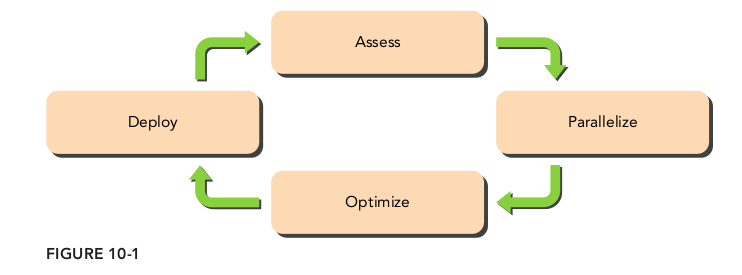
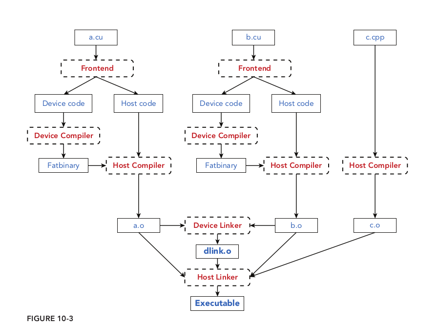
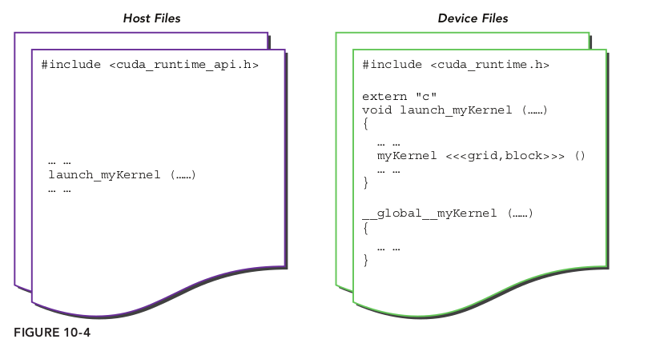

# 10.1 CUDA C的开发过程

了解GPU内存和执行模型抽象有助于更好地控制大规模并行GPU环境。这样，创建映射到抽象二维或三维网格的应用子域就变得很正常了，并且可以使核函数像串行一样表示。重点关注高级区域分解和内存层次结构存储管理的内容，就不会被创建和销毁线程的烦琐细节所妨碍了。

## 10.1.1 APOD开发周期

APOD是由NVIDIA特别为CUDA开发定制的迭代开发过程。APOD有4个阶段



* 评估（assessment）
* 并行化（parallelization）
* 优化（optimization）
* 部署（deployment）

### 10.1.1.1 评估

确定限制性能的瓶颈或具有高计算强度的临界区。

### 10.1.1.2 并行化

一旦应用程序的瓶颈被确定，下一阶段就是将代码并行化。这里有几种加速主机代码的方式，包括以下几个方面：

* 使用CUDA并行库
* 采用并行化及向量化编译器
* 手动开发CUDA内核使之并行化

大规模并行线程间的数据划分主要有两种不同的方法：块划分和循环划分。在块划分中，要处理的数据元素被分成块并分配到线程中，内核的性能与块的大小密切相关。在循环划分中，每个线程在跳跃之前一次处理一个元素，线程数量和元素数量相同。

### 10.1.1.3 优化

CUDA的优化可以体现在以下两个层次上：

* 网格级（grid-level）
  * 在网格级优化过程中，重点是整体GPU的利用率和效率。优化网格级性能的方法包括同时运行多个内核以及使用CUDA流和事件重叠带有数据的内核执行。
* 内核级（kernel-level）
  * 在内核级优化过程中，要关注GPU的内存带宽和计算资源的高效使用，并减少或隐藏指令和内存延迟。
  * 内存带宽
  * 计算资源
  * 指令和内存延迟

### 10.1.1.4 部署

部署CUDA应用程序时，要确保在目标机器没有支持CUDA的GPU的情况下，程序仍能正常运行。CUDA运行时提供了一些函数，用于检测支持CUDA的GPU并检查硬件和软件的配置。

## 10.1.2 优化因素

按照重要性排列为：

* 展现足够的并行性，
  * 可以从以下两个方面增强并行性。
    * 在一个SM中保证有更多活跃的并发线程束
    * 为每个线程/线程束分配更多独立的工作
  * 能从两个不同的层面调整并行性：
    * 内核级（kernel level）:寄存器在线程间被划分，共享内存在线程块间被划分。因此，内核中的资源消耗可能会限制活跃线程束的数量。
    * 网格级（grid level）:每个线程块中线程的数量，每个网格中线程块的数量
* 优化内存访问：重点应放在以下两个方面
  * 内存访问模式（最大限度地使用总线上的字节）：在分析程序的数据传输时需要注意两个指标：程序需要的字节数和硬件传输的字节数。这两者之间的差值表示了浪费的内存带宽。
    * 全局内存来说，最好的访问模式是对齐和合并访问
    * 共享内存：·通过显式缓存数据来减少全局内存的访问，通过重新安排数据布局避免未合并的全局内存的访问
  * 充足的并发内存访问（隐藏内存延迟）
* 优化指令执行
  * 通过保证有足够多的活跃线程束来隐藏延迟
  * 通过给线程分配更多独立的工作来隐藏延迟
  * 避免线程束内出现分化执行路径

## 10.1.3 CUDA代码编译

一个CUDA应用程序的源程序代码通常包含两种类型的源文件：常规的C源文件和CUDA C源文件。在设备代码文件中，通常有两种函数：设备函数以及调用设备函数或管理设备资源的主机函数。CUDA编译器将编译过程分成了以下两个部分



### 10.1.3.3 将CUDA文件整合到C项目中

组织CUDA核函数时，可以像基于C的项目一样，使用独立的文件。然后必须在设备源文件中创建内核封装函数，使之可以像正常的C函数那样被调用，但却执行CUDA内核启动。因为设备源文件中声明的主机函数默认C++规范，所以也需要用以下的声明来解决C++引用混乱的问题：

```C
extern "C" void wrapper_kernel_launch(...) {
...
}
```



## 10.1.4 CUDA错误处理

常见的就是用CHECK或是CALL_CUDA宏来退出错误。

```c
#define CHECK(call) { \
cudaError_t err; \
if ( (err = (call)) != cudaSuccess) { \
fprintf(stderr, "Got error %s at %s:%d\n", cudaGetErrorString(err), \
__FILE__, __LINE__); \
exit(1); \
} \
}
```

修改版本如下：

```c
// 很明显，这种代码封装方式，更加的便于使用
//宏定义 #define <宏名>（<参数表>） <宏体>
#define checkDriver(op)  __check_cuda_driver((op), #op, __FILE__, __LINE__)

bool __check_cuda_driver(CUresult code, const char* op, const char* file, int line){

    if(code != CUresult::CUDA_SUCCESS){    
        const char* err_name = nullptr;    
        const char* err_message = nullptr;  
        cuGetErrorName(code, &err_name);    
        cuGetErrorString(code, &err_message);   
        printf("%s:%d  %s failed. \n  code = %s, message = %s\n", file, line, op, err_name, err_message);   
        return false;
    }
    return true;
}
```

# 10.2 配置文件驱动优化

书中使用的是nvprof和nvvp这两个工具，现在已经被nsight system和computer代替了，我的其他文章有专门讲解这两个工具的使用，这里就不再搬书上的内容了。
