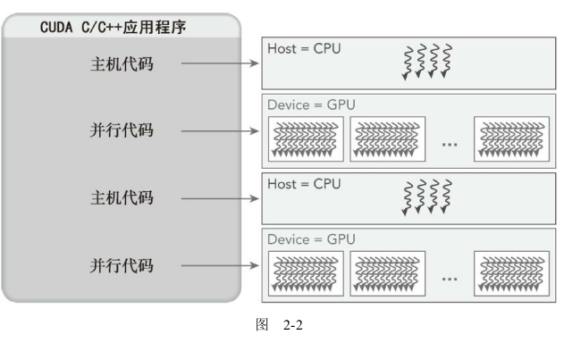
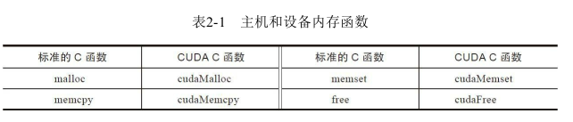
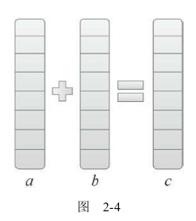
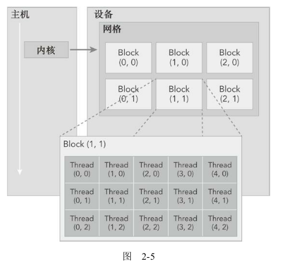
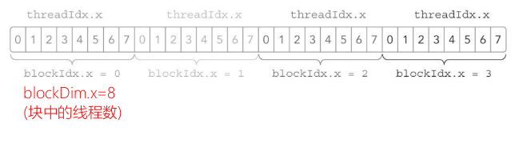
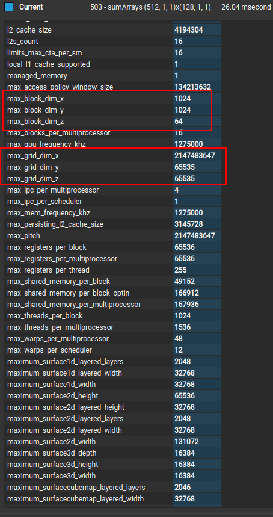
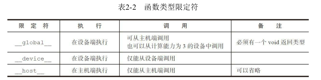

# 第2章 CUDA编程模型

## 2.1 CUDA编程模型概述

除了与其他并行编程模型共有的抽象外，CUDA编程模型还利用GPU架构的计算能力提供了以下几个特有功能。

* 一种通过层次结构在GPU中组织线程的方法
* 一种通过层次结构在GPU中访问内存的方法
* 在本章和下一章你将重点学习第一个主题，而在第4章和

### 2.1.1 CUDA编程结构

CUDA编程模型使用由C语言扩展生成的注释代码在异构计算系统中执行应用程序。在一个异构环境中包含多个CPU和GPU，每个GPU和CPU的内存都由一条PCI-Express总线分隔开。因此，需要注意区分以下内容。

* 主机：CPU及其内存（主机内存）
* 设备：GPU及其内存（设备内存）

为了清楚地指明不同的内存空间，在本书的示例代码中，主机内存中的变量名以`h_`为前缀，设备内存中的变量名以`d_`为前缀。

从CUDA 6.0开始，NVIDIA提出了名为“统一寻址”（Unified Memory）的编程模型的改进，它连接了主机内存和设备内存空间，可使用单个指针访问CPU和GPU内存，无须彼此之间手动拷贝数据。更多细节详见第4章。

CUDA编程模型主要是异步的，因此在GPU上进行的运算可以与主机-设备通信重叠。

NVIDIA的C编译器（nvcc）为主机和设备生成可执行代码。

一个典型的CUDA程序实现流程遵循以下模式。

1. 把数据从CPU内存拷贝到GPU内存
2. 调用核函数对存储在GPU内存中的数据进行操作。
3. 将数据从GPU内存传送回到CPU内存。



### 2.1.2 内存管理

CUDA编程模型假设系统是由一个主机和一个设备组成的，而且各自拥有独立的内存。

用于执行GPU内存分配的是cudaMalloc函数，其函数原型为：

```c
cudaError_t cudaMalloc(void ** devPtr,size_t size) 	
```

```C
float *device_data=NULL;
size_t size = 1024*sizeof(float);
cudaMalloc((void**)&device_data, size);
```

第一个参数是指针的指针。具体的解释可参考 [C指针](../C_C++/C指针.md)



该函数负责向设备分配一定字节的**线性内存**，cudaMalloc与标准C语言中的malloc函数几乎一样

cudaMemcpy函数负责主机和设备之间的数据传输，使用cudaMemcpy函数把数据从主机内存拷贝到**GPU的全局内存中**。其函数原型为：

```C
cudaError_t cudaMemcpy 	(void * dst,
		const void * src,
		size_t count,
		enum cudaMemcpyKind kind	 
) 	
```

此函数从src指向的源存储区复制一定数量的字节到dst指向的目标存储区。复制方向由kind指定，其中的kind有以下几种。

enum [cudaMemcpyKind](https://developer.download.nvidia.cn/compute/DevZone/docs/html/C/doc/html/group__CUDART__TYPES_g18fa99055ee694244a270e4d5101e95b.html#g18fa99055ee694244a270e4d5101e95b)          

CUDA memory copy types 

- **Enumerator:** 

  *cudaMemcpyHostToHost* Host -> Host  *cudaMemcpyHostToDevice* Host -> Device  *cudaMemcpyDeviceToHost* Device -> Host  *cudaMemcpyDeviceToDevice* Device -> Device  *cudaMemcpyDefault* Default based unified virtual address space

这个函数以同步方式执行，因为在cudaMemcpy函数返回以及传输操作完成之前主机应用程序是阻塞的。除了内核启动之外的CUDA调用都会返回一个错误的枚举类型cudaError_t。如果GPU内存分配成功，函数返回：`cudaSuccess`

可以使用以下CUDA运行时函数将错误代码转化为可读的错误消息：

```C
const char* cudaGetErrorString 	( 	cudaError_t  	error 	 )  	
```

cudaGetErrorString函数和C语言中的strerror函数类似。

可以自己封装如下，方便后面的调用

```C
#define CHECK(call)                                                            \
{                                                                              \
    const cudaError_t error = call;                                            \
    if (error != cudaSuccess)                                                  \
    {                                                                          \
        fprintf(stderr, "Error: %s:%d, ", __FILE__, __LINE__);                 \
        fprintf(stderr, "code: %d, reason: %s\n", error,                       \
                cudaGetErrorString(error));                                    \
        exit(1);                                                               \
    }                                                                          \
}
```

下面，我们将通过一个简单的两个数组相加的例子来学习如何在主机和设备之间进行数据传输，以及如何使用CUDA C编程。如图2-4所示，数组a的第一个元素与数组b的第一个元素相加，得到的结果作为数组c的第一个元素，重复这个过程直到数组中的所有元素都进行了一次运算。



### 2.1.3 线程管理

CUDA明确了线程层次抽象的概念以便于你组织线程。这是一个两层的线程层次结构，由线程块和线程块网格构成，如图2-5所示。



**由一个内核启动所产生的所有线程统称为一个网格。同一网格中的所有线程共享相同的全局内存空间**。**一个网格由多个线程块构成，一个线程块包含一组线程**，同一线程块内的线程协作可以通过以下方式

* 同步
* 共享内存

不同块内的线程不能协作。

**线程依靠以下两个坐标变量来区分彼此**。

* blockIdx（线程块在线程格内的索引）
* threadIdx（块内的线程索引）

这些变量是核函数中需要预初始化的内置变量。当执行一个核函数时，**CUDA运行时为每个线程分配坐标变量blockIdx和threadIdx。基于这些坐标，你可以将部分数据分配给不同的线程**。
该坐标变量是基于uint3定义的CUDA内置的向量类型，是一个包含3个无符号整数的结构，可以通过x、y、z三个字段来指定。

```C
blockIdx.x
blockIdx.y
blockIdx.z
threadIdx.x
threadIdx.y
threadIdx.z
```

CUDA可以组织三维的网格和块。图2-5展示了一个线程层次结构的示例，其结构是一个包含二维块的二维网格。网格和块的维度由下列两个内置变量指定。

* blockDim（线程块的维度，用每个线程块中的线程数来表示）
* gridDim（线程格的维度，用每个线程格中的线程数来表示）

它们是dim3类型的变量，是基于uint3定义的整数型向量，用来表示维度。当定义一个dim3类型的变量时，所有未指定的元素都被初始化为1。dim3类型变量中的每个组件可以通过它的x、y、z字段获得。如下所示。

```shell
blockDim.x
blockDim.y
blockDim.z
```

#### 2.1.3.1 网格和线程块的维度

通常，一个线程格会被组织成线程块的二维数组形式，一个线程块会被组织成线程的三维数组形式。**也就是grid一般是二维的，block一般是三维的。**
线程格和线程块均使用3个dim3类型的无符号整型字段，而未使用的字段将被初始化为1且忽略不计。
在CUDA程序中有两组不同的网格和块变量：手动定义的dim3数据类型和预定义的uint3数据类型。在主机端，作为内核调用的一部分，你可以使用dim3数据类型定义一个网格和块的维度。当执行核函数时，CUDA运行时会生成相应的内置预初始化的网格、块和线程变量，它们在核函数内均可被访问到且为unit3类型。**手动定义的dim3类型的网格和块变量仅在主机端可见，而unit3类型的内置预初始化的网格和块变量仅在设备端可见**。

在下面的例子中，定义了一个包含**3个线程的一维线程块**，以及一个**基于块和数据大小定义的一定数量线程块的一维线程网格**。

```C
//checkDimension.cu
#include "../common/common.h"
#include <cuda_runtime.h>
#include <stdio.h>

/*
 * Display the dimensionality of a thread block and grid from the host and
 * device.
 */

__global__ void checkIndex(void)
{
    // printf("threadIdx:(%d, %d, %d)", threadIdx.x, threadIdx.y, threadIdx.z);
    // printf("blockIdx:(%d, %d, %d)", blockIdx.x, blockIdx.y, blockIdx.z);

    // printf("blockDim:(%d, %d, %d)", blockDim.x, blockDim.y, blockDim.z);
    // printf("gridDim:(%d, %d, %d)", gridDim.x, gridDim.y, gridDim.z);
    // printf("\n");
    printf("threadIdx:(%d, %d, %d),blockIdx:(%d, %d, %d),blockDim:(%d, %d, %d),gridDim:(%d, %d, %d)\n", threadIdx.x, threadIdx.y, threadIdx.z,
		blockIdx.x, blockIdx.y, blockIdx.z,
		blockDim.x, blockDim.y, blockDim.z,
		gridDim.x, gridDim.y, gridDim.z);


}

int main(int argc, char **argv)
{
    // define total data element
    int nElem = 6;

    // define grid and block structure
    dim3 block(3);
    dim3 grid((nElem + block.x - 1) / block.x);

    // check grid and block dimension from host side
    printf("grid.x %d grid.y %d grid.z %d\n", grid.x, grid.y, grid.z);
    printf("block.x %d block.y %d block.z %d\n", block.x, block.y, block.z);

    // check grid and block dimension from device side
    checkIndex<<<grid, block>>>();

    // reset device before you leave
    CHECK(cudaDeviceReset());

    return(0);
}

```

编译运行：

```shell
zmurder@zmurder:~/WorkSpace/zyd/note/cuda/CUDAC编程权威指南练习code/chapter02$ make
nvcc -O2 -arch=sm_61 -o checkDimension checkDimension.cu
zmurder@zmurder:~/WorkSpace/zyd/note/cuda/CUDAC编程权威指南练习code/chapter02$ ./checkDimension 
grid.x 2 grid.y 1 grid.z 1
block.x 3 block.y 1 block.z 1
threadIdx:(0, 0, 0),blockIdx:(1, 0, 0),blockDim:(3, 1, 1),gridDim:(2, 1, 1)
threadIdx:(1, 0, 0),blockIdx:(1, 0, 0),blockDim:(3, 1, 1),gridDim:(2, 1, 1)
threadIdx:(2, 0, 0),blockIdx:(1, 0, 0),blockDim:(3, 1, 1),gridDim:(2, 1, 1)
threadIdx:(0, 0, 0),blockIdx:(0, 0, 0),blockDim:(3, 1, 1),gridDim:(2, 1, 1)
threadIdx:(1, 0, 0),blockIdx:(0, 0, 0),blockDim:(3, 1, 1),gridDim:(2, 1, 1)
threadIdx:(2, 0, 0),blockIdx:(0, 0, 0),blockDim:(3, 1, 1),gridDim:(2, 1, 1)
zmurder@zmurder:~/WorkSpace/zyd/note/cuda/CUDAC编程权威指南练习code/chapter02$
```

#### 2.1.3.2 从主机端和设备端访问网格/块变量

例如主计算的块变量访问

```c
block.x block.y block.z
```

设备端，已经预定义了内置块变量

```c
blockDim.x blockDim.y blockDim.z
```

总之，在启动内核之前就定义了主机端的网格和块变量，并从主机端通过由x、y、z三个字段决定的矢量结构来访问它们。当内核启动时，可以使用内核中预初始化的内置变量。

对于一个给定的数据大小，确定网格和块尺寸的一般步骤为：

* 确定块的大小
* 在已知数据大小和块大小的基础上计算网格维度

要确定块尺寸，通常需要考虑：

* 内核的性能特性
* GPU资源的限制

#### 2.1.3.3 线程层次结构

由于一个内核启动的网格和块的维数会影响性能，这一结构为程序员优化程序提供了一个额外的途径。
网格和块的维度存在几个限制因素，对于块大小的一个主要限制因素就是可利用的计算资源，如寄存器，共享内存等。

### 2.1.4 启动一个CUDA核函数

CUDA内核调用是对C语言函数调用语句的延伸，<<<>>>运算符内是核函数的执行配置。

```C
kernel_name <<< grid,block>>>(argument list);
```

grid：网格维度，也就是启动块的数目。
block：是块维度，也就是每个块中线程的数目。

同一个块中的线程之间可以相互协作，不同块内的线程不能协作。对于一个给定的问题，可以使用不同的网格和块布局来组织你的线程。例如，假设你有32个数据元素用于计算，每8个元素一个块，需要启动4个块。

```c
kernel_name<<<4,8>>>(argument list);
```

图2-6表明了上述配置下的线程布局。



核函数的调用与主机线程是异步的。核函数调用结束后，控制权立刻返回给主机端。你可以调用以下函数来强制主机端程序等待**所有**的核函数执行结束：

```C
cudaError_t cudaDeviceSynchronize(void);
```

一些CUDA运行时API在主机和设备之间是**隐式同步**的。当使用cudaMemcpy函数在主机和设备之间拷贝数据时，主机端隐式同步，即**主机端程序必须等待数据拷贝完成后才能继续执行程序**。

#### 2.1.4.1 异步行为

不同于C语言的函数调用，所有的CUDA核函数的启动都是异步的。**CUDA内核调用完成后，控制权立刻返回给CPU。**

### 2.1.5 编写核函数

核函数是在设备端执行的代码。在核函数中，需要为一个线程规定要进行的计算以及要进行的数据访问。当核函数被调用时，**许多不同的CUDA线程并行执行同一个计算任务**。以下是用`__global__`声明定义核函数：

**声明核函数**

```C
__global__ void kernel_name(argument list);
```

**host 调用核函数**：

```C
kernel_name<<<gridDim，blockDim，sharedMemorySize，stream>>>(args…)
```

* stream 是流，在进行异步管理的时候可以控制它。
* sharedMemorySize 是共享内存的大小
* gridDim 和 blockDim 用于告诉核函数该启动多少个线程，二者都是内置变量，其变量类型是 dim3
  启动的总线程数量 nthreads = gridDim.x * gridDim.y * gridDim.z * blockDim.x * blockDim.y * blockDim.z
  gridDim 和 blockDim 都是有约束的，可以通过 runtime API 或者 deviceQuery 进行查询。


* **调用核函数是传值**的，不能传引用，可以传递类、结构体等，核函数可以是模板，**返回值必须是 void**
* 核函数的执行，是异步的，也就是立即返回的
* 线程 layout 主要用到 blockDim、gridDim
* 核函数内访问线程索引主要用到 threadIdx、blockIdx、blockDim、gridDim 这些内置变量


下图是orin上的gridhe block的限制



核函数是在设备端执行的代码。在核函数中，需要为一个线程规定要进行的计算以及要进行的数据访问。当核函数被调用时，许多不同的CUDA线程并行执行同一个计算任务。以下是用__global__声明定义核函数：



`__device__`和`__host__`限定符可以一齐使用，这样函数可以同时在主机和设备端进行编译。

需要注意的一点是传递给核函数的参数。

当我们调用核函数时，需要将参数传入核函数。

* 若参数是在Device端申请的数组（GPU的内存），直接像C++函数那样传入指针名就行，
* 如果是在Host端动态申请的变量（CPU的内存），不能把指针作为参数传递进去
* 可以将CPU值传递到核函数。

```C


__global__ void sumArraysOnGPU(float *A, float *B, float *C, const int N)
{
    int i = threadIdx.x;

    if (i < N) C[i] = A[i] + B[i];
}

int nElem = 1 << 5;
// malloc device global memory
float *d_A, *d_B, *d_C;
CHECK(cudaMalloc((float**)&d_A, nBytes));
CHECK(cudaMalloc((float**)&d_B, nBytes));
CHECK(cudaMalloc((float**)&d_C, nBytes));
sumArraysOnGPU<<<grid, block>>>(d_A, d_B, d_C, nElem);//正确，这里d_A，d_B，d_C都是GPU的内存空间的指针，nElem是CPU到GPU的值传递


float * h_A = (float *)malloc(nBytes);
sumArraysOnGPU<<<grid, block>>>(h_A, d_B, d_C, nElem);//错误，因为h_A是CPU的内存指针，GPU不能使用。
```

CUDA 内核的所有参数都是按值传递的，并且这些参数由主机通过 API 复制到 GPU 上的专用内存参数缓冲区中。目前，这个缓冲区存储在常量内存中，每个内核启动的参数限制为 4kb -- 参见 [here](http://docs.nvidia.com/cuda/cuda-c-programming-guide/index.html#function-parameters)

### 2.1.6 验证核函数

首先，你可以在Fermi及更高版本的设备端的核函数中使用printf函数。
其次，可以将执行参数设置为<<<1，1>>>，因此强制用一个块和一个线程执行核函数，这模拟了串行执行程序。这对于调试和验证结果是否正确是非常有用的，而且，如果你遇到了运算次序的问题，这有助于你对比验证数值结果是否是按位精确的。

### 2.1.7 处理错误

由于许多CUDA调用是异步的，所以有时可能很难确定某个错误是由哪一步程序引起的。定义一个错误处理宏封装所有的CUDA API调用，这简化了错误检查过程：

```C
#define CHECK(call)                                                            \
{                                                                              \
    const cudaError_t error = call;                                            \
    if (error != cudaSuccess)                                                  \
    {                                                                          \
        fprintf(stderr, "Error: %s:%d, ", __FILE__, __LINE__);                 \
        fprintf(stderr, "code: %d, reason: %s\n", error,                       \
                cudaGetErrorString(error));                                    \
        exit(1);                                                               \
    }                                                                          \
}
```

例如

```C
// malloc device memory
int *d_MatA;
CHECK(cudaMalloc((void **)&d_MatA, nBytes));

// transfer data from host to device
CHECK(cudaMemcpy(d_MatA, h_A, nBytes, cudaMemcpyHostToDevice));
```

### 2.1.8 编译和执行

现在把所有的代码放在一个文件名为sumArraysOnGPU-small-case.cu的文件中

```C
#include "../common/common.h"
#include <cuda_runtime.h>
#include <stdio.h>

/*
 * This example demonstrates a simple vector sum on the GPU and on the host.
 * sumArraysOnGPU splits the work of the vector sum across CUDA threads on the
 * GPU. Only a single thread block is used in this small case, for simplicity.
 * sumArraysOnHost sequentially iterates through vector elements on the host.
 */

void checkResult(float *hostRef, float *gpuRef, const int N)
{
    double epsilon = 1.0E-8;
    bool match = 1;

    for (int i = 0; i < N; i++)
    {
        if (abs(hostRef[i] - gpuRef[i]) > epsilon)
        {
            match = 0;
            printf("Arrays do not match!\n");
            printf("host %5.2f gpu %5.2f at current %d\n", hostRef[i],
                   gpuRef[i], i);
            break;
        }
    }

    if (match) printf("Arrays match.\n\n");

    return;
}


void initialData(float *ip, int size)
{
    // generate different seed for random number
    time_t t;
    srand((unsigned) time(&t));

    for (int i = 0; i < size; i++)
    {
        ip[i] = (float)(rand() & 0xFF) / 10.0f;
    }

    return;
}


void sumArraysOnHost(float *A, float *B, float *C, const int N)
{
    for (int idx = 0; idx < N; idx++)
        C[idx] = A[idx] + B[idx];
}

__global__ void sumArraysOnGPU(float *A, float *B, float *C, const int N)
{
    int i = threadIdx.x;

    if (i < N) C[i] = A[i] + B[i];
}


int main(int argc, char **argv)
{
    printf("%s Starting...\n", argv[0]);

    // set up device
    int dev = 0;
    CHECK(cudaSetDevice(dev));

    // set up data size of vectors
    int nElem = 1 << 5;
    printf("Vector size %d\n", nElem);

    // malloc host memory
    size_t nBytes = nElem * sizeof(float);

    float *h_A, *h_B, *hostRef, *gpuRef;
    h_A     = (float *)malloc(nBytes);
    h_B     = (float *)malloc(nBytes);
    hostRef = (float *)malloc(nBytes);
    gpuRef  = (float *)malloc(nBytes);

    // initialize data at host side
    initialData(h_A, nElem);
    initialData(h_B, nElem);

    memset(hostRef, 0, nBytes);
    memset(gpuRef,  0, nBytes);

    // malloc device global memory
    float *d_A, *d_B, *d_C;
    CHECK(cudaMalloc((float**)&d_A, nBytes));
    CHECK(cudaMalloc((float**)&d_B, nBytes));
    CHECK(cudaMalloc((float**)&d_C, nBytes));

    // transfer data from host to device
    CHECK(cudaMemcpy(d_A, h_A, nBytes, cudaMemcpyHostToDevice));
    CHECK(cudaMemcpy(d_B, h_B, nBytes, cudaMemcpyHostToDevice));
    CHECK(cudaMemcpy(d_C, gpuRef, nBytes, cudaMemcpyHostToDevice));

    // invoke kernel at host side
    dim3 block (nElem);
    dim3 grid  (1);

    sumArraysOnGPU<<<grid, block>>>(d_A, d_B, d_C, nElem);
    printf("Execution configure <<<%d, %d>>>\n", grid.x, block.x);

    // copy kernel result back to host side
    CHECK(cudaMemcpy(gpuRef, d_C, nBytes, cudaMemcpyDeviceToHost));

    // add vector at host side for result checks
    sumArraysOnHost(h_A, h_B, hostRef, nElem);

    // check device results
    checkResult(hostRef, gpuRef, nElem);

    // free device global memory
    CHECK(cudaFree(d_A));
    CHECK(cudaFree(d_B));
    CHECK(cudaFree(d_C));

    // free host memory
    free(h_A);
    free(h_B);
    free(hostRef);
    free(gpuRef);

    CHECK(cudaDeviceReset());
    return(0);
}

```

运行结果如下：

```shell
zmurder@zmurder:~/WorkSpace/zyd/note/cuda/CUDAC编程权威指南练习code/chapter02$ ./sumArraysOnGPU-small-case 
./sumArraysOnGPU-small-case Starting...
Vector size 32
Execution configure <<<1, 32>>>
Arrays match.

zmurder@zmurder:~/WorkSpace/zyd/note/cuda/CUDAC编程权威指南练习code/chapter02$ 
```

## 