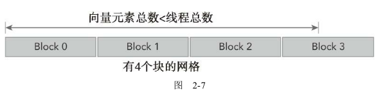

## 2.2 给核函数计时

### 2.2.1 用CPU计时器计时

可以使用gettimeofday系统调用来创建一个CPU计时器，以获取系统的时钟时间，它将返回自1970年1月1日零点以来，到现在的秒数。程序中需要添加sys/time.h头文件，如代码清单2-5所示。

```C
inline double seconds()
{
    struct timeval tp;
    struct timezone tzp;
    int i = gettimeofday(&tp, &tzp);
    return ((double)tp.tv_sec + (double)tp.tv_usec * 1.e-6);
}
```

测试核函数的运行时间

```C
iStart = seconds();
sumArraysOnGPU<<<grid, block>>>(d_A, d_B, d_C, nElem);
CHECK(cudaDeviceSynchronize());
iElaps = seconds() - iStart;
printf("sumArraysOnGPU <<<  %d, %d  >>>  Time elapsed %f sec\n", grid.x,block.x,iElaps);
```

由于核函数调用与主机端程序是异步的，你需要用cudaDeviceSynchronize函数来等待所有的GPU线程运行结束。

```C
__global__ void sumArraysOnGPU(float *A, float *B, float *C, const int N)
{
    int i = blockIdx.x * blockDim.x + threadIdx.x;

    if (i < N) C[i] = A[i] + B[i];//限定条件（i＜N）来检验索引值是否越界
}
```



完整的代码如下

```C
//sumArraysOnGPU-timer.cu
#include "../common/common.h"
#include <cuda_runtime.h>
#include <stdio.h>

/*
 * This example demonstrates a simple vector sum on the GPU and on the host.
 * sumArraysOnGPU splits the work of the vector sum across CUDA threads on the
 * GPU. Only a single thread block is used in this small case, for simplicity.
 * sumArraysOnHost sequentially iterates through vector elements on the host.
 * This version of sumArrays adds host timers to measure GPU and CPU
 * performance.
 */

void checkResult(float *hostRef, float *gpuRef, const int N)
{
    double epsilon = 1.0E-8;
    bool match = 1;

    for (int i = 0; i < N; i++)
    {
        if (abs(hostRef[i] - gpuRef[i]) > epsilon)
        {
            match = 0;
            printf("Arrays do not match!\n");
            printf("host %5.2f gpu %5.2f at current %d\n", hostRef[i],
                   gpuRef[i], i);
            break;
        }
    }

    if (match) printf("Arrays match.\n\n");

    return;
}

void initialData(float *ip, int size)
{
    // generate different seed for random number
    time_t t;
    srand((unsigned) time(&t));

    for (int i = 0; i < size; i++)
    {
        ip[i] = (float)( rand() & 0xFF ) / 10.0f;
    }

    return;
}

void sumArraysOnHost(float *A, float *B, float *C, const int N)
{
    for (int idx = 0; idx < N; idx++)
    {
        C[idx] = A[idx] + B[idx];
    }
}
__global__ void sumArraysOnGPU(float *A, float *B, float *C, const int N)
{
    int i = blockIdx.x * blockDim.x + threadIdx.x;

    if (i < N) C[i] = A[i] + B[i];
}

int main(int argc, char **argv)
{
    printf("%s Starting...\n", argv[0]);

    // set up device
    int dev = 0;
    cudaDeviceProp deviceProp;
    CHECK(cudaGetDeviceProperties(&deviceProp, dev));
    printf("Using Device %d: %s\n", dev, deviceProp.name);
    CHECK(cudaSetDevice(dev));

    // set up data size of vectors
    int nElem = 1 << 24;
    printf("Vector size %d\n", nElem);

    // malloc host memory
    size_t nBytes = nElem * sizeof(float);

    float *h_A, *h_B, *hostRef, *gpuRef;
    h_A     = (float *)malloc(nBytes);
    h_B     = (float *)malloc(nBytes);
    hostRef = (float *)malloc(nBytes);
    gpuRef  = (float *)malloc(nBytes);

    double iStart, iElaps;

    // initialize data at host side
    iStart = seconds();
    initialData(h_A, nElem);
    initialData(h_B, nElem);
    iElaps = seconds() - iStart;
    printf("initialData Time elapsed %f sec\n", iElaps);
    memset(hostRef, 0, nBytes);
    memset(gpuRef,  0, nBytes);

    // add vector at host side for result checks
    iStart = seconds();
    sumArraysOnHost(h_A, h_B, hostRef, nElem);
    iElaps = seconds() - iStart;
    printf("sumArraysOnHost Time elapsed %f sec\n", iElaps);

    // malloc device global memory
    float *d_A, *d_B, *d_C;
    CHECK(cudaMalloc((float**)&d_A, nBytes));
    CHECK(cudaMalloc((float**)&d_B, nBytes));
    CHECK(cudaMalloc((float**)&d_C, nBytes));

    // transfer data from host to device
    CHECK(cudaMemcpy(d_A, h_A, nBytes, cudaMemcpyHostToDevice));
    CHECK(cudaMemcpy(d_B, h_B, nBytes, cudaMemcpyHostToDevice));
    CHECK(cudaMemcpy(d_C, gpuRef, nBytes, cudaMemcpyHostToDevice));

    // invoke kernel at host side
    int iLen = 512;
    dim3 block (iLen);
    dim3 grid  ((nElem + block.x - 1) / block.x);

    iStart = seconds();
    sumArraysOnGPU<<<grid, block>>>(d_A, d_B, d_C, nElem);
    CHECK(cudaDeviceSynchronize());
    iElaps = seconds() - iStart;
    printf("sumArraysOnGPU <<<  %d, %d  >>>  Time elapsed %f sec\n", grid.x,
           block.x, iElaps);

    // check kernel error
    CHECK(cudaGetLastError()) ;

    // copy kernel result back to host side
    CHECK(cudaMemcpy(gpuRef, d_C, nBytes, cudaMemcpyDeviceToHost));

    // check device results
    checkResult(hostRef, gpuRef, nElem);

    // free device global memory
    CHECK(cudaFree(d_A));
    CHECK(cudaFree(d_B));
    CHECK(cudaFree(d_C));

    // free host memory
    free(h_A);
    free(h_B);
    free(hostRef);
    free(gpuRef);

    return(0);
}

```

运行如下：

```shell
zmurder@zmurder:~/WorkSpace/zyd/note/cuda/CUDAC编程权威指南练习code/chapter02$ ./sumArraysOnGPU-timer 
./sumArraysOnGPU-timer Starting...
Using Device 0: Quadro P2000
Vector size 16777216
initialData Time elapsed 0.537866 sec
sumArraysOnHost Time elapsed 0.015921 sec
sumArraysOnGPU <<<  32768, 512  >>>  Time elapsed 0.001707 sec
Arrays match.

```

修改每个块的线程大小可以测试出不同的性能，分别设置块中线程数为1024、64、16，可以看出一些性能的影响。

```shell
zmurder@zmurder:~/WorkSpace/zyd/note/cuda/CUDAC编程权威指南练习code/chapter02$ ./sumArraysOnGPU-timer 
./sumArraysOnGPU-timer Starting...
Using Device 0: Quadro P2000
Vector size 16777216
initialData Time elapsed 0.539029 sec
sumArraysOnHost Time elapsed 0.016166 sec
sumArraysOnGPU <<<  16384, 1024  >>>  Time elapsed 0.001707 sec
Arrays match.

zmurder@zmurder:~/WorkSpace/zyd/note/cuda/CUDAC编程权威指南练习code/chapter02$ make
nvcc -O2 -arch=sm_61 -o sumArraysOnGPU-timer sumArraysOnGPU-timer.cu
zmurder@zmurder:~/WorkSpace/zyd/note/cuda/CUDAC编程权威指南练习code/chapter02$ ./sumArraysOnGPU-timer 
./sumArraysOnGPU-timer Starting...
Using Device 0: Quadro P2000
Vector size 16777216
initialData Time elapsed 0.536388 sec
sumArraysOnHost Time elapsed 0.016464 sec
sumArraysOnGPU <<<  262144, 64  >>>  Time elapsed 0.001718 sec
Arrays match.

zmurder@zmurder:~/WorkSpace/zyd/note/cuda/CUDAC编程权威指南练习code/chapter02$ make
nvcc -O2 -arch=sm_61 -o sumArraysOnGPU-timer sumArraysOnGPU-timer.cu
zmurder@zmurder:~/WorkSpace/zyd/note/cuda/CUDAC编程权威指南练习code/chapter02$ ./sumArraysOnGPU-timer 
./sumArraysOnGPU-timer Starting...
Using Device 0: Quadro P2000
Vector size 16777216
initialData Time elapsed 0.537759 sec
sumArraysOnHost Time elapsed 0.016187 sec
sumArraysOnGPU <<<  1048576, 16  >>>  Time elapsed 0.005547 sec
Arrays match.

```

#### 2.2.1.1 了解自身局限性

**在调整执行配置时需要了解的一个关键点是对网格和块维度的限制**。线程层次结构中每个层级的最大尺寸取决于设备。
CUDA提供了通过查询GPU来了解这些限制的能力。在本章的2.4节有详细的介绍。

**对于Fermi设备，每个块的最大线程数是1024（现在的设备也是）**，且网格的x、y、z三个方向上的维度最大值是65535。

### 2.2.2 用nvprof工具计时

自CUDA 5.0以来，NVIDIA提供了一个名为nvprof的命令行分析工具，可以帮助从应用程序的CPU和GPU活动情况中获取时间线信息，其包括内核执行、内存传输以及CUDAAPI的调用。其用法如下。

```shell
nvprof [args] <application> [application_args]
# nvprof --help
```

例如可以使用命令来测试上述代码

```shell
zmurder@zmurder:~/WorkSpace/zyd/note/cuda/CUDAC编程权威指南练习code/chapter02$ nvprof ./sumArraysOnGPU-timer
./sumArraysOnGPU-timer Starting...
==579530== NVPROF is profiling process 579530, command: ./sumArraysOnGPU-timer
Using Device 0: Quadro P2000
Vector size 16777216
initialData Time elapsed 0.519474 sec
sumArraysOnHost Time elapsed 0.015804 sec
sumArraysOnGPU <<<  16384, 1024  >>>  Time elapsed 0.001769 sec
Arrays match.

==579530== Profiling application: ./sumArraysOnGPU-timer
==579530== Profiling result:
            Type  Time(%)      Time     Calls       Avg       Min       Max  Name
 GPU activities:   75.43%  24.797ms         3  8.2656ms  8.0740ms  8.3972ms  [CUDA memcpy HtoD]
                   19.47%  6.4013ms         1  6.4013ms  6.4013ms  6.4013ms  [CUDA memcpy DtoH]
                    5.10%  1.6770ms         1  1.6770ms  1.6770ms  1.6770ms  sumArraysOnGPU(float*, float*, float*, int)
      API calls:   77.61%  138.10ms         3  46.033ms  102.83us  137.89ms  cudaMalloc
                   17.78%  31.644ms         4  7.9109ms  6.5315ms  8.5278ms  cudaMemcpy
                    3.46%  6.1628ms         3  2.0543ms  201.30us  3.7936ms  cudaFree
                    0.97%  1.7181ms         1  1.7181ms  1.7181ms  1.7181ms  cudaDeviceSynchronize
                    0.08%  143.46us       101  1.4200us     142ns  71.598us  cuDeviceGetAttribute
                    0.04%  76.616us         1  76.616us  76.616us  76.616us  cudaGetDeviceProperties
                    0.03%  45.892us         1  45.892us  45.892us  45.892us  cudaLaunchKernel
                    0.02%  36.042us         1  36.042us  36.042us  36.042us  cuDeviceGetName
                    0.01%  10.367us         1  10.367us  10.367us  10.367us  cuDeviceGetPCIBusId
                    0.00%  4.0070us         1  4.0070us  4.0070us  4.0070us  cudaSetDevice
                    0.00%  2.7630us         3     921ns     318ns  1.9630us  cuDeviceGetCount
                    0.00%  1.1160us         2     558ns     240ns     876ns  cuDeviceGet
                    0.00%     651ns         1     651ns     651ns     651ns  cuDeviceTotalMem
                    0.00%     311ns         1     311ns     311ns     311ns  cuDeviceGetUuid
                    0.00%     279ns         1     279ns     279ns     279ns  cudaGetLastError
zmurder@zmurder:~/WorkSpace/zyd/note/cuda/CUDAC编程权威指南练习code/chapter02$ 
```

上面测试显示CPU计时为1.769ms nvprof计时为1.677ms

从上面看到主机和设备之间的内存拷贝时间（8.2656ms和6.4013ms）比内核执行时间（1.6770ms）大的多

如果你的应用程序用于计算的时间少于数据传输所用的时间，那么需要尽量减少主机和设备之间的传输。**在第6章中，你将会学习如何使用CUDA流和事件来压缩计算量和通信量**。

#### 2.2.2.1 比较应用程序的性能将理论界限最大化

将应用程序的测量值与理论峰值进行比较，可以**判定你的应用程序的性能是受限于算法还是受限于内存带宽的。**

大多数HPC工作负载受内存带宽的限制。

**备注：**用的比较多的还有使用cudaenent来计时，例子如下

参考官网：[13.1.2. CUDA Events](https://docs.nvidia.com/deeplearning/tensorrt/developer-guide/index.html#cuda-events)

```C
cudaEvent_t     start, stop;
cudaEventCreate( &start );
cudaEventCreate( &stop ) ;
cudaEventRecord( start, 0 ) ;

//在GPU上执行的一些操作

cudaEventRecord( stop, 0 ) ;
//告诉CPU在某个事件上同步
cudaEventSynchronize( stop );

float   elapsedTime;
cudaEventElapsedTime( &elapsedTime,start, stop );
printf( "Time to generate:  %3.1f ms\n", elapsedTime );

cudaEventDestroy( start );
cudaEventDestroy( stop );
```

