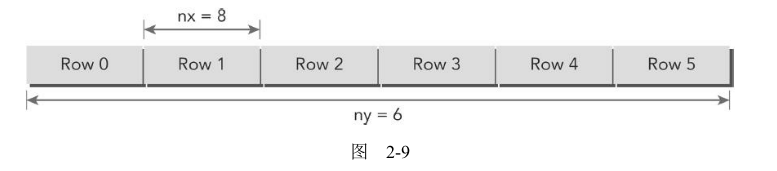
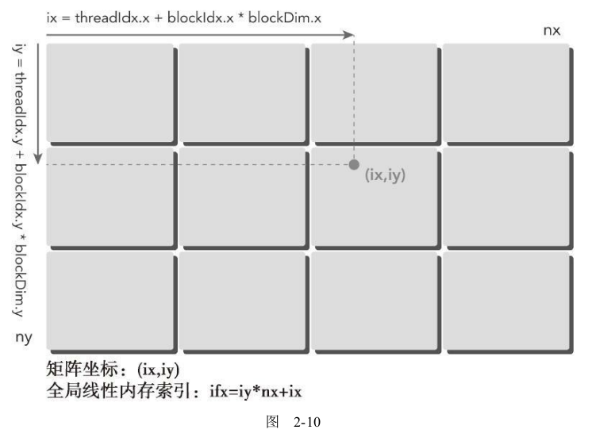
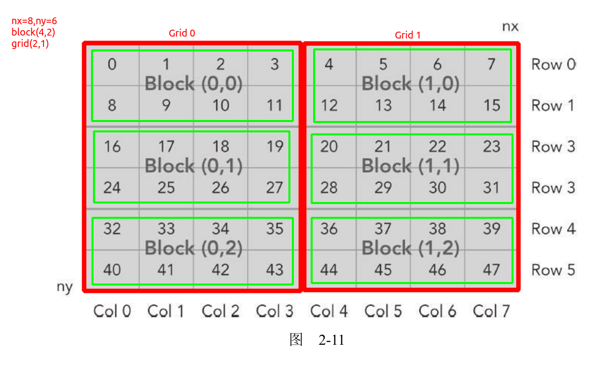
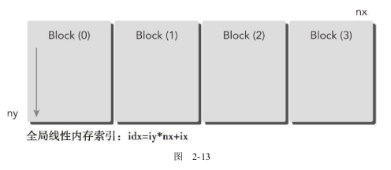
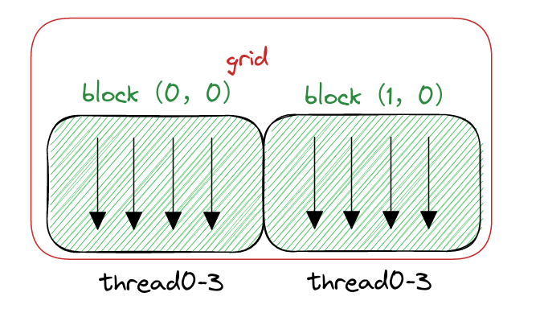
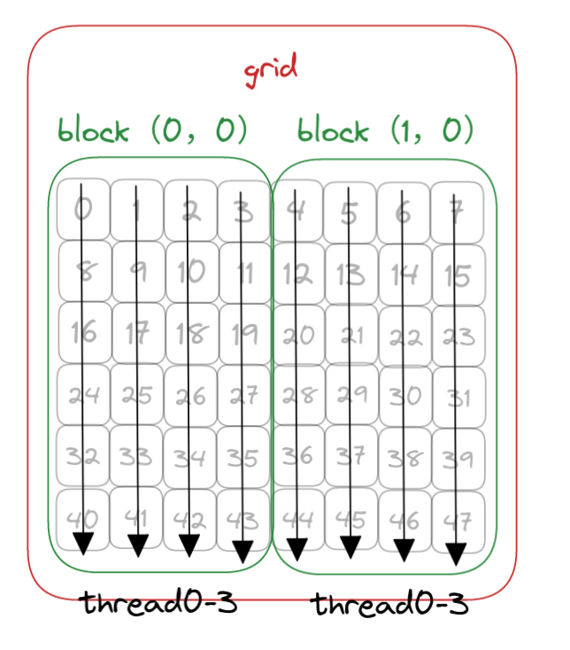
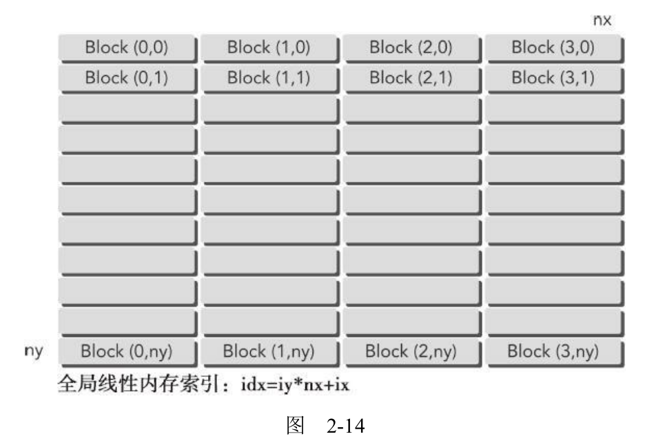

# 2.3 组织并行线程

从前面的例子可以看出，如果使用了合适的网格和块大小来正确地组织线程，那么可以对内核性能产生很大的影响。在向量加法的例子中，为了实现最佳性能我们调整了块的大小，并基于块大小和向量数据大小计算出了网格大小。
现在通过一个矩阵加法的例子来进一步说明这一点。

## 2.3.1 使用块和线程建立矩阵索引

**通常情况下，一个矩阵用行优先的方法在全局内存中进行线性存储**（最简单）。图2-9所示的是一个8×6矩阵的小例子。
在一个矩阵加法核函数中，**一个线程通常被分配一个数据元素来处理**。首先要完成的任务是使用块和线程索引**从全局内存中访问指定的数据**。通常情况下，对一个二维示例来说，需要管理3种索引：



* 线程和块索引
* 矩阵中给定点的坐标
* 全局线性内存中的偏移量

图2-10说明了块和线程索引、矩阵坐标以及线性全局内存索引之间的对应关系。

内存的索引代码如下

```c
__global__ void printThreadIndex(int *A, const int nx, const int ny)
{
    int ix = threadIdx.x + blockIdx.x * blockDim.x;
    int iy = threadIdx.y + blockIdx.y * blockDim.y;
    unsigned int idx = iy * nx + ix;//内存位置的索引

    printf("thread_id (%d,%d) block_id (%d,%d) coordinate (%d,%d) global index"
           " %2d ival %2d\n", threadIdx.x, threadIdx.y, blockIdx.x, blockIdx.y,
           ix, iy, idx, A[idx]);
}
```




由于我们测试的是8*6的矩阵（内存的内容和内存索引设定相同，方便分析），

* nx=8 ny=6 也就是`8*6`的矩阵
* block 设定为（4，2），也就是一个block在x方向上有4个线程，在y方向上有2个线程
* grid计算得出（2，1），也就是一个grid在x方向上有2个block，在y方向上有1个block
* **一个线程对应一个内存地址计算**

注意：下图中红色框是grid的索引（图中描述的不太合适，意思就是grid在x方向上有2个block索引，在y方向上有一个索引）。绿色框是block的索引（图中描述的不太合适，意思就是block在x方向上有4个thread索引，在y方向上有2个thread索引）。需要注意的是内存的排列，**例如block（0，0）中线程对应的内存索引的是0,1,2,3和8,9,10,11，而不是0,1,2,3,4,5,6,7**。下面会有程序的测试结果



下面的代码打印了对应的索引

```C
//chapter02/checkThreadIndex.cu
#include "../common/common.h"
#include <cuda_runtime.h>
#include <stdio.h>

/*
 * This example helps to visualize the relationship between thread/block IDs and
 * offsets into data. For each CUDA thread, this example displays the
 * intra-block thread ID, the inter-block block ID, the global coordinate of a
 * thread, the calculated offset into input data, and the input data at that
 * offset.
 */

void printMatrix(int *C, const int nx, const int ny)
{
    int *ic = C;
    printf("\nMatrix: (%d.%d)\n", nx, ny);

    for (int iy = 0; iy < ny; iy++)
    {
        for (int ix = 0; ix < nx; ix++)
        {
            printf("%3d", ic[ix]);

        }

        ic += nx;
        printf("\n");
    }

    printf("\n");
    return;
}

__global__ void printThreadIndex(int *A, const int nx, const int ny)
{
    int ix = threadIdx.x + blockIdx.x * blockDim.x;
    int iy = threadIdx.y + blockIdx.y * blockDim.y;
    unsigned int idx = iy * nx + ix;//内存位置的索引

    printf("thread_id (%d,%d) block_id (%d,%d) coordinate (%d,%d) global index"
           " %2d ival %2d\n", threadIdx.x, threadIdx.y, blockIdx.x, blockIdx.y,
           ix, iy, idx, A[idx]);
}

int main(int argc, char **argv)
{
    printf("%s Starting...\n", argv[0]);

    // get device information
    int dev = 0;
    cudaDeviceProp deviceProp;
    CHECK(cudaGetDeviceProperties(&deviceProp, dev));
    printf("Using Device %d: %s\n", dev, deviceProp.name);
    CHECK(cudaSetDevice(dev));

    // set matrix dimension
    int nx = 8;
    int ny = 6;
    int nxy = nx * ny;
    int nBytes = nxy * sizeof(float);

    // malloc host memory
    int *h_A;
    h_A = (int *)malloc(nBytes);

    // iniitialize host matrix with integer
    for (int i = 0; i < nxy; i++)
    {
        h_A[i] = i;
    }
    printMatrix(h_A, nx, ny);

    // malloc device memory
    int *d_MatA;
    CHECK(cudaMalloc((void **)&d_MatA, nBytes));

    // transfer data from host to device
    CHECK(cudaMemcpy(d_MatA, h_A, nBytes, cudaMemcpyHostToDevice));

    // set up execution configuration
    dim3 block(4, 2);
    dim3 grid((nx + block.x - 1) / block.x, (ny + block.y - 1) / block.y);//(2,1)  nx=8 ny=6

    // invoke the kernel
    printThreadIndex<<<grid, block>>>(d_MatA, nx, ny);
    CHECK(cudaGetLastError());

    // free host and devide memory
    CHECK(cudaFree(d_MatA));
    free(h_A);

    // reset device
    CHECK(cudaDeviceReset());

    return (0);
}

```

结果如下：

```shell
./checkThreadIndex Starting...
Using Device 0: Quadro P2000

Matrix: (8.6)
  0  1  2  3  4  5  6  7
  8  9 10 11 12 13 14 15
 16 17 18 19 20 21 22 23
 24 25 26 27 28 29 30 31
 32 33 34 35 36 37 38 39
 40 41 42 43 44 45 46 47

thread_id (0,0) block_id (0,1) coordinate (0,2) global index 16 ival 16
thread_id (1,0) block_id (0,1) coordinate (1,2) global index 17 ival 17
thread_id (2,0) block_id (0,1) coordinate (2,2) global index 18 ival 18
thread_id (3,0) block_id (0,1) coordinate (3,2) global index 19 ival 19
thread_id (0,1) block_id (0,1) coordinate (0,3) global index 24 ival 24
thread_id (1,1) block_id (0,1) coordinate (1,3) global index 25 ival 25
thread_id (2,1) block_id (0,1) coordinate (2,3) global index 26 ival 26
thread_id (3,1) block_id (0,1) coordinate (3,3) global index 27 ival 27
thread_id (0,0) block_id (0,0) coordinate (0,0) global index  0 ival  0 
thread_id (1,0) block_id (0,0) coordinate (1,0) global index  1 ival  1 
thread_id (2,0) block_id (0,0) coordinate (2,0) global index  2 ival  2 
thread_id (3,0) block_id (0,0) coordinate (3,0) global index  3 ival  3 
thread_id (0,1) block_id (0,0) coordinate (0,1) global index  8 ival  8 
thread_id (1,1) block_id (0,0) coordinate (1,1) global index  9 ival  9 
thread_id (2,1) block_id (0,0) coordinate (2,1) global index 10 ival 10 
thread_id (3,1) block_id (0,0) coordinate (3,1) global index 11 ival 11 
thread_id (0,0) block_id (0,2) coordinate (0,4) global index 32 ival 32
thread_id (1,0) block_id (0,2) coordinate (1,4) global index 33 ival 33
thread_id (2,0) block_id (0,2) coordinate (2,4) global index 34 ival 34
thread_id (3,0) block_id (0,2) coordinate (3,4) global index 35 ival 35
thread_id (0,1) block_id (0,2) coordinate (0,5) global index 40 ival 40
thread_id (1,1) block_id (0,2) coordinate (1,5) global index 41 ival 41
thread_id (2,1) block_id (0,2) coordinate (2,5) global index 42 ival 42
thread_id (3,1) block_id (0,2) coordinate (3,5) global index 43 ival 43
thread_id (0,0) block_id (1,1) coordinate (4,2) global index 20 ival 20
thread_id (1,0) block_id (1,1) coordinate (5,2) global index 21 ival 21
thread_id (2,0) block_id (1,1) coordinate (6,2) global index 22 ival 22
thread_id (3,0) block_id (1,1) coordinate (7,2) global index 23 ival 23
thread_id (0,1) block_id (1,1) coordinate (4,3) global index 28 ival 28
thread_id (1,1) block_id (1,1) coordinate (5,3) global index 29 ival 29
thread_id (2,1) block_id (1,1) coordinate (6,3) global index 30 ival 30
thread_id (3,1) block_id (1,1) coordinate (7,3) global index 31 ival 31
thread_id (0,0) block_id (1,0) coordinate (4,0) global index  4 ival  4
thread_id (1,0) block_id (1,0) coordinate (5,0) global index  5 ival  5
thread_id (2,0) block_id (1,0) coordinate (6,0) global index  6 ival  6
thread_id (3,0) block_id (1,0) coordinate (7,0) global index  7 ival  7
thread_id (0,1) block_id (1,0) coordinate (4,1) global index 12 ival 12
thread_id (1,1) block_id (1,0) coordinate (5,1) global index 13 ival 13
thread_id (2,1) block_id (1,0) coordinate (6,1) global index 14 ival 14
thread_id (3,1) block_id (1,0) coordinate (7,1) global index 15 ival 15
thread_id (0,0) block_id (1,2) coordinate (4,4) global index 36 ival 36
thread_id (1,0) block_id (1,2) coordinate (5,4) global index 37 ival 37
thread_id (2,0) block_id (1,2) coordinate (6,4) global index 38 ival 38
thread_id (3,0) block_id (1,2) coordinate (7,4) global index 39 ival 39
thread_id (0,1) block_id (1,2) coordinate (4,5) global index 44 ival 44
thread_id (1,1) block_id (1,2) coordinate (5,5) global index 45 ival 45
thread_id (2,1) block_id (1,2) coordinate (6,5) global index 46 ival 46
thread_id (3,1) block_id (1,2) coordinate (7,5) global index 47 ival 47
```

以第一个block（0，0）为例，可以看到内存索引的确是0,1,2,3,8,9,10,11

```shell
thread_id (0,0) block_id (0,0) coordinate (0,0) global index  0 ival  0 
thread_id (1,0) block_id (0,0) coordinate (1,0) global index  1 ival  1 
thread_id (2,0) block_id (0,0) coordinate (2,0) global index  2 ival  2 
thread_id (3,0) block_id (0,0) coordinate (3,0) global index  3 ival  3 
thread_id (0,1) block_id (0,0) coordinate (0,1) global index  8 ival  8 
thread_id (1,1) block_id (0,0) coordinate (1,1) global index  9 ival  9 
thread_id (2,1) block_id (0,0) coordinate (2,1) global index 10 ival 10 
thread_id (3,1) block_id (0,0) coordinate (3,1) global index 11 ival 11
```

## 2.3.2 使用二维网格和二维块对矩阵求和

有了上面一节的内存索引，就可以计算两个矩阵的和了。和上一节的kernel几乎一样，也是索引到内存，但是多了一步数组相加的代码如下：

```C
// grid 2D block 2D
__global__ void sumMatrixOnGPU2D(float *MatA, float *MatB, float *MatC, int nx,
                                 int ny)
{
    unsigned int ix = threadIdx.x + blockIdx.x * blockDim.x;
    unsigned int iy = threadIdx.y + blockIdx.y * blockDim.y;
    unsigned int idx = iy * nx + ix;//内存索引

    if (ix < nx && iy < ny)//新增 数组相加
        MatC[idx] = MatA[idx] + MatB[idx];
}
```

另外修改了矩阵和block的维度

```C
    // set up data size of matrix
    int nx = 1 << 14;
    int ny = 1 << 14;
	/*....*/
    // invoke kernel at host side
    int dimx = 32;
    int dimy = 32;
    dim3 block(dimx, dimy);
    dim3 grid((nx + block.x - 1) / block.x, (ny + block.y - 1) / block.y);

```

程序完成代码如下：

```C
//sumMatrixOnGPU-2D-grid-2D-block.cu
#include "../common/common.h"
#include <cuda_runtime.h>
#include <stdio.h>

/*
 * This example demonstrates a simple vector sum on the GPU and on the host.
 * sumArraysOnGPU splits the work of the vector sum across CUDA threads on the
 * GPU. A 2D thread block and 2D grid are used. sumArraysOnHost sequentially
 * iterates through vector elements on the host.
 */

void initialData(float *ip, const int size)
{
    int i;

    for(i = 0; i < size; i++)
    {
        ip[i] = (float)(rand() & 0xFF) / 10.0f;
    }

    return;
}

void sumMatrixOnHost(float *A, float *B, float *C, const int nx,
                     const int ny)
{
    float *ia = A;
    float *ib = B;
    float *ic = C;

    for (int iy = 0; iy < ny; iy++)
    {
        for (int ix = 0; ix < nx; ix++)
        {
            ic[ix] = ia[ix] + ib[ix];

        }

        ia += nx;
        ib += nx;
        ic += nx;
    }

    return;
}


void checkResult(float *hostRef, float *gpuRef, const int N)
{
    double epsilon = 1.0E-8;
    bool match = 1;

    for (int i = 0; i < N; i++)
    {
        if (abs(hostRef[i] - gpuRef[i]) > epsilon)
        {
            match = 0;
            printf("host %f gpu %f\n", hostRef[i], gpuRef[i]);
            break;
        }
    }

    if (match)
        printf("Arrays match.\n\n");
    else
        printf("Arrays do not match.\n\n");
}

// grid 2D block 2D
__global__ void sumMatrixOnGPU2D(float *MatA, float *MatB, float *MatC, int nx,
                                 int ny)
{
    unsigned int ix = threadIdx.x + blockIdx.x * blockDim.x;
    unsigned int iy = threadIdx.y + blockIdx.y * blockDim.y;
    unsigned int idx = iy * nx + ix;

    if (ix < nx && iy < ny)
        MatC[idx] = MatA[idx] + MatB[idx];
}

int main(int argc, char **argv)
{
    printf("%s Starting...\n", argv[0]);

    // set up device
    int dev = 0;
    cudaDeviceProp deviceProp;
    CHECK(cudaGetDeviceProperties(&deviceProp, dev));
    printf("Using Device %d: %s\n", dev, deviceProp.name);
    CHECK(cudaSetDevice(dev));

    // set up data size of matrix
    int nx = 1 << 14;
    int ny = 1 << 14;

    int nxy = nx * ny;
    int nBytes = nxy * sizeof(float);
    printf("Matrix size: nx %d ny %d\n", nx, ny);

    // malloc host memory
    float *h_A, *h_B, *hostRef, *gpuRef;
    h_A = (float *)malloc(nBytes);
    h_B = (float *)malloc(nBytes);
    hostRef = (float *)malloc(nBytes);
    gpuRef = (float *)malloc(nBytes);

    // initialize data at host side
    double iStart = seconds();
    initialData(h_A, nxy);
    initialData(h_B, nxy);
    double iElaps = seconds() - iStart;
    printf("Matrix initialization elapsed %f sec\n", iElaps);

    memset(hostRef, 0, nBytes);
    memset(gpuRef, 0, nBytes);

    // add matrix at host side for result checks
    iStart = seconds();
    sumMatrixOnHost(h_A, h_B, hostRef, nx, ny);
    iElaps = seconds() - iStart;
    printf("sumMatrixOnHost elapsed %f sec\n", iElaps);

    // malloc device global memory
    float *d_MatA, *d_MatB, *d_MatC;
    CHECK(cudaMalloc((void **)&d_MatA, nBytes));
    CHECK(cudaMalloc((void **)&d_MatB, nBytes));
    CHECK(cudaMalloc((void **)&d_MatC, nBytes));

    // transfer data from host to device
    CHECK(cudaMemcpy(d_MatA, h_A, nBytes, cudaMemcpyHostToDevice));
    CHECK(cudaMemcpy(d_MatB, h_B, nBytes, cudaMemcpyHostToDevice));

    // invoke kernel at host side
    int dimx = 32;
    int dimy = 32;
    dim3 block(dimx, dimy);
    dim3 grid((nx + block.x - 1) / block.x, (ny + block.y - 1) / block.y);

    iStart = seconds();
    sumMatrixOnGPU2D<<<grid, block>>>(d_MatA, d_MatB, d_MatC, nx, ny);
    CHECK(cudaDeviceSynchronize());
    iElaps = seconds() - iStart;
    printf("sumMatrixOnGPU2D <<<(%d,%d), (%d,%d)>>> elapsed %f sec\n", grid.x,
           grid.y,
           block.x, block.y, iElaps);
    // check kernel error
    CHECK(cudaGetLastError());

    // copy kernel result back to host side
    CHECK(cudaMemcpy(gpuRef, d_MatC, nBytes, cudaMemcpyDeviceToHost));

    // check device results
    checkResult(hostRef, gpuRef, nxy);

    // free device global memory
    CHECK(cudaFree(d_MatA));
    CHECK(cudaFree(d_MatB));
    CHECK(cudaFree(d_MatC));

    // free host memory
    free(h_A);
    free(h_B);
    free(hostRef);
    free(gpuRef);

    // reset device
    CHECK(cudaDeviceReset());

    return (0);
}

```

编译运行如下

```shell
./sumMatrixOnGPU-2D-grid-2D-block
./sumMatrixOnGPU-2D-grid-2D-block Starting...
Using Device 0: Quadro P2000
Matrix size: nx 16384 ny 16384
Matrix initialization elapsed 8.372224 sec
sumMatrixOnHost elapsed 0.252538 sec
sumMatrixOnGPU2D <<<(512,512), (32,32)>>> elapsed 0.027212 sec
Arrays match.
```

书中修改了bloc大小为（32，16）性能翻了一倍，但是我自己测试变化不大，但是有一个结论就是**不同的block和grid配置会影响到核函数的性能。**

## 2.3.3 使用一维网格和一维块对矩阵求和

前面两节都是二维网格二维块来计算二维的矩阵，比较好理解。

为了使用一维网格和一维块，你需要写一个新的核函数，其中每个线程处理ny个数据元素，如图2-13所示。



下图假如矩阵还是8*6

* nx=8 ny=6 也就是`8*6`的矩阵
* block 设定为（4，1）
* grid计算得出（2，1）
* **与上面两节不同，一个线程需要计算6个内存的数据**
* **下图中黑色的箭头代表一个线程，每个block有4个线程**
* **灰色的数字是内存的内容，一个线程（箭头）处理6个数据，例如第一个线程处理的就是0,8,16,54,32,40共6个数据**
* **绿色为一个block，红色为grid**





对应的核函数代码为

```C
// grid 1D block 1D
__global__ void sumMatrixOnGPU1D(float *MatA, float *MatB, float *MatC, int nx,int ny)
{
    unsigned int ix = threadIdx.x + blockIdx.x * blockDim.x;

    if (ix < nx )
        for (int iy = 0; iy < ny; iy++)//这里如果是8*6的矩阵 那么ny=6，这一个核函数处理6个数据
        {
            int idx = iy * nx + ix;
            MatC[idx] = MatA[idx] + MatB[idx];
        }
}
```

完整的代码修改了数据的维度和block的维度

```C
//chapter02/sumMatrixOnGPU-1D-grid-1D-block.cu
#include "../common/common.h"
#include <cuda_runtime.h>
#include <stdio.h>

/*
 * This example demonstrates a simple vector sum on the GPU and on the host.
 * sumArraysOnGPU splits the work of the vector sum across CUDA threads on the
 * GPU. A 1D thread block and 1D grid are used. sumArraysOnHost sequentially
 * iterates through vector elements on the host.
 */

void initialData(float *ip, const int size)
{
    int i;

    for(i = 0; i < size; i++)
    {
        ip[i] = (float)(rand() & 0xFF ) / 10.0f;
    }

    return;
}

void sumMatrixOnHost(float *A, float *B, float *C, const int nx,
                     const int ny)
{
    float *ia = A;
    float *ib = B;
    float *ic = C;

    for (int iy = 0; iy < ny; iy++)
    {
        for (int ix = 0; ix < nx; ix++)
        {
            ic[ix] = ia[ix] + ib[ix];

        }

        ia += nx;
        ib += nx;
        ic += nx;
    }

    return;
}


void checkResult(float *hostRef, float *gpuRef, const int N)
{
    double epsilon = 1.0E-8;
    bool match = 1;

    for (int i = 0; i < N; i++)
    {
        if (abs(hostRef[i] - gpuRef[i]) > epsilon)
        {
            match = 0;
            printf("host %f gpu %f\n", hostRef[i], gpuRef[i]);
            break;
        }
    }

    if (match)
        printf("Arrays match.\n\n");
    else
        printf("Arrays do not match.\n\n");
}

// grid 1D block 1D
__global__ void sumMatrixOnGPU1D(float *MatA, float *MatB, float *MatC, int nx,
                                 int ny)
{
    unsigned int ix = threadIdx.x + blockIdx.x * blockDim.x;

    if (ix < nx )
        for (int iy = 0; iy < ny; iy++)
        {
            int idx = iy * nx + ix;
            MatC[idx] = MatA[idx] + MatB[idx];
        }


}

int main(int argc, char **argv)
{
    printf("%s Starting...\n", argv[0]);

    // set up device
    int dev = 0;
    cudaDeviceProp deviceProp;
    CHECK(cudaGetDeviceProperties(&deviceProp, dev));
    printf("Using Device %d: %s\n", dev, deviceProp.name);
    CHECK(cudaSetDevice(dev));

    // set up data size of matrix
    int nx = 1 << 14;
    int ny = 1 << 14;

    int nxy = nx * ny;
    int nBytes = nxy * sizeof(float);
    printf("Matrix size: nx %d ny %d\n", nx, ny);

    // malloc host memory
    float *h_A, *h_B, *hostRef, *gpuRef;
    h_A = (float *)malloc(nBytes);
    h_B = (float *)malloc(nBytes);
    hostRef = (float *)malloc(nBytes);
    gpuRef = (float *)malloc(nBytes);

    // initialize data at host side
    double iStart = seconds();
    initialData(h_A, nxy);
    initialData(h_B, nxy);
    double iElaps = seconds() - iStart;
    printf("initialize matrix elapsed %f sec\n", iElaps);

    memset(hostRef, 0, nBytes);
    memset(gpuRef, 0, nBytes);

    // add matrix at host side for result checks
    iStart = seconds();
    sumMatrixOnHost(h_A, h_B, hostRef, nx, ny);
    iElaps = seconds() - iStart;
    printf("sumMatrixOnHost elapsed %f sec\n", iElaps);

    // malloc device global memory
    float *d_MatA, *d_MatB, *d_MatC;
    CHECK(cudaMalloc((void **)&d_MatA, nBytes));
    CHECK(cudaMalloc((void **)&d_MatB, nBytes));
    CHECK(cudaMalloc((void **)&d_MatC, nBytes));

    // transfer data from host to device
    CHECK(cudaMemcpy(d_MatA, h_A, nBytes, cudaMemcpyHostToDevice));
    CHECK(cudaMemcpy(d_MatB, h_B, nBytes, cudaMemcpyHostToDevice));

    // invoke kernel at host side
    int dimx = 32;
    dim3 block(dimx, 1);
    dim3 grid((nx + block.x - 1) / block.x, 1);

    iStart = seconds();
    sumMatrixOnGPU1D<<<grid, block>>>(d_MatA, d_MatB, d_MatC, nx, ny);
    CHECK(cudaDeviceSynchronize());
    iElaps = seconds() - iStart;
    printf("sumMatrixOnGPU1D <<<(%d,%d), (%d,%d)>>> elapsed %f sec\n", grid.x,
           grid.y,
           block.x, block.y, iElaps);

    // check kernel error
    CHECK(cudaGetLastError());

    // copy kernel result back to host side
    CHECK(cudaMemcpy(gpuRef, d_MatC, nBytes, cudaMemcpyDeviceToHost));

    // check device results
    checkResult(hostRef, gpuRef, nxy);

    // free device global memory
    CHECK(cudaFree(d_MatA));
    CHECK(cudaFree(d_MatB));
    CHECK(cudaFree(d_MatC));

    // free host memory
    free(h_A);
    free(h_B);
    free(hostRef);
    free(gpuRef);

    // reset device
    CHECK(cudaDeviceReset());

    return (0);
}

```

运行结果如下

```shell
./sumMatrixOnGPU-1D-grid-1D-block
./sumMatrixOnGPU-1D-grid-1D-block Starting...
Using Device 0: Quadro P2000
Matrix size: nx 16384 ny 16384
initialize matrix elapsed 8.340747 sec
sumMatrixOnHost elapsed 0.249155 sec
sumMatrixOnGPU1D <<<(512,1), (32,1)>>> elapsed 0.028243 sec
Arrays match.
```

## 2.3.4 使用二维网格和一维块对矩阵求和

这可以看作是含有一个二维块的二维网格的特殊情况，其中块的第二个维数是1。因此，从块和线程索引到矩阵坐标的映射就变成：



* **一个线程对应一个内存地址计算**

核函数代码为

```C
// grid 2D block 1D
__global__ void sumMatrixOnGPUMix(float *MatA, float *MatB, float *MatC, int nx,
                                  int ny)
{
    unsigned int ix = threadIdx.x + blockIdx.x * blockDim.x;
    unsigned int iy = blockIdx.y;
    unsigned int idx = iy * nx + ix;

    if (ix < nx && iy < ny)
        MatC[idx] = MatA[idx] + MatB[idx];
}
```

完整代码如下：

```C
#include "../common/common.h"
#include <cuda_runtime.h>
#include <stdio.h>

/*
 * This example demonstrates a simple vector sum on the GPU and on the host.
 * sumArraysOnGPU splits the work of the vector sum across CUDA threads on the
 * GPU. A 1D thread block and 2D grid are used. sumArraysOnHost sequentially
 * iterates through vector elements on the host.
 */

void initialData(float *ip, const int size)
{
    int i;

    for(i = 0; i < size; i++)
    {
        ip[i] = (float)(rand() & 0xFF) / 10.0f;
    }

    return;
}

void sumMatrixOnHost(float *A, float *B, float *C, const int nx,
                     const int ny)
{
    float *ia = A;
    float *ib = B;
    float *ic = C;

    for (int iy = 0; iy < ny; iy++)
    {
        for (int ix = 0; ix < nx; ix++)
        {
            ic[ix] = ia[ix] + ib[ix];

        }

        ia += nx;
        ib += nx;
        ic += nx;
    }

    return;
}


void checkResult(float *hostRef, float *gpuRef, const int N)
{
    double epsilon = 1.0E-8;
    bool match = 1;

    for (int i = 0; i < N; i++)
    {
        if (abs(hostRef[i] - gpuRef[i]) > epsilon)
        {
            match = 0;
            printf("host %f gpu %f\n", hostRef[i], gpuRef[i]);
            break;
        }
    }

    if (match)
        printf("Arrays match.\n\n");
    else
        printf("Arrays do not match.\n\n");
}

// grid 2D block 1D
__global__ void sumMatrixOnGPUMix(float *MatA, float *MatB, float *MatC, int nx,
                                  int ny)
{
    unsigned int ix = threadIdx.x + blockIdx.x * blockDim.x;
    unsigned int iy = blockIdx.y;
    unsigned int idx = iy * nx + ix;

    if (ix < nx && iy < ny)
        MatC[idx] = MatA[idx] + MatB[idx];
}

int main(int argc, char **argv)
{
    printf("%s Starting...\n", argv[0]);

    // set up device
    int dev = 0;
    cudaDeviceProp deviceProp;
    CHECK(cudaGetDeviceProperties(&deviceProp, dev));
    printf("Using Device %d: %s\n", dev, deviceProp.name);
    CHECK(cudaSetDevice(dev));

    // set up data size of matrix
    int nx = 1 << 14;
    int ny = 1 << 14;

    int nxy = nx * ny;
    int nBytes = nxy * sizeof(float);
    printf("Matrix size: nx %d ny %d\n", nx, ny);

    // malloc host memory
    float *h_A, *h_B, *hostRef, *gpuRef;
    h_A = (float *)malloc(nBytes);
    h_B = (float *)malloc(nBytes);
    hostRef = (float *)malloc(nBytes);
    gpuRef = (float *)malloc(nBytes);

    // initialize data at host side
    double iStart = seconds();
    initialData(h_A, nxy);
    initialData(h_B, nxy);
    double iElaps = seconds() - iStart;
    printf("Matrix initialization elapsed %f sec\n", iElaps);

    memset(hostRef, 0, nBytes);
    memset(gpuRef, 0, nBytes);

    // add matrix at host side for result checks
    iStart = seconds();
    sumMatrixOnHost(h_A, h_B, hostRef, nx, ny);
    iElaps = seconds() - iStart;
    printf("sumMatrixOnHost elapsed %f sec\n", iElaps);

    // malloc device global memory
    float *d_MatA, *d_MatB, *d_MatC;
    CHECK(cudaMalloc((void **)&d_MatA, nBytes));
    CHECK(cudaMalloc((void **)&d_MatB, nBytes));
    CHECK(cudaMalloc((void **)&d_MatC, nBytes));

    // transfer data from host to device
    CHECK(cudaMemcpy(d_MatA, h_A, nBytes, cudaMemcpyHostToDevice));
    CHECK(cudaMemcpy(d_MatB, h_B, nBytes, cudaMemcpyHostToDevice));

    // invoke kernel at host side
    int dimx = 32;
    dim3 block(dimx, 1);
    dim3 grid((nx + block.x - 1) / block.x, ny);

    iStart = seconds();
    sumMatrixOnGPUMix<<<grid, block>>>(d_MatA, d_MatB, d_MatC, nx, ny);
    CHECK(cudaDeviceSynchronize());
    iElaps = seconds() - iStart;
    printf("sumMatrixOnGPU2D <<<(%d,%d), (%d,%d)>>> elapsed %f sec\n", grid.x,
           grid.y,
           block.x, block.y, iElaps);
    // check kernel error
    CHECK(cudaGetLastError());

    // copy kernel result back to host side
    CHECK(cudaMemcpy(gpuRef, d_MatC, nBytes, cudaMemcpyDeviceToHost));

    // check device results
    checkResult(hostRef, gpuRef, nxy);

    // free device global memory
    CHECK(cudaFree(d_MatA));
    CHECK(cudaFree(d_MatB));
    CHECK(cudaFree(d_MatC));

    // free host memory
    free(h_A);
    free(h_B);
    free(hostRef);
    free(gpuRef);

    // reset device
    CHECK(cudaDeviceReset());

    return (0);
}

```

运行结果如下

```shell
 ./sumMatrixOnGPU-2D-grid-1D-block
./sumMatrixOnGPU-2D-grid-1D-block Starting...
Using Device 0: Quadro P2000
Matrix size: nx 16384 ny 16384
Matrix initialization elapsed 8.361603 sec
sumMatrixOnHost elapsed 0.249986 sec
sumMatrixOnGPU2D <<<(512,16384), (32,1)>>> elapsed 0.044010 sec
Arrays match.
```

对比上面两节的结果

```shell
zmurder@zmurder:~/WorkSpace/zyd/note/cuda/CUDA C编程权威指南/CUDAC编程权威指南练习code/chapter02$ ./sumMatrixOnGPU-2D-grid-2D-block
./sumMatrixOnGPU-2D-grid-2D-block Starting...
Using Device 0: Quadro P2000
Matrix size: nx 16384 ny 16384
Matrix initialization elapsed 8.377004 sec
sumMatrixOnHost elapsed 0.256111 sec
sumMatrixOnGPU2D <<<(512,1024), (32,16)>>> elapsed 0.026595 sec
Arrays match.

zmurder@zmurder:~/WorkSpace/zyd/note/cuda/CUDA C编程权威指南/CUDAC编程权威指南练习code/chapter02$ ./sumMatrixOnGPU-1D-grid-1D-block
./sumMatrixOnGPU-1D-grid-1D-block Starting...
Using Device 0: Quadro P2000
Matrix size: nx 16384 ny 16384
initialize matrix elapsed 8.340747 sec
sumMatrixOnHost elapsed 0.249155 sec
sumMatrixOnGPU1D <<<(512,1), (32,1)>>> elapsed 0.028243 sec
Arrays match.

zmurder@zmurder:~/WorkSpace/zyd/note/cuda/CUDA C编程权威指南/CUDAC编程权威指南练习code/chapter02$ ./sumMatrixOnGPU-2D-grid-1D-block
./sumMatrixOnGPU-2D-grid-1D-block Starting...
Using Device 0: Quadro P2000
Matrix size: nx 16384 ny 16384
Matrix initialization elapsed 8.361603 sec
sumMatrixOnHost elapsed 0.249986 sec
sumMatrixOnGPU2D <<<(512,16384), (32,1)>>> elapsed 0.044010 sec
Arrays match.

zmurder@zmurder:~/WorkSpace/zyd/note/cuda/CUDA C编程权威指南/CUDAC编程权威指南练习code/chapter02$ 
```

从矩阵加法的例子中可以看出：

* 改变执行配置对内核性能有影响
* 传统的核函数实现一般不能获得最佳性能
* 对于一个给定的核函数，尝试使用不同的网格和线程块大小可以获得更好的性能

在第3章，将会从硬件的角度学习产生这些问题的原因。