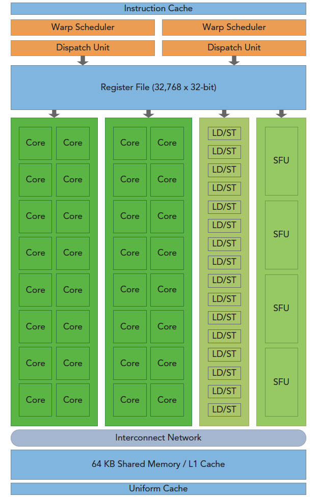
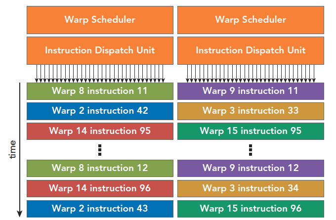
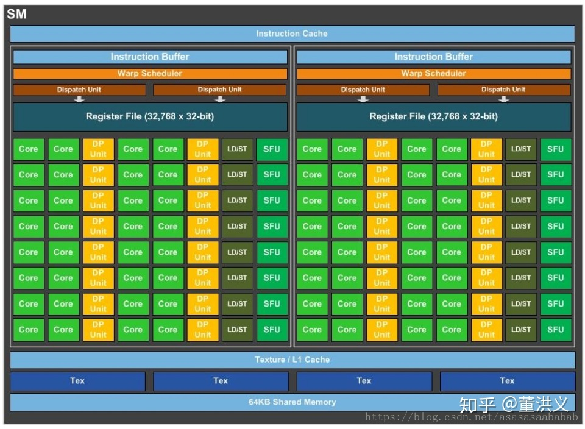

# 3.1 CUDA执行模型概述

前面使用了不同的block和grid来配置核函数，可以看出性能是有差异的，但是为什么会存在差异，如何选择最合适的参数呢？这一章就是解释这些内容。

在第2章里，已经介绍了CUDA编程模型中两个主要的抽象概念：内存层次结构和线程层次结构。在本章会重点介绍指令吞吐量，在第4章和第5章里会介绍更多的关于高效内存访问的内容。

## 3.1.1 GPU架构概述

GPU架构是围绕一个流式多处理器（SM）的可扩展阵列搭建的。可以通过复制这种架构的构建块来实现GPU的硬件并行。也就一堆的SM堆出来的。

上图3-1说明了Fermi SM的关键组件：

* CUDA核心
* 共享内存/一级缓存
* 寄存器文件
* 加载/存储单元
* 特殊功能单元
* 线程束调度器

GPU中的每一个SM都能支持数百个线程并发执行

每个GPU通常有多个SM，所以在一个GPU上并发执行数千个线程是有可能的。

**当启动一个内核网格时，它的线程块被分布在了可用的SM上来执行。线程块一旦被调度到一个SM上，其中的线程只会在那个指定的SM上并发执行**。

**多个线程块可能会被分配到同一个SM上**，而且是根据SM资源的可用性进行调度的。

* CUDA采用单指令多线程（SIMT）架构来管理和执行线程，**每32个线程为一组，被称为线程束（warp）**。
* **线程束中的所有线程同时执行相同的指令**。每个线程都有自己的指令地址计数器和寄存器状态，利用自身的数据执行当前的指令。
* 每个SM都将分配给它的线程块划分到包含32个线程的线程束中，然后在可用的硬件资源上调度执行。
* **一个线程块只能在一个SM上被调度**。一旦线程块在一个SM上被调度，就会保存在该SM上直到执行完成。在同一时间，一个SM可以容纳多个线程块。

在SM中，**共享内存和寄存器是非常重要的资源**。共享内存被分配在SM上的常驻线程块中，寄存器在线程中被分配。线程块中的线程通过这些资源可以进行相互的合作和通信。
尽管线程块里的所有线程都可以逻辑地并行运行，但是并不是所有线程都可以同时在物理层面执行。因此，**线程块里的不同线程可能会以不同的速度前进**。

**SM：GPU架构的核心**
SM是GPU架构的核心。寄存器和共享内存是SM中的稀缺资源。CUDA将这些资源分配到SM中的所有常驻线程里。因此，这些有限的资源限制了在SM上活跃的线程束数量，活跃的线程束数量对应于SM上的并行量。

## 3.1.2 Fermi架构

Fermi架构是第一个完整的GPU计算架构。

* Fermi的特征是多达512个加速器核心，这被称为CUDA核心。
* 每个CUDA核心都有一个全流水线的整数算术逻辑单元（ALU）和一个浮点运算单元（FPU），在这里每个时钟周期执行一个整数或是浮点数指令。
* CUDA核心被组织到16个SM中，每一个SM含有32个CUDA核心。
* Fermi架构有6个384位的GDDR5 DRAM存储器接口，支持多达6GB的全局机载内存，这是许多应用程序关键的计算资源。
* 主机接口通过PCIe总线将GPU与CPU相连。GigaThread引擎（图示左侧第三部分）是一个全局调度器，用来分配线程块到SM线程束调度器上。
* Fermi架构包含一个耦合的768 KB的二级缓存，被16个SM所共享。

在上图中在图3-3中，一个垂直矩形条表示一个SM，包含了以下内容：

* 执行单元（CUDA核心）
* 调度线程束的调度器和调度单元
* 共享内存、寄存器文件和一级缓存

每个SM有两个线程束调度器和两个指令调度单元。当一个线程块被指定给一个SM时，线程块中的所有线程被分成了线程束。**两个线程束调度器选择两个线程束，再把一个指令从线程束中发送到一个组上。**每个线程束在同一时间执行同一指令，同一个块内的线程束互相切换是没有时间消耗的

从表格“CUDA_Occupancy_Calculator.xls”中可以看到具体的值如下：

| Physical Limits for GPU Compute Capability:        | 2.0   |
| -------------------------------------------------- | ----- |
| Threads per Warp                                   | 32    |
| Max Warps per Multiprocessor                       | 48    |
| Max Thread Blocks per Multiprocessor               | 8     |
| Max Threads per Multiprocessor                     | 1536  |
| Maximum Thread Block Size                          | 1024  |
| Registers per Multiprocessor                       | 32768 |
| Max Registers per Thread Block                     | 32768 |
| Max Registers per Thread                           | 63    |
| Shared Memory per Multiprocessor (bytes)           | 49152 |
| Max Shared Memory per Block                        | 49152 |
| Register allocation unit size                      | #N/A  |
| Register allocation granularity                    | warp  |
| Shared Memory allocation unit size                 | 128   |
| Warp allocation granularity                        | 2     |
| Shared Memory Per Block (bytes) (CUDA runtime use) | 0     |

## 3.1.3 Kepler架构

kepler架构的最突出的一个特点就是内核可以启动内核了，这使得我们可以使用GPU完成简单的递归操作，流程如下。

## 3.1.4 配置文件驱动优化

CUDA提供了两个主要的性能分析工具：nvvp，独立的可视化分析器；nvprof，命令行分析器。

nvvp是可视化分析器，它可以可视化并优化CUDA程序的性能。

nvprof在命令行上收集和显示分析数据。

主要使用nvprof来提高内核性能。本书还介绍了如何选择合适的计数器和指标，并使用命令行中的nvprof来收集分析数据，以便用于设计优化策略。你还将会学习如何使用不同的计数器和指标，从多个角度分析内核。
有3种常见的限制内核性能的因素：

* 存储带宽
* 计算资源
* 指令和内存延迟

# 附录：

## GPU硬件架构

### SP

**SP（streaming processor）：**最基本的处理单元，也称为CUDA core。最后具体的指令和任务都是在SP上处理的。GPU进行并行计算，也就是很多个SP同时做处理。

### SM

**SM（streaming multiprocessor）：** **多个SP加上其他的一些资源组成一个SM，也叫GPU大核，其他资源如：warp scheduler，register，shared memory等**。SM可以看做GPU的心脏（对比CPU核心），register和shared memory是SM的稀缺资源。CUDA将这些资源分配给所有驻留在SM中的threads。因此，这些有限的资源就使每个SM中active  warps有非常严格的限制，也就限制了并行能力。如下图是一个SM的基本组成，其中每个绿色小块代表一个SP。

每个SM包含的SP数量依据GPU架构而不同，Fermi架构GF100是32个，GF10X是48个，Kepler架构都是192个，Maxwell都是128个。**当一个kernel启动后，thread会被分配到很多SM中执行。大量的thread可能会被分配到不同的SM，但是同一个block中的thread必然在同一个SM中并行执行。**

### Warp

多处理器multiprocessor以32个并行线程(称为warp)为一组来创建、管理、调度和执行线程。

warp中所有threads并行的执行相同的指令。由SM的硬件warp scheduler负责调度。目前每个warp包含32个threads。从一个执行上下文切换到另一个执行上下文没有任何成本，并且在每次指令发出时，warp调度器warp scheduler都会选择一个具有准备执行下一条指令的线程的warp (warp的活动线程the [active threads](https://docs.nvidia.com/cuda/cuda-c-programming-guide/index.html#simt-architecture-notes) of the warp)，并向这些线程发出指令。

参与当前指令的warp线程称为活动*active*线程，而不在当前指令上的线程称为非活动线程*inactive* (disabled)。

所以在分配grid和blocksize时的基本概念是

- 保证block中thread数目是32的倍数。这是因为同一个block必须在一个SM内，而SM的Warp调度是32个线程一组进行的。
- 避免block太小：每个blcok最少128或256个thread。
- 根据kernel需要的资源调整block，多做实验来挖掘最佳配置。
- 保证block的数目远大于SM的数目。