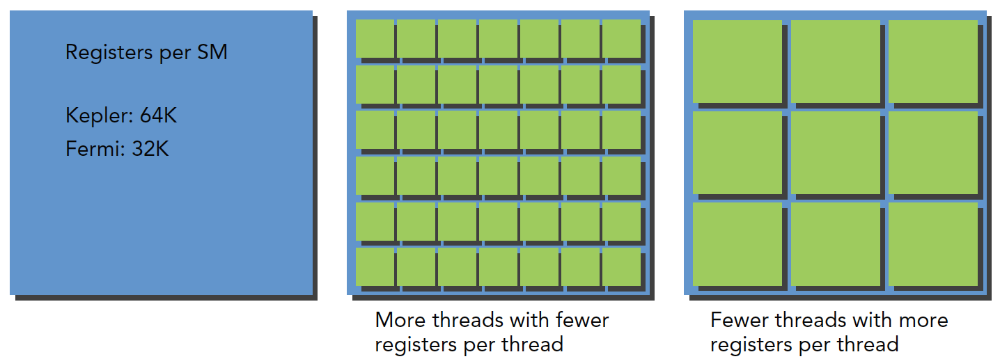

# 3.2 理解线程束执行的本质

启动内核时，从软件的角度你看到了什么？对于你来说，在内核中似乎所有的线程都是并行地运行的。在逻辑上这是正确的，**但从硬件的角度来看，不是所有线程在物理上都可以同时并行地执行**。本章已经提到了把32个线程划分到一个执行单元中的概念：线程束。

## 3.2.1 线程束和线程块

线程束是SM中基本的执行单元。当一个线程块的网格被启动后，网格中的**线程块分布在SM中**。一旦线程块被调度到一个SM上，**线程块中的线程会被进一步划分为线程束**。一个线程束由32个连续的线程组成，在一个线程束中，所有的线程按照单指令多线程（SIMT）方式执行；也就是说，所有线程都执行相同的指令，每个线程在私有数据上进行操作。图3-10展示了线程块的逻辑视图和硬件视图之间的关系。


然而，**从硬件的角度来看，所有的线程都被组织成了一维的，线程块可以被配置为一维、二维或三维的。**在一个块中，每个线程都有一个唯一的ID。

用x维度作为最内层的维度，y维度作为第二个维度，z作为最外层的维度，则二维或三维线程块的逻辑布局可以转化为一维物理布局。例如，对于一个给定的二维线程块，在一个块中每个线程的独特标识符都可以用内置变量threadIdx和blockDim来计算：

```C
threadIdx.y * blockDim.x + threadIdx.x
```

对于一个三维线程块，计算如下：

```C
threadIdx.z*blockDim.x*blockDim.y+threadIdx.y*blockDim.x+threadIdx.x 
```


向正无穷取正就是例如9/8 = 2

如果线程块的大小不是线程束大小的偶数倍，那么在最后的线程束里有些线程就不会活跃。图3-11是一个在x轴中有40个线程、在y轴中有2个线程的二维线程块。从应用程序的角度来看，在一个二维网格中共有80个线程。硬件为这个线程块配置了3个线程束，使总共96个硬件线程去支持80个软件线程。注意，最后半个线程束是不活跃的。即使这些线程未被使用，它们仍然消耗SM的资源，如寄存器。


* 从逻辑角度来看，线程块是线程的集合，它们可以被组织为一维、二维或三维布局。
* 从硬件角度来看，线程块是一维线程束的集合。在线程块中线程被组织成一维布局，每32个连续线程组成一个线程束。

## 3.2.2 线程束分化

控制流是高级编程语言的基本构造中的一种。GPU支持传统的、C风格的、显式的控制流结构，例如，if…then…else、for和while。
**CPU拥有复杂的硬件以执行分支预测**，也就是在每个条件检查中预测应用程序的控制流会使用哪个分支。如果预测正确，CPU中的分支只需付出很小的性能代价。**如果预测不正确，CPU可能会停止运行很多个周期，因为指令流水线被清空了**。我们不必完全理解为什么CPU擅长处理复杂的控制流。这个解释只是作为对比的背景。
**GPU是相对简单的设备，它没有复杂的分支预测机制。一个线程束中的所有线程在同一周期中必须执行相同的指令，如果一个线程执行一条指令，那么线程束中的所有线程都必须执行该指令。如果在同一线程束中的线程使用不同的路径通过同一个应用程序，这可能会产生问题**。例如，思考下面的语句：

```C
if(cond)
{
    /**/
}
else
{
    /**/
}
```

假如上面的kernel函数有一半的线程束（16个线程）需要执行if语句块中的指令，而另一半需要执行else语句块中的指令。**在同一线程束中的线程执行不同的指令，被称为线程束分化**。我们已经知道，在一个线程束中所有线程在每个周期中必须执行相同的指令。如**果一个线程束中的线程产生分化，线程束将连续执行每一个分支路径，而禁用不执行这一路径的线程**，也就是第一次指令执行if的分支，第二次指令执行else分支，活跃的线程数就少了一半。线程束分化会导致性能明显地下降。在前面的例子中可以看到，**线程束中并行线程的数量减少了一半：只有16个线程同时活跃地执行，而其他16个被禁用了。条件分支越多，并行性削弱越严重。**图示如下，代码为`mathKernel1`


```C
__global__ void mathKernel1(float *c)
{
	int tid = blockIdx.x* blockDim.x + threadIdx.x;

	float a = 0.0;
	float b = 0.0;
	if (tid % 2 == 0)
	{
		a = 100.0f;
	}
	else
	{
		b = 200.0f;
	}
	c[tid] = a + b;
}
```

**如果使用线程束方法（而不是线程方法）来交叉存取数据，可以避免线程束分化，并且设备的利用率可达到100%。条件（tid/warpSize）%2==0使分支粒度是线程束大小的倍数；偶数编号的线程执行if子句，奇数编号的线程执行else子句**。mathKernel2函数与mathKernel1的输出数据排列不一样，但是效率高。

```C
__global__ void mathKernel2(float *c)
{
    int tid = blockIdx.x * blockDim.x + threadIdx.x;
    float ia, ib;
    ia = ib = 0.0f;

    if ((tid / warpSize) % 2 == 0)
    {
        ia = 100.0f;
    }
    else
    {
        ib = 200.0f;
    }

    c[tid] = ia + ib;
}
```

源代码如下：

```C
//chapter03/simpleDivergence.cu
#include "../common/common.h"
#include <cuda_runtime.h>
#include <stdio.h>

/*
 * simpleDivergence demonstrates divergent code on the GPU and its impact on
 * performance and CUDA metrics.
 */

__global__ void mathKernel1(float *c)
{
    int tid = blockIdx.x * blockDim.x + threadIdx.x;
    float ia, ib;
    ia = ib = 0.0f;

    if (tid % 2 == 0)
    {
        ia = 100.0f;
    }
    else
    {
        ib = 200.0f;
    }

    c[tid] = ia + ib;
}

__global__ void mathKernel2(float *c)
{
    int tid = blockIdx.x * blockDim.x + threadIdx.x;
    float ia, ib;
    ia = ib = 0.0f;

    if ((tid / warpSize) % 2 == 0)
    {
        ia = 100.0f;
    }
    else
    {
        ib = 200.0f;
    }

    c[tid] = ia + ib;
}

__global__ void mathKernel3(float *c)
{
    int tid = blockIdx.x * blockDim.x + threadIdx.x;
    float ia, ib;
    ia = ib = 0.0f;

    bool ipred = (tid % 2 == 0);

    if (ipred)
    {
        ia = 100.0f;
    }

    if (!ipred)
    {
        ib = 200.0f;
    }

    c[tid] = ia + ib;
}

__global__ void mathKernel4(float *c)
{
    int tid = blockIdx.x * blockDim.x + threadIdx.x;
    float ia, ib;
    ia = ib = 0.0f;

    int itid = tid >> 5;

    if (itid & 0x01 == 0)
    {
        ia = 100.0f;
    }
    else
    {
        ib = 200.0f;
    }

    c[tid] = ia + ib;
}

__global__ void warmingup(float *c)
{
    int tid = blockIdx.x * blockDim.x + threadIdx.x;
    float ia, ib;
    ia = ib = 0.0f;

    if ((tid / warpSize) % 2 == 0)
    {
        ia = 100.0f;
    }
    else
    {
        ib = 200.0f;
    }

    c[tid] = ia + ib;
}


int main(int argc, char **argv)
{
    // set up device
    int dev = 0;
    cudaDeviceProp deviceProp;
    CHECK(cudaGetDeviceProperties(&deviceProp, dev));
    printf("%s using Device %d: %s\n", argv[0], dev, deviceProp.name);

    // set up data size
    int size = 64;
    int blocksize = 64;

    if(argc > 1) blocksize = atoi(argv[1]);

    if(argc > 2) size      = atoi(argv[2]);

    printf("Data size %d ", size);

    // set up execution configuration
    dim3 block (blocksize, 1);
    dim3 grid  ((size + block.x - 1) / block.x, 1);
    printf("Execution Configure (block %d grid %d)\n", block.x, grid.x);

    // allocate gpu memory
    float *d_C;
    size_t nBytes = size * sizeof(float);
    CHECK(cudaMalloc((float**)&d_C, nBytes));

    // run a warmup kernel to remove overhead
    size_t iStart, iElaps;
    CHECK(cudaDeviceSynchronize());
    iStart = seconds();
    warmingup<<<grid, block>>>(d_C);
    CHECK(cudaDeviceSynchronize());
    iElaps = seconds() - iStart;
    printf("warmup      <<< %4d %4d >>> elapsed %d sec \n", grid.x, block.x,
           iElaps );
    CHECK(cudaGetLastError());

    // run kernel 1
    iStart = seconds();
    mathKernel1<<<grid, block>>>(d_C);
    CHECK(cudaDeviceSynchronize());
    iElaps = seconds() - iStart;
    printf("mathKernel1 <<< %4d %4d >>> elapsed %d sec \n", grid.x, block.x,
           iElaps );
    CHECK(cudaGetLastError());

    // run kernel 3
    iStart = seconds();
    mathKernel2<<<grid, block>>>(d_C);
    CHECK(cudaDeviceSynchronize());
    iElaps = seconds() - iStart;
    printf("mathKernel2 <<< %4d %4d >>> elapsed %d sec \n", grid.x, block.x,
           iElaps );
    CHECK(cudaGetLastError());

    // run kernel 3
    iStart = seconds();
    mathKernel3<<<grid, block>>>(d_C);
    CHECK(cudaDeviceSynchronize());
    iElaps = seconds() - iStart;
    printf("mathKernel3 <<< %4d %4d >>> elapsed %d sec \n", grid.x, block.x,
           iElaps);
    CHECK(cudaGetLastError());

    // run kernel 4
    iStart = seconds();
    mathKernel4<<<grid, block>>>(d_C);
    CHECK(cudaDeviceSynchronize());
    iElaps = seconds() - iStart;
    printf("mathKernel4 <<< %4d %4d >>> elapsed %d sec \n", grid.x, block.x,
           iElaps);
    CHECK(cudaGetLastError());

    // free gpu memory and reset divece
    CHECK(cudaFree(d_C));
    CHECK(cudaDeviceReset());
    return EXIT_SUCCESS;
}
```

编译执行如下

```shell
zmurder@zmurder:~/WorkSpace/zyd/note/cuda/CUDAC编程权威指南/CUDAC编程权威指南练习code/chapter03$ sudo nvprof -m branch_efficiency ./simpleDivergence
==2809481== NVPROF is profiling process 2809481, command: ./simpleDivergence
./simpleDivergence using Device 0: Quadro P2000
Data size 64 Execution Configure (block 64 grid 1)
warmup      <<<    1   64 >>> elapsed 0 sec 
mathKernel1 <<<    1   64 >>> elapsed 0 sec 
mathKernel2 <<<    1   64 >>> elapsed 0 sec 
mathKernel3 <<<    1   64 >>> elapsed 0 sec 
mathKernel4 <<<    1   64 >>> elapsed 0 sec 
==2809481== Profiling application: ./simpleDivergence
==2809481== Profiling result:
==2809481== Metric result:
Invocations                               Metric Name                        Metric Description         Min         Max         Avg
Device "Quadro P2000 (0)"
    Kernel: mathKernel1(float*)
          1                         branch_efficiency                         Branch Efficiency     100.00%     100.00%     100.00%
    Kernel: mathKernel2(float*)
          1                         branch_efficiency                         Branch Efficiency     100.00%     100.00%     100.00%
    Kernel: mathKernel3(float*)
          1                         branch_efficiency                         Branch Efficiency     100.00%     100.00%     100.00%
    Kernel: mathKernel4(float*)
          1                         branch_efficiency                         Branch Efficiency     100.00%     100.00%     100.00%
    Kernel: warmingup(float*)
          1                         branch_efficiency                         Branch Efficiency     100.00%     100.00%     100.00%

```

上面看到执行的线程都是100%，原因是编译器优化了。。。它将短的、有条件的代码段的断定指令取代了分支指令。

使用下面的命令禁止编译器优化并重新编译

```shell
nvcc -g -G -arch sm_61 simpleDivergence.cu -o simpleDivergence2
```

```shell
zmurder@zmurder:~/WorkSpace/zyd/note/cuda/CUDAC编程权威指南/CUDAC编程权威指南练习code/chapter03$ sudo nvprof -m branch_efficiency ./simpleDivergence2
==2810233== NVPROF is profiling process 2810233, command: ./simpleDivergence2
./simpleDivergence2 using Device 0: Quadro P2000
Data size 64 Execution Configure (block 64 grid 1)
warmup      <<<    1   64 >>> elapsed 0 sec 
mathKernel1 <<<    1   64 >>> elapsed 0 sec 
mathKernel2 <<<    1   64 >>> elapsed 0 sec 
mathKernel3 <<<    1   64 >>> elapsed 0 sec 
mathKernel4 <<<    1   64 >>> elapsed 0 sec 
==2810233== Profiling application: ./simpleDivergence2
==2810233== Profiling result:
==2810233== Metric result:
Invocations                               Metric Name                        Metric Description         Min         Max         Avg
Device "Quadro P2000 (0)"
    Kernel: mathKernel1(float*)
          1                         branch_efficiency                         Branch Efficiency      83.33%      83.33%      83.33%
    Kernel: mathKernel2(float*)
          1                         branch_efficiency                         Branch Efficiency     100.00%     100.00%     100.00%
    Kernel: mathKernel3(float*)
          1                         branch_efficiency                         Branch Efficiency     100.00%     100.00%     100.00%
    Kernel: mathKernel4(float*)
          1                         branch_efficiency                         Branch Efficiency     100.00%     100.00%     100.00%
    Kernel: warmingup(float*)
          1                         branch_efficiency                         Branch Efficiency     100.00%     100.00%     100.00%

```

上面的结果依然大于50%，说明编译器还是优化了一部分。只有在条件语句的指令数小于某个阈值时，编译器才用断定指令替换分支指令。因此，一段很长的代码路径肯定会导致线程束分化。

另外，可以用nvprof获得分支和分化分支的事件计数器，如下所示：

```shell
sudo nvprof --events branch,divergent_branch ./simpleDivergence2
```

```shell
zmurder@zmurder:~/WorkSpace/zyd/note/cuda/CUDAC编程权威指南/CUDAC编程权威指南练习code/chapter03$ sudo nvprof --events branch,divergent_branch ./simpleDivergence2
==2810791== NVPROF is profiling process 2810791, command: ./simpleDivergence2
./simpleDivergence2 using Device 0: Quadro P2000
Data size 64 Execution Configure (block 64 grid 1)
warmup      <<<    1   64 >>> elapsed 0 sec 
mathKernel1 <<<    1   64 >>> elapsed 0 sec 
mathKernel2 <<<    1   64 >>> elapsed 0 sec 
mathKernel3 <<<    1   64 >>> elapsed 0 sec 
mathKernel4 <<<    1   64 >>> elapsed 0 sec 
==2810791== Profiling application: ./simpleDivergence2
==2810791== Profiling result:
==2810791== Event result:
Invocations                                Event Name         Min         Max         Avg       Total
Device "Quadro P2000 (0)"
    Kernel: mathKernel1(float*)
          1                                    branch          12          12          12          12
          1                          divergent_branch           2           2           2           2
    Kernel: mathKernel2(float*)
          1                                    branch          11          11          11          11
          1                          divergent_branch           0           0           0           0
    Kernel: mathKernel3(float*)
          1                                    branch          16          16          16          16
          1                          divergent_branch           0           0           0           0
    Kernel: mathKernel4(float*)
          1                                    branch           6           6           6           6
          1                          divergent_branch           0           0           0           0
    Kernel: warmingup(float*)
          1                                    branch          11          11          11          11
          1                          divergent_branch           0           0           0           0

```

## 3.2.3 资源分配

对于一个给定的内核，同时存在于同一个SM中的线程块和线程束的数量取决于在SM中可用的且内核所需的**寄存器和共享内存**的数量。
图3-13显示了若每个线程消耗的寄存器越多，则可以放在一个SM中的线程束就越少。如果可以减少内核消耗寄存器的数量，那么就可以同时处理更多的线程束。如图3-14所示，若一个线程块消耗的共享内存越多，则在一个SM中可以被同时处理的线程块就会变少。如果每个线程块使用的共享内存数量变少，那么可以同时处理更多的线程块。

**关于寄存器资源的分配：**



**关于共享内存的分配：**


当计算资源（如寄存器和共享内存）已分配给线程块时，线程块被称为活跃的块。它所包含的线程束被称为活跃的线程束。活跃的线程束可以进一步被分为以下3种类型：

* 选定的线程束
* 阻塞的线程束
* 符合条件的线程束

一个SM上的线程束调度器在每个周期都选择活跃的线程束，然后把它们调度到执行单元。活跃执行的线程束被称为选定的线程束。如果一个活跃的线程束准备执行但尚未执行，它是一个符合条件的线程束。如果一个线程束没有做好执行的准备，它是一个阻塞的线程束。如果同时满足以下两个条件则线程束符合执行条件。

* 32个CUDA核心可用于执行
* 当前指令中所有的参数都已就绪

在CUDA编程中需要特别关注计算资源分配：计算资源限制了活跃的线程束的数量。因此必须了解由硬件产生的限制和内核用到的资源。**为了最大程度地利用GPU，需要最大化活跃的线程束数量。**

## 3.2.4 延迟隐藏

**在指令发出和完成之间的时钟周期被定义为指令延迟**。当每个时钟周期中所有的线程调度器都有一个符合条件的线程束时，可以达到计算资源的完全利用。这就可以保证，通过在其他常驻线程束中发布其他指令，可以隐藏每个指令的延迟。

指令可以被分为两种基本类型：

* 算术指令：算术指令延迟是一个算术操作从开始到它产生输出之间的时间。为10～20个周期
* 内存指令：内存指令延迟是指发送出的加载或存储操作和数据到达目的地之间的时间。全局内存访问为400～800个周期

估算隐藏延迟所需要的活跃线程束的数量。利特尔法则（Little’s
Law）可以提供一个合理的近似值。它起源于队列理论中的一个定理，它也可以应用于GPU中：
所需线程束数量＝延迟×吞吐量
图3-16形象地说明了利特尔法则。假设在内核里一条指令的平均延迟是5个周期。为了保持在每个周期内执行6个线程束的吞吐量，则至少需要30个未完成的线程束。


计算所需并行的一个简单的公式是，用每个SM核心的数量乘以在该SM上一条算术指令的延迟。例如，Fermi有32个单精度浮点流水线线路，一个算术指令的延迟是20个周期，所以，每个SM至少需要有32×20＝640个线程使设备处于忙碌状态。然而，这只是一个下边界。

## 3.2.5 占用率

当一个线程束阻塞时，SM切换执行其他符合条件的线程束。理想情况下，我们想要有足够的线程束占用设备的核心。占用率是每个SM中活跃的线程束占最大线程束数量的比值


CUDA工具包包含了一个电子表格(在 CUDA Toolkit 中)`CUDA_Occupancy_Calculator.xls`，它被称为CUDA占用率计算器，有助于选择网格和块的维数以使一个内核的占用率最大化。**在确定GPU的计算能力后，物理限制部分的数据是自动填充的**。图3-17展示了占用率计算器的一个截图。


**在确定GPU的计算能力后，物理限制部分的数据是自动填充的。接下来，需要输入以下内核资源信息（也就是上面表格橙色的部分）**：

* 每个块的线程（执行配置）
* 每个线程的寄存器（资源使用情况）
* 每个块的共享内存（资源使用情况）

每个块的线程是我们程序控制的

后两个可以通过`nvcc`查到。nvcc添加下面的参数

```shell
--ptxas-options=-v
或者使用
--resource-usage
```

结果如下：

```shell
zmurder@zmurder:~/WorkSpace/zyd/note/cuda/CUDAC编程权威指南/CUDAC编程权威指南练习code/chapter03$ nvcc -g -G --ptxas-options=-v -arch sm_61 simpleDivergence.cu -o simpleDivergence2
ptxas info    : 0 bytes gmem
ptxas info    : Function properties for cudaMalloc
    8 bytes stack frame, 0 bytes spill stores, 0 bytes spill loads
ptxas info    : Compiling entry function '_Z11mathKernel1Pf' for 'sm_61'
ptxas info    : Function properties for _Z11mathKernel1Pf
    0 bytes stack frame, 0 bytes spill stores, 0 bytes spill loads
ptxas info    : Used 11 registers, 328 bytes cmem[0]
ptxas info    : Compiling entry function '_Z11mathKernel2Pf' for 'sm_61'
ptxas info    : Function properties for _Z11mathKernel2Pf
    0 bytes stack frame, 0 bytes spill stores, 0 bytes spill loads
ptxas info    : Used 13 registers, 328 bytes cmem[0]
ptxas info    : Compiling entry function '_Z11mathKernel3Pf' for 'sm_61'
ptxas info    : Function properties for _Z11mathKernel3Pf
    0 bytes stack frame, 0 bytes spill stores, 0 bytes spill loads
ptxas info    : Used 11 registers, 328 bytes cmem[0]
ptxas info    : Compiling entry function '_Z11mathKernel4Pf' for 'sm_61'
ptxas info    : Function properties for _Z11mathKernel4Pf
    0 bytes stack frame, 0 bytes spill stores, 0 bytes spill loads
ptxas info    : Used 10 registers, 328 bytes cmem[0]
ptxas info    : Compiling entry function '_Z9warmingupPf' for 'sm_61'
ptxas info    : Function properties for _Z9warmingupPf
    0 bytes stack frame, 0 bytes spill stores, 0 bytes spill loads
ptxas info    : Used 13 registers, 328 bytes cmem[0]
ptxas info    : Function properties for _ZN4dim3C1Ejjj
    0 bytes stack frame, 0 bytes spill stores, 0 bytes spill loads
ptxas info    : Function properties for _ZN4dim3C2Ejjj
    0 bytes stack frame, 0 bytes spill stores, 0 bytes spill loads

```

```shell
zmurder@zmurder:~/WorkSpace/zyd/note/cuda/CUDAC编程权威指南/CUDAC编程权威指南练习code/chapter03$ nvcc --resource-usage simpleDivergence.cu -arch sm_61
ptxas info    : 0 bytes gmem
ptxas info    : Compiling entry function '_Z9warmingupPf' for 'sm_61'
ptxas info    : Function properties for _Z9warmingupPf
    0 bytes stack frame, 0 bytes spill stores, 0 bytes spill loads
ptxas info    : Used 10 registers, 328 bytes cmem[0], 4 bytes cmem[2]
ptxas info    : Compiling entry function '_Z11mathKernel4Pf' for 'sm_61'
ptxas info    : Function properties for _Z11mathKernel4Pf
    0 bytes stack frame, 0 bytes spill stores, 0 bytes spill loads
ptxas info    : Used 4 registers, 328 bytes cmem[0]
ptxas info    : Compiling entry function '_Z11mathKernel3Pf' for 'sm_61'
ptxas info    : Function properties for _Z11mathKernel3Pf
    0 bytes stack frame, 0 bytes spill stores, 0 bytes spill loads
ptxas info    : Used 4 registers, 328 bytes cmem[0], 4 bytes cmem[2]
ptxas info    : Compiling entry function '_Z11mathKernel2Pf' for 'sm_61'
ptxas info    : Function properties for _Z11mathKernel2Pf
    0 bytes stack frame, 0 bytes spill stores, 0 bytes spill loads
ptxas info    : Used 10 registers, 328 bytes cmem[0], 4 bytes cmem[2]
ptxas info    : Compiling entry function '_Z11mathKernel1Pf' for 'sm_61'
ptxas info    : Function properties for _Z11mathKernel1Pf
    0 bytes stack frame, 0 bytes spill stores, 0 bytes spill loads
ptxas info    : Used 4 registers, 328 bytes cmem[0], 4 bytes cmem[2]

```

上面的分析：

* gmem：全局内存 global memory 
* 每个kernel的资源如下
  * Stack frame：此函数使用的每线程堆栈使用情况
  * spill loads/stores：溢出存储和加载表示在堆栈内存上执行的存储和加载，这些存储和加载用于存储不能分配给物理寄存器的变量。也就是将寄存器交换到local memory而进行的读写操作（注意你的上文多少字节多少字节是per thread的数据。请注意换算）,溢出了会慢，因为local memory速度慢于寄存器。
  * 常量内存（cmem）、共享内存（smem）和寄存器数（register）。具体的内存区别可以查看`4-1 CUDA内存模型概述`

按照kernel1的数据填写后（红色方框是需要填写的部分，其他都是固定的和生成的，右侧的图标三角形会移动）


**网格和线程块大小的准则**

* 保持每个块中线程数量是线程束大小（32）的倍数
* 避免块太小：每个块至少要有128或256个线程
* 根据内核资源的需求调整块大小
* 块的数量要远远多于SM的数量，从而在设备中可以显示有足够的并行
* 通过实验得到最佳执行配置和资源使用情况

## 3.2.6 同步

参考官网[7.6. Synchronization Functions](https://docs.nvidia.com/cuda/cuda-c-programming-guide/index.html#synchronization-functions)

在CUDA中，同步可以在两个级别执行：

* 系统级：等待主机和设备完成所有的工作
  * 函数为`cudaError_t cudaDeviceSunchronize(void);`
  * `cudaDeviceSunchronize`函数可以用来阻塞主机应用程序，直到所有的CUDA操作（复制、核函数等）

* 块级：在设备执行过程中等待一个线程块中所有线程到达同一点
  * 函数为`__device__ void __syncthread(void);`
  * 当`__syncthreads`被调用时，在同一个线程块中每个线程都必须等待直至该线程块中所
    有其他线程都已经达到这个同步点

* warp级：将导致执行线程等待，直到 mask 中指定的所有 warp 通道都执行了 __syncwarp() （具有相同的 mask），然后才恢复执行。

  ```c
  void __syncwarp(unsigned mask=0xffffffff);
  ```

  

## 3.2.7 可扩展性

对于任何并行应用程序而言，可扩展性是一个**理想的特性**。可扩展性意味着为并行应用程序提供了额外的硬件资源，相对于增加的资源，并行应用程序会产生加速。例如，若一个CUDA程序在两个SM中是可扩展的，则与在一个SM中运行相比，在两个SM中运行会使运行时间减半。