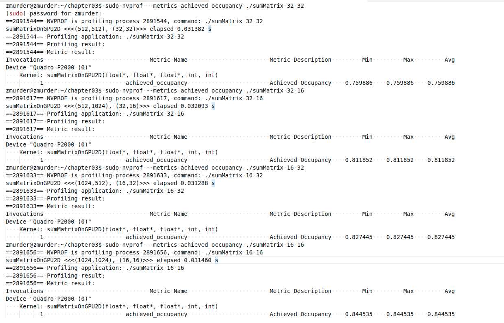
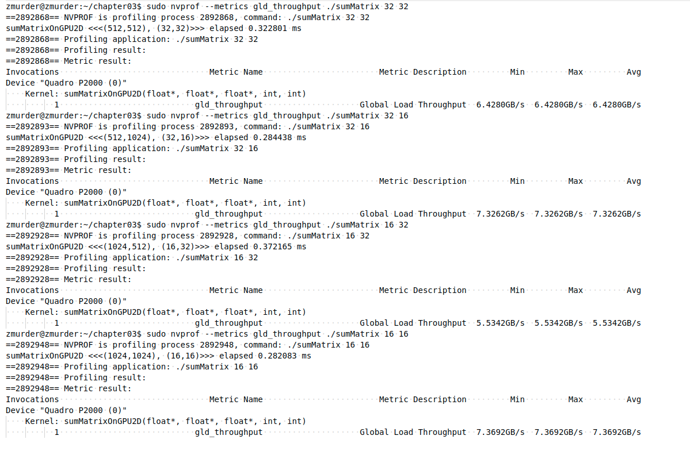
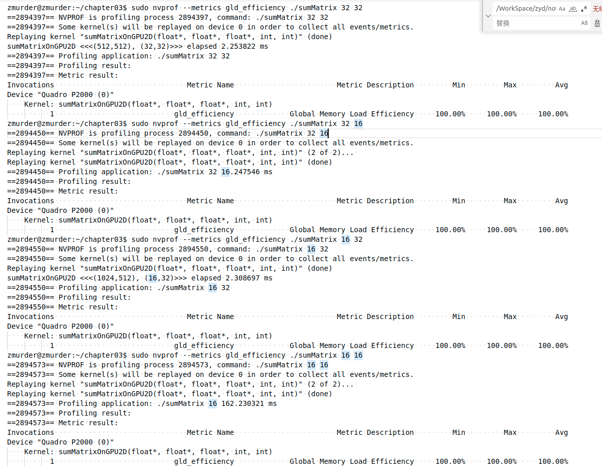
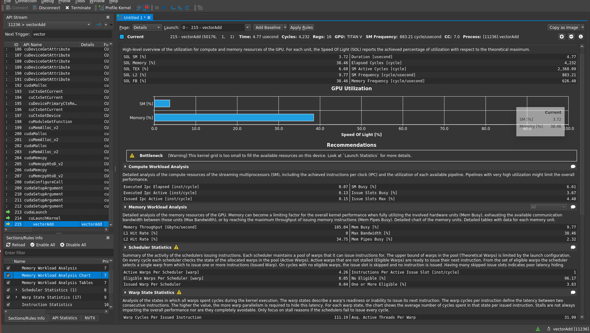

# 3.3 并行性的表现

为更好地理解线程束执行的本质，将使用不同的执行配置分析下述的sumMatrixOn-GPU2D核函数。**使用不同的网格/块的维数组并使用nvprof配置指标来分析**。

 二维矩阵求和的核函数如下所示：

```shell
__global__ void sumMatrix(float * MatA,float * MatB,float * MatC,int nx,int ny)
{
    int ix=threadIdx.x+blockDim.x*blockIdx.x;
    int iy=threadIdx.y+blockDim.y*blockIdx.y;
    int idx=ix+iy*ny;
    if (ix<nx && iy<ny)
    {
      MatC[idx]=MatA[idx]+MatB[idx];
    }
}
```

blcok的大小由程序入参决定，并根据矩阵大小计算grid

```c
	// set up data size of matrix
    int nx = 1 << 14;
    int ny = 1 << 14;
	/*....*/
	if(argc > 2)
    {
        dimx = atoi(argv[1]);
        dimy = atoi(argv[2]);
    }

    dim3 block(dimx, dimy);
    dim3 grid((nx + block.x - 1) / block.x, (ny + block.y - 1) / block.y);
```

## 3.3.1 用nvprof检测活跃的线程束

先跑几组结果

```shell
zmurder@zmurder:~/chapter03$ ./sumMatrix 32 32
sumMatrixOnGPU2D <<<(512,512), (32,32)>>> elapsed 0.028997 s
zmurder@zmurder:~/chapter03$ ./sumMatrix 32 16
sumMatrixOnGPU2D <<<(512,1024), (32,16)>>> elapsed 0.028382 s
zmurder@zmurder:~/chapter03$ ./sumMatrix 16 32
sumMatrixOnGPU2D <<<(1024,512), (16,32)>>> elapsed 0.030575 s
zmurder@zmurder:~/chapter03$ ./sumMatrix 16 16
sumMatrixOnGPU2D <<<(1024,1024), (16,16)>>> elapsed 0.028017 s
```

### **活跃线程百分比**

使用nvprof的--metrics参数为achieved_occupancy来查看

```shell
nvprof --metrics achieved_occupancy ./sumMatrix 32 32
```

| achieved_occupancy | Ratio of the average active warps per active cycle to the maximum number of warps supported on a multiprocessor |
| ------------------ | ------------------------------------------------------------ |

结果如下（结果太长了，截图看着方便）



汇总表格如下：

| grid      | block | achieved_occupancy | time       |
| --------- | ----- | ------------------ | ---------- |
| 512,512   | 32,32 | 0.759886           | 0.031382 s |
| 512,1024  | 32,16 | 0.811852           | 0.032093 s |
| 1024,512  | 16,32 | 0.827445           | 0.031288 s |
| 1024,1024 | 16,16 | 0.844535           | 0.031460 s |

跑的结果会有些许的出入，但是可以看出活跃的线程越多可能越快，但是也不全是，还有其他因素影响。

要增加活跃的线程束（active warps），您可以考虑以下几个方面的优化：

1. 并行度：尽可能使用更多的线程来执行计算任务。CUDA架构通常支持大量的线程，并且在GPU上同时执行多个线程束可以提高性能。
2. 内存访问模式：优化内存访问模式以最大程度地利用内存带宽。尽量使用连续的内存访问模式，避免不规则的内存访问，这样可以提高内存访问的效率，从而增加活跃的线程束。
3. 控制流：尽量避免分支语句（如if-else语句）和循环中的条件分支。这是因为分支语句可能导致线程束中的不同线程执行不同的指令，从而降低线程束的效率。
4. 数据局部性：尽量利用数据的局部性，减少对全局内存的访问。通过使用共享内存或使用本地寄存器来存储频繁访问的数据，可以减少对全局内存的访问次数，提高性能。
5. 内存访问合并：尽量将多个内存访问操作合并为一个访问操作。这可以通过使用向量化数据类型或者合并多个内存读写操作来实现。这样可以减少内存访问的总次数，提高效率。
6. 内存对齐：确保数据结构在内存中按照适当的边界对齐。这可以提高内存访问的效率，并允许GPU以更高的吞吐量访问数据。
7. 使用共享内存：共享内存是位于每个多处理器上的高速缓存，可以在线程块内部共享数据。通过将数据存储在共享内存中，可以减少对全局内存的访问，提高性能。

这些是一些常见的优化技巧，可以帮助增加活跃的线程束并提高CUDA应用程序的性能。

## 3.3.2 用nvprof检测内存操作

### 全局内存吞吐量

使用nvprof的--metrics参数为gld_throughput来查看

| gld_throughput | Global memory load throughput<br />全局内存吞吐量 |
| -------------- | ------------------------------------------------- |

使用命令

```shell
sudo nvprof --metrics gld_throughput ./sumMatrix 32 32
```

结果如下



### 全局内存加载效率

使用nvprof的--metrics参数为gld_efficiency来查看

| gld_efficiency | Ratio of requested global memory load throughput to required global memory load throughput expressed as percentage.<br />请求的全局内存加载吞吐量与所需的全局内存加载吞吐量的比率，以百分比表示。 |
| -------------- | ------------------------------------------------------------ |

使用命令

```shell
sudo nvprof --metrics gld_efficiency ./sumMatrix 32 32
```

结果如下



全都是100%。看来还是nvcc进行了优化。

## 3.3.3 增大并行性

从前一节可以总结出，**一个块的最内层维数（block.x）应该是线程束大小的倍数。这样能极大地提高了加载效率**，因此修改block的x维度大小测试。

测试结果如下

```shell
zmurder@zmurder:~/chapter03$ ./sumMatrix 64 2
sumMatrixOnGPU2D <<<(256,8192), (64,2)>>> elapsed 0.026044 s
zmurder@zmurder:~/chapter03$ ./sumMatrix 64 4
sumMatrixOnGPU2D <<<(256,4096), (64,4)>>> elapsed 0.027279 s
zmurder@zmurder:~/chapter03$ ./sumMatrix 64 8
sumMatrixOnGPU2D <<<(256,2048), (64,8)>>> elapsed 0.026152 s
zmurder@zmurder:~/chapter03$ ./sumMatrix 128 2
sumMatrixOnGPU2D <<<(128,8192), (128,2)>>> elapsed 0.026052 s
zmurder@zmurder:~/chapter03$ ./sumMatrix 128 4
sumMatrixOnGPU2D <<<(128,4096), (128,4)>>> elapsed 0.026050 s
zmurder@zmurder:~/chapter03$ ./sumMatrix 128 8
sumMatrixOnGPU2D <<<(128,2048), (128,8)>>> elapsed 0.026235 s
zmurder@zmurder:~/chapter03$ ./sumMatrix 256 2
sumMatrixOnGPU2D <<<(64,8192), (256,2)>>> elapsed 0.027720 s
zmurder@zmurder:~/chapter03$ ./sumMatrix 256 4
sumMatrixOnGPU2D <<<(64,4096), (256,4)>>> elapsed 0.026151 s
zmurder@zmurder:~/chapter03$ ./sumMatrix 256 8
sumMatrixOnGPU2D <<<(64,2048), (256,8)>>> elapsed 0.000003 s
Error: sumMatrix.cu:141, code: 9, reason: invalid configuration argument

```

* 最后一组block(256,8)出错了，因为一个block中超出了1024个线程（256*8=2048）
* block为(64,4)和(128,2)有相同的线程数，但是运行时间差异还挺大，**说明线程块最内层维度的大小对性能起着的关键的作用**。
* 值得注意的是，**最好的执行配置既不具有最高的可实现占用率，也不具有最高的加载吞吐量。从这些实验中可以推断出，没有一个单独的指标能直接优化性能。我们需要在几个相关的指标间寻找一个恰当的平衡来达到最佳的总体性能。**这里就不列举具体的结果了，可以查看活跃线程百分比、内存吞吐量和加载效率等。

现在nvidia提供了一个工具[Nsight Compute](https://docs.nvidia.com/nsight-compute/NsightCompute/index.html#abstract)可以很方便的来查看核函数的性能并给出修改建议，可惜的是不再不支持Pascal架构的了，刚好我的GPU就是这个架构。



## 附录

[官方nvprof参数说明](https://docs.nvidia.com/cuda/profiler-users-guide/index.html)