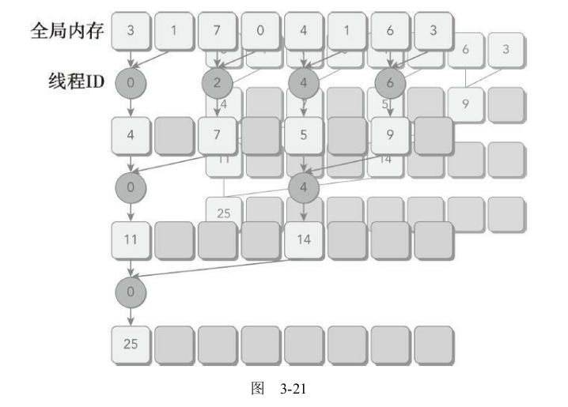
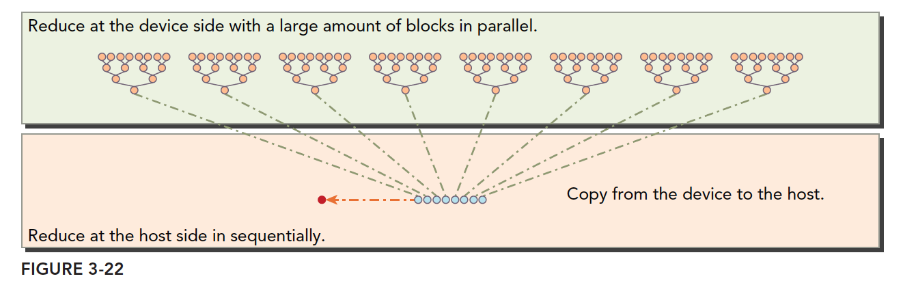
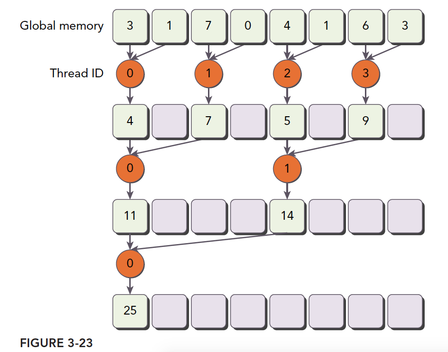
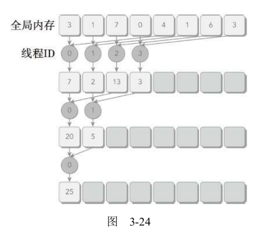
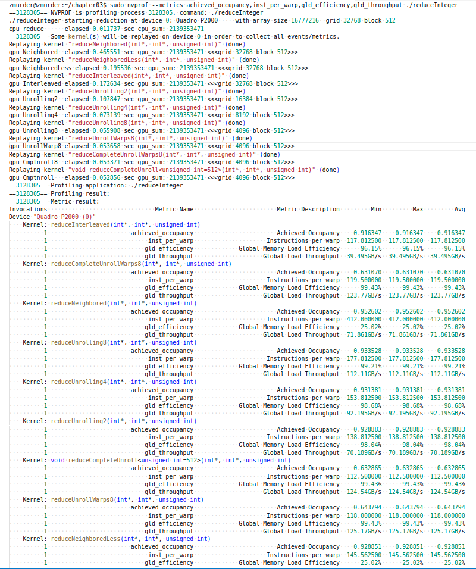

# 3.4 避免分支分化

**线程束中的条件执行可能引起线程束分化**，这会导致内核性能变差。通过重新组织数据的获取模式，可以减少或避免线程束分化。在本节里，将会以并行归约为例，介绍避免分支分化的基本技术。

## 3.4.1 并行归约问题

假设要对一个有N个元素的整数数组求和。如何通过并行计算快速求和呢？鉴于加法的结合律和交换律，数组元素可以以任何顺序求和。所以可以用以下的方法执行并行加法运算：

1. 将输入向量划分到更小的数据块中。
2. 用一个线程计算一个数据块的部分和。
3. 对每个数据块的部分和再求和得出最终结果。

成对的划分常见的方法有以下两种：

相邻配对：元素与他们相邻的元素配对


交错配对：元素与一定距离的元素配对


下面是CPU版本的**交错配对的实现**：

```C
// Recursive Implementation of Interleaved Pair Approach
int recursiveReduce(int *data, int const size)
{
    // terminate check
    if (size == 1) return data[0];

    // renew the stride
    int const stride = size / 2;

    // in-place reduction
    for (int i = 0; i < stride; i++)
    {
        data[i] += data[i + stride];
    }

    // call recursively
    return recursiveReduce(data, stride);
}
```

**在向量中执行满足交换律和结合律的运算，被称为归约问题**。并行归约问题是这种运算的并行执行

## 3.4.2 并行归约中的分化

图3-21所示的是**相邻配对方法**的内核实现流程（一个线程块内的运算）。每个线程将相邻的两个元素相加产生部分和。


核函数代码如下

```C
// Neighbored Pair Implementation with divergence
__global__ void reduceNeighbored (int *g_idata, int *g_odata, unsigned int n)
{
    // set thread ID
    unsigned int tid = threadIdx.x;
    unsigned int idx = blockIdx.x * blockDim.x + threadIdx.x;

    // convert global data pointer to the local pointer of this block
    int *idata = g_idata + blockIdx.x * blockDim.x;

    // boundary check
    if (idx >= n) return;

    // in-place reduction in global memory
    for (int stride = 1; stride < blockDim.x; stride *= 2)//一个线程块内计算全部数组的一部分数据
    {
        if ((tid % (2 * stride)) == 0)
        {
            idata[tid] += idata[tid + stride];
        }

        // synchronize within threadblock
        __syncthreads();
    }

    // write result for this block to global mem
    if (tid == 0) g_odata[blockIdx.x] = idata[0];
}
```

完整的执行逻辑如下



```C
    // kernel 1: reduceNeighbored
    CHECK(cudaMemcpy(d_idata, h_idata, bytes, cudaMemcpyHostToDevice));
    CHECK(cudaDeviceSynchronize());
    iStart = seconds();
    reduceNeighbored<<<grid, block>>>(d_idata, d_odata, size);//kernel计算出一组的结果
    CHECK(cudaDeviceSynchronize());
    iElaps = seconds() - iStart;
    CHECK(cudaMemcpy(h_odata, d_odata, grid.x * sizeof(int),
                     cudaMemcpyDeviceToHost));
    gpu_sum = 0;

    for (int i = 0; i < grid.x; i++) gpu_sum += h_odata[i];//CPU端将kernel的一组结果再想加

    printf("gpu Neighbored  elapsed %f sec gpu_sum: %d <<<grid %d block "
           "%d>>>\n", iElaps, gpu_sum, grid.x, block.x);
```

有几个点：

* 每个线程块处理数组的一部分，如图3-22中的一组橙色点，代表一个线程块的计算
* 线程块中每往下计算一行（一组橙色的点从一行运算到下一行）需要进行线程内同步，`__syncthreads();`保障线程块内的其他线程运算完成。
* 所有线程块的计算结果在CPU中再进行求和，如图3-22中蓝色点。

## 3.4.3 改善并行归约的分化

上面的核函数有一个语句

```C
if ((tid % (2 * stride)) == 0)
```

这句会导致线程分化。在并行归
约的第一次迭代中，只有ID为偶数的线程执行这个条件语句的主体，但是所有的线程都必须被调度。在第二次迭代中，只有四分之一的线程是活跃的，但是所有的线程仍然都必须被调度。

下面是一种解决方案，注意修改了线程的索引内存位置。



对应的核函数如下

```C
// Neighbored Pair Implementation with less divergence
__global__ void reduceNeighboredLess (int *g_idata, int *g_odata,
                                      unsigned int n)
{
    // set thread ID
    unsigned int tid = threadIdx.x;
    unsigned int idx = blockIdx.x * blockDim.x + threadIdx.x;

    // convert global data pointer to the local pointer of this block
    int *idata = g_idata + blockIdx.x * blockDim.x;

    // boundary check
    if(idx >= n) return;

    // in-place reduction in global memory
    for (int stride = 1; stride < blockDim.x; stride *= 2)
    {
        // convert tid into local array index
        int index = 2 * stride * tid;

        if (index < blockDim.x)
        {
            idata[index] += idata[index + stride];//这里不同，数组的索引不再是线程编号了
        }

        // synchronize within threadblock
        __syncthreads();
    }

    // write result for this block to global mem
    if (tid == 0) g_odata[blockIdx.x] = idata[0];
}
```

对于一个有512个线程的块来说，前8个线程束执行第一轮归约，**剩下8个线程束什么也不做**（虽然剩下的线程束没有做什么有用的工作，但是应该也会被调用运行啊，但是书中的意思是不运行，可能是内部的优化吧，不清楚为什么）。在第二轮里，前4个线程束执行归约，剩下12个线程束什么也不做。因此，这样就彻底不存在分化了。在最后五轮中，当每一轮的线程总数小于线程束的大小时，分化就会出现。在下一节将会介绍如何处理这一问题。

## 3.4.4 交错配对的归约

与相邻配对方法相比，交错配对方法颠倒了元素的跨度。初始跨度是线程块大小的一半，然后在每次迭代中减少一半（如图3-24所示）。



核函数代码如下

```C
// Interleaved Pair Implementation with less divergence
__global__ void reduceInterleaved (int *g_idata, int *g_odata, unsigned int n)
{
    // set thread ID
    unsigned int tid = threadIdx.x;
    unsigned int idx = blockIdx.x * blockDim.x + threadIdx.x;

    // convert global data pointer to the local pointer of this block
    int *idata = g_idata + blockIdx.x * blockDim.x;

    // boundary check
    if(idx >= n) return;

    // in-place reduction in global memory
    for (int stride = blockDim.x / 2; stride > 0; stride >>= 1)
    {
        if (tid < stride)
        {
            idata[tid] += idata[tid + stride];
        }

        __syncthreads();
    }

    // write result for this block to global mem
    if (tid == 0) g_odata[blockIdx.x] = idata[0];
}
```

使用nvprof分析如下

```shell
sudo nvprof --metrics achieved_occupancy,inst_per_warp,gld_efficiency,gld_throughput ./reduceInteger
```


```shell
zmurder@zmurder:~/chapter03$ sudo nvprof --metrics achieved_occupancy,inst_per_warp,gld_efficiency,gld_throughput ./reduceInteger
==3128305== NVPROF is profiling process 3128305, command: ./reduceInteger
./reduceInteger starting reduction at device 0: Quadro P2000     with array size 16777216  grid 32768 block 512
cpu reduce      elapsed 0.011737 sec cpu_sum: 2139353471
==3128305== Some kernel(s) will be replayed on device 0 in order to collect all events/metrics.
Replaying kernel "reduceNeighbored(int*, int*, unsigned int)" (done)
gpu Neighbored  elapsed 0.465551 sec gpu_sum: 2139353471 <<<grid 32768 block 512>>>
Replaying kernel "reduceNeighboredLess(int*, int*, unsigned int)" (done)
gpu NeighboredLess elapsed 0.195536 sec gpu_sum: 2139353471 <<<grid 32768 block 512>>>
Replaying kernel "reduceInterleaved(int*, int*, unsigned int)" (done)
gpu Interleaved elapsed 0.172634 sec gpu_sum: 2139353471 <<<grid 32768 block 512>>>
Replaying kernel "reduceUnrolling2(int*, int*, unsigned int)" (done)
gpu Unrolling2  elapsed 0.107847 sec gpu_sum: 2139353471 <<<grid 16384 block 512>>>
Replaying kernel "reduceUnrolling4(int*, int*, unsigned int)" (done)
gpu Unrolling4  elapsed 0.073139 sec gpu_sum: 2139353471 <<<grid 8192 block 512>>>
Replaying kernel "reduceUnrolling8(int*, int*, unsigned int)" (done)
gpu Unrolling8  elapsed 0.055908 sec gpu_sum: 2139353471 <<<grid 4096 block 512>>>
Replaying kernel "reduceUnrollWarps8(int*, int*, unsigned int)" (done)
gpu UnrollWarp8 elapsed 0.053658 sec gpu_sum: 2139353471 <<<grid 4096 block 512>>>
Replaying kernel "reduceCompleteUnrollWarps8(int*, int*, unsigned int)" (done)
gpu Cmptnroll8  elapsed 0.053371 sec gpu_sum: 2139353471 <<<grid 4096 block 512>>>
Replaying kernel "void reduceCompleteUnroll<unsigned int=512>(int*, int*, unsigned int)" (done)
gpu Cmptnroll   elapsed 0.052856 sec gpu_sum: 2139353471 <<<grid 4096 block 512>>>
==3128305== Profiling application: ./reduceInteger
==3128305== Profiling result:
==3128305== Metric result:
Invocations                               Metric Name                        Metric Description         Min         Max         Avg
Device "Quadro P2000 (0)"
    Kernel: reduceInterleaved(int*, int*, unsigned int)
          1                        achieved_occupancy                        Achieved Occupancy    0.916347    0.916347    0.916347
          1                             inst_per_warp                     Instructions per warp  117.812500  117.812500  117.812500
          1                            gld_efficiency             Global Memory Load Efficiency      96.15%      96.15%      96.15%
          1                            gld_throughput                    Global Load Throughput  39.495GB/s  39.495GB/s  39.495GB/s
    Kernel: reduceCompleteUnrollWarps8(int*, int*, unsigned int)
          1                        achieved_occupancy                        Achieved Occupancy    0.631070    0.631070    0.631070
          1                             inst_per_warp                     Instructions per warp  119.500000  119.500000  119.500000
          1                            gld_efficiency             Global Memory Load Efficiency      99.43%      99.43%      99.43%
          1                            gld_throughput                    Global Load Throughput  123.77GB/s  123.77GB/s  123.77GB/s
    Kernel: reduceNeighbored(int*, int*, unsigned int)
          1                        achieved_occupancy                        Achieved Occupancy    0.952602    0.952602    0.952602
          1                             inst_per_warp                     Instructions per warp  412.000000  412.000000  412.000000
          1                            gld_efficiency             Global Memory Load Efficiency      25.02%      25.02%      25.02%
          1                            gld_throughput                    Global Load Throughput  71.861GB/s  71.861GB/s  71.861GB/s
    Kernel: reduceUnrolling8(int*, int*, unsigned int)
          1                        achieved_occupancy                        Achieved Occupancy    0.933528    0.933528    0.933528
          1                             inst_per_warp                     Instructions per warp  177.812500  177.812500  177.812500
          1                            gld_efficiency             Global Memory Load Efficiency      99.21%      99.21%      99.21%
          1                            gld_throughput                    Global Load Throughput  112.11GB/s  112.11GB/s  112.11GB/s
    Kernel: reduceUnrolling4(int*, int*, unsigned int)
          1                        achieved_occupancy                        Achieved Occupancy    0.931381    0.931381    0.931381
          1                             inst_per_warp                     Instructions per warp  153.812500  153.812500  153.812500
          1                            gld_efficiency             Global Memory Load Efficiency      98.68%      98.68%      98.68%
          1                            gld_throughput                    Global Load Throughput  92.195GB/s  92.195GB/s  92.195GB/s
    Kernel: reduceUnrolling2(int*, int*, unsigned int)
          1                        achieved_occupancy                        Achieved Occupancy    0.928883    0.928883    0.928883
          1                             inst_per_warp                     Instructions per warp  138.812500  138.812500  138.812500
          1                            gld_efficiency             Global Memory Load Efficiency      98.04%      98.04%      98.04%
          1                            gld_throughput                    Global Load Throughput  70.189GB/s  70.189GB/s  70.189GB/s
    Kernel: void reduceCompleteUnroll<unsigned int=512>(int*, int*, unsigned int)
          1                        achieved_occupancy                        Achieved Occupancy    0.632865    0.632865    0.632865
          1                             inst_per_warp                     Instructions per warp  112.500000  112.500000  112.500000
          1                            gld_efficiency             Global Memory Load Efficiency      99.43%      99.43%      99.43%
          1                            gld_throughput                    Global Load Throughput  124.54GB/s  124.54GB/s  124.54GB/s
    Kernel: reduceUnrollWarps8(int*, int*, unsigned int)
          1                        achieved_occupancy                        Achieved Occupancy    0.643794    0.643794    0.643794
          1                             inst_per_warp                     Instructions per warp  118.000000  118.000000  118.000000
          1                            gld_efficiency             Global Memory Load Efficiency      99.43%      99.43%      99.43%
          1                            gld_throughput                    Global Load Throughput  125.17GB/s  125.17GB/s  125.17GB/s
    Kernel: reduceNeighboredLess(int*, int*, unsigned int)
          1                        achieved_occupancy                        Achieved Occupancy    0.928851    0.928851    0.928851
          1                             inst_per_warp                     Instructions per warp  145.562500  145.562500  145.562500
          1                            gld_efficiency             Global Memory Load Efficiency      25.02%      25.02%      25.02%
          1                            gld_throughput                    Global Load Throughput  120.87GB/s  120.87GB/s  120.87GB/s

```

截图看的完整点



汇总表格如下

|                | gld_throughput | gld_efficiency | inst_per_warp | achieved_occupancy | 时间         |
| -------------- | -------------- | -------------- | ------------- | ------------------ | ------------ |
| Neighbored     | 2.4549GB/s     | 25.02%         | 412.000000    | 0.952539           | 0.016720 sec |
| NeighboredLess | 4.9642GB/s     | 25.02%         | 145.562500    | 0.927764           | 0.010575 sec |
| Interleaved    | 1.3862GB/s     | 96.15%         | 117.812500    | 0.916344           | 0.006903 sec |
|                |                |                |               |                    |              |

其中achieved_occupancy应该是编译器优化了。