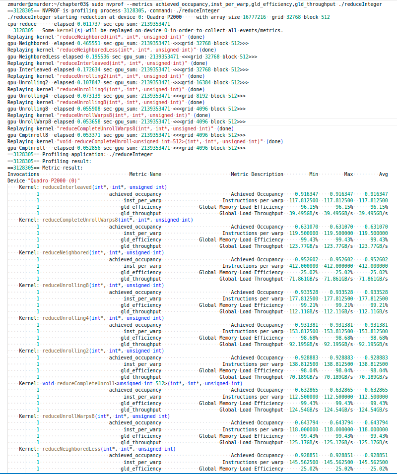

# 3.5 展开循环

循环展开是一个尝试通过减少分支出现的频率和循环维护指令来优化循环的技术。

> 不止并行算法可以展开，传统串行代码展开后效率也能一定程度的提高，因为省去了判断和分支预测失败所带来的迟滞。
> 先来个c++ 入门循环

```C

for (int i=0;i<100;i++)
{
    a[i]=b[i]+c[i];
}
```

这个是最传统的写法，这个写法在各种c++教材上都能看到，不做解释，如果我们进行循环展开呢？

```C

for (int i=0;i<100;i+=4)
{
    a[i+0]=b[i+0]+c[i+0];
    a[i+1]=b[i+1]+c[i+1];
    a[i+2]=b[i+2]+c[i+2];
    a[i+3]=b[i+3]+c[i+3];
}
```

没错，是不是很简单，修改循环体的内容，把本来循环自己搞定的东西，我们自己列出来了，这样做的好处，从串行较多来看是减少了条件判断的次数。
但是如果你把这段代码拿到机器上跑，其实看不出来啥效果，因为现代编译器把上述两个不同的写法，编译成了类似的机器语言，也就是，我们这不循环展开，编译器也会帮我们做。
不过值得注意的是：***目前CUDA的编译器还不能帮我们做这种优化，人为的展开核函数内的循环，能够非常大的提升内核性能\***


在CUDA中，循环展开的意义非常重大。我们的目标仍然是相同的：通过减少指令消耗和增加更多的独立调度指令来提高性能。因此，更多的并发操作被添加到流水线上，以产生更高的指令和内存带宽。这为线程束调度器提供更多符合条件的线程束，它们可以帮助隐藏指令或内存延迟。

## 3.5.1 展开的归约

你可能会注意到，在reduceInterleaved核函数中每个线程块只处理一部分数据，这些数据可以被认为是一个数据块。如果用一个线程块手动展开两个数据块的处理，会怎么样？以下的核函数是reduceInterleaved核函数的修正版：**每个线程块汇总了来自两个数据块的数据**。也就是一个线程块处理原来两个线程块的数据。

对应的核函数如下

```shell
__global__ void reduceUnrolling2 (int *g_idata, int *g_odata, unsigned int n)
{
    // set thread ID
    unsigned int tid = threadIdx.x;
    unsigned int idx = blockIdx.x * blockDim.x * 2 + threadIdx.x;

    // convert global data pointer to the local pointer of this block
    int *idata = g_idata + blockIdx.x * blockDim.x * 2;

    // unrolling 2
    if (idx + blockDim.x < n) g_idata[idx] += g_idata[idx + blockDim.x];

    __syncthreads();

    // in-place reduction in global memory
    for (int stride = blockDim.x / 2; stride > 0; stride >>= 1)
    {
        if (tid < stride)
        {
            idata[tid] += idata[tid + stride];
        }

        // synchronize within threadblock
        __syncthreads();
    }

    // write result for this block to global mem
    if (tid == 0) g_odata[blockIdx.x] = idata[0];
}
```

由于一个线程块处理了两个线程块的数据，因此线程块数量就减半

```c
    // kernel 4: reduceUnrolling2
    CHECK(cudaMemcpy(d_idata, h_idata, bytes, cudaMemcpyHostToDevice));
    CHECK(cudaDeviceSynchronize());
    iStart = seconds();
    reduceUnrolling2<<<grid.x / 2, block>>>(d_idata, d_odata, size);//grid减半
    CHECK(cudaDeviceSynchronize());
    iElaps = seconds() - iStart;
    CHECK(cudaMemcpy(h_odata, d_odata, grid.x / 2 * sizeof(int),
                     cudaMemcpyDeviceToHost));
    gpu_sum = 0;

    for (int i = 0; i < grid.x / 2; i++) gpu_sum += h_odata[i];

    printf("gpu Unrolling2  elapsed %f sec gpu_sum: %d <<<grid %d block "
           "%d>>>\n", iElaps, gpu_sum, grid.x / 2, block.x);
```

上面是展开2的，也可是是4、8。

测试结果如图，运算速度reduceUnrollWarps8为0.053658 sec，原来的reduceInterleaved为0.172634 sec，快了进3倍。


## 3.5.2 展开线程的归约

__syncthreads是用于块内同步的。在归约核函数中，它用来确保在线程进入下一轮之前，每一轮中所有线程已经将局部结果写入全局内存中了。
然而，要细想一下只剩下32个或更少线程（即一个线程束）的情况。因为线程束的执行是SIMT（单指令多线程）的，每条指令之后有隐式的线程束内同步过程。因此，归约循环的最后6个迭代可以用下述语句来展开：

```C
// unrolling warp
    if (tid < 32)
    {
        volatile int *vmem = idata;//如果省略了volatile修饰符，这段代码将不能正常工作
        vmem[tid] += vmem[tid + 32];
        vmem[tid] += vmem[tid + 16];
        vmem[tid] += vmem[tid +  8];
        vmem[tid] += vmem[tid +  4];
        vmem[tid] += vmem[tid +  2];
        vmem[tid] += vmem[tid +  1];
    }
```

完整的核函数如下

```C

__global__ void reduceUnrollWarps8 (int *g_idata, int *g_odata, unsigned int n)
{
    // set thread ID
    unsigned int tid = threadIdx.x;
    unsigned int idx = blockIdx.x * blockDim.x * 8 + threadIdx.x;

    // convert global data pointer to the local pointer of this block
    int *idata = g_idata + blockIdx.x * blockDim.x * 8;

    // unrolling 8
    if (idx + 7 * blockDim.x < n)
    {
        int a1 = g_idata[idx];
        int a2 = g_idata[idx + blockDim.x];
        int a3 = g_idata[idx + 2 * blockDim.x];
        int a4 = g_idata[idx + 3 * blockDim.x];
        int b1 = g_idata[idx + 4 * blockDim.x];
        int b2 = g_idata[idx + 5 * blockDim.x];
        int b3 = g_idata[idx + 6 * blockDim.x];
        int b4 = g_idata[idx + 7 * blockDim.x];
        g_idata[idx] = a1 + a2 + a3 + a4 + b1 + b2 + b3 + b4;
    }

    __syncthreads();

    // in-place reduction in global memory
    for (int stride = blockDim.x / 2; stride > 32; stride >>= 1)
    {
        if (tid < stride)
        {
            idata[tid] += idata[tid + stride];
        }

        // synchronize within threadblock
        __syncthreads();
    }

    // unrolling warp
    if (tid < 32)
    {
        volatile int *vmem = idata;
        vmem[tid] += vmem[tid + 32];
        vmem[tid] += vmem[tid + 16];
        vmem[tid] += vmem[tid +  8];
        vmem[tid] += vmem[tid +  4];
        vmem[tid] += vmem[tid +  2];
        vmem[tid] += vmem[tid +  1];
    }

    // write result for this block to global mem
    if (tid == 0) g_odata[blockIdx.x] = idata[0];
}
```

## 3.5.3 完全展开的归约

如果编译时已知一个循环中的迭代次数，就可以把循环完全展开。因为在Fermi或

修改核函数如下

```C

__global__ void reduceCompleteUnrollWarps8 (int *g_idata, int *g_odata,
        unsigned int n)
{
    // set thread ID
    unsigned int tid = threadIdx.x;
    unsigned int idx = blockIdx.x * blockDim.x * 8 + threadIdx.x;

    // convert global data pointer to the local pointer of this block
    int *idata = g_idata + blockIdx.x * blockDim.x * 8;

    // unrolling 8
    if (idx + 7 * blockDim.x < n)
    {
        int a1 = g_idata[idx];
        int a2 = g_idata[idx + blockDim.x];
        int a3 = g_idata[idx + 2 * blockDim.x];
        int a4 = g_idata[idx + 3 * blockDim.x];
        int b1 = g_idata[idx + 4 * blockDim.x];
        int b2 = g_idata[idx + 5 * blockDim.x];
        int b3 = g_idata[idx + 6 * blockDim.x];
        int b4 = g_idata[idx + 7 * blockDim.x];
        g_idata[idx] = a1 + a2 + a3 + a4 + b1 + b2 + b3 + b4;
    }

    __syncthreads();
	//这里不用for循环了
    // in-place reduction and complete unroll
    if (blockDim.x >= 1024 && tid < 512) idata[tid] += idata[tid + 512];

    __syncthreads();

    if (blockDim.x >= 512 && tid < 256) idata[tid] += idata[tid + 256];

    __syncthreads();

    if (blockDim.x >= 256 && tid < 128) idata[tid] += idata[tid + 128];

    __syncthreads();

    if (blockDim.x >= 128 && tid < 64) idata[tid] += idata[tid + 64];

    __syncthreads();

    // unrolling warp
    if (tid < 32)
    {
        volatile int *vsmem = idata;
        vsmem[tid] += vsmem[tid + 32];
        vsmem[tid] += vsmem[tid + 16];
        vsmem[tid] += vsmem[tid +  8];
        vsmem[tid] += vsmem[tid +  4];
        vsmem[tid] += vsmem[tid +  2];
        vsmem[tid] += vsmem[tid +  1];
    }

    // write result for this block to global mem
    if (tid == 0) g_odata[blockIdx.x] = idata[0];
}
```

## 3.5.4 模板函数的归约

虽然可以手动展开循环，但是使用模板函数有助于进一步减少分支消耗。

修改上面代码如下

```C

template <unsigned int iBlockSize>
__global__ void reduceCompleteUnroll(int *g_idata, int *g_odata,
                                     unsigned int n)
{
    // set thread ID
    unsigned int tid = threadIdx.x;
    unsigned int idx = blockIdx.x * blockDim.x * 8 + threadIdx.x;

    // convert global data pointer to the local pointer of this block
    int *idata = g_idata + blockIdx.x * blockDim.x * 8;

    // unrolling 8
    if (idx + 7 * blockDim.x < n)
    {
        int a1 = g_idata[idx];
        int a2 = g_idata[idx + blockDim.x];
        int a3 = g_idata[idx + 2 * blockDim.x];
        int a4 = g_idata[idx + 3 * blockDim.x];
        int b1 = g_idata[idx + 4 * blockDim.x];
        int b2 = g_idata[idx + 5 * blockDim.x];
        int b3 = g_idata[idx + 6 * blockDim.x];
        int b4 = g_idata[idx + 7 * blockDim.x];
        g_idata[idx] = a1 + a2 + a3 + a4 + b1 + b2 + b3 + b4;
    }

    __syncthreads();

    // in-place reduction and complete unroll
    if (iBlockSize >= 1024 && tid < 512) idata[tid] += idata[tid + 512];

    __syncthreads();

    if (iBlockSize >= 512 && tid < 256)  idata[tid] += idata[tid + 256];

    __syncthreads();

    if (iBlockSize >= 256 && tid < 128)  idata[tid] += idata[tid + 128];

    __syncthreads();

    if (iBlockSize >= 128 && tid < 64)   idata[tid] += idata[tid + 64];

    __syncthreads();

    // unrolling warp
    if (tid < 32)
    {
        volatile int *vsmem = idata;
        vsmem[tid] += vsmem[tid + 32];
        vsmem[tid] += vsmem[tid + 16];
        vsmem[tid] += vsmem[tid +  8];
        vsmem[tid] += vsmem[tid +  4];
        vsmem[tid] += vsmem[tid +  2];
        vsmem[tid] += vsmem[tid +  1];
    }

    // write result for this block to global mem
    if (tid == 0) g_odata[blockIdx.x] = idata[0];
}
```

相比reduceCompleteUnrollWarps8，唯一的区别是使用了模板参数替换了块大小。检查块大小的if语句将在编译时被评估，如果这一条件为false，那么编译时它将会被删除，使得内循环更有效率。例如，在线程块大小为256的情况下调用这个核函数，下述语句将永远是false：`iBlockSize >= 1024 && tid < 512`

该核函数一定要在switch-case结构中被调用。这允许编译器为特定的线程块大小自动优化代码，但这也意味着它只对在特定块大小下启动reduceCompleteUnroll有效：

调用如下

```c

    // kernel 9: reduceCompleteUnroll
    CHECK(cudaMemcpy(d_idata, h_idata, bytes, cudaMemcpyHostToDevice));
    CHECK(cudaDeviceSynchronize());
    iStart = seconds();

    switch (blocksize)
    {
    case 1024:
        reduceCompleteUnroll<1024><<<grid.x / 8, block>>>(d_idata, d_odata,
                size);
        break;

    case 512:
        reduceCompleteUnroll<512><<<grid.x / 8, block>>>(d_idata, d_odata,
                size);
        break;

    case 256:
        reduceCompleteUnroll<256><<<grid.x / 8, block>>>(d_idata, d_odata,
                size);
        break;

    case 128:
        reduceCompleteUnroll<128><<<grid.x / 8, block>>>(d_idata, d_odata,
                size);
        break;

    case 64:
        reduceCompleteUnroll<64><<<grid.x / 8, block>>>(d_idata, d_odata, size);
        break;
    }

    CHECK(cudaDeviceSynchronize());
    iElaps = seconds() - iStart;
    CHECK(cudaMemcpy(h_odata, d_odata, grid.x / 8 * sizeof(int),
                     cudaMemcpyDeviceToHost));

    gpu_sum = 0;

    for (int i = 0; i < grid.x / 8; i++) gpu_sum += h_odata[i];

    printf("gpu Cmptnroll   elapsed %f sec gpu_sum: %d <<<grid %d block "
           "%d>>>\n", iElaps, gpu_sum, grid.x / 8, block.x);

```

汇总的结果还是上面的图再放这里一次，可以看出来展开规约速度明显的提升



## 附录

[官方nvprof参数说明](https://docs.nvidia.com/cuda/profiler-users-guide/index.html)