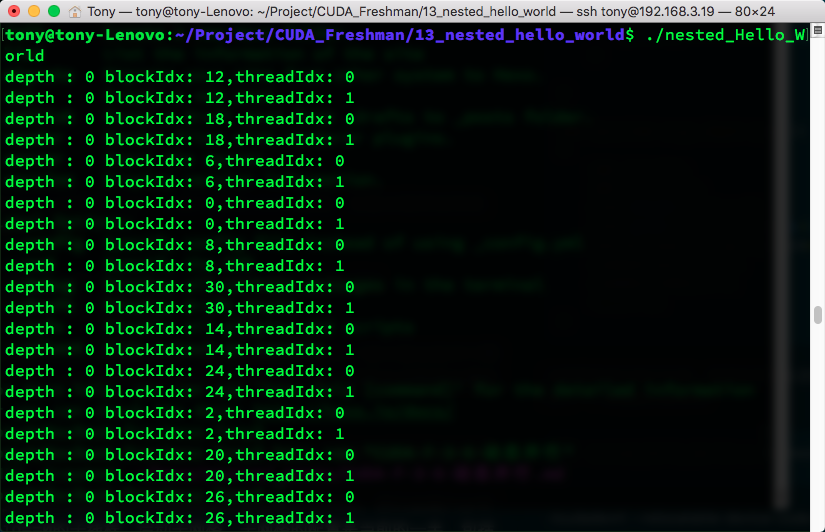
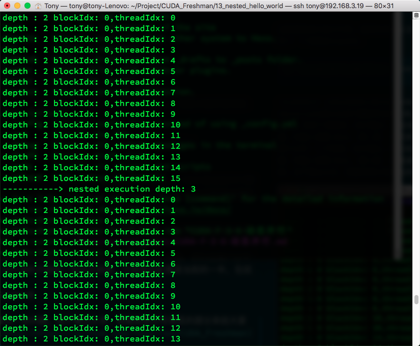
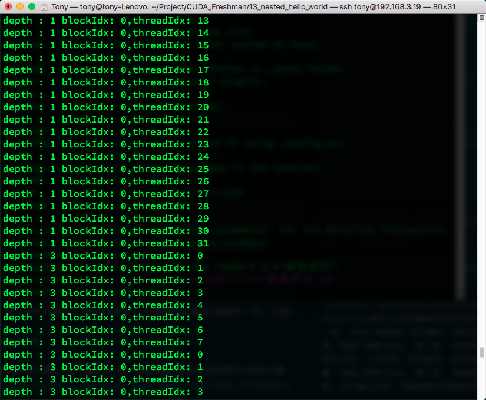
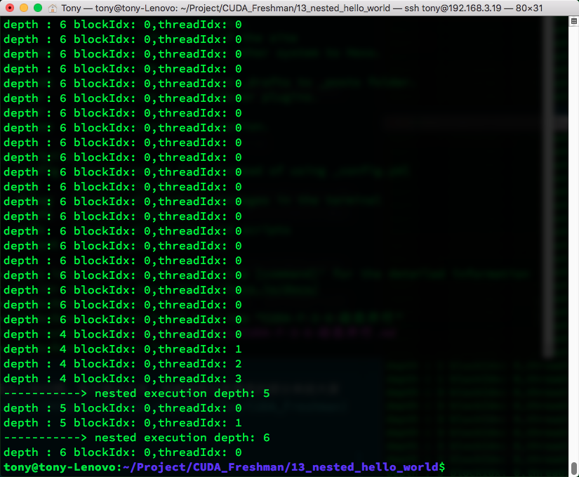

# 3.6 动态并行

本文作为第三章CUDA执行模型的最后一篇介绍动态并行，书中关于动态并行有一部分嵌套归约的例子，但是我认为，**这个例子应该对我们用途不大，简单了解一下算了**，首先它并不能降低代码复杂度，其次，其运行效率也没有提高，动态并行，相当于串行编程的中的递归调用，递归调用如果能转换成迭代循环，一般为了效率的时候是要转换成循环的，只有当效率不是那么重要，而更注重代码的简洁性的时候，我们才会使用，所以我们本文只介绍简单的一些基础知识，如果需要使用动态并行相关内容的同学，请查询文档或更专业的博客。
到目前为止，我们所有的内核都是在主机线程中调用的，那么我们肯定会想，是否我们可以在**内核中调用内核**，这个内核可以是别的内核，也可以是自己，那么我们就需要动态并行了，这个功能在早期的设备上是不支持的。
动态并行的好处之一就是能让复杂的内核变得有层次，坏处就是写出来的程序更复杂，因为并行行为本来就不好控制，去年我在没有系统的学习CUDA的时候写过一个400行左右的内核，用来训练人脸检测程序，确实比cpu块，但是从gpu的温度来判断，并没有很高的利用率（当时还不会使用性能检测工具这些，当时TensorFlow跑的时候GPU温度有80多，但是我写的就只有60多，所以我断定，gpu性能完全没发挥，但是那个程序还是运行了好久，可见磨刀不误砍柴工这句话是多么正确）
动态并行的另一个好处是等到执行的时候再配置创建多少个网格，多少个块，这样就可以动态的利用GPU硬件调度器和加载平衡器了，通过动态调整，来适应负载。并且在内核中启动内核可以减少一部分数据传输消耗。

## 3.6.1 嵌套执行

前面我们大费周章的其实也就只学了，网格，块，和启动配置，以及一些线程束的知识，现在我们要做的是从内核中启动内核。
内核中启动内核，和cpu并行中有一个相似的概念，就是父线程和子线程。子线程由父线程启动，但是到了GPU，这类名词相对多了些，比如父网格，父线程块，父线程，对应的子网格，子线程块，子线程。子网格被父线程启动，且必须在对应的父线程，父线程块，父网格结束之前结束。所有的子网格结束后，父线程，父线程块，父网格才会结束。


上图清晰地表明了父网格和子网格的使用情况，一种典型的执行方式：

> 主机启动一个网格（也就是一个内核）-> 此网格（父网格）在执行的过程中启动新的网格（子网格们）->所有子网格们都运行结束后-> 父网格才能结束，否则要等待

如果调用的线程没有显示同步启动子网格，那么运行时保证，父网格和子网格隐式同步。
图中显式的同步了父网格和子网格，通过设置栅栏的方法。
父网格中的不同线程启动的不同子网格，这些子网格拥有相同的父线程块，他们之间是可以同步的。线程块中所有的线程创建的所有子网格完成之后，线程块执行才会完成。如果块中的所有线程在子网格完成前退出，那么子网格隐式同步会被触发。隐式同步就是虽然没用同步指令，但是父线程块中虽然所有线程都执行完毕，但是依旧要等待对应的所有子网格执行完毕，然后才能退出。
前面我们讲过隐式同步，比如cudaMemcpy就能起到隐式同步的作用，但是主机内启动的网格，如果没有显式同步，也没有隐式同步指令，那么cpu线程很有可能就真的退出了，而你的gpu程序可能还在运行，这样就非常尴尬了。父线程块启动子网格需要显示的同步，也就是说不通的线程束需要都执行到子网格调用那一句，这个线程块内的所有子网格才能依据所在线程束的执行，一次执行。
接着是最头疼的内存，内存竞争对于普通并行就很麻烦了，现在对于动态并行，更麻烦，主要的有下面几点：

1. 父网格和子网格共享相同的全局和常量内存。
2. 父网格子网格有不同的局部内存
3. 有了子网格和父网格间的弱一致性作为保证，父网格和子网格可以对全局内存并发存取。
4. 有两个时刻父网格和子网格所见内存一致：子网格启动的时候，子网格结束的时候
5. 共享内存和局部内存分别对于线程块和线程来说是私有的
6. 局部内存对线程私有，对外不可见。

## 3.6.2 在GPU上嵌套Hello World

为了研究初步动态并行，我们先来写个Hello World进行操作，代码如下：

```

#include <cuda_runtime.h>
#include <stdio.h>
__global__ void nesthelloworld(int iSize,int iDepth)
{
    unsigned int tid=threadIdx.x;
    printf("depth : %d blockIdx: %d,threadIdx: %d\n",iDepth,blockIdx.x,threadIdx.x);
    if (iSize==1)
        return;
    int nthread=(iSize>>1);
    if (tid==0 && nthread>0)
    {
        nesthelloworld<<<1,nthread>>>(nthread,++iDepth);
        printf("-----------> nested execution depth: %d\n",iDepth);
    }

}

int main(int argc,char* argv[])
{
    int size=64;
    int block_x=2;
    dim3 block(block_x,1);
    dim3 grid((size-1)/block.x+1,1);
    nesthelloworld<<<grid,block>>>(size,0);
    cudaGetLastError();
    cudaDeviceReset();
    return 0;
}
```


这就是完成可执行代码，编译的命令与之前有些不同，工程中使用cmake管理，但是本程序没有纳入其中，而是使用了一个单独的makefile

```

nvcc -arch=sm_35  nested_Hello_World.cu -o nested_Hello_World -lcudadevrt --relocatable-device-code true
```


-lcudadevrt –relocatable-device-code true 是前面没有的，这两个指令是动态并行需要的一个库，relocatable-device-code表示生成可重新定位的代码，第十章将会讲解更多重新定位设备代码的内容。
这个程序的功能如下
第一层： 有多个线程块，执行输出，然后在tid==0的线程，启动子网格，子网格的配置是当前的一半，包括线程数量，和输入参数 iSize。
第二层： 有很多不同的子网格，因为我们上面多个不同的线程块都启动了子网格，我们这里只分析一个子网格，执行输出，然后在tid==0的子线程，启动子网格，子网格的配置是当前的一半，包括线程数量，和输入参数 iSize。
第三层： 继续递归下去，直到iSize==0
结束。
执行结果如下，有点长，但是能看出一些问题。由于输出太多，我截取部分有意思的部分来给大家看一下，想自己运行的可以去[github](https://github.com/Tony-Tan/CUDA_Freshman)上clone









可见，当多层调用子网格的时候，同一家的（就是用相同祖宗线程的子网）是隐式同步的，而不同宗的则是各跑各的。

## 总结

本文简单介绍了动态并行的基础知识，非常基础，对于动态并行的归约这里就不再讲解了，需要使用的同学自行学习，下一篇开始进入下一章，我们开始研究内存。