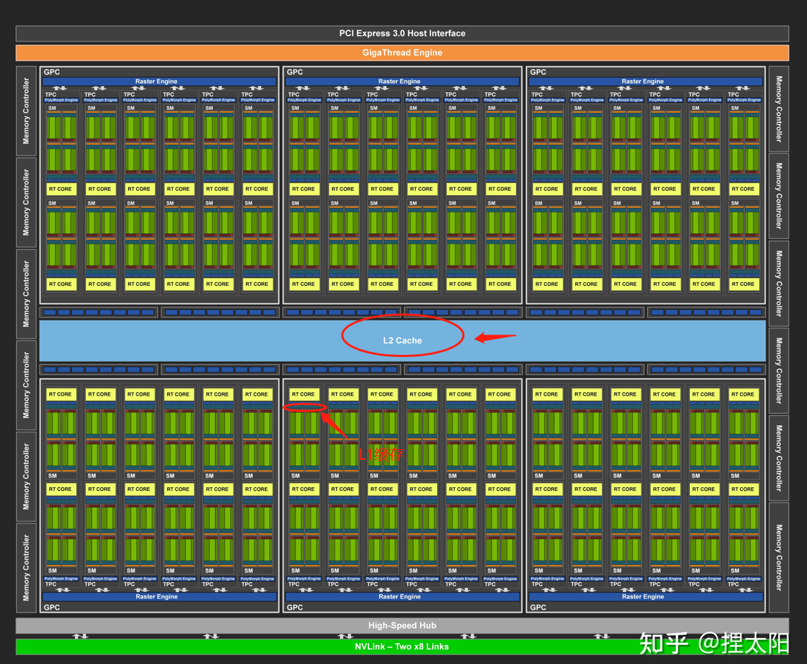
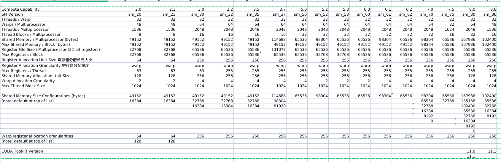

# 第4章 全局内存

在上一章中，你已经了解了线程是如何在GPU中执行的，以及如何通过操作线程束来优化核函数性能。但是，核函数性能并不是只和线程束的执行有关。回忆一下第3章的内容，在3.3.2节中，把一个线程块最里面一层的维度设为线程束大小的一半，这导致内存负载效率的大幅下降。这种性能损失不能用线程束调度或并行性来解释，造成这种性能损失的真正原因是较差的全局内存访问模式

## 4.1 CUDA内存模型概述

### 4.1.1 内存层次结构的优点

一般来说，应用程序不会在某一时间点访问任意数据或运行任意代码。应用程序往往遵循局部性原则，这表明它们可以在**任意时间点访问相对较小的局部地址空间**。有两种不同类型的局部性：

* 时间局部性：时间局部性认为如果一个数据位置被引用，那么该数据在较短的时间周期内很可能会再次被引用，随着时间流逝，该数据被引用的可能性逐渐降低。
* 空间局部性：空间局部性认为如果一个内存位置被引用，则附近的位置也可能会被引用。

通常，随着从处理器到内存延迟的增加，内存的容量也在增加。一个典型的层次结构如图4-1所示。


CPU和GPU的主存都采用的是DRAM（动态随机存取存储器），而低延迟内存（如CPU一级缓存）使用的则是SRAM（静态随机存取存储器）。

GPU与CPU在内存层次结构设计中都使用相似的准则和模型。GPU和CPU内存模型的主要区别是，**CUDA编程模型能将内存层次结构更好地呈现给用户，能让我们显式地控制它的行为**。也就是我们可以使用程序更好的控制GPU的内存。

### 4.1.2 CUDA内存模型

对于程序员来说，一般有两种类型的存储器：

* 可编程的：你需要显式地控制哪些数据存放在可编程内存中
* 不可编程的：你不能决定数据的存放位置，程序将自动生成存放位置以获得良好的性能

在CPU内存层次结构中，一级缓存和二级缓存都是不可编程的存储器
CUDA内存模型提出了多种可编程内存的类型：

* 寄存器
* 共享内存
* 本地内存
* 常量内存
* 纹理内存
* 全局内存

图4-2所示为这些内存空间的层次结构，每种都有不同的作用域、生命周期和缓存行为。一个核函数中的线程都有自己私有的本地内存。一个线程块有自己的共享内存，对同一线程块中所有线程都可见，其内容持续线程块的整个生命周期。所有线程都可以访问全局内存。所有线程都能访问的只读内存空间有：常量内存空间和纹理内存空间。全局内存、常量内存和纹理内存空间有不同的用途。纹理内存为各种数据布局提供了不同的寻址模式和滤波模式。对于一个应用程序来说，全局内存、常量内存和纹理内存中的内容具有相同的生命周期。


Volta架构的GV100核心


#### 4.1.2.1 寄存器

寄存器是GPU上运行速度最快的内存空间。**核函数中声明的一个没有其他修饰符的自变量，通存储在寄存器中**。在核函数声明的数组中，如果用于引用该数组的索引是常量且能在编译时确定，那么该数组也存储在寄存器中。

寄存器变量对于**每个线程来说都是私有的**，一个核函数通常使用寄存器来保存需要频繁访问的线程私有变量。寄**存器变量与核函数的生命周期相同**。一旦核函数执行完毕，就不能对寄存器变量进行访问了。

在Fermi GPU中，每个线程限制最多拥有63个寄存器。Kepler GPU将该限制扩展至**每个线程可拥有255个寄存器**。**在核函数中使用较少的寄存器将使在SM上有更多的常驻线程块**。每个SM上并发线程块越多，使用率和性能就越高。

你可以用如下的**nvcc编译器选项检查核函数使用的硬件资源情况**。下面的命令会输出寄存器的数量、共享内存的字节数以及每个线程所使用的常量内存的字节数。

```shell
-Xptxas -v,-abi=no
```

如果一个线程里面的变量太多，以至于寄存器完全不够呢？这时候寄存器发生溢出，本地内存会过来帮忙存储多出来的变量，这种情况会对效率产生非常负面的影响，所以，不到万不得已，一定要避免此种情况发生。
为了避免寄存器溢出，可以在核函数的代码中配置额外的信息来辅助编译器优化，比如：

```C
__global__ void
__lauch_bounds__(maxThreadaPerBlock,minBlocksPerMultiprocessor)
kernel(...) {
    /* kernel code */
}
```

这里面在核函数定义前加了一个 关键字 **lauch_bounds**，然后他后面对应了两个变量：

1. maxThreadaPerBlock：线程块内包含的最大线程数，线程块由核函数来启动

2. minBlocksPerMultiprocessor：可选参数，每个SM中预期的最小的常驻内存块参数。

   注意，对于一定的核函数，优化的启动边界会因为不同的结构而不同

   也可以在编译选项中加入

```shell
-maxrregcount=32
```

来控制一个编译单元里所有核函数使用的最大数量。

#### 4.1.2.2 本地内存

**核函数中符合存储在寄存器中但不能进入被核函数分配的寄存器空间中的变量将存储在本地内存中**，编译器可能存放在本地内存中的变量有以下几种：

- 使用未知索引引用的本地数组
- 可能会占用大量寄存器空间的较大本地数组或者结构体
- 任何不满足核函数寄存器限定条件的变量

**本地内存实质上是和全局内存一样在同一块存储区域当中的，其访问特点——高延迟，低带宽**。
对于2.0以上的设备，本地内存存储在每个SM的一级缓存，或者设备的二级缓存上。

#### 4.1.2.3 共享内存

在核函数中使用如下修饰符的内存，称为共享内存：

```C
__share__
```

因为共享内存是片上内存，所以**与本地内存或全局内存相比，它具有更高的带宽和更低的延迟**。**它的使用类似于CPU一级缓存，但它是可编程的**。

每一个SM都有一定数量的由线程块分配的共享内存。因此，必须非常小心不要过度使用共享内存，否则将在不经意间限制活跃线程束的数量。

共享内存在核函数的范围内声明，**其生命周期伴随着整个线程块**。当一个线程块执行结束后，其分配的共享内存将被释放并重新分配给其他线程块。

**共享内存是线程之间相互通信的基本方式**。一个块内的线程通过使用共享内存中的数据可以相互合作。**访问共享内存必须同步使用如下调用**，该命令是在之前章节中介绍过的CUDA运行时调用：

```C
void __syncthreads();
```

此语句相当于在线程块执行时各个线程的一个障碍点，当块内所有线程都执行到本障碍点的时候才能进行下一步的计算，这样可以设计出避免内存竞争的共享内存使用程序。

_syncthreads也会通过频繁强制SM到空闲状态来影响性能。

**SM中的一级缓存，和共享内存共享一个64k的片上内存**（不知道现在的设备有没有提高），他们通过静态划分，划分彼此的容量，运行时可以通过下面语句进行设置：

```c
cudaError_t cudaFuncSetCacheConfig(const void * func,enum cudaFuncCache);
```

这个函数可以设置内核的共享内存和一级缓存之间的比例。cudaFuncCache参数可选如下配置：

```C
cudaFuncCachePreferNone//无参考值，默认设置
cudaFuncCachePreferShared//48k共享内存，16k一级缓存
cudaFuncCachePreferL1// 48k一级缓存，16k共享内存
cudaFuncCachePreferEqual// 32k一级缓存，32k共享内存
```

#### 4.1.2.4 常量内存

常量内存驻留在设备内存中，并在每个SM专用的常量缓存中缓存。常量变量用如下修饰符来修饰

```C
__constant__
```

常量变量必须在全局空间内和所有核函数之外进行声明。**对于所有计算能力的设备，都只可以声明64KB的常量内存。常量内存是静态声明的，并对同一编译单元中的所有核函数可见**。
**核函数只能从常量内存中读取数据**。因此，常量内存必须在主机端使用下面的函数来初始化：

```C
cudaError_t cudaMemcpyToSymbol(const void* symbol,const void *src,size_t count);
```

同 cudaMemcpy的参数列表相似，从src复制count个字节的内存到symbol里面，也就是设备端的常量内存。多数情况下此函数是同步的，也就是会马上被执行。

**线程束中的所有线程从相同的内存地址中读取数据时，常量内存表现最好**。举个例子，数学公式中的系数就是一个很好的使用常量内存的例子，因为一个线程束中所有的线程使用相同的系数来对不同数据进行相同的计算。如果线程束里每个线程都从不同的地址空间读取数据，并且只读一次，那么常量内存中就不是最佳选择，因为每从一个常量内存中读取一次数据，都会广播给线程束里的所有线程。

#### 4.1.2.5 纹理内存

纹理内存驻留在设备内存中，在每个SM的只读缓存中缓存，纹理内存是通过指定的缓存访问的全局内存，只读缓存包括硬件滤波的支持，它可以将浮点插入作为读取过程中的一部分来执行，纹理内存是对二维空间局部性的优化。
总的来说纹理内存设计目的应该是为了GPU本职工作显示设计的，但是对于某些特定的程序可能效果更好，比如需要滤波的程序，可以直接通过硬件完成。

#### 4.1.2.6 全局内存

**全局内存是GPU中最大、延迟最高并且最常使用的内存。global指的是其作用域和生命周期。它的声明可以在任何SM设备上被访问到，并且贯穿应用程序的整个生命周期**。一个全局内存变量可以被**静态声明或动态声明**。你可以使用如下修饰符在设备代码中静态地声明一个变量：

```C
__device__
```

在第2章的2.1节中，你已经学习了如何动态分配全局内存。在主机端使用cuda-Malloc
函数分配全局内存，使用cudaFree函数释放全局内存。

**全局内存常驻于设备内存中，可通过32字节、64字节或128字节的内存事务进行访问。这些内存事务必须自然对齐，也就是说，首地址必须是32字节、64字节或128字节的倍数。**

#### 4.1.2.7 GPU缓存

跟CPU缓存一样，**GPU缓存是不可编程的内存**。在GPU上有4种缓存：

* 一级缓存
* 二级缓存
* 只读常量缓存
* 只读纹理缓存

**每个SM都有一个一级缓存，所有的SM共享一个二级缓存。一级和二级缓存都被用来在存储本地内存和全局内存中的数据，也包括寄存器溢出的部分**。对Fermi GPU和KeplerK40或其后发布的GPU来说，CUDA允许我们配置读操作的数据是使用一级和二级缓存，还是只使用二级缓存。
**在CPU上，内存的加载和存储都可以被缓存。但是，在GPU上只有内存加载操作可以被缓存，内存存储操作不能被缓存**。
每个SM也有一个只读常量缓存和只读纹理缓存，它们用于在设备内存中提高来自于各自内存空间内的读取性能。

L1和L2缓存的位置如下图



上图 图灵 TU102 全 GPU 带 72 个 SM 单元

TU102 GPU 包括 6 个图形处理群集（ GPC ）、 36 个纹理处理群集（ TPC ）和 72 个流式多处理器（ SMs ）。（参见 图 2 了解带有 72 个 SM 单元的 TU102 full GPU 的图示。）每个 GPC 包括一个专用光栅引擎和六个 TPC ，每个 TPC  包括两个 SMs 。每个 SM 包含 64 个 CUDA 内核、 8 个张量内核、一个 256 KB 的寄存器文件、 4 个纹理单元和 96  KB 的 L1 /共享内存，这些内存可根据计算或图形工作负载配置为各种容量。

TU102 GPU 的全面实施包括以下内容：

* 4,608 CUDA Cores
* 72 RT Cores
* 576 Tensor Cores
* 288 texture units
* 12 32-bit GDDR6 memory controllers (384-bits total).

每个内存控制器都有 8 个 ROP 单元和 512 KB 的二级缓存。完整的 TU102 表 1 由 96 个 ROP 单元和 6144 KB 的二级缓存组成。

#### 4.1.2.8 CUDA变量声明总结

用表格进行总结：

|      修饰符      |    变量名称    |                       存储器                       | 作用域 | 生命周期 |
| :--------------: | :------------: | :------------------------------------------------: | :----: | :------: |
|                  |   float var    |                       寄存器                       |  线程  |   线程   |
|                  | float var[100] |                        本地                        |  线程  |   线程   |
|  ` __share__ `   |   float var*   |                        共享                        |   块   |    块    |
|  `__device__ `   |   float var*   | 全局（静态全局) <br />cudamalloc函数是动态全局内存 |  全局  | 应用程序 |
| ` __constant__ ` |   float var*   |                        常量                        |  全局  | 应用程序 |

设备存储器的重要特征：

| 存储器 | 片上/片外 |   缓存    | 存取 |     范围      | 生命周期 |
| :----: | :-------: | :-------: | :--: | :-----------: | :------: |
| 寄存器 |   片上    |    n/a    | R/W  |   一个线程    |   线程   |
|  本地  |   片外    | 1.0以上有 | R/W  |   一个线程    |   线程   |
|  共享  |   片上    |    n/a    | R/W  | 块内所有线程  |    块    |
|  全局  |   片外    | 1.0以上有 | R/W  | 所有线程+主机 | 主机配置 |
|  常量  |   片外    |    Yes    |  R   | 所有线程+主机 | 主机配置 |
|  纹理  |   片外    |    Yes    |  R   | 所有线程+主机 | 主机配置 |

#### 4.1.2.9 静态全局内存

CPU内存有动态分配和静态分配两种类型，从内存位置来说，动态分配在堆上进行，静态分配在站上进行，在代码上的表现是一个需要new，malloc等类似的函数动态分配空间，并用delete和free来释放。在CUDA中也有类似的动态静态之分，我们前面用的都是要cudaMalloc的，所以对比来说就是动态分配，我们今天来个静态分配的，不过与动态分配相同是，也需要显式的将内存copy到设备端，我们用下面代码来看一下程序的运行结果:

```c
#include "../common/common.h"
#include <cuda_runtime.h>
#include <stdio.h>

/*
 * An example of using a statically declared global variable (devData) to store
 * a floating-point value on the device.
 */

__device__ float devData;

__global__ void checkGlobalVariable()
{
    // display the original value
    printf("Device: the value of the global variable is %f\n", devData);

    // alter the value
    devData += 2.0f;
}

int main(void)
{
    // initialize the global variable
    float value = 3.14f;
    CHECK(cudaMemcpyToSymbol(devData, &value, sizeof(float)));
    printf("Host:   copied %f to the global variable\n", value);

    // invoke the kernel
    checkGlobalVariable<<<1, 1>>>();

    // copy the global variable back to the host
    CHECK(cudaMemcpyFromSymbol(&value, devData, sizeof(float)));
    printf("Host:   the value changed by the kernel to %f\n", value);

    CHECK(cudaDeviceReset());
    return EXIT_SUCCESS;
}
```

编译

```shell
nvcc -O2 -arch=sm_61 globalVariable.cu -o globalVariable
```

运行结果

```shell
zmurder@zmurder:~/WorkSpace/zyd/note/cuda/CUDAC编程权威指南练习code/chapter04$ ./globalVariable 
Host:   copied 3.140000 to the global variable
Device: the value of the global variable is 3.140000
Host:   the value changed by the kernel to 5.140000
```

这个唯一要注意的就是，这一句

```c
cudaMemcpyToSymbol(devData,&value,sizeof(float));
```

函数原型说的是第一个应该是个void*，但是这里写了一个**device** float devData;变量，这个说到底还是设备上的变量定义和主机变量定义的不同，设备变量在代码中定义的时候其实就是一个指针，这个指针指向何处，主机端是不知道的，指向的内容也不知道，想知道指向的内容，唯一的办法还是通过显式的办法传输过来：

```c
cudaMemcpyFromSymbol(&value,devData,sizeof(float));
```

这里需要注意的只有这点：

1. 在主机端，devData只是一个标识符，不是设备全局内存的变量地址

2. 在核函数中，devData就是一个全局内存中的变量。

   主机代码不能直接访问设备变量，设备也不能访问主机变量，这就是CUDA编程与CPU多核最大的不同之处

```c
cudaMemcpy(&value,devData,sizeof(float));
```

是不可以的！这个函数是无效的！就是你**不能用动态copy的方法给静态变量赋值**！
如果你死活都要用cudaMemcpy，只能用下面的方式：

```c
float *dptr=NULL;
cudaGetSymbolAddress((void**)&dptr,devData);
cudaMemcpy(dptr,&value,sizeof(float),cudaMemcpyHostToDevice);
```

主机端不可以对设备变量进行取地址操作！这是非法的！
想要得到devData的地址可以用下面方法：

```c
float *dptr=NULL;
cudaGetSymbolAddress((void**)&dptr,devData);
```

当然也有一个例外，可以直接从主机引用GPU内存——CUDA固定内存。后面我们会研究这部分。

下图是不同算力的资源图，参考[CUDA_Occupancy_Calculator.xls](./CUDA_Occupancy_Calculator.xls)



## 