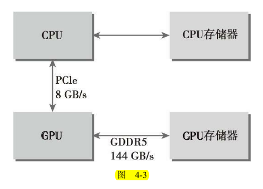
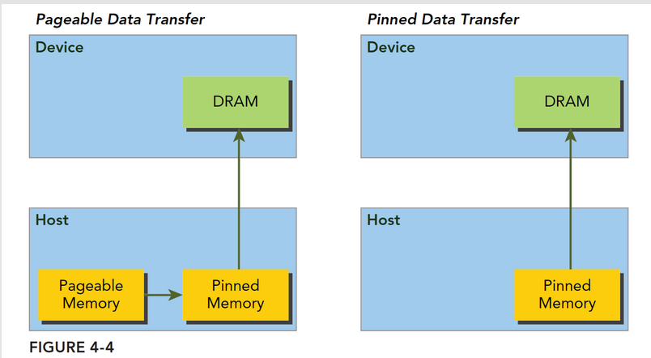
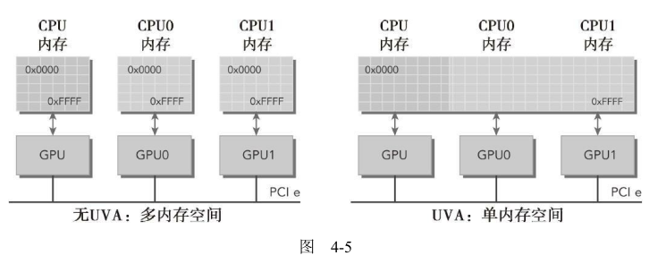

## 4.2 内存管理

CUDA编程的内存管理与C语言的类似，需要程序员显式地管理主机和设备之间的数据移动。工作重点在于如何使用CUDA函数来显式地管理内存和数据移动。

* 分配和释放设备内存
* 在主机和设备之间传输数据

### 4.2.1内存分配和释放

CUDA编程模型假设了一个包含一个主机和一个设备的异构系统（例如我们常用的PC的CPU与GPU），每一个异构系统都有自己独立的内存空间，我们用C语言或python编程时是在CPU上运行的（除了少数特别情况），因此C代码的内存空间都是在CPU上进行操作，但是有了GPU后，名内存空间是独立的，但是CUDA提供了接口函数在CPU上对GPU内存进行一些操作，例如下面讲到的申请、移动、释放。**核函数在设备内存空间中运行，CUDA运行时提供函数以分配和释放设备内存**。你可以在**主机上**使用下列函数分配**全局内存**：

```C
cudaError_t cudaMalloc(void ** devPtr,size_t count)
```

这个函数在设备上分配了count字节的全局内存，并用devptr指针返回该内存的地址。Malloc函数执行失败则返回cudaErrorMemoryAllocation。

下列函数将其初始化：

```C
cudaError_t cudaMemset(void * devPtr,int value,size_t count)
```

下代码释放该内存空间：

```C
cudaError_t cudaFree(void * devPtr)
```

套路基本和C语言一致。设备内存的分配和释放操作成本较高，所以应用程序应重利用设备内存，以减少对整体性能的影响。

### 4.2.2 内存传输

使用下列函数在主机（CPU）和设备（GPU）传输数据：

```C
cudaError_t cudaMemcpy(void *dst,const void * src,size_t count,enum cudaMemcpyKind kind)
```

第一个参数dst是目标地址，第二个参数src是原始地址，然后是拷贝的内存大小，最后是传输类型，传输类型包括以下几种：

- cudaMemcpyHostToHost
- cudaMemcpyHostToDevice
- cudaMemcpyDeviceToHost
- cudaMemcpyDeviceToDevice

这个函数在大多数情况下都是**同步**的。

代码清单4-2是一个使用`cudaMemcpy`的例子。这个例子展示了在主机和设备之间来回地传输数据。使用`cudaMalloc`分配全局内存，使用`cudaMemcpy`将数据传输给设备，传输方向由`cudaMemcpyHostToDevice`指定。然后使用`cudaMemcpy`将数据传回主机，方向由`cudaMemcpyDeviceToHost`指定。

```C
#include "../common/common.h"
#include <cuda_runtime.h>
#include <stdio.h>

/*
 * An example of using CUDA's memory copy API to transfer data to and from the
 * device. In this case, cudaMalloc is used to allocate memory on the GPU and
 * cudaMemcpy is used to transfer the contents of host memory to an array
 * allocated using cudaMalloc.
 */

int main(int argc, char **argv)
{
    // set up device
    int dev = 0;
    CHECK(cudaSetDevice(dev));

    // memory size
    unsigned int isize = 1 << 22;
    unsigned int nbytes = isize * sizeof(float);

    // get device information
    cudaDeviceProp deviceProp;
    CHECK(cudaGetDeviceProperties(&deviceProp, dev));
    printf("%s starting at ", argv[0]);
    printf("device %d: %s memory size %d nbyte %5.2fMB\n", dev,
           deviceProp.name, isize, nbytes / (1024.0f * 1024.0f));

    // allocate the host memory
    float *h_a = (float *)malloc(nbytes);

    // allocate the device memory
    float *d_a;
    CHECK(cudaMalloc((float **)&d_a, nbytes));

    // initialize the host memory
    for(unsigned int i = 0; i < isize; i++) h_a[i] = 0.5f;

    // transfer data from the host to the device
    CHECK(cudaMemcpy(d_a, h_a, nbytes, cudaMemcpyHostToDevice));

    // transfer data from the device to the host
    CHECK(cudaMemcpy(h_a, d_a, nbytes, cudaMemcpyDeviceToHost));

    // free memory
    CHECK(cudaFree(d_a));
    free(h_a);

    // reset device
    CHECK(cudaDeviceReset());
    return EXIT_SUCCESS;
}

```

图4-3所示为CPU内存和GPU内存间的连接性能。从图中可以看到GPU芯片和板载GDDR5 GPU内存之间的理论峰值带宽非常高，对于Fermi C2050 GPU来说为144GB/s。CPU和GPU之间通过PCIe Gen2总线相连，这种连接的理论带宽要低得多，为8GB/s（PCIeGen3总线最大理论限制值是16GB/s）。这种差距意味着如果管理不当的话，主机和设备间的数据传输会降低应用程序的整体性能。因此，**CUDA编程的一个基本原则应是尽可能地减少主机与设备之间的传输**。



### 4.2.3 固定内存

**主机内存**采用分页式管理(pageable)，通俗的说法就是操作系统把物理内存分成一些“页”，然后给一个应用程序一大块内存，但是这一大块内存可能在一些不连续的页上，应用只能看到虚拟的内存地址，而操作系统可能随时更换物理地址的页（从原始地址复制到另一个地址）但是应用是不会差觉得，但是从主机传输到设备上的时候，如果此时发生了页面移动，对于传输操作来说是致命的，所以在数据传输之前，CUDA驱动会锁定页面，或者直接分配固定的主机内存，将主机源数据复制到固定内存上，然后从固定内存传输数据到设备上：



上图左边是正常分配内存，传输过程是：锁页-复制到固定内存-复制到设备
右边时分配时就是固定内存，直接传输到设备上。

你可以理解为 Page lock Memory 是 VIP 房间，锁定给你一个人用。而 Pageable Memory 是普通房间，在酒店房间不够的时候，选择性的把你的房间腾出来给其他人交换用(交换到硬盘上)，这就可以容纳更多人了。**造成房间很多的假象，代价是性能降低**

CUDA运行时允许你使用如下指令直接分配**固定主机内存**（注意不是分配GPU内存，是分配类似于malloc的主机内存）：

```C
cudaError_t cudaMallocHost(void ** devPtr,size_t count)
```

这个函数分配了count字节的主机内存，这些内存是页面锁定的并且对设备来说是可访问的。由于固定内存能被设备直接访问，所以它能用比可分页内存高得多的带宽进行读写。

固定的主机内存释放使用：

```C
cudaError_t cudaFreeHost(void *ptr)
```

下面的例子与4.2.2基本一致，但是CPU端的主机内存使用的是pinned内存，也就是固定页内存。

```C
#include "../common/common.h"
#include <cuda_runtime.h>
#include <stdio.h>

/*
 * An example of using CUDA's memory copy API to transfer data to and from the
 * device. In this case, cudaMalloc is used to allocate memory on the GPU and
 * cudaMemcpy is used to transfer the contents of host memory to an array
 * allocated using cudaMalloc. Host memory is allocated using cudaMallocHost to
 * create a page-locked host array.
 */

int main(int argc, char **argv)
{
    // set up device
    int dev = 0;
    CHECK(cudaSetDevice(dev));

    // memory size
    unsigned int isize = 1 << 22;
    unsigned int nbytes = isize * sizeof(float);

    // get device information
    cudaDeviceProp deviceProp;
    CHECK(cudaGetDeviceProperties(&deviceProp, dev));

    if (!deviceProp.canMapHostMemory)
    {
        printf("Device %d does not support mapping CPU host memory!\n", dev);
        CHECK(cudaDeviceReset());
        exit(EXIT_SUCCESS);
    }

    printf("%s starting at ", argv[0]);
    printf("device %d: %s memory size %d nbyte %5.2fMB canMap %d\n", dev,
           deviceProp.name, isize, nbytes / (1024.0f * 1024.0f),
           deviceProp.canMapHostMemory);

    // allocate pinned host memory
    float *h_a;
    CHECK(cudaMallocHost ((float **)&h_a, nbytes));

    // allocate device memory
    float *d_a;
    CHECK(cudaMalloc((float **)&d_a, nbytes));

    // initialize host memory
    memset(h_a, 0, nbytes);

    for (int i = 0; i < isize; i++) h_a[i] = 100.10f;

    // transfer data from the host to the device
    CHECK(cudaMemcpy(d_a, h_a, nbytes, cudaMemcpyHostToDevice));

    // transfer data from the device to the host
    CHECK(cudaMemcpy(h_a, d_a, nbytes, cudaMemcpyDeviceToHost));

    // free memory
    CHECK(cudaFree(d_a));
    CHECK(cudaFreeHost(h_a));

    // reset device
    CHECK(cudaDeviceReset());
    return EXIT_SUCCESS;
}

```

对比两这之间的内存拷贝实际ian如下

```bash
zmurder@zmurder:~/WorkSpace/zyd/note/cuda/CUDAC编程权威指南练习code/chapter04$ nvprof ./memTransfer
==1682219== NVPROF is profiling process 1682219, command: ./memTransfer
./memTransfer starting at device 0: Quadro P2000 memory size 4194304 nbyte 16.00MB
==1682219== Profiling application: ./memTransfer
==1682219== Profiling result:
            Type  Time(%)      Time     Calls       Avg       Min       Max  Name
 GPU activities:   51.27%  1.8903ms         1  1.8903ms  1.8903ms  1.8903ms  [CUDA memcpy HtoD]
                   48.73%  1.7969ms         1  1.7969ms  1.7969ms  1.7969ms  [CUDA memcpy DtoH]
      API calls:   72.20%  138.40ms         1  138.40ms  138.40ms  138.40ms  cudaMalloc
                   25.46%  48.816ms         1  48.816ms  48.816ms  48.816ms  cudaDeviceReset
                    2.09%  4.0120ms         2  2.0060ms  1.9514ms  2.0606ms  cudaMemcpy
                    0.09%  174.48us         1  174.48us  174.48us  174.48us  cudaFree
                    0.07%  139.85us       101  1.3840us     177ns  63.176us  cuDeviceGetAttribute
                    0.05%  96.258us         1  96.258us  96.258us  96.258us  cudaGetDeviceProperties
                    0.02%  37.649us         1  37.649us  37.649us  37.649us  cuDeviceGetName
                    0.01%  16.478us         1  16.478us  16.478us  16.478us  cuDeviceGetPCIBusId
                    0.00%  4.7350us         1  4.7350us  4.7350us  4.7350us  cudaSetDevice
                    0.00%  1.8140us         3     604ns     275ns  1.0870us  cuDeviceGetCount
                    0.00%     812ns         2     406ns     211ns     601ns  cuDeviceGet
                    0.00%     545ns         1     545ns     545ns     545ns  cuDeviceTotalMem
                    0.00%     375ns         1     375ns     375ns     375ns  cuDeviceGetUuid
zmurder@zmurder:~/WorkSpace/zyd/note/cuda/CUDAC编程权威指南练习code/chapter04$ nvprof ./pinMemTransfer
==1682235== NVPROF is profiling process 1682235, command: ./pinMemTransfer
./pinMemTransfer starting at device 0: Quadro P2000 memory size 4194304 nbyte 16.00MB canMap 1
==1682235== Profiling application: ./pinMemTransfer
==1682235== Profiling result:
            Type  Time(%)      Time     Calls       Avg       Min       Max  Name
 GPU activities:   51.27%  1.3619ms         1  1.3619ms  1.3619ms  1.3619ms  [CUDA memcpy HtoD]
                   48.73%  1.2941ms         1  1.2941ms  1.2941ms  1.2941ms  [CUDA memcpy DtoH]
      API calls:   66.89%  138.00ms         1  138.00ms  138.00ms  138.00ms  cudaHostAlloc
                   30.07%  62.042ms         1  62.042ms  62.042ms  62.042ms  cudaDeviceReset
                    1.47%  3.0384ms         1  3.0384ms  3.0384ms  3.0384ms  cudaFreeHost
                    1.31%  2.7029ms         2  1.3515ms  1.3070ms  1.3959ms  cudaMemcpy
                    0.08%  156.32us       101  1.5470us     217ns  67.033us  cuDeviceGetAttribute
                    0.07%  151.61us         1  151.61us  151.61us  151.61us  cudaFree
                    0.05%  96.445us         1  96.445us  96.445us  96.445us  cudaMalloc
                    0.04%  79.530us         1  79.530us  79.530us  79.530us  cudaGetDeviceProperties
                    0.02%  35.024us         1  35.024us  35.024us  35.024us  cuDeviceGetName
                    0.00%  9.2520us         1  9.2520us  9.2520us  9.2520us  cuDeviceGetPCIBusId
                    0.00%  3.6730us         1  3.6730us  3.6730us  3.6730us  cudaSetDevice
                    0.00%  3.0140us         3  1.0040us     337ns  2.1700us  cuDeviceGetCount
                    0.00%  1.1520us         2     576ns     257ns     895ns  cuDeviceGet
                    0.00%     644ns         1     644ns     644ns     644ns  cuDeviceTotalMem
                    0.00%     445ns         1     445ns     445ns     445ns  cuDeviceGetUuid
zmurder@zmurder:~/WorkSpace/zyd/note/cuda/CUDAC编程权威指南练习code/chapter04$ 

```

可以看出malloc申请的内存 与GPU之间拷贝的平均时间为1.8903ms和1.7969ms

使用cudaMallocHost申请的内存与GPU之间的拷贝时间为1.3619ms和1.2941ms。的确是快了。

###  4.2.4 零拷贝内存

通常来说，主机不能直接访问设备变量，同时设备也不能直接访问主机变量。但有一
个例外：零拷贝内存。**主机和设备都可以访问零拷贝内存**。GPU线程可以直接访问零拷贝内存。在CUDA核函数中使用零拷贝内存有以下几个优势。

* 当设备内存不足时可利用主机内存
* 避免主机和设备间的显式数据传输
* 提高PCIe传输率

当使用零拷贝内存来共享主机和设备间的数据时，你必须同步主机和设备间的内存访问，同时更改主机和设备的零拷贝内存中的数据将导致不可预知的后果。

可以通过以下函数创建零拷贝内存：

```c
cudaError_t cudaHostAlloc(void ** pHost,size_t count,unsigned int flags)
```

这个函数分配了count字节的主机内存，**该内存是页面锁定的且设备可访问的**。最后一个标志参数，可以选择以下值：

* cudaHostAllocDefalt : 和cudaMallocHost函数一致
* cudaHostAllocPortable:返回能被所有CUDA上下文使用的固定内存
* cudaHostAllocWriteCombined:返回写结合内存，在某些设备上这种内存传输效率更高
* cudaHostAllocMapped:零拷贝内存

释放使用：（和固定页内存一样）

```C
cudaError_t cudaFreeHost(void *ptr)
```

零拷贝内存虽然不需要显式的传递到设备上，但是设备还不能通过pHost直接访问对应的内存地址，设备需要访问主机上的零拷贝内存，需要先获得另一个地址，这个地址帮助设备访问到主机对应的内存，函数为

```C
cudaError_t cudaHostGetDevicePointer(void ** pDevice,void * pHost,unsigned flags);
```

该函数返回了一个在pDevice中的设备指针，该指针可以在设备上被引用以访问映射
得到的固定主机内存。

**在进行频繁的读写操作时，使用零拷贝内存作为设备内存的补充将显著降低性能**。因为每一次映射到内存的传输必须经过PCIe总线。与全局内存相比，延迟也显著增加。

下面代码演示了零拷贝内存的使用方法，第一部分先使用malloc和cudamalloc来申请主机和设备内存，这也是常用的流程。第二部分作为对比使用cudaHostAlloc来申请设备内存。

两部分最大的差别就是第一部分使用了cudaMemcpy，但是第二部分的另拷贝内存没有使用。

```C
#include "../common/common.h"
#include <cuda_runtime.h>
#include <stdio.h>

/*
 * This example demonstrates the use of zero-copy memory to remove the need to
 * explicitly issue a memcpy operation between the host and device. By mapping
 * host, page-locked memory into the device's address space, the address can
 * directly reference a host array and transfer its contents over the PCIe bus.
 *
 * This example compares performing a vector addition with and without zero-copy
 * memory.
 */

void checkResult(float *hostRef, float *gpuRef, const int N)
{
    double epsilon = 1.0E-8;

    for (int i = 0; i < N; i++)
    {
        if (abs(hostRef[i] - gpuRef[i]) > epsilon)
        {
            printf("Arrays do not match!\n");
            printf("host %5.2f gpu %5.2f at current %d\n", hostRef[i],
                    gpuRef[i], i);
            break;
        }
    }

    return;
}

void initialData(float *ip, int size)
{
    int i;

    for (i = 0; i < size; i++)
    {
        ip[i] = (float)( rand() & 0xFF ) / 10.0f;
    }

    return;
}

void sumArraysOnHost(float *A, float *B, float *C, const int N)
{
    for (int idx = 0; idx < N; idx++)
    {
        C[idx] = A[idx] + B[idx];
    }
}

__global__ void sumArrays(float *A, float *B, float *C, const int N)
{
    int i = blockIdx.x * blockDim.x + threadIdx.x;

    if (i < N) C[i] = A[i] + B[i];
}

__global__ void sumArraysZeroCopy(float *A, float *B, float *C, const int N)
{
    int i = blockIdx.x * blockDim.x + threadIdx.x;

    if (i < N) C[i] = A[i] + B[i];
}

int main(int argc, char **argv)
{
    // set up device
    int dev = 0;
    CHECK(cudaSetDevice(dev));

    // get device properties
    cudaDeviceProp deviceProp;
    CHECK(cudaGetDeviceProperties(&deviceProp, dev));

    // check if support mapped memory
    if (!deviceProp.canMapHostMemory)
    {
        printf("Device %d does not support mapping CPU host memory!\n", dev);
        CHECK(cudaDeviceReset());
        exit(EXIT_SUCCESS);
    }

    printf("Using Device %d: %s ", dev, deviceProp.name);

    // set up data size of vectors
    int ipower = 10;

    if (argc > 1) ipower = atoi(argv[1]);

    int nElem = 1 << ipower;
    size_t nBytes = nElem * sizeof(float);

    if (ipower < 18)
    {
        printf("Vector size %d power %d  nbytes  %3.0f KB\n", nElem, ipower,
               (float)nBytes / (1024.0f));
    }
    else
    {
        printf("Vector size %d power %d  nbytes  %3.0f MB\n", nElem, ipower,
               (float)nBytes / (1024.0f * 1024.0f));
    }

    // part 1: using device memory
    // malloc host memory
    float *h_A, *h_B, *hostRef, *gpuRef;
    h_A     = (float *)malloc(nBytes);
    h_B     = (float *)malloc(nBytes);
    hostRef = (float *)malloc(nBytes);
    gpuRef  = (float *)malloc(nBytes);

    // initialize data at host side
    initialData(h_A, nElem);
    initialData(h_B, nElem);
    memset(hostRef, 0, nBytes);
    memset(gpuRef,  0, nBytes);

    // add vector at host side for result checks
    sumArraysOnHost(h_A, h_B, hostRef, nElem);

    // malloc device global memory
    float *d_A, *d_B, *d_C;
    CHECK(cudaMalloc((float**)&d_A, nBytes));
    CHECK(cudaMalloc((float**)&d_B, nBytes));
    CHECK(cudaMalloc((float**)&d_C, nBytes));

    // transfer data from host to device
    CHECK(cudaMemcpy(d_A, h_A, nBytes, cudaMemcpyHostToDevice));
    CHECK(cudaMemcpy(d_B, h_B, nBytes, cudaMemcpyHostToDevice));

    // set up execution configuration
    int iLen = 512;
    dim3 block (iLen);
    dim3 grid  ((nElem + block.x - 1) / block.x);

    sumArrays<<<grid, block>>>(d_A, d_B, d_C, nElem);

    // copy kernel result back to host side
    CHECK(cudaMemcpy(gpuRef, d_C, nBytes, cudaMemcpyDeviceToHost));

    // check device results
    checkResult(hostRef, gpuRef, nElem);

    // free device global memory
    CHECK(cudaFree(d_A));
    CHECK(cudaFree(d_B));

    // free host memory
    free(h_A);
    free(h_B);

    // part 2: using zerocopy memory for array A and B
    // allocate zerocpy memory
    CHECK(cudaHostAlloc((void **)&h_A, nBytes, cudaHostAllocMapped));
    CHECK(cudaHostAlloc((void **)&h_B, nBytes, cudaHostAllocMapped));

    // initialize data at host side
    initialData(h_A, nElem);
    initialData(h_B, nElem);
    memset(hostRef, 0, nBytes);
    memset(gpuRef,  0, nBytes);

    // pass the pointer to device
    CHECK(cudaHostGetDevicePointer((void **)&d_A, (void *)h_A, 0));
    CHECK(cudaHostGetDevicePointer((void **)&d_B, (void *)h_B, 0));

    // add at host side for result checks
    sumArraysOnHost(h_A, h_B, hostRef, nElem);

    // execute kernel with zero copy memory
    sumArraysZeroCopy<<<grid, block>>>(d_A, d_B, d_C, nElem);

    // copy kernel result back to host side
    CHECK(cudaMemcpy(gpuRef, d_C, nBytes, cudaMemcpyDeviceToHost));

    // check device results
    checkResult(hostRef, gpuRef, nElem);

    // free  memory
    CHECK(cudaFree(d_C));
    CHECK(cudaFreeHost(h_A));
    CHECK(cudaFreeHost(h_B));

    free(hostRef);
    free(gpuRef);

    // reset device
    CHECK(cudaDeviceReset());
    return EXIT_SUCCESS;
}

```

如果你想共享主机和设备端的少量数据，零拷贝内存可能会是一个不错的选择，因为它简化了编程并且有较好的性能。**对于由PCIe总线连接的离散GPU上的更大数据集来说，零拷贝内存不是一个好的选择，它会导致性能的显著下降。在集成架构中，CPU和GPU集成在一个芯片上，并且在物理地址上共享主存。在这种架构中，由于无须在PCIe总线上备份，所以零拷贝内存在性能和可编程性方面可能更佳。**

### 4.2.5 统一虚拟寻址

计算能力为2.0及以上版本的设备支持一种特殊的寻址方式，称为统一虚拟寻址（UVA）。UVA，在CUDA 4.0中被引入，支持64位Linux系统。有了UVA，主机内存和设备内存可以共享同一个虚拟地址空间，如图4-5所示。



UVA，由指针指向的内存空间对应用程序代码来说是透明的。通过UVA，由cudaHostAlloc分配的固定主机内存具有相同的主机和设备指针。因此，**可以将返回的指针直接传递给核函数**。回忆前一节中的零拷贝例子，可以知道以下几个方面。

* 分配映射的固定主机内存
* 使用CUDA运行时函数获取映射到固定内存的设备指针
* 将设备指针传递给核函数

有了UVA，无须获取设备指针或管理物理上数据完全相同的两个指针。UVA会进一步简化前一节中的sumArrayZerocpy.cu示例：

有了UVA，可以不用上面的那个获得设备上访问零拷贝内存的函数了：

```C
cudaError_t cudaHostGetDevicePointer(void ** pDevice,void * pHost,unsigned flags);
```

UVA来了以后，此函数基本失业了。

```C
    // malloc device global memory
    float  *d_C;
    CHECK(cudaMalloc((float**)&d_C, nBytes));
    // part 2: using zerocopy memory for array A and B
    // allocate zerocpy memory
    CHECK(cudaHostAlloc((void **)&h_A, nBytes, cudaHostAllocMapped));
    CHECK(cudaHostAlloc((void **)&h_B, nBytes, cudaHostAllocMapped));

    // initialize data at host side
    initialData(h_A, nElem);
    initialData(h_B, nElem);

    // execute kernel with zero copy memory
    sumArraysZeroCopy<<<grid, block>>>(h_A, h_B, d_C, nElem);
```

使用更少的代码取得相同的结果，这提高了应用程序的可读性和可维护性。

### 4.2.6 统一内存寻址

Nvidia的同志们还是不停的搞出新花样，CUDA6.0的时候又来了个统一内存寻址，注意不是同一虚拟寻址，提出的目的也是为了简化内存管理（我感觉是越简化越困难，因为套路多了）统一内存中创建一个托管内存池（CPU上有，GPU上也有），内存池中已分配的空间可以通过相同的指针直接被CPU和GPU访问，底层系统在统一的内存空间中自动的进行设备和主机间的传输。数据传输对应用是透明的，大大简化了代码。
就是搞个内存池，这部分内存用一个指针同时表示主机和设备内存地址，依赖于UVA但是是完全不同的技术。
统一内存寻址提供了一个“指针到数据”的编程模型，概念上类似于零拷贝，但是零拷贝内存的分配是在主机上完成的，而且需要互相传输，但是统一寻址不同。
托管内存是指底层系统自动分配的统一内存，未托管内存就是我们自己分配的内存，这时候对于核函数，可以传递给他两种类型的内存，已托管和未托管内存，可以同时传递。
托管内存可以是静态的，也可以是动态的，添加 **managed** 关键字修饰托管内存变量。静态声明的托管内存作用域是文件，这一点可以注意一下。
托管内存分配方式：

```C
cudaError_t cudaMallocManaged(void ** devPtr,size_t size,unsigned int flags=0)
```

这个函数和前面函数结构一致，注意函数名就好了，参数就不解释了，很明显了已经。
CUDA6.0中设备代码不能调用cudaMallocManaged，只能主机调用，所有托管内存必须在主机代码上动态声明，或者全局静态声明

* 后面4.5 我们会详细的研究统一内存寻址。
