# 4.3 内存访问模式

并且多数GPU应用程序容易受内存带宽的限制。因此，最大限度地利用全局内存带宽是调控核函数性能的基本

## 4.3.1 对齐与合并访问

如图4-6所示，**全局内存通过缓存来实现加载/存储**。全局内存是一个逻辑内存空间，你可以通过核函数访问它。所有的应用程序数据最初存在于DRAM上，即物理设备内存中。**核函数的内存请求通常是在DRAM设备和片上内存间以128字节或32字节内存事务来实现的**。


所有对全局内存的访问都会通过二级缓存，也有许多访问会通过一级缓存，这取决于访问类型和GPU架构。如果这两级缓存都被用到，那么内存访问是由一个128字节的内存事务实现的。如果只使用了二级缓存，那么这个内存访问是由一个32字节的内存事务实现的。对全局内存缓存其架构，如果允许使用一级缓存，那么可以在编译时选择启用或禁用一级缓存。

因此在优化应用程序时，你需要注意设备内存访问的两个特性：

* **对齐内存访问**：当设备内存事务的第一个地址是用于事务服务的缓存粒度的偶数倍时（32字节的二级缓存或128字节的一级缓存），就会出现**对齐内存访问**。运行非对齐的加载会造成带宽浪费。
* **合并内存访问**：当一个线程束中全部的32个线程访问一个连续的内存块时，就会出现合并内存访问。

需要注意的一点是官方[5.3.2. Device Memory Accesses](https://docs.nvidia.com/cuda/cuda-c-programming-guide/index.html#device-memory-accesses)中的一段话

`Any address of a variable residing in global memory or returned by  one of the memory allocation routines from the driver or runtime API is  always aligned to at least 256 bytes.`

**我就是我们使用cuda 的API申请的内存都是256字节对齐的，也就是满足对齐内存访问的。**

下面是两个图示的例子：

图4-7描述了**对齐与合并**内存的加载操作。在这种情况下，只需要一个128字节的内存事务从设备内存中读取数据。


图4-8展示了**非对齐和未合并**的内存访问。在这种情况下，可能需要3个128字节的内存事务来从设备内存中读取数据：一个在偏移量为0的地方开始，读取连续地址之后的数据；一个在偏移量为256的地方开始，读取连续地址之前的数据；另一个在偏移量为128的地方开始读取大量的数据。

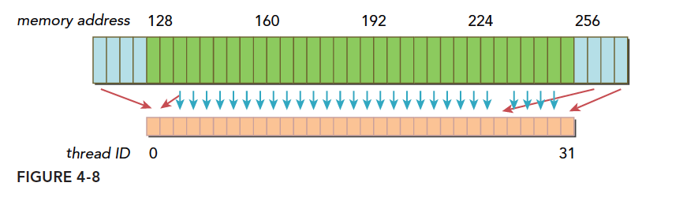

## 4.3.2 全局内存读取

注意我们说的都是读取，也就是加载过程，写或者叫做存储是另外一回事！
SM加载数据，根据不同的设备和类型分为三种路径：

1. 一级和二级缓存
2. 常量缓存
3. 只读缓存

常规的路径是一级和二级缓存，需要使用常量和只读缓存的需要在代码中显式声明。但是提高性能，主要还是要取决于访问模式。
控制全局加载操作是否通过一级缓存可以通过编译选项来控制，当然比较老的设备可能就没有一级缓存。
编译器禁用一级缓存的选项是：

```shell
-Xptxas -dlcm=cg
```

编译器启用一级缓存的选项是：

```shell
-Xptxas -dlcm=ca
```

当一级缓存被禁用的时候，对全局内存的加载请求直接进入二级缓存，如果二级缓存缺失，则由DRAM完成请求。
每次内存事务可由一个两个或者四个部分执行，每个部分有32个字节，也就是32，64或者128字节一次（注意前面我们讲到是否使用一级缓存决定了读取粒度是128还是32字节，这里增加的64并不在此情况，所以需要注意）。
启用一级缓存后，当SM有全局加载请求会首先通过尝试一级缓存，如果一级缓存缺失，则尝试二级缓存，如果二级缓存也没有，那么直接DRAM。
在有些设备上一级缓存不用来缓存全局内存访问，而是只用来存储寄存器溢出的本地数据，比如Kepler 的K10,K20。
内存加载可以分为两类：

- 缓存加载
- 没有缓存的加载

内存访问有以下特点：

- 是否使用缓存：一级缓存是否介入加载过程
- 对齐与非对齐的：如果访问的第一个地址是32的倍数
- 合并与非合并，访问连续数据块则是合并的

### 4.3.2.1 缓存加载

下面是使用一级缓存的加载过程，图片表达很清楚，我们只用少量文字进行说明：

1. 对齐合并的访问，利用率100%
   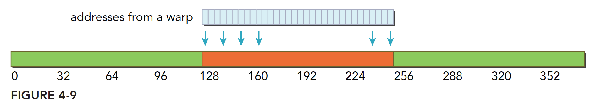
2. 对齐的，但是不是连续的，每个线程访问的数据都在一个块内，但是位置是交叉的，利用率100%
   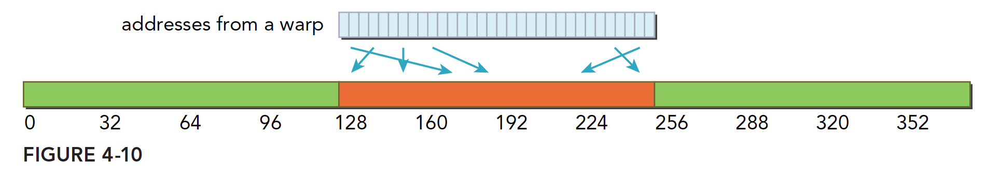
3. 连续非对齐的，线程束请求一个连续的非对齐的，32个4字节数据，那么会出现，数据横跨两个块，但是没有对齐，当启用一级缓存的时候，就要两个128字节的事务来完成
   
4. 线程束所有线程请求同一个地址，那么肯定落在一个缓存行范围（缓存行的概念没提到过，就是主存上一个可以被一次读到缓存中的一段数据。），那么如果按照请求的是4字节数据来说，使用一级缓存的利用率是 4128=3.125%
   
5. 比较坏的情况，前面提到过最坏的，就是每个线程束内的线程请求的都是不同的缓存行内，这里比较坏的情况就是，所有数据分布在 N 个缓存行上，其中 1≤N≤32，那么请求32个4字节的数据，就需要 N 个事务来完成，利用率也是 1N
   

CPU和GPU的一级缓存有显著的差异，GPU的一级缓存可以通过编译选项等控制，CPU不可以，而且CPU的一级缓存是的替换算法是有使用频率和时间局部性的，GPU则没有。

### 4.3.2.2 没有缓存的加载

没有缓存的加载是指的没有通过一级缓存，二级缓存则是不得不经过的。
当不使用一级缓存的时候，内存事务的粒度变为32字节，更细粒度的好处是提高利用率。
继续我们的图解：

1. 对齐合并访问128字节，不用说，还是最理想的情况，使用4个段，利用率 100%
   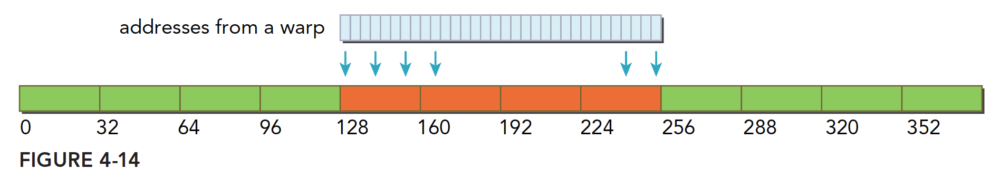
2. 对齐不连续访问128字节，都在四个段内，且互不相同，这样的利用率也是  100%
   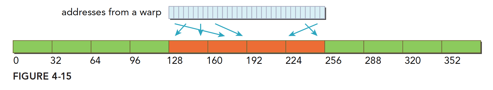
3. 连续不对齐，一个段32字节，所以，一个连续的128字节的请求，即使不对齐，最多也不会超过五个段，所以利用率是 45=80% ,如果不明白为啥不能超过5个段，请注意前提是连续的，这个时候不可能超过五段
   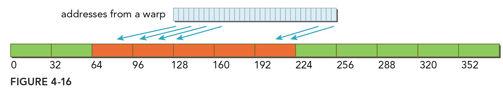
4. 所有线程访问一个4字节的数据，那么此时的利用率是 432=12.5%
   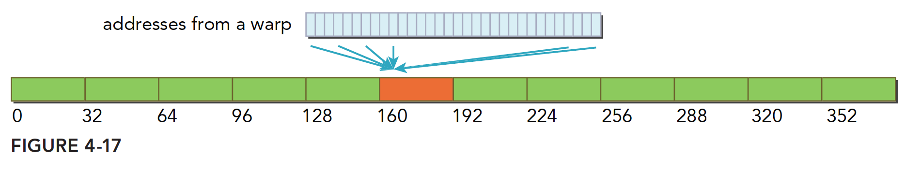
5. 最欢的情况，所有目标数据分散在内存的各个角落，那么需要 N个内存段， 此时与使用一级缓存的作比较也是有优势的因为 N×128 还是要比 N×32 大不少，这里假设 N 不会因为 128 还是 32 而变的，而实际情况，当使用大粒度的缓存行的时候， N 有可能会减小
   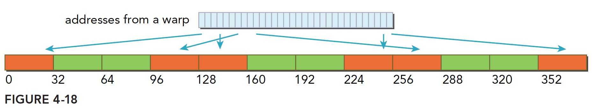

### 4.3.2.3 非对齐读取的示例

为了说明核函数中非对齐访问对性能的影响，我们对第3章中使用的向量加法代码进行修改，去掉所有的内存加载操作，来指定一个偏移量。当然也要保障不越界

```C
__global__ void readOffset(float *A, float *B, float *C, const int n,
                           int offset)
{
    unsigned int i = blockIdx.x * blockDim.x + threadIdx.x;
    unsigned int k = i + offset;

    if (k < n) C[i] = A[k] + B[k];
}
```

完整代码如下

```C
#include "../common/common.h"
#include <cuda_runtime.h>
#include <stdio.h>

/*
 * This example demonstrates the impact of misaligned reads on performance by
 * forcing misaligned reads to occur on a float*.
 */

void checkResult(float *hostRef, float *gpuRef, const int N)
{
    double epsilon = 1.0E-8;
    bool match = 1;

    for (int i = 0; i < N; i++)
    {
        if (abs(hostRef[i] - gpuRef[i]) > epsilon)
        {
            match = 0;
            printf("different on %dth element: host %f gpu %f\n", i, hostRef[i],
                    gpuRef[i]);
            break;
        }
    }

    if (!match)  printf("Arrays do not match.\n\n");
}

void initialData(float *ip,  int size)
{
    for (int i = 0; i < size; i++)
    {
        ip[i] = (float)( rand() & 0xFF ) / 100.0f;
    }

    return;
}


void sumArraysOnHost(float *A, float *B, float *C, const int n, int offset)
{
    for (int idx = offset, k = 0; idx < n; idx++, k++)
    {
        C[k] = A[idx] + B[idx];
    }
}

__global__ void warmup(float *A, float *B, float *C, const int n, int offset)
{
    unsigned int i = blockIdx.x * blockDim.x + threadIdx.x;
    unsigned int k = i + offset;

    if (k < n) C[i] = A[k] + B[k];
}

__global__ void readOffset(float *A, float *B, float *C, const int n,
                           int offset)
{
    unsigned int i = blockIdx.x * blockDim.x + threadIdx.x;
    unsigned int k = i + offset;

    if (k < n) C[i] = A[k] + B[k];
}

int main(int argc, char **argv)
{
    // set up device
    int dev = 0;
    cudaDeviceProp deviceProp;
    CHECK(cudaGetDeviceProperties(&deviceProp, dev));
    printf("%s starting reduction at ", argv[0]);
    printf("device %d: %s ", dev, deviceProp.name);
    CHECK(cudaSetDevice(dev));

    // set up array size
    int nElem = 1 << 20; // total number of elements to reduce
    printf(" with array size %d\n", nElem);
    size_t nBytes = nElem * sizeof(float);

    // set up offset for summary
    int blocksize = 512;
    int offset = 0;

    if (argc > 1) offset    = atoi(argv[1]);

    if (argc > 2) blocksize = atoi(argv[2]);

    // execution configuration
    dim3 block (blocksize, 1);
    dim3 grid  ((nElem + block.x - 1) / block.x, 1);

    // allocate host memory
    float *h_A = (float *)malloc(nBytes);
    float *h_B = (float *)malloc(nBytes);
    float *hostRef = (float *)malloc(nBytes);
    float *gpuRef  = (float *)malloc(nBytes);

    //  initialize host array
    initialData(h_A, nElem);
    memcpy(h_B, h_A, nBytes);

    //  summary at host side
    sumArraysOnHost(h_A, h_B, hostRef, nElem, offset);

    // allocate device memory
    float *d_A, *d_B, *d_C;
    CHECK(cudaMalloc((float**)&d_A, nBytes));
    CHECK(cudaMalloc((float**)&d_B, nBytes));
    CHECK(cudaMalloc((float**)&d_C, nBytes));

    // copy data from host to device
    CHECK(cudaMemcpy(d_A, h_A, nBytes, cudaMemcpyHostToDevice));
    CHECK(cudaMemcpy(d_B, h_A, nBytes, cudaMemcpyHostToDevice));

    //  kernel 1:
    double iStart = seconds();
    warmup<<<grid, block>>>(d_A, d_B, d_C, nElem, offset);
    CHECK(cudaDeviceSynchronize());
    double iElaps = seconds() - iStart;
    printf("warmup     <<< %4d, %4d >>> offset %4d elapsed %f sec\n", grid.x,
           block.x, offset, iElaps);
    CHECK(cudaGetLastError());

    iStart = seconds();
    readOffset<<<grid, block>>>(d_A, d_B, d_C, nElem, offset);
    CHECK(cudaDeviceSynchronize());
    iElaps = seconds() - iStart;
    printf("readOffset <<< %4d, %4d >>> offset %4d elapsed %f sec\n", grid.x,
           block.x, offset, iElaps);
    CHECK(cudaGetLastError());

    // copy kernel result back to host side and check device results
    CHECK(cudaMemcpy(gpuRef, d_C, nBytes, cudaMemcpyDeviceToHost));
    checkResult(hostRef, gpuRef, nElem - offset);

    // free host and device memory
    CHECK(cudaFree(d_A));
    CHECK(cudaFree(d_B));
    CHECK(cudaFree(d_C));
    free(h_A);
    free(h_B);

    // reset device
    CHECK(cudaDeviceReset());
    return EXIT_SUCCESS;
}

```

编译运行如下

```bash
zmurder@zmurder:~/chapter04$ ./readSegment 0
./readSegment starting reduction at device 0: Quadro P2000  with array size 1048576
warmup     <<< 2048,  512 >>> offset    0 elapsed 0.000201 sec
readOffset <<< 2048,  512 >>> offset    0 elapsed 0.000110 sec
zmurder@zmurder:~/chapter04$ ./readSegment 11
./readSegment starting reduction at device 0: Quadro P2000  with array size 1048576
warmup     <<< 2048,  512 >>> offset   11 elapsed 0.000199 sec
readOffset <<< 2048,  512 >>> offset   11 elapsed 0.000113 sec
zmurder@zmurder:~/chapter04$ ./readSegment 128
./readSegment starting reduction at device 0: Quadro P2000  with array size 1048576
warmup     <<< 2048,  512 >>> offset  128 elapsed 0.000196 sec
readOffset <<< 2048,  512 >>> offset  128 elapsed 0.000110 sec
```

查看全局加载效率

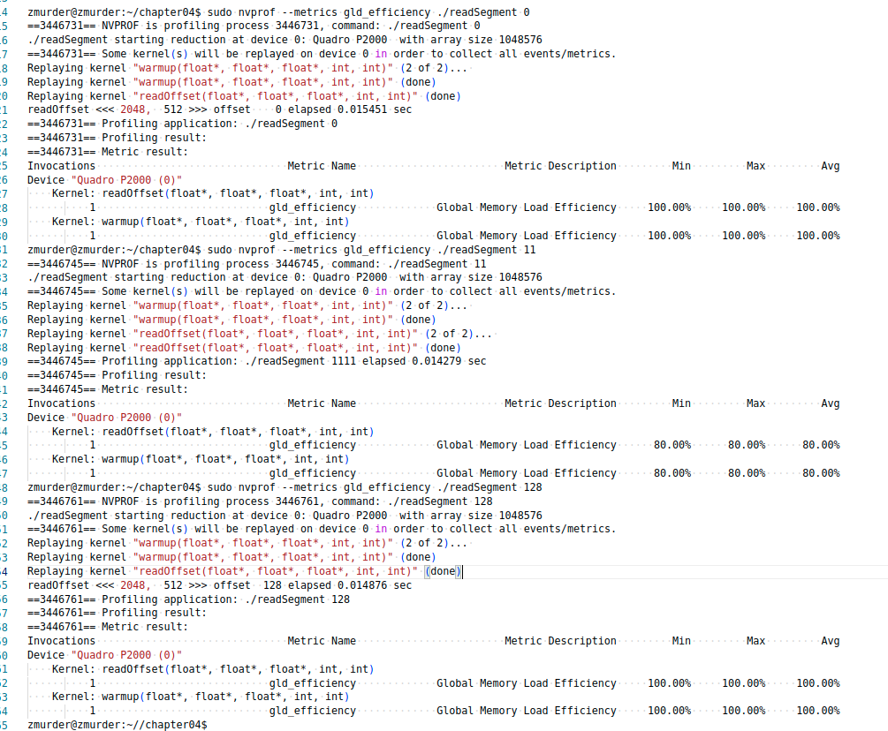

### 4.3.2.4 只读缓存

只读缓存最初是留给纹理内存加载用的，在3.5以上的设备，只读缓存也支持使用全局内存加载代替一级缓存。也就是说3.5以后的设备，可以通过只读缓存从全局内存中读数据了。
只读缓存粒度32字节，对于分散读取，细粒度优于一级缓存
有两种方法指导内存从只读缓存读取：

1. 使用函数 _ldg
2. 在间接引用的指针上使用修饰符

代码：

```C

__global__ void copyKernel(float * in,float* out)
{
    int idx=blockDim*blockIdx.x+threadIdx.x;
    out[idx]=__ldg(&in[idx]);

}
```

注意函数参数，然后就能强制使用只读缓存了。

## 4.3.3 全局内存写入

内存的写入和读取（或者叫做加载）是完全不同的，并且写入相对简单很多。一级缓存不能用在 Fermi 和 Kepler  GPU上进行存储操作，发送到设备前，只经过二级缓存，**存储操作在32个字节的粒度上执行**，内存事物也被分为一段两端或者四段，如果两个地址在一个128字节的段内但不在64字节范围内，则会产生一个四段的事务，其他情况以此类推。
我们将内存写入也参考前面的加载分为下面这些情况：

1. 对齐的，访问一个连续的128字节范围。存储操作使用一个4段事务完成：
   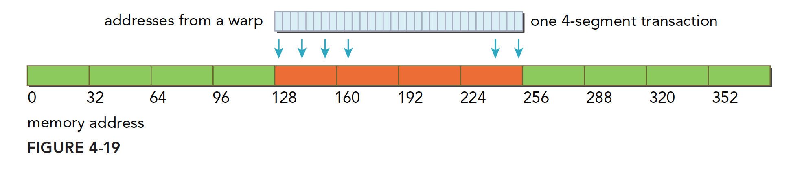
2. 分散在一个192字节的范围内，不连续，使用3个一段事务来搞定
   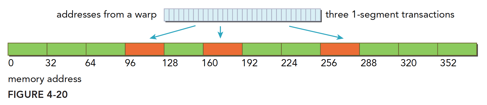
3. 对齐的，在一个64字节的范围内，使用一个两段事务完成。
   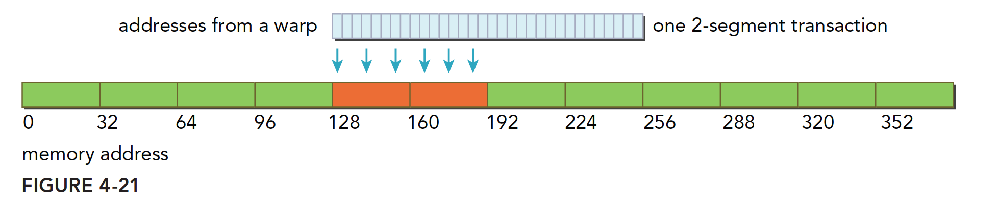

### 4.3.3.1 非对齐写入的示例

修改向量加法核函数。仍然使用两个不同的索引：索引k根据给定的偏移量进行变化，而索引i不变（并因此产生对齐访问）。使用对齐索引i从数组A和数组B中进行加载，以产生良好的内存加载效率。使用偏移量索引x写入数组C，可能会造成非对齐写入，这取决于偏移量的值。

核函数如下

```C
__global__ void writeOffset(float *A, float *B, float *C, const int n,
                            int offset)
{
    unsigned int i = blockIdx.x * blockDim.x + threadIdx.x;
    unsigned int k = i + offset;

    if (k < n) C[k] = A[i] + B[i];
}
```

## 4.3.4 结构体数组与数组结构体

数组结构体（AoS）

```C
struct innerStruct
{
    float x;
    float y;
};
struct innerStruct myAoS[N];
```

结构体数组（SoA）

```C
struct innerArray
{
    float x[N];
    float y[N];
};
struct innerArray mySoA;
```

图4-22说明了AoS和SoA方法的内存布局。用AoS模式在GPU上存储示例数据并执行一个**只有x字段的应用程序**，将导致50%的带宽损失，因为y值在每32个字节段或128个字节缓存行上隐式地被加载。

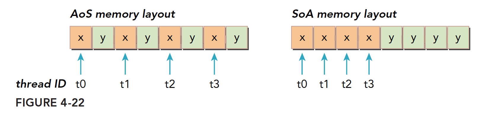

许多并行编程范式，尤其是SIMD型范式，更倾向于使用SoA。**在CUDA C编程中也普遍倾向于使用SoA.**

### 4.3.4.1 示例：使用AoS数据布局的简单数学运算

```C
#define LEN 1<<22

struct innerStruct
{
    float x;
    float y;
};

int blocksize = 128;
// execution configuration
dim3 block (blocksize, 1);
dim3 grid  ((nElem + block.x - 1) / block.x, 1);

__global__ void testInnerStruct(innerStruct *data, innerStruct * result,
                                const int n)
{
    unsigned int i = blockIdx.x * blockDim.x + threadIdx.x;

    if (i < n)
    {
        innerStruct tmp = data[i];
        tmp.x += 10.f;
        tmp.y += 20.f;
        result[i] = tmp;
    }
}
```

运行程序如下

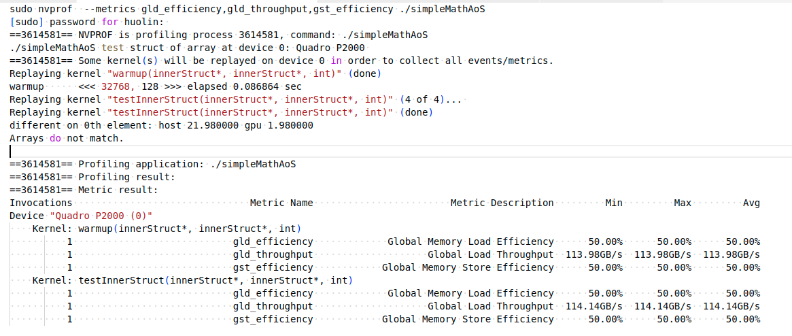

书中的解释是：下面展示的50%的效率结果表明，对于AOS数据布局，加载请求和内存存储请求是重复的。因为字段x和y在内存中是被相邻存储的，并且有相同的大小，每当执行内存事务时都要加载特定字段的值，被加载的字节数的一半也必须属于其他字段。因此，请求加载和存储的50%带宽是未使用的。**但是我没看懂为什么**，一个结构体是`2*4`字节，block为(128,1)，所以一个线程束（32个线程）需要加载`32*2*4=256`字节的内存，按照4.3.2节的描述，需要两次内存事务。但是下面的SoA例子应该是一样的啊。。。不理解。。

这里放几篇查到的内容，看看后期能不能理解

[The SoA Vector – Part 1: Optimizing the Traversal of a Collection](https://www.fluentcpp.com/2018/12/18/the-soa-vector-part-1-optimizing-the-traversal-of-a-collection/) 

[AoS and SoA](https://www.codebooklet.com/2022/10/02/ComputerScience/%5BHPP%5D-AOSandSOA/) 

[AOS & SOA](https://en.algorithmica.org/hpc/cpu-cache/aos-soa/#:~:text=AoS%20performs%20slightly%20better%20because%20it%20can%20compute,this%20causes%20a%20pretty%20complicated%20cache%20associativity%20effect.) 

[SoA vs AoS](https://developer.unity.cn/projects/61ff5161edbc2a001cf9856e)

### 4.3.4.2 示例：使用SoA数据布局的简单数学运算

对应的kernel如下

```C
#define LEN 1<<22
struct innerArray
{
    float x[LEN];
    float y[LEN];
};
int blocksize = 128;

__global__ void testInnerArray(InnerArray *data, InnerArray * result,
                               const int n)
{
    unsigned int i = blockIdx.x * blockDim.x + threadIdx.x;

    if (i < n)
    {
        float tmpx = data->x[i];
        float tmpy = data->y[i];

        tmpx += 10.f;
        tmpy += 20.f;
        result->x[i] = tmpx;
        result->y[i] = tmpy;
    }
}
```

运行结果如下，不明白为什么（书中的解释是100%的效率说明当处理SoA数据布局时，加载或存储内存请求不
会重复。每次访问都由一个独立的内存事务来处理。）

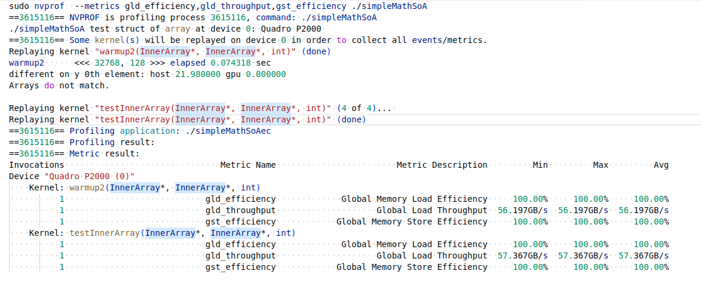

## 4.3.5 性能调整

优化设备内存带宽利用率有两个目标：

- 对齐及合并内存访问， 以减少带宽的浪费
- 足够的并发内存操作， 以隐藏内存延迟

### 4.3.5.1 展开技术

内存操作的循环展开增加了更独立的内存操作。 展开并不影响执行内存操作的数量（只影响并发执行的数量）。

### 4.3.5.2 增大并行性

为了充分体现并行性， 你应该用一个核函数启动的网格和线程块大小进行试验， 以找到该核函数最佳的执行配置。

> 最大化带宽利用率

影响设备内存操作性能的因素主要有两个：

- 有效利用设备DRAM和SM片上内存之间的字节移动： 为了避免设备内存带宽的浪费， 内存访问模式应是对齐和合并的
- 当前的并发内存操作数： 可通过以下两点实现最大化当前存储器操作数。
  - 展开，每个线程产生更多的独立内存访问。
  - 修改核函数启动的执行配置来使每个SM有更多的并行性。

## 附录

[官方nvprof参数说明](https://docs.nvidia.com/cuda/profiler-users-guide/index.html)