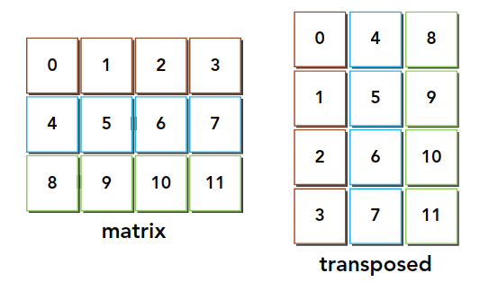
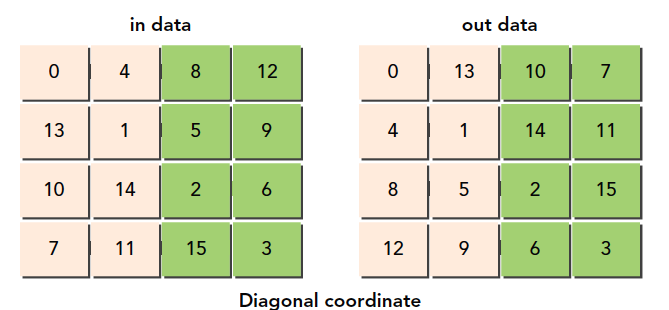

# 4.4 核函数可达到的带宽

在上一节中，你已经尝试使用两种方法来改进核函数的性能：

* 通过最大化并行执行线程束的数量来隐藏内存延迟，通过维持更多正在执行的内存访问来达到更好的总线利用率
* 通过适当的对齐和合并内存访问来最大化内存带宽效率

然而，往往当前问题的本质就是有一个不好的访问模式。对于这样一个核函数来说，什么样的性能才是足够好的呢？

## 4.4.1 内存带宽

理论带宽是当前硬件可以实现的绝对最大带宽，对禁用ECC的Fermi M2090来说，理论上设备内存带宽的峰值为177.6 GB/s。有效带宽是核函数实际达到的带宽，它是测量带宽，可以用下列公式计算：


## 4.4.2 矩阵转置问题

矩阵的转置意味着每一列与相应的一行进行互换。图4-23所示为一个简单的矩阵和它的转置。



CPU实现代码如下

```C
void transposeHost(float *out, float *in, const int nx, const int ny)
{
    for( int iy = 0; iy < ny; ++iy)
    {
        for( int ix = 0; ix < nx; ++ix)
        {
            out[ix * ny + iy] = in[iy * nx + ix];
        }
    }
}
```

在这个函数中有两个用一维数组存储的矩阵：输入矩阵in和转置矩阵out。矩阵维度被定义为nx行ny列。可以用一个一维数组执行转置操作，结果如图4-24所示。


观察输入和输出布局，你会注意到：

* 读：通过原矩阵的行进行访问，结果为合并访问
* 写：通过转置矩阵的列进行访问，结果为交叉访问

交叉访问是使GPU性能变得最差的内存访问模式。但是，在矩阵转置操作中这是不可避免的。**本节的剩余部分将侧重于使用两种转置核函数来提高带宽的利用率：一种是按行读取按列存储，另一种则是按列读取按行存储。**

图4-25所示为第一种方法，图4-26所示为第二种方法。


* 按行读取按列存储：感觉应该是更快的，因为读有内存的合并访问。
* 按列读取按行存储：

但是书中描述如果禁用一级缓存加载，那么这两种实现的性能在理论上是相同的。但是，如果启用一级缓存，那么第二种实现的性能表现会更好。按列读取操作是不合并的（因此带宽将会浪费在未被请求的字节上），将这些额外的字节存入一级缓存意味着下一个读操作可能会在缓存上执行而不在全局内存上执行（**这一句不理解既然按列读时可能在一级缓存中，那么按行读也会在一级缓存啊，为什么？不理解**）。因为写操作不在一级缓存中缓存，所以对按列执行写操作的例子而言，任何缓存都没有意义。

上面的描述牵涉到了读和写的操作和缓存，这里把4.1和4.3对应的内容搬过来回顾分析一下

在GPU上有4种缓存：

* 一级缓存
* 二级缓存
* 只读常量缓存
* 只读纹理缓存

**在CPU上，内存的加载和存储都可以被缓存。但是，在GPU上只有内存加载操作可以被缓存，内存存储操作不能被缓存**。

L1和L2缓存的位置如下图


上图 图灵 TU102 全 GPU 带 72 个 SM 单元，96  KB 的 L1 /共享内存。

内存**读**时否使用一级缓存决定了读取粒度是128还是32字节（使用一级缓存时128字节的颗粒度）

内存**写**只经过二级缓存，**存储操作在32个字节的粒度上执行**

### 4.4.2.1 为转置核函数设置性能的上限和下限

在转置核函数测试之前，首先要知道我们设备性能的上限和下限用来参照。下面就是一个粗略的计算。

- 行读取，行存储来复制矩阵(上限)
- 列读取，列存储来复制矩阵(下限)

对应的两个核函数如下

```C
// case 0 copy kernel: access data in rows
__global__ void copyRow(float *out, float *in, const int nx, const int ny)
{
    unsigned int ix = blockDim.x * blockIdx.x + threadIdx.x;
    unsigned int iy = blockDim.y * blockIdx.y + threadIdx.y;

    if (ix < nx && iy < ny)
    {
        out[iy * nx + ix] = in[iy * nx + ix];
    }
}

// case 1 copy kernel: access data in columns
__global__ void copyCol(float *out, float *in, const int nx, const int ny)
{
    unsigned int ix = blockDim.x * blockIdx.x + threadIdx.x;
    unsigned int iy = blockDim.y * blockIdx.y + threadIdx.y;

    if (ix < nx && iy < ny)
    {
        out[ix * ny + iy] = in[ix * ny + iy];
    }
}
```

编译

```shell
nvcc -O3 -arch=sm_61 -Xptxas -dlcm=ca -I ../include/ transpose.cu -o transpose
```

测试结果如下

```shell
zmurder@zmurder:~/chapter04$ ./transpose 0
./transpose starting transpose at device 0: Quadro P2000  with matrix nx 2048 ny 2048 with kernel 0
warmup         elapsed 0.000402 sec
CopyRow        elapsed 0.000309 sec <<< grid (128,128) block (16,16)>>> effective bandwidth 108.593742 GB
zmurder@zmurder:~/chapter04$ ./transpose 1
./transpose starting transpose at device 0: Quadro P2000  with matrix nx 2048 ny 2048 with kernel 1
warmup         elapsed 0.000378 sec
CopyCol        elapsed 0.000923 sec <<< grid (128,128) block (16,16)>>> effective bandwidth 36.356880 GB

```

### 4.4.2.2 朴素转置：读取行与读取列

按行加载按列存储：

```C
// case 2 transpose kernel: read in rows and write in columns
__global__ void transposeNaiveRow(float *out, float *in, const int nx,
                                  const int ny)
{
    unsigned int ix = blockDim.x * blockIdx.x + threadIdx.x;
    unsigned int iy = blockDim.y * blockIdx.y + threadIdx.y;

    if (ix < nx && iy < ny)
    {
        out[ix * ny + iy] = in[iy * nx + ix];
    }
}
```

按列加载按行存储：

```C
// case 3 transpose kernel: read in columns and write in rows
__global__ void transposeNaiveCol(float *out, float *in, const int nx,
                                  const int ny)
{
    unsigned int ix = blockDim.x * blockIdx.x + threadIdx.x;
    unsigned int iy = blockDim.y * blockIdx.y + threadIdx.y;

    if (ix < nx && iy < ny)
    {
        out[iy * nx + ix] = in[ix * ny + iy];
    }
}
```

测试运行如下：

```shell
zmurder@zmurder:~/chapter04$ ./transpose 2
./transpose starting transpose at device 0: Quadro P2000  with matrix nx 2048 ny 2048 with kernel 2
warmup         elapsed 0.000391 sec
NaiveRow       elapsed 0.001149 sec <<< grid (128,128) block (16,16)>>> effective bandwidth 29.204708 GB
zmurder@zmurder:~/chapter04$ ./transpose 3
./transpose starting transpose at device 0: Quadro P2000  with matrix nx 2048 ny 2048 with kernel 3
warmup         elapsed 0.000392 sec
NaiveCol       elapsed 0.000336 sec <<< grid (128,128) block (16,16)>>> effective bandwidth 99.813820 GB

```

结果还的确是列读取更快，下面是书中的解释，没看明白（大概意思还是在一级缓存中，下一次用到了）。。

缓存交叉读取能够获得最高的加载吞吐量。在缓存读取的情况下，每个内存请求由一个128字节的缓存行来完成。按列读取数据，使得线程束里的每个内存请求都会重复执行32次（因为交叉读取2048个数据元素），一旦数据预先存储到了一级缓存中，那么许多当前全局内存读取就会有良好的隐藏延迟并取得较高的一级缓存命中率。

使用nvprof查看结果如下，还真是一级缓存起作用了。但是是在不明白为什么。。


### 4.4.2.3 展开转置：读取行与读取列

利用展开技术来提高转置内存带宽的利用率

展开因子为4的基于行的实现：

```C
// case 4 transpose kernel: read in rows and write in columns + unroll 4 blocks
__global__ void transposeUnroll4Row(float *out, float *in, const int nx,
                                    const int ny)
{
    unsigned int ix = blockDim.x * blockIdx.x * 4 + threadIdx.x;
    unsigned int iy = blockDim.y * blockIdx.y + threadIdx.y;

    unsigned int ti = iy * nx + ix; // access in rows
    unsigned int to = ix * ny + iy; // access in columns

    if (ix + 3 * blockDim.x < nx && iy < ny)
    {
        out[to]                   = in[ti];
        out[to + ny * blockDim.x]   = in[ti + blockDim.x];
        out[to + ny * 2 * blockDim.x] = in[ti + 2 * blockDim.x];
        out[to + ny * 3 * blockDim.x] = in[ti + 3 * blockDim.x];
    }
}
```

展开因子为4的基于列的实现：

```C
// case 5 transpose kernel: read in columns and write in rows + unroll 4 blocks
__global__ void transposeUnroll4Col(float *out, float *in, const int nx,
                                    const int ny)
{
    unsigned int ix = blockDim.x * blockIdx.x * 4 + threadIdx.x;
    unsigned int iy = blockDim.y * blockIdx.y + threadIdx.y;

    unsigned int ti = iy * nx + ix; // access in rows
    unsigned int to = ix * ny + iy; // access in columns

    if (ix + 3 * blockDim.x < nx && iy < ny)
    {
        out[ti]                = in[to];
        out[ti +   blockDim.x] = in[to +   blockDim.x * ny];
        out[ti + 2 * blockDim.x] = in[to + 2 * blockDim.x * ny];
        out[ti + 3 * blockDim.x] = in[to + 3 * blockDim.x * ny];
    }
}
```

测试快了一点点。

### 4.4.2.4 对角转置：读取行与读取列

下面直接应用了博客的文章，看的有点晕，后面打算使用`Nsight Compute `来分析，就不细分析了。直到有对应的特性就行了

接下来我们使用一点新技巧，这个技巧的来源是DRAM的特性导致的，还记得我们例子中对原料仓库的描述么，那里面有很多小库房，这些小库房同时可能只允许一台车拿东西，在DRAM中内存是分区规划的，如果过多的访问同一个区，会产生排队的现象，也就是要等待，为了避免这种情况，我们最好均匀的访问DRAM的某一段，DRAM的分区是每256个字节算一个分区，所以我们最好错开同一个分区的访问，方法就是调整块的ID，这时候你可能有问题了，我们并不知道块的执行顺序，那应该怎么调呢，这个问题没有啥官方解释，我自己的理解是，硬件执行线程块必然是按照某种规则进行的，按照123执行，可能要比按照随机执行好，因为想要随机执行，还要有生成随机顺序这一步，根本没必要，我们之所以说块的执行顺序不确定，其实是为了避免大家把它理解为确定顺序，而实际上可能有某些原因导致顺序错乱，但是这个绝对不是硬件设计时故意而为之的。
我们这个对角转置的目的就是使得读取DRAM位置均匀一点，别都集中在一个分区上，方法是打乱线程块，因为连续的线程块可能访问相近的DRAM地址。
我们的方案是使用一个函数 $f(x,y)=(m,n)$ 一个一一对应的函数，将原始笛卡尔坐标打乱。
注意，所有这些线程块的顺序什么的都是在编程模型基础上的，跟硬件没什么关系，这些都是逻辑层面的，实际上线程块ID对应的是哪个线程块也是我们自己规定的而已。
说实话，这个代码有点难理解，当然你也不用死记硬背这种用法，似乎没有程序员被代码，甚至入门的过程都不用背，我们要理解的就是线程块ID和线程块之间的对应，以及新ID和原始ID的对应，以及新ID对应的块，
原始的线程块ID


新设计的线程块ID



```

__global__ void transformNaiveRowDiagonal(float * MatA,float * MatB,int nx,int ny)
{
    int block_y=blockIdx.x;
    int block_x=(blockIdx.x+blockIdx.y)%gridDim.x;
    int ix=threadIdx.x+blockDim.x*block_x;
    int iy=threadIdx.y+blockDim.y*block_y;
    int idx_row=ix+iy*nx;
    int idx_col=ix*ny+iy;
    if (ix<nx && iy<ny)
    {
      MatB[idx_col]=MatA[idx_row];
    }
}
__global__ void transformNaiveColDiagonal(float * MatA,float * MatB,int nx,int ny)
{
    int block_y=blockIdx.x;
    int block_x=(blockIdx.x+blockIdx.y)%gridDim.x;
    int ix=threadIdx.x+blockDim.x*block_x;
    int iy=threadIdx.y+blockDim.y*block_y;
    int idx_row=ix+iy*nx;
    int idx_col=ix*ny+iy;
    if (ix<nx && iy<ny)
    {
      MatB[idx_row]=MatA[idx_col];
    }
}
```


这个速度还没有展开的版本快，甚至没有naive的交叉读取速度快，但书上说的是效率有提高，可能是CUDA升级后的原因吧，或者其他原因的影响，但是DRAM分区会出现排队这种现象值得注意。

### 4.4.2.5 瘦块来增加并行性

接下来老套路，调整一下线程块的尺寸我们看看有没有啥变化，当然，我们以naive的列读取作为对照。

| block尺寸 |  测试1   |  测试2   |  测试3   |  平均值  |
| :-------: | :------: | :------: | :------: | :------: |
|  (32,32)  | 0.002166 | 0.002122 | 0.002125 | 0.002138 |
|  (32,16)  | 0.001677 | 0.001696 | 0.001703 | 0.001692 |
|  (32,8)   | 0.001925 | 0.001929 | 0.001925 | 0.001926 |
|  (64,16)  | 0.002117 | 0.002146 | 0.002113 | 0.002125 |
|  (64,8)   | 0.001949 | 0.001945 | 0.001945 | 0.001946 |
|  (128,8)  | 0.002228 | 0.002230 | 0.002229 | 0.002229 |

这是简单的实验结果，可见（32，16）的这种模式效率最高


## 