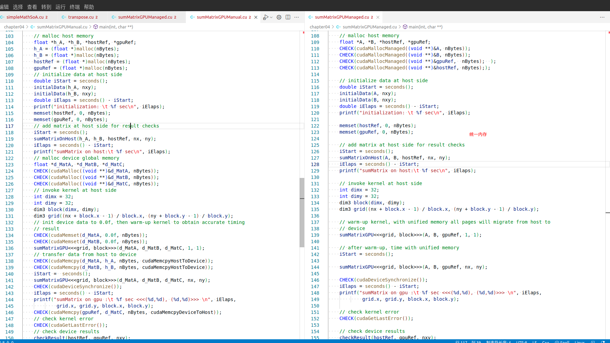

# 4.5 使用统一内存的矩阵加法

为了简化主机和设备内存空间的管理，提高这个CUDA程序的可读性和易维护性，可以使用统一内存。但是**代码简化换来的是性能的降低，性能优先的话还是慎用吧**。

使用cudaMallocManaged 来分配内存，这种内存在表面上看在设备和主机端都能访问，但是内部过程和我们前面手动copy过来copy过去是一样的，也就是memcopy是本质，而这个只是封装了一下。

下图左侧是不使用统一内存的，右侧是使用统一内存的。可以看到使用统一内存节省了很多内存拷贝操作。



两份代码如下：

不使用统一内存：

```C
#include "../common/common.h"
#include <cuda_runtime.h>
#include <stdio.h>

/*
 * This example demonstrates using explicit CUDA memory transfer to implement
 * matrix addition. This code contrasts with sumMatrixGPUManaged.cu, where CUDA
 * managed memory is used to remove all explicit memory transfers and abstract
 * away the concept of physicall separate address spaces.
 */

void initialData(float *ip, const int size)
{
    int i;

    for(i = 0; i < size; i++)
    {
        ip[i] = (float)( rand() & 0xFF ) / 10.0f;
    }

    return;
}

void sumMatrixOnHost(float *A, float *B, float *C, const int nx, const int ny)
{
    float *ia = A;
    float *ib = B;
    float *ic = C;

    for (int iy = 0; iy < ny; iy++)
    {
        for (int ix = 0; ix < nx; ix++)
        {
            ic[ix] = ia[ix] + ib[ix];
        }

        ia += nx;
        ib += nx;
        ic += nx;
    }

    return;
}

void checkResult(float *hostRef, float *gpuRef, const int N)
{
    double epsilon = 1.0E-8;
    bool match = 1;

    for (int i = 0; i < N; i++)
    {
        if (abs(hostRef[i] - gpuRef[i]) > epsilon)
        {
            match = 0;
            printf("host %f gpu %f\n", hostRef[i], gpuRef[i]);
            break;
        }
    }

    if (!match)
    {
        printf("Arrays do not match.\n\n");
    }
}

// grid 2D block 2D
__global__ void sumMatrixGPU(float *MatA, float *MatB, float *MatC, int nx,
                             int ny)
{
    unsigned int ix = threadIdx.x + blockIdx.x * blockDim.x;
    unsigned int iy = threadIdx.y + blockIdx.y * blockDim.y;
    unsigned int idx = iy * nx + ix;

    if (ix < nx && iy < ny)
    {
        MatC[idx] = MatA[idx] + MatB[idx];
    }
}

int main(int argc, char **argv)
{
    printf("%s Starting ", argv[0]);

    // set up device
    int dev = 0;
    cudaDeviceProp deviceProp;
    CHECK(cudaGetDeviceProperties(&deviceProp, dev));
    printf("using Device %d: %s\n", dev, deviceProp.name);
    CHECK(cudaSetDevice(dev));

    // set up data size of matrix
    int nx, ny;
    int ishift = 12;

    if  (argc > 1) ishift = atoi(argv[1]);

    nx = ny = 1 << ishift;

    int nxy = nx * ny;
    int nBytes = nxy * sizeof(float);
    printf("Matrix size: nx %d ny %d\n", nx, ny);

    // malloc host memory
    float *h_A, *h_B, *hostRef, *gpuRef;
    h_A = (float *)malloc(nBytes);
    h_B = (float *)malloc(nBytes);
    hostRef = (float *)malloc(nBytes);
    gpuRef = (float *)malloc(nBytes);
    // initialize data at host side
    double iStart = seconds();
    initialData(h_A, nxy);
    initialData(h_B, nxy);
    double iElaps = seconds() - iStart;
    printf("initialization: \t %f sec\n", iElaps);
    memset(hostRef, 0, nBytes);
    memset(gpuRef, 0, nBytes);
    // add matrix at host side for result checks
    iStart = seconds();
    sumMatrixOnHost(h_A, h_B, hostRef, nx, ny);
    iElaps = seconds() - iStart;
    printf("sumMatrix on host:\t %f sec\n", iElaps);
    // malloc device global memory
    float *d_MatA, *d_MatB, *d_MatC;
    CHECK(cudaMalloc((void **)&d_MatA, nBytes));
    CHECK(cudaMalloc((void **)&d_MatB, nBytes));
    CHECK(cudaMalloc((void **)&d_MatC, nBytes));
    // invoke kernel at host side
    int dimx = 32;
    int dimy = 32;
    dim3 block(dimx, dimy);
    dim3 grid((nx + block.x - 1) / block.x, (ny + block.y - 1) / block.y);
    // init device data to 0.0f, then warm-up kernel to obtain accurate timing
    // result
    CHECK(cudaMemset(d_MatA, 0.0f, nBytes));
    CHECK(cudaMemset(d_MatB, 0.0f, nBytes));
    sumMatrixGPU<<<grid, block>>>(d_MatA, d_MatB, d_MatC, 1, 1);
    // transfer data from host to device
    CHECK(cudaMemcpy(d_MatA, h_A, nBytes, cudaMemcpyHostToDevice));
    CHECK(cudaMemcpy(d_MatB, h_B, nBytes, cudaMemcpyHostToDevice));
    iStart =  seconds();
    sumMatrixGPU<<<grid, block>>>(d_MatA, d_MatB, d_MatC, nx, ny);
    CHECK(cudaDeviceSynchronize());
    iElaps = seconds() - iStart;
    printf("sumMatrix on gpu :\t %f sec <<<(%d,%d), (%d,%d)>>> \n", iElaps,
            grid.x, grid.y, block.x, block.y);
    CHECK(cudaMemcpy(gpuRef, d_MatC, nBytes, cudaMemcpyDeviceToHost));
    // check kernel error
    CHECK(cudaGetLastError());
    // check device results
    checkResult(hostRef, gpuRef, nxy);
    // free device global memory
    CHECK(cudaFree(d_MatA));
    CHECK(cudaFree(d_MatB));
    CHECK(cudaFree(d_MatC));
    // free host memory
    free(h_A);
    free(h_B);
    free(hostRef);
    free(gpuRef);

    // reset device
    CHECK(cudaDeviceReset());

    return (0);
}

```

使用统一内存：

```C
#include "../common/common.h"
#include <cuda_runtime.h>
#include <stdio.h>

/*
 * This example demonstrates the use of CUDA managed memory to implement matrix
 * addition. In this example, arbitrary pointers can be dereferenced on the host
 * and device. CUDA will automatically manage the transfer of data to and from
 * the GPU as needed by the application. There is no need for the programmer to
 * use cudaMemcpy, cudaHostGetDevicePointer, or any other CUDA API involved with
 * explicitly transferring data. In addition, because CUDA managed memory is not
 * forced to reside in a single place it can be transferred to the optimal
 * memory space and not require round-trips over the PCIe bus every time a
 * cross-device reference is performed (as is required with zero copy and UVA).
 */

void initialData(float *ip, const int size)
{
    int i;

    for (i = 0; i < size; i++)
    {
        ip[i] = (float)( rand() & 0xFF ) / 10.0f;
    }

    return;
}

void sumMatrixOnHost(float *A, float *B, float *C, const int nx, const int ny)
{
    float *ia = A;
    float *ib = B;
    float *ic = C;

    for (int iy = 0; iy < ny; iy++)
    {
        for (int ix = 0; ix < nx; ix++)
        {
            ic[ix] = ia[ix] + ib[ix];
        }

        ia += nx;
        ib += nx;
        ic += nx;
    }

    return;
}

void checkResult(float *hostRef, float *gpuRef, const int N)
{
    double epsilon = 1.0E-8;
    bool match = 1;

    for (int i = 0; i < N; i++)
    {
        if (abs(hostRef[i] - gpuRef[i]) > epsilon)
        {
            match = 0;
            printf("host %f gpu %f\n", hostRef[i], gpuRef[i]);
            break;
        }
    }

    if (!match)
    {
        printf("Arrays do not match.\n\n");
    }
}

// grid 2D block 2D
__global__ void sumMatrixGPU(float *MatA, float *MatB, float *MatC, int nx,
                             int ny)
{
    unsigned int ix = threadIdx.x + blockIdx.x * blockDim.x;
    unsigned int iy = threadIdx.y + blockIdx.y * blockDim.y;
    unsigned int idx = iy * nx + ix;

    if (ix < nx && iy < ny)
    {
        MatC[idx] = MatA[idx] + MatB[idx];
    }
}

int main(int argc, char **argv)
{
    printf("%s Starting ", argv[0]);

    // set up device
    int dev = 0;
    cudaDeviceProp deviceProp;
    CHECK(cudaGetDeviceProperties(&deviceProp, dev));
    printf("using Device %d: %s\n", dev, deviceProp.name);
    CHECK(cudaSetDevice(dev));

    // set up data size of matrix
    int nx, ny;
    int ishift = 12;

    if  (argc > 1) ishift = atoi(argv[1]);

    nx = ny = 1 << ishift;

    int nxy = nx * ny;
    int nBytes = nxy * sizeof(float);
    printf("Matrix size: nx %d ny %d\n", nx, ny);

    // malloc host memory
    float *A, *B, *hostRef, *gpuRef;
    CHECK(cudaMallocManaged((void **)&A, nBytes));
    CHECK(cudaMallocManaged((void **)&B, nBytes));
    CHECK(cudaMallocManaged((void **)&gpuRef,  nBytes);  );
    CHECK(cudaMallocManaged((void **)&hostRef, nBytes););

    // initialize data at host side
    double iStart = seconds();
    initialData(A, nxy);
    initialData(B, nxy);
    double iElaps = seconds() - iStart;
    printf("initialization: \t %f sec\n", iElaps);

    memset(hostRef, 0, nBytes);
    memset(gpuRef, 0, nBytes);

    // add matrix at host side for result checks
    iStart = seconds();
    sumMatrixOnHost(A, B, hostRef, nx, ny);
    iElaps = seconds() - iStart;
    printf("sumMatrix on host:\t %f sec\n", iElaps);

    // invoke kernel at host side
    int dimx = 32;
    int dimy = 32;
    dim3 block(dimx, dimy);
    dim3 grid((nx + block.x - 1) / block.x, (ny + block.y - 1) / block.y);

    // warm-up kernel, with unified memory all pages will migrate from host to
    // device
    sumMatrixGPU<<<grid, block>>>(A, B, gpuRef, 1, 1);

    // after warm-up, time with unified memory
    iStart = seconds();

    sumMatrixGPU<<<grid, block>>>(A, B, gpuRef, nx, ny);

    CHECK(cudaDeviceSynchronize());
    iElaps = seconds() - iStart;
    printf("sumMatrix on gpu :\t %f sec <<<(%d,%d), (%d,%d)>>> \n", iElaps,
            grid.x, grid.y, block.x, block.y);

    // check kernel error
    CHECK(cudaGetLastError());

    // check device results
    checkResult(hostRef, gpuRef, nxy);

    // free device global memory
    CHECK(cudaFree(A));
    CHECK(cudaFree(B));
    CHECK(cudaFree(hostRef));
    CHECK(cudaFree(gpuRef));

    // reset device
    CHECK(cudaDeviceReset());

    return (0);
}

```

