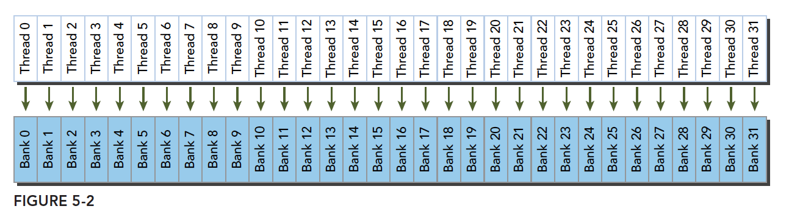
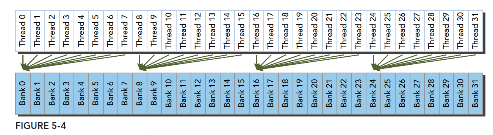

# 5.1 CUDA共享内存概述

废话：

前面有些内容并没有完全理解，尤其是第四章，但是先冲着头皮看下去，最起码有一个印象，后面可以回头再回顾下。

每一章前面都会有一节是章节的内容介绍，但是我很多时候的都没有重视，今天回头看一下这部分内容其实很有必要介绍一下，主要就是本章的内容和为什么会有这一部分的内容，是为了解决什么问题的。

在前面的章节中，已经介绍了几种全局内存的访问模式。通过安排全局内存访问模式（它们是合并的），我们学会了如何实现良好的性能并且避免了浪费事务。未对齐的内存访问是没有问题的，因为现代的GPU硬件都有一级缓存，但在跨全局内存的非合并内存访问，仍然会导致带宽利用率不会达到最佳标准。根据算法性质和相应的访问模式，非合并访问可能是无法避免的。然而，在许多情况下，使用共享内存来提高全局内存合并访问是有可能的。共享内存是许多高性能计算应用程序的关键驱动力。

GPU中有两种类型的内存：

* 板载内存，全局内存就属于板载内存。相对较高的延迟
* 片上内存，共享内存是较小的片上内存，具有相对较低的延迟，关键是可以编程管理。

共享内存通常的用途有：

* 块内线程通信的通道
* 用于全局内存数据的可编程管理的缓存
* 高速暂存存储器，用于转换数据以优化全局内存访问模式

## 5.1.1 共享内存

共享内存（shared memory，SMEM）是GPU的一个关键部件。物理上，每个SM都有一个小的低延迟内存池，这个内存池被当前正在该SM上执行的线程块中的所有线程所共享。共享内存使同一个线程块中的线程能够互相协作，便于重用片上数据，并可以大大降低核函数所需的全局内存带宽。

如图5-1所示，全局内存的所有加载和存储请求都要经过二级缓存，这是SM单元之间数据统一的基本点。注意，相较于二级缓存和全局内存，共享内存和一级缓存在物理上更接近SM。因此，共享内存相较于全局内存而言，延迟要低大约20～30倍，而带宽高其大约10倍。


当每个线程块开始执行时，会分配给它一定数量的共享内存。这个共享内存的地址空间被线程块中所有的线程共享。它的内容和创建时所在的线程块具有相同生命周期。

共享内存被SM中的所有常驻线程块划分，因此，共享内存是限制设备并行性的关键资源。一个核函数使用的共享内存越多，处于并发活跃状态的线程块就越少。

**可编程管理的缓存**

在C语言中，循环转换是一种常用的缓存优化方法。通过重新安排迭代顺序，循环转换可以在循环遍历的过程中提高缓存局部性。在算法层面上，在考虑缓存大小的同时，需要手动调整循环，以实现更好的空间局部性。缓存对程序而言是透明的，编译器可以处理所有的数据移动。我们不能控制缓存的释放。

共享内存是一个可编程管理的缓存。在CUDA中允许手动管理共享内存。

## 5.1.2 共享内存分配

可以静态或动态地分配共享内存变量。CUDA支持一维、二维和三维共享内存数组的声明。

声明共享内存通过关键字：

```C
__shared__
```

**静态分配：**

下面声明一个**静态**二维浮点数共享内存数组，**如果在核函数中进行声明，那么这个变量的作用域就局限在该内核中。如果在文件的任何核函数外进行声明，那么这个变量的作用域对所有核函数来说都是全局的**。

```C
__shared__ float a[size_x][size_y];
```

这里的size_x,size_y和声明c++数组一样，要是一个编译时确定的数字，不能是变量。

**动态分配（只能动态分配一维数组）：**

如果共享内存的大小在编译时是未知的，那么可以用extern关键字声明一个未知大小的数组。例如，下**面的代码段声明了共享内存中一个未知大小的一维整型数组。这个声明可以在某个核函数的内部或所有核函数的外部进行。**

```C
extern __shared__ int tile[];
```

因为这个数组的大小在编译时是未知的，所以在每个核函数被调用时，需要动态分配共享内存，将所需的大小按字节数作为三重括号内的第三个参数

```C
kernel<<<grid,block,isize*sizeof(int)>>>(...)
```

**测试示例**

```c
#include <cuda_runtime.h>
#include <stdio.h>

#define checkRuntime(op)  __check_cuda_runtime((op), #op, __FILE__, __LINE__)

bool __check_cuda_runtime(cudaError_t code, const char* op, const char* file, int line){
    if(code != cudaSuccess){    
        const char* err_name = cudaGetErrorName(code);    
        const char* err_message = cudaGetErrorString(code);  
        printf("runtime error %s:%d  %s failed. \n  code = %s, message = %s\n", file, line, op, err_name, err_message);   
        return false;
    }
    return true;
}


//demo1 //
/* 
demo1 主要为了展示查看静态和动态共享变量的地址
 */
const size_t static_shared_memory_num_element = 6 * 1024; // 6KB
__shared__ char static_shared_memory[static_shared_memory_num_element]; 
__shared__ char static_shared_memory2[2]; 

__global__ void demo1_kernel(){
    extern __shared__ char dynamic_shared_memory[];      // 静态共享变量和动态共享变量在kernel函数内/外定义都行，没有限制
    extern __shared__ char dynamic_shared_memory2[];
    printf("static_shared_memory = %p\n",   static_shared_memory);   // 静态共享变量，定义几个地址随之叠加
    printf("static_shared_memory2 = %p\n",  static_shared_memory2); 
    printf("dynamic_shared_memory = %p\n",  dynamic_shared_memory);  // 动态共享变量，无论定义多少个，地址都一样
    printf("dynamic_shared_memory2 = %p\n", dynamic_shared_memory2); 

    if(blockIdx.x == 0 && threadIdx.x == 0) // 第一个thread
        printf("Run kernel.\n");
}

/demo2//
/* 
demo2 主要是为了演示的是如何给 共享变量进行赋值
 */
// 定义共享变量，但是不能给初始值，必须由线程或者其他方式赋值
__shared__ int shared_value1;

__global__ void demo2_kernel(){
    
    __shared__ int shared_value2;
    if(threadIdx.x == 0){

        // 在线程索引为0的时候，为shared value赋初始值
        if(blockIdx.x == 0){
            shared_value1 = 123;
            shared_value2 = 55;
        }else{
            shared_value1 = 331;
            shared_value2 = 8;
        }
    }

    // 等待block内的所有线程执行到这一步
    __syncthreads();
    
    printf("%d.%d. shared_value1 = %d[%p], shared_value2 = %d[%p]\n", 
        blockIdx.x, threadIdx.x,
        shared_value1, &shared_value1, 
        shared_value2, &shared_value2
    );
}

void launch(){
    
    demo1_kernel<<<1, 1, 12, nullptr>>>();
    demo2_kernel<<<2, 5, 0, nullptr>>>();
}

int main(){

    cudaDeviceProp prop;
    checkRuntime(cudaGetDeviceProperties(&prop, 0));
    printf("prop.sharedMemPerBlock = %.2f KB\n", prop.sharedMemPerBlock / 1024.0f);

    launch();
    checkRuntime(cudaPeekAtLastError());
    checkRuntime(cudaDeviceSynchronize());
    printf("done\n");
    return 0;
}
```

运行结果如下：


在主函数中我们通过调用 cudaGetDeviceProperties 函数获取当前设备的属性，并打印出设备的共享内存的大小，一般为 48KB。

上述示例代码依次展示了使用共享内存 （shared memory）的两个示例：demo1_kernel 和 demo2_kernel

demo1_kernel：

这个示例主要用于展示静态共享变量和动态共享变量的地址。在这个示例中，我们使用了两个静态共享变量和两个动态共享变量，二者在 kernel 函数内外定义都行，没有限制。我们启动的核函数只有一个线程块，每个线程块只有一个线程，因此只有一个线程会执行这个 kernel 函数，并打印对应的共享变量的地址。

通过打印语句，**我们可以看到静态共享变量的地址会依次增加，而动态共享变量的地址始终是一样的。**

第一个 block 对应的共享变量赋值为 123 和 55，第二个 block 对应的共享变量赋值为 331 和 8，**又由于共享内存（shared memory）是在块（block）级别上进行共享的**，因此第一个 block 中所有线程打印的共享变量结果为 123 和 55，第二个 block 中所有线程打印的共享变量结果为 331 和 8，这点可以从运行结果中看到。

* 共享内存是片上内存，更靠近计算单元，因此比 globalMem 速度更快，通常可以充当缓存使用
  * 数据先读入到 sharedMem，做各类计算时，使用 sharedMem 而非 globalMem

* demo_kernel<<<1, 1, 12, nullptr>>>()；其中第三个参数 12，是指定动态共享内存 dynamic_shared_memory 的大小
  * dynamic_shared_memory 变量必须使用`extern __shared__` 开头
  * 并且定义为不确定大小的数组 []
  * 12 的单位是 bytes，也就是可以安全存放 3 个 float
  * 变量放在函数外面和里面是一样的
  * 其指针由 cuda 调度器执行时赋值

* static_shared_memory 作为静态分配的共享内存
  * 不加 extern，以 __shared__ 开头
  * 定义时需要明确数组的大小
  * 静态分配的地址比动态分配的地址低
* 动态共享变量，无论定义多少个，地址都一样
* 静态共享变量，定义几个地址随之叠加
* 如果配置的各类共享内存总和大于 sharedMemPerBlock，则核函数执行错误，Invalid argument
  * 不同类型的静态共享变量定义，其内存划分并不一定是连续的
  * 中间会有内存对齐策略，使得第一个和第二个变量之间可能存在间隙
  * 因此你的变量之间如果存在空隙，可能小于全部大于的共享内存就会报错


## 5.1.3 共享内存存储体和访问模式

优化内存性能时要度量的两个关键属性是：延迟和带宽。第4章解释了由不同的全局内存访问模式引起的延迟和带宽对核函数性能的影响。共享内存可以用来隐藏全局内存延迟和带宽对性能的影响。

### 5.1.3.1 内存存储体

为了获得高内存带宽，共享内存被分为32个同样大小的内存模型，它们被称为存储体，它们可以被同时访问。**有32个存储体是因为一个线程束中有32个线程**。共享内存是一个一维地址空间。

如果通过线程束发布共享内存加载或存储操作，且在每个存储体
上只访问不多于一个的内存地址，那么该操作可由一个内存事务来完成。否则，该操作由多个内存事务来完成，这样就降低了内存带宽的利用率。

### 5.1.3.2 存储体冲突

在共享内存中当多个地址请求落在相同的内存存储体中时，就会发生存储体冲突，这会导致请求被重复执行。

当线程束发出共享内存请求时，有以下3种典型的模式：

* 并行访问：多个地址访问多个存储体
* 串行访问：多个地址访问同一个存储体
* 广播访问：单一地址读取单一存储体

并行访问是最常见的模式，它是被一个线程束访问的多个地址落在多个存储体中。这种模式意味着，如果不是所有的地址，那么至少有一些地址可以在一个单一的内存事务中被服务。最佳情况是，当每个地址都位于一个单独的存储体中时，执行无冲突的共享内存
访问。
串行访问是最坏的模式，当多个地址属于同一个存储体时，必须以串行的方式进行请求。如果线程束中32个线程全都访问同一存储体中不同的内存地址，那么将需要32个内存事务，并且满足这些访问所消耗的时间是单一请求的32倍。
在广播访问的情况下，线程束中所有的线程都读取同一存储体中相同的地址。若一个内存事务被执行，那么被访问的字就会被广播到所有请求的线程中。虽然一个单一的内存事务只需要一个广播访问，但是因为只有一小部分字节被读取，所以带宽利用率很差。

图5-2显示了最优的**并行访问模式**。每个线程访问一个32位字（为什么是32字，下面的访问模式会讲到）。因为每个线程访问不同存储体中的地址，所以没有存储体冲突。



图5-3显示了不规则的随机访问模式。因为每个线程访问不同的存储体，所以也没有存储体冲突。


图5-4显示了另一种不规则的访问模式，在这里几个线程访问同一存储体。对于这样一个请求，会产生两种可能的行为：

* 如果线程访问同一个存储体中相同的地址，广播访问无冲突
* 如果线程访问同一个存储体中不同的地址，会发生存储体冲突



### 5.1.3.3 访问模式

这一章节看的有点晕，参考官网[16.4.3. Shared Memory](https://docs.nvidia.com/cuda/cuda-c-programming-guide/index.html#shared-memory-5-x)的内容进行理解。

内存存储体的宽度随设备计算能力的不同而变化。有两种不同的存储体宽度：

* 计算能力2.x的设备中为4字节（32位）

* 计算能力3.x的设备中为8字节（64位）

官网看到的都是32位的。暂时按照官网的理解吧。

`Shared memory has 32 banks that are organized such that successive  32-bit words map to successive banks. Each bank has a bandwidth of 32  bits per clock cycle.`

翻译过来就是共享存储器具有32个存储体，这些存储体被组织为使得连续的32位字映射到连续的存储体。每个存储体具有每个时钟周期32比特的带宽。简单来数就是共享内存有32个存储体，一个存储体的内存宽度是32bit。结合下面的图再理解一下。


左图：线性寻址，步长为一个32位字（无存储体冲突）。

中间的图：以两个32位字为步长的线性寻址（双向存储体冲突（在一个bank中访问了两个地址，这两个地址不在一个32bit内））。

右侧的图：线性寻址，步长为三个32位字（无存储体冲突）。


左边：通过随机排列实现无冲突访问。

中间：无冲突访问，因为线程3、4、6、7和9访问组5中的同一个字。

右边：无冲突广播访问（线程访问银行内的同一个bank）。

下面是书中的例子（64位宽）

下图显示64位宽的存储体无冲突访问的一种情况，每个bank被划分成了两部分


下图是另一种无冲突方式：


一种冲突方式，两个线程访问同一个bank：


另一种冲突方式，三个线程访问同一个bank


### 5.1.3.4 内存填充

**内存填充是避免存储体冲突的一种方法**。图5-11所示为通过一个简单的例子来说明内存填充。假设只有5个共享内存存储体。如果所有线程访问bank 0的不同地址，那么会发生一个五向的存储体冲突。解决这种存储体冲突的一个方法是在每N个元素之后添加一个字，这里的N是存储体的数量。这就改变了从字到存储体的映射，如图5-11的右侧所示。由于填充，之前所有属于bank 0的字，现在被传播到了不同的存储体中。
填充的内存不能用于数据存储。其唯一的作用是移动数据元素，以便将原来属于同一个存储体中的数据分散到不同存储体中。这样，线程块可用的总的共享内存的数量将减少。填充之后，还需要重新计算数组索引以确保能访问到正确的数据元素。
虽然Fermi和Kepler都有32个存储体，但它们的存储体宽度不同。在这些不同的架构上填充共享内存时，必须要小心。Fermi架构中的某些内存填充模式可能会导致Kepler中的存储体冲突。


### 5.1.3.5 访问模式配置

访问模式查询：可以通过以下语句，查询是4字节还是8字节：

```c
cudaError_t cudaDeviceGetSharedMemConfig(cudaSharedMemConfig * pConfig);
```

返回的pConfig可以是下面的结果：

```c
cudaSharedMemBankSizeFourByte
cudaSharedMemBankSizeEightByte
```

在可以配置的设备上，可以用下面函数来配置新的存储体大小：

```c
cudaError_t cudaDeviceSetShareMemConfig(cudaSharedMemConfig config);
```

其中 config可以是：

```c
cudaSharedMemBankSizeDefault
cudaSharedMemBankSizeFourByte
cudaSharedMemBankSizeEightByte
```

不同的核函数启动之间，更改共享内存的配置，可能需要一个隐式的设备同步点，更改共享内存存储体的大小不会增加共享内存的使用，也不会影响内核函数的占用率，但其对性能可能有重大的影响。大的存储体可能有更高的带宽，但可能导致更多的冲突，要根据具体情况进行分析。

## 5.1.4 配置共享内存量

查看官方文档的表格，共享内存大小根据计算能力不同


可以参考官网关于Turing架构的描述[1.4.3.1. Unified Shared Memory/L1/Texture Cache](https://docs.nvidia.com/cuda/turing-tuning-guide/index.html#unified-shared-memory-l1-texture-cache) The total size of the unified L1 / Shared Memory cache in Turing is 96 KB. 

书中描述每个SM上有64KB的片上内存，共享内存和L1共享这64KB，并且可以配置。CUDA为配置一级缓存和共享内存提供以下两种方法：

1. 按设备进行配置
2. 按核函数进行配置

配置函数：

```c
cudaError_t cudaDeviceSetCacheConfig(cudaFuncCache cacheConfig);
```

其中配置参数如下：

```c
cudaFuncCachePreferNone: no preference(default)
cudaFuncCachePreferShared: prefer 48KB shared memory and 16 KB L1 cache
cudaFuncCachePreferL1: prefer 48KB L1 cache and 16 KB shared memory
cudaFuncCachePreferEqual: prefer 32KB L1 cache and 32 KB shared memory
```

那种更好全看核函数：

1. 共享内存使用较多，那么更多的共享内存更好
2. 更多的寄存器使用，L1更多更好。

另一个函数是通过不同核函数自动配置的。

```c
cudaError_t cudaFuncSetCacheConfig(const void* func,enum cudaFuncCacheca cheConfig);
```

这里的func是核函数指针，当我们调用某个核函数时，次核函数已经配置了对应的L1和共享内存，那么其如果和当前配置不同，则会重新配置，否则直接执行。

## 5.1.5 同步

共享内存可以同时被线程块中的多个线程访问。当不同步的多个线程修改同一个共享内存地址时，将导致线程内的冲突。CUDA提供了几个运行时函数来执行块内同步。同步的两个基本方法如下所示：

* 障碍：所有调用的线程等待其余调用的线程到达障碍点
* 内存栅栏：所有调用的线程必须等到全部内存修改对其余调用线程可见时才能继续执行

### 5.1.5.1 弱排序内存模型

GPU线程在不同内存（如共享内存、全局内存、锁页主机内存或对等设备的内存）中写入数据的顺序，不一定和这些数据在源代码中访问的顺序相同。一个线程的写入顺序对其他线程可见时，它可能和写操作被执行的实际顺序不一致。
如果指令之间是相互独立的，线程从不同内存中读取数据的顺序和读指令在程序中出现的顺序不一定相同。

为了显式地强制程序以一个确切的顺序执行，必须在应用程序代码中插入内存栅栏和障碍。这是保证与其他线程共享资源的核函数行为正确的唯一途径。

### 5.1.5.2 显式障碍

在CUDA中，障碍只能在同一线程块的线程间执行。在核函数中，可以通过调用下面的函数来指定一个障碍点：

```C
void __syncthreads();
```

`__syncthreads`作为一个障碍点来发挥作用，它要求块中的线程必须等待直到所有线程都到达该点。`__syncthreads`还确保在障碍点之前，被这些线程访问的所有全局和共享内存对同一块中的所有线程都可见。
`__syncthreads`用于**协调同一块中线程间的通信**。当块中的某些线程访问共享内存或全局内存中的同一地址时，会有潜在问题（写后读、读后写、写后写），这将导致在那些内存位置产生未定义的应用程序行为和未定义的状态。可以通过利用冲突访问间的同步线程来避免这种情况。
在条件代码中使用`__syncthreads`时，必须要特别小心。如果一个条件能保证对整个线程块进行同等评估，则它是调用`__syncthreads`的唯一有效条件。**否则执行很可能会挂起或产生意想不到的问题**。例如，下面的代码可能会导致块中的线程无限期地等待对方，因为块中的所有线程没有达到相同的障碍点。

```C
if (threadID % 2 == 0) {
    __syncthreads();
} else {
    __syncthreads();
}
```

### 5.1.5.3 内存栅栏

内存栅栏能保证栅栏前的内核内存写操作对栅栏后的其他线程都是可见的，有以下三种栅栏：块，网格，系统。

这一部分不是很理解，后期可以参考官网理解一下[7.5. Memory Fence Functions](https://docs.nvidia.com/cuda/cuda-c-programming-guide/index.html#memory-fence-functions)。大概意思是`__threadfence`一般用于block间有竞争且竞争成功后要用到其它block的前面的全局写的结果的场合而block内还是直接用`__syncthreads`。官方的例子用的是`void __threadfence();`

* 线程块内：

```c
void __threadfence_block();
```

保证同一块中的其他线程对于栅栏前的内存写操作可见

* 网格级内存栅栏

```c
void __threadfence();
```

挂起调用线程，直到全局内存中所有写操作对相同的网格内的所有线程可见

* 系统级栅栏，夸系统，包括主机和设备，

```C
void __threadfence_system();
```

挂起调用线程，以保证该线程对全局内存，锁页主机内存和其他设备内存中的所有写操作对全部设备中的线程和主机线程可见。

### 5.1.5.4 Volatile修饰符

在全局或共享内存中使用volatile修饰符声明一个变量，可以防止编译器优化，编译器优化可能会将数据暂时缓存在寄存器或本地内存中。当使用volatile修饰符时，编译器假定任何其他线程在任何时间都可以更改或使用该变量的值。

# 附录：

官方文档：

* 共享内存介绍[16.4.3. Shared Memory](https://docs.nvidia.com/cuda/cuda-c-programming-guide/index.html#shared-memory-5-x)
* 共享内存大小 [16.2. Features and Technical Specifications](https://docs.nvidia.com/cuda/cuda-c-programming-guide/index.html#features-and-technical-specifications)