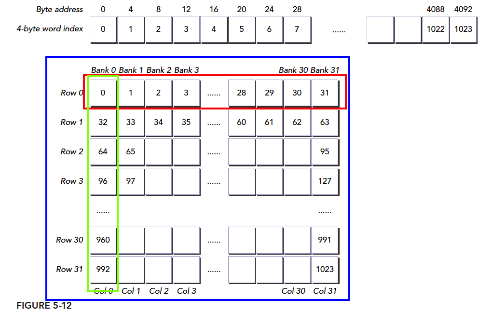

# 5.2 共享内存的数据布局

这一节主要是介绍了共享内存的矩阵数组访问模式，按行和按列访问还有内存的填充，说白了就是如何索引到数据。

* 行主序与列主序访问
* 静态与动态共享内存的声明
* 文件范围与内核范围的共享内存
* 内存填充与无内存填充

当使用共享内存设计核函数时，重点应放在以下两个概念上：

* 跨内存存储体映射数据元素
* 从线程索引到共享内存偏移的映射

**目的是**当这些概念了然于心时，就可以设计一个高效的核函数了，它可以避免存储体冲突，**并充分利用共享内存的优势**。

## 5.2.1方形共享内存

图5-12显示了一个共享内存块，它在每个维度有32个元素，且按行主序进行存储。上部的图显示了一维数据布局的实际排列，下部的图显示了带有4字节数据元素和存储体映射的二维共享内存逻辑视图。使用下面的语句静态声明一个二维共享内存变量：

```C
#define N 32
...
__shared__ int tile[N][N];
...
```


如果访问上面申请的`tile`共享内存，可以有两种方式索引

```C
tile[threadIdx.y][threadIdx.x];
tile[threadIdx.x][threadIdx.y];
```



上一节提到在同一个线程束中若有访问独立存储体的线程，则它是最优的

我们的共享内存变量类型是int(4字节)。一个元素占一个block的宽度。因此使用

```C
tile[threadIdx.y][threadIdx.x];
```

上面的索引方式就可以取出共享内存中的行（例如第一行就是红色框部分），无冲突，一个事务完成。

使用

```C
tile[threadIdx.x][threadIdx.y];
```

就可以索引到列。上图的绿色部分，冲突达到了最大，效率最低。

### 5.2.1.1 行主序访问和列主序访问

考虑一个核函数有两个简单操作：

* 将全局线程索引按行主序写入到一个二维共享内存数组中
* 从共享内存中按行主序读取这些值并将它们存储到全局内存中

核函数如下

```C
#define BDIMX 32
#define BDIMY 32

dim3 block (BDIMX, BDIMY);
dim3 grid  (1, 1);

__global__ void setRowReadRow (int *out)
{
    // static shared memory
    __shared__ int tile[BDIMY][BDIMX];

    // mapping from thread index to global memory index
    unsigned int idx = threadIdx.y * blockDim.x + threadIdx.x;

    // shared memory store operation
    tile[threadIdx.y][threadIdx.x] = idx;

    // wait for all threads to complete
    __syncthreads();

    // shared memory load operation
    out[idx] = tile[threadIdx.y][threadIdx.x] ;
}
```

* 其中`tile[threadIdx.y][threadIdx.x] = idx;`将索引按照行主序顺序**写入共享内存块**。**共享内存的存储操作**
* `__syncthreads();`
* 同步点（使用syncthreads函数），所有线程必须将存储的数据送到共享内存块中，才进行下一步的操作
* `out[idx] = tile[threadIdx.y][threadIdx.x]` 按行主序从共享内存给全局内存赋值。包含两个内存操作：**共享内存的加载操作**和**全局内存的存储操作**
* 因为相同线程束中的线程有连续的threadIdx.x值，用threadIdx.x索引共享内存数组tile的最内层维度，所以核函数无存储体冲突。

修改上面的核函数，交换两个`[threadIdx.y][threadIdx.x] `为`[threadIdx.x][threadIdx.y] `。那么线程束就会按照列主序访问。修改如下

```C
__global__ void setColReadCol (int *out)
{
    // static shared memory
    __shared__ int tile[BDIMX][BDIMY];

    // mapping from thread index to global memory index
    unsigned int idx = threadIdx.y * blockDim.x + threadIdx.x;

    // shared memory store operation
    tile[threadIdx.x][threadIdx.y] = idx;

    // wait for all threads to complete
    __syncthreads();

    // shared memory load operation
    out[idx] = tile[threadIdx.x][threadIdx.y];
}
```

* 共享内存的**写入**和**读取**都是按列主序。

两个核函数的运行测试如下

```bash
huolin@huolin:~/$ sudo nvprof ./checkSmemSquare
[sudo] password for huolin: 
==833540== NVPROF is profiling process 833540, command: ./checkSmemSquare
./checkSmemSquare at device 0: Quadro P2000 with Bank Mode:4-Byte <<< grid (1,1) block (32,32)>>>
==833540== Profiling application: ./checkSmemSquare
==833540== Profiling result:
            Type  Time(%)      Time     Calls       Avg       Min       Max  Name
 GPU activities:   21.29%  6.7840us         6  1.1300us  1.0560us  1.3760us  [CUDA memcpy DtoH]
                   20.18%  6.4320us         6  1.0720us     896ns  1.6000us  [CUDA memset]
                   13.35%  4.2560us         1  4.2560us  4.2560us  4.2560us  setColReadCol(int*)
                   10.44%  3.3280us         1  3.3280us  3.3280us  3.3280us  setRowReadCol(int*)
                   10.44%  3.3280us         1  3.3280us  3.3280us  3.3280us  setRowReadColDyn(int*)
                    8.53%  2.7200us         1  2.7200us  2.7200us  2.7200us  setRowReadRow(int*)
                    7.93%  2.5280us         1  2.5280us  2.5280us  2.5280us  setRowReadColDynPad(int*)
                    7.83%  2.4960us         1  2.4960us  2.4960us  2.4960us  setRowReadColPad(int*)
      API calls:   76.36%  151.61ms         1  151.61ms  151.61ms  151.61ms  cudaDeviceGetSharedMemConfig
                   23.29%  46.244ms         1  46.244ms  46.244ms  46.244ms  cudaDeviceReset
                    0.08%  154.15us       101  1.5260us     199ns  62.424us  cuDeviceGetAttribute
                    0.06%  120.52us         1  120.52us  120.52us  120.52us  cudaMalloc
                    0.05%  98.353us         1  98.353us  98.353us  98.353us  cudaGetDeviceProperties
                    0.05%  91.983us         6  15.330us  9.8310us  20.245us  cudaMemcpy
                    0.04%  84.535us         1  84.535us  84.535us  84.535us  cudaFree
                    0.02%  47.694us         6  7.9490us  3.8720us  25.076us  cudaLaunchKernel
                    0.02%  37.719us         1  37.719us  37.719us  37.719us  cuDeviceGetName
                    0.02%  35.586us         6  5.9310us  1.7680us  25.167us  cudaMemset
                    0.01%  11.296us         1  11.296us  11.296us  11.296us  cuDeviceGetPCIBusId
                    0.00%  3.8450us         1  3.8450us  3.8450us  3.8450us  cudaSetDevice
                    0.00%  2.5660us         3     855ns     342ns  1.7900us  cuDeviceGetCount
                    0.00%  1.0080us         2     504ns     255ns     753ns  cuDeviceGet
                    0.00%     709ns         1     709ns     709ns     709ns  cuDeviceTotalMem
                    0.00%     483ns         1     483ns     483ns     483ns  cuDeviceGetUuid
                    0.00%     374ns         1     374ns     374ns     374ns     �

```

我们上面两个典型的例子结果如下

```bash
                   13.35%  4.2560us         1  4.2560us  4.2560us  4.2560us  setColReadCol(int*)
                    8.53%  2.7200us         1  2.7200us  2.7200us  2.7200us  setRowReadRow(int*)
```

使用下面的命令查看存储体的加载和存储冲突

* `shared_load_transactions_per_request`
* `shared_store_transactions_per_request`

```bash
sudo nvprof  --metrics shared_load_transactions_per_request,shared_store_transactions_per_request ./checkSmemSquare
```

结果如下：


行主序`setRowReadRow`的加载和存储事务都是1，而列主序`setColReadCol`的加载和存储事务都是32。注意，我们这个设备是4-byte宽的，上图中`Quadro P2000 with Bank Mode:4-Byte`显示的有。

完整的程序如下：

```C
#include "../common/common.h"
#include <cuda_runtime.h>
#include <stdio.h>

/*
 * An example of using shared memory to transpose square thread coordinates
 * of a CUDA grid into a global memory array. Different kernels below
 * demonstrate performing reads and writes with different ordering, as well as
 * optimizing using memory padding.
 */

#define BDIMX 32
#define BDIMY 32
#define IPAD  1

void printData(char *msg, int *in,  const int size)
{
    printf("%s: ", msg);

    for (int i = 0; i < size; i++)
    {
        printf("%5d", in[i]);
        fflush(stdout);
    }

    printf("\n");
    return;
}

__global__ void setRowReadRow (int *out)
{
    // static shared memory
    __shared__ int tile[BDIMY][BDIMX];

    // mapping from thread index to global memory index
    unsigned int idx = threadIdx.y * blockDim.x + threadIdx.x;

    // shared memory store operation
    tile[threadIdx.y][threadIdx.x] = idx;

    // wait for all threads to complete
    __syncthreads();

    // shared memory load operation
    out[idx] = tile[threadIdx.y][threadIdx.x] ;
}

__global__ void setColReadCol (int *out)
{
    // static shared memory
    __shared__ int tile[BDIMX][BDIMY];

    // mapping from thread index to global memory index
    unsigned int idx = threadIdx.y * blockDim.x + threadIdx.x;

    // shared memory store operation
    tile[threadIdx.x][threadIdx.y] = idx;

    // wait for all threads to complete
    __syncthreads();

    // shared memory load operation
    out[idx] = tile[threadIdx.x][threadIdx.y];
}

__global__ void setRowReadCol(int *out)
{
    // static shared memory
    __shared__ int tile[BDIMY][BDIMX];

    // mapping from thread index to global memory index
    unsigned int idx = threadIdx.y * blockDim.x + threadIdx.x;

    // shared memory store operation
    tile[threadIdx.y][threadIdx.x] = idx;

    // wait for all threads to complete
    __syncthreads();

    // shared memory load operation
    out[idx] = tile[threadIdx.x][threadIdx.y];
}


__global__ void setRowReadColDyn(int *out)
{
    // dynamic shared memory
    extern  __shared__ int tile[];

    // mapping from thread index to global memory index
    unsigned int row_idx = threadIdx.y * blockDim.x + threadIdx.x;
    unsigned int col_idx = threadIdx.x * blockDim.y + threadIdx.y;

    // shared memory store operation
    tile[row_idx] = row_idx;

    // wait for all threads to complete
    __syncthreads();

    // shared memory load operation
    out[row_idx] = tile[col_idx];
}

__global__ void setRowReadColPad(int *out)
{
    // static shared memory
    __shared__ int tile[BDIMY][BDIMX + IPAD];

    // mapping from thread index to global memory offset
    unsigned int idx = threadIdx.y * blockDim.x + threadIdx.x;

    // shared memory store operation
    tile[threadIdx.y][threadIdx.x] = idx;

    // wait for all threads to complete
    __syncthreads();

    // shared memory load operation
    out[idx] = tile[threadIdx.x][threadIdx.y];
}

__global__ void setRowReadColDynPad(int *out)
{
    // dynamic shared memory
    extern  __shared__ int tile[];

    // mapping from thread index to global memory index
    unsigned int row_idx = threadIdx.y * (blockDim.x + IPAD) + threadIdx.x;
    unsigned int col_idx = threadIdx.x * (blockDim.x + IPAD) + threadIdx.y;

    unsigned int g_idx = threadIdx.y * blockDim.x + threadIdx.x;

    // shared memory store operation
    tile[row_idx] = g_idx;

    // wait for all threads to complete
    __syncthreads();

    // shared memory load operation
    out[g_idx] = tile[col_idx];
}

int main(int argc, char **argv)
{
    // set up device
    int dev = 0;
    cudaDeviceProp deviceProp;
    CHECK(cudaGetDeviceProperties(&deviceProp, dev));
    printf("%s at ", argv[0]);
    printf("device %d: %s ", dev, deviceProp.name);
    CHECK(cudaSetDevice(dev));

    cudaSharedMemConfig pConfig;
    CHECK(cudaDeviceGetSharedMemConfig ( &pConfig ));
    printf("with Bank Mode:%s ", pConfig == 1 ? "4-Byte" : "8-Byte");

    // set up array size 2048
    int nx = BDIMX;
    int ny = BDIMY;

    bool iprintf = 0;

    if (argc > 1) iprintf = atoi(argv[1]);

    size_t nBytes = nx * ny * sizeof(int);

    // execution configuration
    dim3 block (BDIMX, BDIMY);
    dim3 grid  (1, 1);
    printf("<<< grid (%d,%d) block (%d,%d)>>>\n", grid.x, grid.y, block.x,
           block.y);

    // allocate device memory
    int *d_C;
    CHECK(cudaMalloc((int**)&d_C, nBytes));
    int *gpuRef  = (int *)malloc(nBytes);

    CHECK(cudaMemset(d_C, 0, nBytes));
    setColReadCol<<<grid, block>>>(d_C);
    CHECK(cudaMemcpy(gpuRef, d_C, nBytes, cudaMemcpyDeviceToHost));

    if(iprintf)  printData("set col read col   ", gpuRef, nx * ny);

    CHECK(cudaMemset(d_C, 0, nBytes));
    setRowReadRow<<<grid, block>>>(d_C);
    CHECK(cudaMemcpy(gpuRef, d_C, nBytes, cudaMemcpyDeviceToHost));

    if(iprintf)  printData("set row read row   ", gpuRef, nx * ny);

    CHECK(cudaMemset(d_C, 0, nBytes));
    setRowReadCol<<<grid, block>>>(d_C);
    CHECK(cudaMemcpy(gpuRef, d_C, nBytes, cudaMemcpyDeviceToHost));

    if(iprintf)  printData("set row read col   ", gpuRef, nx * ny);

    CHECK(cudaMemset(d_C, 0, nBytes));
    setRowReadColDyn<<<grid, block, BDIMX*BDIMY*sizeof(int)>>>(d_C);
    CHECK(cudaMemcpy(gpuRef, d_C, nBytes, cudaMemcpyDeviceToHost));

    if(iprintf)  printData("set row read col dyn", gpuRef, nx * ny);

    CHECK(cudaMemset(d_C, 0, nBytes));
    setRowReadColPad<<<grid, block>>>(d_C);
    CHECK(cudaMemcpy(gpuRef, d_C, nBytes, cudaMemcpyDeviceToHost));

    if(iprintf)  printData("set row read col pad", gpuRef, nx * ny);

    CHECK(cudaMemset(d_C, 0, nBytes));
    setRowReadColDynPad<<<grid, block, (BDIMX + IPAD)*BDIMY*sizeof(int)>>>(d_C);
    CHECK(cudaMemcpy(gpuRef, d_C, nBytes, cudaMemcpyDeviceToHost));

    if(iprintf)  printData("set row read col DP ", gpuRef, nx * ny);

    // free host and device memory
    CHECK(cudaFree(d_C));
    free(gpuRef);

    // reset device
    CHECK(cudaDeviceReset());
    return EXIT_SUCCESS;
}

```

### 5.2.1.2 按行主序写和按列主序读

上一节的两个例子

* `setRowReadRow`对共享内存的操作是按**行写，行读**，如下

```C
    // shared memory store operation
    tile[threadIdx.y][threadIdx.x] = idx;
    // wait for all threads to complete
    __syncthreads();
    // shared memory load operation
    out[idx] = tile[threadIdx.y][threadIdx.x] ;
```

* `setColReadCol`对共享内存的操作是按**列写，列读**，如下

```C
    // shared memory store operation
    tile[threadIdx.x][threadIdx.y] = idx;
    // wait for all threads to complete
    __syncthreads();
    // shared memory load operation
    out[idx] = tile[threadIdx.x][threadIdx.y];
```

那么还有情况就是**行写，列读**，`setRowReadCol`函数如下：

```C
__global__ void setRowReadCol(int *out)
{
    // static shared memory
    __shared__ int tile[BDIMY][BDIMX];
    // mapping from thread index to global memory index
    unsigned int idx = threadIdx.y * blockDim.x + threadIdx.x;
    // shared memory store operation
    tile[threadIdx.y][threadIdx.x] = idx;
    // wait for all threads to complete
    __syncthreads();
    // shared memory load operation
    out[idx] = tile[threadIdx.x][threadIdx.y];
}
```

测试结果再上面小节已经有了。容易分析出 共享内存 的存储事务是1，加载事务是32


### 5.2.1.3 动态共享内存

也可使用动态声明共享内存，从而实现相同的核函数。可以在核函数外声明动态共享内存，使它的作用域为整个文件，也可以在核函数内声明动态共享内存，将其作用域限制在该内核之中。动态共享内存必须被声明为一个未定大小的一维数组。

如上一节描述

在某个核函数的内部或所有核函数的外部进行

```C
extern __shared__ int tile[];
```

因为这个数组的大小在编译时是未知的，所以在每个核函数被调用时，需要动态分配共享内存，将所需的大小按字节数作为三重括号内的第三个参数

```C
kernel<<<grid,block,isize*sizeof(int)>>>(...)
```

修改一下内存的索引就可以得到上面相同`setRowReadCol`功能相同的函数

```C
__global__ void setRowReadColDyn(int *out)
{
    // dynamic shared memory
    extern  __shared__ int tile[];

    // mapping from thread index to global memory index
    unsigned int row_idx = threadIdx.y * blockDim.x + threadIdx.x;
    unsigned int col_idx = threadIdx.x * blockDim.y + threadIdx.y;
    // shared memory store operation
    tile[row_idx] = row_idx;
    // wait for all threads to complete
    __syncthreads();
    // shared memory load operation
    out[row_idx] = tile[col_idx];
}
```

测试结果和上一节一致


### 5.2.1.4 填充静态声明的共享内存

这一节使用填充的方法来避免存储体冲突。

填充静态声明的共享内存很简单。只需简单地将一列添加到二维共享内存分配中，代码如下所示：**其他都不变**

```C
 __shared__ int tile[BDIMY][BDIMX + IPAD];
```

核函数如下：

```C
__global__ void setRowReadColPad(int *out)
{
    // static shared memory
    __shared__ int tile[BDIMY][BDIMX + IPAD];
    // mapping from thread index to global memory offset
    unsigned int idx = threadIdx.y * blockDim.x + threadIdx.x;
    // shared memory store operation
    tile[threadIdx.y][threadIdx.x] = idx;
    // wait for all threads to complete
    __syncthreads();
    // shared memory load operation
    out[idx] = tile[threadIdx.x][threadIdx.y];
}
```

测试结果如下：没有冲突了。


分析：上一节提到，增加一列共享内存就可以做到填充，但是增加的一列不存储任何数据。就上上面我们申请的共享内存是`tile[32][33];`但是block的数量依然是32。将二维的内存转换为一维的线性内存地址空间更加好理解。因为block的数量还是32（我们的tile数据类型是4字节的int，一个元素占一个block），因此除了第一行，剩下的行元素的索引位置会有1的偏移量。

如下图所示，假如block是10，我们的共享内存是10 * 10大小。block内存储的就是编号数据。

左侧：没有填充 共享内存大小10 * 10。

右侧：扩展一列共享内存大小10 * 11 。数据在block内的存储情况。一定要注意block依然是10 。黑色的块是扩展的，不存储数据，只是为了改变在block内的索引。按一维展开后更好理解。


### 5.2.1.5 填充动态声明的共享内存

动态的填充就是考虑计算索引麻烦点，如下：

```C
__global__ void setRowReadColDynPad(int *out)
{
    // dynamic shared memory
    extern  __shared__ int tile[];
    // mapping from thread index to global memory index
    unsigned int row_idx = threadIdx.y * (blockDim.x + IPAD) + threadIdx.x;
    unsigned int col_idx = threadIdx.x * (blockDim.x + IPAD) + threadIdx.y;
    unsigned int g_idx = threadIdx.y * blockDim.x + threadIdx.x;
    // shared memory store operation
    tile[row_idx] = g_idx;

    // wait for all threads to complete
    __syncthreads();
    // shared memory load operation
    out[g_idx] = tile[col_idx];
}
```


### 5.2.1.6 方形共享内存内核性能的比较

到目前为止，从所有执行过的内核运行时间可以看出：

* 使用填充的内核可提高性能，因为它减少了存储体冲突
* 带有动态声明共享内存的内核增加了少量的消耗

如果读和写操作使用不同的顺序（例如，读操作使用行主序，而写操作使用列主序），那么核函数会产生转置矩阵。这些简单的核函数为更复杂的转置算法奠定了基础。

## 5.2.2 矩形共享内存

如果申请的共享内存不是正方形的，需要计算一下索引。

```C
#define BDIMX 32
#define BDIMY 16
#define IPAD  2

	// set up array size
    int nx = BDIMX;
    int ny = BDIMY;
    // execution configuration
    dim3 block (BDIMX, BDIMY);
    dim3 grid  (1, 1);
```

### 5.2.2.1 行主序访问与列主序访问

注意下面两个函数申请共享内存的维度不同

`tile[threadIdx.y][threadIdx.x]`外层的维度是`threadIdx.x`也就是按行

`tile[threadIdx.x][threadIdx.y]`外层的维度是`threadIdx.y`也就是按列

```C
__global__ void setRowReadRow(int *out)
{
    // static shared memory
    __shared__ int tile[BDIMY][BDIMX];
    // mapping from thread index to global memory index
    unsigned int idx = threadIdx.y * blockDim.x + threadIdx.x;
    // shared memory store operation
    tile[threadIdx.y][threadIdx.x] = idx;
    // wait for all threads to complete
    __syncthreads();
    // shared memory load operation
    out[idx] = tile[threadIdx.y][threadIdx.x] ;
}

__global__ void setColReadCol(int *out)
{
    // static shared memory
    __shared__ int tile[BDIMX][BDIMY];
    // mapping from thread index to global memory index
    unsigned int idx = threadIdx.y * blockDim.x + threadIdx.x;
    // shared memory store operation
    tile[threadIdx.x][threadIdx.y] = idx;
    // wait for all threads to complete
    __syncthreads();
    // shared memory load operation
    out[idx] = tile[threadIdx.x][threadIdx.y];
}
```

### 5.2.2.2 行主序写操作和列主序读操作

为了实现矩形矩阵的转置，可以列读行写，如下

同样的如果是`setColReadCol`函数如下

```C
__global__ void setRowReadCol(int *out)
{
    // static shared memory
    __shared__ int tile[BDIMY][BDIMX];
    // mapping from 2D thread index to linear memory
    unsigned int idx = threadIdx.y * blockDim.x + threadIdx.x;
    // convert idx to transposed coordinate (row, col)
    unsigned int irow = idx / blockDim.y;
    unsigned int icol = idx % blockDim.y;
    // shared memory store operation
    tile[threadIdx.y][threadIdx.x] = idx;
    // wait for all threads to complete
    __syncthreads();
    // shared memory load operation
    out[idx] = tile[icol][irow];
}
```

* 需要转置，因此申请的共享内存为`tile[BDIMY][BDIMX]`
* `unsigned int idx = threadIdx.y * blockDim.x + threadIdx.x;`将当前线程的二维线程索
  引转换为一维全局线程ID
* `irow = idx / blockDim.y`和`icol = idx % blockDim.y`计算出行和列的索引
* `tile[threadIdx.y][threadIdx.x] = idx`共享内存按行存储（行写）。因为外层维度是`threadIdx.x`。写操作期间没有存储体冲突。
* `out[idx] = tile[icol][irow]`共享内存按列读取，因为`icol`是按照`threadIdx.x`线性变化的。读操作有存储体冲突16

结果如下


### 5.2.2.3 动态声明的共享内存

上面的例子使用动态共享内存代码如下

```C
CHECK(cudaMemset(d_C, 0, nBytes));
setRowReadColDyn<<<grid, block, BDIMX*BDIMY*sizeof(int)>>>(d_C);
CHECK(cudaMemcpy(gpuRef, d_C, nBytes, cudaMemcpyDeviceToHost));

__global__ void setRowReadColDyn(int *out)
{
    // dynamic shared memory
    extern  __shared__ int tile[];
    // mapping from thread index to global memory index
    unsigned int idx = threadIdx.y * blockDim.x + threadIdx.x;
    // convert idx to transposed (row, col)
    unsigned int irow = idx / blockDim.y;
    unsigned int icol = idx % blockDim.y;
    // convert back to smem idx to access the transposed element
    unsigned int col_idx = icol * blockDim.x + irow;
    // shared memory store operation
    tile[idx] = idx;
    // wait for all threads to complete
    __syncthreads();
    // shared memory load operation
    out[idx] = tile[col_idx];
}
```

结果和静态的没有区别


### 5.2.2.4 填充静态声明的共享内存

和方形共享内存操作一致，下面使用填充来减少存储体冲突

```C
__global__ void setRowReadColPad(int *out)
{
    // static shared memory
    __shared__ int tile[BDIMY][BDIMX + IPAD];
    // mapping from 2D thread index to linear memory
    unsigned int idx = threadIdx.y * blockDim.x + threadIdx.x;
    // convert idx to transposed (row, col)
    unsigned int irow = idx / blockDim.y;
    unsigned int icol = idx % blockDim.y;
    // shared memory store operation
    tile[threadIdx.y][threadIdx.x] = idx;
    // wait for all threads to complete
    __syncthreads();
    // shared memory load operation
    out[idx] = tile[icol][irow] ;
}

```

当`IPAD=2`时结果为


当`IPAD=1`时结果为


所以具体的`IPAD`需要根据自己的核函数block大小调整。

### 5.2.2.5 填充动态声明的共享内存

下面是动态的共享内存填充实现，需要注意的就是索引了。

```C
__global__ void setRowReadColDynPad(int *out)
{
    // dynamic shared memory
    extern  __shared__ int tile[];
    // mapping from thread index to global memory index
    unsigned int g_idx = threadIdx.y * blockDim.x + threadIdx.x;
    // convert idx to transposed (row, col)
    unsigned int irow = g_idx / blockDim.y;
    unsigned int icol = g_idx % blockDim.y;
    unsigned int row_idx = threadIdx.y * (blockDim.x + IPAD) + threadIdx.x;
    // convert back to smem idx to access the transposed element
    unsigned int col_idx = icol * (blockDim.x + IPAD) + irow;
    // shared memory store operation
    tile[row_idx] = g_idx;
    // wait for all threads to complete
    __syncthreads();
    // shared memory load operation
    out[g_idx] = tile[col_idx];
}
```

当`IPAD=2`时结果为


当`IPAD=1`时结果为


所以具体的`IPAD`需要根据自己的核函数block大小调整。

### 5.2.2.6 矩形共享内存内核性能的比较

整体的对比如下


源码如下：

```C
#include "../common/common.h"
#include <cuda_runtime.h>
#include <stdio.h>

/*
 * An example of using shared memory to transpose rectangular thread coordinates
 * of a CUDA grid into a global memory array. Different kernels below
 * demonstrate performing reads and writes with different ordering, as well as
 * optimizing using memory padding.
 */

#define BDIMX 32
#define BDIMY 16
#define IPAD  2

void printData(char *msg, int *in,  const int size)
{
    printf("%s: ", msg);

    for (int i = 0; i < size; i++)
    {
        printf("%4d", in[i]);
        fflush(stdout);
    }

    printf("\n\n");
}

__global__ void setRowReadRow(int *out)
{
    // static shared memory
    __shared__ int tile[BDIMY][BDIMX];

    // mapping from thread index to global memory index
    unsigned int idx = threadIdx.y * blockDim.x + threadIdx.x;

    // shared memory store operation
    tile[threadIdx.y][threadIdx.x] = idx;

    // wait for all threads to complete
    __syncthreads();

    // shared memory load operation
    out[idx] = tile[threadIdx.y][threadIdx.x] ;
}
__global__ void setRowReadRow2(int *out)
{
    // static shared memory
    __shared__ int tile[BDIMY][BDIMX];

    // mapping from 2D thread index to linear memory
    unsigned int idx = threadIdx.y * blockDim.x + threadIdx.x;

    // convert idx to transposed coordinate (row, col)
    unsigned int irow = idx / blockDim.x;
    unsigned int icol = idx % blockDim.x;
	// printf("idx=%d  irow=%d icol=%d \n",idx,irow,icol);

    // shared memory store operation
    tile[irow][icol] = idx;

    // wait for all threads to complete
    __syncthreads();

    // shared memory load operation
    out[idx] = tile[irow][icol] ;
}

__global__ void setColReadCol(int *out)
{
    // static shared memory
    __shared__ int tile[BDIMX][BDIMY];

    // mapping from thread index to global memory index
    unsigned int idx = threadIdx.y * blockDim.x + threadIdx.x;

    // shared memory store operation
    tile[threadIdx.x][threadIdx.y] = idx;

    // wait for all threads to complete
    __syncthreads();

    // shared memory load operation
    out[idx] = tile[threadIdx.x][threadIdx.y];
}

__global__ void setColReadCol2(int *out)
{
    // static shared memory
    __shared__ int tile[BDIMY][BDIMX];

    // mapping from 2D thread index to linear memory
    unsigned int idx = threadIdx.y * blockDim.x + threadIdx.x;

    // convert idx to transposed coordinate (row, col)
    unsigned int irow = idx / blockDim.y;
    unsigned int icol = idx % blockDim.y;

    // shared memory store operation
    tile[icol][irow] = idx;

    // wait for all threads to complete
    __syncthreads();

    // shared memory load operation
    out[idx] = tile[icol][irow] ;
}

__global__ void setRowReadCol(int *out)
{
    // static shared memory
    __shared__ int tile[BDIMY][BDIMX];

    // mapping from 2D thread index to linear memory
    unsigned int idx = threadIdx.y * blockDim.x + threadIdx.x;

    // convert idx to transposed coordinate (row, col)
    unsigned int irow = idx / blockDim.y;
    unsigned int icol = idx % blockDim.y;

    // shared memory store operation
    tile[threadIdx.y][threadIdx.x] = idx;

    // wait for all threads to complete
    __syncthreads();

    // shared memory load operation
    out[idx] = tile[icol][irow];
}

__global__ void setRowReadColPad(int *out)
{
    // static shared memory
    __shared__ int tile[BDIMY][BDIMX + IPAD];

    // mapping from 2D thread index to linear memory
    unsigned int idx = threadIdx.y * blockDim.x + threadIdx.x;

    // convert idx to transposed (row, col)
    unsigned int irow = idx / blockDim.y;
    unsigned int icol = idx % blockDim.y;

    // shared memory store operation
    tile[threadIdx.y][threadIdx.x] = idx;

    // wait for all threads to complete
    __syncthreads();

    // shared memory load operation
    out[idx] = tile[icol][irow] ;
}

__global__ void setRowReadColDyn(int *out)
{
    // dynamic shared memory
    extern  __shared__ int tile[];

    // mapping from thread index to global memory index
    unsigned int idx = threadIdx.y * blockDim.x + threadIdx.x;

    // convert idx to transposed (row, col)
    unsigned int irow = idx / blockDim.y;
    unsigned int icol = idx % blockDim.y;

    // convert back to smem idx to access the transposed element
    unsigned int col_idx = icol * blockDim.x + irow;

    // shared memory store operation
    tile[idx] = idx;

    // wait for all threads to complete
    __syncthreads();

    // shared memory load operation
    out[idx] = tile[col_idx];
}

__global__ void setRowReadColDynPad(int *out)
{
    // dynamic shared memory
    extern  __shared__ int tile[];

    // mapping from thread index to global memory index
    unsigned int g_idx = threadIdx.y * blockDim.x + threadIdx.x;

    // convert idx to transposed (row, col)
    unsigned int irow = g_idx / blockDim.y;
    unsigned int icol = g_idx % blockDim.y;

    unsigned int row_idx = threadIdx.y * (blockDim.x + IPAD) + threadIdx.x;

    // convert back to smem idx to access the transposed element
    unsigned int col_idx = icol * (blockDim.x + IPAD) + irow;

    // shared memory store operation
    tile[row_idx] = g_idx;

    // wait for all threads to complete
    __syncthreads();

    // shared memory load operation
    out[g_idx] = tile[col_idx];
}

int main(int argc, char **argv)
{
    // set up device
    int dev = 0;
    cudaDeviceProp deviceProp;
    CHECK(cudaGetDeviceProperties(&deviceProp, dev));
    printf("%s at ", argv[0]);
    printf("device %d: %s ", dev, deviceProp.name);
    CHECK(cudaSetDevice(dev));

    cudaSharedMemConfig pConfig;
    CHECK(cudaDeviceGetSharedMemConfig ( &pConfig ));
    printf("with Bank Mode:%s ", pConfig == 1 ? "4-Byte" : "8-Byte");

    // set up array size
    int nx = BDIMX;
    int ny = BDIMY;

    bool iprintf = 0;

    if (argc > 1) iprintf = atoi(argv[1]);

    size_t nBytes = nx * ny * sizeof(int);

    // execution configuration
    dim3 block (BDIMX, BDIMY);
    dim3 grid  (1, 1);
    printf("<<< grid (%d,%d) block (%d,%d)>>>\n", grid.x, grid.y, block.x,
            block.y);

    // allocate device memory
    int *d_C;
    CHECK(cudaMalloc((int**)&d_C, nBytes));
    int *gpuRef  = (int *)malloc(nBytes);

    CHECK(cudaMemset(d_C, 0, nBytes));
    setRowReadRow<<<grid, block>>>(d_C);
    CHECK(cudaMemcpy(gpuRef, d_C, nBytes, cudaMemcpyDeviceToHost));

    if(iprintf)  printData("setRowReadRow       ", gpuRef, nx * ny);

	CHECK(cudaMemset(d_C, 0, nBytes));
    setRowReadRow2<<<grid, block>>>(d_C);
    CHECK(cudaMemcpy(gpuRef, d_C, nBytes, cudaMemcpyDeviceToHost));

    if(iprintf)  printData("setRowReadRow       ", gpuRef, nx * ny);

    CHECK(cudaMemset(d_C, 0, nBytes));
    setColReadCol<<<grid, block>>>(d_C);
    CHECK(cudaMemcpy(gpuRef, d_C, nBytes, cudaMemcpyDeviceToHost));

    if(iprintf)  printData("setColReadCol       ", gpuRef, nx * ny);

    CHECK(cudaMemset(d_C, 0, nBytes));
    setColReadCol2<<<grid, block>>>(d_C);
    CHECK(cudaMemcpy(gpuRef, d_C, nBytes, cudaMemcpyDeviceToHost));

    if(iprintf)  printData("setColReadCol2      ", gpuRef, nx * ny);

    CHECK(cudaMemset(d_C, 0, nBytes));
    setRowReadCol<<<grid, block>>>(d_C);
    CHECK(cudaMemcpy(gpuRef, d_C, nBytes, cudaMemcpyDeviceToHost));

    if(iprintf)  printData("setRowReadCol       ", gpuRef, nx * ny);

    CHECK(cudaMemset(d_C, 0, nBytes));
    setRowReadColDyn<<<grid, block, BDIMX*BDIMY*sizeof(int)>>>(d_C);
    CHECK(cudaMemcpy(gpuRef, d_C, nBytes, cudaMemcpyDeviceToHost));

    if(iprintf)  printData("setRowReadColDyn    ", gpuRef, nx * ny);

    CHECK(cudaMemset(d_C, 0, nBytes));
    setRowReadColPad<<<grid, block>>>(d_C);
    CHECK(cudaMemcpy(gpuRef, d_C, nBytes, cudaMemcpyDeviceToHost));

    if(iprintf)  printData("setRowReadColPad    ", gpuRef, nx * ny);

    CHECK(cudaMemset(d_C, 0, nBytes));
    setRowReadColDynPad<<<grid, block, (BDIMX + IPAD)*BDIMY*sizeof(int)>>>(d_C);
    CHECK(cudaMemcpy(gpuRef, d_C, nBytes, cudaMemcpyDeviceToHost));

    if(iprintf)  printData("setRowReadColDynPad ", gpuRef, nx * ny);

    // free host and device memory
    CHECK(cudaFree(d_C));
    free(gpuRef);

    // reset device
    CHECK(cudaDeviceReset());
    return EXIT_SUCCESS;
}

```

