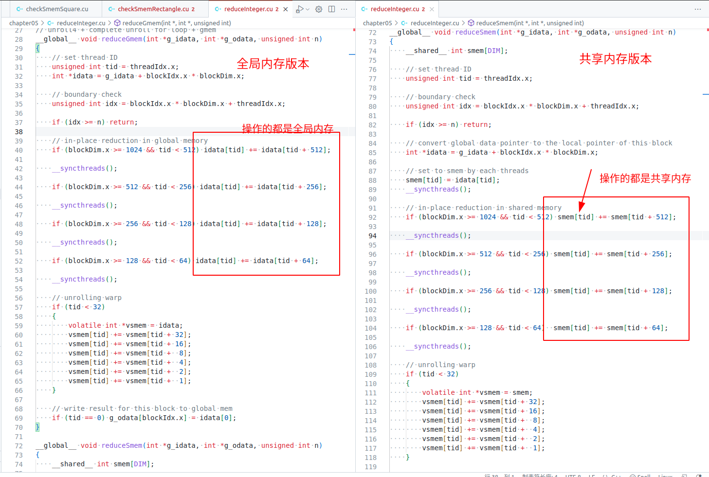
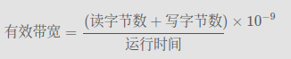

# 5.3 减少全局内存访问

**使用共享内存的主要原因之一是要缓存片上的数据，从而减少核函数中全局内存访问的次数。**

在本节中，将重新使用第三章的并行归约核函数，但是这里使用共享内存作为可编程管理缓存以减少全局内存的访问。

## 5.3.1 使用共享内存的并行归约

先看一下第3章中介绍过该函数`reduceGmem`并行归约只使用全局内存。核函数如下：

```C
// unroll4 + complete unroll for loop + gmem
__global__ void reduceGmem(int *g_idata, int *g_odata, unsigned int n)
{
    // set thread ID
    unsigned int tid = threadIdx.x;
    int *idata = g_idata + blockIdx.x * blockDim.x;

    // boundary check
    unsigned int idx = blockIdx.x * blockDim.x + threadIdx.x;

    if (idx >= n) return;

    // in-place reduction in global memory
    if (blockDim.x >= 1024 && tid < 512) idata[tid] += idata[tid + 512];

    __syncthreads();

    if (blockDim.x >= 512 && tid < 256) idata[tid] += idata[tid + 256];

    __syncthreads();

    if (blockDim.x >= 256 && tid < 128) idata[tid] += idata[tid + 128];

    __syncthreads();

    if (blockDim.x >= 128 && tid < 64) idata[tid] += idata[tid + 64];

    __syncthreads();

    // unrolling warp
    if (tid < 32)
    {
        volatile int *vsmem = idata;
        vsmem[tid] += vsmem[tid + 32];
        vsmem[tid] += vsmem[tid + 16];
        vsmem[tid] += vsmem[tid +  8];
        vsmem[tid] += vsmem[tid +  4];
        vsmem[tid] += vsmem[tid +  2];
        vsmem[tid] += vsmem[tid +  1];
    }

    // write result for this block to global mem
    if (tid == 0) g_odata[blockIdx.x] = idata[0];
}
```

下面使用共享内存的版本，`reduceSmem`函数没有使
用全局内存中的输入数组子集来执行原地归约，而是使用了共享内存数组`smem`。核函数如下

````C

__global__ void reduceSmem(int *g_idata, int *g_odata, unsigned int n)
{
    __shared__ int smem[DIM];

    // set thread ID
    unsigned int tid = threadIdx.x;

    // boundary check
    unsigned int idx = blockIdx.x * blockDim.x + threadIdx.x;

    if (idx >= n) return;

    // convert global data pointer to the local pointer of this block
    int *idata = g_idata + blockIdx.x * blockDim.x;

    // set to smem by each threads
    smem[tid] = idata[tid];
    __syncthreads();

    // in-place reduction in shared memory
    if (blockDim.x >= 1024 && tid < 512) smem[tid] += smem[tid + 512];

    __syncthreads();

    if (blockDim.x >= 512 && tid < 256) smem[tid] += smem[tid + 256];

    __syncthreads();

    if (blockDim.x >= 256 && tid < 128) smem[tid] += smem[tid + 128];

    __syncthreads();

    if (blockDim.x >= 128 && tid < 64)  smem[tid] += smem[tid + 64];

    __syncthreads();

    // unrolling warp
    if (tid < 32)
    {
        volatile int *vsmem = smem;
        vsmem[tid] += vsmem[tid + 32];
        vsmem[tid] += vsmem[tid + 16];
        vsmem[tid] += vsmem[tid +  8];
        vsmem[tid] += vsmem[tid +  4];
        vsmem[tid] += vsmem[tid +  2];
        vsmem[tid] += vsmem[tid +  1];
    }

    // write result for this block to global mem
    if (tid == 0) g_odata[blockIdx.x] = smem[0];
}
````

为了对比两者的区别截图如下



使用`nvprof`查看两个的运行时间

````shell
$ sudo nvprof ./reduceInteger
.....
==287535== Profiling result:
            Type  Time(%)      Time     Calls       Avg       Min       Max  Name
 GPU activities:   71.41%  15.761ms         8  1.9702ms  1.7954ms  2.4715ms  [CUDA memcpy HtoD]
                    7.85%  1.7324ms         1  1.7324ms  1.7324ms  1.7324ms  reduceNeighboredGmem(int*, int*, unsigned int)
                    7.12%  1.5715ms         1  1.5715ms  1.5715ms  1.5715ms  reduceNeighboredSmem(int*, int*, unsigned int)
                    4.67%  1.0304ms         1  1.0304ms  1.0304ms  1.0304ms  reduceGmem(int*, int*, unsigned int)
                    2.95%  651.65us         1  651.65us  651.65us  651.65us  reduceSmem(int*, int*, unsigned int)

````

查看全局内存的加载和存储事务数，可以看到使用共享内存减少了全局内存的加载和存储事务数，使用共享内存明显减少了全局内存访问。

```shell
$ sudo nvprof --metrics gld_transactions,gst_transactions ./reduceInteger

Invocations                               Metric Name                        Metric Description         Min         Max         Avg
Device "Quadro P2000 (0)"
    Kernel: reduceSmem(int*, int*, unsigned int)
          1                          gld_transactions                  Global Load Transactions     2097154     2097154     2097154
          1                          gst_transactions                 Global Store Transactions       32768       32768       32768

    Kernel: reduceGmem(int*, int*, unsigned int)
          1                          gld_transactions                  Global Load Transactions     8519682     8519682     8519682
          1                          gst_transactions                 Global Store Transactions     1081344     1081344     1081344

```

## 5.3.2 使用展开的并行归约

在前面的核函数中，每个线程块处理一个数据块。在第3章中，可以通过一次运行多个I/O操作，展开线程块来提高内核性能。以下内核展开了4个线程块，即每个线程处理来自于4个数据块的数据元素。通过展开，以下优势是可预期的：

* 通过在每个线程中提供更多的并行I/O，增加全局内存的吞吐量
* 全局内存存储事务减少了1/4

核函数的代码如下：实际就是展开规约的共享内存版本代码。

```C

__global__ void reduceSmemUnroll(int *g_idata, int *g_odata, unsigned int n)
{
    // static shared memory
    __shared__ int smem[DIM];

    // set thread ID
    unsigned int tid = threadIdx.x;

    // global index, 4 blocks of input data processed at a time
    unsigned int idx = blockIdx.x * blockDim.x * 4 + threadIdx.x;

    // unrolling 4 blocks
    int tmpSum = 0;

    // boundary check
    if (idx < n)
    {
        int a1, a2, a3, a4;
        a1 = a2 = a3 = a4 = 0;
        a1 = g_idata[idx];
        if (idx + blockDim.x < n) a2 = g_idata[idx + blockDim.x];
        if (idx + 2 * blockDim.x < n) a3 = g_idata[idx + 2 * blockDim.x];
        if (idx + 3 * blockDim.x < n) a4 = g_idata[idx + 3 * blockDim.x];
        tmpSum = a1 + a2 + a3 + a4;
    }

    smem[tid] = tmpSum;
    __syncthreads();

    // in-place reduction in shared memory
    if (blockDim.x >= 1024 && tid < 512) smem[tid] += smem[tid + 512];

    __syncthreads();

    if (blockDim.x >= 512 && tid < 256)  smem[tid] += smem[tid + 256];

    __syncthreads();

    if (blockDim.x >= 256 && tid < 128)  smem[tid] += smem[tid + 128];

    __syncthreads();

    if (blockDim.x >= 128 && tid < 64)   smem[tid] += smem[tid + 64];

    __syncthreads();

    // unrolling warp
    if (tid < 32)
    {
        volatile int *vsmem = smem;
        vsmem[tid] += vsmem[tid + 32];
        vsmem[tid] += vsmem[tid + 16];
        vsmem[tid] += vsmem[tid +  8];
        vsmem[tid] += vsmem[tid +  4];
        vsmem[tid] += vsmem[tid +  2];
        vsmem[tid] += vsmem[tid +  1];
    }

    // write result for this block to global mem
    if (tid == 0) g_odata[blockIdx.x] = smem[0];
}

```

测试时间如下

````shell

$ sudo nvprof ./reduceInteger
4.48%  1.0309ms         1  1.0309ms  1.0309ms  1.0309ms  reduceGmem(int*, int*, unsigned int)
2.83%  651.37us         1  651.37us  651.37us  651.37us  reduceSmem(int*, int*, unsigned int)
1.15%  264.61us         1  264.61us  264.61us  264.61us  reduceGmemUnroll(int*, int*, unsigned int)
````

## 5.3.3 使用动态共享内存的并行归约

并行归约核函数还可以使用动态共享内存来执行，通过以下声明，在reduceSmem-Unroll中用动态共享内存取代静态共享内存：

```C
extern __shared__ int smem[];
```

启动核函数时，必须指定待动态分配的共享内存数量：

```C
reduceSmemUnrollDyn<<<grid.x / 4, block, DIM*sizeof(int)>>>(d_idata,
            d_odata, size);
```

如果用nvprof计算核函数的运行时间，动态分配共享内存实现的核函数和用静态分配共享内存实现的核函数之间没有显著的差异

## 5.3.4 有效带宽

有效带宽是在核函数的完整执行时间内I/O的数量（以字节为单位）

