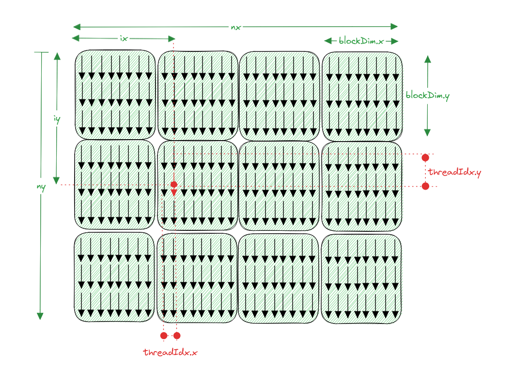
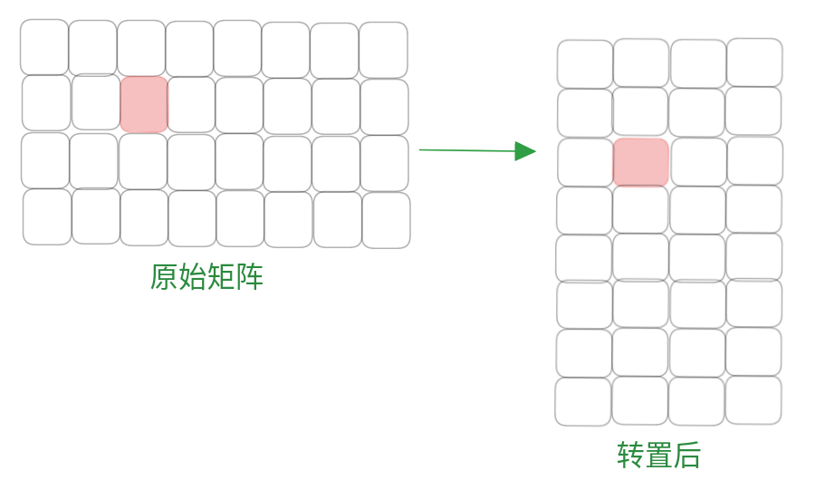
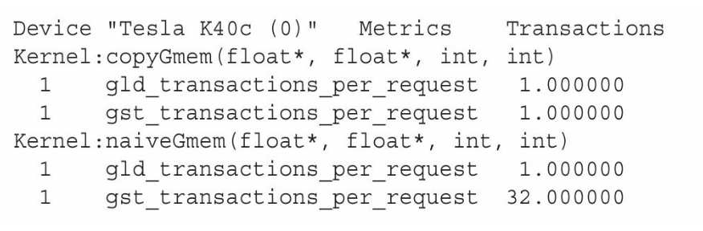
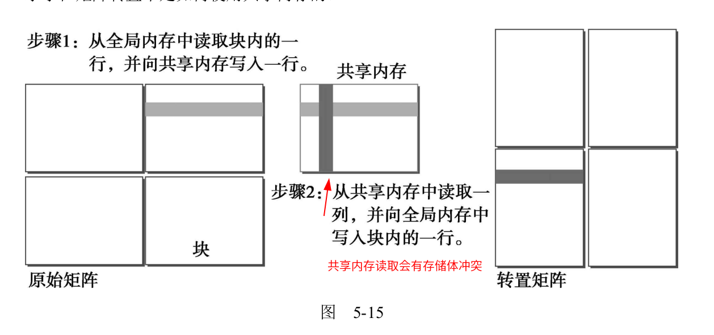
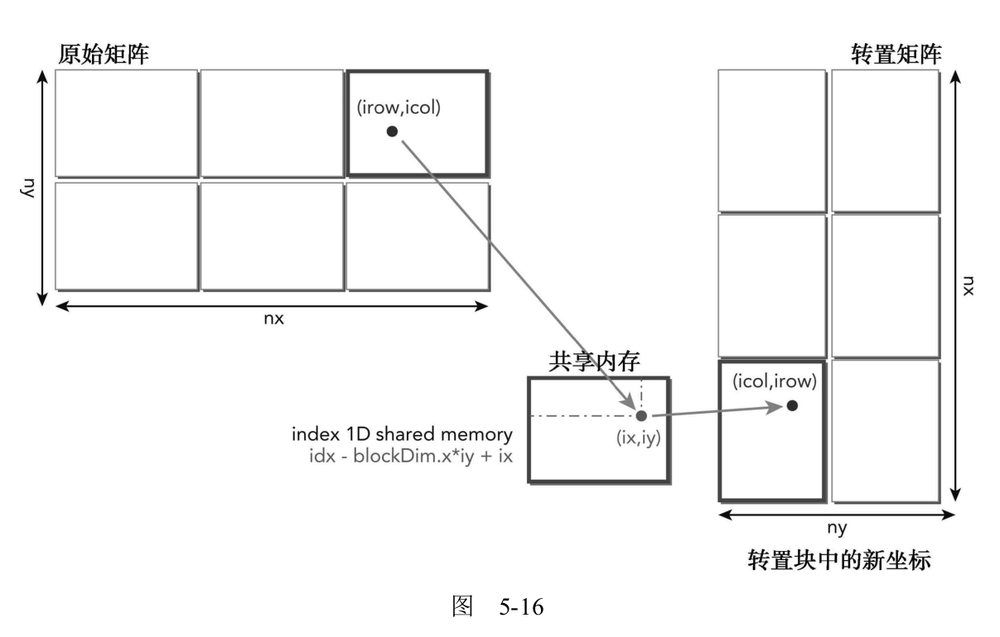
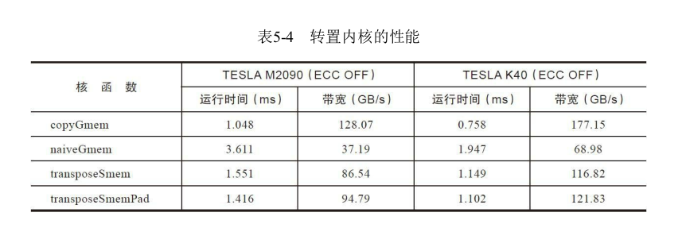
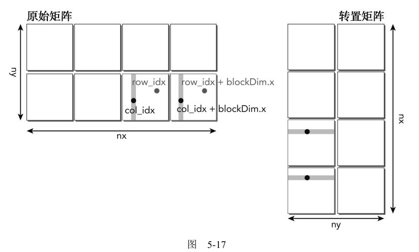
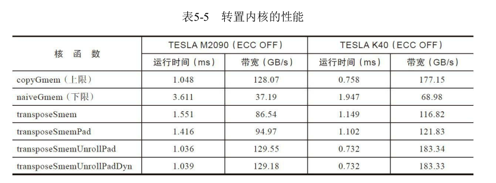
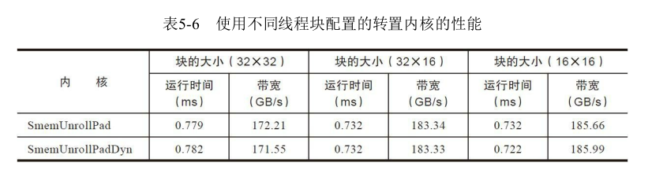

# 5.4 合并的全局内存访问

上一节介绍的是通过共享内存减少对全局内存的访问，这一部分是介绍使用共享内存避免对未合并的全局内存的访问。矩阵转置就是一个典型的例子：读操作被自然合并，但写操作是按照交叉访问的。在共享内存的帮助下，可以先在共享内存中进行转置操作，然后再对全局内存进行合并写操作。

## 5.4.1 基准转置内核

作为对比的基准，下面的核函数是一个仅使用全局内存的矩阵转置的实现。

```C
__global__ void naiveGmem(float *out, float *in, const int nx, const int ny)
{
    // matrix coordinate (ix,iy)
    unsigned int ix = blockIdx.y * blockDim.y + threadIdx.y;
    unsigned int iy = blockIdx.x * blockDim.x + threadIdx.x;

    // transpose with boundary test
    if (ix < nx && iy < ny)
    {
        out[ix*ny+iy] = in[iy*nx+ix];
    }
}
```

下面图示可以更好的理解。



* 一个绿色的框是一个block

* 一个block内有多个thread（箭头表示）

* nx是矩阵的宽，ny是矩阵的高，ix是线程的x索引，iy是线程的y索引，通过这两个索引可以算出全局线性内存的索引。

  * ```C
        unsigned int ix = blockIdx.y * blockDim.y + threadIdx.y;
        unsigned int iy = blockIdx.x * blockDim.x + threadIdx.x;
    ```

* 全局线程内存转置后就是`out[ix*ny+iy] = in[iy*nx+ix];`如下图所示



**因为ix是这个核函数二维线程配置的最内层维度，全局内存读操作在线程束内是被合并的，而全局内存写操作在相邻线程间是交叉访问的。**

下面的核函数只是实现了一个矩阵的拷贝，读写都是合并的访问，因此可以看作是性能的上限。

```C
#define INDEX(ROW, COL, INNER) ((ROW) * (INNER) + (COL))

__global__ void copyGmem(float *out, float *in, const int nrows, const int ncols)
{
    // matrix coordinate (ix,iy)
    unsigned int row = blockIdx.y * blockDim.y + threadIdx.y;
    unsigned int col = blockIdx.x * blockDim.x + threadIdx.x;

    // transpose with boundary test
    if (row < nrows && col < ncols)
    {
		    // NOTE this is a transpose, not a copy
        out[INDEX(col, row, nrows)] = in[INDEX(row, col, ncols)];
    }
}
```

nvprof查看时间

```C
            Type  Time(%)      Time     Calls       Avg       Min       Max  Name
 GPU activities:   54.09%  20.629ms         3  6.8764ms  6.8645ms  6.8945ms  [CUDA memcpy DtoH]
                   20.30%  7.7420ms         1  7.7420ms  7.7420ms  7.7420ms  [CUDA memcpy HtoD]
                   11.67%  4.4511ms         1  4.4511ms  4.4511ms  4.4511ms  naiveGmem(float*, float*, int, int)
                    3.55%  1.3557ms         1  1.3557ms  1.3557ms  1.3557ms  copyGmem(float*, float*, int, int)
```


按照书中描述的，全局内存的读可能是32或者128字节的颗粒度，写是32字节的颗粒度。

加载和存储全局内存请求的平均事务的次数的测试结果如下（因为测试结果与书中差异太大了，因此再看看gld_efficiency和gst_efficiency 全局内存的加载和存储效率）。但是有一点是一致的，就是转置的存储内存请求事务数（gst_transactions_per_request）由拷贝的4变为了转置的32。明显的增多了，需要优化。

```shell
huolin@huolin:~/WorkSpace/zyd/note/cuda/CUDAC编程权威指南/CUDAC编程权威指南练习code/chapter05$ sudo nvprof --metrics gld_transactions_per_request,gst_transactions_per_request,gld_efficiency,gst_efficiency ./transposeRectangle
==127053== NVPROF is profiling process 127053, command: ./transposeRectangle
./transposeRectangle starting transpose at device 0: Quadro P2000  with matrix nrows 4096 ncols 4096
==127053== Some kernel(s) will be replayed on device 0 in order to collect all events/metrics.
Replaying kernel "copyGmem(float*, float*, int, int)" (done)
copyGmem elapsed 0.135785 sec <<< grid (128,256) block (32,16)>>> effective bandwidth 0.988457 GB
Replaying kernel "naiveGmem(float*, float*, int, int)" (done)
naiveGmem elapsed 0.142126 sec <<< grid (128,256) block (32,16)>>> effective bandwidth 0.944357 GB
==127053== Profiling application: ./transposeRectangle
==127053== Profiling result:
==127053== Metric result:
Invocations                               Metric Name                        Metric Description         Min         Max         Avg
Device "Quadro P2000 (0)"
    Kernel: copyGmem(float*, float*, int, int)
          1              gld_transactions_per_request      Global Load Transactions Per Request   16.000004   16.000004   16.000004
          1              gst_transactions_per_request     Global Store Transactions Per Request    4.000000    4.000000    4.000000
          1                            gld_efficiency             Global Memory Load Efficiency     100.00%     100.00%     100.00%
          1                            gst_efficiency            Global Memory Store Efficiency     100.00%     100.00%     100.00%
    Kernel: naiveGmem(float*, float*, int, int)
          1              gld_transactions_per_request      Global Load Transactions Per Request   16.000004   16.000004   16.000004
          1              gst_transactions_per_request     Global Store Transactions Per Request   32.000000   32.000000   32.000000
          1                            gld_efficiency             Global Memory Load Efficiency     100.00%     100.00%     100.00%
          1                            gst_efficiency            Global Memory Store Efficiency      12.50%      12.50%      12.50%

```

书中的测试结果如下



不知道为什么两个差异这么大。找资料没找到，先放一放吧。

## 5.4.2 使用共享内存的矩阵转置

上一节的矩阵转置存储操作明显存在全局内存的交叉访问。为了避免交叉全局内存访问，可以使用二维共享内存来缓存原始矩阵的数据。从二维共享内存中读取的一列可以被转移到转置矩阵行中，它被存储在全局内存中。虽然下面的实现导致共享内存存储体冲突，但这个结果将比非合并的全局内存访问好得多。图5-15显
示了在矩阵转置中是如何使用共享内存的。



对应的核函数如下

```C
#define BDIMX 32
#define BDIMY 16

#define INDEX(ROW, COL, INNER) ((ROW) * (INNER) + (COL))    
// nrows = 1 << 12   ncols = 1 << 12;

__global__ void transposeSmem(float *out, float *in, int nrows, int ncols)
{
    // static shared memory
    __shared__ float tile[BDIMY][BDIMX];//一个线程块读取的全局内存，存放到共享内存中，注意长和宽

    // coordinate in original matrix
    unsigned int row = blockDim.y * blockIdx.y + threadIdx.y;//全局内存中的行列
    unsigned int col = blockDim.x * blockIdx.x + threadIdx.x;

    // linear global memory index for original matrix
    unsigned int offset = INDEX(row, col, ncols);//全局内存中的索引

    if (row < nrows && col < ncols)
    {
      // load data from global memory to shared memory
      tile[threadIdx.y][threadIdx.x] = in[offset];//全局内存索引后给到共享内存。
    }

    // thread index in transposed block
    unsigned int bidx, irow, icol;
    bidx = threadIdx.y * blockDim.x + threadIdx.x;//block内的内存索引
    irow = bidx / blockDim.y;//block转置后在block内的行
    icol = bidx % blockDim.y;//block转置后在block内的列

	  // NOTE - need to transpose row and col on block and thread-block level:
	  // 1. swap blocks x-y
	  // 2. swap thread x-y assignment (irow and icol calculations above)
	  // note col still has continuous threadIdx.x -> coalesced gst
	  col = blockIdx.y * blockDim.y + icol;//转置后全局内存中的行列
	  row = blockIdx.x * blockDim.x + irow;

    // linear global memory index for transposed matrix
	  // NOTE nrows is stride of result, row and col are transposed
    unsigned int transposed_offset = INDEX(row, col, nrows);//转置后全局内存的索引
    // thread synchronization
    __syncthreads();

	  // NOTE invert sizes for write check
    if (row < ncols && col < nrows)
    {
        // store data to global memory from shared memory
        out[transposed_offset] = tile[icol][irow]; // NOTE icol,irow not irow,icol//将共享内存的一列给到转置后的全局内存
    }
}
```

kerneltransposeSmem函数可被分解为以下几个步骤：

1. 线程束执行合并读取一行，该行存储在全局内存中的原始矩阵块中。
2. 该线程束按行主序将该数据写入共享内存中，因此，这个写操作没有存储体冲突。
3. 因为线程块的读/写操作是同步的，所以会有一个填满全局内存数据的二维共享内存数组。
4. 该线程束从二维共享内存数组中读取一列。由于共享内存没有被填充，所以会发生存储体冲突。
5. 然后该线程束执行数据的合并写入操作，将其写入到全局内存的转置矩阵中的某行。

上面最难理解的就是各种索引的转换了。下图方便理解



nvprof查看时间

```C
            Type  Time(%)      Time     Calls       Avg       Min       Max  Name
 GPU activities:   54.09%  20.629ms         3  6.8764ms  6.8645ms  6.8945ms  [CUDA memcpy DtoH]
                   20.30%  7.7420ms         1  7.7420ms  7.7420ms  7.7420ms  [CUDA memcpy HtoD]
                   11.67%  4.4511ms         1  4.4511ms  4.4511ms  4.4511ms  naiveGmem(float*, float*, int, int)
                    6.11%  2.3309ms         1  2.3309ms  2.3309ms  2.3309ms  transposeSmem(float*, float*, int, int)
                    3.55%  1.3557ms         1  1.3557ms  1.3557ms  1.3557ms  copyGmem(float*, float*, int, int)
```

可以看出共享内存版本的比一般的转置快了一倍。

下面看看其他的数据，全局内存存贮和内存事务与拷贝已经一致了。

```shell
chapter05$ sudo nvprof --metrics gld_transactions_per_request,gst_transactions_per_request,gld_efficiency,gst_efficiency ./transposeRectangle
[sudo] password for huolin: 
==150723== NVPROF is profiling process 150723, command: ./transposeRectangle
./transposeRectangle starting transpose at device 0: Quadro P2000  with matrix nrows 4096 ncols 4096
==150723== Some kernel(s) will be replayed on device 0 in order to collect all events/metrics.
Replaying kernel "copyGmem(float*, float*, int, int)" (done)
copyGmem elapsed 0.135283 sec <<< grid (128,256) block (32,16)>>> effective bandwidth 0.992126 GB
Replaying kernel "naiveGmem(float*, float*, int, int)" (done)
naiveGmem elapsed 0.149418 sec <<< grid (128,256) block (32,16)>>> effective bandwidth 0.898271 GB
Replaying kernel "transposeSmem(float*, float*, int, int)" (done)
transposeSmem elapsed 0.115023 sec <<< grid (128,256) block (32,16)>>> effective bandwidth 1.166876 GB
==150723== Profiling application: ./transposeRectangle
==150723== Profiling result:
==150723== Metric result:
Invocations                               Metric Name                        Metric Description         Min         Max         Avg
Device "Quadro P2000 (0)"
    Kernel: copyGmem(float*, float*, int, int)
          1              gld_transactions_per_request      Global Load Transactions Per Request   16.000004   16.000004   16.000004
          1              gst_transactions_per_request     Global Store Transactions Per Request    4.000000    4.000000    4.000000
          1                            gld_efficiency             Global Memory Load Efficiency     100.00%     100.00%     100.00%
          1                            gst_efficiency            Global Memory Store Efficiency     100.00%     100.00%     100.00%
    Kernel: naiveGmem(float*, float*, int, int)
          1              gld_transactions_per_request      Global Load Transactions Per Request   16.000004   16.000004   16.000004
          1              gst_transactions_per_request     Global Store Transactions Per Request   32.000000   32.000000   32.000000
          1                            gld_efficiency             Global Memory Load Efficiency     100.00%     100.00%     100.00%
          1                            gst_efficiency            Global Memory Store Efficiency      12.50%      12.50%      12.50%
    Kernel: transposeSmem(float*, float*, int, int)
          1              gld_transactions_per_request      Global Load Transactions Per Request   16.000004   16.000004   16.000004
          1              gst_transactions_per_request     Global Store Transactions Per Request    4.000000    4.000000    4.000000
          1                            gld_efficiency             Global Memory Load Efficiency     100.00%     100.00%     100.00%
          1                            gst_efficiency            Global Memory Store Efficiency     100.00%     100.00%     100.00%
```

## 5.4.3 使用填充共享内存的矩阵转置

为了消除共享内存的存储体冲突，添加列来操作。`IPAD`来指定填充的列数，需要根据不同的显卡来定，可以测试1或者2.看看效果。

```C
__shared__ float tile[BDIMY][BDIMX + IPAD];
```

书中给出的结果如下



## 5.4.4 使用展开的矩阵转置

下面的核函数展开两个数据块的同时处理：每个线程现在转置了被一个数据块跨越的两个数据元素。这种转化的目标是通过创造更多的同时加载和存储以提高设备内存带宽利用率。

```C

__global__ void transposeSmemUnrollPad(float *out, float *in, const int nrows,
                                       const int ncols)
{
    // static 1D shared memory with padding
    __shared__ float tile[BDIMY][BDIMX * 2 + IPAD];

    // coordinate in original matrix
    unsigned int row = blockIdx.y * blockDim.y + threadIdx.y;
    unsigned int col = (2 * blockIdx.x * blockDim.x) + threadIdx.x;

    unsigned int row2 = row;
    unsigned int col2 = col + blockDim.x;

    // linear global memory index for original matrix
    unsigned int offset = INDEX(row, col, ncols);
    unsigned int offset2 = INDEX(row2, col2, ncols);

    // thread index in transposed block
    unsigned int bidx = threadIdx.y * blockDim.x + threadIdx.x;
    unsigned int irow = bidx / blockDim.y;
    unsigned int icol = bidx % blockDim.y;

    // linear global memory index for transposed matrix
    unsigned int transposed_offset = INDEX(col, row, nrows);
    unsigned int transposed_offset2 = INDEX(col2, row2, nrows);

    if (row < nrows && col < ncols)
    {
        tile[threadIdx.y][threadIdx.x] = in[offset];
    }
    if (row2 < nrows && col2 < ncols)
    {
        tile[threadIdx.y][blockDim.x + threadIdx.x] = in[offset2];
    }

    __syncthreads();

    if (row < nrows && col < ncols)
    {
        out[transposed_offset] = tile[irow][icol];
    }
    if (row2 < nrows && col2 < ncols)
    {
        out[transposed_offset2] = tile[irow][blockDim.x + icol];
    }
}
```



书中的测试结果如下



## 5.4.5 增大并行性

一个简单而有效的优化技术是调整线程块的维度，以找出最佳的执行配置。


