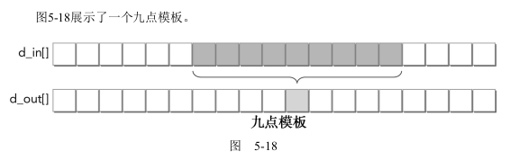
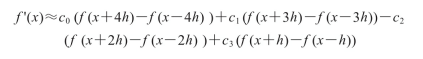

# 5.5 常量内存

常量内存是一种专用的内存，它用于只读数据和统一访问线程束中线程的数据。常量内存对内核代码而言是只读的，但它对主机而言既是可读又是可写的。
常量内存位于设备的DRAM上（和全局内存一样），并且有一个专用的片上缓存。和一级缓存和共享内存一样，从每个SM的常量缓存中读取的延迟，比直接从常量内存中读取的低得多。每个SM常量内存缓存大小的限制为64KB。

**在常量内存中，如果线程束中的所有线程都访问相同的位置，那么这个访问模式就是最优的**。如果线程束中的线程访问不同的地址，则访问就需要串行。

在**全局作用域**中必须用以下修饰符**声明常量变量**：

```C
__constant__
```

**常量内存变量的生存期与应用程序的生存期相同，其对网格内的所有线程都是可访问的**，并且通过运行时函数对主机可访问。

因为设备只能读取常量内存，所以常量内存中的值必须使用以下运行时函数进行**初始化**：

```C
cudaError_t cudaMemcpyToSymbol(const void *symbol, const void * src,  size_t count, size_t offset, cudaMemcpyKind kind)
```

## 5.5.1 使用常量内存实现一维模板

所谓模板操作就是把一组数据中中间连续的若干个产生一个输出：



理解这个公式的应用并不重要，只要简单地了解到它会将上述的九点作为输入并产生单一输出。



在上述模板公式的例子下，**系数c0、c1、c2和c3在所有线程中都是相同的并且不会被修改。这使它们成为常量内存最优的候选，因为它们是只读的，并将呈现一个广播式的访问模式：线程束中的每个线程同时引用相同的常量内存地址**。

由于每个线程需要9个点来计算一个点，所以要使用共享内存来缓存数据，从而减少对全局内存的冗余访问。

#pragma unroll的作用是提示CUDA编译器，表明这个循环将被自动展开。

```C
#pragma unroll

    for (int i = 1; i <= RADIUS; i++)
    {
        tmp += dcoef[i] * (smem[sidx + i] - smem[sidx - i]);
    }
```


完整的核函数如下

```C
// constant memory
__constant__ float coef[RADIUS + 1];

// FD coeffecient
#define a0     0.00000f
#define a1     0.80000f
#define a2    -0.20000f
#define a3     0.03809f
#define a4    -0.00357f

void setup_coef_constant (void)
{
    const float h_coef[] = {a0, a1, a2, a3, a4};
    CHECK(cudaMemcpyToSymbol( coef, h_coef, (RADIUS + 1) * sizeof(float)));
}

// set up constant memory
setup_coef_constant ();

// launch configuration
dim3 block (BDIM, 1);
dim3 grid  (isize / block.x, 1);
printf("(grid, block) %d,%d \n ", grid.x, block.x);
// Launch stencil_1d() kernel on GPU
stencil_1d<<<grid, block>>>(d_in + RADIUS, d_out + RADIUS);

__global__ void stencil_1d(float *in, float *out)
{
    // shared memory
    __shared__ float smem[BDIM + 2 * RADIUS];

    // index to global memory
    int idx = threadIdx.x + blockIdx.x * blockDim.x;

    // index to shared memory for stencil calculatioin
    int sidx = threadIdx.x + RADIUS;

    // Read data from global memory into shared memory
    smem[sidx] = in[idx];

    // read halo part to shared memory
    if (threadIdx.x < RADIUS)
    {
        smem[sidx - RADIUS] = in[idx - RADIUS];
        smem[sidx + BDIM] = in[idx + BDIM];
    }

    // Synchronize (ensure all the data is available)
    __syncthreads();

    // Apply the stencil
    float tmp = 0.0f;
#pragma unroll

    for (int i = 1; i <= RADIUS; i++)
    {
        tmp += coef[i] * (smem[sidx + i] - smem[sidx - i]);
    }

    // Store the result
    out[idx] = tmp;
}
```

## 5.5.2 与只读缓存的比较

Kepler GPU添加了一个功能，即使用GPU纹理流水线作为只读缓存，用于存储全局内
存中的数据。因为这是一个独立的只读缓存，它带有从标准全局内存读取的独立内存带
宽，所以使用此功能可以为带宽限制内核提供性能优势。

实现只读缓存可以使用两种方法

- 使用__ldg函数
- 全局内存的限定指针

使用__ldg()的方法：

```c

__global__ void kernel(float* output, float* input) {
...
output[idx] += __ldg(&input[idx]);
...
}
```

使用限定指针的方法：

```c

void kernel(float* output, const float* __restrict__ input) {
...
output[idx] += input[idx];
}
```

检测到只读缓存的使用是否是安全的情况下，内部函数__ldg是一个更好的选择。
只读缓存是独立的，而且区别于常量缓存。通过常量缓存加载的数据必须是相对较小的，而且访问必须一致以获得良好的性能（一个线程束内的所有线程在任何给定时间内应该都访问相同的位置），而通过只读缓存加载的数据可以是比较大的，而且能够在一个非统一的模式下进行访问。
下面的内核是根据以前的模板内核修改而来的。它使用只读缓存来存储之前存储在常量内存中的系数。比较一下这两个内核，唯一的不同就是多了一个参数，这个参数在主机内是定义的全局内存

```C
CHECK(cudaMalloc((float**)&d_coef, (RADIUS + 1) * sizeof(float)));

// set up coefficient to global memory
const float h_coef[] = {a0, a1, a2, a3, a4};
CHECK(cudaMemcpy(d_coef, h_coef, (RADIUS + 1) * sizeof(float),
                 cudaMemcpyHostToDevice);)
 
__global__ void stencil_1d_read_only (float* in,
                                      float* out,
                                      const float *__restrict__ dcoef)
{
    // shared memory
    __shared__ float smem[BDIM + 2 * RADIUS];

    // index to global memory
    int idx = threadIdx.x + blockIdx.x * blockDim.x;

    // index to shared memory for stencil calculatioin
    int sidx = threadIdx.x + RADIUS;

    // Read data from global memory into shared memory
    smem[sidx] = in[idx];

    // read halo part to shared memory
    if (threadIdx.x < RADIUS)
    {
        smem[sidx - RADIUS] = in[idx - RADIUS];
        smem[sidx + BDIM] = in[idx + BDIM];
    }

    // Synchronize (ensure all the data is available)
    __syncthreads();

    // Apply the stencil
    float tmp = 0.0f;
#pragma unroll

    for (int i = 1; i <= RADIUS; i++)
    {
        tmp += dcoef[i] * (smem[sidx + i] - smem[sidx - i]);
    }

    // Store the result
    out[idx] = tmp;
}
```


两个核函数整体代码如下：

```C
#include "../common/common.h"
#include <cuda_runtime.h>
#include <stdio.h>

#define RADIUS 4
#define BDIM 32

// constant memory
__constant__ float coef[RADIUS + 1];

// FD coeffecient
#define a0     0.00000f
#define a1     0.80000f
#define a2    -0.20000f
#define a3     0.03809f
#define a4    -0.00357f

void initialData(float *in,  const int size)
{
    for (int i = 0; i < size; i++)
    {
        in[i] = (float)( rand() & 0xFF ) / 100.0f;
    }
}

void printData(float *in,  const int size)
{
    for (int i = RADIUS; i < size; i++)
    {
        printf("%f ", in[i]);
    }

    printf("\n");
}

void setup_coef_constant (void)
{
    const float h_coef[] = {a0, a1, a2, a3, a4};
    CHECK(cudaMemcpyToSymbol( coef, h_coef, (RADIUS + 1) * sizeof(float)));
}

void cpu_stencil_1d (float *in, float *out, int isize)
{
    for( int i = RADIUS; i <= isize; i++ )
    {
        float tmp = 0.0f;
        tmp += a1 * (in[i + 1] - in[i - 1])
               + a2 * (in[i + 2] - in[i - 2])
               + a3 * (in[i + 3] - in[i - 3])
               + a4 * (in[i + 4] - in[i - 4]);
        out[i] = tmp;
    }
}

void checkResult(float *hostRef, float *gpuRef, const int size)
{
    double epsilon = 1.0E-6;
    bool match = 1;

    for (int i = RADIUS; i < size; i++)
    {
        if (abs(hostRef[i] - gpuRef[i]) > epsilon)
        {
            match = 0;
            printf("different on %dth element: host %f gpu %f\n", i, hostRef[i],
                   gpuRef[i]);
            break;
        }
    }

    if (!match)  printf("Arrays do not match.\n\n");
}

__global__ void stencil_1d(float *in, float *out)
{
    // shared memory
    __shared__ float smem[BDIM + 2 * RADIUS];

    // index to global memory
    int idx = threadIdx.x + blockIdx.x * blockDim.x;

    // index to shared memory for stencil calculatioin
    int sidx = threadIdx.x + RADIUS;

    // Read data from global memory into shared memory
    smem[sidx] = in[idx];

    // read halo part to shared memory
    if (threadIdx.x < RADIUS)
    {
        smem[sidx - RADIUS] = in[idx - RADIUS];
        smem[sidx + BDIM] = in[idx + BDIM];
    }

    // Synchronize (ensure all the data is available)
    __syncthreads();

    // Apply the stencil
    float tmp = 0.0f;
#pragma unroll

    for (int i = 1; i <= RADIUS; i++)
    {
        tmp += coef[i] * (smem[sidx + i] - smem[sidx - i]);
    }

    // Store the result
    out[idx] = tmp;
}

__global__ void stencil_1d_read_only (float* in,
                                      float* out,
                                      const float *__restrict__ dcoef)
{
    // shared memory
    __shared__ float smem[BDIM + 2 * RADIUS];

    // index to global memory
    int idx = threadIdx.x + blockIdx.x * blockDim.x;

    // index to shared memory for stencil calculatioin
    int sidx = threadIdx.x + RADIUS;

    // Read data from global memory into shared memory
    smem[sidx] = in[idx];

    // read halo part to shared memory
    if (threadIdx.x < RADIUS)
    {
        smem[sidx - RADIUS] = in[idx - RADIUS];
        smem[sidx + BDIM] = in[idx + BDIM];
    }

    // Synchronize (ensure all the data is available)
    __syncthreads();

    // Apply the stencil
    float tmp = 0.0f;
#pragma unroll

    for (int i = 1; i <= RADIUS; i++)
    {
        tmp += dcoef[i] * (smem[sidx + i] - smem[sidx - i]);
    }

    // Store the result
    out[idx] = tmp;
}

int main(int argc, char **argv)
{
    // set up device
    int dev = 0;
    cudaDeviceProp deviceProp;
    CHECK(cudaGetDeviceProperties(&deviceProp, dev));
    printf("%s starting transpose at ", argv[0]);
    printf("device %d: %s ", dev, deviceProp.name);
    CHECK(cudaSetDevice(dev));

    // set up data size
    int isize = 1 << 24;

    size_t nBytes = (isize + 2 * RADIUS) * sizeof(float);
    printf("array size: %d ", isize);

    bool iprint = 0;

    // allocate host memory
    float *h_in    = (float *)malloc(nBytes);
    float *hostRef = (float *)malloc(nBytes);
    float *gpuRef  = (float *)malloc(nBytes);

    // allocate device memory
    float *d_in, *d_out, *d_coef;
    CHECK(cudaMalloc((float**)&d_in, nBytes));
    CHECK(cudaMalloc((float**)&d_out, nBytes));
    CHECK(cudaMalloc((float**)&d_coef, (RADIUS + 1) * sizeof(float)));

    // set up coefficient to global memory
    const float h_coef[] = {a0, a1, a2, a3, a4};
    CHECK(cudaMemcpy(d_coef, h_coef, (RADIUS + 1) * sizeof(float),
                     cudaMemcpyHostToDevice);)

    // initialize host array
    initialData(h_in, isize + 2 * RADIUS);

    // Copy to device
    CHECK(cudaMemcpy(d_in, h_in, nBytes, cudaMemcpyHostToDevice));

    // set up constant memory
    setup_coef_constant ();

    // launch configuration
    dim3 block (BDIM, 1);
    dim3 grid  (isize / block.x, 1);
    printf("(grid, block) %d,%d \n ", grid.x, block.x);

    // Launch stencil_1d() kernel on GPU
    stencil_1d<<<grid, block>>>(d_in + RADIUS, d_out + RADIUS);

    // Copy result back to host
    CHECK(cudaMemcpy(gpuRef, d_out, nBytes, cudaMemcpyDeviceToHost));

    // apply cpu stencil
    cpu_stencil_1d(h_in, hostRef, isize);

    // check results
    checkResult(hostRef, gpuRef, isize);

    // launch read only cache kernel
    stencil_1d_read_only<<<grid, block>>>(d_in + RADIUS, d_out + RADIUS,
            d_coef);
    CHECK(cudaMemcpy(gpuRef, d_out, nBytes, cudaMemcpyDeviceToHost));
    checkResult(hostRef, gpuRef, isize);

    // print out results
    if(iprint)
    {
        printData(gpuRef, isize);
        printData(hostRef, isize);
    }

    // Cleanup
    CHECK(cudaFree(d_in));
    CHECK(cudaFree(d_out));
    CHECK(cudaFree(d_coef));
    free(h_in);
    free(hostRef);
    free(gpuRef);

    // reset device
    CHECK(cudaDeviceReset());
    return EXIT_SUCCESS;
}

```

运行结果如下：

```shell
chapter05$ sudo nvprof ./constantReadOnly
==861003== NVPROF is profiling process 861003, command: ./constantReadOnly
./constantReadOnly starting transpose at device 0: Quadro P2000 array size: 16777216 (grid, block) 524288,32 
 ==861003== Profiling application: ./constantReadOnly
==861003== Profiling result:
            Type  Time(%)      Time     Calls       Avg       Min       Max  Name
 GPU activities:   74.50%  37.435ms         2  18.718ms  6.6147ms  30.821ms  [CUDA memcpy DtoH]
                   14.26%  7.1673ms         3  2.3891ms  1.0240us  7.1652ms  [CUDA memcpy HtoD]
                    6.10%  3.0644ms         1  3.0644ms  3.0644ms  3.0644ms  stencil_1d(float*, float*)
                    5.13%  2.5796ms         1  2.5796ms  2.5796ms  2.5796ms  stencil_1d_read_only(float*, float*, float const *)
      API calls:   56.36%  130.91ms         3  43.638ms  58.918us  130.75ms  cudaMalloc
                   22.01%  51.126ms         4  12.782ms  18.976us  34.501ms  cudaMemcpy
                   19.51%  45.313ms         1  45.313ms  45.313ms  45.313ms  cudaDeviceReset
                    1.93%  4.4852ms         3  1.4951ms  218.50us  2.1537ms  cudaFree
                    0.06%  149.33us       101  1.4780us     209ns  63.768us  cuDeviceGetAttribute
                    0.05%  110.83us         1  110.83us  110.83us  110.83us  cudaGetDeviceProperties
                    0.04%  81.898us         1  81.898us  81.898us  81.898us  cudaMemcpyToSymbol
                    0.02%  56.569us         2  28.284us  21.575us  34.994us  cudaLaunchKernel
                    0.02%  37.578us         1  37.578us  37.578us  37.578us  cuDeviceGetName
                    0.00%  10.385us         1  10.385us  10.385us  10.385us  cuDeviceGetPCIBusId
                    0.00%  4.7120us         1  4.7120us  4.7120us  4.7120us  cudaSetDevice
                    0.00%  3.0460us         3  1.0150us     404ns  2.0670us  cuDeviceGetCount
                    0.00%  1.1620us         2     581ns     240ns     922ns  cuDeviceGet
                    0.00%     553ns         1     553ns     553ns     553ns  cuDeviceTotalMem
                    0.00%     417ns         1     417ns     417ns     417ns
                    0.00%     360ns         1     360ns     360ns     360ns  cuDeviceGetUuid

```

## 5.5.3 总结

常量内存和只读缓存：

- 对于核函数都是只读的
- SM上的资源有限，常量缓存64KB，只读缓存48KB
- 常量缓存对于统一读取（读同一个地址）执行更好
- 只读缓存适合分散读取