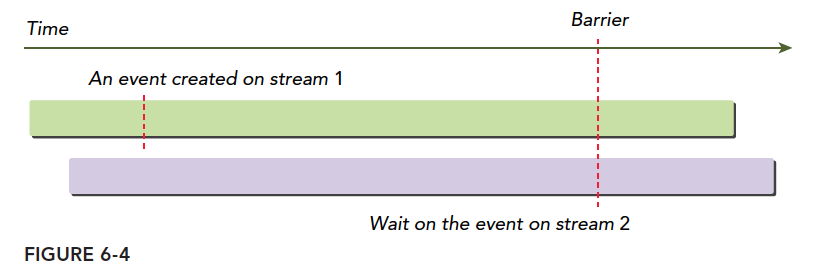

# 第6章 流和并发

一般来说，在CUDA C编程中有两个级别的并发：

* 内核级并发
* 网格级并发

到目前为止，你的关注点可能仅限于内核级的并发，在此级别的并发中，单一的任务或内核被GPU的多个线程并行执行。前面几章已经介绍了提升内核性能的几种方法，它们分别是从编程模型、执行模型和内存模型的角度进行介绍的。

在网格级并发中，多个内核在同一设备上同时执行，这往往会让设备利用率更好。如何使用CUDA流实现网格级的并发。

## 6.1 流和事件概述

CUDA流是一系列异步的CUDA操作，这些操作按照主机代码确定的顺序在设备上执行。流能封装这些操作，保持操作的顺序，允许操作在流中排队，并使它们在先前的所有操作之后执行，并且可以查询排队操作的状态。这些操作包括在主机与设备间进行数据传输，内核启动以及大多数由主机发起但由设备处理的其他命令。流中操作的执行相对于主机总是异步的。CUDA运行时决定何时可以在设备上执行操作。我们的任务是使用CUDA的API来确保一个异步操作在运行结果被使用之前可以完成。**在同一个CUDA流中的操作有严格的执行顺序，而在不同CUDA流中的操作在执行顺序上不受限制。使用多个流同时启动多个内核，可以实现网格级并发**。

因为所有在CUDA流中排队的操作都是异步的，所以在主机与设备系统中可以重叠执行其他操作。在同一时间内将流中排队的操作与其他有用的操作一起执行，可以隐藏执行那些操作的开销。

CUDA编程的一个典型模式是以下形式：

* 将输入数据从主机移到设备上。
* 在设备上执行一个内核。
* 将结果从设备移回主机中。

在许多情况下，执行内核比传输数据耗时更多。在这些情况下，可以完全隐藏CPU和GPU之间的通信延迟。通过将内核执行和数据传输调度到不同的流中，这些操作可以重叠，程序的总运行时间将被缩短。流在CUDA的API调用粒度上可实现流水线或双缓冲技术。

CUDA的API函数一般可以分为同步或异步。具有同步行为的函数会阻塞主机端线程，直到它们完成。具有异步行为的函数被调用后，会立即将控制权归还给主机。异步函数和流是在CUDA中构建网格级并发的两个基本支柱。
从软件的角度来看，**CUDA操作在不同的流中并发运行；而从硬件上来看，不一定总是如此。根据PCIe总线争用或每个SM资源的可用性，完成不同的CUDA流可能仍然需要互相等待**。

### 6.1.1 CUDA流

所有的CUDA操作（包括内核和数据传输）都在一个流中显式或隐式地运行。流分为
两种类型：

* 隐式声明的流（空流）
* 显式声明的流（非空流）

如果没有显式地指定一个流，那么内核启动和数据传输将默认使用空流。

非空流可以被显式地创建和管理。**如果想要重叠不同的CUDA操作，必须使用非空流**。基于流的异步的内核启动和数据传输支持以下类型的粗粒度并发：

* 重叠主机计算和设备计算
* 重叠主机计算和主机与设备间的数据传输
* 重叠主机与设备间的数据传输和设备计算
* 并发设备计算

CUDA编程和普通的C++不同的就是，我们有两个“可运算的设备”也就是CPU和GPU这两个东西，这种情况下，他们之间的同步并不是每一步指令都互相通信执行进度的，设备不知道主机在干啥，主机也不是完全知道设备在干啥。但是数据传输是同步的，也就是主机要等设备接收完数据才干别的，也就是说你爸给你寄了一袋大米，然后老人家啥也不做，拨通电话跟你保持通话不停的问你收到了么？直到你回答收到了，这就是同步的。内核启动就是异步的，你爸爸又要给你钱花，去银行给你汇了五百块钱，银行说第二天到账，他就可以回家该干嘛干嘛了，而不需要在银行等一晚，第二天你收到了，打个电话说一声就行了，这就是异步的。异步操作，可以重叠主机计算和设备计算。
前面用的cudaMemcpy就是个同步操作，我们还提到过隐式同步——从设备复制结果数据回主机，要等设备执行完。当然数据传输有异步版本：

```C
cudaError_t cudaMemcpyAsync(void* dst, const void* src, size_t count,cudaMemcpyKind kind, cudaStream_t stream = 0);
```

值得注意的就是最后一个参数，stream表示流，一般情况设置为默认流，这个函数和主机是异步的，执行后控制权立刻归还主机，当然我们需要声明一个非空流：

```C
cudaError_t cudaStreamCreate(cudaStream_t* pStream);
```

这样我们就有一个可以被管理的流了，这段代码是创建了一个流，有C++经验的人能看出来，这个是为一个流分配必要资源的函数，给流命名声明流的操作应该是：

```C
cudaStream_t a;
```

定义了一个叫a的流，但是这个流没法用，相当于只有了名字，资源还是要用cudaStreamCreate分配的

在使用异步CUDA函数时，常见的疑惑在于，它们可能会从先前启动的异步操作中返回错误代码。因此返回错误的API调用并不一定是产生错误的那个调用。

**当执行异步数据传输时，必须使用固定（或非分页的）主机内存。**

**当执行异步数据传输时，必须使用固定（或非分页的）主机内存。**

**当执行异步数据传输时，必须使用固定（或非分页的）主机内存。**

可以使用cuda-MallocHost函数或cudaHostAlloc函数分配固定内存：

```C
cudaError_t cudaMallocHost(void **ptr, size_t size);
cudaError_t cudaHostAlloc(void **pHost, size_t size, unsigned int flags);
```

在非空流中执行内核需要在启动核函数的时候加入一个附加的启动配置：

```C
kernel_name<<<grid, block, sharedMemSize, stream>>>(argument list);
```

stream参数就是附加的参数，使用目标流的名字作为参数，比如想把核函数加入到a流中，那么这个stream就变成a。前面我们为一个流分配资源，当然后面就要回收资源，回收方式：

```C
cudaError_t cudaStreamDestroy(cudaStream_t stream);
```

在一个流中，当cudaStreamDestroy函数被调用时，如果该流中仍有未完成的工作，cudaStreamDestroy函数将立即返回，当流中所有的工作都已完成时，与流相关的资源将被自动释放。

因为所有的CUDA流操作都是异步的，所以CUDA的API提供了两个函数来检查流中所有操作是否都已经完成：

```C
cudaError_t cudaStreamSynchronize(cudaStream_t stream);
cudaError_t cudaStreamQuery(cudaStream_t stream);
```

cudaStreamSynchronize强制阻塞主机，直到在给定流中所有的操作都完成了。cudaStreamQuery会检查流中所有操作是否都已经完成，但在它们完成前不会阻塞主机。当所有操作都完成时cudaStreamQuery函数会返回cudaSuccess，当一个或多个操作仍在执行或等待执行时返回cudaErrorNotReady。

下面这段示例代码就是典型多个流中调度CUDA操作的常见模式：

```C
for (int i = 0; i < nStreams; i++) {
    int offset = i * bytesPerStream;
    cudaMemcpyAsync(&d_a[offset], &a[offset], bytePerStream, streams[i]);
    kernel<<grid, block, 0, streams[i]>>(&d_a[offset]);
    cudaMemcpyAsync(&a[offset], &d_a[offset], bytesPerStream, streams[i]);
}
for (int i = 0; i < nStreams; i++) {
    cudaStreamSynchronize(streams[i]);
}
```

图6-1所示为一个简单的时间轴，展示了使用3个流（上面代码的nStream=3）的CUDA操作。数据传输和内核计算都是均匀分布在3个并发流中的。
在图6-1中，**数据传输操作虽然分布在不同的流中，但是并没有并发执行。这是由一个共享资源导致的：PCIe总线**。虽然从编程模型的角度来看这些操作是独立的，但是因为它们共享一个相同的硬件资源，所以它们的执行必须是串行的。**具有双工PCIe总线的设备可以重叠两个数据传输，但它们必须在不同的流中以及不同的方向上**。在图6-1中可以观察到，在一个流中从主机到设备的数据传输与另一个流中从设备到主机的数据传输是重叠的。


并发内核的最大数量是依赖设备而确定的。Fermi设备支持16路并发，Kepler设备支持32路并发。设备上可用的计算资源进一步限制了并发内核的数量，如共享内存和寄存器。在本章后面的例子中将会探索这些局限性。

### 6.1.2 流调度

从概念上讲，所有的流可以同时运行。但是，当将流映射到物理硬件时并不总是这样的。本节将说明如何通过硬件调度多个CUDA流内的并发内核操作。

#### 6.1.2.1 虚假的依赖关系

这一部分和6.1.2.2 Hyper-Q技术了解一下就可以了，现在貌似不用关心。

虽然Fermi GPU支持16路并发，即多达16个网格同时执行，但是所有的流最终是被多路复用到单一的硬件工作队列中的。当选择一个网格执行时，在队列前面的任务由CUDA运行时调度。运行时检查任务的依赖关系，如果仍有任务在执行，那么将等待该任务依赖的任务执行完。最后，当所有依赖关系都执行结束时，新任务被调度到可用的SM中。这种单一流水线可能会导致虚假的依赖关系。如图6-2所示，最终只有带圆圈的任务对被并行执行，因为在启动其他网格前，运行时将会被阻塞。在工作队列中，一个被阻塞的操作会将队列中该操作后面的所有操作都阻塞，即使它们属于不同的流。


按照顺序会这样执行：

1. 执行A，同时检查B是否有依赖关系，当然此时B依赖于A而A没执行完，所以整个队列阻塞
2. A执行完成后执行B，同时检查C，发现依赖，等待
3. B执行完后，执行C同时检查，发现P没有依赖，如果此时硬件有多于资源P开始执行
4. P执行时检查Q，发现Q依赖P，所以等待

这种一个队列的模式，会产生一种，虽然P依赖B的感觉，虽然不依赖，但是B不执行完，P没办法执行，而所谓并行，只有一个依赖链的头和尾有可能并行，也就是红圈中任务可能并行，而我们的编程模型中设想的并不是这样的。

#### 6.1.2.2 Hyper-Q技术

Kepler GPU家族中的Hyper-Q技术，使用多个硬件工作队列，从而减少了虚假的依赖关系。32个硬件工作队列同时执行多个流，这就可以实现所有流的并发，最小化虚假依赖：


### 6.1.3 流的优先级

3.5以上的设备可以给流优先级，也就是优先级高的（数字上更小的，类似于C++运算符优先级）
优先级只影响核函数，不影响数据传输，高优先级的流可以占用低优先级的工作。
下面函数创建一个有指定优先级的流

```C
cudaError_t cudaStreamCreateWithPriority(cudaStream_t* pStream, unsigned int flags,int priority);
```

不同的设备有不同的优先级等级，下面函数可以查询当前设备的优先级分布情况：

```C
cudaError_t cudaDeviceGetStreamPriorityRange(int *leastPriority, int *greatestPriority);
```

leastPriority表示最低优先级（整数，远离0）
greatestPriority表示最高优先级（整数，数字较接近0）
如果设备不支持优先级返回0

### 6.1.4 CUDA事件

事件的本质就是一个标记，它与其所在的流内的特定点相关联。可以使用时间来执行以下两个基本任务：

- 同步流执行
- 监控设备的进展

流中的任意点都可以通过API插入事件以及查询事件完成的函数，**只有事件所在流中其之前的操作都完成后才能触发事件完成**。默认流中设置事件，那么其前面的所有操作都完成时，事件才出发完成。

#### 6.1.4.1 创建和销毁

事件的声明如下：

```
cudaEvent_t event;
```

同样声明完后要分配资源：

```
cudaError_t cudaEventCreate(cudaEvent_t* event);
```

回收事件的资源

```
cudaError_t cudaEventDestroy(cudaEvent_t event);
```

如果回收指令执行的时候事件还没有完成，那么回收指令立即完成，当事件完成后，资源马上被回收。

#### 6.1.4.2 记录事件和计算运行时间

事件的一个主要用途就是记录事件之间的时间间隔。
事件通过下面指令添加到CUDA流：

```c
cudaError_t cudaEventRecord(cudaEvent_t event, cudaStream_t stream = 0);
```

在流中的事件主要作用就是等待前面的操作完成，或者测试指定流中操作完成情况，下面和流类似的事件测试指令（是否出发完成）会阻塞主机线程知道事件被完成。

```c
cudaError_t cudaEventSynchronize(cudaEvent_t event);
```

同样，也有异步版本：

```c
cudaError_t cudaEventQuery(cudaEvent_t event);
```

这个不会阻塞主机线程，而是直接返回结果和stream版本的cudaStreamQuery类似。
另一个函数用在事件上的是记录两个事件之间的时间间隔：

```c
cudaError_t cudaEventElapsedTime(float* ms, cudaEvent_t start, cudaEvent_t stop);
```

这个函数记录两个事件start和stop之间的时间间隔，单位毫秒，两个事件不一定是同一个流中。这个时间间隔可能会比实际大一些，因为cudaEventRecord这个函数是异步的，所以加入时间完全不可控，不能保证两个事件之间的间隔刚好是两个事件之间的。
一段简单的记录事件时间间隔的代码

```c
// create two events
cudaEvent_t start, stop;
cudaEventCreate(&start);
cudaEventCreate(&stop);
// record start event on the default stream
cudaEventRecord(start);
// execute kernel
kernel<<<grid, block>>>(arguments);
// record stop event on the default stream
cudaEventRecord(stop);
// wait until the stop event completes
cudaEventSynchronize(stop);
// calculate the elapsed time between two events
float time;
cudaEventElapsedTime(&time, start, stop);
// clean up the two events
cudaEventDestroy(start);
cudaEventDestroy(stop);
```

这段代码显示，我们的事件被插入到空流中，设置两个事件作为标记，然后记录他们之间的时间间隔。
cudaEventRecord是异步的，所以间隔不准，这是特别要注意的。

### 6.1.5 流同步

流分成阻塞流和非阻塞流，在非空流中所有操作都是非阻塞的，所以流启动以后，主机还要完成自己的任务，有时候就可能需要同步主机和流之间的进度，或者同步流和流之间的进度。
从主机的角度，CUDA操作可以分为两类：

- 内存相关操作
- 内核启动

对于主机来说，**内核启动总是异步的**。许多内存操作本质上是同步的（如cudaMemcpy），但是CUDA运行时也为内存操作的执行提供了异步函数。

前面我们提到了流的两种类型：

- 异步流（非空流）
- 同步流（空流/默认流）

**没有显式声明的流式默认同步流，程序员声明的流都是异步流，异步流通常不会阻塞主机，同步流中部分操作会造成阻塞，主机等待，什么都不做，直到某操作完成**。
**非空流并不都是非阻塞的**，其也可以分为两种类型：

- 阻塞流
- 非阻塞流

虽然正常来讲，非空流都是异步操作，不存在阻塞主机的情况，但是有时候可能被空流中的操作阻塞。如果一个非空流被声明为非阻塞的，那么没人能阻塞他，如果声明为阻塞流，则会被空流阻塞。

#### 6.1.5.1 阻塞流和非阻塞流

cudaStreamCreate创建的是阻塞流，意味着里面有些操作会被阻塞，直到空流中默写操作完成。
空流不需要显式声明，而是隐式的，他是阻塞的，跟所有阻塞流同步。
下面这个过程很重要：
当操作A发布到空流中，A执行之前，CUDA会等待A之前的全部操作都发布到阻塞流中，所有发布到阻塞流中的操作都会挂起，等待，直到在此操作指令之前的操作都完成，才开始执行。
有点复杂，因为这涉及到代码编写的过程和执行的过程，两个过程混在一起说，肯定有点乱，我们来个例子压压惊就好了：

```c
kernel_1<<<1, 1, 0, stream_1>>>();
kernel_2<<<1, 1>>>();
kernel_3<<<1, 1, 0, stream_2>>>();
```

上面这段代码，有三个流，两个有名字的，一个空流，我们认为stream_1和stream_2是阻塞流，空流是阻塞的，这三个核函数都在阻塞流上执行，具体过程是，kernel_1被启动，控制权返回主机，然后启动kernel_2，但是此时kernel_2 不会并不会马山执行，他会等到kernel_1执行完毕，同理启动完kernel_2  控制权立刻返回给主机，主机继续启动kernel_3,这时候kernel_3  也要等待，直到kernel_2执行完，但是从主机的角度，这三个核都是异步的，启动后控制权马上还给主机。
然后我们就想创建一个非阻塞流，因为我们默认创建的是阻塞版本：

```c
cudaError_t cudaStreamCreateWithFlags(cudaStream_t* pStream, unsigned int flags);
```

第二个参数就是选择阻塞还是非阻塞版本：

```c
cudaStreamDefault;// 默认阻塞流
cudaStreamNonBlocking: //非阻塞流，对空流的阻塞行为失效。
```

如果前面的stream_1和stream_2声明为非阻塞的，那么上面的调用方法的结果是三个核函数同时执行。

#### 6.1.5.2 隐式同步

前面几章核函数计时的时候，我们说过要同步，并且提到过cudaMemcpy 可以隐式同步，也介绍了

```c
cudaDeviceSynchronize;
cudaStreamSynchronize;
cudaEventSynchronize;
```

这几个也是同步指令，可以用来同步不同的对象，这些是显式的调用的；与上面的隐式不同。
隐式同步的指令其最原始的函数功能并不是同步，所以同步效果是隐式的，这个我们需要非常注意，忽略隐式同步会造成性能下降。所谓同步就是阻塞的意思，被忽视的隐式同步就是被忽略的阻塞，隐式操作常出现在内存操作上，比如：

- 锁页主机内存分布
- 设备内存分配
- 设备内存初始化
- 同一设备两地址之间的内存复制
- 一级缓存，共享内存配置修改

这些操作都要时刻小心，因为他们带来的阻塞非常不容易察觉，导致性能的下降。

#### 6.1.5.3 显式同步

显式同步相比就更加光明磊落了，因为一条指令就一个作用，没啥副作用，常见的同步有：

- 同步设备
- 同步流
- 同步流中的事件
- 使用事件跨流同步

下面的函数就可以阻塞主机线程，直到设备完成所有操作：

```c
cudaError_t cudaDeviceSynchronize(void);
```

这个函数我们前面常用，但是尽量少用，这个会拖慢效率。
然后是流版本的，我们可以同步流，使用下面两个函数：

```c
cudaError_t cudaStreamSynchronize(cudaStream_t stream);
cudaError_t cudaStreamQuery(cudaStream_t stream);
```

这两个函数，第一个是同步流的，阻塞主机直到完成，第二个可以完成非阻塞流测试。也就是测试一下这个流是否完成。
我们提到事件，事件的作用就是在流中设定一些标记用来同步，和检查是否执行到关键点位（事件位置），也是用类似的函数

```c
cudaError_t cudaEventSynchronize(cudaEvent_t event);
cudaError_t cudaEventQuery(cudaEvent_t event);
```

这两个函数的性质和上面的非常类似。
事件提供了一个流之间同步的方法：

```c
cudaError_t cudaStreamWaitEvent(cudaStream_t stream, cudaEvent_t event);
```


这条命令的含义是，指定的流要等待指定的事件，事件完成后流才能继续，这个事件可以在这个流中，也可以不在，当在不同的流的时候，这个就是实现了跨流同步。
如下图



#### 6.1.5.4 可配置事件

CDUA提供了一种控制事件行为和性能的函数：

```c
cudaError_t cudaEventCreateWithFlags(cudaEvent_t* event, unsigned int flags);
```

其中参数是：

```c
cudaEventDefault
cudaEventBlockingSync
cudaEventDisableTiming
cudaEventInterprocess
```

其中cudaEventBlockingSync指定使用cudaEventSynchronize同步会造成阻塞调用线程。**cudaEventSynchronize默认是使用cpu周期不断重复查询事件状态，而当指定了事件是cudaEventBlockingSync的时候，会将查询放在另一个线程中，而原始线程继续执行，直到事件满足条件，才会通知原始线程，这样可以减少CPU的浪费，但是由于通讯的时间，会造成一定的延迟**。
cudaEventDisableTiming表示事件不用于计时，可以减少系统不必要的开支也能提升cudaStreamWaitEvent和cudaEventQuery的效率
cudaEventInterprocess表明可能被用于进程之间的事件

### 6.1.6 实践

下面针对自己的一些测试说明一下：

因为有一个模型更新了，导致CPU占用升高了不少，为了查原因在PC上进行测试。

测试环境是PC（在origin上测试查看top，CPU占用没有变化，可能在origin上cudaStreamSynchronize本身就是block的不占用CPU）

模型更新后测试分为两个部分：

* kernel中（当前的例子是模型的plugin中）添加了event的相关操作。

* 在模型推理后修改原cudaStreamSynchronize为cudaEventSynchronize。

下面图片只是说明了在kernel中使用event前后的修改部分。模型推理同理


下图是修改前的kernel的cpu占用：


灰色：CPU使用率

橙色：tensorrt的调用（这里是enqueue 模型的推理）

黄色：模型的网络

红色：调用的CUDA的API

可以看出CPU占用高的两个API分别是`cudaMemsetAsync` 和`cudaStreamSynchronize`，因此需要从这两个函数着手处理。

1. 针对`cudaMemsetAsync`这里使用了event模式来处理，如上上图
2. 针对`cudaStreamSynchronize`也同样使用event模式来处理。结果如下图，可以看出CPU大大降低（测试发现设置`	cudaError_t cudaRet = cudaSetDeviceFlags(cudaDeviceScheduleBlockingSync);`会有相同的效果（针对下图的最后一个红框））


**这里将主要的函数列出：**

https://docs.nvidia.com/cuda/cuda-runtime-api/group__CUDART__EVENT.html

```C
__host__  cudaError_t cudaSetDeviceFlags (  unsigned int  flags )
__host__ ​ __device__ ​cudaError_t cudaEventCreateWithFlags ( cudaEvent_t* event, unsigned int  flags ) 
```


