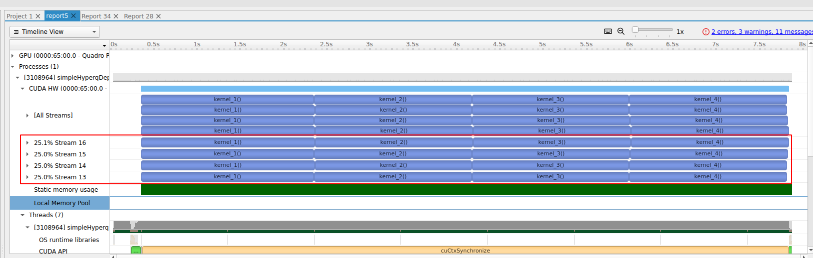
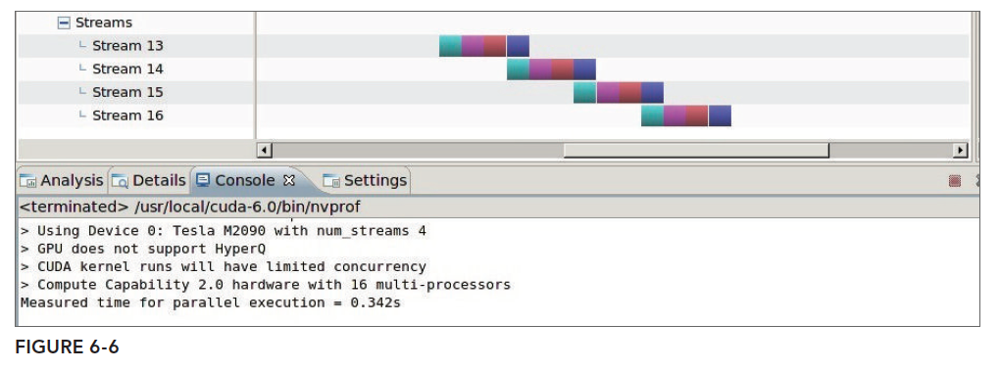
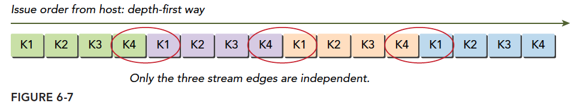
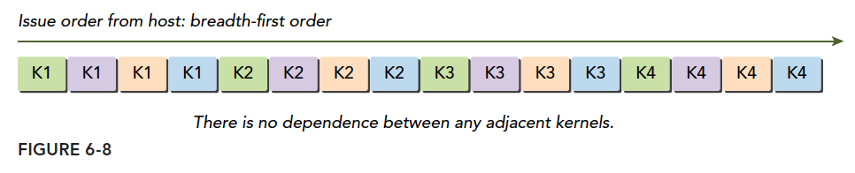
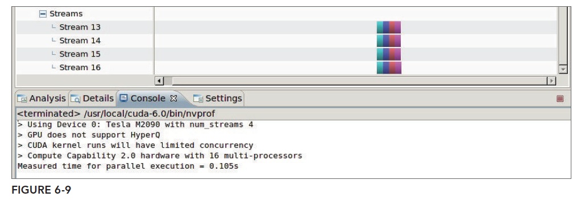
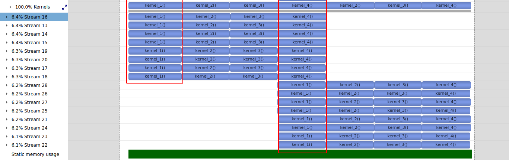
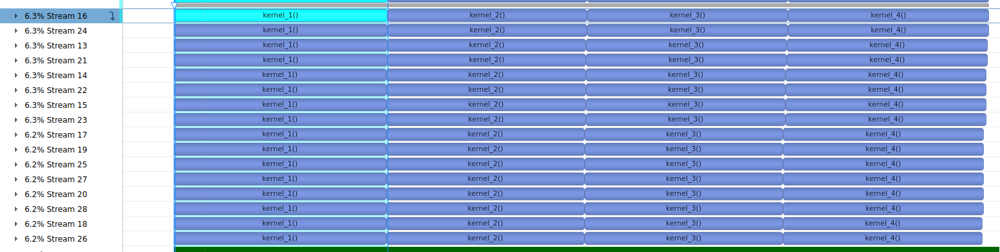
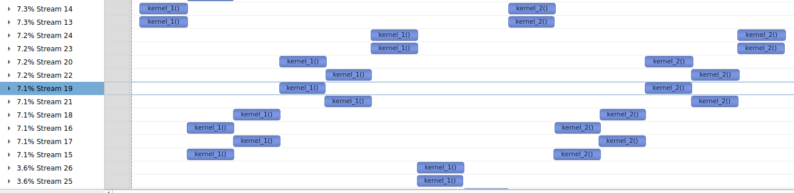

# 6.2 并发内核执行

这一节使用几个例子来说明上一节的流、事件、同步的概念。介绍并发内核的几个基本问题。

* 使用深度优先或广度优先方法的调度工作
* 调整硬件工作队列
* 在Kepler设备和Fermi设备上避免虚假的依赖关系
* 检查默认流的阻塞行为
* 在非默认流之间添加依赖关系
* 检查资源使用是如何影响并发的

## 6.2.1 非空流中的并发内核

第一个例子测试的是在**多个流中运行kernel的情况。其中每一个流都运行4个相同kernel函数**。查看不同的非空流中并发内核的情况。

本例子中使用了同一个核函数，并将其复制多份，并确保每个核函数的计算要消耗足够的时间，保证执行过程能够被性能分析工具准确的捕捉到。这里创建了四个相同的核函数如下

```C

__global__ void kernel_1()
{
    double sum = 0.0;

    for(int i = 0; i < N; i++)
    {
        sum = sum + tan(0.1) * tan(0.1);
    }
}

__global__ void kernel_2()
{
    double sum = 0.0;

    for(int i = 0; i < N; i++)
    {
        sum = sum + tan(0.1) * tan(0.1);
    }
}

__global__ void kernel_3()
{
    double sum = 0.0;

    for(int i = 0; i < N; i++)
    {
        sum = sum + tan(0.1) * tan(0.1);
    }
}

__global__ void kernel_4()
{
    double sum = 0.0;

    for(int i = 0; i < N; i++)
    {
        sum = sum + tan(0.1) * tan(0.1);
    }
}
```

创建流的代码如下，创建了n_streams=4个流。

```C
    //n_streams=4
	// Allocate and initialize an array of stream handles
    cudaStream_t *streams = (cudaStream_t *) malloc(n_streams * sizeof(
                                cudaStream_t));

    for (int i = 0 ; i < n_streams ; i++)
    {
        CHECK(cudaStreamCreate(&(streams[i])));
    }
```

每一个流运行相同的4个kernel如下

```C
    // run kernel with more threads
    if (bigcase == 1)
    {
        iblock = 512;
        isize = 1 << 12;
    }

    // set up execution configuration
    dim3 block (iblock);
    dim3 grid  (isize / iblock);
    printf("> grid %d block %d\n", grid.x, block.x);

    // creat events
    cudaEvent_t start, stop;
    CHECK(cudaEventCreate(&start));
    CHECK(cudaEventCreate(&stop));

    // record start event
    CHECK(cudaEventRecord(start, 0));

    // dispatch job with depth first ordering
    for (int i = 0; i < n_streams; i++)//注意这里是每一个stream运行相同的4个kernel
    {
        kernel_1<<<grid, block, 0, streams[i]>>>();
        kernel_2<<<grid, block, 0, streams[i]>>>();
        kernel_3<<<grid, block, 0, streams[i]>>>();
        kernel_4<<<grid, block, 0, streams[i]>>>();
    }

    // record stop event
    CHECK(cudaEventRecord(stop, 0));
    CHECK(cudaEventSynchronize(stop));

    // calculate elapsed time
    CHECK(cudaEventElapsedTime(&elapsed_time, start, stop));
    printf("Measured time for parallel execution = %.3fs\n",
           elapsed_time / 1000.0f);
```

我这里使用PC的nsightSystem来进行分析，结果如下图。

可以看出一共创建了4个stream，每一个流中运行了4个kernel。同时最重要的，不同的stream之间是并行的，例如4个stream都是同时运行kernel1的，其他同理。



## 6.2.2 Fermi GPU 上的虚假依赖关系

虚假依赖我们在上文中讲到过了，这种情况通常出现在只有在比较古老的Fermi架构上出现，原因是其只有一个硬件工作队列，由于我们现在很难找到Fermi架构的GPU了，所以，只能看看书上给出的nvvp结果图了：



虚假依赖的问题我们在[流和事件概述](https://face2ai.com/CUDA-F-6-1-流和事件概述/)已经描述了引起此问题的理论原因，这里就不再解释了。
如果你手头只有老机器，这种虚假依赖关系也是可以解决的，原理就是使用广度优先的方法，组织各任务的方式如下：

```

// dispatch job with breadth first way
for (int i = 0; i < n_streams; i++)
kernel_1<<<grid, block, 0, streams[i]>>>();
for (int i = 0; i < n_streams; i++)
kernel_2<<<grid, block, 0, streams[i]>>>();
for (int i = 0; i < n_streams; i++)
kernel_3<<<grid, block, 0, streams[i]>>>();
for (int i = 0; i < n_streams; i++)
kernel_4<<<grid, block, 0, streams[i]>>>();
```


这样逻辑图就不是:



而是



这样了，这就可以从抽象模型层面避免问题。
广度优先的nvvp结果是：



注意，以上结论都是我从书上原封不动弄下来的。


## 6.2.4 用环境变量调整流行为

Kepler设备支持的硬件工作队列的最大数量是32。然而，默认情况下并发硬件连接的数量被限制为8。由于每个连接都需要额外的内存和资源，所以设置默认的限制为8，减少了不需要全部32个工作队列的应用程序的资源消耗。可以使用CUDA_DEVICE_MAX_CONNECTIONS环境变量来调整并行硬件连接的数量，对于Kepler设备而言，其上限是32。

```shell
#For Bash or Bourne Shell:
export CUDA_DEVICE_MAX_CONNECTIONS=32
#For C-Shell:
setenv CUDA_DEVICE_MAX_CONNECTIONS 32
```

这个环境变量也可以直接在C主机程序中进行设定：

```C
setenv("CUDA_DEVICE_MAX_CONNECTIONS", "32", 1);
```

每个CUDA流都会被映射到单一的CUDA设备连接中。**如果流的数量超过了硬件连接的数量，多个流将共享一个连接。当多个流共享相同的硬件工作队列时，可能会产生虚假的依赖关系。**

我们将上面的程序stream数量修改为16个，重新运行如下

```C
#define NSTREAM 16
```

结果如下，可以看出同时只是运行了8个stream。并产生了虚假的依赖关系。（虚假依赖关系主要还是由共享硬件工作队列造成的。）



我们在程序中调整一下环境变量如下

```C
setenv("CUDA_DEVICE_MAX_CONNECTIONS", "32", 1);
```

重新编译运行结果如下，可以看出并行运行了16个stream。



## 6.2.5 GPU资源的并发限制

在之前的例子中，启动内核时只有一个线程，以避免并发时任何的硬件限制。因此，每个内核执行只需要少
量的设备计算资源。

```C
kernel_1<<<1, 1, 0, streams[i]>>>();
```

在实际应用中，内核启动时通常会创建多个线程。通常，会创建数百或数千个线程。有了这么多线程，可用的硬件资源可能会成为并发的主要限制因素，因为它们阻止启动符合条件的内核。

限制内核并发数量的最根本的还是GPU上面的资源，资源才是性能的极限，性能最高无非是在不考虑算法进化的前提下，资源利用率最高的结果。当每个内核的线程数增加的时候，内核级别的并行数量就会下降，比如，我们把

```c
dim3 block(1);
dim3 grid(1);
```

升级到

```c
dim3 block(16,32);
dim3 grid(32);
```

```C
#define NSTREAM 16
```

运行结果如下，只能并行两个stream了。。。



## 6.2.6 默认流的阻塞行为

为了说明默认流在非空流中是如何阻塞操作的，在上面的simpleHyperqDepth.cu中，将深度优先调度循环改为在默认流中调用kernel_3。也就是kernel_3使用默认流进行调度。如下

```C
// dispatch job with depth first ordering
for (int i = 0; i < n_streams; i++) {
kernel_1<<<grid, block, 0, streams[i]>>>();
kernel_2<<<grid, block, 0, streams[i]>>>();
kernel_3<<<grid, block>>>();
kernel_4<<<grid, block, 0, streams[i]>>>();
}
```

为了方便查看，还是用4个stream，资源最少的设定

```
kernel_1<<<1, 1, 0, streams[i]>>>();
#define NSTREAM 4
```

因为第三个内核在默认流中被启动，所以在非空流上所有之后的操作都会被阻塞，直到默认流中的操作完成。如下图在kernel3运行的时候


这里还有一个细节。如果在编译的时候添加编译选项`--default-stream=per-thread`如下。那么结果就又不一样了，kernel并不是在默认空流中执行的，也就不会阻塞其他的stream.参考[4.2.6. Options for Steering CUDA Compilation](https://docs.nvidia.com/cuda/cuda-compiler-driver-nvcc/index.html#options-for-steering-cuda-compilation)

```cmake
set(CMAKE_CUDA_FLAGS "-g -G -gencode arch=compute_61,code=sm_61 -lineinfo --default-stream=per-thread")
```

```tex
 4.2.6.1. --default-stream {legacy|null|per-thread} (-default-stream)

Specify the stream that CUDA commands from the compiled program will be sent to by default.

Allowed Values

legacy

    The CUDA legacy stream (per context, implicitly synchronizes with other streams)

per-thread

    Normal CUDA stream (per thread, does not implicitly synchronize with other streams)

null

    Deprecated alias for legacy

```


## 6.2.7 创建流间依赖关系

在理想情况下，流之间不应该有非计划之内的依赖关系（即虚假的依赖关系）。然而，在复杂的应用程序中，**引入流间依赖关系是很有用的，它可以在一个流中阻塞操作直到另一个流中的操作完成。事件可以用来添加流间依赖关系**。

假如我们想让一个流中的工作在其他所有流中的工作都完成后才开始执行，那么就可以使用事件来创建流之间的依赖关系。首先，将标志设置为cudaEventDisableTiming，创建同步事件。注意上一节提到的**只有事件所在流中其之前的操作都完成后才能触发事件完成**，类似的流同步了。

```C
cudaEvent_t * event=(cudaEvent_t *)malloc(n_stream*sizeof(cudaEvent_t));
for(int i=0;i<n_stream;i++)
{
    cudaEventCreateWithFlag(&event[i],cudaEventDisableTiming);
}
```

接下来，使用cudaEventRecord函数，在每个流完成时记录不同的事件。然后，使用cudaStreamWaitEvent使最后一个流（即streams[n_streams-1]）等待其他所有流：注意这里是最后一个stream等待所有其他stream的event。

```C
for(int i=0;i<n_stream;i++)
{
    kernel_1<<<grid,block,0,stream[i]>>>();
    kernel_2<<<grid,block,0,stream[i]>>>();
    kernel_3<<<grid,block,0,stream[i]>>>();
    kernel_4<<<grid,block,0,stream[i]>>>();
    cudaEventRecord(event[i],stream[i]);
    cudaStreamWaitEvent(stream[n_stream-1],event[i],0);
}
```

运行结果如下。可以看出最后一个stream只有在其他三个stream运行结束后才开始运行。

