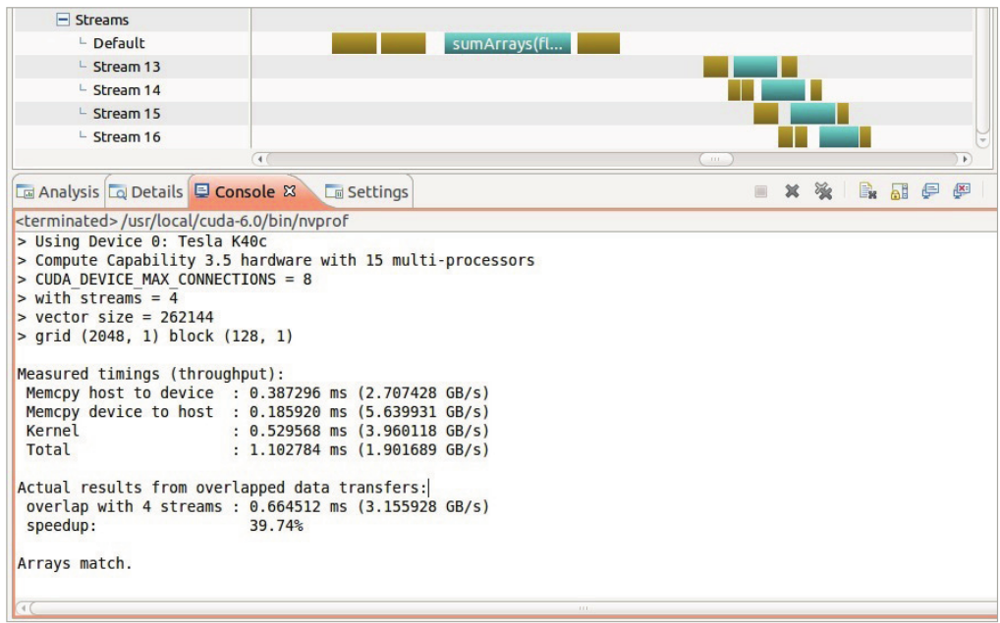
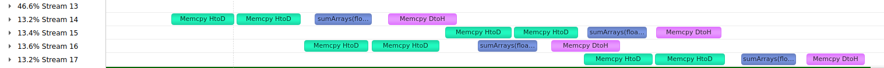
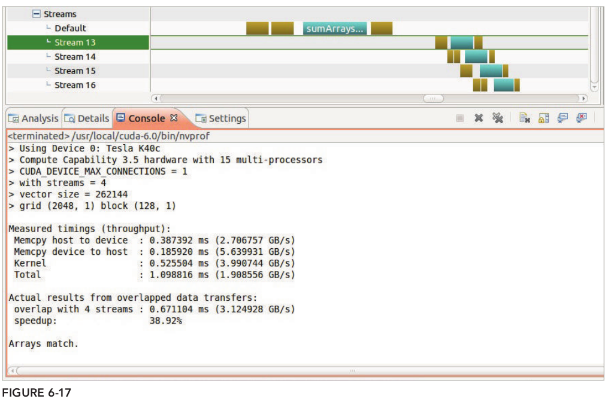
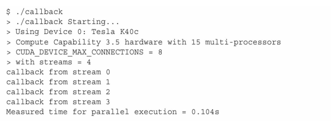

# 6.3 重叠内核执行和数据传输

在前一节中，已经介绍了如何在多个流中并发执行多个内核。在本节中，将学习如何并发执行内核和数据传输。

Fermi GPU和Kepler GPU有**两个复制引擎队列**：一个用于将数据传输到设备，另一个用于从设备中将数据提取出来。**因此，最多可以重叠两个数据传输，并且只有当它们的方向不同并且被调度到不同的流时才能这样做，否则，所有的数据传输都将是串行的。**在决定如何使用内核计算最佳地重叠数据传输时，记住这一点是很重要的。

## 6.3.1 使用深度优先调度重叠

使用向量加法来进行测试。

实现向量加法的CUDA程序，其基本结构包含3个主要步骤：

1. 将两个输入向量从主机复制到设备中
2. 执行向量加法运算
3. 将单一的输出向量从设备返回主机中

因为一个内核的执行肯定看不出重叠的部分，因此将向量加发的输入数据分为几个子集，也就是为了使用多次上述1、2、3步骤，方便分析。完整的代码如下：

```C
#include "../common/common.h"
#include <stdio.h>
#include <cuda_runtime.h>

/*
 * This example demonstrates overlapping computation and communication by
 * partitioning a data set and asynchronously launching the memory copies and
 * kernels for each subset. Launching all transfers and kernels for a given
 * subset in the same CUDA stream ensures that computation on the device is not
 * started until the necessary data has been transferred. However, because the
 * work of each subset is independent of all other subsets, the communication
 * and computation of different subsets will overlap.
 *
 * This example launches copies and kernels in depth-first order.
 */


#define NSTREAM 4
#define BDIM 128

void initialData(float *ip, int size)
{
    int i;

    for(i = 0; i < size; i++)
    {
        ip[i] = (float)(rand() & 0xFF) / 10.0f;
    }
}

void sumArraysOnHost(float *A, float *B, float *C, const int N)
{
    for (int idx = 0; idx < N; idx++)
        C[idx] = A[idx] + B[idx];
}

__global__ void sumArrays(float *A, float *B, float *C, const int N)
{
    int idx = blockIdx.x * blockDim.x + threadIdx.x;

    if (idx < N)
    {
        // for (int i = 0; i < N; ++i)
        // {
        //     // C[idx] = A[idx] + B[idx];
        // }
    }
}

void checkResult(float *hostRef, float *gpuRef, const int N)
{
    double epsilon = 1.0E-8;
    bool match = 1;

    for (int i = 0; i < N; i++)
    {
        if (abs(hostRef[i] - gpuRef[i]) > epsilon)
        {
            match = 0;
            printf("Arrays do not match!\n");
            printf("host %5.2f gpu %5.2f at %d\n", hostRef[i], gpuRef[i], i);
            break;
        }
    }

    if (match) printf("Arrays match.\n\n");
}

int main(int argc, char **argv)
{
    printf("> %s Starting...\n", argv[0]);

    int dev = 0;
    cudaDeviceProp deviceProp;
    CHECK(cudaGetDeviceProperties(&deviceProp, dev));
    printf("> Using Device %d: %s\n", dev, deviceProp.name);
    CHECK(cudaSetDevice(dev));

    // check if device support hyper-q
    if (deviceProp.major < 3 || (deviceProp.major == 3 && deviceProp.minor < 5))
    {
        if (deviceProp.concurrentKernels == 0)
        {
            printf("> GPU does not support concurrent kernel execution (SM 3.5 "
                    "or higher required)\n");
            printf("> CUDA kernel runs will be serialized\n");
        }
        else
        {
            printf("> GPU does not support HyperQ\n");
            printf("> CUDA kernel runs will have limited concurrency\n");
        }
    }

    printf("> Compute Capability %d.%d hardware with %d multi-processors\n",
           deviceProp.major, deviceProp.minor, deviceProp.multiProcessorCount);

    // set up max connectioin
    char * iname = "CUDA_DEVICE_MAX_CONNECTIONS";
    setenv (iname, "1", 1);
    char *ivalue =  getenv (iname);
    printf ("> %s = %s\n", iname, ivalue);
    printf ("> with streams = %d\n", NSTREAM);

    // set up data size of vectors
    int nElem = 1 << 18;
    printf("> vector size = %d\n", nElem);
    size_t nBytes = nElem * sizeof(float);

    // malloc pinned host memory for async memcpy
    float *h_A, *h_B, *hostRef, *gpuRef;
    CHECK(cudaHostAlloc((void**)&h_A, nBytes, cudaHostAllocDefault));
    CHECK(cudaHostAlloc((void**)&h_B, nBytes, cudaHostAllocDefault));
    CHECK(cudaHostAlloc((void**)&gpuRef, nBytes, cudaHostAllocDefault));
    CHECK(cudaHostAlloc((void**)&hostRef, nBytes, cudaHostAllocDefault));

    // initialize data at host side
    initialData(h_A, nElem);
    initialData(h_B, nElem);
    memset(hostRef, 0, nBytes);
    memset(gpuRef,  0, nBytes);

    // add vector at host side for result checks
    sumArraysOnHost(h_A, h_B, hostRef, nElem);

    // malloc device global memory
    float *d_A, *d_B, *d_C;
    CHECK(cudaMalloc((float**)&d_A, nBytes));
    CHECK(cudaMalloc((float**)&d_B, nBytes));
    CHECK(cudaMalloc((float**)&d_C, nBytes));

    cudaEvent_t start, stop;
    CHECK(cudaEventCreate(&start));
    CHECK(cudaEventCreate(&stop));

    // invoke kernel at host side
    dim3 block (BDIM);
    dim3 grid  ((nElem + block.x - 1) / block.x);
    printf("> grid (%d, %d) block (%d, %d)\n", grid.x, grid.y, block.x,
            block.y);

    // sequential operation
    CHECK(cudaEventRecord(start, 0));
    CHECK(cudaMemcpy(d_A, h_A, nBytes, cudaMemcpyHostToDevice));
    CHECK(cudaMemcpy(d_B, h_B, nBytes, cudaMemcpyHostToDevice));
    CHECK(cudaEventRecord(stop, 0));
    CHECK(cudaEventSynchronize(stop));
    float memcpy_h2d_time;
    CHECK(cudaEventElapsedTime(&memcpy_h2d_time, start, stop));

    CHECK(cudaEventRecord(start, 0));
    sumArrays<<<grid, block>>>(d_A, d_B, d_C, nElem);
    CHECK(cudaEventRecord(stop, 0));
    CHECK(cudaEventSynchronize(stop));
    float kernel_time;
    CHECK(cudaEventElapsedTime(&kernel_time, start, stop));

    CHECK(cudaEventRecord(start, 0));
    CHECK(cudaMemcpy(gpuRef, d_C, nBytes, cudaMemcpyDeviceToHost));
    CHECK(cudaEventRecord(stop, 0));
    CHECK(cudaEventSynchronize(stop));
    float memcpy_d2h_time;
    CHECK(cudaEventElapsedTime(&memcpy_d2h_time, start, stop));
    float itotal = kernel_time + memcpy_h2d_time + memcpy_d2h_time;

    printf("\n");
    printf("Measured timings (throughput):\n");
    printf(" Memcpy host to device\t: %f ms (%f GB/s)\n",
           memcpy_h2d_time, (nBytes * 1e-6) / memcpy_h2d_time);
    printf(" Memcpy device to host\t: %f ms (%f GB/s)\n",
           memcpy_d2h_time, (nBytes * 1e-6) / memcpy_d2h_time);
    printf(" Kernel\t\t\t: %f ms (%f GB/s)\n",
           kernel_time, (nBytes * 2e-6) / kernel_time);
    printf(" Total\t\t\t: %f ms (%f GB/s)\n",
           itotal, (nBytes * 2e-6) / itotal);

    // grid parallel operation
    int iElem = nElem / NSTREAM;
    size_t iBytes = iElem * sizeof(float);
    grid.x = (iElem + block.x - 1) / block.x;

    cudaStream_t stream[NSTREAM];

    for (int i = 0; i < NSTREAM; ++i)
    {
        CHECK(cudaStreamCreate(&stream[i]));
    }

    CHECK(cudaEventRecord(start, 0));

    // initiate all work on the device asynchronously in depth-first order
    for (int i = 0; i < NSTREAM; ++i)
    {
        int ioffset = i * iElem;
        CHECK(cudaMemcpyAsync(&d_A[ioffset], &h_A[ioffset], iBytes,
                              cudaMemcpyHostToDevice, stream[i]));
        CHECK(cudaMemcpyAsync(&d_B[ioffset], &h_B[ioffset], iBytes,
                              cudaMemcpyHostToDevice, stream[i]));
        sumArrays<<<grid, block, 0, stream[i]>>>(&d_A[ioffset], &d_B[ioffset],
                &d_C[ioffset], iElem);
        CHECK(cudaMemcpyAsync(&gpuRef[ioffset], &d_C[ioffset], iBytes,
                              cudaMemcpyDeviceToHost, stream[i]));
    }

    CHECK(cudaEventRecord(stop, 0));
    CHECK(cudaEventSynchronize(stop));
    float execution_time;
    CHECK(cudaEventElapsedTime(&execution_time, start, stop));

    printf("\n");
    printf("Actual results from overlapped data transfers:\n");
    printf(" overlap with %d streams : %f ms (%f GB/s)\n", NSTREAM,
           execution_time, (nBytes * 2e-6) / execution_time );
    printf(" speedup                : %f \n",
           ((itotal - execution_time) * 100.0f) / itotal);

    // check kernel error
    CHECK(cudaGetLastError());

    // check device results
    checkResult(hostRef, gpuRef, nElem);

    // free device global memory
    CHECK(cudaFree(d_A));
    CHECK(cudaFree(d_B));
    CHECK(cudaFree(d_C));

    // free host memory
    CHECK(cudaFreeHost(h_A));
    CHECK(cudaFreeHost(h_B));
    CHECK(cudaFreeHost(hostRef));
    CHECK(cudaFreeHost(gpuRef));

    // destroy events
    CHECK(cudaEventDestroy(start));
    CHECK(cudaEventDestroy(stop));

    // destroy streams
    for (int i = 0; i < NSTREAM; ++i)
    {
        CHECK(cudaStreamDestroy(stream[i]));
    }

    CHECK(cudaDeviceReset());
    return(0);
}

```

下图是书中的测试情况显示了以下的三种重叠：

1. 不同流中内核的相互重叠
2. 内核和其他流中数据传输重叠
3. 不同流并且是不同方向上数据传输重叠

还显示了以下两种阻塞：

1. 内核被同一个流中先前数据传输阻塞
2. 从主机到设备的数据传输被同一方向上的先前数据传输阻塞



我自己机器上运行的情况如下：


上图中

* stream13 是数据没有划分的时候运算的图示
* stream14-17是将数据划分为4部分计算的图示

可以看出

* stream13没有划分数据的时候时间为390us，划分为4部分数据进行计算后，因为有数据传输和内核计算的重叠，因此时间缩短为260us。
* 在stream14-17中可以看出内核的执行和数据传输之间的重叠（内核执行的重叠我这里运行时间短没看有重叠的区域）



## 6.3.2 使用广度优先调度重叠

同样的，我们看完深度优先之后看一下广度优先（新的GPU调度有优化，因此性能和上面的深度优先一致）

```C
for(int i=0;i<N_SEGMENT;i++)
{
    int ioffset=i*iElem;
    CHECK(cudaMemcpyAsync(&a_d[ioffset],&a_h[ioffset],nByte/N_SEGMENT,cudaMemcpyHostToDevice,stream[i]));
    CHECK(cudaMemcpyAsync(&b_d[ioffset],&b_h[ioffset],nByte/N_SEGMENT,cudaMemcpyHostToDevice,stream[i]));
}
for(int i=0;i<N_SEGMENT;i++)
{
    int ioffset=i*iElem;
    sumArraysGPU<<<grid,block,0,stream[i]>>>(&a_d[ioffset],&b_d[ioffset],&res_d[ioffset],iElem);
}
for(int i=0;i<N_SEGMENT;i++)
{
    int ioffset=i*iElem;
    CHECK(cudaMemcpyAsync(&res_from_gpu_h[ioffset],&res_d[ioffset],nByte/N_SEGMENT,cudaMemcpyDeviceToHost,stream[i]));
}
```

在Fermi以后架构的设备，不太需要关注工作调度顺序，因为多个工作队列足以优化执行过程，而Fermi架构则需要关注一下。



## 6.4 重叠GPU和CPU执行

相对而言，实现GPU和CPU执行重叠是比较简单的，因为所有的内核启动在默认情况下都是异步的。因此，只需简单地启动内核，并且立即在主机线程上实现有效操作，就能自动重叠GPU和CPU执行。

## 6.5 流回调

流回调是另一种可以到CUDA流中排列等待的操作。一旦流回调之前所有的流操作全部完成，被流回调指定的主机端函数就会被CUDA运行时所调用。此函数由应用程序提供，并允许任意主机端逻辑插入到CUDA流中。**流回调是另一种CPU和GPU同步机制**

在回调函数中，需要遵守下面的规则

- 回调函数中不可以调用CUDA的API
- 不可以执行同步

流函数有特殊的参数规格，必须写成下面形式参数的函数;

```C
void CUDART_CB my_callback(cudaStream_t stream, cudaError_t status, void *data) {
    printf("callback from stream %d\n", *((int *)data));
}
```

然后使用：

```C
cudaError_t cudaStreamAddCallback(cudaStream_t stream,cudaStreamCallback_t callback, void *userData, unsigned int flags);
```

加入流中。

完整的代码如下：

```C
#include "../common/common.h"
#include <stdio.h>
#include <cuda_runtime.h>

/*
 * An example of using CUDA callbacks to trigger work on the host after the
 * completion of asynchronous work on the device. In this example, n_streams
 * CUDA streams are created and 4 kernels are launched asynchronously in each.
 * Then, a callback is added at the completion of those asynchronous kernels
 * that prints diagnostic information.
 */

#define N 100000
#define NSTREAM 4

void CUDART_CB my_callback(cudaStream_t stream, cudaError_t status, void *data)
{
    printf("callback from stream %d\n", *((int *)data));
}

__global__ void kernel_1()
{
    double sum = 0.0;

    for(int i = 0; i < N; i++)
    {
        sum = sum + tan(0.1) * tan(0.1);
    }
}

__global__ void kernel_2()
{
    double sum = 0.0;

    for(int i = 0; i < N; i++)
    {
        sum = sum + tan(0.1) * tan(0.1);
    }
}

__global__ void kernel_3()
{
    double sum = 0.0;

    for(int i = 0; i < N; i++)
    {
        sum = sum + tan(0.1) * tan(0.1);
    }
}

__global__ void kernel_4()
{
    double sum = 0.0;

    for(int i = 0; i < N; i++)
    {
        sum = sum + tan(0.1) * tan(0.1);
    }
}

int main(int argc, char **argv)
{
    int n_streams = NSTREAM;

    if (argc > 1) n_streams = atoi(argv[1]);

    int dev = 0;
    cudaDeviceProp deviceProp;
    CHECK(cudaGetDeviceProperties(&deviceProp, dev));
    printf("> %s Starting...\n", argv[0]);
    printf("> Using Device %d: %s\n", dev, deviceProp.name);
    CHECK(cudaSetDevice(dev));

    // check if device support hyper-q
    if (deviceProp.major < 3 || (deviceProp.major == 3 && deviceProp.minor < 5))
    {
        if (deviceProp.concurrentKernels == 0)
        {
            printf("> GPU does not support concurrent kernel execution (SM 3.5 "
                   "or higher required)\n");
            printf("> CUDA kernel runs will be serialized\n");
        }
        else
        {
            printf("> GPU does not support HyperQ\n");
            printf("> CUDA kernel runs will have limited concurrency\n");
        }
    }

    printf("> Compute Capability %d.%d hardware with %d multi-processors\n",
           deviceProp.major, deviceProp.minor, deviceProp.multiProcessorCount);

    // set up max connectioin
    char * iname = "CUDA_DEVICE_MAX_CONNECTIONS";
    setenv (iname, "8", 1);
    char *ivalue =  getenv (iname);
    printf ("> %s = %s\n", iname, ivalue);
    printf ("> with streams = %d\n", n_streams);

    // Allocate and initialize an array of stream handles
    cudaStream_t *streams = (cudaStream_t *) malloc(n_streams * sizeof(
                                cudaStream_t));

    for (int i = 0 ; i < n_streams ; i++)
    {
        CHECK(cudaStreamCreate(&(streams[i])));
    }

    dim3 block (1);
    dim3 grid  (1);
    cudaEvent_t start_event, stop_event;
    CHECK(cudaEventCreate(&start_event));
    CHECK(cudaEventCreate(&stop_event));

    int stream_ids[n_streams];

    CHECK(cudaEventRecord(start_event, 0));

    for (int i = 0; i < n_streams; i++)
    {
        stream_ids[i] = i;
        kernel_1<<<grid, block, 0, streams[i]>>>();
        kernel_2<<<grid, block, 0, streams[i]>>>();
        kernel_3<<<grid, block, 0, streams[i]>>>();
        kernel_4<<<grid, block, 0, streams[i]>>>();
        CHECK(cudaStreamAddCallback(streams[i], my_callback,
                    (void *)(stream_ids + i), 0));
    }

    CHECK(cudaEventRecord(stop_event, 0));
    CHECK(cudaEventSynchronize(stop_event));

    float elapsed_time;
    CHECK(cudaEventElapsedTime(&elapsed_time, start_event, stop_event));
    printf("Measured time for parallel execution = %.3fs\n",
           elapsed_time / 1000.0f);

    // release all stream
    for (int i = 0 ; i < n_streams ; i++)
    {
        CHECK(cudaStreamDestroy(streams[i]));
    }

    free(streams);

    /*
     * cudaDeviceReset must be called before exiting in order for profiling and
     * tracing tools such as Nsight and Visual Profiler to show complete traces.
     */
    CHECK(cudaDeviceReset());

    return 0;
}

```

运行结果如下

