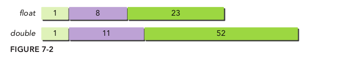
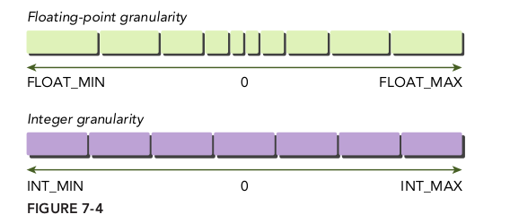
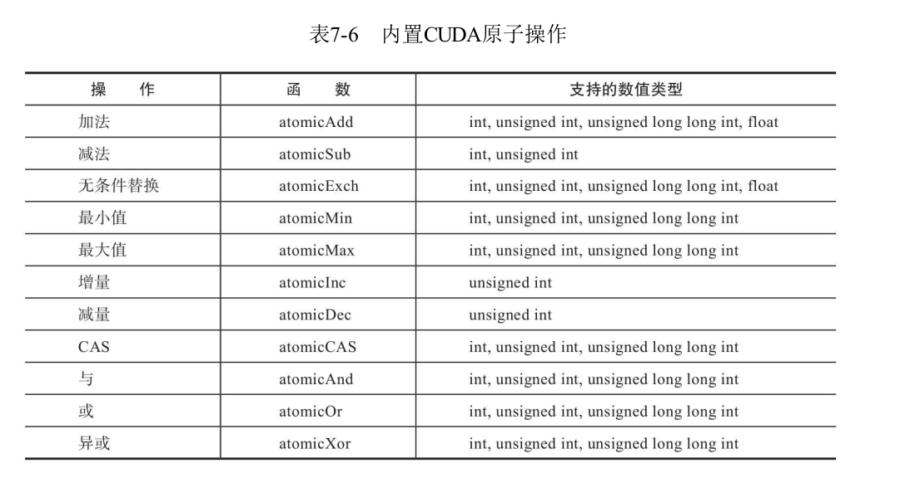

# 前言

这一章讲的内容我暂时没有什么使用到，因此没有什么理解，除了原子操作。因此先给出一个看到的重点的大纲，需要的时候再补充吧。

## 7.1 cuda指令概述

### 7.1.1 浮点指令

自从浮点运算采用IEEE——754标准后，所有的主流处理器厂商都使用这一标准，包括NVIDIA。这个标准规定将二进制浮点数据编码成3段：符号段（sign），一个比特位；指数段（exponent），多个比特位；以及尾数或分数段（fraction），多个比特位。如图


为了确保跨平台计算的一致性，IEEE——754定义了32位和64位浮点格式，它们分别对应C语言数据类型的float和double，它们的位长度不同，如图7-2所示。
给定一个32位的浮点变量，其中标志位s占1位，指数e为8位，尾数v为23位，这个浮点变量可以表示成图7-3所示的格式



浮点编程中需要考虑的另一个方面是浮点数的粒度问题。像上面所讨论的，浮点数的粒度比整数来说要好。然而浮点数只能在离散的区间间隔内存储数据。随着浮点数值离零越来越远（在正负两个方向上），表示数值的区间也会随之增大（如图7-4所示）。



### 7.1.2 内部函数和标准函数

除了单精度和双精度操作的区别，CUDA还将所有算数函数分成内部函数和标准函数。标准函数用于支持可对主机和设备进行访问并标准化主机和设备的操作。标准函数包含来自于C标准数学库的数学运算，如sqrt、exp和sin。单指令运算如乘法和加法，也包含在标准函数中。

CUDA内置函数只能对设备代码进行访问。在编程中，如果一个函数是内部函数或是内置函数，那么在编译时对它的行为会有特殊响应，从而产生更积极的优化和更专业化的指令生成。

在CUDA中，许多内部函数与标准函数是有关联的，这意味着存在与内部函数功能相同的标准函数。举个例子，标准函数中的双精度浮点平方根函数也就是sqrt。有相同功能的内部函数是`__dsqrt_rn`。还有执行单精度浮点除法运算的内部函数：`__fdividef`。
内部函数分解成了比与它们等价的标准函数更少的指令。**这会导致内部函数比等价的标准函数更快，但数值精确度却更低**。

### 7.1.3 原子操作指令

因为原子操作指令阻止了多个线程之间互相干扰，它们可以对跨线程共享数据进行“读-改-写”操作。

与标准函数和内部函数类似，每个原子函数都能实现一个基本的数学运算，如加法、乘法或减法。不同于目前介绍过的其他指令类型，当原子操作指令在两个竞争线程共享的内存空间进行操作时，会有一个定义好的行为。

核函数来帮助理解这个概念：

```C
__global__ void incr(int *ptr) {
int temp = *ptr;
temp = temp + 1;
*ptr = temp;
}
```

如果启用一个含32个线程的线程块来运行这个核函数，那么会得到什么样的输出？你可能会说对于32个线程，每个线程都会增加1。事实上，结果是不确定的。这是因为不止一个线程对同一个内存位置进行写操作，这叫作数据竞争，或者称为对内存的不安全访问。

使用原子操作指令可以避免这种事情的发生。原子操作指令是通过CUDA API访问的函数。例如：

```C
int atomicAdd(int *M, int V);
```

修改上面的和函数为

```C
__global__ void incr(__global__ int *ptr) {
int temp = atomicAdd(ptr, 1);
}
```

如果启动32个线程，存储在*ptr所指位置中的值应该是32。

## 7.2 程序优化指令

### 7.2.1 单精度与双精度的比较

### 7.2.2 标准函数与内部函数的比较

### 7.2.3 了解原子指令



### 7.2.4 综合范例