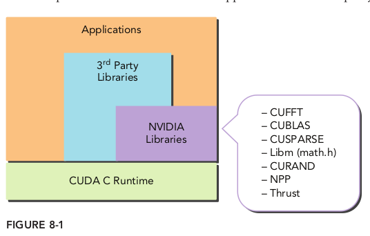
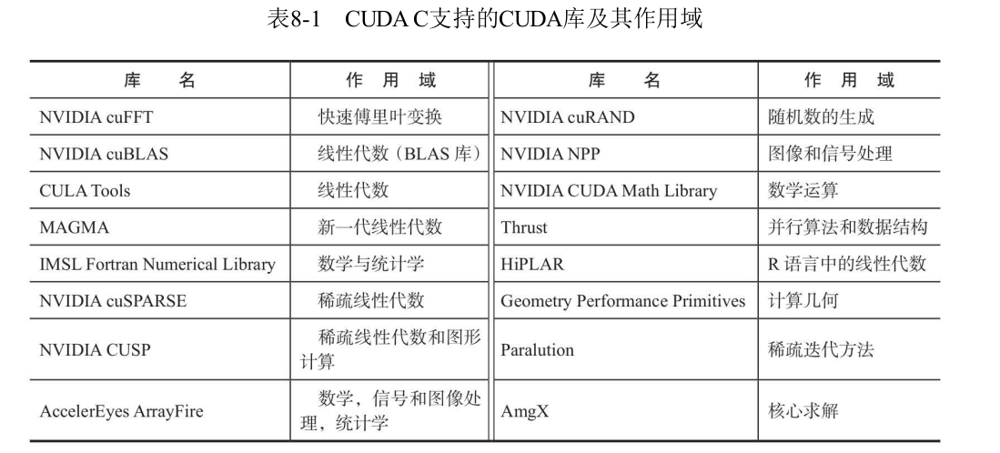

# 前言

和上一节一样，我没有使用过CUDA库，因此这里先占位，后期再补充。

# 8.1 CUDA库概述

CUDA库和系统库或用户自定义库没有什么不同，它们是一组在头文件中说明其原型的函数定义的集合。CUDA库的特殊性在于，其中实现的所有计算均使用了GPU加速，而不是CPU。

### 8.1.1 CUDA库支持的作用域

可以在[官网](https://docs.nvidia.com/cuda/archive/11.4.4/index.html)查到目前的库和用法

