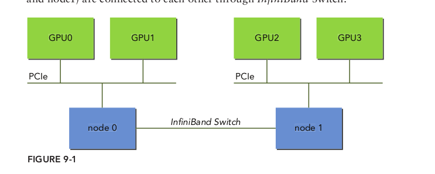
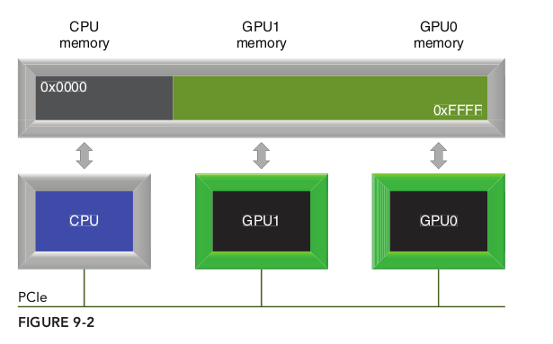

# 前言

我暂时还没有使用到多个GPU，因此先占位吧，等后面有机会再补充深入，这里只是一个大概的描述。

## 9.1 从一个GPU到多个GPU

在多GPU系统里有两种连接方式：

* 多GPU通过单个节点连接到PCIe总线上
* 多GPU连接到集群中的网络交换机上



### 9.1.1 在多GPU上执行

单个主机线程可以管理多个设备。一般来说，第一步是确定系统内可用的使能CUDA设备的数量，使用如下函数获得：

```C
cudaError_t cudaGetDeviceCount(int* count);
```

在利用与多GPU一起工作的CUDA应用程序时，必须显式地指定哪个GPU是当前所有CUDA运算的目标。使用以下函数设置当前设备：

```C
cudaError_t cudaSetDevice(int id);
```

一旦选定了当前设备，所有的CUDA运算将被应用到那个设备上：

下面的代码准确展示了如何执行内核和在单一的主机线程中进行内存拷贝，使用循环遍历设备：

```c
for (int i = 0; i < ngpus; i++) {
// set the current device
cudaSetDevice(i);
// execute kernel on current device
kernel<<<grid, block>>>(...);
// asynchronously transfer data between the host and current device
cudaMemcpyAsync(...);
}
```

### 9.1.2 点对点通信

在计算能力为2.0或以上的设备中，在64位应用程序上执行的内核，可以直接访问任何GPU的全局内存，这些GPU连接到同一个PCIe根节点上。如果想这样操作，必须使用CUDA点对点（P2P）API来实现设备间的直接通信。点对点通信需要CUDA 4.0或更高版本，相应的GPU驱动器，以及一个具有两个或两个以上连接到同一个PCIe根节点上的Fermi或Kepler GPU系统。有两个由CUDA P2P API支持的模式，它们允许GPU之间直接通信：

* 点对点访问：在CUDA内核和GPU间直接加载和存储地
* 点对点传输：在GPU间直接复制数据

在一个系统内，如果两个GPU连接到不同的PCIe根节点上，那么不允许直接进行点对点访问，并且CUDA P2P API将会通知你。仍然可以使用CUDA P2P API在这些设备之间进行点对点传输，但是驱动器将通过主机内存透明地传输数据，而不是通过PCIe总线直接传输数据。

#### 9.1.2.1 启用点到点访问

点对点访问允许各GPU连接到同一个PCIe根节点上，使其直接引用存储在其他GPU设备内存上的数据。对于透明的内核，引用的数据将通过PCIe总线传输到请求的线程上。
因为不是所有的GPU都支持点对点访问，所以需要使用下述函数显式地检查设备是否支持P2P

```C
cudaError_t cudaDeviceCanAccessPeer(int* canAccessPeer, int device,int peerDevice);
```

在两个设备间，必须用以下函数显式地启用点对点内存访问：

```C
cudaError_t cudaDeviceEnablePeerAccess(int peerDevice, unsigned int flag);
```

这个函数允许从当前设备到peerDevice进行点对点访问。flag参数被保留以备将来使用，目前必须将其设置为0。一旦成功，该对等设备的内存将立即由当前设备进行访问。

这个函数授权的访问是单向的，即这个函数允许从当前设备到peerDevice的访问，但不允许从peerDevice到当前设备的访问。如果希望对等设备能直接访问当前设备的内存，则需要另一个方向单独的匹配调用。

点对点访问保持启用状态，直到它被以下函数显式地禁用：

```C
cudaError_t cudaDeviceDisablePeerAccess(int peerDevice);
```

#### 9.1.2.2 点对点内存复制

两个设备之间启用对等访问之后，使用下面的函数，可以异步地复制设备上的数据：

```C
cudaError_t cudaMemcpyPeerAsync(void* dst, int dstDev, void* src, int srcDev,size_t nBytes, cudaStream_t stream);
```

这个函数将数据从设备的srcDev设备内存传输到设备dstDev的设备内存中。函数cudaMemcpyPeerAsync对于主机和所有其他设备来说是异步的。如果srcDev和dstDev共享相同的PCIe根节点，那么数据传输是沿着PCIe最短路径执行的，不需要通过主机内存中转。

### 9.1.3 多GPU间的同步

多GPU应用程序中使用流和事件的典型工作流程如下所示：

1. 选择这个应用程序将使用的GPU集。
2. 为每个设备创建流和事件。
3. 为每个设备分配设备资源（如设备内存）。
4. 通过流在每个GPU上启动任务（例如，数据传输或内核执行）。
5. 使用流和事件来查询和等待任务完成。
6. 清空所有设备的资源。

只有与该流相关联的设备是当前设备时，在流中才能启动内核。只有与该流相关联的
设备是当前设备时，才可以在流中记录事件。
任何时间都可以在任何流中进行内存拷贝，无论该流与什么设备相关联或当前设备是
什么。**即使流或事件与当前设备不相关，也可以查询或同步它们**。

## 9.2 多GPU间细分计算

在向量加法的例子中，元素的总输入大小为16M，所有设备平分，给每个设备isize个
元素：

### 9.2.1 在多设备上分配内存

现在，可以分配主机和设备内存了，为每个设备创建CUDA流，代码如下：

```C
// allocat device emory
    float **d_A = (float **)malloc(sizeof(float *) * ngpus);
    float **d_B = (float **)malloc(sizeof(float *) * ngpus);
    float **d_C = (float **)malloc(sizeof(float *) * ngpus);

    float **h_A = (float **)malloc(sizeof(float *) * ngpus);
    float **h_B = (float **)malloc(sizeof(float *) * ngpus);
    float **hostRef = (float **)malloc(sizeof(float *) * ngpus);
    float **gpuRef = (float **)malloc(sizeof(float *) * ngpus);
    cudaStream_t *stream = (cudaStream_t *)malloc(sizeof(cudaStream_t) * ngpus);

    for (int i = 0; i < ngpus; i++)
    {
        // set current device
        CHECK(cudaSetDevice(i));

        // allocate device memory
        CHECK(cudaMalloc((void **) &d_A[i], iBytes));
        CHECK(cudaMalloc((void **) &d_B[i], iBytes));
        CHECK(cudaMalloc((void **) &d_C[i], iBytes));

        // allocate page locked host memory for asynchronous data transfer
        CHECK(cudaMallocHost((void **) &h_A[i],     iBytes));
        CHECK(cudaMallocHost((void **) &h_B[i],     iBytes));
        CHECK(cudaMallocHost((void **) &hostRef[i], iBytes));
        CHECK(cudaMallocHost((void **) &gpuRef[i],  iBytes));

        // create streams for timing and synchronizing
        CHECK(cudaStreamCreate(&stream[i]));
    }
```

### 9.2.2 单主机线程分配工作

这个循环遍历多个GPU，为设备异步地复制输入数组。然后在相同的流中操作iSize个
数据元素以便启动内核。最后，设备发出的异步拷贝命令，把结果从内核返回到主机

```C
// distributing the workload across multiple devices
    for (int i = 0; i < ngpus; i++)
    {
        CHECK(cudaSetDevice(i));

        CHECK(cudaMemcpyAsync(d_A[i], h_A[i], iBytes, cudaMemcpyHostToDevice,
                              stream[i]));
        CHECK(cudaMemcpyAsync(d_B[i], h_B[i], iBytes, cudaMemcpyHostToDevice,
                              stream[i]));

        iKernel<<<grid, block, 0, stream[i]>>>(d_A[i], d_B[i], d_C[i], iSize);

        CHECK(cudaMemcpyAsync(gpuRef[i], d_C[i], iBytes, cudaMemcpyDeviceToHost,
                              stream[i]));
    }

    // synchronize streams
    for (int i = 0; i < ngpus; i++)
    {
        CHECK(cudaSetDevice(i));
        CHECK(cudaStreamSynchronize(stream[i]));
    }
```

书中的代码如下

```C
// distributing the workload across multiple devices
for (int i = 0; i < ngpus; i++) {
cudaSetDevice(i);
cudaMemcpyAsync(d_A[i], h_A[i], iBytes, cudaMemcpyHostToDevice, stream[i]);
cudaMemcpyAsync(d_B[i], h_B[i], iBytes, cudaMemcpyHostToDevice, stream[i]);
iKernel<<<grid, block, 0, stream[i]>>> (d_A[i], d_B[i], d_C[i], iSize);
cudaMemcpyAsync(gpuRef[i], d_C[i], iBytes, cudaMemcpyDeviceToHost, stream[i]);
}
cudaDeviceSynchronize();
```

对比下书中的代码使用的是`cudaDeviceSynchronize();`进行同步的，查询了一下这个函数可以同步所有的GPU。

## 9.3 多GPU上的点对点通信

### 9.3.1 实现点对点访问

首先，必须对所有设备启用双向点对点访问，如以下代码所示：注意是双层`for`循环，因为`cudaDeviceCanAccessPeer`是单向的，如果需要双向的需要分别调用。

```C
/*
* enable P2P memcopies between GPUs (all GPUs must be compute capability 2.0 or
* later (Fermi or later)).
*/
inline void enableP2P (int ngpus) 
{
    for( int i = 0; i < ngpus; i++ ) 
    {
        cudaSetDevice(i);
        for(int j = 0; j < ngpus; j++) 
        {
            if(i == j) continue;
            int peer_access_available = 0;
            cudaDeviceCanAccessPeer(&peer_access_available, i, j);
            if (peer_access_available) 
            {
                cudaDeviceEnablePeerAccess(j, 0);
                printf("> GPU%d enabled direct access to GPU%d\n",i,j);
            } 
            else 
            {
                printf("(%d, %d)\n", i, j);
            }
        }
    }
}
```

### 9.3.2 点对点的内存复制

启用点对点访问后，可以在两个设备之间直接复制数据。

如果点对点访问在所有设备上都被成功启用了，那么将直接通过PCIe总线进行数据传输而不用与主机交互。

```C
// ping pong unidirectional gmem copy
cudaEventRecord(start, 0);
for (int i = 0; i < 100; i++) 
{
    if (i % 2 == 0) 
    {
        cudaMemcpy(d_src[1], d_src[0], iBytes, cudaMemcpyDeviceToDevice);
    } 
    else 
    {
        cudaMemcpy(d_src[0], d_src[1], iBytes, cudaMemcpyDeviceToDevice);
    }
}
```

请注意，在内存复制之前没有设备转换，因为跨设备的内存复制不需要显式地设置当前设备。如果在内存复制前指定了设备，也不会影响它的行为。

### 9.3.3 统一虚拟寻址的点对点内存访问

第4章中介绍的统一虚拟寻址（UVA），是将CPU系统内存和设备的全局内存映射到一个单一的虚拟地址空间中，如图9-2所示。所有由cudaHostAlloc分配的主机内存和由cudaMalloc分配的设备内存驻留在这个统一的地址空间内。内存地址所驻留的设备可以根据地址本身确定。



将点对点CUDA API与UVA相结合，可以实现对任何设备内存的透明访问。不必手动管理单独的内存缓冲区，也不必从主机内存中进行显式的复制。底层系统能使我们避免显式地执行这些操作，从而简化了代码。请注意，过于依赖UVA进行对等访问对性能将产生负面的影响，如跨PCIe总线的许多小规模的传输会明显地有过大的消耗。

下面的代码演示了如何检查设备是否支持统一寻址：

```C
int deviceId = 0;
cudaDeviceProp prop;
cudaGetDeviceProperties(&prop, deviceId));
printf("GPU%d: %s unified addressing\n", deviceId,
prop.unifiedAddressing ? "supports" : "does not support");
```

可以使用以下简单的核函数（该函数将输入数组扩展了2倍，并将结果存储在输出数组中），来测试GPU的直接点对点内存访问：

```C
__global__ void iKernel(float *src, float *dst)
{
	const int idx = blockIdx.x * blockDim.x + threadIdx.x;
	dst[idx] = src[idx] * 2.0f;
}
```

以下代码将设备0设置为当前设备，并有一个核函数使用指针d_src[1]从设备1中读取全局内存，同时通过全局内存的指针d_rcv[0]将结果写入当前设备中。

```C
cudaSetDevice(0);
iKernel<<<grid, block>>>(d_rcv[0], d_src[1]);
```

以下代码将设备1设置为当前设备，并有一个核函数使用指针d_src[0]从设备0中读取全局内存，同时通过全局内存的指针d_rcv[1]将结果写入当前设备中

```C
cudaSetDevice(1);
iKernel<<<grid, block>>>(d_rcv[1], d_src[0]);
```

## 9.4 多GPU上的有限差分

## 9.5 跨GPU集群扩展应用程序