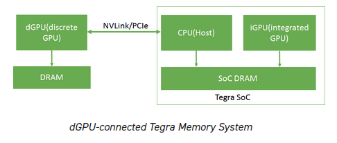
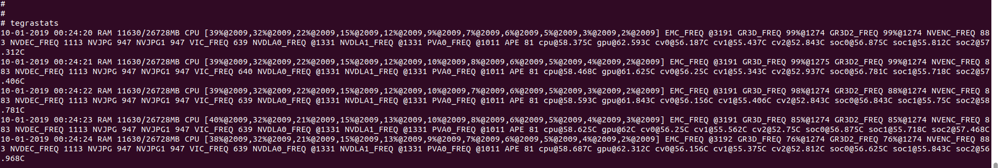
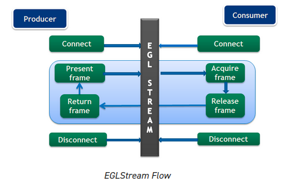

说明：

本文当是官方[CUDA for Tegra](https://docs.nvidia.com/cuda/cuda-for-tegra-appnote/index.html)的翻译

# 1 CUDA for Tegra

说明概述了NVIDIA®Tegra®内存体系结构，以及将代码从连接到x86系统的分立GPU（dGPU）移植到Tegra™集成GPU（iGPU）的注意事项。它还讨论了EGL互操作性。

# 2 概述

本文档提供了NVIDIA Tegra内存架构的概述，以及将连接到x86系统的独立GPU (dGPU)的代码移植到Tegra集成GPU (iGPU)的注意事项。它还讨论了EGL互操作性。

本指南适用于已经熟悉CUDA®和C/C++编程并希望为Tegra®SoC开发应用程序的开发人员。

CUDA C++编程指南和CUDA C最佳实践指南可从以下网站获得：

*CUDA C++ Programming Guide:*

https://docs.nvidia.com/cuda/cuda-c-programming-guide/index.html

*CUDA C++ Best Practices Guide:*

https://docs.nvidia.com/cuda/cuda-c-best-practices-guide/index.html

# 3. 内存管理

在 Tegra® 设备中，CPU（主机）和 iGPU 共享 SoC DRAM 内存。具有独立DRAM内存的dGPU可以通过PCIe或NVLink连接到Tegra设备。它目前仅在 NVIDIA DRIVE 平台上受支持。

图1显示了与dGPU连接的Tegra®内存系统的概览。



在Tegra中，设备内存、主机内存和统一内存分配在同一物理SoC DRAM上。在dGPU上，设备内存分配在dGPU DRAM上。Tegra系统中的缓存行为与具有dGPU的x86系统不同。Tegra系统中不同内存类型的缓存和访问行为如表1所示。

Table 1. Characteristics of Different Memory Types in a Tegra System

| **Memory Type**      | **CPU**                                                      | **iGPU**                | **Tegra-connected dGPU** |
| -------------------- | ------------------------------------------------------------ | ----------------------- | ------------------------ |
| Device memory        | Not directly accessible                                      | Cached                  | Cached                   |
| Pageable host memory | Cached                                                       | Not directly accessible | Not directly accessible  |
| Pinned host memory   | Uncached where compute capability is less than 7.2. Cached where compute capability is greater than or equal to 7.2. | Uncached                | Uncached                 |
| Unified memory       | Cached                                                       | Cached                  | Not supported            |

在Tegra上，由于设备内存、主机内存和统一内存分配在同一物理SoC DRAM上，因此可以避免重复的内存分配和数据传输。

## 3.1 I/O一致性

I/O  一致性（也称为单向一致性）是 I/O 设备（如 GPU）可以读取 CPU 缓存中的最新更新的功能。当 CPU 和 GPU  之间共享相同的物理内存时，它消除了执行 CPU 缓存管理操作的需要。仍然需要执行 GPU  缓存管理操作，因为一致性是单向的。请注意，当使用托管内存或互操作内存时，CUDA 驱动程序在内部执行 GPU 缓存管理操作。

从 Xavier SOC 开始的 Tegra 设备支持 I/O 一致性。 应用程序应从此硬件功能中获益，而无需更改应用程序的代码（请参阅下面的第 2 点）。

以下功能依赖于 I/O 一致性支持：

1. `cudaHostRegister（）/cuMemHostRegister（） `仅在 I/O 一致的平台上受支持。主机寄存器支持可以使用设备属性  `cudaDevAttrHostRegisterSupported /  CU_DEVICE_ATTRIBUTE_HOST_REGISTER_SUPPORTED `进行查询。
2. 使用 `cudaMallocHost（）/cuMemHostAlloc（）/cuMemAllocHost（）` 分配的固定内存的 CPU 缓存仅在 I/O 一致的平台上启用。

## 3.2. 估算集成GPU设备上的总可分配设备内存

`cudaMemGetInfo（） `API 返回可用于为 GPU 分配的可用内存和总内存量的快照。如果任何其他客户端分配内存，则可用内存可能会更改。

独立GPU具有称为VIDMEM的专用DRAM，它与CPU内存分开。离散 GPU 中可用内存的快照由 `cudaMemGetInfo` API 返回。

Tegra  SoC上的集成GPU与CPU和其他Tegra引擎共享DRAM。CPU可以通过将DMAR的内容移动到SWAP区域来控制DRAM的内容和释放DRAM内存，反之亦然。`cudaMemGetInfo `API 目前不考虑 SWAP 内存区域。`cudaMemGetInfo `API 可能返回比实际可分配内存更小的大小，因为 CPU  可能能够通过将页面移动到 SWAP 区域来释放一些 DRAM 区域。为了估计可分配设备内存的数量，CUDA 应用程序开发人员应考虑以下几点：

在Linux和Android平台上：Linux和Android上的设备可分配内存主要取决于交换空间和主内存的总大小和可用大小。以下几点可以帮助用户估计各种情况下设备可分配内存的总量：

* 主机分配的内存=总使用的物理内存–设备分配的内存
* 如果（主机分配的内存<可用交换空间），则设备可分配内存=总物理内存–已分配的设备内存
* 如果（主机分配的内存>可用交换空间），则设备可分配内存 = 总物理内存 -（主机分配的内存 - 可用交换空间）

其中

* 设备分配的内存是设备上已分配的内存。它可以从 /proc/meminfo 中的 NvMapMemUsed 字段或 /sys/kernel/debug/nvmap/iovmm/clients 的总字段获得。
* 可以使用 free -m 命令获取已用物理内存总量。Mem 行中used的字段表示此信息。
* 总物理内存是从 /proc/meminfo 中的 MemTotal 字段获取的。
* 可以使用 free -m 命令找到可用交换空间。swap行中的free字段表示此信息。
* 如果 free 命令不可用，可以从 /proc/meminfo 获得与以下内容相同的信息：
  * 总使用物理内存=MemTotal–MemFree
  * 空闲交换空间= SwapFree

**在QNX平台上：QNX不使用交换空间**，因此，cudaMemGetInfo.free将是可分配设备内存的合理估计，因为没有交换空间将内存页移动到交换区域。

# 4. 移植注意事项

最初为连接到 x86 系统的  dGPU 开发的 CUDA 应用程序可能需要修改才能在 Tegra 系统上高效执行。本节介绍将此类应用程序移植到 Tegra  系统的注意事项，例如选择适当的内存缓冲区类型（固定内存、统一内存等）以及在 iGPU 和 dGPU 之间进行选择，以实现应用程序的高效性能。

## 4.1 内存选择

CUDA 应用程序可以使用各种内存缓冲区，例如设备内存、可分页主机内存、固定内存和统一内存(`device memory, pageable host memory, pinned memory, and unified memory`)。即使这些内存缓冲区类型是在同一物理设备上分配的，每种类型都有不同的访问和缓存行为，如表 1 所示。选择最合适的内存缓冲区类型以实现高效的应用程序执行非常重要。

**Device Memory**

将设备内存用于可访问性仅限于 iGPU 的缓冲区。例如，在具有多个内核的应用程序中，可能存在仅由应用程序的中间内核用作输入或输出的缓冲区。这些缓冲区只能由 iGPU 访问。此类缓冲区应与设备内存一起分配。

**Pageable Host Memory 可分页主机内存**

将可分页主机内存用于可访问性仅限于 CPU 的缓冲区。

**Pinned Memory 固定内存** 

具有不同计算能力的  Tegra® 系统在 I/O 一致性方面表现出不同的行为。例如，计算能力大于或等于 7.2 的 Tegra® 系统是 I/O  相干的，而其他系统不是 I/O 相干的。在具有 I/O 一致性的 Tegra® 系统上，固定内存的 CPU  访问时间与可分页主机内存一样好，因为它缓存在 CPU 上。但是，在没有 I/O 一致性的 Tegra® 系统上，固定内存的 CPU  访问时间更高，因为它未缓存在 CPU 上。

建议对小型缓冲区使用固定内存，因为此类缓冲区的缓存效果可以忽略不计，并且与统一内存不同，固定内存不涉及任何额外的开销。如果没有额外的开销，如果访问模式在 iGPU 上缓存不友好，则固定内存也更适合大型缓冲区。对于大型缓冲区，当缓冲区在 iGPU 上以合并方式仅访问一次时，iGPU 上的性能可以与 iGPU 上的统一内存一样好。

**Unified Memory 统一内存**

统一内存缓存在 iGPU 和  CPU 上。在 Tegra® 上，在应用程序中使用统一内存需要在内核启动、同步和预取提示调用期间执行额外的一致性和缓存维护操作。在计算能力低于  7.2 的 Tegra® 系统上，这种一致性维护开销略高，因为它们缺乏 I/O 一致性。

在具有 I/O  一致性（计算能力为 7.2 或更高）的 Tegra® 设备上，统一内存同时缓存在 CPU 和 iGPU 上，对于 iGPU 和 CPU  经常访问的大型缓冲区，并且 iGPU 上的访问是重复的，统一内存更可取，因为重复访问可以抵消缓存维护成本。在没有 I/O 一致性的 Tegra® 设备上（计算能力低于 7.2），对于 CPU 和 iGPU 经常访问的大型缓冲区，并且 iGPU  上的访问不重复，统一内存仍然优于固定内存，因为固定内存不会同时缓存在 CPU 和 iGPU 上。这样，应用程序就可以利用 CPU  上的统一内存缓存。

固定内存或统一内存(`Pinned memory or unified memory`)可用于减少 CPU 和 iGPU 之间的数据传输开销，因为这两个内存都可以从 CPU 和 iGPU 直接访问。在应用程序中，可以使用统一内存或固定内存分配必须在主机和 iGPU 上均可访问的输入和输出缓冲区。

注意：

**统一内存模型要求驱动程序和系统软件在当前Tegra SOC上管理一致性。软件管理一致性本质上是不确定性的，不建议在安全环境中使用。零拷贝内存（固定内存）在这些应用中是首选的。**

评估应用程序中统一内存开销、固定内存缓存未命中和设备内存数据传输的影响，以确定正确的内存选择。

## 4.2. Pinned Memory

本节提供有关将具有 dGPU 的 x86 系统中使用固定内存分配的应用程序移植到 Tegra® 的指南。为连接到 x86 系统的 dGPU 开发的 CUDA  应用程序使用固定内存来减少数据传输时间，并将数据传输与内核执行时间重叠。有关本主题的特定信息，请参阅以下网站上的“主机和设备之间的数据传输”和“使用计算的异步和重叠传输”。

“Data Transfer Between Host and Device”:

https://docs.nvidia.com/cuda/cuda-c-best-practices-guide/index.html#data-transfer-between-host-and-device

“Asynchronous and Overlapping Transfers with Computation”:

https://docs.nvidia.com/cuda/cuda-c-best-practices-guide/index.html#asynchronous-transfers-and-overlapping-transfers-with-computation

在没有 I/O 一致性的 Tegra® 系统上，重复访问固定内存会降低应用程序性能，因为固定内存不会缓存在此类系统中的 CPU 上。

下面显示了一个示例应用程序，其中一组筛选器和操作（k1、k2 和 k3）应用于图像。分配固定内存以减少具有 dGPU 的 x86 系统上的数据传输时间，从而提高整体应用程序速度。但是，以具有相同代码的  Tegra® 设备为目标会导致 readImage（） 函数的执行时间急剧增加，因为它会重复访问未缓存的缓冲区。这增加了整体应用时间。如果  readImage（） 所花费的时间明显高于内核执行时间，建议使用统一内存来减少 readImage（）  时间。否则，通过删除不必要的数据传输调用来评估具有固定内存和统一内存的应用程序，以确定最适合的内存。

```C
// Sample code for an x86 system with a discrete GPU
int main()
{
    int *h_a,*d_a,*d_b,*d_c,*d_d,*h_d;
    int height = 1024;
    int width = 1024;
    size_t sizeOfImage = width * height * sizeof(int); // 4MB image

    //Pinned memory allocated to reduce data transfer time
    cudaMallocHost(h_a, sizeOfImage);
    cudaMallocHost(h_d, sizeOfImage);

    //Allocate buffers on GPU
    cudaMalloc(&d_a, sizeOfImage);
    cudaMalloc(&d_b, sizeOfImage);
    cudaMalloc(&d_c, sizeOfImage);
    cudaMalloc(&d_d, sizeOfImage);

    //CPU reads Image;
    readImage(h_a); // Intialize the h_a buffer

    // Transfer image to GPU
    cudaMemcpy(d_a, h_a, sizeOfImage, cudaMemcpyHostToDevice);

    // Data transfer is fast as we used pinned memory
    // ----- CUDA Application pipeline start ----
    k1<<<..>>>(d_a,d_b) // Apply filter 1
    k2<<<..>>>(d_b,d_c)// Apply filter 2
    k3<<<..>>>(d_c,d_d)// Some operation on image data
    // ----- CUDA Application pipeline end ----

    // Transfer processed image to CPU
    cudaMemcpy(h_d, d_d, sizeOfImage, cudaMemcpyDeviceToHost);
    // Data transfer is fast as we used pinned memory

    // Use processed Image i.e h_d in later computations on CPU.
    UseImageonCPU(h_d);
}

// Porting the code on Tegra
int main()
{
    int *h_a,*d_b,*d_c,*h_d;
    int height = 1024;
    int width = 1024;
    size_t sizeOfImage = width * height * sizeof(int); // 4MB image

    //Unified memory allocated for input and output
    //buffer of application pipeline
    cudaMallocManaged(h_a, sizeOfImage,cudaMemAttachHost);
    cudaMallocManaged(h_d, sizeOfImage);

    //Intermediate buffers not needed on CPU side.
    //So allocate them on device memory
    cudaMalloc(&d_b, sizeOfImage);
    cudaMalloc(&d_c, sizeOfImage);

    //CPU reads Image;
    readImage (h_a); // Intialize the h_a buffer
    // ----- CUDA Application pipeline start ----
    // Prefetch input image data to GPU
    cudaStreamAttachMemAsync(NULL, h_a, 0, cudaMemAttachGlobal);
    k1<<<..>>>(h_a,d_b)
    k2<<<..>>>(d_b,d_c)
    k3<<<..>>>(d_c,h_d)
    // Prefetch output image data to CPU
    cudaStreamAttachMemAsync(NULL, h_d, 0, cudaMemAttachHost);
    cudaStreamSynchronize(NULL);
    // ----- CUDA Application pipeline end ----

    // Use processed Image i.e h_d on CPU side.
    UseImageonCPU(h_d);
}
```

The`cudaHostRegister()` function

在计算能力低于 7.2 的  Tegra® 设备上不支持 `cudaHostRegister（）` 函数，因为这些设备没有 I/O 一致性。如果设备上不支持  `cudaHostRegister（）`，请使用其他固定内存分配函数，例如` cudaMallocHost（） 和 cudaHostAlloc（）`。

固定内存上的GNU原子操作

Tegra®CPU不支持未缓存内存上的GNU原子操作。由于固定内存不缓存在计算能力低于7.2的Tegra®设备上，因此固定内存不支持GNU原子操作。

## 4.3. 在 Tegra 上有效使用统一内存

在应用程序中使用统一内存需要在内核启动、同步和预取提示调用时执行额外的一致性和缓存维护操作。这些操作与其他GPU工作同步执行，这可能会在应用程序中导致不可预测的延迟。

通过提供数据预取提示，可以提高Tegra®上统一内存的性能。驱动程序可以使用这些预取提示来优化一致性操作。为了预取数据，除了CUDA C编程指南的“一致性和并发性”部分中描述的技术外，还可以使用`cudaStreamAttachMemAsync（）`函数，链接如下：

https://docs.nvidia.com/cuda/cuda-c-programming-guide/index.html#um-coherency-hd

以预取数据。表2显示了由附件标志的状态变化触发的统一内存的预取行为。

Table 2. Unified Memory Prefetching Behavior per Changing Attachment Flag States

| **Previous Flag**                       | **Current Flag**                         | **Prefetching Behavior** |
| --------------------------------------- | ---------------------------------------- | ------------------------ |
| cudaMemAttachGlobal/cudaMemAttachSingle | cudaMemAttachHost                        | Causes prefetch to CPU   |
| cudaMemAttachHost                       | cudaMemAttachGlobal/ cudaMemAttachSingle | Causes prefetch to GPU   |
| cudaMemAttachGlobal                     | cudaMemAttachSingle                      | No prefetch to GPU       |
| cudaMemAttachSingle                     | cudaMemAttachGlobal                      | No prefetch to GPU       |

以下示例显示了 `cudaStreamAttachMemAsync（）` 预取数据的用法。

但是，Tegra®设备不支持使用cudaMemPrefetchAsync（）的数据预取技术，如以下网站上《CUDA C++编程指南》的“性能调整”部分所述：https://docs.nvidia.com/cuda/cuda-c-programming-guide/index.html#um-performance-tuning

QNX 系统软件存在一些限制，无法实施所有 UVM 优化。因此，使用 `cudaStreamAttachMemAsync（）` 在 QNX 上预取提示不会影响性能。

```C
__global__ void matrixMul(int *p, int *q, int*r, int hp, int hq, int wp, int wq)
{
// Matrix multiplication kernel code
}
void MatrixMul(int hp, int hq, int wp, int wq)
{
    int *p,*q,*r;
    int i;
    size_t sizeP = hp*wp*sizeof(int);
    size_t sizeQ = hq*wq*sizeof(int);
    size_t sizeR = hp*wq*sizeof(int);

    //Attach buffers 'p' and 'q' to CPU and buffer 'r' to GPU
    cudaMallocManaged(&p, sizeP, cudaMemAttachHost);
    cudaMallocManaged(&q, sizeQ, cudaMemAttachHost);
    cudaMallocManaged(&r, sizeR);
    //Intialize with random values
    randFill(p,q,hp,wp,hq,wq);

    // Prefetch p,q to GPU as they are needed in computation
    cudaStreamAttachMemAsync(NULL, p, 0, cudaMemAttachGlobal);
    cudaStreamAttachMemAsync(NULL, q, 0, cudaMemAttachGlobal);
    matrixMul<<<....>>>(p,q,r, hp,hq,wp,wq);

    // Prefetch 'r' to CPU as only 'r' is needed
    cudaStreamAttachMemAsync(NULL, r, 0, cudaMemAttachHost);
    cudaStreamSynchronize(NULL);

    // Print buffer 'r' values
    for(i = 0; i < hp*wq; i++)
    printf("%d ", r[i]);
}
```

可以在 matrixMul 内核代码之后添加一个额外的 `cudaStreamSynchronize（NULL）` 调用，以避免在 cudaStreamAttachMemAsync（） 调用中导致不可预测性的回调线程。

## 4.4 GPU选择

在具有 dGPU 的  Tegra 系统上，决定 CUDA 应用程序是在 iGPU 还是 dGPU  上运行可能会影响应用程序的性能。做出此类决策时需要考虑的一些因素是内核执行时间、数据传输时间、数据局部性和延迟。例如，要在 dGPU  上运行应用程序，必须在 SoC 和 dGPU 之间传输数据。如果应用程序在 iGPU 上运行，则可以避免此数据传输。

## 4.5 同步机制选择

cudaSetDeviceFlags API 用于控制 CPU 线程的同步行为。在 CUDA 10.1 之前，默认情况下，iGPU 上的同步机制使用  [cudaDeviceBlockingSync](https://docs.nvidia.com/cuda/cuda-runtime-api/group__CUDART__TYPES.html#group__CUDART__TYPES_1g130ddae663f1873258fee5a6e0808b71) 标志，该标志在等待设备完成工作时阻止同步原语上的 CPU  线程。[cudaDeviceBlockingSync](https://docs.nvidia.com/cuda/cuda-runtime-api/group__CUDART__TYPES.html#group__CUDART__TYPES_1g130ddae663f1873258fee5a6e0808b71)  标志适用于具有电源限制的平台。但是在需要低延迟的平台上， [cudaDeviceScheduleSpin](https://docs.nvidia.com/cuda/cuda-runtime-api/group__CUDART__TYPES.html#group__CUDART__TYPES_1gf01347c3dafebf07e1a0b4321a030a63)标志需要手动设置。自 CUDA 10.1  起，对于每个平台，默认同步标志是根据针对该平台优化的内容确定的。有关同步标志的更多信息，请参见  [cudaSetDeviceFlags](https://docs.nvidia.com/cuda/cuda-runtime-api/group__CUDART__DEVICE.html#group__CUDART__DEVICE_1g69e73c7dda3fc05306ae7c811a690fac) API  文档。

## 4.6. Tegra 不支持的 CUDA 功能

CUDA 的所有核心功能在 Tegra 平台上都受支持。下面列出了例外情况。

* QNX 系统不支持 `cudaHostRegister（）` 函数。这是由于 QNX 操作系统的限制。计算能力大于或等于 7.2 的 Linux 系统支持此功能。

* 计算能力低于 7.2 的 Tegra 设备不支持系统范围的原子。

* 连接到 Tegra 的 dGPU 不支持统一内存。

* 不支持` cudaMemPrefetchAsync（）` 函数，因为 iGPU 尚不支持具有并发访问的统一内存。

* NVIDIA 管理库 （NVML） 库在 Tegra 上不受支持。但是，作为监视资源利用率的替代方法，可以使用 tegrastats。参考[tegrastats Utility](https://developer.nvidia.com/docs/drive/drive-os/latest/linux/sdk/common/topics/util_setup/tegrastatsUtility1.html)文档《NVIDIA DRIVE Utilities.md》描述了使用方法。板子实测如下：

  

* 从 CUDA 11.5  开始，L4T 和具有 7.x 及更高计算能力的嵌入式 Linux Tegra 设备仅支持事件共享 IPC API。内存共享 IPC API 在  Tegra 平台上仍然不受支持。EGLStream、NvSci 或 cuMemExportToShareableHandle（） /  cuMemImportFromShareableHandle（） API 可用于在两个进程中的 CUDA 上下文之间进行通信。
* 远程直接内存访问 （RDMA） 仅在运行 L4T 或嵌入式 Linux 的 Tegra 设备上受支持。
* JIT 编译可能需要大量的  CPU 和带宽资源，这可能会干扰系统中的其他工作负载。因此，不建议将 PTX-JIT 和 NVRTC JIT 等 JIT  编译用于确定性汽车应用，并且可以通过针对特定 GPU 目标进行编译来完全绕过。在安全上下文中，Tegra 设备上不支持 JIT 编译。
* Tegra不支持多进程服务（MPS）。
* Tegra不支持对等（P2P）通信呼叫。
* 运行QNX的Tegra系统不支持cuSOLVER库。
* 不支持 nvGRAPH 库。

有关这些功能的更多信息，请访问以下网站：

IPC:

https://docs.nvidia.com/cuda/cuda-c-programming-guide/index.html#interprocess-communication

NVSCI:

https://docs.nvidia.com/cuda/cuda-c-programming-guide/index.html#nvidia-softwarcommunication-interface-interoperability-nvsci

RDMA:

https://docs.nvidia.com/cuda/gpudirect-rdma/index.html

MPS:

https://docs.nvidia.com/deploy/pdf/CUDA_Multi_Process_Service_Overview.pdf

P2P:

https://docs.nvidia.com/cuda/cuda-c-programming-guide/index.html#peer-to-peer-memory-access

# 5.EGL互操作性

互操作是在两个 API 之间共享资源的有效机制。要与多个 API 共享数据，API 必须为每个 API 实现单独的互操作。

EGL  提供互操作扩展，使其能够充当连接 API 的中心，无需多个互操作，并封装共享资源。API 必须实现这些扩展才能通过 EGL 与任何其他 API  进行互操作。CUDA 支持的 EGL 互操作是 EGLStream、EGLImage 和 EGLSync。

EGL 互操作扩展允许应用程序在 API 之间切换，而无需重写代码。例如，一个基于 EGLStream 的应用程序，其中 NvMedia 是生产者，CUDA 是消费者，可以修改为使用 OpenGL 作为消费者，而无需修改生产者代码。

**在DRIVE OS平台上，NVSCI是作为EGL互操作性的替代方案提供的，用于安全关键应用**。有关更多详细信息，请参阅 [NVSCI](https://docs.nvidia.com/cuda/cuda-c-programming-guide/index.html#nvidia-softwarcommunication-interface-interoperability-nvsci)。

## 5.1. EGLStream

EGLStream 互操作性有助于将一系列帧从一个 API 有效地传输到另一个 API，允许使用多个 Tegra® 引擎，如 CPU、GPU、ISP 等。

考虑一个应用程序，其中相机连续捕获图像，与 CUDA 共享它们进行处理，然后使用 OpenGL 渲染这些图像。在此应用程序中，图像帧在NvMedia，CUDA和OpenGL之间共享。缺少 EGLStream 互操作性将要求应用程序在 API 之间包括多个互操作和冗余数据传输。EGLStream有一个生产者和一个消费者。

EGLStream提供以下好处：

* 在生产者和消费者之间有效地传输帧。
* 隐式同步处理。
* 跨进程支持。
* dGPU 和 iGPU 支持。
* Linux、QNX和Android操作系统支持。

### 5.1.1. EGLStream Flow

EGLStream 流程包含以下步骤：

1. 初始化生产者和消费者API

2. 创建EGLStream并连接消费者和生产者。

   EGLStream使用eglCreateStreamKHR（）创建，并使用eglDestroyStreamKHR）销毁。

   消费者应始终在生产者之前连接到EGLStream。

   有关详细信息，请参阅以下网站上的 EGLStream 规范https://www.khronos.org/registry/EGL/extensions/KHR/EGL_KHR_stream.txt

3. 分配用于 EGL 帧的内存。

4. 生产者填充 EGL 帧并将其呈现给 EGLStream。

5. 消费者从EGLStream获取帧，并在处理后将其释放回EGLStream。

6. 生产者从EGLStream收集消费者发布的帧。

7. 生产者向EGLStream提供相同的帧或新帧。

8. 使用旧帧或新帧重复步骤4-7直到任务完成。

9. 消费者和生产者与EGLStream断开连接。

10. 释放用于EGL帧的内存。

11. 去初始化生产者和消费者api。

EGLStream 应用程序流程如图 2 所示。



CUDA 生产者和消费者功能列于表 3 中。

Table 3. CUDA Producer and Consumer Functions

| **Role** | **Functionality**                  | **API**                                                      |
| -------- | ---------------------------------- | ------------------------------------------------------------ |
| Producer | To connect a producer to EGLStream | [cuEGLStreamProducerConnect](https://docs.nvidia.com/cuda/cuda-driver-api/group__CUDA__EGL.html#group__CUDA__EGL_1g5d181803d994a06f1bf9b05f52757bef)() [cudaEGLStreamProducerConnect](https://docs.nvidia.com/cuda/cuda-driver-api/group__CUDA__EGL.html#group__CUDA__EGL_1g5d181803d994a06f1bf9b05f52757bef)() |
|          | To present frame to EGLStream      | cuEGLStreamProducerPresentFrame() cudaEGLStreamProducerPresentFrame() |
|          | Obtain released frames             | cuEGLStreamProducerReturnFrame() cudaEGLStreamProducerReturnFrame() |
|          | To disconnect from EGLStream       | [cuEGLStreamProducerDisconnect](https://docs.nvidia.com/cuda/cuda-driver-api/group__CUDA__EGL.html#group__CUDA__EGL_1gbdc9664bfb17dd3fa1e0a3ca68a8cafd)() [cudaEGLStreamProducerDisconnect](https://docs.nvidia.com/cuda/cuda-driver-api/group__CUDA__EGL.html#group__CUDA__EGL_1gbdc9664bfb17dd3fa1e0a3ca68a8cafd)() |
| Consumer | To connect a consumer to EGLStream | cuEGLStreamConsumerConnect() cuEGLStreamConsumeConnectWithFlags() [cudaEGLStreamConsumerConnect](https://docs.nvidia.com/cuda/cuda-runtime-api/group__CUDART__EGL.html#group__CUDART__EGL_1g7993b0e3802420547e3f403549be65a1)() cudaEGLStreamConsumerConnectWithFlags() |
|          | To acquire frame from EGLStream    | cuEGLStreamConsumerAcquireFrame() [cudaEGLStreamConsumerAcquireFrame](https://docs.nvidia.com/cuda/cuda-runtime-api/group__CUDART__EGL.html#group__CUDART__EGL_1g83dd1bfea48c093d3f0b247754970f58)() |
|          | To release the consumed frame      | cuEGLStreamConsumerReleaseFrame() cudaEGLStreamConsumerReleaseFrame() |
|          | To disconnect from EGLStream       | [cuEGLStreamConsumerDisconnect](https://docs.nvidia.com/cuda/cuda-driver-api/group__CUDA__EGL.html#group__CUDA__EGL_1g3ab15cff9be3b25447714101ecda6a61)() [cudaEGLStreamConsumerDisconnect](https://docs.nvidia.com/cuda/cuda-runtime-api/group__CUDART__EGL.html#group__CUDART__EGL_1gb2ef252e72ad2419506f3cf305753c6a)() |

### 5.1.2. CUDA 作为生产者

当CUDA是生产者时，支持的消费者是CUDA，NvMedia和OpenGL。表 3 列出了 CUDA 作为生产者时要使用的 API 函数。除了连接和断开与EGLStream的连接外，所有API调用都是非阻塞的。

以下示例代码中显示了以下生产者端步骤：

1. 准备一个帧（第 3-19 行）。
2. 将生产者连接到EGLStream（第21行）。
3. 填充帧并呈现给EGLStream（第23-25行）。
4. 从EGLStream获取释放的帧（第27行）。
5. 任务完成后断开使用者的连接。(31行)。

```c
void ProducerThread(EGLStreamKHR eglStream) {
 //Prepares frame
 cudaEglFrame* cudaEgl = (cudaEglFrame *)malloc(sizeof(cudaEglFrame));
 cudaEgl->planeDesc[0].width = WIDTH;
 cudaEgl->planeDesc[0].depth = 0;
 cudaEgl->planeDesc[0].height = HEIGHT;
 cudaEgl->planeDesc[0].numChannels = 4;
 cudaEgl->planeDesc[0].pitch = WIDTH * cudaEgl->planeDesc[0].numChannels;
 cudaEgl->frameType = cudaEglFrameTypePitch;
 cudaEgl->planeCount = 1;
 cudaEgl->eglColorFormat = cudaEglColorFormatARGB;
 cudaEgl->planeDesc[0].channelDesc.f=cudaChannelFormatKindUnsigned
 cudaEgl->planeDesc[0].channelDesc.w = 8;
 cudaEgl->planeDesc[0].channelDesc.x = 8;
 cudaEgl->planeDesc[0].channelDesc.y = 8;
 cudaEgl->planeDesc[0].channelDesc.z = 8;
 size_t numElem = cudaEgl->planeDesc[0].pitch * cudaEgl->planeDesc[0].height;
 // Buffer allocated by producer
 cudaMalloc(&(cudaEgl->pPitch[0].ptr), numElem);
 //CUDA producer connects to EGLStream
 cudaEGLStreamProducerConnect(&conn, eglStream, WIDTH, HEIGHT))
 // Sets all elements in the buffer to 1
 K1<<<...>>>(cudaEgl->pPitch[0].ptr, 1, numElem);
 // Present frame to EGLStream
 cudaEGLStreamProducerPresentFrame(&conn, *cudaEgl, NULL);

 cudaEGLStreamProducerReturnFrame(&conn, cudaEgl, eglStream);
 .
 .
 //clean up
 cudaEGLStreamProducerDisconnect(&conn);

 .
}
```

帧表示为`cudaEglFramestructure`。cudaEglFrame中的frameType参数指示帧的内存布局。支持的内存布局是CUDA阵列和设备指针。框架的宽度和高度值与`cudaEGLStreamProducerConnect（）`中指定的值不匹配会导致未定义的行为。在示例中，CUDA生产者发送一个帧，但它可以通过一个循环发送多个帧。CUDA向EGLStream提供的活动帧不能超过64个。

`cudaEGLStreamProducerReturnFrame（）` 调用会一直等到它从使用者那里收到释放的帧。一旦 CUDA 生产者向 EGLstream  提供第一帧，至少有一个帧始终可供消费者获取，直到生产者断开连接。这可以防止从 EGLStream 中删除最后一帧，这会阻止  [cudaEGLStreamProducerReturnFrame](https://docs.nvidia.com/cuda/cuda-driver-api/group__CUDA__EGL.html#group__CUDA__EGL_1g70c84d9d01f343fc07cd632f9cfc3a06)()

使用 `EGL_NV_stream_reset `扩展名将 EGLStream 属性`EGL_SUPPORT_REUSE_NV`设置为 false，以允许从 EGLStream 中删除最后一帧。这允许从 EGLStream 中删除或返回最后一帧。

### 5.1.3. CUDA作为消费者

当CUDA是消费者时，支持的生产者是CUDA，OpenGL，NvMedia，Argus和Camera。表 3 列出了 CUDA 作为使用者时要使用的 API 函数。除了连接和断开与EGLStream的连接外，所有API调用都是非阻塞的。

下面的示例代码显示了使用者端步骤

1. 将消费者连接到EGLStream（第5行）。
2. 从EGLStream获取帧（第8-10行）。
3. 在消费者上处理帧(第16行)。
4. 将帧释放回EGLStream（第19行）。
5. 任务完成后断开使用者连接(第22行)。

```C
void ConsumerThread(EGLStreamKHR eglStream) {
.
.
//Connect consumer to EGLStream
cudaEGLStreamConsumerConnect(&conn, eglStream);
// consumer acquires a frame
unsigned int timeout = 16000;
cudaEGLStreamConsumerAcquireFrame(& conn, &cudaResource, eglStream, timeout);
//consumer gets a cuda object pointer
cudaGraphicsResourceGetMappedEglFrame(&cudaEgl, cudaResource, 0, 0);
size_t numElem = cudaEgl->planeDesc[0].pitch * cudaEgl->planeDesc[0].height;
.
.
int checkIfOne = 1;
// Checks if each value in the buffer is 1, if any value is not 1, it sets checkIfOne = 0.
K2<<<...>>>(cudaEgl->pPitch[0].ptr, 1, numElem, checkIfOne);
.
.
cudaEGLStreamConsumerReleaseFrame(&conn, cudaResource, &eglStream);
.
.
cudaEGLStreamConsumerDisconnect(&conn);
.
}
```

在示例代码中，CUDA消费者接收单个帧，但它也可以通过循环接收多个帧。如果CUDA消费者使用[cudaEGLStreamConsumerAcquireFrame()](https://docs.nvidia.com/cuda/cuda-runtime-api/group__CUDART__EGL.html#group__CUDART__EGL_1g83dd1bfea48c093d3f0b247754970f58)在指定的时间限制内没有接收到新的帧，它会从EGLStream中重新获取之前的帧。时间限制由timeout参数表示。

应用程序可以使用`eglQueryStreamKHR（`）查询新帧的可用性。如果使用者使用已发布的帧，则会导致未定义的行为。使用者行为仅为读取操作定义。当使用者写入帧时，行为未定义。

如果在连接到 EGLStream 时 CUDA 上下文被破坏，则流将处于`EGL_STREAM_STATE_DISCONNECTED_KHR`状态，并且连接句柄将失效。

### 5.1.4. 隐式同步

EGLStream  在应用程序中提供隐式同步。例如，在前面的代码示例中，生产者线程和使用线程并行运行，K1 和 K2 内核进程访问同一帧，但使用者线程中的 K2  执行保证仅在生产者线程中的内核 K1 完成后发生。`cudaEGLStreamConsumerAcquireFrame（）` 函数在 GPU  端等待，直到 K1 完成并确保生产者和消费者之间的同步。变量 checkIfOne 永远不会在使用者线程的 K2 内核内设置为 0。

类似地，生产者线程中的` cudaEGLStreamProducerReturnFrame（）` 保证仅在 K2 完成并且使用者释放帧后才能获取帧。这些非阻塞调用允许 CPU 在两者之间执行其他计算，因为同步是在 GPU 端处理的。

`EGLStreams_CUDA_Interop`CUDA示例代码详细展示了 EGLStream 的用法。

### 5.1.5.生产者和消费者之间的数据传输

当生产者和消费者存在于同一设备上时，可以避免它们之间的数据传输。然而，在包含dGPU的Tegra®平台中，例如NVIDIA DRIVE™ PX 2，生产者和消费者可以出现在不同的设备上。在这种情况下，内部需要一个额外的内存副本来在Tegra® SoC  DRAM和dGPU DRAM之间移动帧。EGLStream允许生产者和消费者在任何GPU上运行，而无需修改代码。

在 Tegra® 设备连接到 dGPU 的系统上，如果生产者帧使用 CUDA 阵列，则生产者和消费者应位于同一 GPU 上。但是，如果生产者框架使用 CUDA 设备指针，则使用者可以出现在任何 GPU 上。

### 5.1.6.EGLStream管道

应用程序可以在管道中使用多个 EGL 流将帧从一个 API 传递到另一个 API。对于 NvMedia 将帧发送到 CUDA 进行计算的应用程序，CUDA 将同一帧发送到 OpenGL 以便在计算后进行渲染。

EGLStream 管道如图 3 所示。


NvMedia和CUDA分别作为生产者和消费者连接到一个EGLStream。CUDA和OpenGL分别作为生产者和消费者连接到另一个EGLStream。

以流水线方式使用多个 EGLStreams 可以灵活地跨多个 API 发送帧，而无需分配额外的内存或需要显式数据传输。通过上述 EGLStream 管道发送帧涉及以下步骤。

1. NvMedia 将帧发送到 CUDA 进行处理。
2. CUDA 使用帧进行计算，并发送到 OpenGL 进行渲染。
3. OpenGL消耗帧并将其释放回CUDA。
4. CUDA将帧释放回NvMedia。

上述步骤可以在循环中执行，以方便在 EGLStream 管道中传输多个帧。


## 5.2 EGL图像

EGLImage 互操作允许  EGL 客户端 API 与其他 EGL 客户端 API 共享图像数据。例如，应用程序可以使用 EGLImage 互操作与 CUDA 共享  OpenGL 纹理，而无需分配任何额外的内存。单个 EGLImage 对象可以在多个客户端 API 之间共享以进行修改。

EGLImage互操作不提供隐式同步。应用程序必须保持同步以避免竞争条件。

EGLImage使用`eglCreateImageKHR（）`创建，并使用`eglDestroyImageKHR()`销毁。

有关详细信息，请参阅以下网站上的 EGLImage 规范：

https://www.khronos.org/registry/EGL/extensions/KHR/EGL_KHR_image_base.txt

### 5.2.1.CUDA与EGLImage的互操作

CUDA 支持与  EGLImage 的互操作，允许 CUDA 读取或修改 EGLImage 的数据。EGLImage 可以是单个或多个平面资源。在 CUDA  中，单平面 EGLImage 对象表示为 CUDA 数组或设备指针。同样，多平面 EGLImage 对象表示为设备指针或 CUDA  数组的数组。EGLImage 在运行 Linux、QNX 或 Android 操作系统的 Tegra® 设备上受支持。

使用`cudaGraphicsEGLRegisterImage（）`API向CUDA注册EGLImage对象。向CUDA注册EGLImage将创建图形资源对象。应用程序可以使用`cudaGraphicsResourceGetMappedEglFrame（）`从图形资源对象获取帧。在CUDA中，帧表示为cudaEglFrame结构。cudaEglFrame中的frameType参数指示帧是CUDA设备指针还是CUDA数组。对于单个平面图形资源，应用程序可以分别使用`cudaGraphicsResourceGetMappedPointer（）或cudaGraphicsSubResourceGetMapedArray（）`直接获取设备指针或CUDA数组。CUDA数组可以绑定到纹理或曲面引用以在内核内部访问。此外，多维CUDA数组可以通过`cudaMemcpy3D（）`进行读写。

无法从CUDA对象创建EGLImage。`cudaGraphicsEGLRegisterImage（）`函数仅在Tegra®设备上受支持。此外，`cudaGraphicsEGLRegisterImage（）`只需要“0”标志，因为其他API标志供将来使用。

以下示例代码显示了  EGLImage 互操作性。在代码中，EGLImage 对象 eglImage 是使用 OpenGL 纹理创建的。eglImage 对象在  CUDA 中映射为 CUDA 数组 pArray。pArray 数组绑定到表面对象，以允许修改 changeTexture 中的 OpenGL  纹理。函数 checkBuf（） 检查纹理是否使用新值更新。

```C
int width = 256;
int height = 256;
int main()
{
 .
 .
 unsigned char *hostSurf;
 unsigned char *pSurf;
 CUarray pArray;
 unsigned int bufferSize = WIDTH * HEIGHT * 4;
 pSurf= (unsigned char *)malloc(bufferSize); hostSurf = (unsigned char *)malloc(bufferSize);
 // Initialize the buffer
 for(int y = 0; y < HEIGHT; y++)
 {
    for(int x = 0; x < WIDTH; x++)
    {
    pSurf[(y*WIDTH + x) * 4 ] = 0; pSurf[(y*WIDTH + x) * 4 + 1] = 0;
    pSurf[(y*WIDTH + x) * 4 + 2] = 0; pSurf[(y*WIDTH + x) * 4 + 3] = 0;
    }
 }

 // NOP call to error-check the above glut calls
 GL_SAFE_CALL({});

 //Init texture
 GL_SAFE_CALL(glGenTextures(1, &tex));
 GL_SAFE_CALL(glBindTexture(GL_TEXTURE_2D, tex));
 GL_SAFE_CALL(glTexImage2D(GL_TEXTURE_2D, 0, GL_RGBA, WIDTH, HEIGHT, 0, GL_RGBA, GL_UNSIGNED_BYTE, pSurf));

 EGLDisplay eglDisplayHandle = eglGetCurrentDisplay();
 EGLContext eglCtx = eglGetCurrentContext();

 // Create the EGL_Image
 EGLint eglImgAttrs[] = { EGL_IMAGE_PRESERVED_KHR, EGL_FALSE, EGL_NONE, EGL_NONE };
 EGLImageKHR eglImage = eglCreateImageKHR(eglDisplayHandle, eglCtx, EGL_GL_TEXTURE_2D_KHR, (EGLClientBuffer)(intptr_t)tex, eglImgAttrs);
 glFinish();
 glTexSubImage2D(GL_TEXTURE_2D, 0, 0, 0, WIDTH, HEIGHT, GL_RGBA, GL_UNSIGNED_BYTE, pSurf);
 glFinish();

 // Register buffer with CUDA
cuGraphicsEGLRegisterImage(&pResource, eglImage,0);

 //Get CUDA array from graphics resource object
 cuGraphicsSubResourceGetMappedArray( &pArray, pResource, 0, 0);

 cuCtxSynchronize();

 //Create a CUDA surface object from pArray
 CUresult status = CUDA_SUCCESS;
 CUDA_RESOURCE_DESC wdsc;
 memset(&wdsc, 0, sizeof(wdsc));
 wdsc.resType = CU_RESOURCE_TYPE_ARRAY; wdsc.res.array.hArray = pArray;
 CUsurfObject writeSurface;
 cuSurfObjectCreate(&writeSurface, &wdsc);

 dim3 blockSize(32,32);
 dim3 gridSize(width/blockSize.x,height/blockSize.y);
 // Modifies the OpenGL texture using CUDA surface object
 changeTexture<<<gridSize, blockSize>>>(writeSurface, width, height);
 cuCtxSynchronize();

 CUDA_MEMCPY3D cpdesc;
 memset(&cpdesc, 0, sizeof(cpdesc));
 cpdesc.srcXInBytes = cpdesc.srcY = cpdesc.srcZ = cpdesc.srcLOD = 0;
 cpdesc.dstXInBytes = cpdesc.dstY = cpdesc.dstZ = cpdesc.dstLOD = 0;
 cpdesc.srcMemoryType = CU_MEMORYTYPE_ARRAY; cpdesc.dstMemoryType = CU_MEMORYTYPE_HOST;
 cpdesc.srcArray = pArray; cpdesc.dstHost = (void *)hostSurf;
 cpdesc.WidthInBytes = WIDTH * 4; cpdesc.Height = HEIGHT; cpdesc.Depth = 1;

 //Copy CUDA surface object values to hostSurf
 cuMemcpy3D(&cpdesc);

 cuCtxSynchronize();

 unsigned char* temp = (unsigned char*)(malloc(bufferSize * sizeof(unsigned char)));
 // Get the modified texture values as
 GL_SAFE_CALL(glGetTexImage(GL_TEXTURE_2D, 0, GL_RGBA, GL_UNSIGNED_BYTE,(void*)temp));
 glFinish();
 // Check if the OpenGL texture got modified values
 checkbuf(temp,hostSurf);

 // Clean up CUDA
 cuGraphicsUnregisterResource(pResource);
 cuSurfObjectDestroy(writeSurface);
 .
 .
}
__global__ void changeTexture(cudaSurfaceObject_t arr, unsigned int width, unsigned int height){
 unsigned int x = threadIdx.x + blockIdx.x * blockDim.x;
 unsigned int y = threadIdx.y + blockIdx.y * blockDim.y;
 uchar4 data = make_uchar4(1, 2, 3, 4);
 surf2Dwrite(data, arr, x * 4, y);
}
void checkbuf(unsigned char *ref, unsigned char *hostSurf) {
 for(int y = 0; y < height*width*4; y++){
 if (ref[y] != hostSurf[y])
 printf("mis match at %d\n",y);
 }
}
```

由于 EGLImage  不提供隐式同步，因此上面的示例应用程序使用 glFinish（） 和 cudaThreadSync（） 调用来实现同步。这两个调用都会阻塞  CPU 线程。若要避免阻塞 CPU 线程，请使用 EGLSync 提供同步。下一节显示了使用 EGLImage 和 EGLSync 的示例。

### 5.3. EGLSync

EGLSync是一个跨api的同步原语。它允许EGL客户端API与其他EGL客户端API共享其同步对象。例如，应用程序可以使用EGLSync互操作与CUDA共享OpenGL同步对象。

EGLSync对象使用`eglCreateSyncKHR（）`创建，并使用`eglDestroySyncKHR()`销毁。

有关更多信息，请参阅以下网站上的EGLSync规范：

https://www.khronos.org/registry/EGL/extensions/KHR/EGL_KHR_fence_sync.txt

### 5.3.1.CUDA与EGLSync的互操作

在成像应用程序中，两个客户端在GPU上运行并共享一个资源，由于缺少跨API  GPU同步对象，客户端必须使用CPU端同步以避免竞争条件。带有EGLSync的CUDA互操作允许应用程序直接在CUDA和其他客户端API之间交换同步对象。这避免了CPU端同步的需要，并允许CPU完成其他任务。在CUDA中，EGLSync对象被映射为CUDA事件。

目前，只有Tegra®设备支持CUDA interop和EGLSync。

### 5.3.2.从CUDA事件创建EGLSync

从 CUDA 事件创建 EGLSync 对象显示在以下示例代码中。请注意，从 CUDA 事件创建 EGLSync 对象应在记录 CUDA 事件后立即发生。

```C
EGLDisplay dpy = eglGetCurrentDisplay();
// Create CUDA event
cudaEvent_t event;
cudaStream_t *stream;
cudaEventCreate(&event);
cudaStreamCreate(&stream);
// Record the event with cuda event
cudaEventRecord(event, stream);
const EGLAttrib attribs[] = {
 EGL_CUDA_EVENT_HANDLE_NV, (EGLAttrib )event,
 EGL_NONE
};
//Create EGLSync from the cuda event
eglsync = eglCreateSync(dpy, EGL_NV_CUDA_EVENT_NV, attribs);
//Wait on the sync
eglWaitSyncKHR(...);
```

在创建EGLSync对象之前初始化CUDA事件，以避免未定义的行为。

### 5.3.3. 从 EGLSync 创建 CUDA 事件

以下示例代码显示了从 EGLSync 对象创建 CUDA 事件

```C
EGLSync eglsync;
EGLDisplay dpy = eglGetCurrentDisplay();
// Create an eglSync object from openGL fense sync object
eglsync = eglCreateSyncKHR(dpy, EGL_SYNC_FENCE_KHR, NULL);
cudaEvent_t event;
cudaStream_t* stream;
cudaStreamCreate(&stream);
// Create CUDA event from eglSync
cudaEventCreateFromEGLSync(&event, eglSync, cudaEventDefault);
// Wait on the cuda event. It waits on GPU till OpenGL finishes its
// task
cudaStreamWaitEvent(stream, event, 0);
```

从 EGLSync 对象创建的事件不支持 cudaEventRecord（） 和 cudaEventElapsedTime（） 函数。

下面重新编写EGLImage部分中给出的相同示例，以说明EGLSync interop的用法。在示例代码中，将glFinish（）和cudaThreadSynchronize（）等CPU阻塞调用替换为EGLSync interop调用。

```C
int width = 256;
int height = 256;
int main()
{
 .
 .
 unsigned char *hostSurf;
 unsigned char *pSurf;
 cudaArray_t pArray;
 unsigned int bufferSize = WIDTH * HEIGHT * 4;
 pSurf= (unsigned char *)malloc(bufferSize); hostSurf = (unsigned char *)malloc(bufferSize);
 // Intialize the buffer
 for(int y = 0; y < bufferSize; y++)
 pSurf[y] = 0;

 //Init texture
 GL_SAFE_CALL(glGenTextures(1, &tex));
 GL_SAFE_CALL(glBindTexture(GL_TEXTURE_2D, tex));
 GL_SAFE_CALL(glTexImage2D(GL_TEXTURE_2D, 0, GL_RGBA, WIDTH, HEIGHT, 0, GL_RGBA, GL_UNSIGNED_BYTE, pSurf));
 EGLDisplay eglDisplayHandle = eglGetCurrentDisplay();
 EGLContext eglCtx = eglGetCurrentContext();

 cudaEvent_t cuda_event;
 cudaEventCreateWithFlags(cuda_event, cudaEventDisableTiming);
 EGLAttribKHR eglattrib[] = { EGL_CUDA_EVENT_HANDLE_NV, (EGLAttrib) cuda_event, EGL_NONE};
 cudaStream_t* stream;
 cudaStreamCreateWithFlags(&stream,cudaStreamDefault);

 EGLSyncKHR eglsync1, eglsync2;
 cudaEvent_t egl_event;

 // Create the EGL_Image
 EGLint eglImgAttrs[] = { EGL_IMAGE_PRESERVED_KHR, EGL_FALSE, EGL_NONE, EGL_NONE };
 EGLImageKHR eglImage = eglCreateImageKHR(eglDisplayHandle, eglCtx, EGL_GL_TEXTURE_2D_KHR, (EGLClientBuffer)(intptr_t)tex, eglImgAttrs);

 glTexSubImage2D(GL_TEXTURE_2D, 0, 0, 0, WIDTH, HEIGHT, GL_RGBA, GL_UNSIGNED_BYTE, pSurf);
 //Creates an EGLSync object from GL Sync object to track
 //finishing of copy.
 eglsync1 = eglCreateSyncKHR(eglDisplayHandle, EGL_SYNC_FENCE_KHR, NULL);

 //Create CUDA event object from EGLSync obejct
 cuEventCreateFromEGLSync(&egl_event, eglsync1, cudaEventDefault);

 //Waiting on GPU to finish GL copy
 cuStreamWaitEvent(stream, egl_event, 0);

 // Register buffer with CUDA
 cudaGraphicsEGLRegisterImage(&pResource, eglImage, cudaGraphicsRegisterFlagsNone);
 //Get CUDA array from graphics resource object
 cudaGraphicsSubResourceGetMappedArray( &pArray, pResource, 0, 0);
 .
 .
 //Create a CUDA surface object from pArray
 struct cudaResourceDesc resDesc;
 memset(&resDesc, 0, sizeof(resDesc));
 resDesc.resType = cudaResourceTypeArray; resDesc.res.array.array = pArray;
 cudaSurfaceObject_t inputSurfObj = 0;
 cudaCreateSurfaceObject(&inputSurfObj, &resDesc);

 dim3 blockSize(32,32);
 dim3 gridSize(width/blockSize.x,height/blockSize.y);
 // Modifies the CUDA array using CUDA surface object
 changeTexture<<<gridSize, blockSize>>>(inputSurfObj, width, height);
 cuEventRecord(cuda_event, stream);
 //Create EGLsync object from CUDA event cuda_event
 eglsync2 = eglCreateSync64KHR(dpy, EGL_SYNC_CUDA_EVENT_NV, eglattrib);
 //waits till kernel to finish
 eglWaitSyncKHR(eglDisplayHandle, eglsync2, 0);
 .
 //Copy modified pArray values to hostSurf
 .
 unsigned char* temp = (unsigned char*)(malloc(bufferSize * sizeof(unsigned char)));
 // Get the modified texture values
 GL_SAFE_CALL(glGetTexImage(GL_TEXTURE_2D, 0, GL_RGBA, GL_UNSIGNED_BYTE,(void*)temp));
 .
 .
 // This function check if the OpenGL texture got modified values
 checkbuf(temp,hostSurf);

 // Clean up CUDA
 cudaGraphicsUnregisterResource(pResource);
 cudaDestroySurfaceObject(inputSurfObj);
 eglDestroySyncKHR(eglDisplayHandle, eglsync1);
 eglDestroySyncKHR(eglDisplayHandle, eglsync2);
 cudaEventDestroy(egl_event);
 cudaEventDestroy(cuda_event);
 .
 .
}

```

# 6.Jetson CUDA升级包 TODO

# 7. cuDLA TODO

# 附录：

官方参考：

* [CUDA for Tegra](https://docs.nvidia.com/cuda/cuda-for-tegra-appnote/index.html)
* Drive OS 6.0 [tegrastats Utility](https://developer.nvidia.com/docs/drive/drive-os/latest/linux/sdk/common/topics/util_setup/tegrastatsUtility1.html)