本文档翻译自官网：[Nsight Compute](https://docs.nvidia.com/nsight-compute/NsightCompute/index.html#abstract)

NVIDIA Nsight计算用户界面（UI）手册。有关工具UI中所有视图、控件和工作流的信息。Visual Profiler的转换指南。

# 1 简介

对于从Visual Profiler迁移到NVIDIA Nsight Compute的用户，请参阅Visual Profiler过渡指南  [Visual Profiler Transition Guide](https://docs.nvidia.com/nsight-compute/NsightCompute/index.html#nvvp-guide) ，了解功能和工作流程的比较。

## 1.1 概述

本文档是新一代NVIDIA Nsight Compute分析工具的用户指南。NVIDIA Nsight  Compute是一个用于CUDA应用程序的交互式内核分析器。它通过用户界面和命令行工具提供详细的性能指标和API调试。此外，它的基线特性允许用户在工具内比较结果。NVIDIA Nsight Compute提供了一个可定制的、数据驱动的用户界面和度量收集，并可以通过分析脚本扩展后处理结果。

重要特征：

* 交互式内核剖析器和API调试器
* 图形配置文件报告
* 工具中一个或多个报告的结果比较
* 快速数据收集
* UI和命令行界面
* 完全可自定义的报告和分析规则

# 2 快速开始

以下部分提供了如何设置和运行NVIDIA Nsight Compute以收集配置文件信息的简短分步指南。除非另有说明，所有目录都是相对于NVIDIA Nsight Compute的基本目录。

UI可执行文件称为`ncu-ui`。具有此名称的快捷方式位于NVIDIA Nsight  Compute安装的基本目录中。实际可执行文件位于windows上的host\windows-desktop-win7-x64文件夹或linux上的`host/linux-desktop-glibc_2_11_3-x64`文件夹中。默认情况下，从Linux.run文件安装时，NVIDIA Nsight Compute位于`/usr/local/cuda-<cuda-version>/Nsight  Compute-<version>`中。当从.deb或.rpm包进行安装时，它位于`/opt/nvidia/nsight  compute/<version>`中，以与nsight Systems保持一致。在Windows中，默认路径为`C:\Program  Files\NVIDIA Corporation\Nsight Compute＜version＞`。

启动NVIDIA Nsight  Compute后，默认情况下会打开欢迎页面。“启动”部分允许用户启动新活动、打开现有报告、创建新项目或加载现有项目。“继续”部分提供了指向最近打开的报告和项目的链接。“探索”部分提供了有关最新版本中新增内容的信息，以及其他培训的链接。请参阅环境，了解如何更改启动操作。

​                           Welcome Page

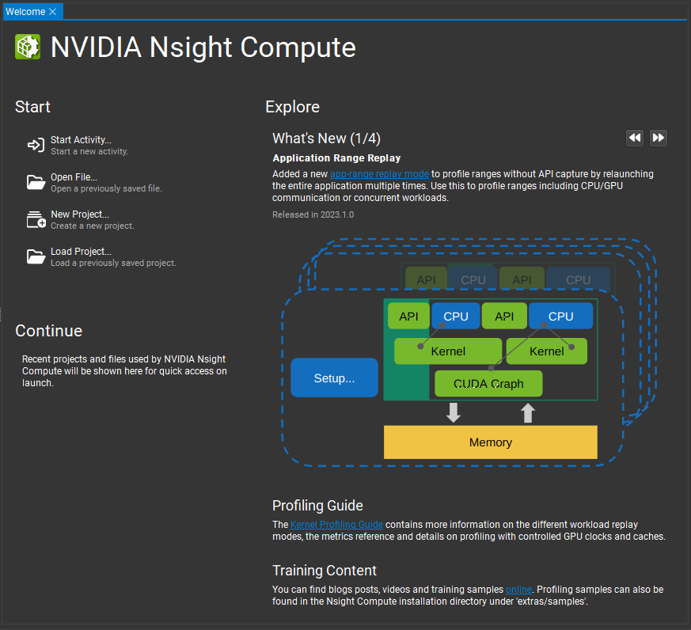

## 2.1. 交互式配置文件活动 Interactive Profile Activity

### 2.1.1 从NVIDIA Nsight Compute启动目标应用程序

启动NVIDIA Nsight  Compute时，会出现欢迎页面。单击“快速启动”打开“连接”对话框。如果未显示“连接”对话框，则可以使用主工具栏中的“连接”按钮打开该对话框，只要您当前未连接即可。从connection（连接）下拉菜单中选择左侧的目标平台和连接目标（机器）。如果您选择了本地目标平台，localhost将成为可用的连接。使用+按钮添加新的连接目标。然后，在Launch（启动）选项卡中填写详细信息，继续操作。在Activity（活动）面板中，选择Interactive Profile（交互式配置文件）活动以启动一个会话，该会话允许控制目标应用程序的执行并以交互方式选择感兴趣的内核。按Launch启动会话。

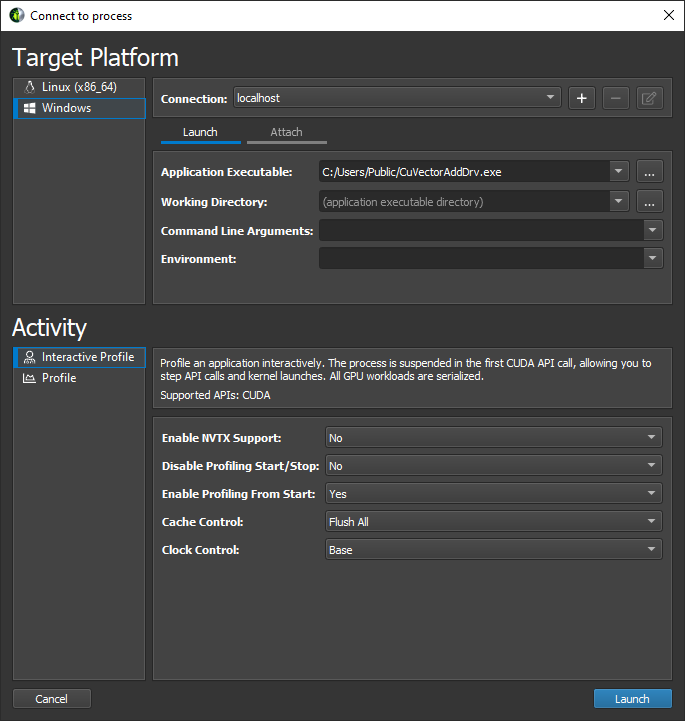

### 2.1.2 从命令行使用工具检测启动目标应用程序

ncu可以充当一个简单的包装器，强制目标应用程序加载工具插入所需的库。参数--mode=launch指定应在第一次插入指令的API调用之前启动并挂起目标应用程序。这样，应用程序就会等待，直到我们连接到UI。

```shell
$ ncu --mode=launch CuVectorAddDrv.exe
```

### 2.1.3 启动NVIDIA Nsight Compute并连接到目标应用程序

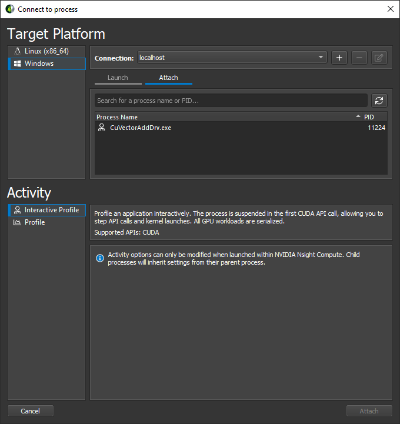

选择对话框顶部的目标计算机以连接并更新可连接应用程序的列表。默认情况下，如果目标与当前本地平台匹配，则会预先选择localhost。选择“附加”选项卡和感兴趣的目标应用程序，然后按“附加”。连接后，NVIDIA Nsight  Compute的布局将变为步进模式，允许您控制对插入指令的API的任何调用的执行。连接时，API流窗口指示目标应用程序在第一个API调用之前等待。

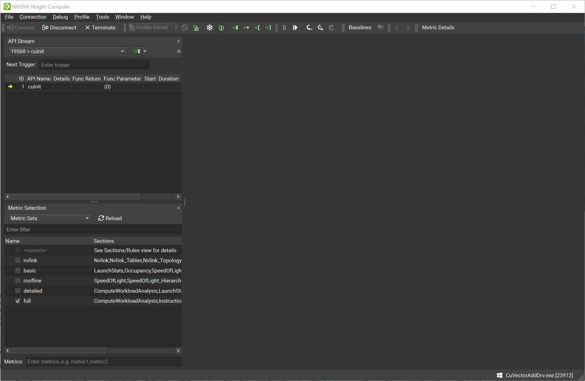

### 2.1.4 控制应用程序执行

使用API流窗口将调用逐步插入插入指令的API。顶部的下拉列表允许在应用程序的不同CPU线程之间切换。Step In（F11）、Step Over（F10）和Step  Out（Shift+F11）可从Debug（调试）菜单或相应的工具栏按钮获得。步进时，会捕获函数返回值和函数参数。

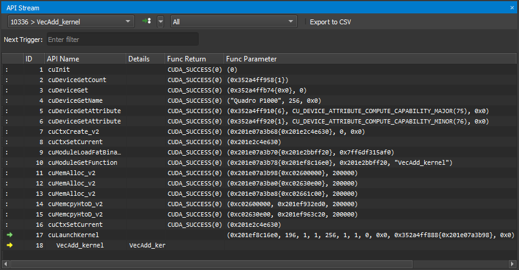

使用Resume  (F5)和Pause来允许程序自由运行。冻结控制可用于定义当前不在焦点中的线程的行为，即在线程下拉列表中选中的线程。默认情况下，API流在任何返回错误代码的API调用上停止。这可以在Debug菜单中通过Break On API Error进行切换。

### 2.1.5 隔离内核启动

要快速隔离内核启动以进行评测，请使用API Stream窗口工具栏中的Run To Next kernel按钮跳到下一次内核启动。在执行内核启动之前，执行将停止。

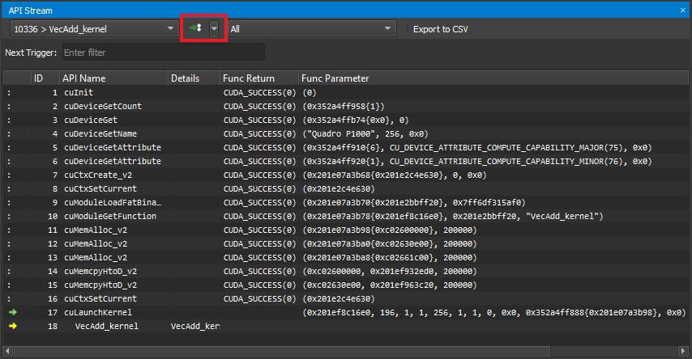

### 2.1.6 评测内核启动

一旦目标应用程序的执行在内核启动时被挂起，UI中就可以使用其他操作。这些操作可以从菜单或工具栏中获得。请注意，如果API流不处于合格状态(不是在内核启动或在不支持的GPU上启动)，这些操作将被禁用。要进行分析，请按profile Kernel并等待结果显示在Profiler Report中。分析进度报告在右下角的状态栏中。

除了手动选择Profile，还可以从Profile菜单中启用Auto  Profile。如果启用，将使用当前部分配置对匹配当前内核过滤器(如果有的话)的每个内核进行分析。如果要在无人值守的情况下对应用程序进行分析，或者要分析的内核启动数量非常大，那么这一点特别有用。可以使用度量选择工具窗口5.7 [Metric Selection](https://docs.nvidia.com/nsight-compute/NsightCompute/index.html#tool-window-sections-info) 启用或禁用区段。

配置文件系列允许一次配置一组配置文件结果的集合。集合中的每个结果都使用不同的参数进行概要分析。序列对于在不需要多次重新编译和重新运行应用程序的情况下，跨大量参数集研究内核的行为非常有用。

有关此活动中可用选项的详细说明，请参阅交互式配置文件活动 3.2 [Interactive Profile Activity](https://docs.nvidia.com/nsight-compute/NsightCompute/index.html#connection-activity-interactive). 。

## 2.2. 非交互式配置文件活动 Non-Interactive Profile Activity

### 2.2.1 从NVIDIA Nsight Compute启动目标应用程序

启动NVIDIA Nsight  Compute时，会出现欢迎页面。单击“快速启动”打开“连接”对话框。如果未显示“连接”对话框，则可以使用主工具栏中的“连接”按钮打开该对话框，只要您当前未连接即可。从Connection下拉列表中选择左侧的目标平台和本地主机。然后，填写发布详细信息。在“Activity”面板中，选择“Profile activity”以启动一个会话，该会话预配置配置文件会话并启动命令行探查器以收集数据。提供“Output File”名称以启用使用“Launch”按钮启动会话。

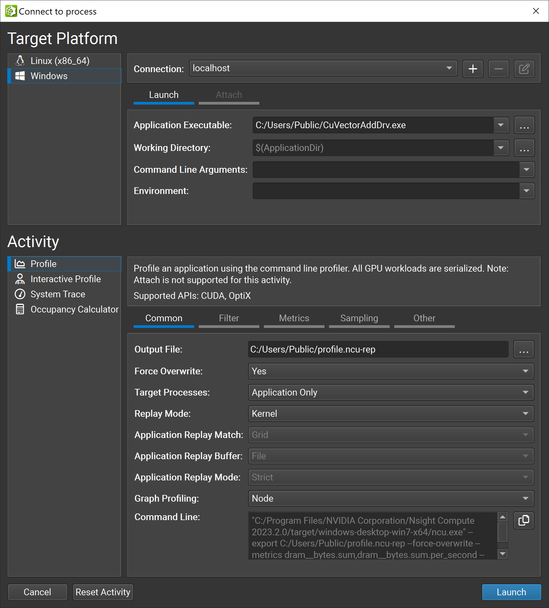

### 2.2.2 其他启动选项

有关这些选项的详细信息，请参见命令行选项[Command Line Options](https://docs.nvidia.com/nsight-compute/NsightComputeCli/index.html#command-line-options).。这些选项分为多个选项卡：Filter选项卡显示了用于指定应分析哪些内核的选项。选项包括内核正则表达式过滤器、要跳过的启动次数以及要配置文件的启动总数。Sections选项卡允许您为每次内核启动选择应收集的部分。将鼠标悬停在上，可以将其描述作为工具提示查看。要更改默认情况下启用的截面，请使用 [Metric Selection](https://docs.nvidia.com/nsight-compute/NsightCompute/index.html#tool-window-sections-info)工具窗口。采样选项卡允许您为每次内核启动配置采样选项。其他选项卡包括通过--metrics选项收集NVTX信息或自定义度量的选项。

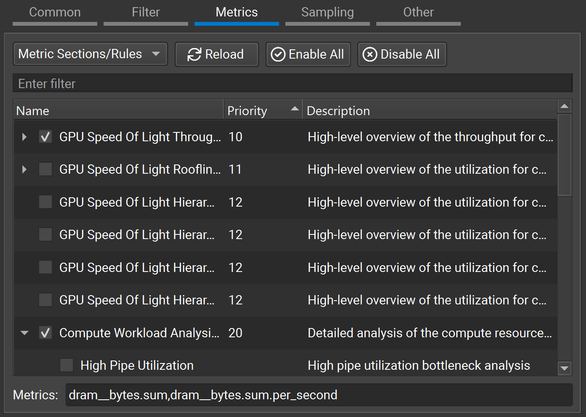

有关此活动中可用选项的详细说明，请参阅配置文件活动。3.3 [Profile Activity](https://docs.nvidia.com/nsight-compute/NsightCompute/index.html#connection-activity-non-interactive).  

## 2.3.系统跟踪活动

### 2.3.1 从NVIDIA Nsight Compute启动目标应用程序

启动NVIDIA Nsight  Compute时，会出现欢迎页面。单击“快速启动”打开“连接”对话框。如果未显示“连接”对话框，则可以使用主工具栏中的“连接”按钮打开该对话框，只要您当前未连接即可。从Connection（连接）下拉列表中，选择左侧的本地目标平台和本地主机。然后，填写发布详细信息。在“Activity”面板中，选择“System Trace”活动以启动具有预配置设置的会话。按Launch启动会话。

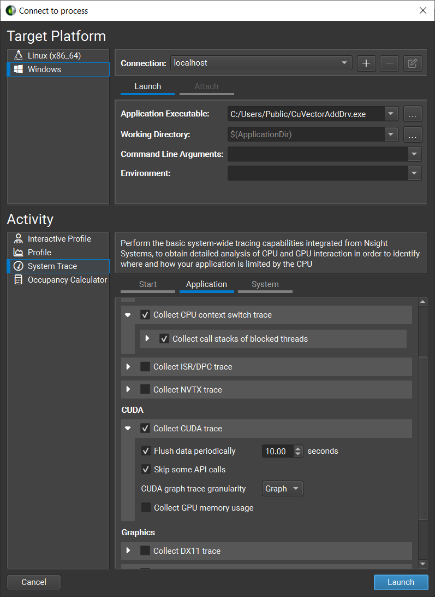

### 2.3.2 其他启动选项

有关这些选项的更多详细信息，请参阅   [System-Wide Profiling Options](https://docs.nvidia.com/nsight-systems/UserGuide/index.html#linux-system-wide-profiling-options).                                                               

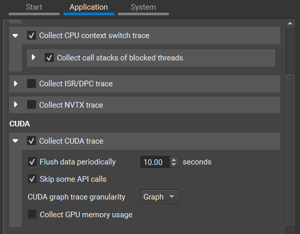

会话完成后，Nsight  Systems报告将在新文档中打开。默认情况下，会显示时间轴视图。它提供了CPU和GPU活动的详细信息，并有助于理解应用程序的整体行为和性能。一旦CUDA内核被确定在关键路径上并且没有达到性能预期，右键单击内核启动时间线，然后从上下文菜单中选择Profile kernel。将打开一个新的“连接”对话框，该对话框已预先配置为评测所选内核启动。使用非交互式配置文件活动继续优化所选内核

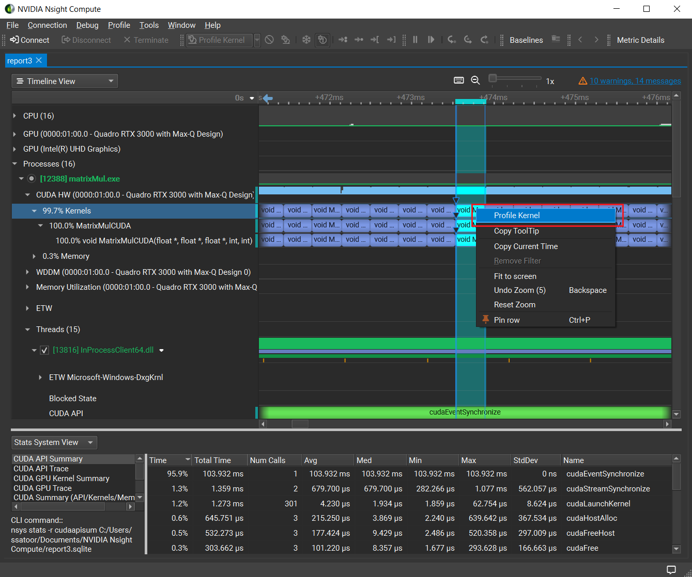

## 2.4.浏览报告

### 2.4.1 浏览报告

配置文件报告默认显示在“详细信息”Details 页面上。您可以使用报表左上角标记为“页面”的下拉列表在报表的不同报表页面之间切换。也可以使用Ctrl+Shift+N和Ctrl+Shift+P快捷键或相应的工具栏按钮分别导航下一页和上一页。报告可以包含任意数量的内核启动结果。“结果”下拉列表允许在报告中的不同结果之间进行切换。

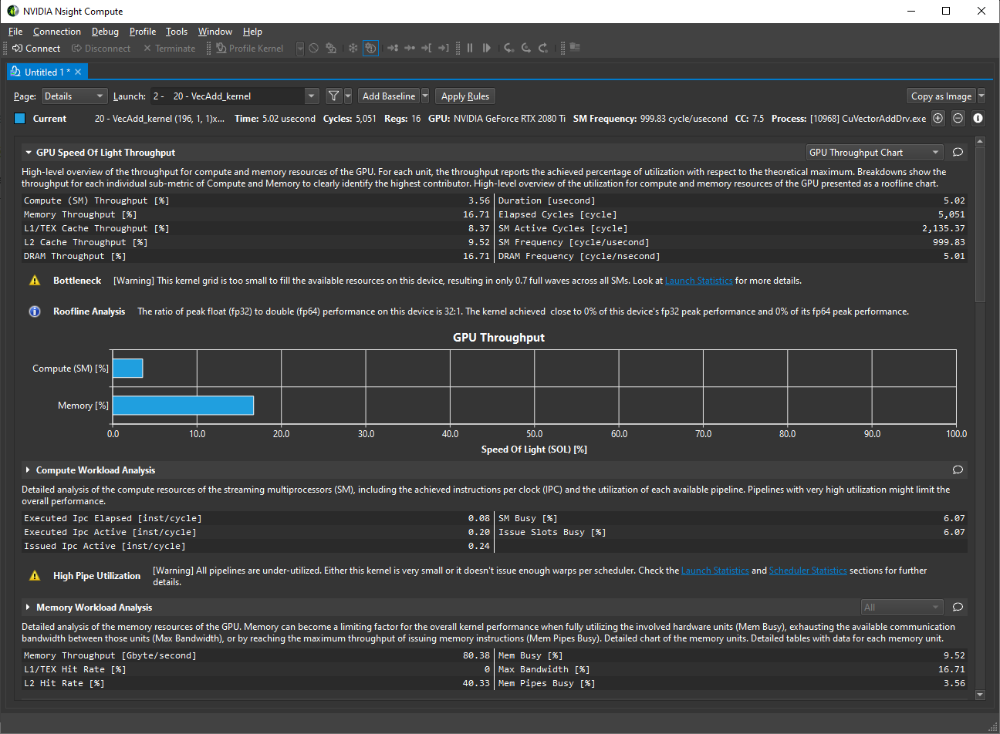

### 2.4.2 不同的多个结果

在Details（详细信息）页面上，按下Add  Baseline（添加基线）按钮，使当前结果成为该报告中的所有其他结果以及在NVIDIA Nsight  Compute的同一实例中打开的任何其他报告的基线。如果设置了基线 baseline，“详细信息”Details页面上的每个元素都显示两个值：焦点中结果的当前值和基线的相应值或与相应基线值相比的变化百分比。

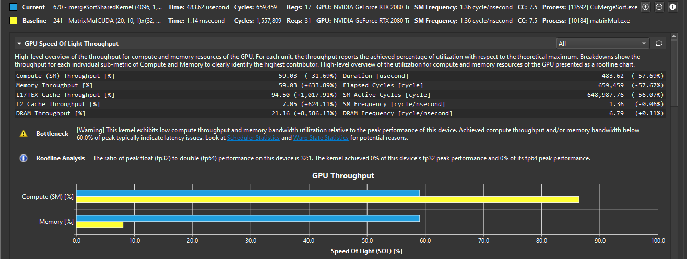

使用下拉按钮、配置文件菜单或相应工具栏按钮中的“清除基线”条目可以删除所有基线。有关详细信息，请参见基线 7 [Baselines](https://docs.nvidia.com/nsight-compute/NsightCompute/index.html#baselines)。

如果是加载两个离线的`.ncu-rep`文件，作为Baseline，打开 ncu-ui 工具并加载第一个 ncu-rep 文件。你可以通过单击 "File" 菜单并选择 "Open" 命令来加载文件。

加载第二个 ncu-rep 文件。你可以通过单击 "File" 菜单并选择 "Add Baseline" 命令来加载第二个文件。这将打开一个文件对话框，你可以在其中选择要加载的第二个 ncu-rep 文件。

### 2.4.3 执行规则

在“详细信息”页面上，某些部分可能会提供规则。按Apply按钮执行单个规则。顶部的“应用规则”按钮执行当前焦点结果的所有可用规则。规则也可以由用户定义。有关详细信息，请参见[Customization Guide](https://docs.nvidia.com/nsight-compute/CustomizationGuide/index.html#rule-system)。

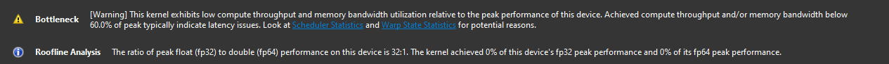

# 3.连接对话框

使用“连接”Connection对话框可以启动并连接到本地和远程平台上的应用程序。首先选择要进行分析的目标平台。默认情况下（如果支持），将选择您的本地平台。选择要在其上启动目标应用程序或连接到正在运行的进程的平台。

Connection Dialog

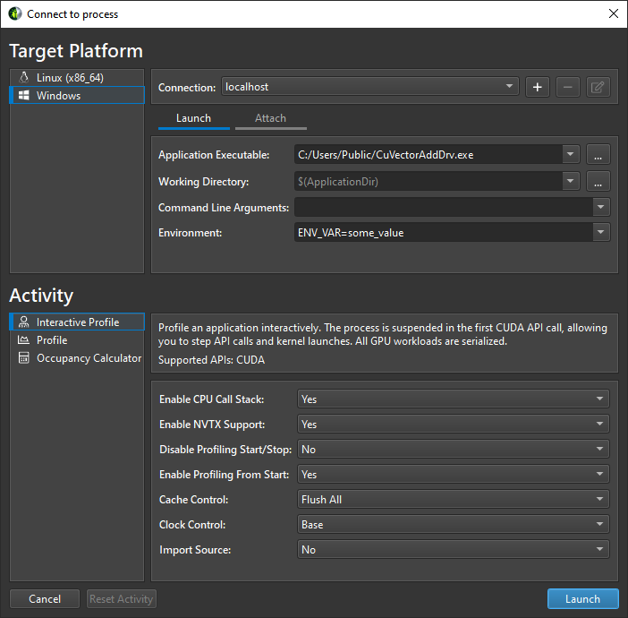

使用远程平台时，系统会要求您在顶部下拉框中选择或创建连接。要创建新连接，请选择+并输入您的连接详细信息。使用本地平台时，将选择localhost作为默认值，不需要进一步的连接设置。如果评测将在同一平台的远程系统上进行，则您仍然可以创建或选择远程连接。

根据您的目标平台，选择“Launch”或“Remote Launch”以启动应用程序以在目标上进行分析。请注意，只有在目标平台上支持远程启动时，远程启动才可用。

填写应用程序的以下启动详细信息：

- **Application Executable:** 指定要启动的根应用程序。请注意，这可能不是您想要评测的最终应用程序。它可以是创建其他进程的脚本或启动器。                                                       
- **Working Directory:** 启动应用程序的目录。
- **Command Line Arguments:** 指定要传递给应用程序可执行文件的参数                                                 
- **Environment:** 要为启动的应用程序设置的环境变量                                                  

选择Attach将分析器附加到已经在目标平台上运行的应用程序上。此应用程序必须使用另一个NVIDIA Nsight Compute CLI实例启动。该列表将显示可以附加的目标系统上运行的所有应用程序进程。选择刷新按钮以重新创建此列表。

最后，为launched或attached的应用程序选择要在目标上运行的Activity。请注意，并非所有活动都必须与所有目标和连接选项兼容。目前，存在以下活动

- [Interactive Profile Activity](https://docs.nvidia.com/nsight-compute/NsightCompute/index.html#connection-activity-interactive)
- [Profile Activity](https://docs.nvidia.com/nsight-compute/NsightCompute/index.html#connection-activity-non-interactive)
- [System Trace Activity](https://docs.nvidia.com/nsight-compute/NsightCompute/index.html#quick-start-system-trace)
- [Occupancy Calculator](https://docs.nvidia.com/nsight-compute/NsightCompute/index.html#occupancy-calculator)

## 3.1. 远程连接

支持SSH的远程设备也可以在“连接”对话框中配置为目标。要配置远程设备，请确保选择支持SSH的目标平台，然后按+按钮。将显示以下配置对话框。

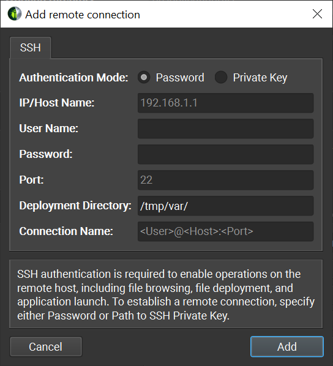

NVIDIA Nsight Compute同时支持密码和私钥身份验证方法。在此对话框中，选择身份验证方法并输入以下信息：

**Password** 

- **IP/Host Name:** The IP address or host name of the target device.                                                                           
- **User Name:** The user name to be used for the SSH connection.                                                                           
- **Password:** The user password to be used for the SSH connection.                                                                           
- **Port:** The port to be used for the SSH connection.  (The default value is 22)                                                                           
- **Deployment Directory:** 在目标设备上用于部署支持文件的目录。指定的用户必须具有对该位置的写权限。                                                                       
- **Connection Name:** The name of the remote connection that will                                       show up in the Connection Dialog. If not set, it will default                                       to <User>@<Host>:<Port>.                                                                           

 **Private Key** 

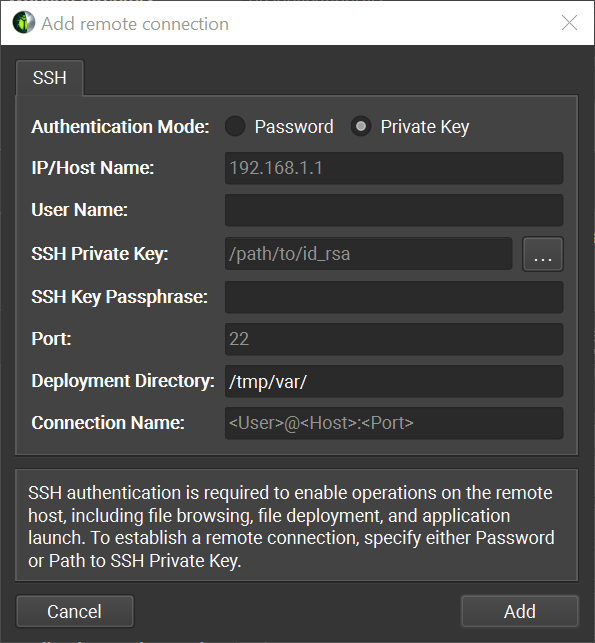

- **IP/Host Name:** The IP address or host name of the target device.                                                                           
- **User Name:** The user name to be used for the SSH connection.                                                                           
- **SSH Private Key:** The private key that is used to authenticate to SSH server.                                                                           
- **SSH Key Passphrase:** The passphrase for your private key.                                                                           
- **Port:** The port to be used for the SSH connection.  (The default value is 22)                                                                           
- **Deployment Directory:** 在目标设备上用于部署支持文件的目录。指定的用户必须具有对该位置的写权限。                                                                       
- **Connection Name:** The name of the remote connection that will                                       show up in the Connection Dialog. If not set, it will default                                       to <User>@<Host>:<Port>.                                                                           

除了路径指定的密钥文件和普通密码认证外，NVIDIA Nsight Compute还支持键盘交互认证、标准密钥文件路径搜索和SSH代理。

输入所有信息后，单击Add按钮以使用这个新连接。

当在Connection Dialog中选择远程连接时，Application Executable文件浏览器将使用配置的SSH连接浏览远程文件系统，允许用户在远程设备上选择目标应用程序。

当在远程设备上启动activity时，将执行以下步骤：

1.  command line profiler and supporting files 被复制到远程设备上的Deployment Directory 中。(只复制不存在或过期的文件。)
2. 打开通信通道，为UI和Application Executable之间的通信做准备。
   * 对于Interactive Profile活动，将在主机上启动SOCKS代理。
   * 对于Non-Interactive Profile活动，在目标机器上打开一个远程转发通道，将概要文件信息传输回主机。
3. Application Executable 在远程设备上执行。
   * 对于Interactive Profile活动，将建立到远程应用程序的连接，并开始分析会话。
   * 对于Non-Interactive Profile活动，远程应用程序在命令行分析器下执行，并生成指定的报告文件。
4. 对于non-interactive分析活动，生成的报告文件被复制回主机并打开。

每个步骤的进度都显示在Progress Log中。

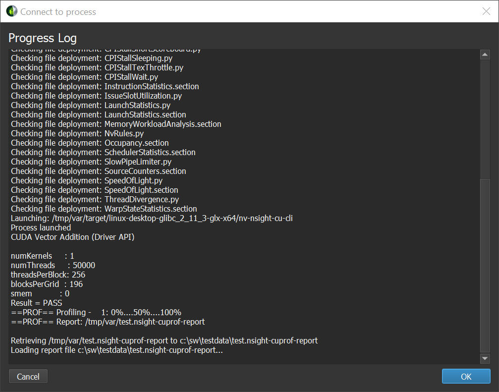

注意，一旦远程启动了任何一种活动类型，就可以在远程设备上的Deployment Directory中找到进一步分析会话所需的工具。

在Linux和Mac主机平台上，NVIDIA Nsight Compute支持在目标机器上进行SSH远程评测，这些目标机器不能通过ProxyJump和ProxyCommand SSH选项从UI运行的机器直接寻址。

这些选项可用于指定要连接到的中间主机或要运行的实际命令，以获得连接到目标主机上SSH服务器的套接字，并可添加到SSH配置文件中。

请注意，对于这两个选项，NVIDIA Nsight Compute都运行外部命令，并且不使用在“连接”对话框中输入的凭据来实现任何向中间主机进行身份验证的机制。这些凭据将仅用于向机器链中的最终目标进行身份验证。

当使用ProxyJump选项时，NVIDIA Nsight Compute使用OpenSSH客户端与中间主机建立连接。这意味着为了使用ProxyJump或ProxyCommand，必须在主机上安装支持这些选项的OpenSSH版本。

在这种情况下，向中间主机进行身份验证的一种常用方法是使用SSH代理并让它保存用于身份验证的私钥。

由于使用了OpenSSH SSH客户端，您还可以使用SSH askpass机制以交互方式处理这些身份验证。

在慢速网络上，通过SSH进行远程分析的连接可能会超时。如果是这种情况，ConnectTimeout选项可用于设置所需的超时值。

通过SSH进行远程评测的一个已知限制是，如果NVIDIA Nsight Compute试图通过SSH连接到其运行的同一台机器来进行远程评测，则可能会出现问题。在这种情况下，解决方法是通过localhost进行本地评测。

## 3.2. 交互式配置文件活动 Interactive Profile Activity

Interactive Profile活动允许您启动一个会话，该会话控制目标应用程序的执行，类似于调试器。您可以逐步执行API调用和工作负载（CUDA内核）、暂停和恢复，并以交互方式选择感兴趣的内核和要收集的度量。

此活动当前不支持分析或附加到子进程。

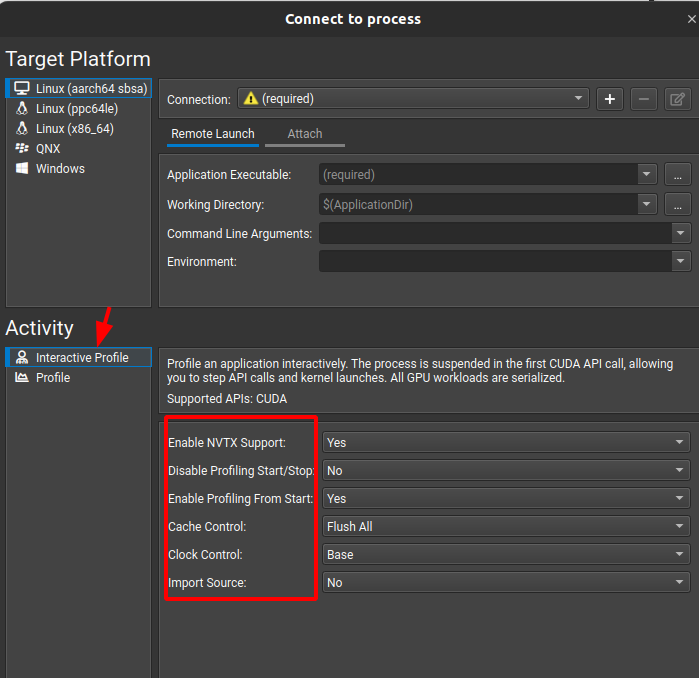

* **Enable CPU Call Stack**

  在每个评测内核启动的位置收集CPU侧的调用堆栈。

* **Enable NVTX Support**

  收集应用程序或其库提供的NVTX信息。需要支持进入特定NVTX上下文。

* **Disable Profiling Start/Stop**

  忽略应用程序对cu(da)ProfilerStart或cu(da)ProfilerStop的调用。

* **Enable Profiling From Start**

  从应用程序开始启用分析。如果应用程序在第一次调用此API之前调用cu(da)ProfilerStart和内核，则禁用此功能很有用。请注意，禁用此功能并不会阻止您手动分析内核。

* **Cache Control**

  在分析期间控制GPU缓存的行为。允许值:对于Flush All，在分析期间的每个内核重播迭代之前刷新所有GPU缓存。虽然在不使缓存失效的情况下，应用程序执行环境中的度量值可能略有不同，但这种模式在重播通道和目标应用程序的多次运行中提供了最可重现的度量结果。

  对于Flush None，在分析期间不会刷新GPU缓存。如果度量收集只需要一个内核重放通道，这可以提高性能并更好地复制应用程序行为。然而，一些度量结果将根据先前的GPU工作和重播迭代之间的变化而变化。这可能导致不一致和越界的度量值。

* **Clock Control**

  在分析期间控制GPU时钟的行为。允许值:对于Base, GPC和内存时钟在分析期间被锁定到各自的基频。这对热节流没有影响。对于None，在分析期间不会更改GPC或内存频率。

* **Import Source**

  启用将可用的源文件永久导入到报表中。在“源查找”文件夹中搜索缺失的源文件。源信息必须嵌入到可执行文件中，例如通过-lineinfo编译器选项。导入的文件在源页面上的CUDA-C视图中使用。

* **Graph Profiling**

  设置CUDA图是否应该作为单独的节点或完整的图进行步进和分析。有关此模式的更多信息，请参阅内核分析指南[Kernel Profiling Guide](https://docs.nvidia.com/nsight-compute/ProfilingGuide/index.html#graph-profiling)。

* **Additional Options**

  所有剩余的选项都映射到对应的命令行分析器。有关详细信息，请参见命令行选项。[Command Line Options](https://docs.nvidia.com/nsight-compute/NsightComputeCli/index.html#command-line-options)

## 3.4.复位

连接对话框中的条目将保存为当前项目的一部分。在自定义项目中工作时，只需关闭项目即可重置对话框。

当不在自定义项目中工作时，条目将作为默认项目的一部分存储。您可以通过关闭NVIDIA Nsight Compute，然后从磁盘删除项目文件，从默认项目中删除所有信息。 [deleting the project file from disk](https://docs.nvidia.com/nsight-compute/NsightCompute/index.html#projects)

# 4.主菜单和工具栏

主菜单和工具栏上的信息。


## 4.1. 主菜单

* File                                                            

  - **New Project**   Create new profiling [Projects](https://docs.nvidia.com/nsight-compute/NsightCompute/index.html#projects) with the [New Project Dialog](https://docs.nvidia.com/nsight-compute/NsightCompute/index.html#projects-dialogs__new-project).                                                                     

  - **Open Project**  Open an existing profiling project.                                                                     

  - **Recent Projects** Open an existing profiling project from the list of recently used projects.                                                                     

  - **Save Project**  Save the current profiling project.                                                                     

  - **Save Project As**  Save the current profiling project with a new filename.                                                                     

  - **Close Project**   Close the current profiling project.                                                                     

  - **New File**  Create a new file.                                                                     

  - **Open File**  Open an existing file.                                                                     

  - **Open Remote File **从远程主机下载现有文件并在本地打开它。打开的文件将只存在于内存中，不会写入本地机器的磁盘，除非用户显式地保存它。有关选择要从中下载文件的远程主机的详细信息，请参见远程连接一节。[Remote Connections](https://docs.nvidia.com/nsight-compute/NsightCompute/index.html#remote-connections)

    只能从远程目标打开本地支持的文件类型的子集。下表列出了可以远程打开的文件类型。

    | Extensions           | Description                             | Supported              |
    | -------------------- | --------------------------------------- | ---------------------- |
    | ncu-rep              | Nsight Compute Profiler Report          | Yes                    |
    | ncu-occ              | Occupancy Calculator File               | Yes                    |
    | ncu-bvh              | OptiX AS Viewer File                    | Yes (except on MacOSX) |
    | section              | Section Description                     | No                     |
    | cubin                | Cubin File                              | No                     |
    | cuh,h,hpp            | Header File                             | No                     |
    | c,cpp,cu             | Source File                             | No                     |
    | txt                  | Text file                               | No                     |
    | nsight-cuprof-report | Nsight Compute Profiler Report (legacy) | Yes                    |

  - **Save**   Save the current file

  - **Save As**   Save a copy of the current file with a different name or type or in a different location.   

  - **Save All Files**     Save all open files.

  - **Close**     Close the current file.

  - **Close All Files**  Close all open files.

  - **Recent Files**  Open an existing file from the list of recently used files.

  - **Exit**    Exit Nsight Compute.

* Connection

  * **Connect** 打开“连接”对话框以启动或连接到目标应用程序。已连接时禁用。
  * **Disconnect** 断开与当前目标应用程序的连接，允许应用程序正常继续并可能重新连接。
  * **Terminate** 立即断开与当前目标应用程序的连接并终止该应用程序。

* Debug                                                            

  * **Pause** 在下一个拦截的 API 调用或启动时暂停目标应用程序。

  * **Resume** 继续执行目标应用程序。

  * **Step In** 进入当前的 API 调用或启动，直到下一个嵌套调用（如果有）或下一个 API 调用，否则暂停。

  * **Step Over** 跳过当前的 API 调用或启动，并在下一个非嵌套的 API 调用或启动处暂停。

  * **Step Out** 从当前的嵌套 API 调用或启动跳出，到下一个非父级的 API 调用或启动。

  * **Freeze API**

    当禁用时，在步进或继续执行时，所有 CPU 线程都是启用的并继续运行，只有当至少一个线程到达下一个 API 调用或启动时，所有线程才会停止。这也意味着在步进或继续执行时，当前选定的线程可能会发生变化，因为旧的选定线程没有向前推进，API 流会自动切换到具有新的 API 调用或启动的线程。当启用时，只有当前选定的 CPU 线程是启用的，所有其他线程都被禁用和阻塞。

    现在，只有当当前线程到达下一个 API 调用或启动时，步进才会完成。选定的线程永远不会更改。然而，如果选定的线程不调用任何进一步的 API 调用或在屏障处等待另一个线程取得进展，则步进可能无法完成并无限期挂起。在这种情况下，暂停，选择另一个线程，并继续步进，直到原始线程解除阻塞。在此模式下，只有选定的线程会向前推进。

  * **Break On API Error** 当启用时，在继续执行或步进时，只要一个 API 调用返回错误代码，就会暂停执行。
  * **Run to Next Kernel** 查看 [API Stream](https://docs.nvidia.com/nsight-compute/NsightCompute/index.html#tool-window-api-stream)  工具窗口。
  * **Run to Next API Call** 查看 [API Stream](https://docs.nvidia.com/nsight-compute/NsightCompute/index.html#tool-window-api-stream) 工具窗口。
  * **Run to Next Range Start** 查看 [API Stream](https://docs.nvidia.com/nsight-compute/NsightCompute/index.html#tool-window-api-stream)  工具窗口。
  * **Run to Next Range End** 查看 [API Stream](https://docs.nvidia.com/nsight-compute/NsightCompute/index.html#tool-window-api-stream)  工具窗口。
  * **API Statistics** 打开 API 统计工具窗口。
  * **API Stream** 打开 API 流工具窗口。
  * **Resources** 打开资源工具窗口。
  * **NVTX** 打开 NVTX 工具窗口。

* Profile

  - Profile Kernel: 在内核启动时暂停，使用当前配置选择配置文件。

  - Profile Series: 在内核启动时暂停，打开Profile Series配置对话框以设置和收集一系列的配置结果。

  - Auto Profile: 启用或禁用自动配置文件。如果启用，每个与当前内核过滤器匹配的内核都将使用当前部分配置进行配置文件。

  - Baselines: 打开Baselines工具窗口。

  - Clear Baselines: 清除所有当前基线。

  - Import Source: 永久导入已解析的源文件到报告中。现有内容可能会被覆盖。

  - Section/Rules Info: 打开度量选择工具窗口。[Metric Selection](https://docs.nvidia.com/nsight-compute/NsightCompute/index.html#tool-window-sections-info)

* Tools

  - Project Explorer: 打开项目资源管理器工具窗口。

  - Output Messages: 打开输出消息工具窗口。

  - Options: 打开选项对话框。

* Window

  - Save Window Layout: 允许您为当前布局指定名称。布局将保存到文档目录中的Layouts文件夹中，命名为“.nvlayout”文件。

  - Apply Window Layout: 保存布局后，您可以使用“应用窗口布局”菜单项来恢复它们。只需从您想要应用的子菜单中选择条目即可。

  - Manage Window Layout: 允许您删除或重命名旧布局。

  - Restore Default Layout: 将视图恢复到其原始大小和位置。

  - Show Welcome Page: 打开欢迎页面。

* Help

  - Documentation: 打开最新的NVIDIA Nsight Compute在线文档。

  - Documentation (local): 打开随工具一起提供的本地HTML文档的NVIDIA Nsight Compute文档。

  - Check For Updates: 在线检查是否有可供下载的更新版本的NVIDIA Nsight Compute。

  - Reset Application Data: 重置保存在磁盘上的所有NVIDIA Nsight Compute配置数据，包括选项设置、默认路径、最近的项目引用等。这不会删除保存的报告。

  - Send Feedback: 打开一个对话框，允许您发送错误报告和功能建议。可选地，反馈包括基本系统信息、截图或其他文件（如配置文件报告）。

  - About: 打开关于NVIDIA Nsight Compute版本的信息对话框。

## 4.2. 主工具栏

主工具栏显示了主菜单中常用的操作。有关它们的描述，请参阅主菜单。

## 4.3. 状态横幅

状态横幅用于显示重要的消息，例如性能分析器错误。可以通过点击“X”按钮来关闭消息。同时显示的横幅数量有限，如果出现新的消息，旧的消息可能会自动关闭。使用“输出消息”窗口可以查看完整的消息历史记录。

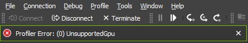

# 5. 工具窗口

## 5.1. API 统计

当 NVIDIA Nsight Compute 连接到目标应用程序时，API 统计窗口可用。它会在连接建立后默认打开。您可以通过主菜单中的 "Debug > API Statistics" 重新打开它。

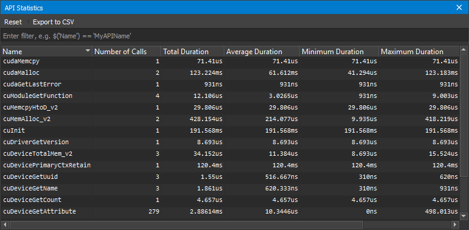

每当目标应用程序暂停时，API 统计窗口会显示跟踪的 API 调用摘要及一些统计信息，例如调用次数、总时长、平均时长、最短时长和最长时长。请注意，此视图不能替代 Nsight Systems用于优化应用程序的 CPU 性能。

"Reset" 按钮会删除所有已收集的统计数据，并开始新的收集。使用 "Export to CSV" 按钮将当前统计数据导出为 CSV 文件。

## 5.2. API 流

当 NVIDIA Nsight Compute 连接到目标应用程序时，API 流窗口可用。它会在连接建立后默认打开。您可以通过主菜单中的 "Debug > API Stream" 重新打开它

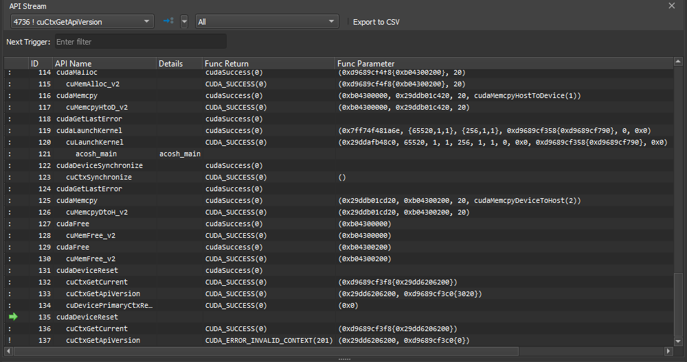

当目标应用程序暂停suspended时，该窗口显示 API 调用和追踪的内核启动的历史记录。当前暂停的 API 调用或内核启动（活动）会用黄色箭头标记。如果暂停在子调用上，父调用会用绿色箭头标记。在执行之前，API 调用或内核会被暂停。

对于每个活动，还会显示其他信息，如内核名称或函数参数（Func Parameters）和返回值（Func Return）。请注意，只有在跳出或跳过 API 调用后，函数的返回值才会变得可用。

使用“Current Thread ”下拉菜单在活动线程之间切换。下拉菜单显示线程  ID，后跟当前的 API 名称。触发器下拉菜单提供几个选项，通过相邻的“>>”按钮执行。"Run to Next Kernel"  会继续执行，直到在任何启用的线程中找到下一个内核启动。"Run to Next API Call"  会继续执行，直到在任何启用的线程中找到与下一个触发器匹配的 API 调用。"Run to Next Range Start"  会继续执行，直到找到下一个活动分析器范围的起始点。分析器范围是使用 cu(da)ProfilerStart/Stop API  调用定义的。"Run to Next Range Stop" 会继续执行，直到找到下一个活动分析器范围的结束点。"API Level"  下拉菜单可更改在流中显示的 API 级别。"Export to CSV" 按钮将当前可见的流导出到 CSV 文件。

## 5.3. 基准线

通过单击 Profile 菜单中的 Baselines 条目，可以打开基准线工具窗口。它提供了一个集中管理配置的基准线的地方。（有关如何从配置文件结果创建基准线的信息，请参阅 Baselines。）

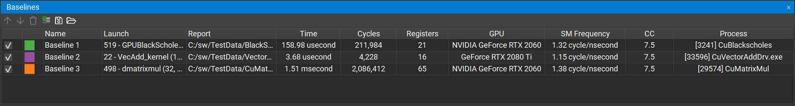

可以通过单击表格行中的复选框来控制基准线的可见性。当复选框被选中时，基准线将在摘要标题以及所有部分的所有图表中可见。当取消选中时，基准线将被隐藏，并且不会对度量差异计算产生影响。

可以通过双击表格行中的颜色样本来更改基准线的颜色。打开的颜色对话框提供选择任意颜色的能力，并提供与默认基准线颜色旋转关联的预定义颜色调色板。

可以通过双击表格行中的名称列来更改基准线的名称。名称不能为空，并且必须小于在选项对话框中指定的最大基准线名称长度。

可以通过在工具栏中单击“Move Baseline Up”和“Move Baseline Down”按钮来更改所选基准线的 Z 顺序。当基准线向上或向下移动时，其新位置将在报告标题以及每个图表中反映出来。目前，一次只能移动一个基准线。

可以通过在工具栏中单击“Clear Selected Baselines”按钮来移除所选的基准线。通过单击全局工具栏或工具窗口工具栏中的“Clear All Baselines”按钮，可以一次性移除所有基准线。

可以通过在工具栏中单击“Save Baselines”按钮将配置的基准线保存到文件中。默认情况下，基准线文件使用 .ncu-bln 扩展名。基准线文件可以在本地打开和/或与其他用户共享。

可以通过在工具栏中单击“Load Baselines”按钮加载基准线信息。加载基准线文件时，当前配置的基准线将被替换。在必要时，将向用户显示对话框以确认此操作。

可以使用详细信息页面部分标题中的图形条来可视化当前结果与基准线之间的差异。使用“Difference Bars”下拉菜单选择可视化模式。条形图从左到右延伸，并具有固定的最大值。

## 5.4. 指标详情

可以通过在 Profile 菜单中选择 Metric Details 条目或相应的工具栏按钮来打开指标详情工具窗口。当报告和工具窗口都打开时，可以在报告中选择一个指标，在工具窗口中显示额外的信息。它还包含一个搜索栏，用于在焦点报告中查找指标。

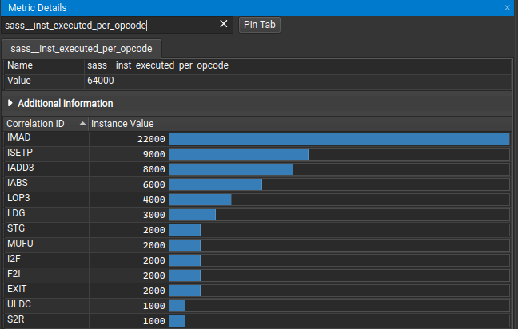

可以在“详细信息页”或“原始数据页”中选择报告指标。窗口将显示基本信息（指标名称、单位和原始值），以及其他信息，如扩展描述。

搜索栏可用于在焦点报告中打开指标。在输入时，它会显示可用的匹配项。输入的字符串必须与指标名称的开头匹配。

默认情况下，选择或搜索新指标会更新当前的默认选项卡。您可以单击“固定选项卡”按钮创建默认选项卡的副本，除非已经固定了相同的指标。这样可以保存多个选项卡，并快速在它们之间进行切换以比较值。

某些指标包含实例值。如果可用，它们会列在工具窗口中。实例值可以具有关联 ID，允许将个别值与其关联的实体进行关联，例如函数地址或指令名称。

## 5.5. NVTX

NVTX 窗口在 NVIDIA Nsight Compute  连接到目标应用程序时可用。如果关闭了该窗口，可以通过主菜单中的 Debug > NVTX  重新打开。每当目标应用程序暂停时，该窗口会显示当前选定线程中所有活动 NVTX 域和范围的状态。请注意，仅当启动命令行分析器实例时使用了  --nvtx 参数或在 NVIDIA Nsight Compute 启动对话框中启用了 NVTX 时，才会跟踪 NVTX 信息。

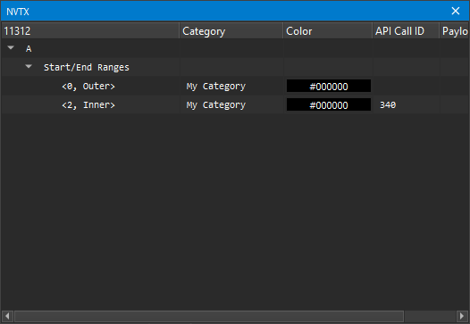

在 API 流窗口中使用“当前线程”下拉菜单可以更改当前选定的线程。NVIDIA Nsight Compute 支持 NVTX 命名资源，例如线程、CUDA 设备、CUDA 上下文等。如果使用 NVTX 命名资源，相应的 UI 元素将被更新。

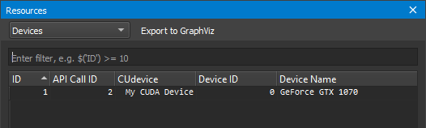

## 5.7. 资源窗口

当 NVIDIA Nsight Compute  连接到目标应用程序时，资源窗口可用。它显示当前已知资源（如 CUDA 设备、CUDA  流或内核）的信息。每当目标应用程序暂停时，窗口都会更新。如果关闭了该窗口，可以通过主菜单中的 Debug > Resources  重新打开。

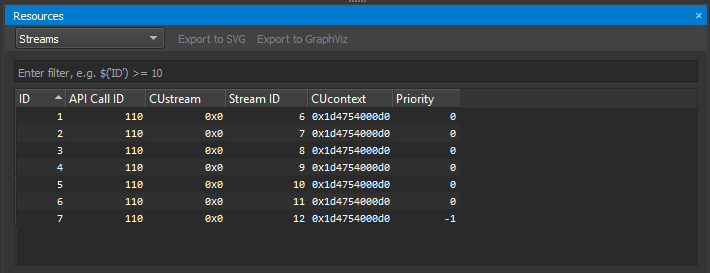

## 5.6. 资源

资源窗口在 NVIDIA Nsight Compute  连接到目标应用程序时可用。它显示当前已知资源（如 CUDA 设备、CUDA  流或内核）的信息。通过顶部的下拉菜单可以选择不同的视图，每个视图都特定于一种资源类型（上下文、流、内核等）。筛选编辑框允许您使用当前选定资源的列标题创建筛选表达式。

资源表格显示每个资源实例的所有信息。每个实例都有唯一的 ID，创建该资源时的 API 调用 ID，它的句柄、关联句柄和其他参数。当资源被销毁时，它将从表格中移除。

### 5.6.1. 内存分配

当使用异步的 malloc/free API 时，内存分配的资源视图还会包括以这种方式创建的内存对象。这些内存对象具有非零的内存池句柄。"Mode" 列将指示在分配相应对象时采取了哪种代码路径。这些模式包括：

- REUSE_STREAM_SUBPOOL：内存对象是在先前释放的内存中分配的。该内存由分配所在的流设置为当前的内存池支持。
- USE_EXISTING_POOL_MEMORY：内存对象是在先前释放的内存中分配的。该内存由分配所在的流的默认内存池支持。
- REUSE_EVENT_DEPENDENCIES：内存对象是在先前释放的另一个上下文流中分配的内存中分配的。分配流对释放操作存在流顺序依赖关系。CUDA 事件和空流交互可以创建所需的流顺序依赖关系。
- REUSE_OPPORTUNISTIC：内存对象是在先前释放的同一上下文流的另一个流中分配的内存中分配的。但是，释放和分配之间不存在依赖关系。此模式要求在请求分配时释放已经提交。执行行为的更改可能导致应用程序的多次运行产生不同的模式。
- REUSE_INTERNAL_DEPENDENCIES：内存对象是在先前释放的同一上下文流的另一个流中分配的内存中分配的。为了建立先前释放的内存的流顺序重用，可能已添加新的内部流依赖关系。
- REQUEST_NEW_ALLOCATION：为此内存对象必须分配新的内存，因为没有可行的可重用池内存。分配性能与使用非异步的 malloc/free API 相当。

### 5.6.2. Graphviz DOT 和 SVG 导出

一些显示的资源还可以使用 "Export to GraphViz" 或 "Export to SVG" 按钮导出为 GraphViz DOT 或 SVG 文件。

在导出 OptiX 遍历句柄时，遍历图节点类型将使用下表中描述的形状和颜色进行编码。

| Node Type               | Shape         | Color   |
| ----------------------- | ------------- | ------- |
| IAS                     | Hexagon       | #8DD3C7 |
| Triangle GAS            | Box           | #FFFFB3 |
| AABB GAS                | Box           | #FCCDE5 |
| Curve GAS               | Box           | #CCEBC5 |
| Sphere GAS              | Box           | #BEBADA |
| Static Transform        | Diamond       | #FB8072 |
| SRT Transform           | Diamond       | #FDB462 |
| Matrix Motion Transform | Diamond       | #80B1D3 |
| Error                   | Paralellogram | #D9D9D9 |

## 5.7. 指标选择

指标选择窗口可以从主菜单中通过 "Profile >  Metric Selection" 打开。它跟踪当前在 NVIDIA Nsight Compute  中加载的所有指标集、部分和规则，与特定的连接或报告无关。可以在 Profile  选项对话框中配置从中加载这些文件的目录。它用于检查可用的集合、部分和规则，以及配置应该收集哪些指标和应用哪些规则。您还可以指定一个逗号分隔的单独指标列表，应该收集哪些指标。该窗口有两个视图，可以使用其标题栏中的下拉菜单进行选择。

指标集视图显示所有可用的指标集。每个集合与一些指标部分相关联。您可以选择适合您希望收集性能指标的详细级别的集合。收集更详细信息的集合通常在分析期间会产生更高的运行时开销。

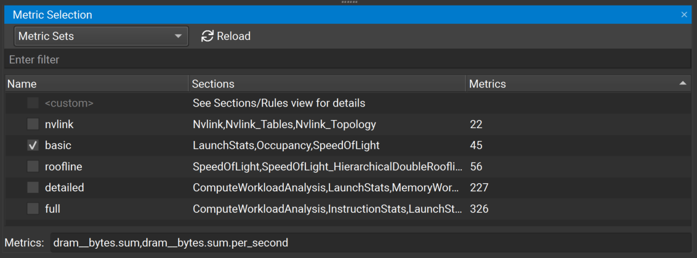

在此视图中启用一个集合时，Metric Sections/Rules 视图中的相关指标部分也会被启用。在此视图中禁用一个集合时，Metric Sections/Rules  视图中的相关部分也会被禁用。如果没有启用任何集合，或者在 Metric Sections/Rules 视图中手动启用/禁用了部分，那么  条目将被标记为活动，表示当前未启用任何部分集合。请注意，默认情况下启用了基本集合。

每当手动对一个内核进行分析，或者启用了自动分析时，只会收集在 Metric Sections/Rules 视图中启用的部分以及在输入框中指定的单独指标。同样，每当应用规则时，只有在此视图中启用的规则才会生效。

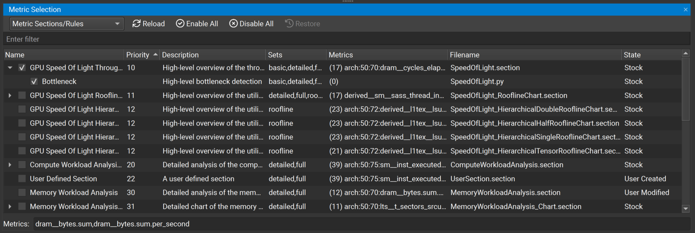

部分和规则的启用状态在 NVIDIA Nsight Compute 的启动之间是持久化的。点击 "Reload" 按钮可以重新从磁盘加载所有的部分和规则。如果找到了新的部分或规则，它们将尽可能被启用。如果在加载规则时发生任何错误，这些错误将在一个带有警告图标和错误描述的额外条目中列出。

使用 "Enable All" 和 "Disable All" 复选框可以一次性启用或禁用所有的部分和规则。"Filter" 文本框可以用来筛选当前在视图中显示的内容。它不会改变任何条目的激活状态。

表格显示了部分和规则及其激活状态，它们之间的关系和其他参数，如关联的指标或磁盘上的原始文件。与部分相关联的规则显示为其部分条目的子条目。独立于任何部分的规则显示在一个额外的独立规则条目下面。

在表格的 "Filename" 列中双击一个条目，可以将该文件作为文档打开。可以直接在 NVIDIA Nsight Compute 中进行编辑和保存。编辑文件后，必须选择 "Reload" 来应用这些更改。

当部分或规则文件被修改时，"State" 列中的条目将显示为 "User Modified"，以反映其已从默认状态进行了修改。当选中 "User Modified" 行时，"Restore" 按钮将被启用。点击 "Restore" 按钮将将条目恢复到其默认状态，并自动重新加载部分和规则。

类似地，当从配置的 "Sections Directory"（在 Profile 选项对话框中指定）中删除了默认的部分或规则文件时，"State" 列将显示为 "User Deleted"。可以使用 "Restore" 按钮还原 "User Deleted" 文件。

用户创建的部分和规则文件（未随 NVIDIA Nsight Compute 一起提供）在状态列中显示为 "User Created"。

有关 NVIDIA Nsight Compute 的默认部分列表和规则列表，请参阅 "Sections and Rules"。


# 6 Profiler Report

分析器报告包含了每个内核启动期间收集的所有信息。在用户界面中，它由一个包含常规信息的标题栏组成，以及用于在报告页面或单个收集的启动之间切换的控件。

## 6.1. 标题栏

"Page" 下拉菜单可用于在可用的报告页面之间进行切换，下一节将详细介绍这些页面。

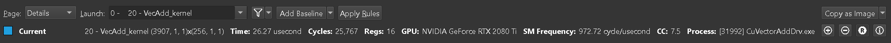

"Launch" 下拉菜单可用于在所有收集的内核启动之间进行切换。每个页面显示的信息通常代表所选的启动实例。在某些页面（例如 Raw 页面），会显示所有启动的信息，并突出显示所选的实例。您可以在此下拉菜单中输入内容，以快速筛选和查找内核启动。

"Apply Filters"  按钮打开筛选对话框。您可以使用多个筛选器来缩小结果范围。在筛选对话框中，输入筛选参数，然后按下 "OK" 按钮。"Launch"  下拉菜单将相应地进行筛选。选择箭头下拉菜单以访问 "Clear Filters" 按钮，该按钮会删除所有筛选器。

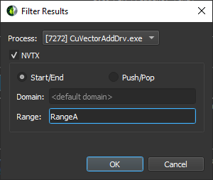

"Add Baseline" 按钮将当前焦点的结果提升为此报告中和同一 NVIDIA Nsight Compute 实例中打开的任何其他报告的基准。选择箭头下拉菜单以访问 "Clear Baselines" 按钮，该按钮会删除当前所有活动的基准。

"Apply Rules"  按钮应用此报告可用的所有规则。如果之前已经应用了规则，那么这些结果将被替换。默认情况下，规则会在内核启动进行分析后立即应用。可以在 "工具"  > "选项" > "Profile" > "Report UI" > "Apply Applicable Rules  Automatically" 中更改此设置。

右侧的按钮提供了可以在页面上执行的多个操作。可用的操作包括：

* "Copy as Image" - 将页面内容复制到剪贴板中作为图像。
* "Save as Image" - 将页面内容保存为图像文件。
* "Save as PDF" - 将页面内容保存为 PDF 文件。
* "Export to CSV" - 将页面内容导出为 CSV 格式。
* "Reset to Default" - 将页面重置为默认状态，删除任何已保存的设置。

请注意，并非所有功能在所有页面上都可用。

所选内核的信息显示为 "Current"。[+] 和 [-] 按钮可用于显示或隐藏部分内容。使用 "r" 按钮可以切换规则输出的可见性。"i" 按钮切换部分描述的可见性。

## 6.2. 报告页面

使用标题栏中的 "Page" 下拉菜单可在报告页面之间进行切换。

默认情况下，当打开包含单个性能分析结果的报告时，会显示 "Details Page"。当打开包含多个结果的报告时，会选择 "Summary Page"。您可以在 Profile 选项中更改默认的报告页面设置。

### 6.2.1. Session Page

Session 页面包含有关报告和计算机的基本信息，以及对进行了性能分析的所有设备的设备属性。在切换启动实例时，相应的设备属性会突出显示。

### 6.2.2. Summary Page

Summary 页面显示了报告中所有收集的结果的表格，以及按预估加速比排序的最重要的规则输出列表（优先规则）。优先规则默认显示，并可通过页面右上角的 [R] 按钮切换。

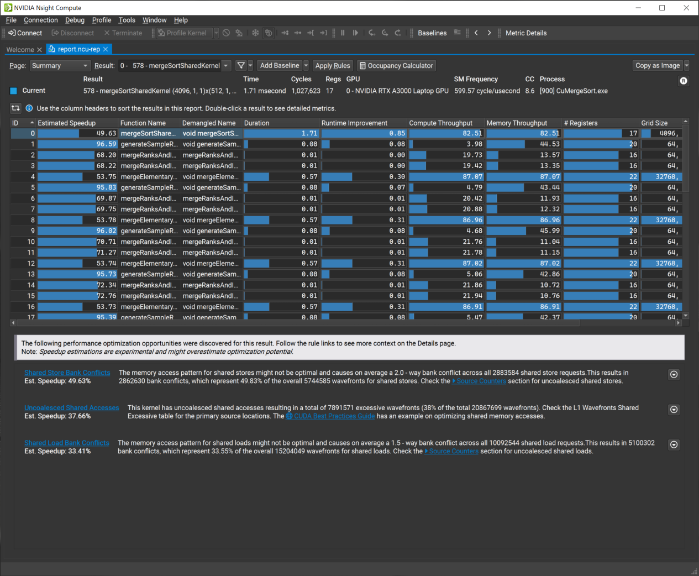

Summary Table 提供了对所有分析工作负载的快速比较概览。它包含一些重要的、预先选择的指标，可以根据下面的说明进行自定义。可以通过点击表头来对表格的列进行排序。您可以使用 "Transpose" 按钮来转置表格。当通过单击选择任何条目时，表格下方将显示其优先规则的列表。双击任何条目将使其成为当前活动的结果，并切换到 "Details Page" 页面以查看其性能数据。

概览指标有助于决定在进一步分析中应该关注哪个结果。

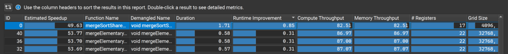

您可以在 Profile 选项对话框中配置此表格中包含的指标列表。如果一个指标有多个实例值，则其标准值后面会显示实例数。例如，带有十个实例值的指标可能如下所示：35.48 {10}。在 Profile 选项对话框中，您可以选择显示所有实例值。您还可以在指标详细信息的工具窗口中查看指标结果的实例值。

除了指标之外，还可以配置表格包含以下任何属性：

下面是转换为Markdown表格格式的内容：

| 属性                          | 描述                                                       |
| ----------------------------- | ---------------------------------------------------------- |
| property__api_call_id         | 与此性能分析结果关联的 API 调用的 ID。                     |
| property__block_size          | 块大小。                                                   |
| property__creation_time       | 本地收集时间。                                             |
| property__demangled_name      | 内核解码后的名称。                                         |
| property__device_name         | GPU 设备名称。                                             |
| property__estimated_speedup   | 由引导分析规则估计的此性能分析结果可达到的最大相对加速比。 |
| property__function_name       | 内核函数名称或范围名称。                                   |
| property__grid_dimensions     | 网格维度。                                                 |
| property__grid_offset         | 网格偏移。                                                 |
| property__grid_size           | 网格大小。                                                 |
| property__issues_detected     | 由引导分析规则检测到的问题数量。                           |
| property__kernel_id           | 内核 ID。                                                  |
| property__mangled_name        | 内核混淆后的名称。                                         |
| property__process_name        | 进程名称。                                                 |
| property__runtime_improvement | 对应于估计加速比的运行时改进。                             |
| property__series_id           | 性能分析系列的 ID。                                        |
| property__series_parameters   | 性能分析系列参数。                                         |
| property__thread_id           | CPU 线程 ID。                                              |

对于 Range Replay 报告，默认情况下只显示较小的一组列，因为并不适用于此类结果的所有列。

对于当前选定的指标结果，优先规则显示与估计潜在加速比相关的最具影响力的规则结果。单击左侧的任何规则名称可以轻松导航到包含该规则的部分。使用右侧的向下箭头可以切换显示相关关键性能指标的表格。该表格包含了在优化性能时应根据规则指导进行跟踪的指标。

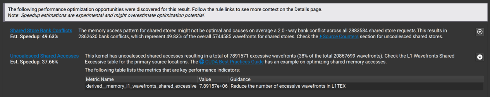

### 6.2.3. Details Page
#### 概览

Details 页面是收集的内核启动期间所有指标数据的主要页面。页面被分为各个部分。每个部分由一个标题表格和一个可展开的可选正文组成。部分完全由用户定义，可以通过更新其相应的文件来进行更改。有关自定义部分的更多信息，请参阅[Customization Guide](https://docs.nvidia.com/nsight-compute/CustomizationGuide/index.html#abstract)。有关 NVIDIA Nsight Compute 随附的部分列表，请参阅  [Sections and Rules](https://docs.nvidia.com/nsight-compute/ProfilingGuide/index.html#sections-and-rules)。

默认情况下，一旦收集到新的性能分析结果，所有适用的规则都会被应用。任何规则结果都将显示为此页面上的推荐项。大多数规则结果通常是纯粹的信息性内容，或者带有警告图标，表明存在某些性能问题。带有错误图标的结果通常表示应用规则时出现了错误。

规则结果经常指出性能问题并引导分析过程。

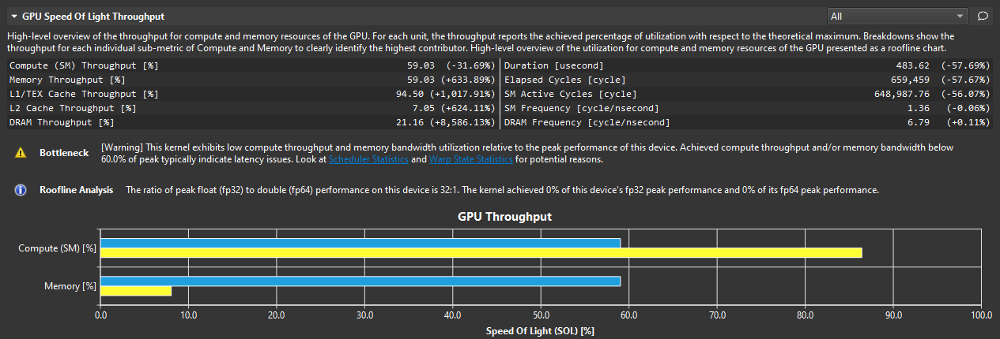

如果规则结果引用了其他报告部分，它将以链接形式出现在推荐项中。选择链接以滚动到相应的部分。如果未在同一性能分析结果中收集该部分，请在 Metric Selection 工具窗口中启用该部分。

您可以在 Details 视图的每个部分中添加或编辑评论，只需点击评论按钮（气泡图标）。在包含评论的部分中，评论图标将突出显示。评论会持久保存在报告中，并在评论页中进行总结。


除了标题之外，部分通常还包含一个或多个正文，其中包含额外的图表或表格。单击每个部分左上角的三角形展开图标，以显示或隐藏正文。如果一个部分有多个正文，其右上角的下拉菜单允许您在它们之间切换。

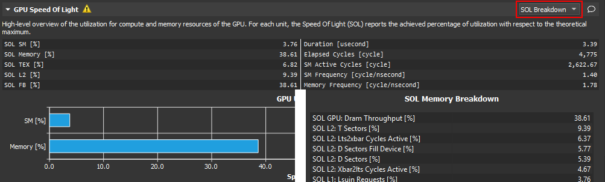

#### Rooflines

如果启用了 GPU Speed Of Light Roofline Chart 部分，则该部分包含一个 Roofline 图表，可以帮助您一目了然地了解内核的性能。 （要在报告中启用 roofline 图表，请在进行性能分析时确保启用了该部分。）有关如何使用和阅读此图表的更多信息，请参阅 [Roofline Charts](https://docs.nvidia.com/nsight-compute/ProfilingGuide/index.html#roofline)。NVIDIA Nsight Compute 随附了几个不同的 roofline 图表定义，包括分层 roofline。这些额外的 roofline 定义在不同的部分文件中定义。虽然不是完整的部分集的一部分，但添加了一个名为 roofline 的新部分集，用于收集和显示所有 roofline 图表。分层 roofline 的概念是它定义了多个天花板，表示硬件层次结构的限制器。例如，一个侧重于内存层次结构的分层 roofline 可以具有 L1 缓存、L2 缓存和设备内存吞吐量的天花板。如果内核的实际性能受到分层 roofline 的某个天花板的限制，这可能表明对应的层次结构单元是潜在的瓶颈。

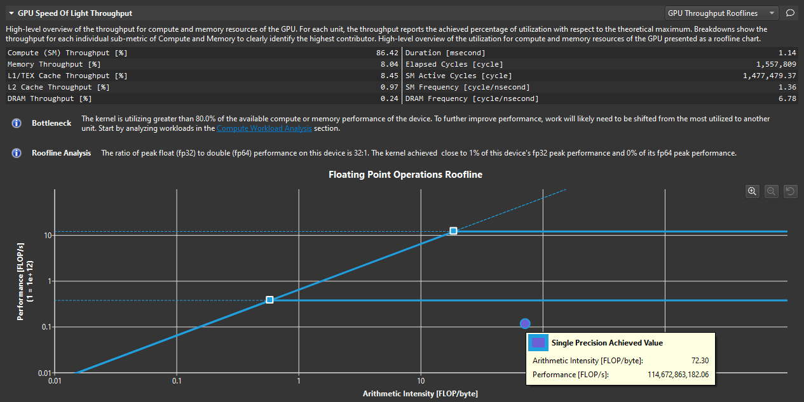

可以使用下表中的控件对 roofline 图表进行缩放和平移，以进行更有效的数据分析。

| Zoom In                                                      | Zoom Out                                                     | Zoom Reset                                                   | Pan                                                          |
| ------------------------------------------------------------ | ------------------------------------------------------------ | ------------------------------------------------------------ | ------------------------------------------------------------ |
| Click the Zoom In button in the top right corner of the chart.                                                 Click the left mouse button and drag to create a rectangle that bounds the area of interest.                                                 Press the plus (+) key.                                                 Use Ctrl + MouseWheel (Windows and Linux only) | Click the Zoom Out button in the top right corner of the chart.                                                 Click the right mouse button.                                                  Press the plus (-) key.                                                 Use Ctrl + MouseWheel (Windows and Linux only) | Click the Zoom Reset button in the top right corner of the chart.                                                 Press the Escape (Esc) key. | Use Ctrl (Command on Mac) + LeftMouseButton to grab the chart, then move the mouse.                                                 Use the cursor keys. |

**内存**

如果启用，Memory Workload Analysis 分析部分包含一个内存图表，可视化数据传输、缓存命中率、指令和内存请求的情况。有关如何使用和阅读该图表的更多信息，请参阅"内核分析指南"。[Kernel Profiling Guide](https://docs.nvidia.com/nsight-compute/ProfilingGuide/index.html#memory-chart).                                                               

**源代码**

Source Counters等部分可能包含源代码热点表。这些表显示了在您的内核源代码中一个或多个指标的前N个最高或最低值。选择位置链接可直接导航到6.2.4  [Source Page](https://docs.nvidia.com/nsight-compute/NsightCompute/index.html#profiler-report-source-page)中的该位置。将鼠标悬停在一个值上可以查看贡献给该值的指标。热点表指出了您源代码中的性能问题。

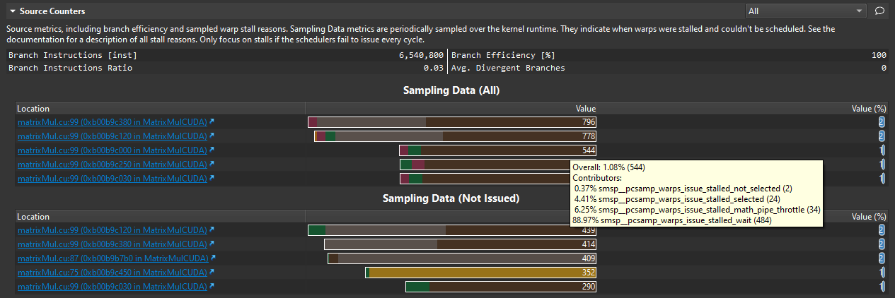

**占用率** Occupancy 

您可以通过点击报告标题栏或占用率部分标题栏中的计算器按钮来打开 9 [Occupancy Calculator](https://docs.nvidia.com/nsight-compute/NsightCompute/index.html#occupancy-calculator)。

**范围重放**

请注意，对于[Range Replay](https://docs.nvidia.com/nsight-compute/ProfilingGuide/index.html#range-replay)的结果，某些用户界面元素、分析规则、指标或部分内容项（如图表或表格）可能不可用，因为它们仅适用于基于内核启动的结果。筛选器可以在相应的部分文件中进行检查。

### **6.2.4. 源代码页面**

Source page correlates assembly（SASS）与CUDA-C或PTX等高级代码相关联。此外，它显示与指令相关的指标，以帮助准确定位代码中的性能问题。

Profiler报告的源代码页面是指Profiler Report中的一个页面，用于展示源代码和相关的性能指标。

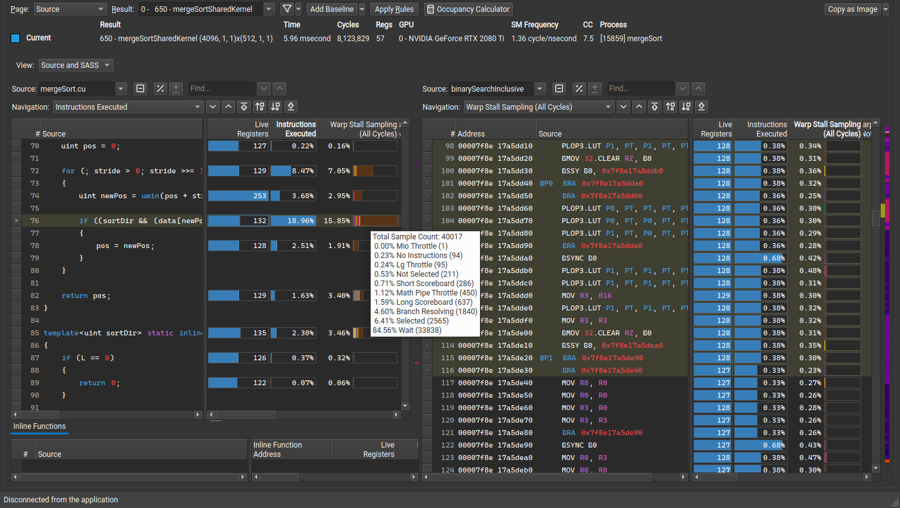

该页面可以在不同的视图之间切换，以便专注于特定的源代码层或并排查看两个层。这包括SASS、PTX和源代码（CUDA-C、Fortran、Python等），以及它们的组合。可用的选项取决于嵌入到可执行文件中的源代码信息。

**如果应用程序使用了`-lineinfo`或`--generate-line-info` nvcc标志来关联SASS和源代码**，则可以使用高级源代码（CUDA-C）视图。当在ELF级别进行分离链接时，ELF中没有对应于最终SASS的PTX。因此，即使在可执行文件中静态可用，并且可以使用`cuobjdump -all -lptx`显示，NVIDIA Nsight Compute也不会显示任何PTX。然而，这是PTX的预链接版本，无法可靠地用于关联。

不同视图中的代码也可以包含警告、错误或通知，这些信息显示为左侧标题中的源代码标记，如下所示。这些标记可以由多个系统生成，但目前只支持NvRules。

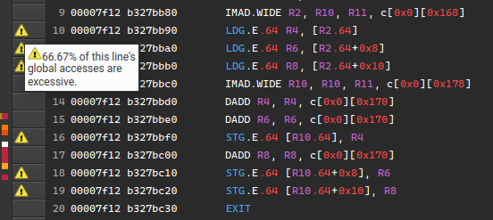

#### 6.2.4.1. 导航 Navigation

在导航方面，可以使用"View"下拉菜单选择不同的代码（关联）选项：SASS、PTX和源代码（CUDA-C、Fortran、Python等）。

在并排视图中，当在左侧或右侧选择一行时，相应视图中的关联行将被突出显示。然而，当 [Show Single File For Multi-File Sources](https://docs.nvidia.com/nsight-compute/NsightCompute/index.html#options-profile) 选项设置为"Yes"时，必须在相应的视图中已经选择目标文件或源对象，才能显示这些关联行。

"Source"下拉菜单允许您在视图中切换文件或函数来显示内容。当选择不同的源代码条目时，视图将滚动到该文件或函数的开头。如果一个视图包含多个源文件或函数，将显示[+]和[-]按钮。这些按钮可用于展开或折叠视图，从而显示或隐藏除标题以外的文件或函数内容。如果折叠，所有指标将被聚合显示，以提供快速概览。
 视图折叠/展开按钮。

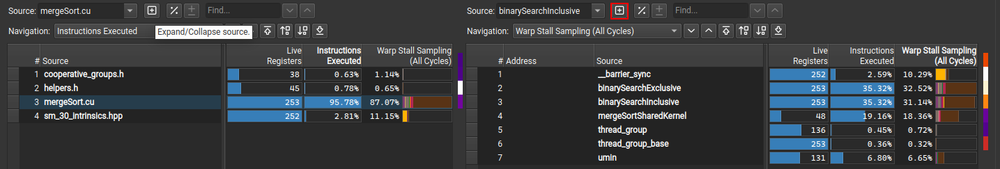

您可以使用"Find"（源代码）行编辑框搜索每个视图的源代码列。输入要搜索的文本，并使用相关按钮在该列中查找下一个或上一个匹配项。当选中行编辑框时，您也可以使用Enter键或Shift+Enter键分别搜索下一个或上一个匹配项。

SASS视图被过滤，只显示在启动中执行的函数。您可以切换"S[Show Only Executed Functions](https://docs.nvidia.com/nsight-compute/NsightCompute/index.html#options-profile)"选项来更改此设置，但对于大型二进制文件，这可能会对页面的性能产生负面影响。可能会有一些SASS指令显示为N/A。这些指令目前不公开。

在视图中，只显示文件名，如果源文件在其原始位置找不到，还会显示"File Not  Found"错误。这可能发生在报告被移动到另一个系统的情况下。选择一个文件名，然后点击上方的"Resolve"按钮来指定在本地文件系统上可以找到该源文件的位置。但是，如果在分析过程中选择了导入源代码选项并且文件在那时是可用的，视图始终会显示源文件。如果文件在其原始位置或任何源代码查找位置找到，但其属性不匹配，则显示"File Mismatch"错误。请参阅源代码查找选项以更改文件查找行为。
 CUDA-C源代码的"Resolve"按钮。

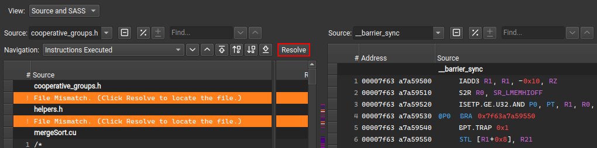

如果使用远程分析收集了报告，并且在Profile选项中启用了自动解析远程文件，NVIDIA Nsight Compute将尝试从远程目标加载源代码。如果当前的NVIDIA Nsight  Compute实例中尚未提供连接凭据，将在对话框中提示输入。目前，从远程目标加载仅适用于Linux  x86_64目标和Linux、Windows主机。

#### 6.2.4.2. 指标 Metrics

 指标相关性

此页面在检查与您的代码相关的性能信息和指标时非常有用。指标显示在列中，可以通过使用列标题右键菜单访问的"Column Chooser"对话框启用或禁用列。
 "Column Chooser"对话框

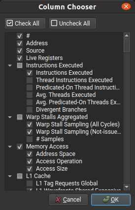

为了在水平滚动时不移出视图，可以固定列。默认情况下，"Source"列固定在左侧，方便查看与源代码行相关的所有指标。要更改列的固定状态，右键单击列标题，然后分别选择"Freeze"（固定）或"Unfreeze"（取消固定）。

固定源代码列的图标在标题中。

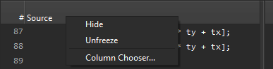

每个视图右侧的热力图可用于快速识别下拉菜单中当前所选指标的高指标值位置。热力图使用黑体辐射颜色标尺，其中黑色表示最低映射值，白色表示最高映射值。在使用鼠标右键点击并按住热力图时，会显示当前的比例尺。

源视图热力图颜色标尺


默认情况下，适用的指标以相对于整个项目的总和的百分比值显示。一个条形图从左到右填充，表示特定源位置相对于该指标在整个项目中的最大值的数值。按钮“[%]”和“[+-]”可用于在相对和绝对值之间切换显示，以及在缩略绝对值和完整精度绝对值之间切换显示。对于相对值和条形图，按钮“[circle/pie]”可用于在相对于全局（项目）和相对于局部（函数/文件）范围之间切换显示。如果视图被折叠，该按钮将被禁用，因为在这种情况下百分比始终相对于全局项目范围。

切换指标的相对/绝对值和缩略/完整精度值

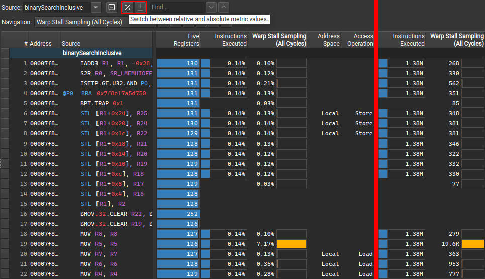

**预定义源度量指标**

- **活跃寄存器**

  编译器需要保持有效的寄存器数量。较高的值表示在此代码位置需要许多寄存器，可能会增加寄存器压力和内核所需的最大寄存器数量。

  报告为`launch__registers_per_thread`的总寄存器数可能会显著高于最大活跃寄存器数。即使最大活跃寄存器数较小，编译器可能需要分配特定的寄存器，这可能会在分配中创建空洞，从而影响`launch__registers_per_thread`。这可能是由于ABI限制或特定硬件指令强制实施的限制。编译器可能无法完全了解调用方和被调用方可能使用哪些寄存器，并且必须遵守ABI约定，因此即使某些寄存器在理论上可以被重用，也会分配不同的寄存器。

- **Warp Stall Sampling (All Samples)**

  统计采样器在此程序位置的样本数量。This metric was previously called Sampling Data (All).之前叫做Sample Data(All)。在Source界面还是叫Sample Data。**可以看到Stall的地方**

  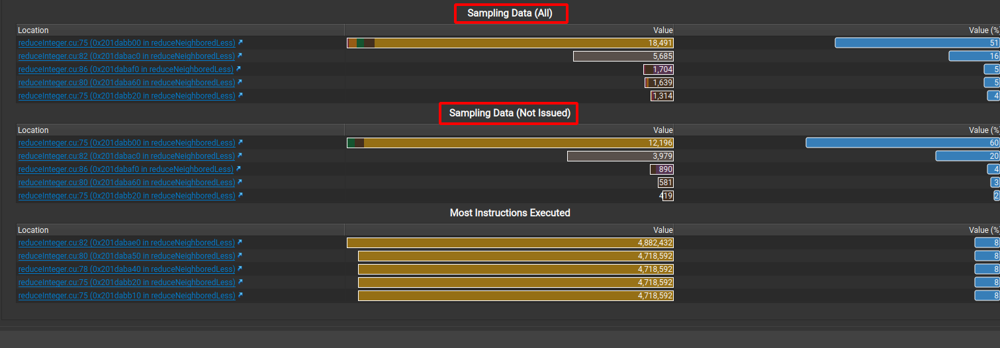

- **Warp Stall Sampling (Not-issued Samples)2**

  统计采样器在此程序位置上，当warp调度程序未发出指令时的样本数量。请注意，(Not Issued)样本可能在与上述(All)样本不同的分析过程中进行采集，因此它们的值不严格相关。同上 之前叫做Sampling Data (Not Issued)

  此度量仅适用于计算能力为7.0或更高的设备。

- **Instructions Executed** **指令执行次数**

  源代码（指令）在每个独立warp中执行的次数，与每个warp中参与的线程数量无关。

- **Thread Instructions Executed****线程指令执行次数**

  任何线程执行源代码（指令）的次数，无论谓词的存在与否或评估结果如何。

- **基于谓词的线程指令执行次数**

  任何活动的基于谓词的线程执行源代码（指令）的次数。对于无条件执行的指令（即没有谓词），这是warp中活动线程的数量乘以相应的指令执行次数的值。

- **Avg. Threads Executed****平均执行线程数**

  每个warp平均执行的线程级指令数量，无论其谓词如何。

- **平均基于谓词的执行线程数**

  每个warp平均执行的基于谓词的线程级指令数量。

- **Divergent Branches****分歧分支**

  分歧分支目标的数量，包括顺序执行。仅当存在两个或更多具有分歧目标的活动线程时才递增。分歧分支可能导致warp停顿，因为需要解析分支或指令缓存未命中。

- **内存操作信息**

  | 标签                                    | 名称                                                    | 描述                                                         |
  | --------------------------------------- | ------------------------------------------------------- | ------------------------------------------------------------ |
  | Address Space                           | memory_type                                             | 访问的地址空间（全局/本地/共享）。                           |
  | Access Operation                        | memory_access_type                                      | 访问内存的类型（例如加载或存储）。                           |
  | Access Size                             | memory_access_size_type                                 | 内存访问的大小，以位为单位。                                 |
  | L1 Tag Requests Global                  | memory_l1_tag_requests_global                           | 全局内存指令生成的L1标记请求数量。                           |
  | L1 Conflicts Shared N-Way               | derived__memory_l1_conflicts_shared_nway                | 每个共享内存指令在L1中的平均N路冲突。1路访问没有冲突并且在单个通道中解决。注意：这是一个派生指标，不能直接收集。 |
  | L1 Wavefronts Shared Excessive          | derived__memory_l1_wavefronts_shared_excessive          | 来自共享内存指令的L1中过多的波前数量，因为并非所有未预测的线程都执行了该操作。注意：这是一个派生指标，不能直接收集。 |
  | L1 Wavefronts Shared                    | memory_l1_wavefronts_shared                             | 共享内存指令中L1中的波前数量。                               |
  | L1 Wavefronts Shared Ideal              | memory_l1_wavefronts_shared_ideal                       | 假设每个未预测的线程都执行了操作，共享内存指令中L1中的理想波前数量。 |
  | L2 Theoretical Sectors Global Excessive | derived__memory_l2_theoretical_sectors_global_excessive | 来自全局内存指令的L2中请求的过多理论扇区数，因为并非所有未预测的线程都执行了该操作。注意：这是一个派生指标，不能直接收集。 |
  | L2 Theoretical Sectors Global           | memory_l2_theoretical_sectors_global                    | 全局内存指令中请求的L2中的理论扇区数。                       |
  | L2 Theoretical Sectors Global Ideal     | memory_l2_theoretical_sectors_global_ideal              | 假设每个未预测的线程都执行了操作，全局内存指令中请求的L2中的理想扇区数。 |
  | L2 Theoretical Sectors Local            | memory_l2_theoretical_sectors_local                     | 从本地内存指令中请求的L2中的理论扇区数。                     |

所有L1/L2扇区/波前/请求`L1/L2 Sectors/Wavefronts/Requests`指标均给出实际达到（实际需要）、理想和过多（实际达到-理想）扇区/波前/请求的数量。理想指标表示在给定宽度的情况下，每个未预测的线程执行操作所需的数量。过多指标表示理想情况下所需的剩余量。减少线程间的分歧可以减少过多的量，并导致相应硬件单元的工作量减少。 

上述内存操作中的几个指标在2021.2版本中更名如下：

| 旧名称                         | 新名称                                     |
| ------------------------------ | ------------------------------------------ |
| memory_l2_sectors_global       | memory_l2_theoretical_sectors_global       |
| memory_l2_sectors_global_ideal | memory_l2_theoretical_sectors_global_ideal |
| memory_l2_sectors_local        | memory_l2_theoretical_sectors_local        |
| memory_l1_sectors_global       | memory_l1_tag_requests_global              |
| memory_l1_sectors_shared       | memory_l1_wavefronts_shared                |
| memory_l1_sectors_shared_ideal | memory_l1_wavefronts_shared_ideal          |

* **L2显式驱逐策略指标**

  从NVIDIA  Ampere架构开始，L2缓存的驱逐策略可以调整以匹配内核的访问模式。驱逐策略可以隐式地设置为内存窗口（有关详细信息，请参见 [CUaccessProperty](https://docs.nvidia.com/cuda/cuda-runtime-api/structcudaAccessPolicyWindow.html)），也可以针对每个执行的内存指令显式设置。如果显式设置，对于L2缓存的命中或未命中情况，所需的驱逐行为将作为输入传递给指令。有关详细信息，请参阅CUDA的[Cache Eviction Priority Hints](https://docs.nvidia.com/cuda/parallel-thread-execution/index.html#cache-eviction-priority-hints).

  | 标签                                       | 名称                                                         | 描述                                                         |
  | ------------------------------------------ | ------------------------------------------------------------ | ------------------------------------------------------------ |
  | L2 Explicit Evict Policies                 | smsp__inst_executed_memdesc_explicit_evict_type              | 配置的显式驱逐策略列表，以逗号分隔。由于驱逐策略可以在运行时动态设置，因此此列表包括任何已执行指令的所有策略。 |
  | L2 Explicit Hit Policy Evict First         | smsp__inst_executed_memdesc_explicit_hitprop_evict_first     | 任何warp执行的内存指令的次数，该warp在访问L2时设置了evict_first策略。使用此策略缓存的数据将首先按照驱逐优先级顺序进行驱逐，并且在需要缓存驱逐时可能会被驱逐。此策略适用于流数据。 |
  | L2 Explicit Hit Policy Evict Last          | smsp__inst_executed_memdesc_explicit_hitprop_evict_last      | 任何warp执行的内存指令的次数，该warp在访问L2时设置了evict_last策略。使用此策略缓存的数据将按照驱逐优先级顺序排在最后，并且只有在其他使用evict_normal或evict_first驱逐策略的数据已被驱逐后才可能被驱逐。此策略适用于应保留在缓存中的数据。 |
  | L2 Explicit Hit Policy Evict Normal        | smsp__inst_executed_memdesc_explicit_hitprop_evict_normal    | 任何warp执行的内存指令的次数，该warp在访问L2时设置了evict_normal（默认）策略，且访问导致L2缓存命中。 |
  | L2 Explicit Hit Policy Evict Normal Demote | smsp__inst_executed_memdesc_explicit_hitprop_evict_normal_demote | 任何warp执行的内存指令的次数，该warp在访问L2时设置了evict_normal_demote策略，且访问导致L2缓存命中。 |
  | L2 Explicit Miss Policy Evict First        | smsp__inst_executed_memdesc_explicit_missprop_evict_first    | 任何warp执行的内存指令的次数，该warp在访问L2时设置了evict_first策略，且访问导致L2缓存未命中。使用此策略缓存的数据将首先按照驱逐优先级顺序进行驱逐，并且在需要缓存驱逐时可能会被驱逐。此策略适用于流数据。 |
  | L2 Explicit Miss Policy Evict Normal       | smsp__inst_executed_memdesc_explicit_missprop_evict_normal   | 任何warp执行的内存指令的次数，该warp在访问L2时设置了evict_normal（默认）策略，且访问导致L2缓存未命中。 |

**单个Warp停顿采样指标**

所有stall_*指标都显示Warp停顿采样中组合的信息。有关它们的描述，请参见统计采样器。[Statistical Sampler](https://docs.nvidia.com/nsight-compute/ProfilingGuide/index.html#statistical-sampler)
 有关如何为此视图添加其他指标的自定义指南，请参见自定义指南，有关可用指标的进一步信息，请参见指标参考。

**寄存器依赖关系**

SASS视图中显示了寄存器之间的依赖关系。当读取寄存器时，会找到它可能被写入的所有潜在地址。这些行之间的链接在视图中绘制。在它们各自的列中显示了寄存器、谓词、统一寄存器和统一谓词的所有依赖关系。
 在SASS视图中跟踪寄存器依赖关系

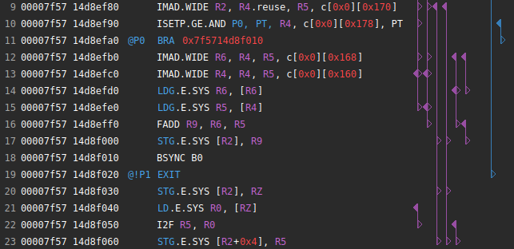

上图显示了一个简单CUDA内核的一些依赖关系。在第一行，也就是SASS代码的第9行，我们可以看到对寄存器R2和R3的写入，用指向左侧的实心三角形表示。然后在第17、20和23行读取这些寄存器，用指向右侧的普通三角形表示。还有一些行，两种三角形都在同一行，这意味着对同一寄存器进行了读写操作。

不跟踪源文件和函数之间的依赖关系。

寄存器依赖关系跟踪功能默认启用，但可以在“工具”>“选项”>“分析”>“报告源页面”>“启用寄存器依赖关系”中完全禁用。

#### 6.2.4.3. 限制

**范围回放**

在使用范围回放模式时，无法获取指令级源度量信息。

**图形分析**

在分析完整的CUDA图形时，无法获取指令级源度量信息。

**Cmdlists**

在分析（OptiX）cmdlists时，无法获取指令级源度量信息

### 6.2.5. 评论页面

评论页面将所有部分评论聚合在一个视图中，并允许用户在任何启动实例或部分以及整个报告上编辑这些评论。评论将与报告一起保留。如果添加了部分评论，则详细信息页面中相应部分的评论图标将被突出显示。

### 6.2.6. 调用堆栈/NVTX页面

此报告页面的CPU调用堆栈部分显示了执行CPU线程在启动内核时的CPU调用堆栈。为了在分析器报告中显示此信息，必须在 [Connection Dialog](https://docs.nvidia.com/nsight-compute/NsightCompute/index.html#connection-dialog)中启用收集CPU调用堆栈选项或使用相应的NVIDIA Nsight Compute CLI命令行参数。

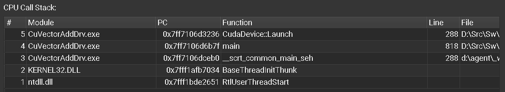

此报告页面的NVTX状态部分显示了内核启动时的NVTX上下文。所有线程特定信息都是相对于内核启动API调用的线程。请注意，仅在分析器启用了NVTX支持的情况下，才会收集NVTX信息，可以在连接对话框中启用，也可以使用NVIDIA Nsight Compute CLI命令行参数启用。

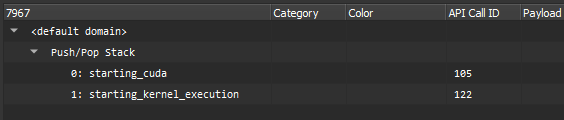


### 6.2.7. Raw Page

Raw页面显示了每个分析的内核启动的所有收集指标及其单位的列表。它可以导出为CSV格式，以进行进一步的分析。该页面具有一个过滤器编辑，可快速查找特定指标。您可以使用Transpose按钮转置内核和指标的表格。

如果一个指标有多个实例值，则标准值后面会显示实例数。例如，该指标有十个实例值：35.48 {10}。您可以在Profile options对话框中选择显示所有实例值，或在Metric Details工具窗口中检查指标结果。

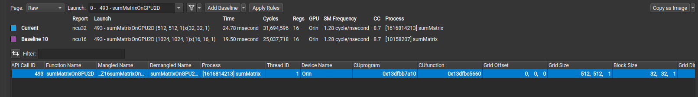

## 6.3. 指标和单位

报告中的各个位置都显示了数值指标，包括标题、表格和大多数页面上的图表。NVIDIA Nsight Compute支持多种显示这些指标及其值的方式。

如果适用于UI组件，指标将与其单位一起显示，以明确指标表示的是周期、线程、字节/秒等内容。单位通常以方括号的形式显示，例如指标名称 [字节] 128。

默认情况下，单位会自动进行缩放，以便以合理的数量级显示指标值。单位使用SI因子进行缩放，即基于字节的单位使用1000作为因子，并使用K、M、G等前缀。基于时间的单位也使用1000作为因子进行缩放，使用n、u和m作为前缀。可以在配置选项中禁用此缩放。

无法收集的指标将显示为n/a，并分配一个警告图标。如果指标的浮点值超出正常范围（即nan（非数字）或inf（无穷大）），它们也会被分配一个警告图标。例外情况是这些值是预期的且在内部允许的指标。

# 7. 基准线

NVIDIA Nsight  Compute支持使用基准线在一个或多个报告之间进行结果差异比较。任何报告中的每个结果都可以提升为基准线。这将导致所有报告中的所有结果的指标值显示与基准线的差异。如果同时选择多个基准线，则指标值将与所有当前基准线的平均值进行比较。基准线不会与报告一起存储，只有在打开相同的NVIDIA Nsight Compute实例时才可用，除非将其从基准线工具窗口保存到ncu-bln文件中。
 带有一个基准线的分析报告

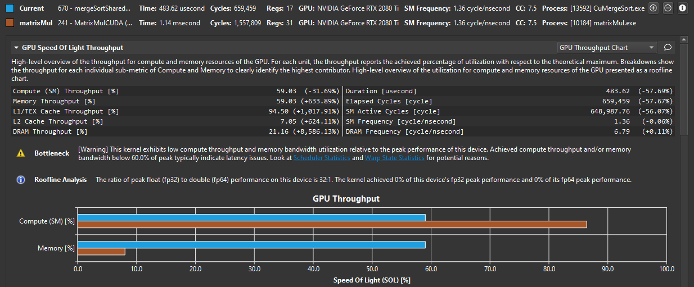

选择"Add  Baseline"将当前焦点结果提升为基准线。如果设置了基准线，详情页、原始页和摘要页上的大多数指标将显示两个值：当前焦点结果的当前值，以及与基准线对应的值或与基准线值相比的变化百分比。（请注意，当指标的基准线值为零而焦点值不为零时，可能会显示无限百分比增益，即inf%。）

如果选择了多个基准线，每个指标将显示以下注释：

```
<focus value> (<difference to baselines average [%]>, z=<standard score>@<number of values>)
```

标准分数是当前值与所有基准线的平均值之间的差异，通过标准差进行归一化。如果用于计算标准分数的指标值数量等于结果的数量（当前值和所有基准线），则省略@注释。
 带有多个基准线的分析报告

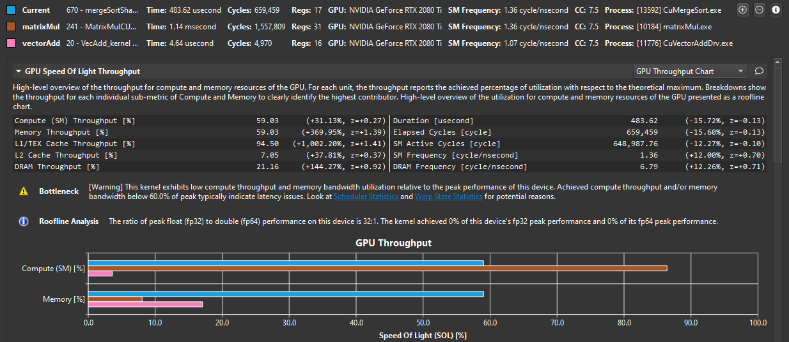

双击基准线名称可以编辑显示的名称。按下Enter/Return键或失去焦点时，编辑将被提交；按下Esc键则会取消编辑。将鼠标悬停在基准线颜色图标上，可以从列表中删除该特定的基准线。

使用下拉按钮、Profile菜单或相应的工具栏按钮中的"Clear Baselines"选项，可以删除所有基准线。

基准线的更改也可以在"Baselines"工具窗口中进行。

# 8. 独立源代码查看器

NVIDIA Nsight Compute包含一个独立的源代码查看器，用于查看cubin文件。该视图与Source Page相同，但不包含任何性能指标。

可以通过"File >  Open"主菜单命令打开cubin文件。在打开独立源代码视图之前，将显示SM选择对话框。如果文件名中存在SM版本信息，将预先选择该版本。例如，如果文件名是mergeSort.sm_80.cubin，则对话框中将预先选择SM 8.0。如果文件名中未包含相应的SM版本信息，请从下拉菜单中选择适当的SM版本。

SM选择对话框

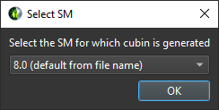

单击“确定”按钮打开“独立源代码查看器”。

独立源查看器

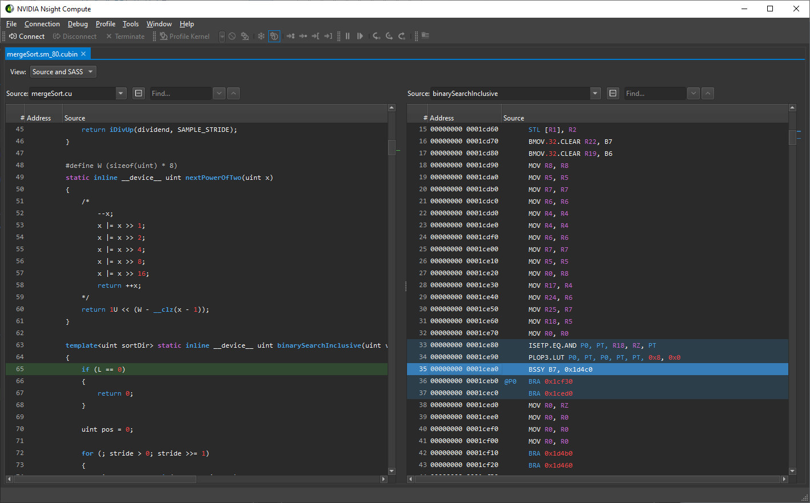

# 9. 占用率计算器

NVIDIA Nsight Compute提供了一个占用率计算器，可以计算给定CUDA内核在GPU上的多处理器占用率。它与CUDA占用率计算器电子表格具有相同的功能。[spreadsheet](http://docs.nvidia.com/cuda/cuda-occupancy-calculator/index.html).

可以直接从性能分析报告或作为新活动打开占用率计算器。可以使用"File > Save"将占用率计算器数据保存到文件中。默认情况下，文件使用.ncu-occ扩展名。可以使用"File > Open File"打开占用率计算器文件。

1. 从连接对话框启动

   在连接对话框中选择"Occupancy Calculator"活动。可以选择性地指定一个占用率计算器数据文件，该文件用于使用保存的数据初始化计算器。点击"Launch"按钮打开占用率计算器。

   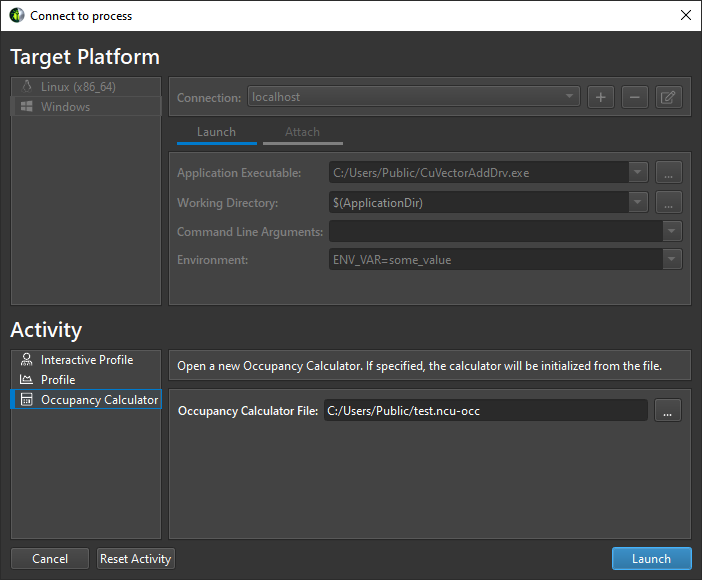

2. 从性能分析报告中启动

   可以通过性能分析报告中的计算器按钮来打开占用率计算器。该按钮位于报告标题栏或详细页面中占用率部分的标题栏中。

   详细页面标题栏

   

   Occupancy section header

   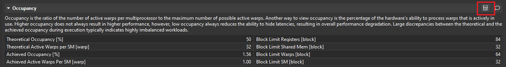

用户界面由一个输入部分以及显示有关GPU占用率信息的表格和图形组成。要使用计算器，请更改输入部分中的输入值，点击“应用”按钮，并检查表格和图形。

## 9.1. 表格

这些表格显示了每个多处理器的占用率，以及活动线程、线程束和线程块的数量，以及GPU上活动块的最大数量。

表格

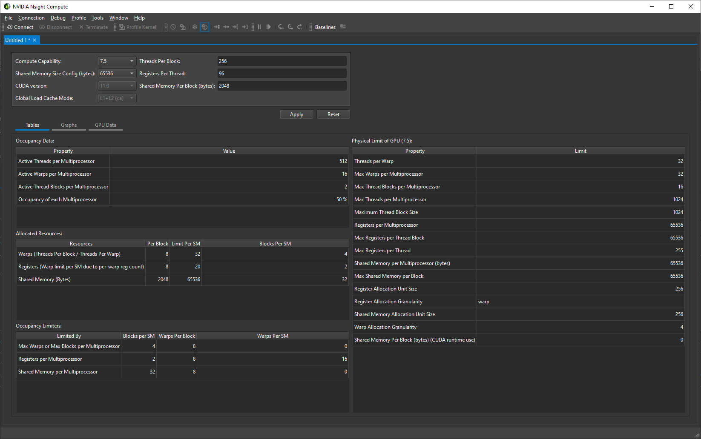

## 9.2. 图表

这些图表显示了您选择的块大小的占用率（以蓝色圆圈表示），以及所有其他可能的块大小的占用率（以折线图表示）。

图表

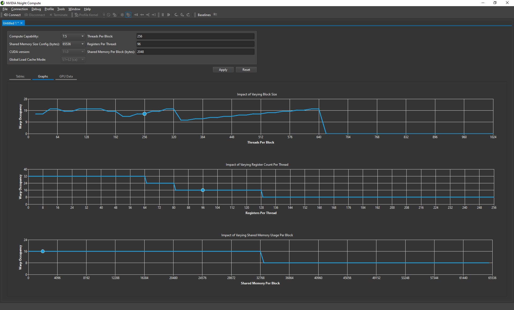

## 9.3. GPU数据

GPU数据显示了所有支持的设备的属性。

GPU数据

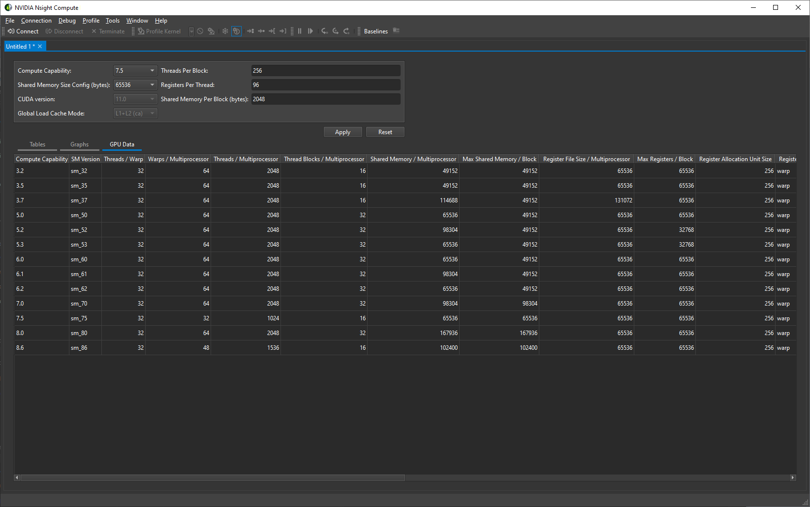


# Nsight Compute支持的GPU

先看一下自己的GPU是否支持Nsight Compute，否则会出现错误`profiling is not supported on this device`

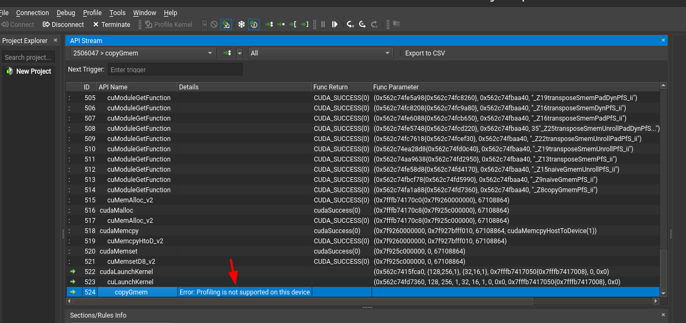


| Architecture | Support |
| ------------ | ------- |
| Kepler       | No      |
| Maxwell      | No      |
| Pascal       | No      |
| Volta GV100  | Yes     |
| Volta GV11b  | Yes     |
| Turing TU1xx | Yes     |
| NVIDIA GA100 | Yes     |
| NVIDIA GA10x | Yes     |
| NVIDIA GA10b | Yes     |
| NVIDIA AD10x | Yes     |
| NVIDIA GH100 | Yes     |

Table 2. GPU architectures supported by NVIDIA Nsight Compute

参考：[3.2. GPU Support](https://docs.nvidia.com/nsight-compute/ReleaseNotes/index.html#gpu-support)

# Section

Nsigth Compute的界面分为很多的区域，比如Details Page的Memory Workload Analysis section。

* envet：硬件的各种事件
* matric：一系列的event的组合指标，例如`gld_efficiency`
* section：同一属性的`matric`的组合。例如内存相关的在一起。

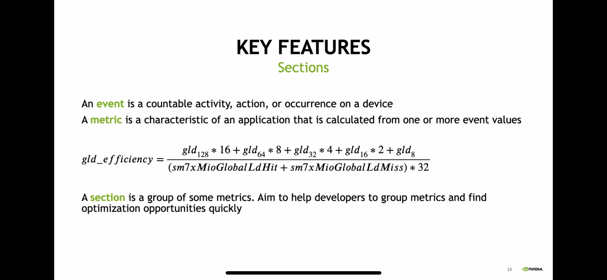


`event`的定义从`nvprof`到nsight Compute名称有变化。具体的对应关系如下

[6.3. Metric Comparison](https://docs.nvidia.com/nsight-compute/NsightComputeCli/index.html#nvprof-metric-comparison)

[6.4. Event Comparison](https://docs.nvidia.com/nsight-compute/NsightComputeCli/index.html#nvprof-event-comparison)

| nvprof Event                            | PerfWorks Metric or Formula (>= SM 7.0)                      |
| --------------------------------------- | ------------------------------------------------------------ |
| active_cycles                           | sm__cycles_active.sum                                        |
| active_cycles_pm                        | sm__cycles_active.sum                                        |
| active_cycles_sys                       | sys__cycles_active.sum                                       |
| active_warps                            | sm__warps_active.sum                                         |
| active_warps_pm                         | sm__warps_active.sum                                         |
| atom_count                              | smsp__inst_executed_op_generic_atom_dot_alu.sum              |
| elapsed_cycles_pm                       | sm__cycles_elapsed.sum                                       |
| elapsed_cycles_sm                       | sm__cycles_elapsed.sum                                       |
| elapsed_cycles_sys                      | sys__cycles_elapsed.sum                                      |
| fb_subp0_read_sectors                   | dram__sectors_read.sum                                       |
| fb_subp1_read_sectors                   | dram__sectors_read.sum                                       |
| fb_subp0_write_sectors                  | dram__sectors_write.sum                                      |
| fb_subp1_write_sectors                  | dram__sectors_write.sum                                      |
| global_atom_cas                         | smsp__inst_executed_op_generic_atom_dot_cas.sum              |
| gred_count                              | smsp__inst_executed_op_global_red.sum                        |
| inst_executed                           | sm__inst_executed.sum                                        |
| inst_executed_fma_pipe_s0               | smsp__inst_executed_pipe_fma.sum                             |
| inst_executed_fma_pipe_s1               | smsp__inst_executed_pipe_fma.sum                             |
| inst_executed_fma_pipe_s2               | smsp__inst_executed_pipe_fma.sum                             |
| inst_executed_fma_pipe_s3               | smsp__inst_executed_pipe_fma.sum                             |
| inst_executed_fp16_pipe_s0              | smsp__inst_executed_pipe_fp16.sum                            |
| inst_executed_fp16_pipe_s1              | smsp__inst_executed_pipe_fp16.sum                            |
| inst_executed_fp16_pipe_s2              | smsp__inst_executed_pipe_fp16.sum                            |
| inst_executed_fp16_pipe_s3              | smsp__inst_executed_pipe_fp16.sum                            |
| inst_executed_fp64_pipe_s0              | smsp__inst_executed_pipe_fp64.sum                            |
| inst_executed_fp64_pipe_s1              | smsp__inst_executed_pipe_fp64.sum                            |
| inst_executed_fp64_pipe_s2              | smsp__inst_executed_pipe_fp64.sum                            |
| inst_executed_fp64_pipe_s3              | smsp__inst_executed_pipe_fp64.sum                            |
| inst_issued1                            | sm__inst_issued.sum                                          |
| l2_subp0_read_sector_misses             | lts__t_sectors_op_read_lookup_miss.sum                       |
| l2_subp1_read_sector_misses             | lts__t_sectors_op_read_lookup_miss.sum                       |
| l2_subp0_read_sysmem_sector_queries     | lts__t_sectors_aperture_sysmem_op_read.sum                   |
| l2_subp1_read_sysmem_sector_queries     | lts__t_sectors_aperture_sysmem_op_read.sum                   |
| l2_subp0_read_tex_hit_sectors           | lts__t_sectors_srcunit_tex_op_read_lookup_hit.sum            |
| l2_subp1_read_tex_hit_sectors           | lts__t_sectors_srcunit_tex_op_read_lookup_hit.sum            |
| l2_subp0_read_tex_sector_queries        | lts__t_sectors_srcunit_tex_op_read.sum                       |
| l2_subp1_read_tex_sector_queries        | lts__t_sectors_srcunit_tex_op_read.sum                       |
| l2_subp0_total_read_sector_queries      | lts__t_sectors_op_read.sum + lts__t_sectors_op_atom.sum + lts__t_sectors_op_red.sum |
| l2_subp1_total_read_sector_queries      | lts__t_sectors_op_read.sum + lts__t_sectors_op_atom.sum + lts__t_sectors_op_red.sum |
| l2_subp0_total_write_sector_queries     | lts__t_sectors_op_write.sum + lts__t_sectors_op_atom.sum + lts__t_sectors_op_red.sum |
| l2_subp1_total_write_sector_queries     | lts__t_sectors_op_write.sum + lts__t_sectors_op_atom.sum + lts__t_sectors_op_red.sum |
| l2_subp0_write_sector_misses            | lts__t_sectors_op_write_lookup_miss.sum                      |
| l2_subp1_write_sector_misses            | lts__t_sectors_op_write_lookup_miss.sum                      |
| l2_subp0_write_sysmem_sector_queries    | lts__t_sectors_aperture_sysmem_op_write.sum                  |
| l2_subp1_write_sysmem_sector_queries    | lts__t_sectors_aperture_sysmem_op_write.sum                  |
| l2_subp0_write_tex_hit_sectors          | lts__t_sectors_srcunit_tex_op_write_lookup_hit.sum           |
| l2_subp1_write_tex_hit_sectors          | lts__t_sectors_srcunit_tex_op_write_lookup_hit.sum           |
| l2_subp0_write_tex_sector_queries       | lts__t_sectors_srcunit_tex_op_write.sum                      |
| l2_subp1_write_tex_sector_queries       | lts__t_sectors_srcunit_tex_op_write.sum                      |
| not_predicated_off_thread_inst_executed | smsp__thread_inst_executed_pred_on.sum                       |
| pcie_rx_active_pulse                    | n/a                                                          |
| pcie_tx_active_pulse                    | n/a                                                          |
| prof_trigger_00                         | n/a                                                          |
| prof_trigger_01                         | n/a                                                          |
| prof_trigger_02                         | n/a                                                          |
| prof_trigger_03                         | n/a                                                          |
| prof_trigger_04                         | n/a                                                          |
| prof_trigger_05                         | n/a                                                          |
| prof_trigger_06                         | n/a                                                          |
| prof_trigger_07                         | n/a                                                          |
| inst_issued0                            | smsp__issue_inst0.sum                                        |
| sm_cta_launched                         | sm__ctas_launched.sum                                        |
| shared_load                             | smsp__inst_executed_op_shared_ld.sum                         |
| shared_store                            | smsp__inst_executed_op_shared_st.sum                         |
| generic_load                            | smsp__inst_executed_op_generic_ld.sum                        |
| generic_store                           | smsp__inst_executed_op_generic_st.sum                        |
| global_load                             | smsp__inst_executed_op_global_ld.sum                         |
| global_store                            | smsp__inst_executed_op_global_st.sum                         |
| local_load                              | smsp__inst_executed_op_local_ld.sum                          |
| local_store                             | smsp__inst_executed_op_local_st.sum                          |
| shared_atom                             | smsp__inst_executed_op_shared_atom.sum                       |
| shared_atom_cas                         | smsp__inst_executed_shared_atom_dot_cas.sum                  |
| shared_ld_bank_conflict                 | l1tex__data_bank_conflicts_pipe_lsu_mem_shared_op_ld.sum     |
| shared_st_bank_conflict                 | l1tex__data_bank_conflicts_pipe_lsu_mem_shared_op_st.sum     |
| shared_ld_transactions                  | l1tex__data_pipe_lsu_wavefronts_mem_shared_op_ld.sum         |
| shared_st_transactions                  | l1tex__data_pipe_lsu_wavefronts_mem_shared_op_st.sum         |
| tensor_pipe_active_cycles_s0            | smsp__pipe_tensor_cycles_active.sum                          |
| tensor_pipe_active_cycles_s1            | smsp__pipe_tensor_cycles_active.sum                          |
| tensor_pipe_active_cycles_s2            | smsp__pipe_tensor_cycles_active.sum                          |
| tensor_pipe_active_cycles_s3            | smsp__pipe_tensor_cycles_active.sum                          |
| thread_inst_executed                    | smsp__thread_inst_executed.sum                               |
| warps_launched                          | smsp__warps_launched.sum                                     |

# 附录：

* [Nsight Compute](https://docs.nvidia.com/nsight-compute/NsightCompute/index.html#abstract)
* [3.2. GPU Support](https://docs.nvidia.com/nsight-compute/ReleaseNotes/index.html#gpu-support)