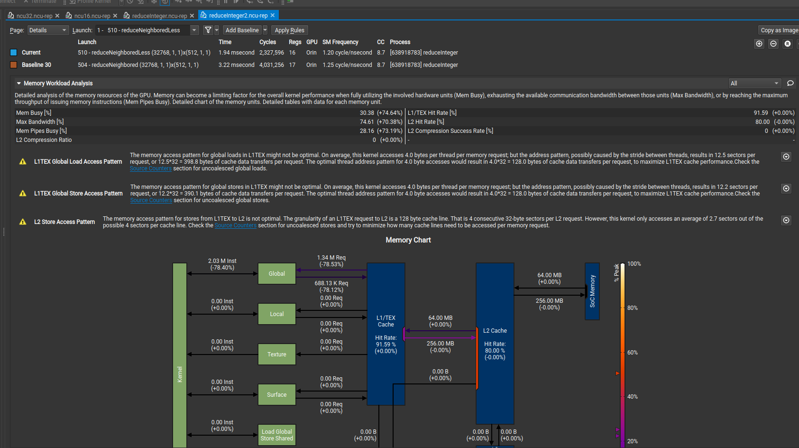

理论看了很多，但是感觉脑袋空空，为什么？因为没有实际应用。那么这一节开始使用Nsight Compute来在orin上进行Kernel的分析。来真正的看看如何结合工具来优化一个kernel。

首先需要知道Nsight Compute都会告诉我们哪些内容。

先使用`3-4 避免分支分化`的例子在orin上使用`ncu`运行并保存结果。

# 1 使用ncu运行程序

因为我是在orin上进行测试的（因为自带的显卡是Pascal架构的，Nsight Compute不支持）。因此首先交叉编译`reduceInteger.cu`为orin版本。具体的源码可以查看`3-4 避免分支分化`，这里就不再贴了。这里已经编译好了orin版本的可执行程序`reduceInteger`。并上传到orin上。

## 1.1 挂载目录

在orin上执行`ncu`需要一些系统目录的权限（因为我们的系统权限被限制了），因此需要重新挂载给予写权限。参考[3.1. Remote Connections](https://docs.nvidia.com/nsight-compute/NsightCompute/index.html#remote-connections)中的**Deployment Directory**，应该是分析需要的一些必要部署文件。

```shell
umount -f /dev/vblk_ufsb0  #根据自己的情况选择
mount /dev/vblk_ufsb0 /    #根据自己的情况选择 为了使根目录可以读写
mkdir /tmp /opt /root /opt/nvidia
```

## 2.2 拷贝Nsight Compute到orin

因为我们的`orin`上默认没有安装Nsight Compute，因此需要对应的的Nsight Compute拷贝到板子上。

我这边对应的目录信息如下

```shell
.
├── nsight-compute
│   └── 2021.2.5
│       ├── docs
│       ├── EULA.txt
│       ├── extras
│       ├── host
│       ├── ncu
│       ├── ncu-ui
│       ├── nv-nsight-cu
│       ├── nv-nsight-cu-cli
│       ├── sections
│       └── target

```

我将`nsight-compute`全部拷贝了，按理说应该只拷贝`target`目录就可以了，但是其实`sections`中有共用的脚本。因次还是全部拷贝了。

## 2.3 使用命令行运行ncu

因为我是嵌入式orin，qnx操作系统。没有界面，因此只能在orin上执行命令行来分析。

### 2.3.1 保存分析结果到文件

上面已经靠拷贝了Nsight Compute到`orin`上。目录如下

```shell
/data/zhaoyd/nsight-compute/2021.2.5/target/qnx-700-t210-a64
# ls
TreeLauncherSubreaper                             libTreeLauncherPlaceholder.so                     libcuda-injection.so                              libnvperfapi64.so
TreeLauncherTargetLdPreloadHelper                 libTreeLauncherTargetInjection.so                 libnvperf_host.soncu
libInterceptorInjectionTarget.so                  libTreeLauncherTargetUpdatePreloadInjection.so    libnvperf_target.so

```

在这个目录下有`ncu`可执行程序（脚本）

只这个目录下执行下面的指令会把保存分析结果为`/data/zhaoyd/test/reduceInteger.ncu-rep`，将这个文件拷贝到PC上可以使用Nsight Compute的UI来查看。

```shell
./ncu --set full -o /data/zhaoyd/test/reduceInteger /data/zhaoyd/test/reduceInteger
```

### 2.3.2 终端输出分析结果

执行下面的指令，ncu的分析结果会在终端输出。

```shell
./ncu --set full  /data/zhaoyd/test/reduceInteger
```

## 2.4 查看ncu分析结果

使用ui界面和终端输出的是一样的。只不过会有一些辅助功能，比如UI可以Add  Baseline来对比多个结果。

先看一下终端输出的内容。比较长，只截取了两个函数的分析，其他格式都是一样的

```shell
# cd nsight-compute/2021.2.5/target/qnx-700-t210-a64/ 
# ./ncu --set full -o /data/zhaoyd/test/reduceInteger /data/zhaoyd/test/reduceInteger  
==PROF== Connected to process 133812351 (/data/zhaoyd/test/reduceInteger)
/data/zhaoyd/test/reduceInteger starting reduction at device 0: Orin     with array size 16777216  grid 32768 block 512
cpu reduce      elapsed 0.062001 sec cpu_sum: 2139095040
==PROF== Profiling "reduceNeighbored" - 1: 0%....50%....100% - 35 passes
gpu Neighbored  elapsed 6.251958 sec gpu_sum: 2139095040 <<<grid 32768 block 512>>>
==PROF== Profiling "reduceNeighboredLess" - 2: 0%....50%....100% - 35 passes
gpu Neighbored2 elapsed 1.328906 sec gpu_sum: 2139095040 <<<grid 32768 block 512>>>
==PROF== Profiling "reduceInterleaved" - 3: 0%....50%....100% - 35 passes
gpu Interleaved elapsed 1.301933 sec gpu_sum: 2139095040 <<<grid 32768 block 512>>>
==PROF== Profiling "reduceUnrolling2" - 4: 0%....50%....100% - 35 passes
gpu Unrolling2  elapsed 1.197036 sec gpu_sum: 2139095040 <<<grid 16384 block 512>>>
==PROF== Profiling "reduceUnrolling4" - 5: 0%....50%....100% - 35 passes
gpu Unrolling4  elapsed 1.102009 sec gpu_sum: 2139095040 <<<grid 8192 block 512>>>
==PROF== Profiling "reduceUnrolling8" - 6: 0%....50%....100% - 35 passes
gpu Unrolling8  elapsed 1.083914 sec gpu_sum: 2139095040 <<<grid 4096 block 512>>>
==PROF== Profiling "reduceUnrollWarps8" - 7: 0%....50%....100% - 35 passes
gpu UnrollWarp8 elapsed 1.071951 sec gpu_sum: 2139095040 <<<grid 4096 block 512>>>
==PROF== Profiling "reduceCompleteUnrollWarps8" - 8: 0%....50%....100% - 35 passes
gpu Cmptnroll8  elapsed 1.097999 sec gpu_sum: 2139095040 <<<grid 4096 block 512>>>
==PROF== Profiling "reduceCompleteUnroll" - 9: 0%....50%....100% - 35 passes
gpu Cmptnroll   elapsed 1.076019 sec gpu_sum: 2139095040 <<<grid 4096 block 512>>>
==PROF== Disconnected from process 133812351
==PROF== Report: /data/zhaoyd/test/reduceInteger.ncu-rep
# ./ncu --set full  /data/zhaoyd/test/reduceInteger   
==PROF== Connected to process 159719551 (/data/zhaoyd/test/reduceInteger)
/data/zhaoyd/test/reduceInteger starting reduction at device 0: Orin     with array size 16777216  grid 32768 block 512
cpu reduce      elapsed 0.061995 sec cpu_sum: 2139095040
==PROF== Profiling "reduceNeighbored" - 1: 0%....50%....100% - 35 passes
gpu Neighbored  elapsed 6.304959 sec gpu_sum: 2139095040 <<<grid 32768 block 512>>>
==PROF== Profiling "reduceNeighboredLess" - 2: 0%....50%....100% - 35 passes
gpu Neighbored2 elapsed 1.332940 sec gpu_sum: 2139095040 <<<grid 32768 block 512>>>
==PROF== Profiling "reduceInterleaved" - 3: 0%....50%....100% - 35 passes
gpu Interleaved elapsed 1.301003 sec gpu_sum: 2139095040 <<<grid 32768 block 512>>>
==PROF== Profiling "reduceUnrolling2" - 4: 0%....50%....100% - 35 passes
gpu Unrolling2  elapsed 1.184980 sec gpu_sum: 2139095040 <<<grid 16384 block 512>>>
==PROF== Profiling "reduceUnrolling4" - 5: 0%....50%....100% - 35 passes
gpu Unrolling4  elapsed 1.115895 sec gpu_sum: 2139095040 <<<grid 8192 block 512>>>
==PROF== Profiling "reduceUnrolling8" - 6: 0%....50%....100% - 35 passes
gpu Unrolling8  elapsed 1.092040 sec gpu_sum: 2139095040 <<<grid 4096 block 512>>>
==PROF== Profiling "reduceUnrollWarps8" - 7: 0%....50%....100% - 35 passes
gpu UnrollWarp8 elapsed 1.096919 sec gpu_sum: 2139095040 <<<grid 4096 block 512>>>
==PROF== Profiling "reduceCompleteUnrollWarps8" - 8: 0%....50%....100% - 35 passes
gpu Cmptnroll8  elapsed 1.094868 sec gpu_sum: 2139095040 <<<grid 4096 block 512>>>
==PROF== Profiling "reduceCompleteUnroll" - 9: 0%....50%....100% - 35 passes
gpu Cmptnroll   elapsed 1.087993 sec gpu_sum: 2139095040 <<<grid 4096 block 512>>>
==PROF== Disconnected from process 159719551
[159719551] reduceInteger@127.0.0.1
  reduceNeighbored(int *, int *, unsigned int), 2019-Oct-01 01:40:17, Context 1, Stream 7
    Section: GPU Speed Of Light Throughput
    ---------------------------------------------------------------------- --------------- ------------------------------
    SM Frequency                   cycle/nsecond                           1.25
    Elapsed Cycles                         cycle                        4029545
    Memory [%]%                          43.81
    Duration                             msecond                           3.22
    L1/TEX Cache Throughput                    %                          18.48
    L2 Cache Throughput                        %                          43.81
    SM Active Cycles                       cycle                     4026706.81
    Compute (SM) [%]                           %                          59.95
    ---------------------------------------------------------------------- --------------- ------------------------------
    WRN   This kernel exhibits low compute throughput and memory bandwidth utilization relative to the peak performance 
          of this device. Achieved compute throughput and/or memory bandwidth below 60.0% of peak typically indicate    
          latency issues. Look at Scheduler Statistics and Warp State Statistics for potential reasons.                 

    INF   The ratio of peak float (fp32) to double (fp64) performance on this device is 64:1. The kernel achieved 0% of 
          this device's fp32 peak performance and 0% of its fp64 peak performance.     

    Section: Compute Workload Analysis
    ---------------------------------------------------------------------- --------------- ------------------------------
    Executed Ipc Active               inst/cycle                           2.40
    Executed Ipc Elapsed              inst/cycle                           2.40
    Issue Slots Busy                           %                          59.99
    Issued Ipc Active                 inst/cycle                           2.40
    SM Busy   %                          59.99
    ---------------------------------------------------------------------- --------------- ------------------------------
          No pipeline is over-utilized.      

    Section: Memory Workload Analysis
    ---------------------------------------------------------------------- --------------- ------------------------------
    Mem Busy  %                          17.41
    Max Bandwidth                              %                          43.81
    L1/TEX Hit Rate                            %                          91.59
    L2 Compression Success Rate                %                              0
    L2 Compression Ratio            0
    L2 Hit Rate                                %                          80.00
    Mem Pipes Busy                             %                          16.26
    ---------------------------------------------------------------------- --------------- ------------------------------

    WRN   The memory access pattern for stores from L1TEX to L2 is not optimal. The granularity of an L1TEX request to  
          L2 is a 128 byte cache line. That is 4 consecutive 32-byte sectors per L2 request. However, this kernel only  
          accesses an average of 2.7 sectors out of the possible 4 sectors per cache line. Check the Source Counters    
          section for uncoalesced stores and try to minimize how many cache lines need to be accessed per memory        
          request.                  

    Section: Scheduler Statistics
    ---------------------------------------------------------------------- --------------- ------------------------------
    One or More Eligible                       %                          60.00
    Issued Warp Per Scheduler    0.60
    No Eligible                                %                          40.00
    Active Warps Per Scheduler              warp                          11.48
    Eligible Warps Per Scheduler            warp                           1.67
    ---------------------------------------------------------------------- --------------- ------------------------------
    WRN   Every scheduler is capable of issuing one instruction per cycle, but for this kernel each scheduler only      
          issues an instruction every 1.7 cycles. This might leave hardware resources underutilized and may lead to     
          less optimal performance. Out of the maximum of 12 warps per scheduler, this kernel allocates an average of   
          11.48 active warps per scheduler, but only an average of 1.67 warps were eligible per cycle. Eligible warps   
          are the subset of active warps that are ready to issue their next instruction. Every cycle with no eligible   
          warp results in no instruction being issued and the issue slot remains unused. To increase the number of      
          eligible warps, avoid possible load imbalances due to highly different execution durations per warp.          
          Reducing stalls indicated on the Warp State Statistics and Source Counters sections can help, too.            

    Section: Warp State Statistics
    ---------------------------------------------------------------------- --------------- ------------------------------
    Warp Cycles Per Issued Instruction     cycle                          19.13
    Warp Cycles Per Executed Instruction   cycle                          19.13
    Avg. Active Threads Per Warp28.11
    Avg. Not Predicated Off Threads Per Warp                              24.85
    ---------------------------------------------------------------------- --------------- ------------------------------

    Section: Instruction Statistics
    ---------------------------------------------------------------------- --------------- ------------------------------
    Avg. Executed Instructions Per Schedulerinst                        2415616
    Executed Instructions                   inst                      154599424
    Avg. Issued Instructions Per Scheduler  inst                     2415661.80
    Issued Instructions                     inst                      154602355
    ---------------------------------------------------------------------- --------------- ------------------------------

    Section: Launch Statistics
    ---------------------------------------------------------------------- --------------- ------------------------------
    Block Size                    512
    Function Cache Configuration                        cudaFuncCachePreferNone
    Grid Size                   32768
    Registers Per Thread         register/thread                             17
    Shared Memory Configuration Size       Kbyte                           8.19
    Driver Shared Memory Per Block   Kbyte/block                           1.02
    Dynamic Shared Memory Per Block   byte/block                              0
    Static Shared Memory Per Block    byte/block                              0
    Threads                               thread                       16777216
    Waves Per SM               682.67
    ---------------------------------------------------------------------- --------------- ------------------------------

    Section: Occupancy
    ---------------------------------------------------------------------- --------------- ------------------------------
    Block Limit SM                         block                             16
    Block Limit Registers                  block                              5
    Block Limit Shared Mem                 block                            164
    Block Limit Warps                      block                              3
    Theoretical Active Warps per SM         warp                             48
    Theoretical Occupancy                      %                            100
    Achieved Occupancy                         %                          96.04
    Achieved Active Warps Per SM            warp                          46.10
    ---------------------------------------------------------------------- --------------- ------------------------------
    INF   This kernel's theoretical occupancy is not impacted by any block limit.      

    Section: Source Counters
    ---------------------------------------------------------------------- --------------- ------------------------------
    Branch Instructions Ratio                  %                           0.13
    Branch Instructions                     inst                       19398656
    Branch Efficiency                          %                          70.31
    Avg. Divergent Branches     48640
    ---------------------------------------------------------------------- --------------- ------------------------------
    WRN   Uncoalesced global access, expected 3637248 sectors, got 8355840 (2.30x) at PC 0x201dac890                    
    ----- --------------------------------------------------------------------------------------------------------------
    WRN   Uncoalesced global access, expected 3637248 sectors, got 8355840 (2.30x) at PC 0x201dac8b0                    
    ----- --------------------------------------------------------------------------------------------------------------
    WRN   Uncoalesced global access, expected 3637248 sectors, got 8355840 (2.30x) at PC 0x201dac8d0                    

  reduceNeighboredLess(int *, int *, unsigned int), 2019-Oct-01 01:40:18, Context 1, Stream 7
    Section: GPU Speed Of Light Throughput
    ---------------------------------------------------------------------- --------------- ------------------------------
    SM Frequency                   cycle/nsecond                           1.20
    Elapsed Cycles                         cycle                        2331105
    Memory [%]%                          74.50
    Duration                             msecond                           1.94
    L1/TEX Cache Throughput                    %                          31.75
    L2 Cache Throughput                        %                          74.50
    SM Active Cycles                       cycle                     2321733.06
    Compute (SM) [%]                           %                          41.25
    ---------------------------------------------------------------------- --------------- ------------------------------
    WRN   Memory is more heavily utilized than Compute: Look at the Memory Workload Analysis report section to see      
          where the memory system bottleneck is. Check memory replay (coalescing) metrics to make sure you're           
          efficiently utilizing the bytes transferred. Also consider whether it is possible to do more work per memory  
          access (kernel fusion) or whether there are values you can (re)compute.      

    INF   The ratio of peak float (fp32) to double (fp64) performance on this device is 64:1. The kernel achieved 0% of 
          this device's fp32 peak performance and 0% of its fp64 peak performance.     

    Section: Compute Workload Analysis
    ---------------------------------------------------------------------- --------------- ------------------------------
    Executed Ipc Active               inst/cycle                           1.66
    Executed Ipc Elapsed              inst/cycle                           1.65
    Issue Slots Busy                           %                          41.42
    Issued Ipc Active                 inst/cycle                           1.66
    SM Busy   %                          41.42
    ---------------------------------------------------------------------- --------------- ------------------------------
          No pipeline is over-utilized.      

    Section: Memory Workload Analysis
    ---------------------------------------------------------------------- --------------- ------------------------------
    Mem Busy  %                          30.33
    Max Bandwidth                              %                          74.50
    L1/TEX Hit Rate                            %                          91.59
    L2 Compression Success Rate                %                              0
    L2 Compression Ratio            0
    L2 Hit Rate                                %                          80.00
    Mem Pipes Busy                             %                          28.11
    ---------------------------------------------------------------------- --------------- ------------------------------

    WRN   The memory access pattern for global stores in L1TEX might not be optimal. On average, this kernel accesses   
          4.0 bytes per thread per memory request; but the address pattern, possibly caused by the stride between       
          threads, results in 12.2 sectors per request, or 12.2*32 = 390.1 bytes of cache data transfers per request.   
          The optimal thread address pattern for 4.0 byte accesses would result in 4.0*32 = 128.0 bytes of cache data   
          transfers per request, to maximize L1TEX cache performance.Check the Source Counters section for uncoalesced  
          global stores.            
    ----- --------------------------------------------------------------------------------------------------------------
    WRN   The memory access pattern for global loads in L1TEX might not be optimal. On average, this kernel accesses    
          4.0 bytes per thread per memory request; but the address pattern, possibly caused by the stride between       
          threads, results in 12.5 sectors per request, or 12.5*32 = 398.8 bytes of cache data transfers per request.   
          The optimal thread address pattern for 4.0 byte accesses would result in 4.0*32 = 128.0 bytes of cache data   
          transfers per request, to maximize L1TEX cache performance.Check the Source Counters section for uncoalesced  
          global loads.             
    ----- --------------------------------------------------------------------------------------------------------------
    WRN   The memory access pattern for stores from L1TEX to L2 is not optimal. The granularity of an L1TEX request to  
          L2 is a 128 byte cache line. That is 4 consecutive 32-byte sectors per L2 request. However, this kernel only  
          accesses an average of 2.7 sectors out of the possible 4 sectors per cache line. Check the Source Counters    
          section for uncoalesced stores and try to minimize how many cache lines need to be accessed per memory        
          request.                  

    Section: Scheduler Statistics
    ---------------------------------------------------------------------- --------------- ------------------------------
    One or More Eligible                       %                          41.34
    Issued Warp Per Scheduler    0.41
    No Eligible                                %                          58.66
    Active Warps Per Scheduler              warp                          11.09
    Eligible Warps Per Scheduler            warp                           0.78
    ---------------------------------------------------------------------- --------------- ------------------------------
    WRN   Every scheduler is capable of issuing one instruction per cycle, but for this kernel each scheduler only      
          issues an instruction every 2.4 cycles. This might leave hardware resources underutilized and may lead to     
          less optimal performance. Out of the maximum of 12 warps per scheduler, this kernel allocates an average of   
          11.09 active warps per scheduler, but only an average of 0.78 warps were eligible per cycle. Eligible warps   
          are the subset of active warps that are ready to issue their next instruction. Every cycle with no eligible   
          warp results in no instruction being issued and the issue slot remains unused. To increase the number of      
          eligible warps, avoid possible load imbalances due to highly different execution durations per warp.          
          Reducing stalls indicated on the Warp State Statistics and Source Counters sections can help, too.            

    Section: Warp State Statistics
    ---------------------------------------------------------------------- --------------- ------------------------------
    Warp Cycles Per Issued Instruction     cycle                          26.82
    Warp Cycles Per Executed Instruction   cycle                          26.82
    Avg. Active Threads Per Warp31.35
    Avg. Not Predicated Off Threads Per Warp                              30.27
    ---------------------------------------------------------------------- --------------- ------------------------------
    WRN   On average, each warp of this kernel spends 12.9 cycles being stalled waiting for sibling warps at a CTA      
          barrier. This represents about 48.1% of the total average of 26.8 cycles between issuing two instructions. A  
          high number of warps waiting at a barrier is commonly caused by diverging code paths before a barrier that    
          causes some warps to wait a long time until other warps reach the synchronization point. Whenever possible    
          try to divide up the work into blocks of uniform workloads. Use the Source View's sampling columns to         
          identify which barrier instruction causes the most stalls and optimize the code executed before that          
          synchronization point first.       
    ----- --------------------------------------------------------------------------------------------------------------
    INF   Check the Source Counters section for the top stall locations in your source based on sampling data.          

    Section: Instruction Statistics
    ---------------------------------------------------------------------- --------------- ------------------------------
    Avg. Executed Instructions Per Schedulerinst                         961536
    Executed Instructions                   inst                       61538304
    Avg. Issued Instructions Per Scheduler  inst                      961589.94
    Issued Instructions                     inst                       61541756
    ---------------------------------------------------------------------- --------------- ------------------------------

    Section: Launch Statistics
    ---------------------------------------------------------------------- --------------- ------------------------------
    Block Size                    512
    Function Cache Configuration                        cudaFuncCachePreferNone
    Grid Size                   32768
    Registers Per Thread         register/thread                             16
    Shared Memory Configuration Size       Kbyte                           8.19
    Driver Shared Memory Per Block   Kbyte/block                           1.02
    Dynamic Shared Memory Per Block   byte/block                              0
    Static Shared Memory Per Block    byte/block                              0
    Threads                               thread                       16777216
    Waves Per SM               682.67
    ---------------------------------------------------------------------- --------------- ------------------------------

    Section: Occupancy
    ---------------------------------------------------------------------- --------------- ------------------------------
    Block Limit SM                         block                             16
    Block Limit Registers                  block                              8
    Block Limit Shared Mem                 block                            164
    Block Limit Warps                      block                              3
    Theoretical Active Warps per SM         warp                             48
    Theoretical Occupancy                      %                            100
    Achieved Occupancy                         %                          93.22
    Achieved Active Warps Per SM            warp                          44.75
    ---------------------------------------------------------------------- --------------- ------------------------------
    INF   This kernel's theoretical occupancy is not impacted by any block limit.      

    Section: Source Counters
    ---------------------------------------------------------------------- --------------- ------------------------------
    Branch Instructions Ratio                  %                           0.27
    Branch Instructions                     inst                       16449536
    Branch Efficiency                          %                          98.44
    Avg. Divergent Branches      2560
    ---------------------------------------------------------------------- --------------- ------------------------------
    WRN   Uncoalesced global access, expected 2162688 sectors, got 8355840 (3.86x) at PC 0x201dabaa0                    
    ----- --------------------------------------------------------------------------------------------------------------
    WRN   Uncoalesced global access, expected 2162688 sectors, got 8355840 (3.86x) at PC 0x201dabab0                    
    ----- --------------------------------------------------------------------------------------------------------------
    WRN   Uncoalesced global access, expected 2162688 sectors, got 8355840 (3.86x) at PC 0x201dabad0                    

  
# 
```


下面是每个部分的详细解释：

### **Section: GPU Speed Of Light Throughput**

- `SM Frequency`：SM（Streaming Multiprocessor）的频率，以每秒时钟周期数为单位。

- `Elapsed Cycles`：经过的时钟周期数。

- `Memory [%]`：内存使用率的百分比。

- `Duration`：执行时间的毫秒数。

- `L1/TEX Cache Throughput`：L1/TEX（纹理缓存）的吞吐量的百分比。

- `L2 Cache Throughput`：L2 缓存的吞吐量的百分比。

- `SM Active Cycles`：SM 处于活跃状态的时钟周期数。

- `Compute (SM) [%]`：SM 的计算使用率的百分比。

  1. `WRN   This kernel exhibits low compute throughput and memory bandwidth utilization relative to the peak performance of this device. Achieved compute throughput and/or memory bandwidth below 60.0% of peak typically indicate latency issues. Look at Scheduler Statistics and Warp State Statistics for potential reasons.`

     这个警告表示该内核的计算吞吐量和内存带宽利用率相对于设备的峰值性能较低。计算吞吐量和/或内存带宽的实际利用率低于峰值的60.0%通常表示存在延迟问题。建议查看调度器统计信息（Scheduler Statistics）和线程束状态统计信息（Warp State Statistics）以找出潜在的原因。

  2. `INF   The ratio of peak float (fp32) to double (fp64) performance on this device is 64:1. The kernel achieved 0% of this device's fp32 peak performance and 0% of its fp64 peak performance.`

     这个信息表示在该设备上，浮点操作（fp32）相对于双精度操作（fp64）的峰值性能比例为64:1。该内核的实际性能达到了设备的fp32峰值性能的0%和fp64峰值性能的0%。

### **Section: Compute Workload Analysis**

- `Executed Ipc Active`：活跃状态下的指令每周期执行数。
- `Executed Ipc Elapsed`：经过的周期数下的指令每周期执行数。
- `Issue Slots Busy`：发射槽位的占用率。
- `Issued Ipc Active`：活跃状态下发射的指令每周期执行数。
- `SM Busy`：SM 的占用率。

### **Section: Memory Workload Analysis**

- `Mem Busy`：内存的占用率。

- `Max Bandwidth`：最大带宽的百分比。

- `L1/TEX Hit Rate`：L1/TEX 命中率的百分比。

- `L2 Compression Success Rate`：L2 压缩成功率的百分比。

- `L2 Compression Ratio`：L2 压缩比率。

- `L2 Hit Rate`：L2 命中率的百分比。

- `Mem Pipes Busy`：内存管道的占用率。

  `WRN   The memory access pattern for stores from L1TEX to L2 is not optimal. The granularity of an L1TEX request to  L2 is a 128 byte cache line. That is 4 consecutive 32-byte sectors per L2 request. However, this kernel only  accesses an average of 2.7 sectors out of the possible 4 sectors per cache line. Check the Source Counters  section for uncoalesced stores and try to minimize how many cache lines need to be accessed per memory  request. `

  此警告表示从 L1TEX 到 L2 的存储器访问模式不是最优的。L1TEX 请求到 L2 的粒度是 128 字节的缓存行。每个 L2 请求包含了连续的 4 个 32 字节的扇区。然而，该内核平均只访问了每个缓存行可能的 4 个扇区中的 2.7 个扇区。检查“Source Counters”部分以查找未合并的存储器访问，并尽量减少每个内存请求需要访问的缓存行数。

### **Section: Scheduler Statistics**

- `One or More Eligible`：至少一个线程束有资格执行的百分比。

- `Issued Warp Per Scheduler`：每个调度器发射的线程束数。

- `No Eligible`：没有线程束有资格执行的百分比。

- `Active Warps Per Scheduler`：每个调度器活跃的线程束数。

- `Eligible Warps Per Scheduler`：每个调度器有资格执行的线程束数。

  `WRN   Every scheduler is capable of issuing one instruction per cycle, but for this kernel each scheduler only  issues an instruction every 1.7 cycles. This might leave hardware resources underutilized and may lead to less optimal performance. Out of the maximum of 12 warps per scheduler, this kernel allocates an average of 11.48 active warps per scheduler, but only an average of 1.67 warps were eligible per cycle. Eligible warps  are the subset of active warps that are ready to issue their next instruction. Every cycle with no eligible  warp results in no instruction being issued and the issue slot remains unused. To increase the number of  eligible warps, avoid possible load imbalances due to highly different execution durations per warp.  Reducing stalls indicated on the Warp State Statistics and Source Counters sections can help, too. `

  每个调度器本应每个周期能够发射一条指令，但是对于这个内核，每个调度器平均每 1.7 个周期才发射一条指令。这可能导致硬件资源利用率不足，并可能导致性能不佳。在每个调度器的最大 12 个线程束中，该内核平均分配了 11.48 个活跃线程束，但每个周期只有平均 1.67 个线程束有资格发射指令。有资格发射指令的线程束是准备发射下一条指令的活跃线程束的子集。每个没有有资格发射指令的线程束的周期都不会发射指令，发射位置保持未使用状态。为了增加有资格发射指令的线程束数量，应避免由于线程束之间执行时间差异过大而可能导致的负载不平衡。减少 Warp State Statistics 和 Source Counters 部分所示的停顿也可以有所帮助。

### **Section: Warp State Statistics**

- `Warp Cycles Per Issued Instruction`：发射指令的线程束执行所需的平均时钟周期数。如果这个值过高，说明指令的执行效率较低，可以考虑进行优化。您可以尝试优化指令级并行性、数据局部性以及减少指令数等方法来提高指令执行效率。
- `Warp Cycles Per Executed Instruction`：执行指令的线程束执行所需的平均时钟周期数。同上
- `Avg. Active Threads Per Warp`：表示每个线程束中平均活动（正在执行）的线程数。线程束是 GPU 中的基本执行单元，通常包含多个线程。较高的 "Avg. Active  Threads Per Warp"  值表示线程束中的大多数线程都在活动状态，即正在执行指令。这是一个重要的指标，因为较高的活动线程数通常意味着更好的并行性和利用率。
- `Avg. Not Predicated Off Threads Per Warp`：表示每个线程束中平均非条件执行的线程数。非条件执行的线程是指不受条件语句（如 if 语句）控制的线程，它们在执行过程中不会被跳过。较高的  "Avg. Not Predicated Off Threads Per Warp"  值表示线程束中的大多数线程都在非条件执行，即它们没有被跳过。这也是一个重要的指标，因为较高的非条件执行线程数通常表示更高的指令级并行性。

### **Section: Instruction Statistics**

- `Avg. Executed Instructions Per Scheduler`：每个调度器执行的平均指令数。
- `Executed Instructions`：执行的指令总数。
- `Avg. Issued Instructions Per Scheduler`：每个调度器发射的平均指令数。
- `Issued Instructions`：发射的指令总数。

### **Section: Launch Statistics**

- `Block Size`：块大小。
- `Function Cache Configuration`：函数缓存配置。
- `Grid Size`：网格大小。
- `Registers Per Thread`：每个线程的寄存器数。
- `Shared Memory Configuration Size`：共享内存配置大小。
- `Driver Shared Memory Per Block`：每个块的驱动程序共享内存。
- `Dynamic Shared Memory Per Block`：每个块的动态共享内存。
- `Static Shared Memory Per Block`：每个块的静态共享内存。
- `Threads`：线程数。
- `Waves Per SM`：SM 每秒的波数。

### **Section: Occupancy**

- `Block Limit SM`：SM 的块限制。
- `Block Limit Registers`：寄存器的块限制。
- `Block Limit Shared Mem`：共享内存的块限制。
- `Block Limit Warps`：线程束的块限制。
- `Theoretical Active Warps per SM`：每个 SM 的理论活跃线程束数。
- `Theoretical Occupancy`：理论上的占用率。
- `Achieved Occupancy`：实际的占用率。
- `Achieved Active Warps Per SM`：每个 SM 实际的活跃线程束数。

### **Section: Source Counters**

- `Branch Instructions Ratio`：分支指令所占的比例

  ```tex
  这个指标可以用来评估程序中分支指令的占比情况。较高的比例表示程序中存在较多的分支指令，而较低的比例则表示分支指令相对较少。
  分支指令的比例对程序性能有一定的影响。较高的分支指令比例可能导致分支预测错误增加，从而降低程序的执行效率和并行性。较低的分支指令比例可以减少分支预测的负担，提高程序的执行效率。
  优化分支指令比例的方法与优化分支指令数量的方法类似，可以考虑简化分支逻辑、分支合并、循环展开和分支预测优化等技术。
  需要注意的是，分支指令比例并不是唯一的衡量指标，还需要结合其他因素综合考虑。例如，某些类型的程序可能需要较多的条件判断和循环结构，因此分支指令比例可能较高，但仍然可以通过其他优化手段提高程序的性能。
  ```

- `Branch Instructions`：分支指令的总数

  ```tex
  较多的分支指令意味着程序中存在较多的条件语句和循环结构，需要进行分支预测和分支分歧的处理。
  分支指令的数量对程序的性能和执行效率有影响。较多的分支指令可能导致分支预测错误增加，从而导致线程束中的线程在不同的路径上执行不同的指令，降低了并行性和执行效率。因此，减少不必要的分支指令可以提高程序的性能。
  **要优化分支指令的数量，可以考虑以下方法：**
  1. 简化分支逻辑：尽量简化程序中的条件语句和循环结构，减少不必要的分支。
  2. 分支合并：如果条件语句中的不同路径执行的指令计算量相对较小，可以考虑将不同路径的指令合并为一个统一的计算路径，通过条件判断来选择执行。
  3. 循环展开：对于一些循环结构，可以考虑进行循环展开，减少分支的数量。
  4. 分支预测优化：合理使用分支预测指令，以提高分支预测的准确性和效率。
  ```

- `Branch Efficiency`：分支指令的效率，即成功预测分支的百分比

  ```tex
  分支预测是一种技术，用于根据历史分支行为和模式来预测分支的执行路径，以提高程序的执行效率。
  "Branch Efficiency" 指标反映了分支指令中成功预测的分支所占的比例。较高的数值表示分支预测的准确性较高，较少的分支预测错误发生，从而提高程序的执行效率。
  分支指令的执行效率对于程序的性能至关重要。如果分支预测错误较多，那么程序将会经常出现分支分歧，导致线程束中的线程在不同的路径上执行不同的指令，从而降低了并行性和执行效率。
  要优化分支效率，可以考虑以下方法：
  1. 简化分支逻辑：尽可能简化条件语句和循环结构，减少分支的数量和复杂度。
  2. 分支预测友好的编码风格：编写分支预测友好的代码，避免复杂的嵌套条件和多层循环。
  3. 循环展开：对于一些循环结构，可以考虑进行循环展开，减少分支的数量。
  4. 分支预测指令优化：根据具体的硬件架构和编译器支持，合理使用分支预测指令，以提高分支预测的准确性。
  ```

- `Avg. Divergent Branches`：平均每个时钟周期的分支分歧数。

  ```tex
  在 GPU 计算中，分支分歧指的是当不同线程在同一个分支语句中选择不同路径时的情况。这种情况会导致线程在执行不同的指令路径时发生分支分歧。
  "Avg. Divergent Branches" 指标反映了程序中分支分歧的频率和程度。较高的值表示在每个时钟周期中有更多的分支分歧发生，这可能会影响程序的性能。
  分支分歧可能导致线程束（warp）中线程的执行效率下降，因为当线程在分支语句中选择不同路径时，它们需要分别执行不同的指令，从而导致部分线程处于空闲状态。这种情况可能会降低线程束的并行性和效率。
  要优化分支分歧，可以考虑以下方法：
  1. 代码重构：尽量减少分支语句的使用，尤其是在线程束内部。可以使用条件语句的短路求值、循环展开等技术来减少分支的数量。
  2. 分支合并：如果分支语句中的不同路径执行的指令计算量相对较小，可以考虑将不同路径的指令合并为一个统一的计算路径，通过条件判断来选择执行。
  3. 分支预测优化：合理使用分支预测指令，以提高分支预测的准确性和效率。
  ```

- `WRN   Uncoalesced global access, expected 3637248 sectors, got 8355840 (2.30x) at PC 0x201dac890`：警告，全局访问未合并，预期为3637248个扇区，实际为8355840个扇区，相当于2.30倍。发生在PC地址0x201dac890处。

- `WRN   Uncoalesced global access, expected 3637248 sectors, got 8355840 (2.30x) at PC 0x201dac8b0`：警告，全局访问未合并，预期为3637248个扇区，实际为8355840个扇区，相当于2.30倍。发生在PC地址0x201dac8b0处。

- `WRN   Uncoalesced global access, expected 3637248 sectors, got 8355840 (2.30x) at PC 0x201dac8d0`：警告，全局访问未合并，预期为3637248个扇区，实际为8355840个扇区，相当于2.30倍。发生在PC地址0x201dac8d0处。


### GUI上的结果


可以添加两个kernel的对比


1. "Sampling Data (All)": 这是指所有指令的采样数据，包括已发出和未发出的指令。它提供了对内核执行期间所有指令的分析，包括指令的执行时间、延迟等信息。这些数据可以帮助开发人员了解内核的整体性能和指令执行的情况。
2. "Sampling Data (Not Issued)": 这是指未发出的指令的采样数据。未发出的指令是由于某些原因（例如资源限制或依赖关系）而无法立即执行的指令。这些数据提供了关于未发出指令的信息，可以帮助开发人员识别和优化内核中的瓶颈或延迟。
3. "Most Instructions Executed": 这是指执行最多次数的指令。它显示了内核执行期间最频繁执行的指令，这些指令可能是内核的关键部分。通过分析这些指令，开发人员可以了解哪些指令对内核的性能产生了最大的影响，并进行相应的优化。

这里可以查看代码来具体的定位到代码的位置，默认的话是打开汇编代码。如果需要看源代码，需要编译程序的时候加上编译选项`-lineinfo`。我这边加了这个选项，就可以看到下下图了

```cmake
# 设置编译选项 源代码反汇编视图用于在源代码和汇编指令级别显示内核的分析结果。为了能够查看内核源代码，您需要使用-lineinfo选项编译代码。如果不使用此编译器选项，则只显示反汇编视图。
set(CMAKE_CUDA_FLAGS "-lineinfo")
```

只有汇编源码分析：


包含源代码的源码分析：


## 2.5 初步分析

看了上面的分析结果，一头雾水。。。无从下手。。

`3-4 避免分支分化`中主要是说明线程束分化影响kernel的性能，那么我就先从上面的分析结果看能不能看到线程束分化的影响。

### 2.5.1 分析线程束分化

线程束分化的提示应该是在**Section: Source Counters**中，其中具体项的含义上面解释过了，这里将两个kernel做了一个对比。但是实际上让我自己看报告我根本不知道改去哪里看。。。。下面会继续提到


reduceNeighboredLess与reduceNeighbored可以看出

* `Branch Efficiency`：分支指令的效率，即成功预测分支的百分比 提高了40%
* `Avg. Divergent Branches`：平均每个时钟周期的分支分歧数。 降低了94%

应该就是这两个参数直接对程序影响比较大了。（reduceNeighbored耗时3.22ms reduceNeighboredLess耗时1.94ms）


这个结果在source Page也有体现，Divergent Branches 在reduceNeighboredLess 中更少


# 2 报告内容

## 2.1 GPU Speed Of Light Throughput

描述如下：

```tex
High-level overview of the throughput for compute and memory resources of the GPU. For each unit, the throughput reports the achieved percentage of utilization with respect to the theoretical maximum. Breakdowns show the throughput for each individual sub-metric of Compute and Memory to clearly identify the highest contributor. High-level overview of the utilization for compute and memory resources of the GPU presented as a roofline chart.
对GPU的计算和内存资源的吞吐量进行高级概述。对于每个单元，吞吐量报告了相对于理论最大值的实际利用率百分比。细分报告显示了计算和内存的每个子指标的吞吐量，以清楚地确定最大的贡献者。对GPU的计算和内存资源的利用率进行高级概述，以屋顶线图的形式呈现。
```

第一次拿到报告根本不知道是哪里可以优化，但是看B站的视频中讲到一个比较泛泛的概念。

* Compute Bound ：SM利用率高，Memory利用率低
* Memory Bound：SM利用率低，Memory利用率高
* Latency Bound：warp的问题，SM和Memory的利用率都不高

其实在界面中也有体现，下图就是提示的`reduceNeighbored`这一个`kernel`存在Latency Bound。我们就可以看一下线程束是不是少还是利用率低。提示如下

```tex
This kernel exhibits low compute throughput and memory bandwidth utilization relative to the peak performance of this device. Achieved compute throughput and/or memory bandwidth below 60.0% of peak typically indicate latency issues. Look at Scheduler Statistics and Warp State Statistics for potential reasons.
相对于该设备的峰值性能，该内核表现出较低的计算吞吐量和内存带宽利用率。所实现的计算吞吐量和/或内存带宽低于峰值的60.0%通常表明存在延迟问题。查看“Scheduler Statistics”和“Warp State Statistics”以了解潜在原因。
```


**这些图表中的值实际上是各matric的最大值**


看报告会有很多的简称，含义如下，参考[3.3. Metrics Decoder](https://docs.nvidia.com/nsight-compute/ProfilingGuide/index.html#metrics-decoder)

| 单元      | 描述                                                         |
| --------- | ------------------------------------------------------------ |
| dram      | Device (main) memory, where the GPUs global and local memory resides.<br />设备（主要）内存，用于存储GPU的全局和本地内存。 |
| fbpa      | The FrameBuffer Partition is a memory controller which sits between the level 2 cache (LTC) and the DRAM.The number of FBPAs varies across GPUs.      <br />帧缓冲分区是一个位于二级缓存（LTC）和DRAM之间的内存控制器。FBPA的数量在不同的GPU上会有所变化。 |
| fe        | The Frontend unit is responsible for the overall flow of workloads sent by the driver.FE also facilitates a number of synchronization operations.<br />前端单元负责驱动程序发送的工作负载的整体流程。FE还支持多种同步操作。 |
| gpc       | The General Processing Cluster contains SM, Texture and L1 in the form of TPC(s).It is replicated several times across a chip.<br />通用处理集群以TPC的形式包含SM、Texture和L1。它在一个芯片上被复制了好几次。 |
| gpu       | The entire Graphics Processing Unit.<br />整个图形处理单元。 |
| gr        | Graphics Engine is responsible for all 2D and 3D graphics, compute work, and synchronous graphics copying work.<br />图形引擎负责所有2D和3D图形、计算工作以及同步图形复制工作。 |
| idc       | The InDexed Constant Cache is a subunit of the SM responsible for caching constants that are indexed with a register.<br />索引常量缓存是SM的一个子单元，负责缓存使用寄存器索引的常量。 |
| l1tex     | The Level 1 (L1)/Texture Cache is located within the GPC.It can be used as  directed-mapped shared memory and/or store global, local and texture  data in its cache portion.l1tex__t refers to its Tag  stage. l1tex__m refers to its Miss stage. l1tex__d refers to its Data  stage.<br />一级（L1）/纹理缓存位于GPC内。可以用作直接映射的共享内存，也可以将全局、本地和纹理数据存储在其缓存部分。l1tex__t指的是其标签阶段。l1tex__m指的是其丢失阶段。l1tex__d指的是其数据阶段。 |
| ltc       | The Level 2 cache.<br />二级缓存。                           |
| ltcfabric | The LTC fabric is the communication fabric for the L2 cache partitions.<br />LTC传输线是二级缓存分区的通信线路。 |
| lts       | A Level 2 (L2) Cache Slice is a sub-partition of the Level 2 cache.lts__t refers to its Tag  stage. lts__m refers to its Miss stage. lts__d refers to its Data stage.<br />二级（L2）缓存切片是二级缓存的一个子分区。lts__t指的是其标签阶段。lts__m指的是其丢失阶段。lts__d指的是其数据阶段。 |
| mcc       | Memory controller channel of MSS. The Memory Subsystem (MSS) provides  access to local DRAM, SysRAM, and provides a SyncPointInterface for interprocessor  signaling. MCC includes the row sorter/arbiter and DRAM controllers.<br />MSS的内存控制器通道。内存子系统（MSS）提供对本地DRAM、SysRAM的访问，并为处理器之间的信令提供了SyncPoint接口。MCC包括行排序器/仲裁器和DRAM控制器。 |
| sm        | The Streaming Multiprocessor handles execution of a kernel as groups of 32 threads, called warps.Warps are further grouped into cooperative thread arrays (CTA), called blocks in CUDA.All warps of a CTA execute on the same SM.CTAs share various resources across their threads, e.g. the shared memory.<br />流式多处理器处理以32个线程一组的内核执行，称为warp。warp进一步分组成协作线程数组（CTA），在CUDA中称为块。CTA的所有warp在同一个SM上执行。CTA在其线程之间共享各种资源，如共享内存。 |
| smsp      | Each SM is partitioned into four processing blocks, called SM sub partitions.The SM sub partitions are the primary processing elements on the SM.A sub partition manages a fixed size pool of warps.<br />每个SM分为四个处理块，称为SM子分区。SM子分区是SM上的主要处理单元。一个子分区管理一个固定大小的warp池。 |
| sys       | Logical grouping of several units.<br />多个单元的逻辑分组。 |
| tpc       | Thread Processing Clusters are units in the GPC.They contain one or more SM, Texture and L1 units,the Instruction Cache (ICC) and the Indexed Constant Cache (IDC).<br />线程处理集群是GPC中的单元。它们包含一个或多个SM、纹理和L1单元、指令缓存（ICC）和索引常量缓存（IDC）。 |

### 3.1.1 我的结果

结合我自己的结果如下，reduceNeighbored（棕色）是基准，也是最慢的。reduceNeighboredLess（蓝色）与他对比

先重点看红框的部分


提示如下

```tex
Memory is more heavily utilized than Compute: Look at the Memory Workload Analysis report section to see where the memory system bottleneck is. Check memory replay (coalescing) metrics to make sure you're efficiently utilizing the bytes transferred. Also consider whether it is possible to do more work per memory access (kernel fusion) or whether there are values you can (re)compute.
内存的利用率比计算更高：查看内存工作负载分析报告部分，了解内存系统的瓶颈所在。检查内存回放（合并）指标，确保你有效地利用了传输的字节数。同时考虑是否可以在每次内存访问中完成更多的工作（内核融合），或者是否可以（重新）计算某些值。
```

总结就是：

* 内存没有有效的利用

## 2.2 Compute Workload Analysis

描述如下：

```tex
Detailed analysis of the compute resources of the streaming multiprocessors (SM), including the achieved instructions per clock (IPC) and the utilization of each available pipeline. Pipelines with very high utilization might limit the overall performance.
对流多处理器（SM）的计算资源进行详细分析，包括每个可用流水线的每个时钟周期实现的指令数（IPC）和利用率。利用率非常高的流水线可能会限制整体性能。
```


其中的含义如下

**Pipelines**

| `adu`      | Address Divergence Unit.The ADU is responsible for address divergence handling for branches/jumps.It also provides support for constant loads and block-level barrier instructions.      <br />地址分歧单元。ADU负责处理分支/跳转的地址分歧。它还支持常量加载和块级屏障指令。 |
| :--------- | ------------------------------------------------------------ |
| `alu`      | Arithmetic Logic Unit.The ALU is responsible for  execution of most bit manipulation and logic instructions.It also executes integer  instructions, excluding IMAD and IMUL.On NVIDIA Ampere architecture  chips, the ALU pipeline performs fast FP32-to-FP16 conversion.<br />算术逻辑单元。ALU负责执行大多数位操作和逻辑指令。它还执行整数指令，不包括IMAD和IMUL。在NVIDIA Ampere架构芯片上，ALU管道执行快速的FP32到FP16转换。 |
| `cbu`      | Convergence Barrier Unit.The CBU is responsible for warp-level convergence, barrier, and branch instructions.      <br />一致性屏障单元。CBU负责warp级别的一致性、屏障和分支指令。 |
| `fma`      | Fused Multiply Add/Accumulate.The FMA pipeline processes  most FP32 arithmetic (FADD, FMUL, FMAD).It also performs integer  multiplication operations (IMUL, IMAD), as well as integer dot products.On GA10x, FMA is a logical  pipeline that indicates peak FP32 and FP16x2 performance.It is composed of the FMAHeavy and FMALite physical pipelines.      <br />融合乘加/累积。FMA管道处理大多数FP32算术（FADD、FMUL、FMAD）。它还执行整数乘法操作（IMUL、IMAD），以及整数点积。在GA10x上，FMA是一个逻辑管道，表示峰值FP32和FP16x2性能。它由FMAHeavy和FMALite物理管道组成。 |
| `fmaheavy` | Fused Multiply Add/Accumulate Heavy. FMAHeavy performs FP32 arithmetic (FADD, FMUL, FMAD), FP16 arithmetic (HADD2, HMUL2,HFMA2), and integer dot products.      <br />融合乘加/累积Heavy。FMAHeavy执行FP32算术（FADD、FMUL、FMAD），FP16算术（HADD2、HMUL2、HFMA2）和整数点积。 |
| `fmalite`  | Fused Multiply Add/Accumulate Lite. FMALite performs FP32 arithmetic (FADD, FMUL, FMA) and FP16 arithmetic (HADD2, HMUL2,HFMA2).      <br />融合乘加/累积Lite。FMALite执行FP32算术（FADD、FMUL、FMA）和FP16算术（HADD2、HMUL2、HFMA2）。 |
| `fp16`     | Half-precision floating-point.On Volta, Turing and NVIDIA  GA100, the FP16 pipeline performs paired FP16 instructions (FP16x2).It also contains a fast  FP32-to-FP16 and FP16-to-FP32 converter.Starting with GA10x chips,  this functionality is part of the FMA pipeline.      <br />半精度浮点数。在Volta、Turing和NVIDIA GA100上，FP16管道执行成对的FP16指令（FP16x2）。它还包含快速的FP32到FP16和FP16到FP32转换器。从GA10x芯片开始，此功能是FMA管道的一部分。 |
| `fp64`     | Double-precision floating-point. The implementation of FP64 varies greatly per chip.<br />双精度浮点数。FP64的实现在各芯片上有很大的变化。 |
| `lsu`      | Load Store Unit.The LSU pipeline issues load,  store, atomic, and reduction instructions to the L1TEX unit for global,  local, and shared memory.It also issues special  register reads (S2R), shuffles, and CTA-level arrive/wait barrier  instructions to the L1TEX unit.      <br />加载存储单元。LSU管道向L1TEX单元发出全局、本地和共享内存的加载、存储、原子和归约指令。它还向L1TEX单元发出特殊寄存器读取（S2R）、洗牌和CTA级别的到达/等待屏障指令。 |
| `tex`      | Texture Unit.The SM texture pipeline  forwards texture and surface instructions to the L1TEX unit's TEXIN  stage.On GPUs where FP64 or Tensor  pipelines are decoupled, the texture pipeline forwards those types of  instructions, too.      <br />纹理单元。SM纹理管道将纹理和表面指令转发到L1TEX单元的TEXIN阶段。在支持FP64或Tensor管道分离的GPU上，纹理管道也会转发这些类型的指令。 |
| `tma`      | Tensor Memory Access Unit.Provides efficient data  transfer mechanisms between global and shared memories with the ability  to understand and traversemultidimensional data layouts.      <br />张量内存访问单元。提供高效的全局和共享内存之间的数据传输机制，具有理解和遍历多维数据布局的能力。 |
| `uniform`  | Uniform Data Path.This scalar unit executes  instructions where all threads use the same input and generate the same  output.      <br />统一数据路径。此标量单元执行所有线程使用相同输入并生成相同输出的指令。 |
| `xu`       | Transcendental and Data Type Conversion Unit.The XU pipeline is responsible for special functions such as sin, cos, and reciprocal square root.It is also responsible for  int-to-float, and float-to-int type conversions.      <br />三角函数和数据类型转换单元。XU管道负责特殊函数，如sin、cos和倒数平方根。它还负责整数到浮点和浮点到整数的类型转换。 |

### 2.2.1 我的结果

结合我自己的结果如下，reduceNeighbored（棕色）是基准，也是最慢的。reduceNeighboredLess（蓝色）与他对比

大概可以看出来棕色的LSU比较高，也就是加载存储单元比较忙，其他的我还不懂。


没有提示

## 2.3 Scheduler Statistics

想要硬件单元忙起来，就考虑每一个时钟周期都往后端发送一个指令数据。

```tex
Summary of the activity of the schedulers issuing instructions. Each scheduler maintains a pool of warps that it can issue instructions for. The upper bound of warps in the pool (Theoretical Warps) is limited by the launch configuration. On every cycle each scheduler checks the state of the allocated warps in the pool (Active Warps). Active warps that are not stalled (Eligible Warps) are ready to issue their next instruction. From the set of eligible warps the scheduler selects a single warp from which to issue one or more instructions (Issued Warp). On cycles with no eligible warps, the issue slot is skipped and no instruction is issued. Having many skipped issue slots indicates poor latency hiding.
调度程序发出指令的活动总结。每个调度程序维护一个可以发出指令的warp池。warp池中的warp上限（理论warp）由启动配置限制。每个周期，每个调度程序检查池中分配的warp的状态（活动warp）。未停顿的活动warp（合格warp）准备发出其下一条指令。从合格warp集合中，调度程序选择一个warp发出一个或多个指令（发出warp）。在没有合格warp的周期中，发出插槽被跳过，不发出指令。许多跳过的发出插槽表示潜在的延迟隐藏较差。
```

- `Active Warps Per Scheduler`：每个调度器活跃的线程束数。
- `Eligible Warps Per Scheduler`：每个调度器有资格执行的线程束数。
- `Issued Warp Per Scheduler`：每个调度器发射的线程束数。
- `One or More Eligible`：至少一个线程束有资格执行的百分比。
- `No Eligible`：没有线程束有资格执行的百分比。

### 2.3.1 我的结果


其中的提示如下，

```tex
Every scheduler is capable of issuing one instruction per cycle, but for this kernel each scheduler only issues an instruction every 2.4 cycles. This might leave hardware resources underutilized and may lead to less optimal performance. Out of the maximum of 12 warps per scheduler, this kernel allocates an average of 11.14 active warps per scheduler, but only an average of 0.78 warps were eligible per cycle. Eligible warps are the subset of active warps that are ready to issue their next instruction. Every cycle with no eligible warp results in no instruction being issued and the issue slot remains unused. To increase the number of eligible warps, avoid possible load imbalances due to highly different execution durations per warp. Reducing stalls indicated on the Warp State Statistics and Source Counters sections can help, too.
每个调度器每个周期可以发出一条指令，但对于这个内核来说，每个调度器每2.4个周期只发出一条指令。这可能导致硬件资源利用不足，从而导致性能不够优化。在每个调度器的最大12个warp中，这个内核平均分配了11.14个活跃warp，但每个周期只有平均0.78个warp符合条件。符合条件的warp是准备发出下一条指令的活跃warp的子集。每个没有符合条件的warp的周期都不会发出指令，发射槽保持未使用状态。为了增加符合条件的warp的数量，需要避免由于不同warp的执行持续时间差异而可能导致的负载不平衡。减少Warp State Statistics和Source Counters部分所示的停顿也会有所帮助。
```

总结就是：

* 本来一个周期可以发送一条指令，但是现在2.4个周期才发一个
* 本来调度期最大12个warp，其中11.14个是活跃的，但是只有0.78个warp符合条件，发送了指令。

## 2.4 Warp State Statistics

描述如下

```tex
 Analysis of the states in which all warps spent cycles during the kernel execution. The warp states describe a warp's readiness or inability to issue its next instruction. The warp cycles per instruction define the latency between two consecutive instructions. The higher the value, the more warp parallelism is required to hide this latency. For each warp state, the chart shows the average number of cycles spent in that state per issued instruction. Stalls are not always impacting the overall performance nor are they completely avoidable. Only focus on stall reasons if the schedulers fail to issue every cycle. When executing a kernel with mixed library and user code, these metrics show the combined values.
 分析所有warp在内核执行期间所花费的周期状态。warp状态描述了warp准备或无法发出下一条指令的情况。每条指令的warp周期定义了两条连续指令之间的延迟。数值越高，需要更多的warp并行性来隐藏这个延迟。对于每个warp状态，图表显示了在每条发出的指令中在该状态下花费的平均周期数。停顿并不总是对整体性能产生影响，也不完全可以避免。只有在调度程序无法每个周期发出指令时才关注停顿原因。在执行包含混合库代码和用户代码的内核时，这些指标显示了合并值。
```

先解释一下warp scheduler

下图中每一个SM有4个warp scheduler。每个时钟周期可以运行1个wrap。另外一个warp中根据架构不同会有不同数量的slots。


在cuda中，每32个线程会被『捆』成一束(线程束)，英文是`warp`, 一个warp执行一个指令，换句话说32个线程每次都是执行相同的指令。指令发射任务是由warp scheduler来完成的，具体工作原理如下：

**warp scheduler**
**warp slot**

假如sm中有1个warp scheduler(线程束调度器)，调度器最多可以管理8个warp。下图做简单的展示，这里的slot个数就是调度器可以管理的warp最大值，为了方便后面解释，用涂有颜色的块表示某个slot被使用，空白则表示没有被使用。


warp的状态

在上面的warp slots解释中，其实可以理解其就是一个存放warp的池子，在cuda中凡是进入这些池子的warp，都被称作active warp。在active中的warp还可以被分为三个状态，分别是stalled, eligible, selected，具体是啥意思呢？根据我自己的理解，stalled顾名思义就是困住的，当下warp的指令没法被发射，造成stalled主要有以下5中情况：

* 在取指令
* 依赖内存指令的访存结果
* 依赖之前指令的执行结果
* pipeline正在忙
* 同步barrier

那么eligible就比较好理解，就是各项指标都符合，可以被发射，selected就是当下被选择发射的warp。这里分别用三个颜色表示三种状态。


状态切换和指令发射

对于一个warp scheduler(指令发射器)，每个时钟周期可以发射出一个指令（因为只有一个issue slot)。对下面的四个时钟周期进行解释。

* 在时钟周期1的时候，有5个激活的warp， 其中3是eligible, 4号被选中发射，5，6，7是stalled。
* 在时钟周期2的时候，由于4号在运行中所以这里是stalled(可能依赖当下指令的完成)，3号被选中发射，所以3号是selected。
* 在时钟周期3的时候，有个warp估计是执行完了退出了，而且没有可发射的， 所以时钟周期3的时候，发射槽闲置了。
* 在时钟周期4的时候，warp slots中的warp又有状态更新，这里5和6都是可以执行的，所以5被运到发射槽，状态标记为selected, 6标记为eligible。


在做性能分析的时候，会有相关指标来衡量，我们可以看到在4个时钟周期内，一共有20个active warps(20= 5+5+4+6), 那么平均每一个时钟周期有5个active warps, 而warp slots有8个槽，所以利用率（achieved_occupancy）是62.5%。而在4个时钟周期内，warps_stalled=15, warps_eligible=5,warp_issued(selected)=3, 所以发射槽的利用率为75%（issue_slot_utilization）。对标nisght compute的相关指标我们就知道是什么意思了，该如何去做优化。

### 2.4.1 我的结果

Warp State Statistics


其中的提示如下，

```tex
 On average, each warp of this kernel spends 12.9 cycles being stalled waiting for sibling warps at a CTA barrier. This represents about 47.9% of the total average of 27.0 cycles between issuing two instructions. A high number of warps waiting at a barrier is commonly caused by diverging code paths before a barrier that causes some warps to wait a long time until other warps reach the synchronization point. Whenever possible try to divide up the work into blocks of uniform workloads. Use the Source View's sampling columns to identify which barrier instruction causes the most stalls and optimize the code executed before that synchronization point first.
 在这个内核中，平均每个warp在CTA屏障处等待兄弟warp时会花费12.9个周期。这大约占发出两条指令之间总平均27.0个周期的47.9%。大量warp在屏障处等待通常是由于在屏障之前存在分歧的代码路径，导致一些warp等待很长时间，直到其他warp达到同步点。尽可能将工作划分为均匀的工作负载块。使用源代码视图的采样列，确定哪个屏障指令导致了最多的停顿，并首先优化在该同步点之前执行的代码。
```

结果中为什么运行更快的reduceNeighboredLess（蓝色）比reduceNeighbored（棕色）有更多的stall barrier。我不知道。。。

具体stall barrier的含义可以参考[4. Metrics Reference](https://docs.nvidia.com/nsight-compute/ProfilingGuide/index.html#metrics-reference)。有点太多了，就不放这里了

## 2.5 Memory Workload Analysis

描述如下

```tex
 Detailed analysis of the memory resources of the GPU. Memory can become a limiting factor for the overall kernel performance when fully utilizing the involved hardware units (Mem Busy), exhausting the available communication bandwidth between those units (Max Bandwidth), or by reaching the maximum throughput of issuing memory instructions (Mem Pipes Busy). Detailed chart of the memory units. Detailed tables with data for each memory unit.
GPU内存资源的详细分析。当充分利用所涉及的硬件单元（Mem Busy）、耗尽这些单元之间的可用通信带宽（Max bandwidth）或达到发出内存指令的最大吞吐量（Mem Pipes Busy）时，内存可能会成为整个内核性能的限制因素。内存单元的详细图表。包含每个内存单元数据的详细表格。
```

**内存的分析是优化的重点*，优化访问的pattern(模型)*


* Instruction number:访问 Global、Local、Texture等的指令分别是多少，以warps为单位，一个warp中只需执行的指令数统计
* request number:比如Global从L1中读/写的请求次数
* bytes transfered:内存传输的数量，可以将这个数据和我们理论上需要的数据进行比较来发现我们是否有多余的传输。

下面的表说明了详细的数据


**优化首先考虑的是**

* 优化Bank Conflicts，尽量避免，最好是0
* 计算Global Load 先算一下理论的传输，再根据report中的结果对比，尽可能的相近

这里面有一些概念要参考[3.3. Metrics Decoder](https://docs.nvidia.com/nsight-compute/ProfilingGuide/index.html#metrics-decoder)中的Quantities

| `instruction` | An assembly (SASS) instruction.Each executed instruction may generate zero or more requests.<br />汇编(SASS)指令。每条执行的指令可能生成零个或多个请求。 |
| ------------- | ------------------------------------------------------------ |
| `request`     | A command into a HW unit to perform some action, e.g. load data from some memory location.Each request accesses one or more sectors.<br />向硬件单元输入的命令，以执行某些操作，例如，从某个内存位置加载数据。每个请求访问一个或多个扇区。 |
| `sector`      | Aligned 32 byte-chunk of memory in a cache line or device memory.An L1 or L2 cache line is four sectors, i.e. 128 bytes.Sector accesses are classified as hits if the tag is present and the sector-data is present within the cache line.Tag-misses and  tag-hit-data-misses are all classified as misses.<br />在高速缓存线路或设备内存中对齐的32字节块内存。。如果标记存在并且扇区数据存在于缓存行中，则扇区访问被分类为命中。标记未命中和标记命中数据未命中都被归类为未命中。 |
| `tag`         | Unique key to a cache line.A request may look up multiple tags, if the thread addresses do not all fall within a single cache  line-aligned region.The L1 and L2 both have 128  byte cache lines.Tag accesses may be classified as hits or misses.<br />缓存线路的唯一键。如果线程地址不都在一个缓存行对齐区域内，一个请求可能会查找多个标签。L1和L2都有128字节的缓存线。标签访问可分为命中或未命中。 |
| `wavefront`   | Unique "work package" generated at the end of the processing stage for  requests.All work items of a wavefront  are processed in parallel, while work items of different wavefronts are  serialized and processedon different cycles.At least one wavefront is  generated for each request.<br />在请求处理阶段结束时生成的唯一“工作包”。一个wavefronts的所有工作项并行处理，而不同wavefronts的工作项在不同的周期内序列化和处理。每个请求至少生成一个wavefronts。 |

然后我们再详细看每一项的内容含义

* Shared Memory 参考[10.1. Shared Memory](https://docs.nvidia.com/nsight-compute/ProfilingGuide/index.html#memory-tables-smem)

  | `Instructions`   | For each access type, the total number of all actually executed assembly (SASS) [instructions](https://docs.nvidia.com/nsight-compute/ProfilingGuide/index.html#metrics-decoder__metrics-quantities) per warp.Predicated-off instructions are not included.E.g., the instruction STS would be counted towards Shared Store.<br />对于每种访问类型，每个warp的所有实际执行的程序集（SASS）指令的总数。不包括谓词为off的指令。例如，指令STS将被计入共享存储。 |
  | ---------------- | ------------------------------------------------------------ |
  | `Requests`       | The total number of all [requests](https://docs.nvidia.com/nsight-compute/ProfilingGuide/index.html#metrics-decoder__metrics-quantities) to shared memory.On SM 7.0 (Volta) and newer  architectures, each shared memory instruction generates exactly one  request.<br />对共享内存的所有请求的总数。在SM 7.0（Volta）和更新的体系结构上，每个共享内存指令只生成一个请求。 |
  | `Wavefronts`     | Number of [wavefronts](https://docs.nvidia.com/nsight-compute/ProfilingGuide/index.html#metrics-decoder__metrics-quantities) required to service the requested shared memory data.Wavefronts are serialized and processed on different cycles.<br />为请求的共享内存数据提供服务所需的wavefronts数。wavefrints在不同的周期上被序列化和处理。 |
  | `% Peak`         | Percentage of peak utilization.Higher values imply a higher  utilization of the unit and can show potential bottlenecks, as it does  not necessarily indicateefficient usage.<br />峰值利用率百分比。更高的值意味着更高的单元利用率，并且可能显示潜在的瓶颈，因为它不一定表示有效的使用。 |
  | `Bank Conflicts` | If multiple threads' requested  addresses map to different offsets in the same memory bank, the accesses are serialized.The hardware splits a conflicting  memory request into as many separate conflict-free requests as  necessary,decreasing the effective bandwidth  by a factor equal to the number of colliding memory requests.<br />如果多个线程请求的地址映射到同一内存库中的不同偏移量，则访问将被序列化。硬件根据需要将一个冲突的内存请求拆分为尽可能多的独立的无冲突请求，从而减少有效带宽，减少的因素等于冲突内存请求的数量。<br />**优先考虑，优化到0** |

* L1/TEX Cache

  | `Instructions`        | For each access type, the total number of all actually executed assembly (SASS) [instructions](https://docs.nvidia.com/nsight-compute/ProfilingGuide/index.html#metrics-decoder__metrics-quantities) per warp.Predicated-off instructions are not included.E.g., the instruction LDG would be counted towards Global Loads.<br />对于每种访问类型，每个warp的所有实际执行的程序集（SASS）指令的总数。不包括谓词为off的指令。例如，指令LDG将计入全局负载。 |
  | --------------------- | ------------------------------------------------------------ |
  | `Requests`            | The total number of all [requests](https://docs.nvidia.com/nsight-compute/ProfilingGuide/index.html#metrics-decoder__metrics-quantities) to L1, generated for each instruction type.On SM 7.0 (Volta) and newer  architectures, each instruction generates exactly one request for LSU  traffic (global, local,...).For texture (TEX) traffic, more  than one request may be generated.In the example, each of the 65536 global load instructions generates exactly one request.<br />为每种指令类型生成的对L1的所有请求的总数。在SM 7.0（Volta）和更新的体系结构上，每条指令只生成一个LSU流量请求（全局、本地…）。对于纹理（TEX）流量，可能会生成多个请求。 |
  | `Wavefronts`          | Number of [wavefronts](https://docs.nvidia.com/nsight-compute/ProfilingGuide/index.html#metrics-decoder__metrics-quantities) required to service the requested memory operation.   Wavefronts are serialized and processed on different cycles.            <br />为请求的共享内存数据提供服务所需的wavefronts数。wavefrints在不同的周期上被序列化和处理。 |
  | `Wavefront % Peak`    | Percentage of peak utilization for the units processing [wavefronts](https://docs.nvidia.com/nsight-compute/ProfilingGuide/index.html#metrics-decoder__metrics-quantities).   High numbers can imply that the  processing pipelines are saturated and can become a bottleneck.<br />处理wavefront单元的峰值利用率百分比。较高的数字可能意味着处理管道饱和，并可能成为瓶颈。 |
  | `Sectors`             | The total number of all L1 [sectors](https://docs.nvidia.com/nsight-compute/ProfilingGuide/index.html#metrics-decoder__metrics-quantities) accesses sent to L1.   Each load or store request accesses one or more sectors in the L1 cache.   Atomics and reductions are passed through to the L2 cache.       <br />发送到L1的所有L1扇区访问的总数。每个加载或存储请求访问L1高速缓存中的一个或多个扇区。原子和减少被传递到二级缓存。<br />**目前L1和L2一个Sectors的大小都是32字节**   参考 [sectors](https://docs.nvidia.com/nsight-compute/ProfilingGuide/index.html#metrics-decoder__metrics-quantities) |
  | `Sectors/Req`         | The average ratio of sectors to  requests for the L1 cache.For the same number of active  threads in a warp, smaller numbers imply a more efficient memory access  pattern.For warps with 32 active threads, the optimal ratios per access size are: 32-bit: 4, 64-bit: 8, 128-bit:  16.Smaller ratios indicate some  degree of uniformity or overlapped loads within a cache line.Higher numbers can imply [uncoalesced memory accesses](https://docs.nvidia.com/cuda/cuda-c-programming-guide/index.html#device-memory-accesses)and will result in increased memory traffic.In the example, the average ratio for global loads is 32 sectors per request, which implies that each  thread needs to accessa different sector.Ideally, for warps with 32 active threads, with each thread accessing a single, aligned 32-bit value, the ratio would be 4,as every 8 consecutive threads  access the same sector.<br />扇区与L1缓存请求的平均比率。对于相同数量的活动线程，较小的数量意味着更有效的内存访问模式。对于具有32个活动线程的warp，**每次访问大小的最佳比率为:32-bit: 4, 64-bit: 8, 128-bit:  16**（应该是每一个线程访问的大小是32-bit）（应该是因为上面Quantities提到的“Sectorsde 大小是32字节，L1或L2高速缓存线路是四个扇区，即128字节，举一个例子，为什么最佳比例32-bit: 4呢？，`32*32/(32*8)=4`，第一个32是每个线程访问32bit 第二个32是一个warp有32个线程，两者相乘就是一个warp访问的大小,`（32*8）`就是一个Sectors大小，单位是bit。有点晕，但是知道优化的目标是参考值就行了）。较小的比率表示缓存线路内的某种程度的均匀性或重叠负载。**较高的数字可能意味着未合并的内存访问，并将导致内存流量增加**。在这个示例中，全局负载的平均比率是每个请求32个扇区，这意味着每个线程需要访问一个扇区 |
  | `Hit Rate`            | [Sector](https://docs.nvidia.com/nsight-compute/ProfilingGuide/index.html#metrics-decoder__metrics-quantities) hit rate (percentage of requested sectors that do not miss) in the L1 cache.   Sectors that miss need to be requested from L2, thereby contributing to Sector Misses to L2.   Higher hit rates imply better  performance due to lower access latencies, as the request can be served  by L1 instead of a later   stage.   Not to be confused with Tag Hit Rate (not shown).    <br />L1缓存中的扇区命中率(未丢失请求扇区的百分比)。缺少扇区需要从L2请求，从而导致扇区缺少到L2。由于访问延迟较低，更高的命中率意味着更好的性能，因为请求可以由L1而不是后面的阶段提供服务。不要与标签命中率(未显示)混淆。 |
  | `Bytes`               | Total number of bytes requested from L1.   This is identical to the number of  sectors multiplied by 32 byte, since the minimum access size in L1 is  one sector.                              <br />从L1请求的总字节数。这与扇区数乘以32字节相同，因为L1中的最小访问大小是一个扇区。 |
  | `Sector Misses to L2` | Total number of sectors that miss in L1 and generate subsequent requests in the [L2 Cache](https://docs.nvidia.com/nsight-compute/ProfilingGuide/index.html#memory-tables-l2).In this example, the 262144  sector misses for global and local loads can be computed as the  miss-rate of 12.5%, multipliedby the number of 2097152 sectors.<br />一级缓存中未命中并在二级缓存中生成后续请求的扇区总数。 |
  | `% Peak to L2`        | Percentage of peak utilization of  the L1-to-XBAR interface, used to send L2 cache requests.   If this number is high, the workload is likely dominated by scattered {writes, atomics, reductions}, which  can increase the   latency and cause   [warp stalls](https://docs.nvidia.com/nsight-compute/ProfilingGuide/index.html#statistical-sampler__warp-scheduler-states).                          <br />用于发送L2缓存请求的L1-to-XBAR接口的峰值利用率百分比。如果这个数字很高，则工作负载可能被分散的{写、原子、缩减}所主导，这可能会增加延迟并导致warp停滞。 |
  | `Returns to SM`       | Number of return packets sent from the L1 cache back to the SM.   Larger request access sizes result in higher number of returned packets.                         <br />从L1缓存返回到SM的报文数。更大的请求访问大小导致返回的数据包数量更多。 |
  | `% Peak to SM`        | Percentage of peak utilization of the XBAR-to-L1 return path (compare Returns to SM).   If this number is high, the workload is likely dominated by scattered reads, thereby causing   [warp stalls](https://docs.nvidia.com/nsight-compute/ProfilingGuide/index.html#statistical-sampler__warp-scheduler-states).   Improving read-coalescing or the L1 hit rate could reduce this utilization.                              <br />xbar到l1返回路径的峰值利用率百分比(比较返回到SM的百分比)。如果这个数字很高，则工作负载可能被分散的读取所主导，从而导致warp停滞。改进读合并或L1命中率可以降低这种利用率。 |

* L2 Cache

  | `Requests`                | For each access type, the total number of [requests](https://docs.nvidia.com/nsight-compute/ProfilingGuide/index.html#metrics-decoder__metrics-quantities) made to the L2 cache.This correlates with the [Sector Misses to L2](https://docs.nvidia.com/nsight-compute/ProfilingGuide/index.html#memory-tables-l1__memory-tables-l1-columns) for the L1 cache.Each request targets one 128 byte cache line.<br />对于每种访问类型，向L2缓存发出的请求总数。这与L1缓存到L2的扇区缺失有关。每个请求的目标是一条128字节的缓存线。 |
  | ------------------------- | ------------------------------------------------------------ |
  | `Sectors`                 | For each access type, the total number of [sectors](https://docs.nvidia.com/nsight-compute/ProfilingGuide/index.html#metrics-decoder__metrics-quantities) requested from the L2 cache.Each request accesses one or more sectors.<br />对于每种访问类型，从二级缓存请求的扇区总数。每个请求访问一个或多个扇区。 |
  | `Sectors/Req`             | The average ratio of sectors to  requests for the L2 cache.For the same number of active  threads in a warp, smaller numbers imply a more efficient memory access  pattern.For warps with 32 active threads,  the optimal ratios per access size are: 32-bit: 4, 64-bit: 8, 128-bit:  16.Smaller ratios indicate some degree  of uniformity or overlapped loads within a cache line.Higher numbers can imply [uncoalesced memory accesses](https://docs.nvidia.com/cuda/cuda-c-programming-guide/index.html#device-memory-accesses)and will result in increased memory traffic.<br />扇区与二级缓存请求的平均比率。对于相同数量的活动线程，较小的数量意味着更有效的内存访问模式。对于具有32个活动线程的warp，每次访问大小的最佳比率为:32位:4,64位:8,128位:16。较小的比率表示缓存线路内的某种程度的均匀性或重叠负载。较高的数字可能意味着未合并的内存访问，并将导致内存流量增加。 |
  | `% Peak`                  | Percentage of peak sustained number  of sectors.The "work package" in the L2 cache  is a sector.Higher values imply a higher  utilization of the unit and can show potential bottlenecks, as it does  not necessarily indicateefficient usage.<br />峰值持续扇区数的百分比。二级缓存中的“工作包”是一个扇区。更高的值意味着更高的单元利用率，并且可能显示潜在的瓶颈，因为它不一定表示有效的使用。 |
  | `Hit Rate`                | Hit rate (percentage of requested sectors that do not miss) in the L2 cache.Sectors that miss need to be requested from a later stage, thereby contributing to one of Sector Misses to Device, Sector Misses to System, or Sector Misses to Peer.Higher hit rates imply better  performance due to lower access latencies, as the request can be served  by L2 instead of a laterstage.<br />在二级缓存中的命中率(请求扇区未丢失的百分比)。丢失的扇区需要在稍后阶段请求，从而导致设备扇区丢失、系统扇区丢失或对等扇区丢失。由于访问延迟较低，更高的命中率意味着更好的性能，因为请求可以由L2而不是后期处理。 |
  | `Bytes`                   | Total number of bytes requested from L2.This is identical to the number of  sectors multiplied by 32 byte, since the minimum access size in L2 is  one sector.<br />从L2请求的字节总数。这与扇区数乘以32字节相同，因为L2中的最小访问大小是一个扇区。 |
  | `Throughput`              | Achieved L2 cache throughput in bytes per second.High values indicate high utilization of the unit.<br />实现了以字节每秒为单位的二级缓存吞吐量。数值高表示设备利用率高。 |
  | `Sector Misses to Device` | Total number of sectors that miss in L2 and generate [subsequent requests](https://docs.nvidia.com/nsight-compute/ProfilingGuide/index.html#memory-tables-dram)in [device memory](https://docs.nvidia.com/nsight-compute/ProfilingGuide/index.html#metrics-hw-model__metrics-hw-memory).<br />在L2中丢失并在设备内存中生成后续请求的扇区总数。 |
  | `Sector Misses to System` | Total number of sectors that miss in L2 and generate subsequent requestsin [system memory](https://docs.nvidia.com/nsight-compute/ProfilingGuide/index.html#metrics-hw-model__metrics-hw-memory).<br />在L2中丢失并在系统内存中生成后续请求的扇区总数。 |
  | `Sector Misses to Peer`   | Total number of sectors that miss in L2 and generate subsequent requestsin [peer memory](https://docs.nvidia.com/nsight-compute/ProfilingGuide/index.html#metrics-hw-model__metrics-hw-memory).<br />在L2中丢失并在对等内存中生成后续请求的扇区总数。 |

  | `(Access Types)`  | The various access types, e.g. loads or reductions originating from L1 cache.                <br />各种访问类型，例如，从L1缓存开始的负载或减少。 |
  | ----------------- | ------------------------------------------------------------ |
  | `L1/TEX Total`    | Total for all operations originating from the L1 cache.<br />源自L1缓存的所有操作的总数。 |
  | `ECC Total`       | Total for all operations caused by  ECC (Error Correction Code).If ECC is enabled, L2 write requests that partially modify a sector cause a corresponding sector load from  DRAM.These additional load operations  increase the sector misses of L2.<br />ECC (Error Correction Code)导致的所有操作的总和。如果启用ECC，部分修改扇区的L2写请求会导致DRAM中相应的扇区负载。这些额外的负载操作增加了L2的扇区丢失。 |
  | `L2 Fabric Total` | Total for all operations across the L2 fabric connecting the two L2 partitions.This row is only shown for kernel launches on CUDA devices with L2 fabric.<br />连接两个L2分区的L2结构上所有操作的总和。这一行只显示在具有L2结构的CUDA设备上的内核启动。 |
  | `GPU Total`       | Total for all operations across all clients of the L2 cache.Independent of having them split out separately in this table.<br />在二级缓存的所有客户端上的所有操作的总和。而不是把它们分开放在这张表里。 |

* Device Memory

  | `Sectors`    | For each access type, the total number of [sectors](https://docs.nvidia.com/nsight-compute/ProfilingGuide/index.html#metrics-decoder__metrics-quantities) requested from device memory.<br />对于每种访问类型，从设备内存请求的扇区总数。 |
  | ------------ | ------------------------------------------------------------ |
  | `% Peak`     | Percentage of peak device memory  utilization.Higher values imply a higher  utilization of the unit and can show potential bottlenecks, as it does  not necessarily indicateefficient usage.<br />峰值设备内存利用率的百分比。更高的值意味着更高的单元利用率，并且可能显示潜在的瓶颈，因为它不一定表示有效的使用。 |
  | `Bytes`      | Total number of bytes transferred between [L2 Cache](https://docs.nvidia.com/nsight-compute/ProfilingGuide/index.html#memory-tables-l2) and device memory.<br />在L2 Cache和设备内存之间传输的总字节数。 |
  | `Throughput` | Achieved device memory throughput in bytes per second.High values indicate high utilization of the unit.<br />以字节每秒为单位实现设备内存吞吐量。数值高表示设备利用率高。 |

### 2.5.1 我的结果



其中的提示如下，

```tex
The memory access pattern for global loads in L1TEX might not be optimal. On average, this kernel accesses 4.0 bytes per thread per memory request; but the address pattern, possibly caused by the stride between threads, results in 12.5 sectors per request, or 12.5*32 = 398.8 bytes of cache data transfers per request. The optimal thread address pattern for 4.0 byte accesses would result in 4.0*32 = 128.0 bytes of cache data transfers per request, to maximize L1TEX cache performance.Check the Source Counters section for uncoalesced global loads.
L1TEX中全局load的内存访问模式可能不是最优的。这个内核在每个线程的每次内存请求中平均访问4.0字节;但是地址模式(可能是由线程之间的跨越引起的)导致每个请求12.5扇区，或者每个请求12.5*32 = 398.8字节的缓存数据传输。4.0字节访问的最佳线程地址模式将导致每个请求传输4.0*32 = 128.0字节的缓存数据，以最大化L1TEX缓存性能。检查源计数器部分以查看未合并的全局load。

The memory access pattern for global stores in L1TEX might not be optimal. On average, this kernel accesses 4.0 bytes per thread per memory request; but the address pattern, possibly caused by the stride between threads, results in 12.2 sectors per request, or 12.2*32 = 390.1 bytes of cache data transfers per request. The optimal thread address pattern for 4.0 byte accesses would result in 4.0*32 = 128.0 bytes of cache data transfers per request, to maximize L1TEX cache performance.Check the Source Counters section for uncoalesced global stores.
L1TEX中全局存储的内存访问模式可能不是最优的。这个内核在每个线程的每次内存请求中平均访问4.0字节;但是地址模式(可能是由线程之间的跨越引起的)导致每个请求有12.2个扇区，或者每个请求有12.2*32 = 390.1字节的缓存数据传输。4.0字节访问的最佳线程地址模式将导致每个请求传输4.0*32 = 128.0字节的缓存数据，以最大化L1TEX缓存性能。查看未合并的全局存储的Source Counters部分。

The memory access pattern for stores from L1TEX to L2 is not optimal. The granularity of an L1TEX request to L2 is a 128 byte cache line. That is 4 consecutive 32-byte sectors per L2 request. However, this kernel only accesses an average of 2.7 sectors out of the possible 4 sectors per cache line. Check the Source Counters section for uncoalesced stores and try to minimize how many cache lines need to be accessed per memory request.
从L1TEX到L2的存储的内存访问模式不是最优的。到L2的L1TEX请求的粒度是128字节的缓存线。即每个L2请求有4个连续的32字节扇区。然而，这个内核平均只访问2.7个扇区，而每个缓存行可能有4个扇区。检查未合并存储的源计数器部分，并尽量减少每个内存请求需要访问的缓存行数。
```

## 2.6 Launch Statistics

描述如下

```tex
Summary of the configuration used to launch the kernel. The launch configuration defines the size of the kernel grid, the division of the grid into blocks, and the GPU resources needed to execute the kernel. Choosing an efficient launch configuration maximizes device utilization.
用于启动内核的配置摘要。启动配置定义内核网格的大小、网格块的划分以及执行内核所需的GPU资源。选择一个有效的启动配置可以最大限度地提高设备利用率。
```


"Number of waves per SM" 是指在 GPU 的计算单元中，每个多处理器（SM）可以同时执行的波束（wave）的数量。在 GPU  中，波束是一组并行执行的线程，它们以一定的步调（wavefront  size）在多个处理单元上执行相同的指令。每个多处理器（SM）有一定数量的波束槽（wave slots），用于存放波束。"Number of  waves per SM" 表示每个多处理器（SM）可以同时容纳的波束数量。

较高的 "Number of waves per SM" 意味着在每个多处理器（SM）上可以同时执行更多的波束，从而提高了并行度和计算能力。这通常有助于提高 GPU 的性能和效率。

## 2.7 Occupancy

```tex
Occupancy is the ratio of the number of active warps per multiprocessor to the maximum number of possible active warps. Another way to view occupancy is the percentage of the hardware's ability to process warps that is actively in use. Higher occupancy does not always result in higher performance, however, low occupancy always reduces the ability to hide latencies, resulting in overall performance degradation. Large discrepancies between the theoretical and the achieved occupancy during execution typically indicates highly imbalanced workloads.
占用率是每个多处理器的活动warp数与可能的最大活动warp数的比率。查看占用率的另一种方法是硬件处理正在使用的warp的能力的百分比。更高的占用率并不总是带来更高的性能，但是，低占用率总是会降低隐藏延迟的能力，从而导致整体性能下降。在执行期间，理论占用率和实际占用率之间的巨大差异通常表明工作负载高度不平衡。
```


### 2.7.1 我的结果


## 2.8 Source Counters

描述如下：

```tex
 Source metrics, including branch efficiency and sampled warp stall reasons. Sampling Data metrics are periodically sampled over the kernel runtime. They indicate when warps were stalled and couldn't be scheduled. See the documentation for a description of all stall reasons. Only focus on stalls if the schedulers fail to issue every cycle.
 源指标，包括分支效率和采样warp停顿原因。采样数据指标会在内核运行期间定期进行采样。它们指示了warp的停顿情况和无法被调度的情况。请参阅文档以获取所有停顿原因的描述。只有在调度器无法每个周期发出指令时才关注停顿情况。
```


点开上面的链接，可以看到对应的源码位置（需要在编译程序时加上nvcc的编译选项 -lineinfo）参考[2.4.3. Source-Disassembly View](https://docs.nvidia.com/cuda/profiler-users-guide/index.html#source-disassembly-view)


stall的原因还是上面说的


比较常见的stall如下


# 3 UNDERSTAND STALL REASON

上面提到了几个最常见的stall reason。这里举例说明一下

## 3.1 Long Scoreboard

这个例子中就是**下一条指令的执行需要等待上一条指令load global的结果**。因此造成了Long Scoreboard

解决思路：

* 有足够的warps，可以让scheduler来选择
* global load之后的数据先不着急使用，做一些其他的指令，来隐藏global load


这里也可以减少循环的次数来降低

## 3.2 LG Throttle

下面这个例子是非合并的内存访问和访问次数多导致的。

**注意非合并内存访问是指的一个warp中不同的线程之间内存读写地址的对比。**

解决思路：

* 合并的内存访问
* 加大线程的内存访问力度，减少指令。


下面是第一种优化方案，改为合并的内存访问


**继续优化方案，减少每个线程访问次数（在合并访问的基础上修改的）。**

**每个程序运行的内存访问总量数固定的，先要减少指令数，就需要加大每个线程访问的力度。**

之前每个线程访问一个字节，变为每个线程访问2、4、8等字节数来减少指令数


优化后的时间如下


## 3.3 Short Scoreboard

下面的例子和Long Scoreboard的类似，都是循环依赖了上一次的结果，只不过这个结果是在shared memory中


## 3.4 MIO Throttle

下面的例子使用share memory有bank conflicts和没有bank conflicts来说明

* 左侧的bad存在bank confilcts。一个线程一次访问32列。比如一个warp的0线程，访问的是sem中0行32列（32个 bank），线程1访问sem中1行的32列（32个bank）
* 右侧的good不存在bank conflicts。一个线程一次访问32行。一个warp的0线程，访问的是sem中的0列32行（bank0）。线程1访问的是sem中1列的32行（bank1）

**其实就是需要每个线程访问不同的bank来避免bank conflicts。也就是二维数组的列和thread的idx相关就可以了。**


# 4 一个矩阵转置的例子

比如一个矩阵转置的例子，理论的计算如下


优化前的kernel如下


**下图分析，箭头的位置应该是128M才是最理想的，读数据是128MB，没有问题，但是写是1GB，远远大于需要的128MB。存在问题**


优化思路如下


注意下面的技巧，33不是32，具体原因可以看`5-1 CUDA共享内存概述` 的描述


# 附录

[3.3. Metrics Decoder](https://docs.nvidia.com/nsight-compute/ProfilingGuide/index.html#metrics-decoder)：报告中的简称

[4. Metrics Reference](https://docs.nvidia.com/nsight-compute/ProfilingGuide/index.html#metrics-reference)：报告中的含义