# 1 综述

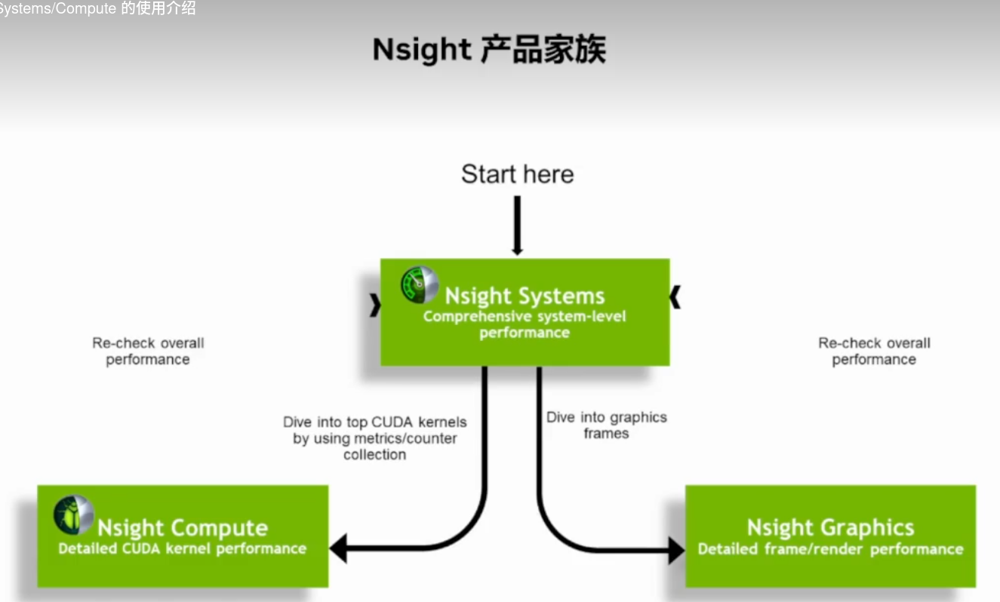

Nsight是一个Nvidia的性能调试工具集其中：

* Nsight Systems是综合的性能分析CPU、GPU之间的协同，整体流程
* Nsight Compute是针对kernel的详细分析
* Nsight Graphics是图形渲染方面的。


## 1.1 Nsight Systems 

下面是Nsight Systems分析的几个方面主要有几个方面：

* SM效率低
  * CPU占用
  * 内存拷贝延迟
  * Kernel Lanch延迟（因为Kernel Lanch 是串行的，可以通过合并kernel来减少延迟，也可以使用kernel Graph来解决）
* GPU利用率低

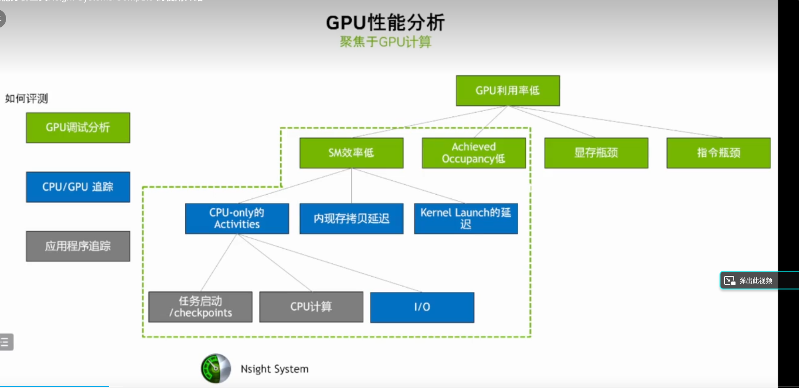


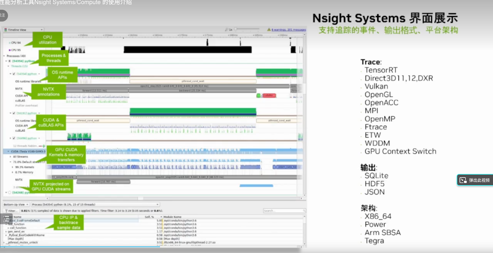

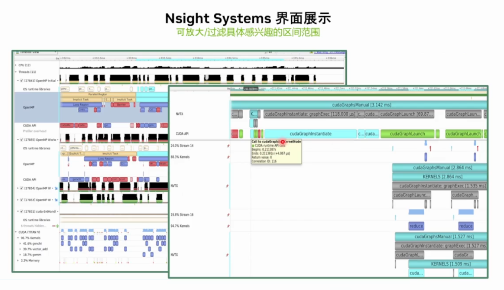

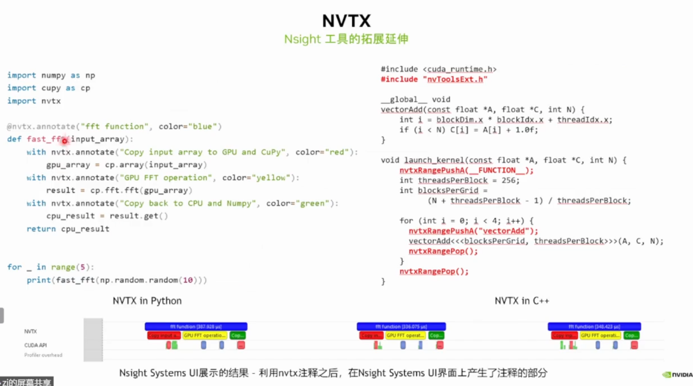

```C
#include <nvtx3/nvToolsExt.h>//#include <nvToolsExt.h> 
#include <sys/syscall.h>
#include <unistd.h>

static void wait(int seconds) {
    nvtxRangePush(__FUNCTION__);
    nvtxMark("Waiting...");
    sleep(seconds);
    nvtxRangePop();
}

int main(void) {
    nvtxNameOsThread(syscall(SYS_gettid), "Main Thread");
    nvtxRangePush(__FUNCTION__);
    wait(1);
    nvtxRangePop();
}


```

### 1.1.1 分析命令

使用命令行分析时需要有对`/tmp`目录的写权限，否则会报错，参考[General Troubleshooting](https://docs.nvidia.com/nsight-systems/UserGuide/index.html#general-troubleshooting)

我这里使用的挂载和命令如下

```bash
mount /dev/vblk_ufsb0 /
mkdir /tmp /opt /root /opt/nvidia
nsys profile -y 10 -d 50 -w true -t "cuda,cudnn,osrt,nvtx,nvmedia" -o ./Zyd24 --cuda-memory-usage=true --accelerator-trace=nvmedia --force-overwrite true ./zydApp
```

距离的指令含义参考[CLI Profile Command Switch Options](https://docs.nvidia.com/nsight-systems/UserGuide/index.html#cli-profile-command-switch-options)

## 1.2 Nsight Compute

下面是Nsight Compute分析的几个方面主要有几个方面：

* GPU利用率低
  * GPU线程少（修改block和grid）
  * 寄存器限制
  * Shared memory太大
* 显存瓶颈
  * Cache misses
  * 带宽限制
  * 访存类型
* 指令瓶颈
  * 算术指令
  * 控制流

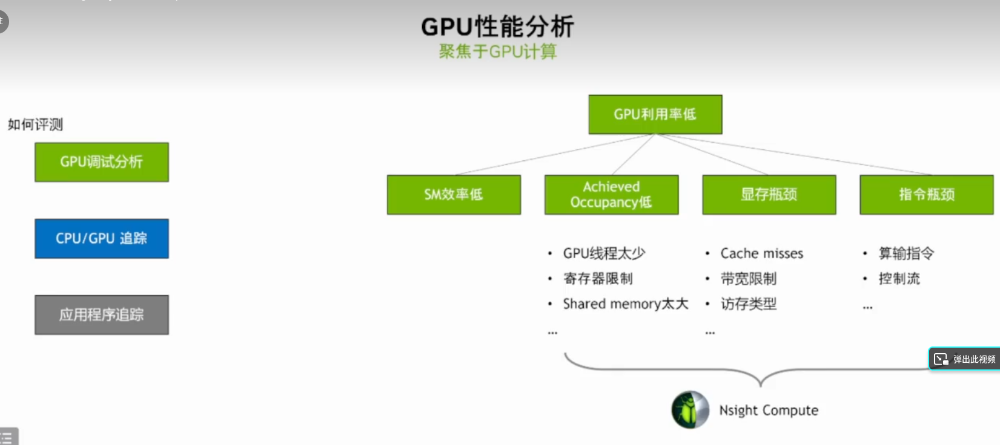

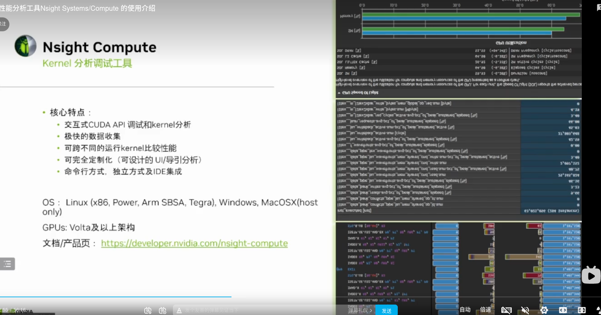

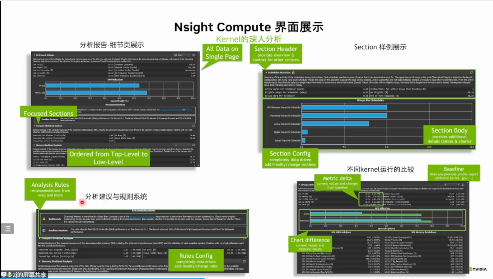

## 1.3 案例

### 1.3.1 利用 Nsight System对简单的深度学习训练神经网络进行性能分析


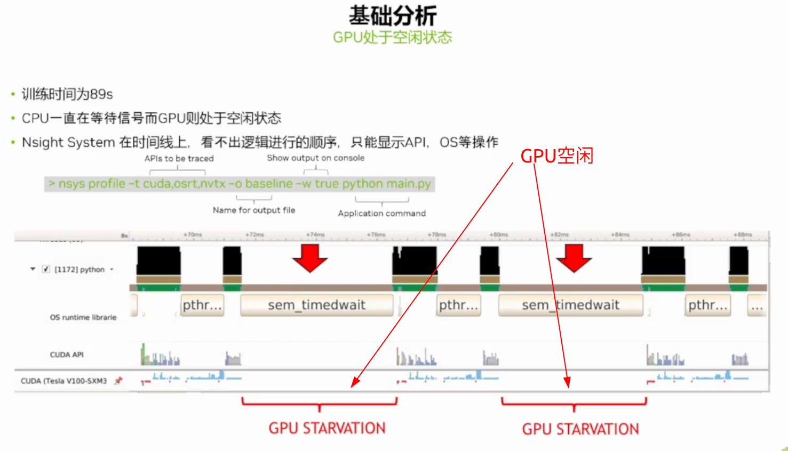

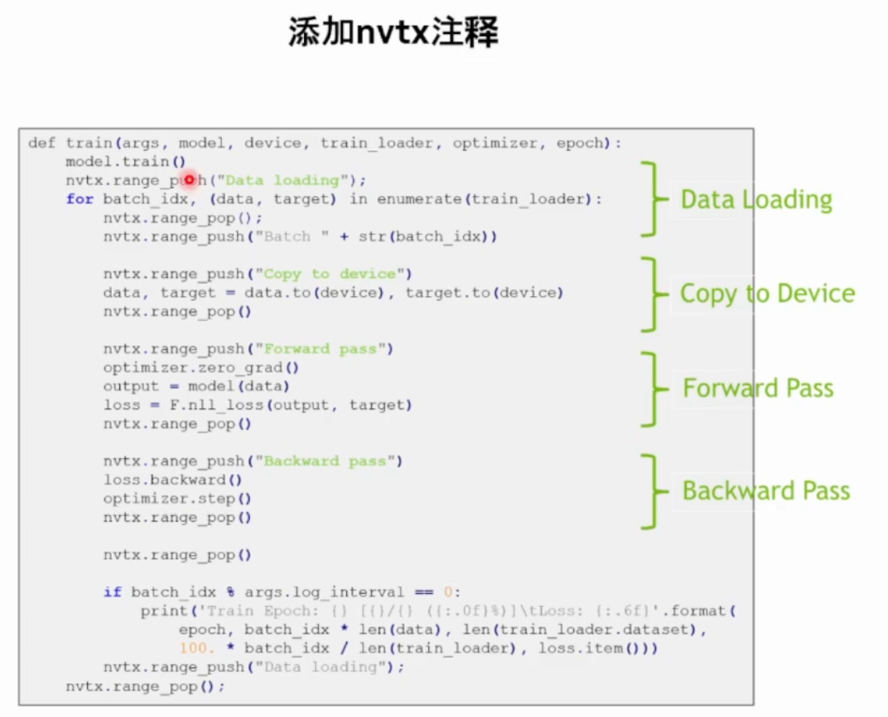


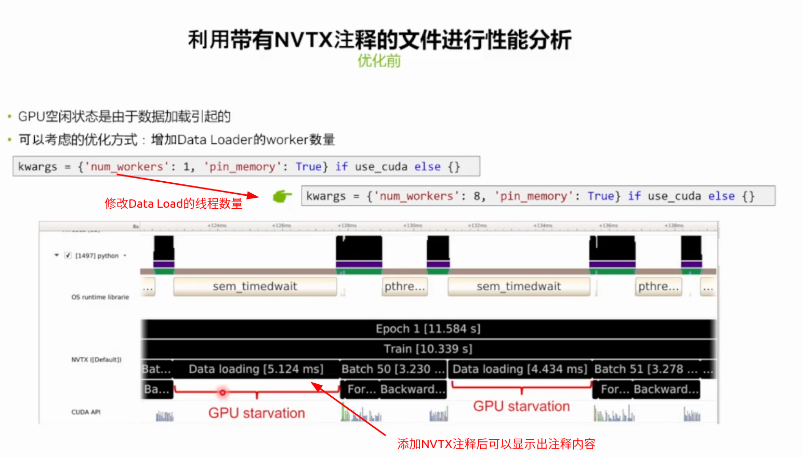

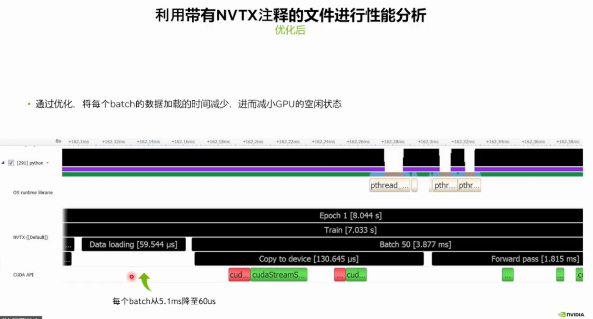

### 1.3.2 利用Nsight System进行性能分析，进而使用混合精度加速BERT


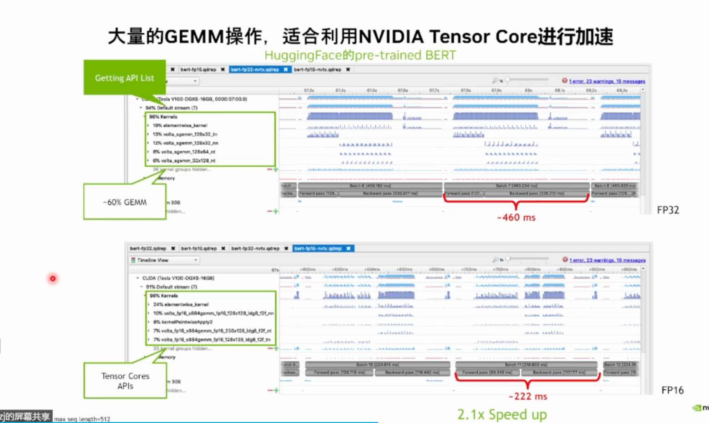

### 1.3.3 利用Nsight Comute进行矩阵转置的kernel分析

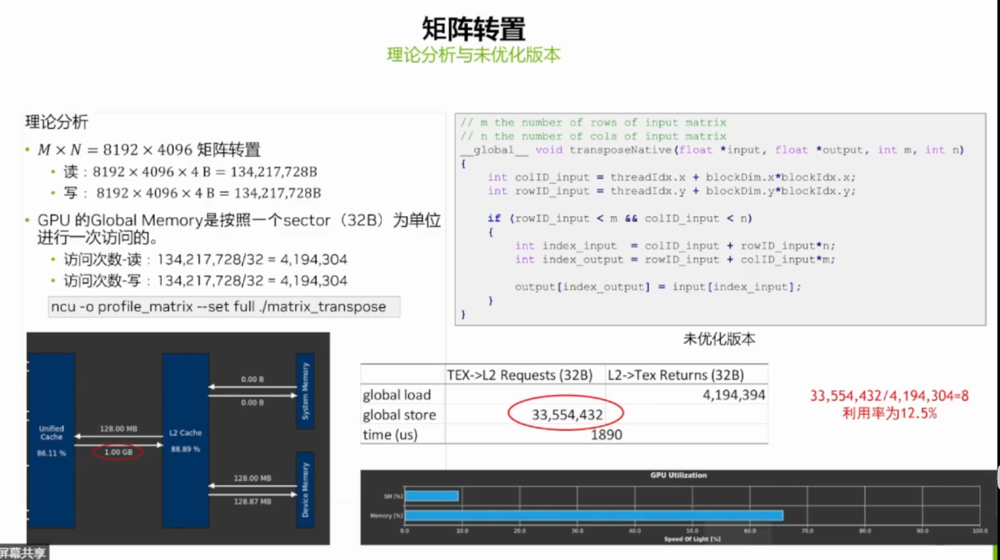

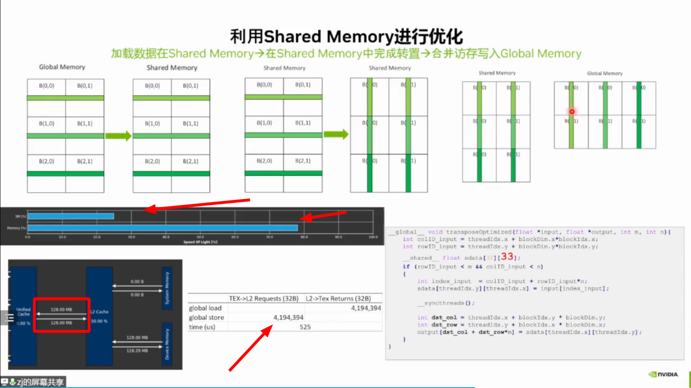


# Nsight Systems

参考：[Installation Guide](https://docs.nvidia.com/nsight-systems/InstallationGuide/index.html)

# 安装指南

# 1 简介

Nsight  Systems是一个具有跟踪功能的统计采样分析器。它旨在与基于NVIDIA Tegra SoC（片上系统）、Arm  SBSA（基于服务器的系统架构）系统、IBM Power系统以及基于x86_64处理器架构（也包括NVIDIA  GPU）的系统的设备和开发套件一起工作。

在本文档中，我们将以进行评测的设备为目标，以用户工作和控制评测会话的计算机为主机。请注意，对于基于x86_64的系统，它们可能位于同一设备上，而对于基于Tegra、Arm或IBM Power的系统，这些系统始终是独立的。

此外，三种不同的活动被区分如下

* 分析—收集任何性能数据的过程。Nsight系统中的分析会话通常包括采样和跟踪。
* 采样-周期性地停止profilee（评测会话期间正在调查的应用程序）的过程，通常用于收集回溯（活动线程的调用堆栈），这允许您从统计上了解每个函数所花费的时间。此外，还可以对硬件计数器进行采样。当采集了少量样本时，该过程本质上是不精确的。
* 跟踪-收集有关配置文件或系统中发生的各种活动的精确信息的过程。例如，可以跟踪profilee API执行，提供函数调用的准确时间和持续时间。

Nsight Systems支持多代Tegra  SoC、NVIDIA分立GPU、各种CPU架构以及各种目标和主机操作系统。本文档描述了Nsight  Systems任何版本中可用的全部功能。如果某个功能在所有版本中都不可用，将在文本中注明。通常，Nsight Systems Embedded  Platforms Edition表示支持嵌入式和汽车市场的Tegra处理器的软件包，而Nsight System Workstation  Edition支持工作站和集群市场的x86_64、IBM Power和Arm服务器（SBSA）处理器。

Nsight Systems在大多数平台上支持的常见功能包括：

* 使用多种算法(如帧指针或DWARF数据)对概要文件进行采样和收集回溯。适当地构建自顶向下、自底向上和平面视图。这些信息有助于识别cpu密集型代码中的性能瓶颈。
* 采样或跟踪系统电源行为，例如CPU频率。
* (仅适用于Nsight系统嵌入式平台版)来自Arm PMU(性能监控单元)的采样计数器。缓存丢失等信息在统计上与函数执行相关。
* 支持多个窗口。具有多个监视器的用户可以同时查看多个报告，或在同一报告文件中具有多个视图。

使用Nsight Systems，用户可以：

* 识别独占CPU的调用路径。
* 识别独占CPU的各个函数(跨不同的调用路径)。
* 对于Nsight Systems嵌入式平台版，识别具有较差缓存利用率的函数。
* 如果平台支持CUDA，请参阅CUDA运行时和驱动程序API调用的可视化表示，以及CUDA GPU工作负载。Nsight Systems使用CUDA分析工具接口(CUPTI)，欲了解更多信息，请参阅:CUPTI文档。[CUPTI documentation](https://docs.nvidia.com/cuda/cupti/index.html).
* 如果用户使用NVIDIA工具扩展(NVTX)进行注释，NVTX注释的可视化表示:范围、标记和线程名。
* 对于Windows目标，请参见D3D12的可视化表示：CPU上正在进行哪些API调用、图形帧、stutter(卡顿)分析以及GPU工作负载（命令列表和调试范围）。
* 有关x86_64目标，请参阅 Vulkan 的可视化表示：在 CPU 上进行哪些 API 调用、图形帧、卡顿分析以及 Vulkan GPU 工作负载（命令缓冲区和调试范围）。

# 2 系统要求

Nsight  Systems支持多个平台。为简单起见，请将其视为Nsight Systems Embedded Platforms  Edition和Nsight System Workstation Edition，其中Nsight系统Workstation  Edition支持在Linux和Windows操作系统上使用x86_64、IBM Power和Arm SBSA  CPU的台式机、工作站和集群，而Nsight Systems Embedded Platforms  Edition支持用于Tegra和QNX操作系统的嵌入式和游戏空间的NVIDIA Tegra产品。

## 2.1支持的平台

L4T (Linux for Tegra)                        

- Jetson AGX Xavier
- Jetson TX2
- Jetson TX2i
- Jetson TX
- Jetson Nano
- Jetson Xavier NX

x86_64, IBM Power (from Power 9),  or Arm SBSA

- NVIDIA GPU architectures starting with Pascal
- OS (64 bit only)
  - Ubuntu 18.04, 20.04, and 22.04
  - CentOS and RedHat Enterprise Linux 7.4+ with kernel version 3.10.0-693 or later.
  - Windows 10, 11, and Win Server 2022

## 2.2 CUDA版本

- Nsight Systems supports CUDA 10.0, 10.1, 10.2, and                                    11.X for most platforms                                 
- Nsight Systems on Arm SBSA supports 10.2 and 11.X                                 

Note that CUDA version and driver version must be compatible.

> | CUDA Version | Driver minimum version |
> | ------------ | ---------------------- |
> | 11.0         | 450                    |
> | 10.2         | 440.30                 |
> | 10.1         | 418.39                 |
> | 10.0         | 410.48                 |

From CUDA 11.X on, any driver from 450 on will be supported, although new                           features introduced in more recent drivers will not be available.                        

For information about which drivers were specifically released with  each toolkit, see  [CUDA Toolkit Release Notes - Major Component Versions](https://docs.nvidia.com/cuda/cuda-toolkit-release-notes/index.html#cuda-major-component-versions)

## 2.3 Linux 上的 x86_64、Power 和 Arm SBSA 目标要求

当从主机上的GUI连接到基于x86_64、Power或Arm SBSA Linux的目标时，将通过SSH建立连接。

**Linux Perf 的使用**：要收集线程调度数据和 IP（指令指针）样本，Linux 操作系统的perf_event_paranoid级别必须为 2 或更小。使用以下命令进行检查：

```shell
cat /proc/sys/kernel/perf_event_paranoid
```

我的电脑显示如下(板子origin用的qnx没有这个文件)

```shell
huolin@huolin:~/WorkSpace/zyd/newaddr$ cat /proc/sys/kernel/perf_event_paranoid
4
huolin@huolin:~/WorkSpace/zyd/newaddr$ 
```

如果输出为 >2，请执行以下操作以临时调整偏执级别（请注意，这必须在每次重新启动后完成）：

```shell
sudo sh -c 'echo 2 >/proc/sys/kernel/perf_event_paranoid'
```

要使更改永久，请使用以下命令：

```shell
sudo sh -c 'echo kernel.perf_event_paranoid=2 > /etc/sysctl.d/local.conf'
```

**内核版本**：要收集线程调度数据和 IP（指令指针）样本和回溯，内核版本必须为：

- 3.10.0-693 or later for CentOS and RedHat Enterprise Linux 7.4+
- 4.3 or greater for all other distros including Ubuntu

要检查目标设备上内核的版本号，请在设备上运行以下命令：

```shell
uname -a
```

请注意，只有 CentOS、RedHat 和 Ubuntu 发行版经过测试/确认可以正常工作。

**glibc 版本**：要检查目标设备上的 glibc 版本，请运行以下命令：

```shell
ldd --version
```

Nsight Systems 需要 glibc 2.17 或更高版本。

**CUDA**：有关此版本中支持的 CUDA 版本，请参阅上文。使用 deviceQuery 命令确定系统上的 CUDA 驱动程序和运行时版本。deviceQuery 命令在 CUDA SDK 中可用。它通常安装在：

```shell
/usr/local/cuda/samples/1_Utilities/deviceQuery
```

仅支持纯 64 位环境。换句话说，不支持在 64 位环境中运行的 32 位系统或 32 位进程。

Nsight Systems需要对目标系统上的/var/lock目录的写入权限。

## 2.4 x86_64 Windows 目标设备要求

DX12 要求：

- Windows 10 with NVIDIA Driver 411.63 or higher for DX12 trace
- Windows 10 April 2018 Update (version 1803, AKA Redstone 4) with                                    NVIDIA Driver 411.63 or higher for DirectX Ray Tracing, and tracing DX12                                    Copy command queues.                                 

## 2.5 主机应用程序要求

Nsight Systems主机应用程序在以下主机平台上运行：

* Windows 10，Windows Server 2019。仅支持 64 位版本。
* 众所周知，Linux Ubuntu 14.04 及更高版本可以工作，在其他现代发行版上运行也应该可以。仅支持 64 位版本。
* OS X 10.10“Yosemite”及更高版本。

# 3 入门指南

## 3.1.找到合适的包装

Nsight Systems可用于多个目标和多个主机操作系统。要选择正确的软件包，首先考虑要分析的目标系统。

* 对于Tegra目标系统，请选择Nsight systems For Tegra，作为NVIDIA JetPack SDK的一部分提供。[NVIDIA JetPack SDK](https://developer.nvidia.com/embedded/jetpack). 
* 对于x86_64、IBM Power目标系统或Arm  SBSA，请从Nsight systems For  Workstations的目标软件包中选择，可从https://developer.nvidia.com/nsight-systems.此web版本将始终包含最新和最伟大的Nsight系统功能。
* CUDA工具包中还提供了Nsight Systems的x86_64、IBM Power和Arm SBSA目标版本。

每个包仅限于一个架构。例如，Tegra软件包不支持评测x86目标，而x86软件包也不支持评测Tegra目标。

选择适当的目标版本后，选择与主机OS相对应的软件包，即系统上要查看结果的OS。这些软件包的形式为常见的安装程序类型：.msi for Windows。对于x86 Linux；，运行.rpm和.deb。deb和.rpm（适用于IBM  Power上的Linux）；macOS安装程序为.dmg。

注意：IBM Power和Arm SBSA包没有用于可视化结果的GUI。如果您希望可视化结果，请下载并安装适用于macOS、x86_64 Linux或Windows系统的GUI。

**Tegra包装**

* Windows主机–在Windows计算机上安装.msi。允许远程访问Tegra设备进行分析。
* Linux主机–在Linux系统上安装并运行。允许远程访问Tegra设备进行分析。
* macOS主机–在macOS计算机上安装.dmg。允许远程访问Tegra设备进行分析。

**x86_64软件包**

* Windows主机–在Windows计算机上安装.msi。允许远程访问Linux x86_64或Windows设备以进行评测以及在本地系统上运行。
* Linux主机–在Linux系统上安装.run、.rpm或.deb。允许远程访问Linux x86_64或Windows设备，以便在本地主机上分析或运行集合。
* macOS主机–在macOS计算机上安装.dmg。允许远程访问Linux x86_64设备进行评测。

**IBM Power软件包**

* 仅限Power CLI—IBM Power支持不包括主机GUI。在电源系统上安装.deb或.rpm。仅启用CLI收集，报告可以在任何受支持的主机平台上的GUI中导入或打开。

**Arm SBSA软件包**

* 仅限Arm SBSA CLI—Arm SBSA支持不包括主机GUI。在Arm SBSA系统上安装.deb或.rpm。仅启用CLI收集，报告可以在任何受支持的主机平台上的GUI中导入或打开。

## 3.2.在主机系统上安装GUI

将适当的文件复制到具有写入和执行权限的目录中的主机系统。运行安装文件，接受EULA，Nsight Systems将在您的系统上安装。

在Linux上，有一些特殊选项可以实现自动安装。使用--accept标志运行安装程序将自动接受EULA，使用--acceptance标志和--quiet标志运行将自动接受该EULA，而不打印到stdout。使用--quiet而不使用--accept运行将显示错误。

安装将为此主机创建一个Host目录，并为Nsight Systems软件包支持的每个目标创建一个Target目录。

在目标设备上收集数据所需的所有二进制文件将在首次连接到设备时由主机安装到目标设备上。无需在目标设备上安装软件包。

如果从CUDA Toolkit安装，请参阅CUDA Toolkit文档。 [CUDA Toolkit documentation](https://docs.nvidia.com/cuda/)

## 3.3. 可选:配置CLI

CLI can be expanded as ‘Command-Line Interface’

可以使用CLI对所有Nsight Systems目标进行概要分析。只能使用CLI分析IBM Power和Arm SBSA目标。当脚本用于运行无人值守集合或无法通过ssh访问目标系统时，CLI特别有用。特别是，这可以用于在Docker容器中启用收集。

CLI可以在Nsight Systems安装的目标目录中找到。希望将CLI作为独立工具安装的用户可以通过将目标目录中的文件复制到他们选择的位置来完成此操作。

如果希望在没有root用户的情况下运行CLI（推荐模式），则需要将其安装在具有完全访问权限的目录中。

设置CLI后，可以使用nsys status-e命令检查环境。

````shell
~$ nsys status -e
       
Sampling Environment Check
Linux Kernel Paranoid Level = 1: OK
Linux Distribution = Ubuntu
Linux Kernel Version = 4.15.0-109-generic: OK
Linux perf_event_open syscall available: OK
Sampling trigger event available: OK
Intel(c) Last Branch Record support: Available
Sampling Environment: OK
````

此状态检查允许您确保在本地环境中满足使用Nsight系统进行CPU采样的系统要求。如果采样环境不正常，您仍然可以运行各种跟踪操作。

Intel（c）Last Branch Record允许包括Nsight Systems在内的工具使用硬件快速获取有限的堆栈信息。如果可用，Nsight Systems将默认使用此方法进行堆栈解析。

有关更改这些环境设置的信息，请参阅《安装指南》中的“系统要求”部分。有关更改回溯方法的信息，请参阅《用户指南》中的CLI评测。

要开始使用CLI，请运行nsys--help以获取选项列表，或参阅《用户指南》中的“从CLI评测应用程序”以获取完整文档。

## 3.4.启动GUI

根据您的操作系统，Nsight系统将在您的主机桌面上安装一个图标，您可以使用它来启动GUI。要直接启动GUI，请在安装的Host子目录下运行`nsight-sys`可执行文件。

# 用户指南

参考：[User Guide](https://docs.nvidia.com/nsight-systems/UserGuide/index.html)

# 1 从 CLI 进行分析（TODO）

# 2 从GUI分析

## 2.1. 从 GUI 分析Linux目标

### 2.1.1. 连接到目标设备

Nsight Systems提供了一个简单的界面，可以在本地主机上进行分析，或通过SSH管理与Linux或Windows设备的多个连接。可以通过设备选择下拉列表启动网络连接管理器：

On x86_64:

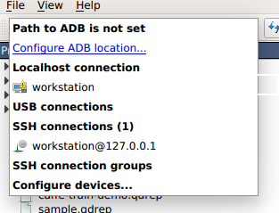

On Tegra:

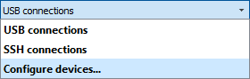

该对话框具有允许添加、删除和修改连接的简单控件：

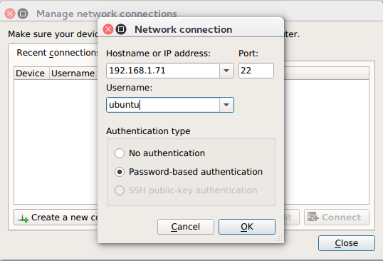

安全通知：SSH 仅用于建立与目标设备的初始连接、执行检查和上传必要的文件。实际的性能分析命令和数据通过原始的未加密套接字传输。Nsight Systems 不应用于可能出现中间攻击者攻击的网络设置，或者不受信任的各方可能对目标设备进行网络访问的网络设置。

“无身份验证”选项对于配置为使用root用户名进行无密码登录的设备非常有用。要启用这样的配置，请在目标上编辑文件/etc/ssh/sshd_config，并指定以下选项：

```shell
PermitRootLogin yes
```

然后使用 `passwd` 设置空密码，并使用`service ssh restart`重新启动 SSH 服务。

开放端口：Nsight Systems 守护程序要求打开端口 22 和端口 45555 进行侦听。您可以使用以下命令确认这些端口是否已打开：

```shell
sudo firewall-cmd --list-ports --permanent 
sudo firewall-cmd --reload
```

要打开端口，请使用以下命令，请跳过 --permanent 选项以仅为此会话打开：

```shell
sudo firewall-cmd --permanent --add-port 45555/tcp 
sudo firewall-cmd --reload
```

同样，如果您在云系统上运行，则必须打开端口 22 和端口 45555 以进行入口。

内核版本号 - 要检查目标设备上 Nsight Systems 的内核支持版本号，请在远程设备上运行以下命令：

```shell
cat /proc/quadd/version
```

支持的最低版本为 1.82。

此外，目标设备上需要存在 Netcat 命令 （nc）。例如，在 Ubuntu 上，可以使用以下命令安装此软件包：

```shell
sudo apt-get install netcat-openbsd
```

### 2.1.2. 系统范围的概要分析选项

# 附录：

官方：

* [Nsight Systems](https://docs.nvidia.com/nsight-systems/index.html#nsight-systems)
  * [Installation Guide](https://docs.nvidia.com/nsight-systems/InstallationGuide/index.html)
  * [User Guide](https://docs.nvidia.com/nsight-systems/UserGuide/index.html)
  * [14. NVTX Trace](https://docs.nvidia.com/nsight-systems/UserGuide/index.html#nvtx-trace)
* [Nsight Compute](https://docs.nvidia.com/nsight-compute/NsightCompute/index.html)

博客：

* https://www.bilibili.com/video/BV15P4y1R7VG/?spm_id_from=333.788.recommend_more_video.-1&vd_source=cde2e7b9bca1a7048a13eaf0b48210b6 