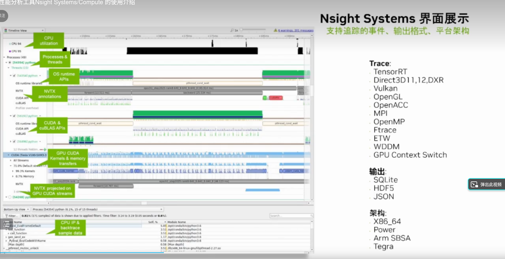
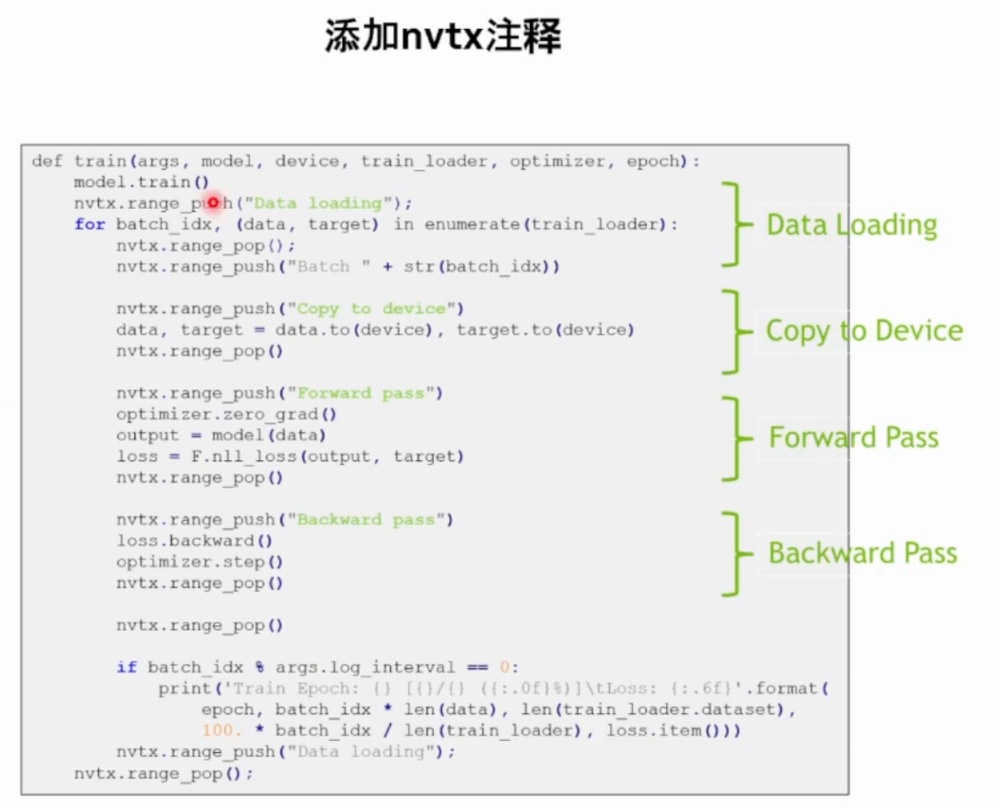
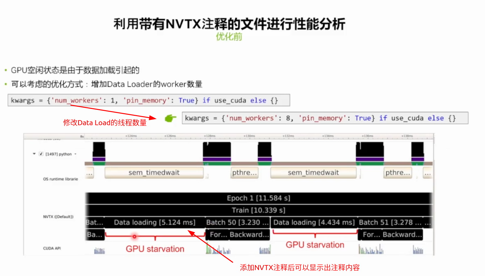
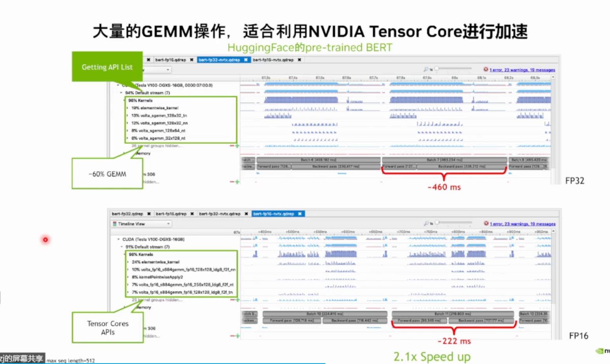

# 1 简介

该笔记参考[深入理解 Nsight System 与 Nsight Compute 性能分析优化工具](https://resources.nvidia.com/ent-gtccn20/gtccn20-CNS20632)，并结合自己之前使用nsys的经验进行总结。

## 1.1 OVERVIEW OF PROFILERS 概述

NVVP Visual Profiler 上一代工具，有图形界面的
nvprof the command-line profiler 上一代工具，命令行的

新一代的：

* Nsight Systems A system-wide performance analysis tool 系统层面的，除了GPU使用还有CPU使用以及CPU和GPU的交互
* Nsight Compute An interactive kernel profiler for CUDA applicationsi，主要是分析CUDA kernel的
* Note that Visual Profiler and nvprof will be deprecated in a future CUDA release
  We strongly recommend you transfer to Nsight Systems and Nsight Compute

## 1.2 NSIGHT PRODUCT FAMILY 产品家族

分析流程

* 首先使用Nsight Systems从系统层面优化内存传输、不必要的同步等
* 如果是cuda compute的程序使用 Nsight Compute来分析优化
* 如果是Graphice程序，使用Nsight Graphics来分析优化
* 优化后再使用Nsight Systems重新进行系统层面分析并重复重复上面的过程直到性能达到需求


## 1.3 OVERVIEW OF OPTIMIZATION WORKFLOW 优化流程


# 2 NSIGHT SYSTEMS

## 2.1 Overview 简介

特性

* System-wide application algorithm tuning
  * Focus on the application’s algorithm – a unique perspective
* Locate optimization opportunities
  * See gaps of unused CPU and GPU time
* Balance your workload across multiple CPUs and GPUs 将任务均匀分布在CPU和GPU上
  * CPU algorithms, utilization, and thread state
  * GPU streams, kernels, memory transfers, etc
* Support for Linux & Windows, x86-64 & Tegra. Host only for Mac





## 2.2 NSIGHT SYSTEMS Key Features 关键特性

使用Nsight Systems可以获取到那些信息呢？

* Compute
  * CUDA API. Kernel launch and execution correlation
  * Libraries: cuBLAS, cuDNN, TensorRT  
  * OpenACC
* Graphics
  * Vulkan, OpenGL, DX11, DX12, DXR, V-sync
* OS Thread state and CPU utilization, pthread, file I/O, etc.
* User annotations API (NVTX)


## 2.3 CPU THREADS Thread Activities CPU线程活动

* Get an overview of each thread’s activities
  * Which core the thread is running and the utilization 线程运行在那一个CPU core上，CPU利用率
  * CPU state and transition 
  * OS runtime libraries usage: pthread, file I/O, etc.
  * API usage: CUDA, cuDNN, cuBLAS, TensorRT, …


## 2.4 OS RUNTIME LIBRARIES 操作系统runtime

Identify time periods where threads are blocked and the reason，找出CPU等待的原因，可能是信号量、文件IO、互斥锁
Locate potentially redundant synchronizations


## 2.5 CUDA API跟踪

Trace CUDA API Calls on OS thread

* See when kernels are dispatched 什么时候kernel被CPU启动的，启动的开销
* See when memory operations are initiated
* Locate the corresponding CUDA workload on GPU
* 可以看出memory和kernel是否并行

## 2.6 GPU WORKLOAD

* See CUDA workloads execution time
* Locate idle GPU times 
* See trace of GPU activity **下图蓝色高就是GPU忙;蓝色低就是kernel执行的时间短，可能是大量的短小的kernel执行**
* Locate idle GPU times


## 2.7 CORRELATION TIES API TO GPU WORKLOAD kernel启动和执行的关联

如下图：kernel的启动是CPU上执行的，GPU上异步执行，可以分析距离是不是kernel lanch的阻塞


## 2.8 NVTX INSTRUMENTATION

NVIDIA Tools Extension (NVTX) to annotate the timeline with application’s logic
Helps understand the profiler’s output in app’s algorithmic context

开发者添加NVTX标签，理解代码的执行。


* Include the header` “nvToolsExt.h”`

* Call the API functions from your source

* Link the NVTX library on the compiler command line with `–lnvToolsExt`

* 在nsys-ui中勾选 **Collect NVTX trace** 或者使用CLI中的 flag ` -t nvtx`

  

* Also supports Python
  CuPy -> https://docs.cupy.dev/en/v9.0.0a1/reference/cuda.html#profiler
  TF -> https://developer.nvidia.com/blog/tensorflow-performance-logging-plugin-nvtx-plugins-
  tf-public/

```c++
#include "nvToolsExt.h"
...
void myfunction( int n, double * x )
{
    nvtxRangePushA("init_host_data");
    //initialize x on host
    init_host_data(n,x,x_d,y_d);
    nvtxRangePop();
}
```


# 3 使用nsight systems的例子

下图是一个常用的 transformer结构，以encoder为例子


## 3.1 Where is the bottleneck for Encoder?

GPU is idle in many time GPU有很多的空闲
Reason: kernels are too small -> kernel launch bound 原因就是kernel太小了，造成了 kernel launch bound

针对one transformer layer有50个kernel来计算，特别是使用11个和kernle来计算layerNorm的过程


## 3.2 解决方案

解决方案就是减少kernel的数量

A simple solution: Using TensorFlow XLA to fuse kernel automatically 自动的，有效但是还有一定的局限性，还是存在kernel之间的空隙。50个减少到了24个kernel
Become better, but still many idle fraction


进一步的优化，faster transformer来做，减少到了14个kernel，如下图


使用纯cpp的API来实现更好的性能如下图


## 3.3 案例2

### 3.3.1 利用 Nsight System对简单的深度学习训练神经网络进行性能分析








### 3.3.2 利用Nsight System进行性能分析，进而使用混合精度加速BERT




### 

# 4 常见问题

使用命令行分析时需要有对`/tmp`目录的写权限，否则会报错，参考[General Troubleshooting](https://docs.nvidia.com/nsight-systems/UserGuide/index.html#general-troubleshooting)

我这里使用的挂载和命令如下

```bash
mount /dev/vblk_ufsb0 /
mkdir /tmp /opt /root /opt/nvidia
nsys profile -y 10 -d 50 -w true -t "cuda,cudnn,osrt,nvtx,nvmedia" -o ./Zyd24 --cuda-memory-usage=true --accelerator-trace=nvmedia --force-overwrite true ./zydApp
```

距离的指令含义参考[CLI Profile Command Switch Options](https://docs.nvidia.com/nsight-systems/UserGuide/index.html#cli-profile-command-switch-options)

# 附录：

* [深入理解 Nsight System 与 Nsight Compute 性能分析优化工具](https://resources.nvidia.com/ent-gtccn20/gtccn20-CNS20632)
* https://www.bilibili.com/video/BV15P4y1R7VG/?spm_id_from=333.788.recommend_more_video.-1&vd_source=cde2e7b9bca1a7048a13eaf0b48210b6 