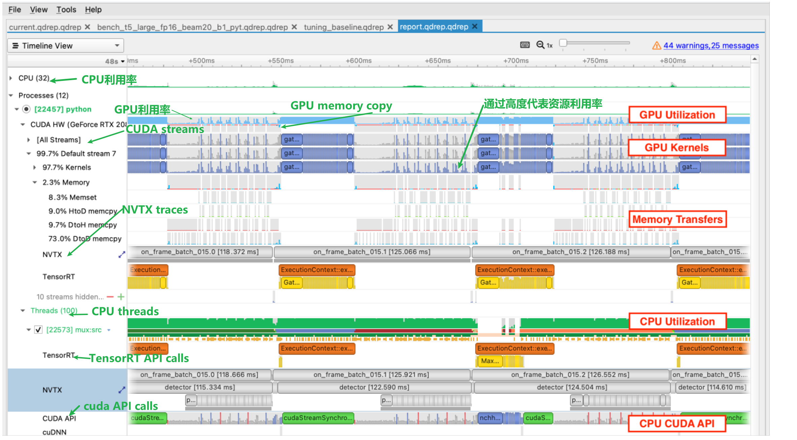
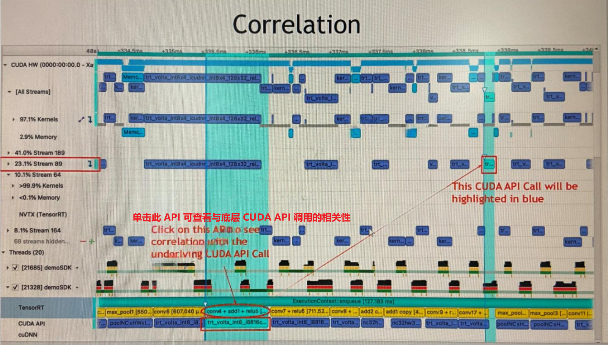

# 1 简介

看了官方的说明文档还是有一点云里雾里，这里说明一些使用nsisght systems过程中的经验之谈。

# 2 CLI

nsisght systems提供了两种使用方式，一种是命令行 一种是GUI。在PC或者有图形界面的系统上我们可以使用GUI来方便的操作i，但是在一些没有图形界面的系统上我们只能使用CLI（命令行）来进行操作

## 2.1 典型的CLI命令

这里列举一些常用的CLI命令，（需要有root权限）

* 为了分析程序在GPU0 上的工作负载

  ```bash
  sudo nsys prof -t cuda,osrt,nvtx --gpu-metrics-device=0 -f true -o report_name <your_app>
  ```

* 为了分析在DLA上上的工作负载

  ```bash
  sudo nsys prof -t cuda,osrt,nvtx,cudla,tegra-accelerator --gpu-metirics-device=0 --accelerator-trace=tegra-accelerators -f true -o report-name <your_app>
  ```

* 为了分析在一段时间内，并且使用 `delay`(-y)和`duration`(-d)

  ```bash
  sudo nsys profile --delay=10 --duration=15 .....
  ```

* 使用API来控制分析的的范围，（-c） 使用cuda profile APIS 来确定分析程序的范围

  ```bash
  sudo nsys profile --capture-range=cudaProfilerApi ....
  ```

  这时需要对程序代码做一些修改

  * include cuda 头文件"cuda_profile_api.h"
  * 在代码中添加`cudaProfileStart()`和`cudaProfileStop()`在代码段的前后
  * 重新编译程序

* 为了收集backtrace on cuda apis ,需要设定一个模式，这会加大开销

  ```bash
  sudo nsys profile -t cuda,osrt,nvtx --cudabacktrace=all:100 -f true -o report_name <your_app>
  ```

* 可以分析多个进程，使用一个bash脚本来运行所有的进程，然后使用nsigth来分析这个脚本

  ```bash
  sudo nsys profile [options] ./your_script
  ```

  在QNX系统上需要添加一个参数`--process-scope=system-wide`

  ```bash
  sudo nsys profile [options] --process-scope=system-wide ./your_script
  ```

* 为了降低分析时的开销，可以禁止采样或者设置采样频率

  ```bash
  sudo nsys profile --sample=none --coutxse=none ...
  sudo nsys profile --sampling-frequency=8000 --osrt-threshold=10000 ....
  ```

# 3 系统级的程序调优

* 平衡在CPU和GPU上的工作负载
* 发现为使用的GPU和CPU时间
* 发现不必要的同步
* 发现优化时机
* 提高应用性能

# 4 在车载平台上使用

**在使用nvidia的drive orin时 我们需要使用与drive os匹配的版本，否则将会出现不可预知的错误。**

在安装Drive OS SDK的安装包时会安装对应的版本。

在HOST上，安装和Drive OS SDK一同发布的deb包

```bash
sudo dpkj -i NsightSystems-linux-nda-202*.*deb
sudo apt update
sudo apt install nsight-systems-202*
```

在QNX系统上，需要root权限的读写

```bash
mkqnx6fs /dev/vblk_ufs50
mount /dev/vblk_ufs50 /
mkdir /tmp /opt /opt/nvidia /root
```

## 4.1 在HOST上使用Nsight Systems GUI进行分析

在HOST远程分析我们在orin上运行的程序需要设置orin的ssh 

## 4.2 在设备上使用Nsight Systems CLI进行分析

我们也可以在orin上使用命令行的方式来在本地使用Nsight Systems

```bash
sudo nsys profile -y 10 -d 15 -w true -t "cuda,osrt,nvtx,cudla" -f true -o /path_to_save/report1 --accelerator-trace=tegra-accelerates <your_app>
```

* prifile:开始分析
* -y：延迟收集 单位秒
* -d：收集时长，单位秒
* -w true ：
* -t：设置需要跟踪的API
* -f ：如果时true 覆盖已经存在的outputfile
* -o：输出报告的文件名，会在结束收集时创建
* --accelerator-trace ：收集其他加速器的工作负载，对于tegra-accelerators 就是DLA

如果希望在生成报告时不kill程序，并且自己控制分析的时间。可以使用下面的方法

打开两个终端

```bash
sudo nsys launch --session-new=sessname ...<your_app>
```

在第二个终端中，如果你希望开始进行分析

```bash
sudo nsys start --sennsion=sessname -t cuda,osrt,nvtx --gpu-metrices-device=0 -f true -o report_name ...
```

当你想停止分析时在第二个终端中输入

```bash
sudo nsys stop --session=sessname
```

# 5 profile告诉了我们什么



