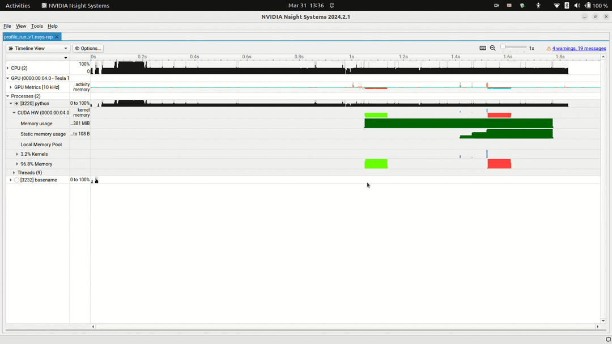
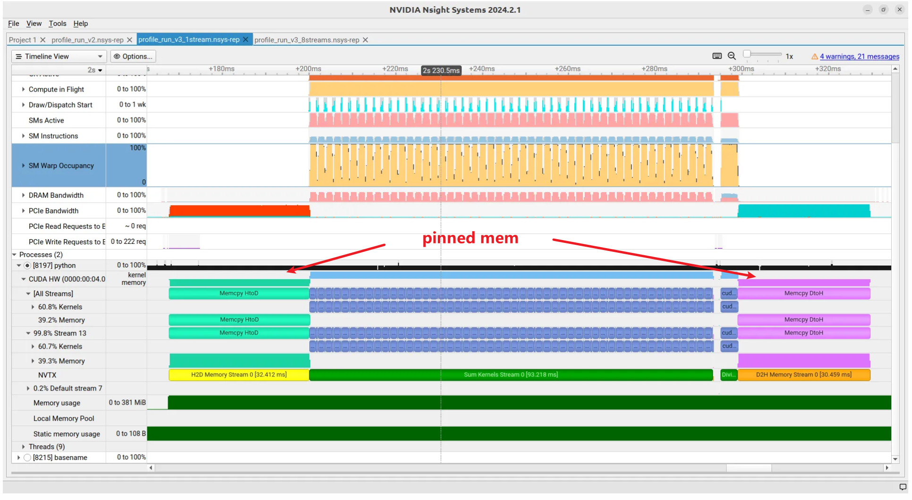

# 1 前言

记录一次使用nsigth system来分析一个推理进程异步的内存拷贝耗时异常问题。

# 2 背景

我有一个进程，运行在nvidia orin平台上，该进程有大量的推理线程执行不同的推理任务。

但是在日志记录我发现一个异常情况，我的一个任务的前处理有一个H2D的内存拷贝耗时异常，我使用的是一部内存拷贝，cudaMemcpyAsync函数来做的，理论上一异步的这个内存拷贝应该直接就返回了，但是我却发现这个函数耗时最多有20ms，并且不稳定。于是开始使用了nsight System来进行分析。

1. 我的每一个推理线程都使用了cuda Graph 但是不是所有的前处理、推理、后处理都在Graph中。
2. 使用cuda event 来观察cudaMemcpyAsync的耗时一直都是正常的，也就是GPU端应该是正常的。

# 3 分析

下图 是我使用nsight System抓取的一次异常（注意不是每一次都是异常的）

从下图分析，cudaMemcpyAsync 从CPU段调用耗时20ms 但是在GPU段执行也就是2ms不到。为什么在CPU端会耗时呢？

看下面的分析：

因为我在另一个任务2的推理和后处理是一个cuda Graph。但是这个任务2的后处理中使用到了`Pageable host memory`并调用了D2H的操作。就是这个内存和操作导致了我的任务`cudaMemcpyAsync`耗时异常。可以参考[API synchronization behavior](https://docs.nvidia.com/cuda/cuda-runtime-api/api-sync-behavior.html#api-sync-behavior__memcpy-async) 的说明。大概意思就是如果我们使用的内存是`Pageable host memory`那么我们调用`cudaMemcpyAsync`会是一个同步操作。

另外：这个操作会block 其他的所有 task 提交任务 ` it will block all threads from submitting CUDA tasks.`,我这里还是使用了cuda Graph 因此我理解是整个任务2的cuda Graph执行期间，其他任务都不能提交。因此导致了其他任务的延迟。

备注：在nsigth System 中 host与device的内存交换有不同的颜色指示

Pageable memory 如下图

H2D：绿色

D2H：红色

pinned memory的颜色如下图

H2D：亮绿色

D2H：紫色

# 附录：

* [API synchronization behavior](https://docs.nvidia.com/cuda/cuda-runtime-api/api-sync-behavior.html#api-sync-behavior__memcpy-async) 

