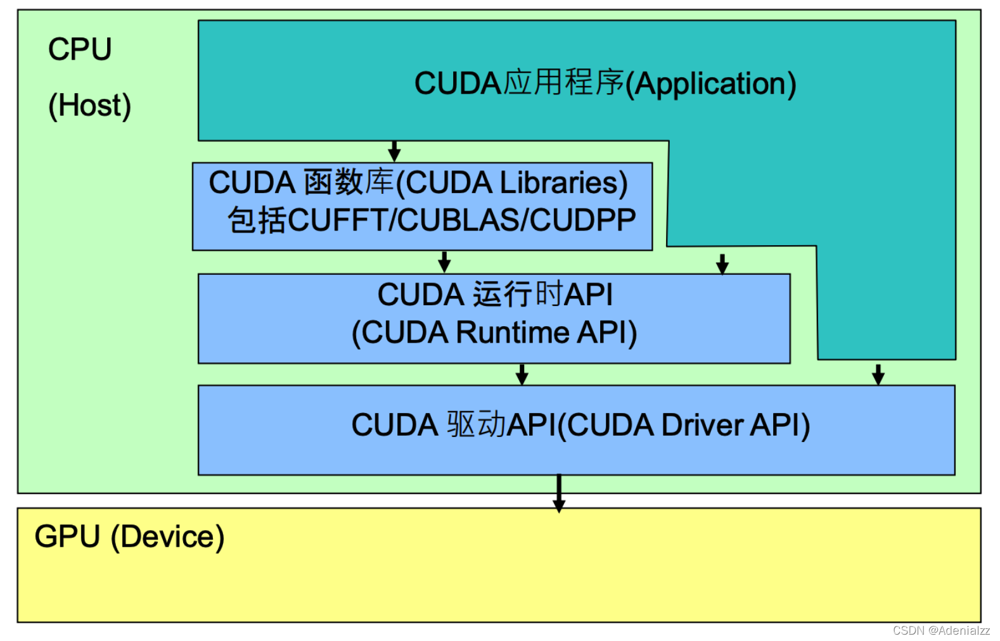
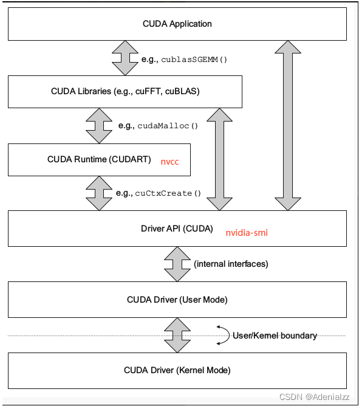

# 1 cuda API简介

CUDA是由NVIDIA推出的通用并行计算架构，通过一些CUDA库提供了一系列API供应用程序调用。开发者可调用这些API充分利用GPU来处理图像，视频解码等。

CUDA 的 API 其实是可以分层次来理解的，这也造成了有时会出现 nvcc -V 显示的 CUDA 版本和 nvidia-smi 显示的 CUDA 版本不一致的情况，其实这就是由于它们根本就是不同层次的 API，因此并不一定是一起安装的，也就不一定是同一个版本的。

CUDA API体系包括：CUDA函数库（CUDA Libraries），CUDA运行时API（CUDA Runtime API），CUDA驱动API（CUDA Driver API），结构图如下：





**CUDA Driver API**

GPU设备的抽象层，通过提供一系列接口来操作GPU设备，性能最好，但编程难度高，一般不会使用该方式开发应用程序。

用于支持driver API的必要文件(如**libcuda.so**)是由GPU driver installer安装的。 我么你常用的 nvidia-smi就属于这一类API。
**CUDA Runtime API**

对CUDA Driver API进行了一定的封装，调用该类API可简化编程过程，降低开发难度。

用于支持runtime API的必要文件(如**libcudart.so以及nvcc**)是由CUDA Toolkit installer安装的。

**CUDA Toolkit Installer**

有时可能会集成了GPU driver Installer。nvcc是与CUDA Toolkit一起安装的CUDA compiler-driver tool，即 CUDA 的编译器，它只知道它自身构建时的 CUDA runtime版本。它不知道安装了什么版本的GPU driver，甚至不知道是否安装了GPU driver。
**CUDA Libraries**

是对CUDA Runtime API更高一层的封装，通常是一些成熟的高效函数库，开发者也可以自己封装一些函数库便于使用。

比如常见的 cuFFT、cuBLAS 库。
**关系**

应用程序可调用CUDA Libraries或者CUDA Runtime API来实现功能，当调用CUDA Libraries时，CUDA Libraries会调用相应的CUDA Runtime API，CUDA Runtime API再调用CUDA Driver API，CUDA Driver API再操作GPU设备。

**cudatoolkit**
几个概念辨析

* CUDA：为“GPU通用计算”构建的运算平台。
* cuDNN：为深度学习计算设计的软件库。
* CUDA Toolkit (Nvidia)： CUDA完整的工具安装包，其中提供了 Nvidia 驱动程序、开发 CUDA 程序相关的开发工具包等可供安装的选项。包括 CUDA 程序的编译器、IDE、调试器等，CUDA 程序所对应的各式库文件以及它们的头文件。
* CUDA Toolkit (Pytorch)： CUDA不完整的工具安装包，其主要包含在使用 CUDA 相关的功能时所依赖的动态链接库。不会安装驱动程序。
* NVCC 是CUDA的编译器，只是 CUDA Toolkit 中的一部分


注：CUDA Toolkit 完整和不完整的区别：在安装了CUDA Toolkit (Pytorch)后，只要系统上存在与当前的 cudatoolkit 所兼容的 Nvidia 驱动，则已经编译好的 CUDA 相关的程序就可以直接运行，不需要重新进行编译过程。如需要为 Pytorch 框架添加 CUDA 相关的拓展时（Custom C++ and CUDA Extensions），需要对编写的 CUDA 相关的程序进行编译等操作，则需安装完整的 Nvidia 官方提供的 CUDA Toolkit。
**完整版cudatoolkit内容**

一般的结构中，include 包含头文件，bin 包含可执行文件，lib 包含程序实现文件编译生成的library，src包含源代码，doc或help包含文档，samples包含例子。

* Compiler：NVCC
* Tools：分析器profiler、调试器debuggers等
* Libraries：科学库和实用程序库
* CUDA Samples：CUDA和library API的代码示例
* CUDA Driver：驱动，需要与“有CUDA功能的GPU”和“CUDA”都兼容。CUDA工具包都对应一个最低版本的CUDA Driver，CUDA Driver向后兼容。

# 2 cuda Driver API

## 2.1 cuda Driver API概述

对于 Driver API 你需要知道：

* CUDA Driver 是与 GPU 沟通的驱动级别底层 API
* 对 Driver API 的理解，有利于理解后续的 Runtime API
* CUDA Driver 随显卡驱动发布，需要与 cudatoolkit 分开看
* CUDA Driver 对应于 **cuda.h 和 libcuda.so**
* Driver API 主要知识点是 Context 的管理机制 以及 CUDA 系列接口的开发习惯（错误检查方法），还有内存模型
* Driver API 基本都是 `cu` 开头的，而Runtime API 基本都是以 `cuda` 开头的。

从图中可知我们平时常用的 nvidia-smi 调用的是 Driver API。最开始 Driver API 是与显卡沟通的底层 API，但是人们发现 Driver API 太过底层，由此引入了 Runtime API。从图中可以看出 Runtime API 是基于 Driver API 开发的，我们日常中见到的 cudaMalloc()、cudaMemset()、cudaMemcpy() 都属于 Runtime API。像 cu 开头的如 cuCtxCreate() 就属于 Driver API。

值得注意的是，cuda.h 是 NVIDIA CUDA Toolkit 中的一部分。CUDA Toolkit 是 NVIDIA 提供的用于开发 GPU 加速应用程序的软件开发工具包，其中包含了用于编译和执行 CUDA 程序的各种库和头文件。而 libcuda.so 是 NVIDIA 显卡驱动安装到系统中时随之安装的一个共享库文件。

cuda.h 提供了 CUDA 编程的接口和声明，而 libcuda.so 则是运行库，提供了 CUDA 运行时所需的底层功能和支持。

## 2.2 为什么需要cuda Driver API

为什么需要了解 Driver API 呢，直接看更高级的 Runtime API 不就行了吗？

这一部分官方也有一个大概的描述[1. Difference between the driver and runtime APIs](https://docs.nvidia.com/cuda/archive/11.4.4/cuda-runtime-api/driver-vs-runtime-api.html#driver-vs-runtime-api) 

* Driver API 是理解 cudaRuntime 中上下文的关键
* Driver API 只需要做到理解 context 即可，知道它的存在就行
* 开发过程中可能因为对 Driver API 的理解不够，造成上层调试困难
* 对于越底层的 api，做一些了解，有利于高层遇到问题后排查原因

我的理解主要在与cuda context的管理上。对于cuda context的管理下一篇文章会专门讲解。

## 2.3 错误处理

官方版本的检查的逻辑，如下：

```C
// 使用有参宏定义检查cuda driver是否被正常初始化, 并定位程序出错的文件名、行数和错误信息
// 宏定义中带do...while循环可保证程序的正确性
#define checkDriver(op)    \
    do{                    \
        auto code = (op);  \
        if(code != CUresult::CUDA_SUCCESS){     \
            const char* err_name = nullptr;     \
            const char* err_message = nullptr;  \
            cuGetErrorName(code, &err_name);    \
            cuGetErrorString(code, &err_message);   \
            printf("%s:%d  %s failed. \n  code = %s, message = %s\n", __FILE__, __LINE__, #op, err_name, err_message);   \
            return -1;   \
        }                \
    }while(0)
```

是一个宏定义，我们在调用其他 API 的时候，对函数的返回值进行检查，并在出错时将错误码和报错信息打印出来，方便调试。比如：

```C
checkDriver(cuDeviceGetName(device_name, sizeof(device_name), device));
```

修改好用的版本如下

```C
// 很明显，这种代码封装方式，更加的便于使用
//宏定义 #define <宏名>（<参数表>） <宏体>
#define checkDriver(op)  __check_cuda_driver((op), #op, __FILE__, __LINE__)

bool __check_cuda_driver(CUresult code, const char* op, const char* file, int line){

    if(code != CUresult::CUDA_SUCCESS){    
        const char* err_name = nullptr;    
        const char* err_message = nullptr;  
        cuGetErrorName(code, &err_name);    
        cuGetErrorString(code, &err_message);   
        printf("%s:%d  %s failed. \n  code = %s, message = %s\n", file, line, op, err_name, err_message);   
        return false;
    }
    return true;
}
```

很明显的，版本二的返回值、代码可读性、封装性等都相较版本一好了很多。使用的方式是一样的：

```C
checkDriver(cuDeviceGetName(device_name, sizeof(device_name), device));
// 或加一个判断，遇到错误即退出
if (!checkDriver(cuDeviceGetName(device_name, sizeof(device_name), device))) 
{
    return -1;
}
```


# 3 cuda runtime API

## 3.1 cuda runtime API简介

 Driver API 太过底层，细节太过复杂，故演变出了 Runtime API，Runtime API 是基于 Driver API 开发的，常见的 `cudaMalloc()` 等 API 都是 Runtime API。**可自动管理 context 的创建**

图中可以看到，Runtime API 是基于 Driver API 之上开发的一套 API。**我们一般程序使用的都是runtime API**

**Runtime API 的特点**

* Runtime API 基本都是以 `cuda` 开头的。

* Runtime API 与 Driver API 最大的区别是懒加载 ，即在真正执行功能时才自动完成对应的动作，即：
  * 第一个 Runtime API 调用时，会自动进行 cuInit 初始化，避免 Driver API 未初始化的错误；
  * 第一个需要 context 的 API 调用时，会创建 context 并进行 context 关联，和设置当前 context，调用 cuDevicePrimaryCtxRetain 实现
  * 绝大部分 api 都需要 context，例如查询当前显卡名称、参数、内存分配释放等

* CUDA Runtime 是封装了 CUDA Driver 的更高级别、更友好的 API
* **Runtime API 使用 cuDevicePrimaryCtxRetain 为每个设备设置 context，不再手动管理 context，并且不提供直接管理 context 的 API（可 Driver API 管理，通常不需要）**
* 可以更友好地执行核函数，.cpp 可以与 .cu 文件无缝对接
* **Runtime API 对应 cuda_runtime.h 和 libcudart.so**
* Runtime API 随 cudatoolkit 发布
* 主要知识点是核函数的使用、线程束布局、内存模型、流的使用
* 主要是为了实现归约求和、放射变换、矩阵乘法、模型后处理，就可以解决绝大部分问题

## 3.2 错误处理

```C
#define checkRuntime(op)  __check_cuda_runtime((op), #op, __FILE__, __LINE__)

bool __check_cuda_runtime(cudaError_t code, const char* op, const char* file, int line){
    if(code != cudaSuccess){
        const char* err_name = cudaGetErrorName(code);
        const char* err_message = cudaGetErrorString(code);
        printf("runtime error %s:%d  %s failed. \n  code = %s, message = %s\n", file, line, op, err_name, err_message);
        return false;
    }
    return true;
}
```


# 附录：

* 官方：[17. Driver API](https://docs.nvidia.com/cuda/cuda-c-programming-guide/index.html#driver-api)
* 博客：[2.1.cuda驱动API-概述](https://blog.csdn.net/qq_40672115/article/details/131606080?spm=1001.2014.3001.5502) 
* 博客：[CUDA环境详解](https://blog.csdn.net/weixin_44966641/article/details/123776001)
* 博客：[精简CUDA教程——CUDA Runtime API](https://blog.csdn.net/weixin_44966641/article/details/124500258)

