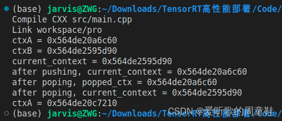
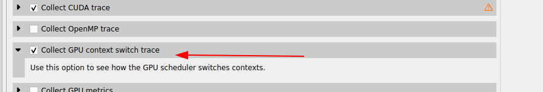
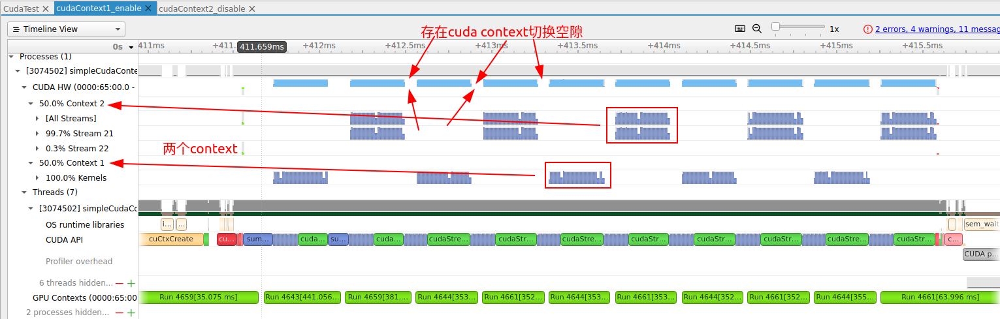
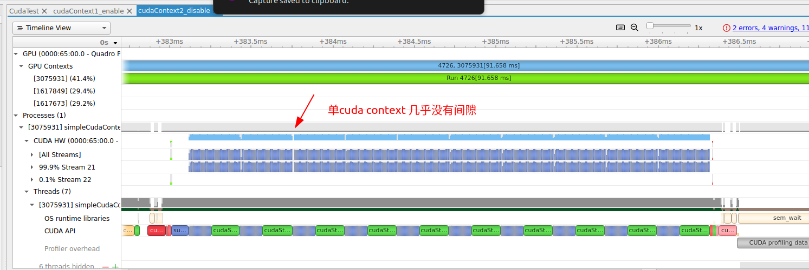

# 1 前言

在上一篇文章《1-cuda_API》中降到`cuda Driver API`主要的一个作用就是管理`cuda Context`，那么这里讲解一下什么是`cuda Context`

# 2 cuda context 简介

官方文档[17.1. Context](https://docs.nvidia.com/cuda/cuda-c-programming-guide/index.html#context)一段话如下：

```tex
A CUDA context is analogous to a CPU process. All resources and actions performed within the driver API are encapsulated inside a CUDA context, and the system automatically cleans up these resources when the context is destroyed.
```

翻译过来就是

```tex
CUDA 上下文类似于 CPU 进程。驱动程序 API 中执行的所有资源和操作都封装在 CUDA 上下文中，当上下文被破坏时，系统会自动清理这些资源。
```

官方[10.6. Multiple contexts](https://docs.nvidia.com/cuda/archive/11.4.4/cuda-c-best-practices-guide/index.html#multiple-contexts)解释

```tex
CUDA work occurs within a process space for a particular GPU known as a context. The context encapsulates kernel launches and memory allocations for that GPU as well as supporting constructs such as the page tables. The context is explicit in the CUDA Driver API but is entirely implicit in the CUDA Runtime API, which creates and manages contexts automatically.

With the CUDA Driver API, a CUDA application process can potentially create more than one context for a given GPU. If multiple CUDA application processes access the same GPU concurrently, this almost always implies multiple contexts, since a context is tied to a particular host process unless Multi-Process Service is in use.

While multiple contexts (and their associated resources such as global memory allocations) can be allocated concurrently on a given GPU, only one of these contexts can execute work at any given moment on that GPU; contexts sharing the same GPU are time-sliced. Creating additional contexts incurs memory overhead for per-context data and time overhead for context switching. Furthermore, the need for context switching can reduce utilization when work from several contexts could otherwise execute concurrently (see also Concurrent Kernel Execution).

Therefore, it is best to avoid multiple contexts per GPU within the same CUDA application. To assist with this, the CUDA Driver API provides methods to access and manage a special context on each GPU called the primary context. These are the same contexts used implicitly by the CUDA Runtime when there is not already a current context for a thread. 
```

翻译过来就是

```tex
CUDA 工作发生在称为上下文的特定 GPU 的进程空间内。上下文封装了 GPU 的内核启动和内存分配以及页表等支持结构。上下文在 CUDA 驱动程序 API 中是显式的，但在 CUDA 运行时 API 中是完全隐式的，它会自动创建和管理上下文。
借助 CUDA 驱动程序 API，CUDA 应用程序进程可以为给定 GPU 创建多个上下文。如果多个 CUDA 应用程序进程同时访问同一 GPU，则这几乎总是意味着多个上下文，因为除非使用多进程服务，否则上下文会绑定到特定主机进程。
虽然可以在给定 GPU 上同时分配多个上下文（及其相关资源，例如全局内存分配），但在任何给定时刻，只有这些上下文之一可以在该 GPU 上执行工作；共享相同 GPU 的上下文是时间切片的。创建额外的上下文会导致每个上下文数据的内存开销和上下文切换的时间开销。此外，当来自多个上下文的工作可以同时执行时，上下文切换的需要可能会降低利用率（另请参阅并发内核执行）。
因此，最好避免同一 CUDA 应用程序中每个 GPU 有多个上下文。为了帮助实现这一点，CUDA 驱动程序 API 提供了访问和管理每个 GPU 上称为主上下文的特殊上下文的方法。当线程尚不存在当前上下文时，CUDA 运行时隐式使用这些上下文。
```

总结下来就是：

* context 是一种上下文，可以关联对 GPU 的所有操作

* **在任何给定的时间，一个 GPU 上只能有一个活动的 CUDA context。**（关于cuda context的调度策策略我没有找到）

  虽然 CUDA context 在运行时可以被创建和销毁，但同一时间只有一个 context 可以与 GPU 进行交互。当你在同一 GPU 上创建一个新的 CUDA context 时，它会覆盖之前的 context。

  在单 GPU 环境下，多个任务通常使用 CUDA streams 来实现并发性，而无需创建多个 CUDA context。CUDA  streams 允许在同一个 context 中并发地执行多个任务，而不需要切换 context，从而提高了 GPU 的利用率。

* context 与一块显关联，一个显卡可以被多个 context 关联

  在单 GPU 环境下，`cuCtxCreate` 可以用来创建一个 CUDA 上下文，然后在该上下文中执行 CUDA 的计算任务。这是 CUDA 编程中常见的用法（**在单 GPU 环境下，通常使用多个 CUDA stream 可以更有效地进行并发计算，而不太需要显式地创建多个 CUDA context。在单  GPU 上切换 CUDA context 确实可能涉及到一些开销，而多个 stream  可以通过异步执行来提高并发性，而不引入额外的上下文切换开销**。）。

  在多 GPU 环境下，如果系统中有多个 GPU 设备，每个 GPU 设备都有自己的 primary context。你可以使用 `cuCtxCreate` 来创建多个上下文，每个上下文关联到不同的 GPU 设备上。这样，你就可以在多个 GPU 上并行地执行 CUDA 计算任务。

  **如果您有多进程使用 GPU，通常会在该 GPU 上创建多个上下文。正如您所发现的，可以从单个进程创建多个上下文，但通常没有必要。**

  **总的来说，`cuCtxCreate` 主要用于创建 CUDA 上下文，而在多 GPU 环境下，可以用它来创建多个上下文以便在多个 GPU 上并行执行任务。**

* 每个线程都有一个栈结构储存 context，栈顶是当前使用的 context，对应有 push、pop 函数操作 context 的栈，所有 api 都以当前 context 为操作目标

* 由于是高频操作，是一个线程基本固定访问一个显卡不变，且只使用一个 context，很少会用到多 context

* CreateContext、PushCurrent、PopCurrent 这种多 context 管理就显得麻烦，还得再简单

* 因此推出了 cuDevicePrimaryCtxRetain，为设备关联主 context，分配、释放、设置、栈都不用你管

## 2.1 关于cuDevicePrimaryCtxRetain

`cuDevicePrimaryCtxRetain` 函数的作用是增加一个 GPU 设备的 primary context 的引用计数。在多线程环境下，如果一个线程先后使用了 GPU，并在释放资源时调用了 `cuCtxDestroy` 来销毁上下文，如果其他线程仍需要使用这个 GPU，它们就会面临没有有效上下文可用的问题。

`cuDevicePrimaryCtxRetain` 的作用就是为了避免这个问题。它会增加 primary context 的引用计数，使得即使一个线程销毁了它的上下文，其他线程仍然可以继续使用。当其他线程不再需要 GPU 时，它们可以通过调用 `cuCtxDestroy` 来减少引用计数，当引用计数降为零时，真正地释放资源。

这样，使用 `cuDevicePrimaryCtxRetain` 可以确保在多线程环境中，一个线程使用完 GPU 后，其他线程仍能够在同一个 GPU 上使用有效的 CUDA 上下文，而不受到一个线程释放上下文的影响。

## 2.2 管理cuda context

如何管理上下文：

* 在 cuda driver 同样需要显示管理上下文
* 开始时 cuCtxCreate() 创建上下文，结束时 cuCtxDestroy 销毁上下文。像文件管理一样需手动开关。
* 用 cuDevicePrimaryCtxRetain() 创建上下文更好！
* cuCtxGetCurrent() 获取当前上下文
* 可以使用堆栈管理多个上下文 cuCtxPushCurrent() 压入，cuCtxPopCurrent() 推出
* 对 ctxA 使用 cuCtxPushCurrent() 和 cuCtxCreate() 都相当于将 ctxA 放到栈顶（让它成为 current context）
* cuda runtime 可以自动创建，是基于 cuDevicePrimaryCtxRetain() 创建的

切换cuda context的示例代码如下：

```C
// CUDA驱动头文件cuda.h
#include <cuda.h>   // include <> 和 "" 的区别    
#include <stdio.h>  // include <> : 标准库文件 
#include <string.h> // include "" : 自定义文件  详细情况请查看 readme.md -> 5

#define checkDriver(op)  __check_cuda_driver((op), #op, __FILE__, __LINE__)

bool __check_cuda_driver(CUresult code, const char* op, const char* file, int line){
    if(code != CUresult::CUDA_SUCCESS){    // 如果 成功获取CUDA情况下的返回值 与我们给定的值(0)不相等， 即条件成立， 返回值为flase
        const char* err_name = nullptr;    // 定义了一个字符串常量的空指针
        const char* err_message = nullptr;  
        cuGetErrorName(code, &err_name);    
        cuGetErrorString(code, &err_message);   
        printf("%s:%d  %s failed. \n  code = %s, message = %s\n", file, line, op, err_name, err_message); //打印错误信息
        return false;
    }
    return true;
}

int main(){

    // 检查cuda driver的初始化
    checkDriver(cuInit(0));

    // 为设备创建上下文
    CUcontext ctxA = nullptr;                                   // CUcontext 其实是 struct CUctx_st*（是一个指向结构体CUctx_st的指针）
    CUcontext ctxB = nullptr;
    CUdevice device = 0;
    checkDriver(cuCtxCreate(&ctxA, CU_CTX_SCHED_AUTO, device)); // 这一步相当于告知要某一块设备上的某块地方创建 ctxA 管理数据。输入参数 参考 https://www.cs.cmu.edu/afs/cs/academic/class/15668-s11/www/cuda-doc/html/group__CUDA__CTX_g65dc0012348bc84810e2103a40d8e2cf.html
    checkDriver(cuCtxCreate(&ctxB, CU_CTX_SCHED_AUTO, device)); // 参考 1.ctx-stack.jpg
    printf("ctxA = %p\n", ctxA);
    printf("ctxB = %p\n", ctxB);
    /* 
        contexts 栈：
            ctxB -- top <--- current_context
            ctxA 
            ...
     */

    // 获取当前上下文信息
    CUcontext current_context = nullptr;
    checkDriver(cuCtxGetCurrent(&current_context));             // 这个时候current_context 就是上面创建的context
    printf("current_context = %p\n", current_context);

    // 可以使用上下文堆栈对设备管理多个上下文
    // 压入当前context
    checkDriver(cuCtxPushCurrent(ctxA));                        // 将这个 ctxA 压入CPU调用的thread上。专门用一个thread以栈的方式来管理多个contexts的切换
    checkDriver(cuCtxGetCurrent(&current_context));             // 获取current_context (即栈顶的context)
    printf("after pushing, current_context = %p\n", current_context);
    /* 
        contexts 栈：
            ctxA -- top <--- current_context
            ctxB
            ...
    */
    

    // 弹出当前context
    CUcontext popped_ctx = nullptr;
    checkDriver(cuCtxPopCurrent(&popped_ctx));                   // 将当前的context pop掉，并用popped_ctx承接它pop出来的context
    checkDriver(cuCtxGetCurrent(&current_context));              // 获取current_context(栈顶的)
    printf("after poping, popped_ctx = %p\n", popped_ctx);       // 弹出的是ctxA
    printf("after poping, current_context = %p\n", current_context); // current_context是ctxB

    checkDriver(cuCtxDestroy(ctxA));
    checkDriver(cuCtxDestroy(ctxB));

    // 更推荐使用cuDevicePrimaryCtxRetain获取与设备关联的context
    // 注意这个重点，以后的runtime也是基于此, 自动为设备只关联一个context
    checkDriver(cuDevicePrimaryCtxRetain(&ctxA, device));       // 在 device 上指定一个新地址对ctxA进行管理
    printf("ctxA = %p\n", ctxA);
    checkDriver(cuDevicePrimaryCtxRelease(device));
    return 0;
}
```

运行结果如下



## 2.3 测试 cuda context

上面提到，在一个GPU上创建多个cuda context会引入一部分的开销，我理解就像CPU切换进程一样。上面也提到了，**一个 GPU 上只能有一个活动的 CUDA context。**

下面针对单GPU上单个cuda context和多个cuda context进行测试验证。

代码如下**（需要注意的是如果调用了cuda driver 的API，那么需要添加头文件cuda.h 和链接库 libcuda.so）**

```C
#include "../common/common.h"
#include <cuda_runtime.h>
#include <cuda.h>
#include <stdio.h>

/*
 * This example implements matrix element-wise addition on the host and GPU.
 * sumMatrixOnHost iterates over the rows and columns of each matrix, adding
 * elements from A and B together and storing the results in C. The current
 * offset in each matrix is stored using pointer arithmetic. sumMatrixOnGPU2D
 * implements the same logic, but using CUDA threads to process each matrix.
 */

#define NSTEP 10
#define NKERNEL 40
#define MULTIPLE_CUDA_CONTEXT 1

#define checkDriver(op) __check_cuda_driver((op), #op, __FILE__, __LINE__)
bool __check_cuda_driver(CUresult code, const char *op, const char *file, int line)
{
    if (code != CUresult::CUDA_SUCCESS)
    {                                   // 如果 成功获取CUDA情况下的返回值 与我们给定的值(0)不相等， 即条件成立， 返回值为flase
        const char *err_name = nullptr; // 定义了一个字符串常量的空指针
        const char *err_message = nullptr;
        cuGetErrorName(code, &err_name);
        cuGetErrorString(code, &err_message);
        printf("%s:%d  %s failed. \n  code = %s, message = %s\n", file, line, op, err_name, err_message); // 打印错误信息
        return false;
    }
    return true;
}

void initialData(float *ip, const int size)
{
    int i;

    for (i = 0; i < size; i++)
    {
        ip[i] = (float)(rand() & 0xFF) / 10.0f;
    }
}

void sumMatrixOnHost(float *A, float *B, float *C, const int nx, const int ny)
{
    float *ia = A;
    float *ib = B;
    float *ic = C;

    for (int iy = 0; iy < ny; iy++)
    {
        for (int ix = 0; ix < nx; ix++)
        {
            ic[ix] = ia[ix] + ib[ix];
        }

        ia += nx;
        ib += nx;
        ic += nx;
    }

    return;
}

void checkResult(float *hostRef, float *gpuRef, const int N)
{
    double epsilon = 1.0E-8;

    for (int i = 0; i < N; i++)
    {
        if (abs(hostRef[i] - gpuRef[i]) > epsilon)
        {
            printf("host %f gpu %f ", hostRef[i], gpuRef[i]);
            printf("Arrays do not match.\n\n");
            break;
        }
    }
}

// grid 2D block 2D
__global__ void sumMatrixOnGPU2D(float *A, float *B, float *C, int NX, int NY)
{
    unsigned int ix = blockIdx.x * blockDim.x + threadIdx.x;
    unsigned int iy = blockIdx.y * blockDim.y + threadIdx.y;
    unsigned int idx = iy * NX + ix;

    if (ix < NX && iy < NY)
    {
        C[idx] = A[idx] + B[idx];
    }
}

int main(int argc, char **argv)
{
    float elapsed_time;

    // set up device
    int dev = 0;
    cudaDeviceProp deviceProp;
    CHECK(cudaGetDeviceProperties(&deviceProp, dev));
    CHECK(cudaSetDevice(dev));

    // 为设备创建上下文
    struct CUctx_st *ctxA = nullptr; // CUcontext 其实是 struct CUctx_st*（是一个指向结构体CUctx_st的指针）
    struct CUctx_st *ctxB = nullptr;
    cudaStream_t streamA, streamB;

    CUdevice device = 0;
    checkDriver(cuCtxCreate(&ctxA, CU_CTX_SCHED_AUTO, device)); // 这一步相当于告知要某一块设备上的某块地方创建 ctxA 管理数据。输入参数 参考 https://www.cs.cmu.edu/afs/cs/academic/class/15668-s11/www/cuda-doc/html/group__CUDA__CTX_g65dc0012348bc84810e2103a40d8e2cf.html
    CHECK(cudaStreamCreate(&streamA));
    checkDriver(cuCtxCreate(&ctxB, CU_CTX_SCHED_AUTO, device)); // 参考 1.ctx-stack.jpg
    CHECK(cudaStreamCreate(&streamB));
    printf("ctxA = %p  streamA=%p \n", ctxA, streamA);
    printf("ctxB = %p  streamb=%p \n", ctxB, streamB);

    // set up data size of matrix
    int nx = 1 << 5;
    int ny = 1 << 5;

    int nxy = nx * ny;
    int nBytes = nxy * sizeof(float);

    // malloc host memory
    float *h_A, *h_B, *hostRef, *gpuRef;
    h_A = (float *)malloc(nBytes);
    h_B = (float *)malloc(nBytes);
    hostRef = (float *)malloc(nBytes);
    gpuRef = (float *)malloc(nBytes);

    // initialize data at host side
    double iStart = seconds();
    initialData(h_A, nxy);
    initialData(h_B, nxy);
    double iElaps = seconds() - iStart;

    memset(hostRef, 0, nBytes);
    memset(gpuRef, 0, nBytes);

    // add matrix at host side for result checks
    // iStart = seconds();
    sumMatrixOnHost(h_A, h_B, hostRef, nx, ny);
    // iElaps = seconds() - iStart;

    // malloc device global memory
    float *d_MatA, *d_MatB, *d_MatC;
    CHECK(cudaMalloc((void **)&d_MatA, nBytes));
    CHECK(cudaMalloc((void **)&d_MatB, nBytes));
    CHECK(cudaMalloc((void **)&d_MatC, nBytes));

    // transfer data from host to device
    CHECK(cudaMemcpy(d_MatA, h_A, nBytes, cudaMemcpyHostToDevice));
    CHECK(cudaMemcpy(d_MatB, h_B, nBytes, cudaMemcpyHostToDevice));

    // invoke kernel at host side
    int dimx = 32;
    int dimy = 32;

    if (argc > 2)
    {
        dimx = atoi(argv[1]);
        dimy = atoi(argv[2]);
    }

    dim3 block(dimx, dimy);
    dim3 grid((nx + block.x - 1) / block.x, (ny + block.y - 1) / block.y);

    cudaStream_t streamTemp;
    streamTemp = streamB;
    // creat events
    cudaEvent_t start, stop;
    CHECK(cudaEventCreate(&start));
    CHECK(cudaEventCreate(&stop));

    // record start event
    CHECK(cudaEventRecord(start, 0));

    for (int istep = 0; istep < NSTEP; istep++)
    {
        // 获取当前上下文信息
        struct CUctx_st *current_context = nullptr;
#if MULTIPLE_CUDA_CONTEXT
        if (istep % 2 == 0)
        {
            // 可以使用上下文堆栈对设备管理多个上下文
            // 压入当前context
            checkDriver(cuCtxPushCurrent(ctxA));            // 将这个 ctxA 压入CPU调用的thread上。专门用一个thread以栈的方式来管理多个contexts的切换
            checkDriver(cuCtxGetCurrent(&current_context)); // 获取current_context (即栈顶的context)
            streamTemp = streamA;
            // printf("after pushing, current_context = %p\n", current_context); // ctxA
        }
        else
        {
            streamTemp = streamB;
        }

        checkDriver(cuCtxGetCurrent(&current_context));                              // 这个时候current_context 就是上面创建的context
        printf("current_context = %p streamTemp=%p\n", current_context, streamTemp); // ctxB
#endif
        for (int ikrnl = 0; ikrnl < NKERNEL; ikrnl++)
        {
            sumMatrixOnGPU2D<<<grid, block, 0, streamTemp>>>(d_MatA, d_MatB, d_MatC, nx, ny);
        }
        CHECK(cudaStreamSynchronize(streamTemp));
#if MULTIPLE_CUDA_CONTEXT
        if (istep % 2 == 0)
        {
            // 弹出当前context
            CUcontext popped_ctx = nullptr;
            checkDriver(cuCtxPopCurrent(&popped_ctx)); // 将当前的context pop掉，并用popped_ctx承接它pop出来的context
            // CHECK(cuCtxGetCurrent(&current_context));                        // 获取current_context(栈顶的)
            // printf("after poping, popped_ctx = %p\n", popped_ctx); // 弹出的是ctxA
            // printf("after poping, current_context = %p\n", current_context); // current_context是ctxB
        }
#endif
    }

    CHECK(cudaEventRecord(stop, 0));
    CHECK(cudaEventSynchronize(stop));

    // calculate elapsed time
    CHECK(cudaEventElapsedTime(&elapsed_time, start, stop));
    printf("Measured time for Graph execution = %fs\n",
           elapsed_time / 1000.0f);

    // copy kernel result back to host side
    CHECK(cudaMemcpy(gpuRef, d_MatC, nBytes, cudaMemcpyDeviceToHost));

    // check device results
    checkResult(hostRef, gpuRef, nxy);

    CHECK(cudaStreamDestroy(streamA));
    CHECK(cudaStreamDestroy(streamB));
    // free device global memory
    CHECK(cudaFree(d_MatA));
    CHECK(cudaFree(d_MatB));
    CHECK(cudaFree(d_MatC));

    // free host memory
    free(h_A);
    free(h_B);
    free(hostRef);
    free(gpuRef);

    // reset device
    CHECK(cudaDeviceReset());

    return EXIT_SUCCESS;
}

```

MULTIPLE_CUDA_CONTEXT 为1 时，测试多cuda context的运行结果如下：

```shell
ctxA = 0x556f4f61e800  streamA=0x556f4f9e5860 
ctxB = 0x556f4fa95cb0  streamb=0x556f4f64f6a0 
current_context = 0x556f4f61e800 streamTemp=0x556f4f9e5860
current_context = 0x556f4fa95cb0 streamTemp=0x556f4f64f6a0
current_context = 0x556f4f61e800 streamTemp=0x556f4f9e5860
current_context = 0x556f4fa95cb0 streamTemp=0x556f4f64f6a0
current_context = 0x556f4f61e800 streamTemp=0x556f4f9e5860
current_context = 0x556f4fa95cb0 streamTemp=0x556f4f64f6a0
current_context = 0x556f4f61e800 streamTemp=0x556f4f9e5860
current_context = 0x556f4fa95cb0 streamTemp=0x556f4f64f6a0
current_context = 0x556f4f61e800 streamTemp=0x556f4f9e5860
current_context = 0x556f4fa95cb0 streamTemp=0x556f4f64f6a0
Measured time for Graph execution = 0.003592s

```

MULTIPLE_CUDA_CONTEXT 为0 时，测试单cuda context的运行结果如下：

```shell
ctxA = 0x56205823f800  streamA=0x562058606970 
ctxB = 0x5620586b6dc0  streamb=0x5620582706a0 
Measured time for Graph execution = 0.002897s
```

可以看出多个cuda context整体的运行时间会长一点，使用nsys system分析结果如下（如果使用nsys的命令行可以传入参数--gpuctxsw=true）



下图是多个cuda context的分析,可以看出cuda context切换需要时间，我这边测试是60us左右。



下图是单个cuda context的分析



# 附录：

* 官方：[17.1. Context](https://docs.nvidia.com/cuda/cuda-c-programming-guide/index.html#context)
* 官方：[10.6. Multiple contexts](https://docs.nvidia.com/cuda/archive/11.4.4/cuda-c-best-practices-guide/index.html#multiple-contexts)
* 博客：https://blog.csdn.net/qq_40672115/article/details/131606115
* 论坛：https://stackoverflow.com/questions/29964392/multiple-cuda-contexts-for-one-device-any-sense
* 论坛：https://forums.developer.nvidia.com/t/gpu-context-switch-of-multiple-processes/79606