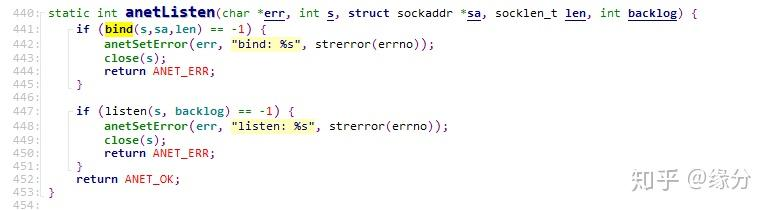

# GDB使用详解

转自：https://zhuanlan.zhihu.com/p/297925056

部分有自己的修改和完善

## 1. 概述

   GDB 全称“GNU  symbolic debugger”，从名称上不难看出，它诞生于 GNU 计划（同时诞生的还有 GCC、Emacs 等），是 Linux  下常用的程序调试器。发展至今，GDB 已经迭代了诸多个版本，当下的 GDB 支持调试多种编程语言编写的程序，包括  C、C++、Go、Objective-C、OpenCL、Ada 等。实际场景中，GDB 更常用来调试 C 和 C++  程序。一般来说，GDB主要帮助我们完成以下四个方面的功能：

1. 启动你的程序，可以按照你的自定义的要求随心所欲的运行程序。
2. 在某个指定的地方或条件下暂停程序。
3. 当程序被停住时，可以检查此时你的程序中所发生的事。
4. 在程序执行过程中修改程序中的变量或条件，将一个bug产生的影响修正从而测试其他bug。

使用GDB调试程序，有以下两点需要注意：

1. 要使用GDB调试某个程序，该程序编译时必须加上编译选项 **`-g`**，否则该程序是不包含调试信息的；
2. GCC编译器支持 **`-O`**  和 **`-g`** 一起参与编译。GCC编译过程对进行优化的程度可分为5个等级，分别为 ：

- **-O/-O0**： 不做任何优化，这是默认的编译选项 ；
- **-O1**：使用能减少目标文件大小以及执行时间并且不会使编译时间明显增加的优化。     该模式在编译大型程序的时候会花费更多的时间和内存。在 -O1下：编译会尝试减少代     码体积和代码运行时间，但是并不执行会花费大量时间的优化操作。
- **-O2**：包含 -O1的优化并增加了不需要在目标文件大小和执行速度上进行折衷的优化。      GCC执行几乎所有支持的操作但不包括空间和速度之间权衡的优化，编译器不执行循环      展开以及函数内联。这是推荐的优化等级，除非你有特殊的需求。 -O2会比 -O1启用多     一些标记。与 -O1比较该优化  -O2将会花费更多的编译时间当然也会生成性能更好的代     码。
- **-O3**：打开所有 -O2的优化选项并且增加 -finline-functions,  -funswitch-loops,-fpredictive-commoning, -fgcse-after-reload and  -ftree-vectorize优化选项。这是最高最危险     的优化等级。用这个选项会延长编译代码的时间，并且在使用  gcc4.x的系统里不应全局     启用。自从 3.x版本以来 gcc的行为已经有了极大地改变。在 3.x，，-O3生成的代码也只      是比 -O2快一点点而已，而 gcc4.x中还未必更快。用 -O3来编译所有的 软件包将产生更      大体积更耗内存的二进制文件，大大增加编译失败的机会或不可预知的程序行为（包括     错误）。这样做将得不偿失，记住过犹不及。在 gcc  4.x.中使用 -O3是不推荐的。
- **-Os**：专门优化目标文件大小  ,执行所有的不增加目标文件大小的 -O2优化选项。同时 -Os还会执行更加优化程序空间的选项。这对于磁盘空间极其紧张或者 CPU缓存较小的     机器非常有用。但也可能产生些许问题，因此软件树中的大部分 ebuild都过滤掉这个等     级的优化。使用 -Os是不推荐的。

## 2. 启用GDB调试

GDB调试主要有三种方式：

1. 直接调试目标程序：gdb ./hello_server
2. 附加进程id：gdb attach pid
3. 调试core文件：gdb  filename  corename

## 3. 退出GDB

- 可以用命令：**q（quit的缩写）或者 Ctr + d** 退出GDB。
- 如果GDB attach某个进程，退出GDB之前要用命令 **detach** 解除附加进程。

## 4. 常用命令

| 命令名称    | 命令缩写  | 命令说明                                         |
| ----------- | --------- | ------------------------------------------------ |
| run         | r         | 运行一个待调试的程序                             |
| continue    | c         | 让暂停的程序继续运行                             |
| next        | n         | 运行到下一行                                     |
| step        | s         | 单步执行，遇到函数会进入                         |
| until       | u         | 运行到指定行停下来                               |
| finish      | fi        | 结束当前调用函数，回到上一层调用函数处           |
| return      | return    | 结束当前调用函数并返回指定值，到上一层函数调用处 |
| jump        | j         | 将当前程序执行流跳转到指定行或地址               |
| print       | p         | 打印变量或寄存器值                               |
| backtrace   | bt        | 查看当前线程的调用堆栈                           |
| frame       | f         | 切换到当前调用线程的指定堆栈                     |
| thread      | thread    | 切换到指定线程                                   |
| break       | b         | 添加断点                                         |
| tbreak      | tb        | 添加临时断点                                     |
| delete      | d         | 删除断点                                         |
| enable      | enable    | 启用某个断点                                     |
| disable     | disable   | 禁用某个断点                                     |
| watch       | watch     | 监视某一个变量或内存地址的值是否发生变化         |
| list        | l         | 显示源码                                         |
| info        | i         | 查看断点 / 线程等信息                            |
| ptype       | ptype     | 查看变量类型                                     |
| disassemble | dis       | 查看汇编代码                                     |
| set args    | set args  | 设置程序启动命令行参数                           |
| show args   | show args | 查看设置的命令行参数                             |

## 5. 常用命令示例

### 5.1 run命令

   默认情况下，以 `gdb ./filename` 方式启用GDB调试只是附加了一个调试文件，并没有启动这个程序，需要输入run命令（简写为r）启动这个程序：

```text
[root@localhost src]# gdb ./redis-server
GNU gdb (GDB) 8.0
Copyright (C) 2017 Free Software Foundation, Inc.
License GPLv3+: GNU GPL version 3 or later <http://gnu.org/licenses/gpl.html>
This is free software: you are free to change and redistribute it.
...此处省略很多行...
Type "apropos word" to search for commands related to "word"...
Reading symbols from ./redis-server...done.
(gdb) r
Starting program: /data/redis-5.0.3/src/redis-server 
[Thread debugging using libthread_db enabled]
...此处省略很多行...
34628:M 09 Nov 2020 00:10:16.318 * DB loaded from disk: 0.000 seconds
```

   以上是以redis-server程序为例，输入 r 后启动了redis服务器，在GDB界面按 Ctrl + C 让GDB中断下来，再次输入 r 命令，GDB会询问是否重启程序，输入 y（或yes）：

```text
34628:M 09 Nov 2020 00:10:16.318 * Ready to accept connections
^C
Thread 1 "redis-server" received signal SIGINT, Interrupt.
0x00000038212e9243 in epoll_wait () from /lib64/libc.so.6
(gdb) r
The program being debugged has been started already.
Start it from the beginning? (y or n) y
Starting program: /data/redis-5.0.3/src/redis-server 
[Thread debugging using libthread_db enabled]
```

   退出GDB，会提示用户要关闭当前调试进程，是否继续退出：

```text
34636:M 09 Nov 2020 00:10:31.427 * Ready to accept connections
^C
Thread 1 "redis-server" received signal SIGINT, Interrupt.
0x00000038212e9243 in epoll_wait () from /lib64/libc.so.6
(gdb) q
A debugging session is active.

    Inferior 1 [process 34636] will be killed.

Quit anyway? (y or n) y
[root@localhost src]#
```

### 5.2 continue命令

   当GDB触发断点或者使用 Ctrl + C 命令中断下来后，想让程序继续运行，只要输入 continue（简写为c）命令即可。

```text
34839:M 09 Nov 2020 00:37:56.364 * DB loaded from disk: 0.000 seconds
34839:M 09 Nov 2020 00:37:56.364 * Ready to accept connections
^C
Thread 1 "redis-server" received signal SIGINT, Interrupt.
0x00000038212e9243 in epoll_wait () from /lib64/libc.so.6
(gdb) c
Continuing.
34839:M 09 Nov 2020 00:46:16.004 * 100 changes in 300 seconds. Saving...
34839:M 09 Nov 2020 00:46:16.046 * Background saving started by pid 34887
```

### 5.3 break命令

   break命令（简写为b）用于添加断点，可以使用以下几种方式添加断点：

- **break FunctionName**，在函数的入口处添加一个断点；
- **break LineNo**，在**当前文件**行号为**LineNo**处添加断点；
- **break FileName:LineNo**，在**FileName**文件行号为**LineNo**处添加一个断点；
- **break FileName:FunctionName**，在**FileName**文件的**FunctionName**函数的入口处添加断点；
- **break -/+offset**，在当前程序暂停位置的前/后 offset 行处下断点；
- **break ... if cond**，下条件断点；

   分别举例介绍以上几种下断点方法：

1. 在`main`函数入口处下断点：

```text
35274:M 09 Nov 2020 01:46:16.910 * Ready to accept connections
^C
Thread 1 "redis-server" received signal SIGINT, Interrupt.
0x00000038212e9243 in epoll_wait () from /lib64/libc.so.6
(gdb) b main
Breakpoint 1 at 0x430890: file server.c, line 4003.
(gdb) r
The program being debugged has been started already.
Start it from the beginning? (y or n) y
Starting program: /data/redis-5.0.3/src/redis-server 
[Thread debugging using libthread_db enabled]
Using host libthread_db library "/lib64/libthread_db.so.1".

Breakpoint 1, main (argc=1, argv=0x7fffffffe648) at server.c:4003
4003	int main(int argc, char **argv) {
(gdb) 
```

\2. 在**当前文件**的**4041**行下断点：

```text
(gdb) b 4041
Breakpoint 2 at 0x4308bc: file server.c, line 4041.
(gdb) info b
Num     Type           Disp Enb Address            What
1       breakpoint     keep y   0x0000000000430890 in main at server.c:4003
	breakpoint already hit 1 time
2       breakpoint     keep y   0x00000000004308bc in main at server.c:4041
(gdb) c
Continuing.

Breakpoint 2, main (argc=1, argv=0x7fffffffe648) at server.c:4041
4041	    zmalloc_set_oom_handler(redisOutOfMemoryHandler);
(gdb)    
```

**3. redis-server**的默认端口是**6379**，绑定端口是需要调用`bind`函数，搜到该函数调用位置是在 **anet.c** 文件的441行：



在这里添加一个断点：

```text
3208:M 09 Nov 2020 18:33:14.205 * DB loaded from disk: 0.000 seconds
3208:M 09 Nov 2020 18:33:14.205 * Ready to accept connections
^C
Thread 1 "redis-server" received signal SIGINT, Interrupt.
0x00000038212e9243 in epoll_wait () from /lib64/libc.so.6
(gdb) b anet.c:441
Breakpoint 1 at 0x429b72: file anet.c, line 441.
(gdb) r
The program being debugged has been started already.
Start it from the beginning? (y or n) y
Starting program: /data/redis-5.0.3/src/redis-server 
[Thread debugging using libthread_db enabled]
Using host libthread_db library "/lib64/libthread_db.so.1".
3232:C 09 Nov 2020 18:38:18.129 # oO0OoO0OoO0Oo Redis is starting oO0OoO0OoO0Oo
3232:C 09 Nov 2020 18:38:18.129 # Redis version=5.0.3, bits=64, commit=00000000, modified=0, pid=3232, just started
3232:C 09 Nov 2020 18:38:18.129 # Warning: no config file specified, using the default config. In order to specify a config file use /data/redis-5.0.3/src/redis-server /path/to/redis.conf
3232:M 09 Nov 2020 18:38:18.129 * Increased maximum number of open files to 10032 (it was originally set to 4096).

Breakpoint 1, anetListen (err=0x7b4320 <server+576> "", s=6, sa=0x9c5ee0, len=28, backlog=511) at anet.c:441
441	    if (bind(s,sa,len) == -1) {
(gdb) 
```

\4. 也可以选择在某个文件的某个函数的入口处添加断点，以**`hset`**命令的回调函数为例：

```c
struct redisCommand redisCommandTable[] = {
    //此处省略之前的命令注册代码
    {"hset",hsetCommand,-4,"wmF",0,NULL,1,1,1,0,0},
    //此处省略之后的命令注册代码
};
```

查到是 **t_hash.c** 文件的**`hsetCommand`**函数，在此处下断点：

```text
3232:M 09 Nov 2020 18:40:49.044 * DB loaded from disk: 0.000 seconds
3232:M 09 Nov 2020 18:40:49.044 * Ready to accept connections
^C
Thread 1 "redis-server" received signal SIGINT, Interrupt.
0x00000038212e9243 in epoll_wait () from /lib64/libc.so.6
(gdb) b t_hash.c:hsetCommand
Breakpoint 2 at 0x45e870: file t_hash.c, line 530.
(gdb) c
Continuing.
```

然后通过redis客户端**redis-cli**连上**redis-server**，并输入一条**`hset`**命令：

```text
[root@localhost ~]# redis-cli
127.0.0.1:6379> hset maptest key1 value1
(integer) 1
(3.54s)
```

断点被触发：

```text
Thread 1 "redis-server" hit Breakpoint 2, hsetCommand (c=0x7ffff7b0d0c0) at t_hash.c:530
530	void hsetCommand(client *c) {
(gdb) c
Continuing.
```

### 5.4 info break、enable、disable和delete命令

   命令格式及作用：

- **info break**，也可简写为 **i b**，作用是显示当前所有断点信息；
- **disable 断点编号**，禁用某个断点，使得断点不会被触发；
- **enable 断点编号**，启用某个被禁用的断点；
- **delete 断点编号**，删除某个断点。

```text
(gdb) info b
Num     Type           Disp Enb Address            What
1       breakpoint     keep y   0x0000000000430890 in main at server.c:4003
    breakpoint already hit 1 time
2       breakpoint     keep y   0x00000000004308bc in main at server.c:4041
    breakpoint already hit 1 time
3       breakpoint     keep y   0x0000000000429b72 in anetListen at anet.c:441
    breakpoint already hit 2 times
4       breakpoint     keep y   0x000000000045e870 in hsetCommand at t_hash.c:530
(gdb) disable 4
(gdb) info b
Num     Type           Disp Enb Address            What
1       breakpoint     keep y   0x0000000000430890 in main at server.c:4003
    breakpoint already hit 1 time
2       breakpoint     keep y   0x00000000004308bc in main at server.c:4041
    breakpoint already hit 1 time
3       breakpoint     keep y   0x0000000000429b72 in anetListen at anet.c:441
    breakpoint already hit 2 times
4       breakpoint     keep n   0x000000000045e870 in hsetCommand at t_hash.c:530
(gdb) enable 4
(gdb) info b
Num     Type           Disp Enb Address            What
1       breakpoint     keep y   0x0000000000430890 in main at server.c:4003
    breakpoint already hit 1 time
2       breakpoint     keep y   0x00000000004308bc in main at server.c:4041
    breakpoint already hit 1 time
3       breakpoint     keep y   0x0000000000429b72 in anetListen at anet.c:441
    breakpoint already hit 2 times
4       breakpoint     keep y   0x000000000045e870 in hsetCommand at t_hash.c:530
(gdb) delete 3
(gdb) info b
Num     Type           Disp Enb Address            What
1       breakpoint     keep y   0x0000000000430890 in main at server.c:4003
    breakpoint already hit 1 time
2       breakpoint     keep y   0x00000000004308bc in main at server.c:4041
    breakpoint already hit 1 time
4       breakpoint     keep y   0x000000000045e870 in hsetCommand at t_hash.c:530
```

断点信息中第四列 ***Enb***，当断点启动时是 y，断点被禁用后是 n。

### 5.5 backtrace和frame命令

   命令格式及作用：

- **backtrace**，也可简写为 **bt**，用于查看当前调用堆栈。
- **frame 堆栈编号**，也可简写为 **f 堆栈编号**，用于切换到其他堆栈处。

```text
Thread 1 "redis-server" hit Breakpoint 4, hsetCommand (c=0x7ffff7b0d0c0) at t_hash.c:530
530 void hsetCommand(client *c) {
(gdb) bt
#0  hsetCommand (c=0x7ffff7b0d0c0) at t_hash.c:530
#1  0x000000000042d320 in call (c=0x7ffff7b0d0c0, flags=15) at server.c:2437
#2  0x000000000043168d in processCommand (c=0x7ffff7b0d0c0) at server.c:2729
#3  0x000000000043e7af in processInputBuffer (c=0x7ffff7b0d0c0) at networking.c:1446
#4  0x00000000004288d3 in aeProcessEvents (eventLoop=0x7ffff7a300a0, flags=11) at ae.c:443
#5  0x0000000000428bfb in aeMain (eventLoop=0x7ffff7a300a0) at ae.c:501
#6  0x0000000000430d9e in main (argc=<optimized out>, argv=0x7fffffffe648) at server.c:4197
(gdb) f 1
#1  0x000000000042d320 in call (c=0x7ffff7b0d0c0, flags=15) at server.c:2437
2437        c->cmd->proc(c);
(gdb) f 2
#2  0x000000000043168d in processCommand (c=0x7ffff7b0d0c0) at server.c:2729
2729            call(c,CMD_CALL_FULL);
(gdb) f 3
#3  0x000000000043e7af in processInputBuffer (c=0x7ffff7b0d0c0) at networking.c:1446
1446                if (processCommand(c) == C_OK) {
(gdb) f 4
#4  0x00000000004288d3 in aeProcessEvents (eventLoop=0x7ffff7a300a0, flags=11) at ae.c:443
443                 fe->rfileProc(eventLoop,fd,fe->clientData,mask);
(gdb) f 5
#5  0x0000000000428bfb in aeMain (eventLoop=0x7ffff7a300a0) at ae.c:501
501         aeProcessEvents(eventLoop, AE_ALL_EVENTS|AE_CALL_AFTER_SLEEP);
(gdb) f 6
#6  0x0000000000430d9e in main (argc=<optimized out>, argv=0x7fffffffe648) at server.c:4197
4197        aeMain(server.el);
(gdb) c
Continuing.
```

### 5.6 list命令

   命令格式及作用：

- **list**，输出上一次list命令显示的代码后面的代码，如果是第一次执行list命令，则会显示当前正在执行代码位置附近的代码；
  
- **list -**，带一个减号，显示上一次list命令显示的代码前面的代码；
  
- **list  LineNo**，显示当前代码文件第 **LineNo** 行附近的代码；
  
- **list FileName:LineNo**，显示 **FileName** 文件第 **LineNo** 行附近的代码；
- **list FunctionName**，显示当前文件的 **FunctionName** 函数附近的代码；
- **list FileName:FunctionName**，显示 **FileName** 文件的 **FunctionName** 函数附件的代码；
- **list from,to**，其中**from**和**to**是具体的代码位置，显示这之间的代码；

**list**命令默认只会输出 **10** 行源代码，也可以使用如下命令修改：

- **show listsize**，查看 **list** 命令显示的代码行数；
- **set listsize count**，设置 **list** 命令显示的代码行数为 **count**;

### 5.7 print和ptype命令

   命令格式及作用：

- **print param**，用于在调试过程中查看变量的值；

- **print param=value**，用于在调试过程中修改变量的值；

- **print a+b+c**，可以进行一定的表达式计算，这里是计算a、b、c三个变量之和；

- **print func()**，输出`func`函数执行的结果，常见的用途是打印系统函数执行失败原因：`print strerror(errno)`；

- **print \*this**，在c++对象中，可以输出当前对象的各成员变量的值；

- **p *array@len**，查看一段连续的内存空间的值。比如数组的一段，或是动态分配的数据的大小。你可以使用GDB的“@”操作符，“@”的左边是第一个内存的地址的值，“@”的右边则你你想查看内存的长度。例如，你的程序中有这样的语句：
  `int *array = (int *) malloc (len * sizeof (int));` 

  `(gdb) p *array@len`
  @的左边是数组的首地址的值，也就是变量array所指向的内容，右边则是数据的长度，其保存在变量len中，其输出结果，大约是下面这个样子的：
  `(gdb) p *array@len
  $1 = {2, 4, 6, 8, 10, 12, 14, 16, 18, 20, 22, 24, 26, 28, 30, 32, 34, 36, 38, 40}`
  如果是静态数组的话，可以直接用print数组名，就可以显示数组中所有数据的内容了。

- 输出格式
  一般来说，GDB会根据变量的类型输出变量的值。但你也可以自定义GDB的输出的格式。例如，你想输出一个整数的十六进制，或是二进制来查看这个整型变量的中的位的情况。要做到这样，你可以使用GDB的数据显示格式：

  * x 按十六进制格式显示变量。

  * d 按十进制格式显示变量。

  * u 按十六进制格式显示无符号整型。

  * o 按八进制格式显示变量。

  * t 按二进制格式显示变量。

  * a 按十六进制格式显示变量。

  * c 按字符格式显示变量。

  * f 按浮点数格式显示变量。

    ```gdb 
    (gdb) p i
    $21 = 101
    (gdb) p/a i
    $22 = 0x65
    (gdb) p/c i
    $23 = 101 'e'
    (gdb) p/f i
    $24 = 1.41531145e-43
    (gdb) p/x i
    $25 = 0x65
    (gdb) p/t i
    $26 = 1100101
    ```

- 程序变量
  在GDB中，你可以随时查看以下三种变量的值：
  1、全局变量（所有文件可见的）
  2、静态全局变量（当前文件可见的）
  3、局部变量（当前Scope可见的）
  如果你的局部变量和全局变量发生冲突（也就是重名），一般情况下是局部变量会隐藏全局变量，也就是说，如果一个全局变量和一个函数中的局部变量同名时，如果当前停止点在函数中，用print显示出的变量的值会是函数中的局部变量的值。如果此时你想查看全局变量的值时，你可以使用“::”操作符：

  ```gdb
  (gdb) p file::variable
  (gdb) p function::variable
  ```

```text
8099:M 10 Nov 2020 04:06:23.436 * DB loaded from disk: 0.000 seconds
8099:M 10 Nov 2020 04:06:23.436 * Ready to accept connections
^C
Thread 1 "redis-server" received signal SIGINT, Interrupt.
0x00000038212e9243 in epoll_wait () from /lib64/libc.so.6
(gdb) b listenToPort
Breakpoint 1 at 0x42fa20: file server.c, line 1913.
(gdb) r
The program being debugged has been started already.
Start it from the beginning? (y or n) y
Starting program: /data/redis-5.0.3/src/redis-server 
[Thread debugging using libthread_db enabled]
Using host libthread_db library "/lib64/libthread_db.so.1".
8107:C 10 Nov 2020 04:06:32.413 # oO0OoO0OoO0Oo Redis is starting oO0OoO0OoO0Oo
8107:C 10 Nov 2020 04:06:32.413 # Redis version=5.0.3, bits=64, commit=00000000, modified=0, pid=8107, just started
8107:C 10 Nov 2020 04:06:32.413 # Warning: no config file specified, using the default config. In order to specify a config file use /data/redis-5.0.3/src/redis-server /path/to/redis.conf
8107:M 10 Nov 2020 04:06:32.414 * Increased maximum number of open files to 10032 (it was originally set to 4096).

Breakpoint 1, listenToPort (port=6379, fds=0x7b424c <server+364>, count=0x7b428c <server+428>) at server.c:1913
1913    int listenToPort(int port, int *fds, int *count) {
(gdb) p port
$1 = 6379
(gdb) p port=6378
$2 = 6378
(gdb) c
Continuing.
```

   如上所示，在`listenToPort`函数入口处下断点，输入 **r**，redis-server重启时触发断点，打印得到 **port** 的值为6379，再通过 `**p port=6378**` 将监听的端口改成6378，redis-server启动后查询端口监听情况：

```text
[root@localhost ~]# netstat -apn | grep redis-server
tcp      0    0 0.0.0.0:6378         0.0.0.0:*        LISTEN      8131/redis-server * 
tcp      0    0 :::6378              :::*             LISTEN      8131/redis-server * 
[root@localhost ~]#
```

### 5.8 whatis和ptype命令

   命令格式及功能：

- **whatis val**，用于查看变量类型；
- **ptype val**，作用和 **whatis** 类似，但功能更强大，可以查看复合数据类型，会打印出该类型的成员变量。

### 5.9 thread命令

   命令格式及作用：

- **info thread**，查看当前进程的所有线程运行情况；
- **thread 线程编号**，切换到具体编号的线程上去；

```text
14139:M 10 Nov 2020 22:55:24.849 * DB loaded from disk: 0.000 seconds
14139:M 10 Nov 2020 22:55:24.849 * Ready to accept connections
^C
Thread 1 "redis-server" received signal SIGINT, Interrupt.
0x00000038212e9243 in epoll_wait () from /lib64/libc.so.6
(gdb) info thread
  Id   Target Id         Frame 
* 1    Thread 0x7ffff7feaf40 (LWP 14139) "redis-server" 0x00000038212e9243 in epoll_wait () from /lib64/libc.so.6
  2    Thread 0x7ffff176a700 (LWP 14140) "redis-server" 0x000000382160b68c in pthread_cond_wait@@GLIBC_2.3.2 () from /lib64/libpthread.so.0
  3    Thread 0x7fffeef69700 (LWP 14141) "redis-server" 0x000000382160b68c in pthread_cond_wait@@GLIBC_2.3.2 () from /lib64/libpthread.so.0
  4    Thread 0x7fffec768700 (LWP 14142) "redis-server" 0x000000382160b68c in pthread_cond_wait@@GLIBC_2.3.2 () from /lib64/libpthread.so.0
(gdb) thread 3
[Switching to thread 3 (Thread 0x7fffeef69700 (LWP 14141))]
#0  0x000000382160b68c in pthread_cond_wait@@GLIBC_2.3.2 () from /lib64/libpthread.so.0
(gdb) info thread
  Id   Target Id         Frame 
  1    Thread 0x7ffff7feaf40 (LWP 14139) "redis-server" 0x00000038212e9243 in epoll_wait () from /lib64/libc.so.6
  2    Thread 0x7ffff176a700 (LWP 14140) "redis-server" 0x000000382160b68c in pthread_cond_wait@@GLIBC_2.3.2 () from /lib64/libpthread.so.0
* 3    Thread 0x7fffeef69700 (LWP 14141) "redis-server" 0x000000382160b68c in pthread_cond_wait@@GLIBC_2.3.2 () from /lib64/libpthread.so.0
  4    Thread 0x7fffec768700 (LWP 14142) "redis-server" 0x000000382160b68c in pthread_cond_wait@@GLIBC_2.3.2 () from /lib64/libpthread.so.0
(gdb) c
Continuing.
```

   从以上可以看出，前面带 * 号的是当前所在线程，第一列 **Id** 指的是线程编号，后面括号中 **LWP 14139**，**LWP（Light Weight Process）**表示轻量级进程，即我们所说的线程，线程ID为 **14139**。

   目前通过 **info thread** 可知redis-server一共启动了4个线程，其中1个主线程，3个工作线程，通过 **bt** 命令可知**线程1是主线程**，因为其调用堆栈最顶层是main函数。

```text
Thread 1 "redis-server" received signal SIGINT, Interrupt.
0x00000038212e9243 in epoll_wait () from /lib64/libc.so.6
(gdb) info thread
  Id   Target Id         Frame 
* 1    Thread 0x7ffff7feaf40 (LWP 14139) "redis-server" 0x00000038212e9243 in epoll_wait () from /lib64/libc.so.6
  2    Thread 0x7ffff176a700 (LWP 14140) "redis-server" 0x000000382160b68c in pthread_cond_wait@@GLIBC_2.3.2 () from /lib64/libpthread.so.0
  3    Thread 0x7fffeef69700 (LWP 14141) "redis-server" 0x000000382160b68c in pthread_cond_wait@@GLIBC_2.3.2 () from /lib64/libpthread.so.0
  4    Thread 0x7fffec768700 (LWP 14142) "redis-server" 0x000000382160b68c in pthread_cond_wait@@GLIBC_2.3.2 () from /lib64/libpthread.so.0
(gdb) bt
#0  0x00000038212e9243 in epoll_wait () from /lib64/libc.so.6
#1  0x000000000042875e in aeApiPoll (tvp=<optimized out>, eventLoop=0x7ffff7a300a0) at ae_epoll.c:112
#2  aeProcessEvents (eventLoop=0x7ffff7a300a0, flags=11) at ae.c:411
#3  0x0000000000428bfb in aeMain (eventLoop=0x7ffff7a300a0) at ae.c:501
#4  0x0000000000430d9e in main (argc=<optimized out>, argv=0x7fffffffe648) at server.c:4197
(gdb) thread 2
[Switching to thread 2 (Thread 0x7ffff176a700 (LWP 14140))]
#0  0x000000382160b68c in pthread_cond_wait@@GLIBC_2.3.2 () from /lib64/libpthread.so.0
(gdb) bt
#0  0x000000382160b68c in pthread_cond_wait@@GLIBC_2.3.2 () from /lib64/libpthread.so.0
#1  0x0000000000483346 in bioProcessBackgroundJobs (arg=0x0) at bio.c:176
#2  0x0000003821607aa1 in start_thread () from /lib64/libpthread.so.0
#3  0x00000038212e8c4d in clone () from /lib64/libc.so.6
(gdb) c
Continuing.
```

### 5.10 next、step命令

   **next** 和 **step** 都是单步执行，但也有差别：

- **next** 是 **单步步过（step over）**，即遇到函数直接跳过，不进入函数内部。
- **step** 是 **单步步入（step into）**，即遇到函数会进入函数内部。

### 5.11 return、finish命令

   **return** 和 **finish** 都是退出函数，但也有差别：

- **return** 命令是立即退出当前函数，剩下的代码不会执行了，**return** 还可以指定函数的返回值。
- **finish** 命令是会继续执行完该函数剩余代码再正常退出。

### 5.12 until命令

   以下是GDB对 **until** 命令的解释：

>  (gdb) help until Execute until the program reaches a source line  greater than the current or a specified location (same args as break  command) within the current frame.
>  

   该命令使得程序执行到指定位置停下来，命令参数和 **break** 命令一样。

### 5.13 jump命令

   命令格式及作用：

- **jump LineNo**，跳转到代码的 **LineNo** 行的位置；
- **jump +10**，跳转到距离当前代码下10行的位置；
- **jump \*0x12345678**，跳转到 **0x12345678** 地址的代码处，地址前要加星号；

   **jump** 命令有两点需要注意的：

1. 中间跳过的代码是不会执行的；
2. 跳到的位置后如果没有断点，那么GDB会自动继续往后执行；

```cpp
#include <iostream>

using std::cout;
using std::endl;

int main() {
    int a = 0;
    cout << "aaa" << endl;
    if (a == 0)
        cout << "hello" << endl;
    else
        cout << "world" << endl;    

    cout << "bbb" << endl;
    return 0;
}
```

   以上述代码为例，正常执行的输出为：

```cpp
aaa
hello
bbb
```

   使用 **jump** 命令跳到第 **12** 行：

```text
Reading symbols from aaa...done.
(gdb) b main
Breakpoint 1 at 0x400880: file aaa.cpp, line 7.
(gdb) r
Starting program: /opt/test/aaa 

Breakpoint 1, main () at aaa.cpp:7
7       int a = 0;
(gdb) jump 12
Continuing at 0x4008c7.
world
bbb
[Inferior 1 (process 14716) exited normally]
```

### 5.14 disassemble命令

   该命令用于查看某段代码的汇编指令。

### 5.15 set args 和 show args命令

   很多程序启动需要我们传递参数，**set args** 就是用来设置程序启动参数的，**show args** 命令用来查询通过 **set args** 设置的参数，命令格式：

- **set args args1**，设置单个启动参数 **args1**；
- **set args "-p"  "password"**，如果单个参数之间有空格，可以使用引号将参数包裹起来；
- **set args args1 args2 args3**，设置多个启动参数，参数之间用空格隔开；
- **set args**，不带参数，则清除之前设置的参数；

```text
Reading symbols from redis-server...done.
(gdb) show args
Argument list to give program being debugged when it is started is "".
(gdb) set args ../redis.conf
(gdb) show args
Argument list to give program being debugged when it is started is "../redis.conf".
(gdb) set args
(gdb) show args
Argument list to give program being debugged when it is started is "".
(gdb) set args ../redis.conf
(gdb) r
Starting program: /data/redis-5.0.3/src/redis-server ../redis.conf
[Thread debugging using libthread_db enabled]
Using host libthread_db library "/lib64/libthread_db.so.1".
15046:C 11 Nov 2020 01:24:31.573 # oO0OoO0OoO0Oo Redis is starting oO0OoO0OoO0Oo
Reading symbols from redis-cli...done.
(gdb) show args
Argument list to give program being debugged when it is started is "".
(gdb) set args "-p" "6378"
(gdb) show args
Argument list to give program being debugged when it is started is ""-p" "6378"".
(gdb) r
Starting program: /data/redis-5.0.3/src/redis-cli "-p" "6378"
[Thread debugging using libthread_db enabled]
Using host libthread_db library "/lib64/libthread_db.so.1".
127.0.0.1:6378>
```

### 5.16 tbreak命令

   该命令时添加一个临时断点，断点一旦被触发就自动删除，使用方法同 **break**。

### 5.17 watch命令

   **watch** 命令用来监视一个变量或者一段内存，当这个变量或者内存的值发生变化时，GDB就会中断下来。被监视的某个变量或内存地址会产生一个 **watch point（观察点）**。

   命令格式：

- **watch 整型变量**；
- **watch 指针变量**，监视的是指针变量本身；
- **watch \*指针变量**，监视的是指针所指的内容；
- **watch 数组变量或内存区间**；

```cpp
#include <iostream>

using std::cout;
using std::endl;

int main() {
    int a = 0;
    a = 10;

    int * p;
    *p = 5;

    int * q;
    q = p;

    int c[5];
    c[0] = 1;
    c[1] = 1;
    c[2] = 1;
    c[3] = 1;
    c[4] = 1;

    return 0;
}
```

   对于以上代码，通过 **watch** 命令分别对变量 **a、\*p、q、c** 进行监视：

```text
Reading symbols from aaa...done.
(gdb) b main
Breakpoint 1 at 0x4006ec: file aaa.cpp, line 7.
(gdb) r
Starting program: /opt/test/aaa 

Breakpoint 1, main () at aaa.cpp:7
7       int a = 0;
(gdb) watch a
Hardware watchpoint 2: a
(gdb) watch *p
Hardware watchpoint 3: *p
(gdb) watch q
Hardware watchpoint 4: q
(gdb) c
Continuing.

Hardware watchpoint 2: a

Old value = 0
New value = 10
main () at aaa.cpp:11
11      *p = 5;
(gdb) c
Continuing.

Hardware watchpoint 3: *p

Old value = 1
New value = 5
main () at aaa.cpp:14
14      q = p;
(gdb) c
Continuing.

Hardware watchpoint 4: q

Old value = (int *) 0x400580 <_start>
New value = (int *) 0x7fffffffe680
main () at aaa.cpp:17
17      c[0] = 1;
(gdb) info watch
Num     Type           Disp Enb Address            What
2       hw watchpoint  keep y                      a
    breakpoint already hit 1 time
3       hw watchpoint  keep y                      *p
    breakpoint already hit 1 time
4       hw watchpoint  keep y                      q
    breakpoint already hit 1 time
(gdb) del 2
(gdb) del 3
(gdb) info watch
Num     Type           Disp Enb Address            What
4       hw watchpoint  keep y                      q
    breakpoint already hit 1 time
(gdb) watch c
Hardware watchpoint 5: c
(gdb) c
Continuing.

Hardware watchpoint 5: c

Old value = {555809696, 56, 4196256, 0, 0}
New value = {1, 56, 4196256, 0, 0}
main () at aaa.cpp:18
18      c[1] = 1;
(gdb) c
Continuing.

Hardware watchpoint 5: c

Old value = {1, 56, 4196256, 0, 0}
New value = {1, 1, 4196256, 0, 0}
main () at aaa.cpp:19
19      c[2] = 1;
(gdb) c
Continuing.

Hardware watchpoint 5: c

Old value = {1, 1, 4196256, 0, 0}
New value = {1, 1, 1, 0, 0}
main () at aaa.cpp:20
20      c[3] = 1;
(gdb) c
Continuing.

Hardware watchpoint 5: c

Old value = {1, 1, 1, 0, 0}
New value = {1, 1, 1, 1, 0}
main () at aaa.cpp:21
21      c[4] = 1;
(gdb) c
Continuing.

Hardware watchpoint 5: c

Old value = {1, 1, 1, 1, 0}
New value = {1, 1, 1, 1, 1}
main () at aaa.cpp:23
23      return 0;
(gdb) c
Continuing.

Watchpoint 4 deleted because the program has left the block in
which its expression is valid.

Watchpoint 5 deleted because the program has left the block in
which its expression is valid.
0x000000382121ed20 in __libc_start_main () from /lib64/libc.so.6
(gdb)
```

   当 **watch** 的变量或内存因超出作用域失效时，GDB 会有如下提示信息：

>  Watchpoint 4 deleted because the program has left the block in which its expression is valid.
>  

   通过 **info watch** 命令可以查看当前所有监视的变量，通过 **delete watch编号** 可以删除对某个变量的监视。

### 5.18 call命令

   命令格式及作用：

- **call func()**，执行 **func()** 函数，同 **print func()**。

### 5.19 help命令

   通过 **help** 命令可以查看目标命令的具体用法。

## 6. GDB多线程调试

### 6.1 概述

   多线程程序的编写更容易产生异常或  Bug（例如线程之间因竞争同一资源发生了死锁、多个线程同时对同一资源进行读和写等等）。GDB调试器不仅仅支持调试单线程程序，还支持调试多线程程序。本质上讲，使用GDB调试多线程程序的过程和调试单线程程序类似，不同之处在于，调试多线程程序需要监控多个线程的执行过程。

   用GDB调试多线程程序时，该程序的编译需要添加  **`-lpthread`** 参数。

### 6.2 一些命令

1. **info thread**，查看当前调试程序启动了多少个线程，并打印出各个线程信息；
2. **thread 线程编号**，将该编号的线程切换为当前线程；
3. **thread apply 线程编号1 线程编号2 ... command**，将GDB命令作用指定对应编号的线程，可以指定多个线程，若要指定所有线程，用 **all** 替换线程编号；
4. **break location thread 线程编号**，在 **location** 位置设置普通断点，该断点只作用在特定编号的线程上；

### 6.3 一些术语

- **all-stop mode**，全停模式，当程序由于任何原因在GDB下停止时，不止当前的线程停止，所有的执行线程都停止。这样允许你检查程序的整体状态，包括线程切换，不用担心当下会有什么改变。
  
- **non-stop mode**，不停模式，调试器（如VS2008和老版本的GDB）往往只支持 **all-stop** 模式，但在某些场景中，我们可能需要调试个别的线程，并且不想在调试过程中影响其他线程的运行，这样可以把GDB的调式模式由 **all-stop** 改成 **non-stop**，**7.0** 版本的GDB引入了 **non-stop** 模式。在 **non-stop** 模式下 **continue、next、step** 命令只针对当前线程。
  
- **record mode**，记录模式；
  
- **replay mode**，回放模式；
  
- **scheduler-locking** ，调度锁；

>  (gdb) help set scheduler-locking Set mode for locking scheduler during  execution. off    == no locking (threads may preempt at any time) on     == full locking (no thread except the current thread may run)         This applies to both normal execution and replay mode. step   ==  scheduler locked during stepping commands (step, next, stepi, nexti).        In this mode, other threads may run during other commands.         This applies to both normal execution and replay mode. replay ==  scheduler locked in replay mode and unlocked during normal execution.
>  

- **schedule-multiple**，多进程调度；

>  (gdb) help set schedule-multiple Set mode for resuming threads of all  processes. When on, execution commands (such as 'continue' or 'next')  resume all threads of all processes.  When off (which is the default),  execution commands only resume the threads of the current process.  The  set of threads that are resumed is further refined by the  scheduler-locking mode (see help set scheduler-locking).
>  

### 6.4 设置线程锁

   使用GDB调试多线程程序时，默认的调试模式是：**一个线程暂停运行，其他线程也随即暂停；一个线程启动运行，其他线程也随即启动**。但在一些场景中，我们希望只让特定线程运行，其他线程都维持在暂停状态，即要防止**线程切换**，要达到这种效果，需要借助 **set scheduler-locking** 命令。

   命令格式及作用：

- **set scheduler-locking on**，锁定线程，只有当前或指定线程可以运行；
- **set scheduler-locking off**，不锁定线程，会有线程切换；
- **set scheduler-locking step**，当单步执行某一线程时，其他线程不会执行，同时保证在调试过程中当前线程不会发生改变。但如果在该模式下执行 **continue、until、finish** 命令，则其他线程也会执行；
- **show scheduler-locking**，查看线程锁定状态；

## 7. 参考文档

[官方参考文档](http://www.gnu.org/software/gdb/documentation/) 