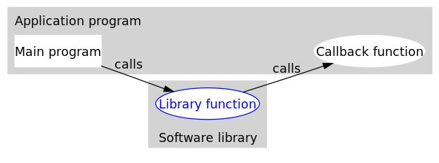

# 1 简介

C语言最难的地方莫过于各种类型的指针，光听名字就把人给绕晕了。这里介绍一下指针函数和函数指针还有回调函数

# 2 指针函数

指针函数：指的是函数的返回值是一个指针，比如我的函数返回的是一个指向整数int的指针，定义格式如下：

```c
int *p(int a,int b); //注意这里的*与P之间是没有括号的，所以含义是函数p(int,int)会返回一个（int *）指针
```

简单的示例

```c
typedef struct _Data{
    int a;
    int b;
}Data;

//指针函数
Data* f(int a,int b){
    Data * data = new Data;
    data->a = a;
    data->b = b;
    return data;
}

int main(int argc, char *argv[])
{
    QApplication a(argc, argv);
    //调用指针函数
    Data * myData = f(4,5);
    qDebug() << "f(4,5) = " << myData->a << myData->b;

    return a.exec();
}

```

# 3 函数指针

函数指针，其本质是一个指针变量，该指针指向这个函数。总结来说，函数指针就是指向函数的指针。

```c
int (*p)(int x, int  y);  //注意：这里的括号不能掉，因为括号()的运算优先级比解引用运算符*高
int (*p)(int, int);
```

函数指针是需要把一个函数的地址赋值给它，有两种写法：

```c
x = (*fun)();
x = fun();
```

简单的示例

```c
int add(int x,int y){
    return x+y;
}
int sub(int x,int y){
    return x-y;
}
//函数指针
int (*fun)(int x,int y);

int main(int argc, char *argv[])
{
    QApplication a(argc, argv);
    //第一种写法
    fun = add;
    qDebug() << "(*fun)(1,2) = " << (*fun)(1,2) ;
	//第二种写法
    fun = &sub;
    qDebug() << "(*fun)(5,3) = " << (*fun)(5,3)  << fun(5,3)；

    return a.exec();
}
```

主要的用途包括：

1. **回调函数：** 函数指针常常用于实现回调机制，其中一个函数将另一个函数的地址传递给第三方函数，以便在适当的时候调用这个函数。这种机制常见于事件处理、图形界面编程和异步编程等场景。

```c
// 回调函数类型
typedef void (*CallbackFunction)(int);

// 接受回调函数作为参数的函数
void process(int data, CallbackFunction callback) {
    // 执行一些操作
    // ...

    // 调用回调函数
    callback(data);
}

// 实际的回调函数
void myCallback(int data) {
    printf("Callback called with data: %d\n", data);
}

int main() {
    // 使用回调函数
    process(42, myCallback);

    return 0;
}
```

**动态选择函数：** 函数指针可以在运行时动态选择要调用的函数。这对于实现多态性或根据条件选择不同的算法非常有用。

```c
c
typedef int (*Operation)(int, int);

int add(int a, int b) {
    return a + b;
}

int subtract(int a, int b) {
    return a - b;
}

int performOperation(int a, int b, Operation op) {
    return op(a, b);
}

int main() {
    // 动态选择加法操作
    printf("Result: %d\n", performOperation(5, 3, add));

    // 动态选择减法操作
    printf("Result: %d\n", performOperation(5, 3, subtract));

    return 0;
}
```

**函数指针数组：** 函数指针可以存储在数组中，用于根据索引或其他条件选择要调用的函数。

```c
c
typedef void (*CommandFunction)();

void command1() {
    printf("Executing command 1\n");
}

void command2() {
    printf("Executing command 2\n");
}

int main() {
    // 函数指针数组
    CommandFunction commands[] = {command1, command2};

    // 调用第一个函数
    commands[0]();

    // 调用第二个函数
    commands[1]();

    return 0;
}
```

**函数作为参数传递：** 函数指针可以作为参数传递给其他函数，从而允许更灵活的函数组合和高阶函数的实现。

```c
c
typedef int (*MathFunction)(int, int);

int add(int a, int b) {
    return a + b;
}

int multiply(int a, int b) {
    return a * b;
}

int combine(MathFunction operation, int x, int y) {
    return operation(x, y);
}

int main() {
    // 传递加法函数
    printf("Result: %d\n", combine(add, 3, 4));

    // 传递乘法函数
    printf("Result: %d\n", combine(multiply, 3, 4));

    return 0;
}
```

# 4 回调函数

**先来看看来自维基百科的对回调（Callback）的解析**：In computer programming, a  callback is any executable code that is passed as an argument to other  code, which is expected to call back (execute) the argument at a given  time. This execution may be immediate as in a synchronous callback, or  it might happen at a later time as in an asynchronous callback.  也就是说，把一段可执行的代码像参数传递那样传给其他代码，而这段代码会在某个时刻被调用执行，这就叫做回调。如果代码立即被执行就称为同步回调，如果在之后晚点的某个时间再执行，则称之为异步回调。

解释还是有点晕。。

## 4.1 为什么需要回调函数

我们先来了解一下回到函数的好处和作用，那就是解耦，对，就是这么简单的答案，就是因为这个特点，普通函数代替不了回调函数。所以，在我眼里，这才是回调函数最大的特点。来看看维基百科上面我觉得画得很好的一张图片。



下面以一段不完整的 C 语言代码来呈现上图的意思：

```c
#include<stdio.h>
#include<softwareLib.h> // 包含Library Function所在读得Software library库的头文件

int Callback() // Callback Function
{
    // TODO
    return 0;
}
int main() // Main program
{
    // TODO
    Library(Callback);
    // TODO
    return 0;
}
```

乍一看，回调似乎只是函数间的调用，和普通函数调用没啥区别，但仔细一看，可以发现两者之间的一个关键的不同：在回调中，主程序把回调函数像参数一样传入库函数。这样一来，只要我们改变传进库函数的参数，就可以实现不同的功能，这样有没有觉得很灵活？并且丝毫不需要修改库函数的实现，这就是解耦。再仔细看看，主函数和回调函数是在同一层的，而库函数在另外一层，想一想，如果库函数对我们不可见，我们修改不了库函数的实现，也就是说不能通过修改库函数让库函数调用普通函数那样实现，那我们就只能通过传入不同的回调函数了，这也就是在日常工作中常见的情况

## 4.2 同步回调和异步回调

同步回调：把函数b传递给函数a。执行a的时候，回调了b，a要一直等到b执行完才能继续执行；

异步回调：把函数b传递给函数a。执行a的时候，回调了b，然后a就继续往后执行，b独自执行。

例子

```c
//a.h    
#ifndef A_H
#define A_H
typedef void (*pcb)(int a); //函数指针定义，后面可以直接使用pcb，方便
void SetCallBackFun(int a, pcb callback);
#endif
```

下面例子中在B中实现回调函数和设置回调函数，实际的调用会在A中

### 同步回调

```c
//A
#include <stdio.h>
#include "A.h"
 
//-----------------------底层实现A-----------------------------
 
//留给应用层B的接口函数
void SetCallBackFun(int a, pcb callback)
{
    printf("A:start\n");
    callback(a);
    printf("A:end\n");
}
```

```c
//B
#include <stdio.h>
#include <stdlib.h>
#include <unistd.h>
#include "A.h"
//-----------------------应用者B-------------------------------
void fCallBack(int a)       // 应用者增加的函数，此函数会在A中被执行
{
    //do something
    printf("B:start\n");
    printf("a = %d\n",a);
    sleep(5);
    printf("B:end\n");
}
 
int main(void)
{
    SetCallBackFun(4,fCallBack);
    return 0;
}
```

### 异步回调

```c
//A
#include <stdio.h>
#include <stdlib.h>
#include <unistd.h>
#include <pthread.h>
#include "A.h"
 
//-----------------------底层实现A-----------------------------
typedef struct parameter{
    int a ;
    pcb callback;
}parameter;
 
void* callback_thread(void *p1)//此处用的是一个线程
{
    //do something
    parameter* p = (parameter*)p1 ;
 
    sleep(5);
    p->callback(p->a);//函数指针执行函数，这个函数来自于应用层B
 
}
 
//留给应用层B的接口函数
void SetCallBackFun(int a, pcb callback)
{
    printf("A:start\n");
    parameter *p = malloc(sizeof(parameter)) ;
    p->a  = a;
    p->callback = callback;
    
    //创建线程
    pthread_t pid;
    pthread_create(&pid,NULL,callback_thread,(void *) p);
    printf("A:end\n");
	
    //阻塞，等待线程pid结束，才往下走
    pthread_join(pid,NULL);
}
```

```c
//B
#include <stdio.h>
#include <stdlib.h>
#include <unistd.h>
#include "A.h"
//-----------------------应用者B-------------------------------
void fCallBack(int a)       // 应用者增加的函数，此函数会在A中被执行
{
    //do something
    printf("B:start\n");
    printf("a = %d\n",a);
    sleep(5);
    printf("B:end\n");
}
 
 
int main(void)
{
    SetCallBackFun(4,fCallBack);
    return 0;
}
```

运行结果比较：

| 同步回调                                                     | 异步回调                                                     |
| ------------------------------------------------------------ | ------------------------------------------------------------ |
| A:start <br />B:start  <br />a = 4  <br />B:end  <br />A:end | A:start  <br />A:end  <br />B:start  <br />a = 4  <br />B:end |

由执行结果可以看出：同步回调，A需要等待B执行完成才能执行A剩余的操作；异步回调，A刚执行B，不必等待B结束，就执行A剩余的操作，之后B的操作也随之end。

# 附录：

https://blog.csdn.net/qq_31930499/article/details/80654472

https://www.runoob.com/w3cnote/c-callback-function.html