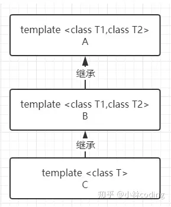
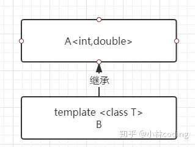
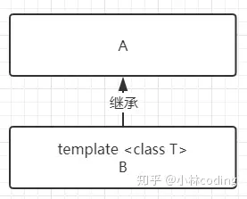
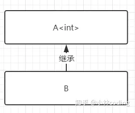

# 简介

C++提供了模板(template)编程的概念。所谓模板，实际上是建立一个通用函数或类，其类内部的类型和函数的形参类型不具体指定，用一个虚拟的类型来代表。这种通用的方式称为模板。模板是泛型编程的基础,泛型编程即以一种独立于任何特定类型的方式编写代码。

# 1 函数模板

## 1.1 为什么要有函数模板 

例如，在一个项目中，需要实现函数返回两个入参的最大值，要支持参数类型为int、float、char等类型的变量。根据需求编写出下面的代码

```C++
#include <iostream>

using namespace std;

//比较int 类型
int Max(int a, int b)
{
	return a > b ? a : b;
}

//比较char 类型
char Max(char a, char b)
{
	return a > b ? a : b;
}

//比较float 类型
float Max(float a, float b)
{
	return a > b ? a : b;
}

int main(void)
{
	int  n = 1;
	int	 m = 2;
	cout << "max(1, 2) = " << Max(n, m) << endl;

	float a = 2.0;
	float b = 3.0;
	cout << "max(2.0, 3.0) = " << Max(a, b) << endl;

	char i = 'a';
	char j = 'b';
	cout << "max('a', 'b') = " << Max(i, j) << endl;

	return 0;
}
```

上面的代码需要编写多个函数，但是函数内部的实现都是类似的。实际上我们使用函数模板一个就可以解决。

使用函数模板修改上面的实现

```C++
#include <iostream>


using namespace std;

template <typename T>
T Max (T a ,T b)
{
    return a > b ? a : b;
}

int main()
{
    int n = 1;
    int m = 2;
    cout << "Max(1,2)=" << Max(n,m) << endl;

    float nf = 1.0;
    float mf = 2.0;
    cout << "Max(1.0,2.0)="<< Max(nf,mf) << endl;

    char nc = 'a';
    char mc = 'b';
    cout << "Max('a', 'b')=" << Max(nc,mc) << endl;

    return 0;
}
```

## 1.2 函数模板的语法

函数模板是 C++ 中一种用于创建通用函数的机制，允许你编写可以处理不同数据类型的通用代码。以下是函数模板的基本语法和一些关键概念：

### 1.2.1 基本语法

```C++
template <typename T>
T functionName(T parameter1, T parameter2) {
    // 模板函数的实现
    // 使用 T 作为通用数据类型
    // 使用 parameter1 和 parameter2 来进行操作
    return result;
}

```

- `template <typename T>`: 这是函数模板的声明部分，`typename` 关键字用于指定通用数据类型，`T` 是一个模板参数（可以使用其他标识符代替，如 `class`）。
- `T functionName(T parameter1, T parameter2)`: 这是函数模板的定义部分，`T` 表示函数参数和返回值的通用数据类型。
- 实现部分: 在函数模板的实现部分，你可以使用 `T` 作为通用数据类型，并在函数体内对参数进行操作。

以下是一个简单的示例，演示了函数模板的语法：

```c++
#include <iostream>

// 函数模板
template <typename T>
T add(T a, T b) {
    return a + b;
}

int main() {
    // 使用函数模板
    int sum1 = add(5, 10);       // T 推断为 int
    double sum2 = add(3.5, 7.2); // T 推断为 double

    // 显式类型调用
    double sum3 = add<double>(2, 3.5);

    std::cout << "Sum1: " << sum1 << std::endl;
    std::cout << "Sum2: " << sum2 << std::endl;
    std::cout << "Sum3: " << sum3 << std::endl;

    return 0;
}
```

这个例子演示了一个简单的函数模板 `add`，用于执行加法操作，可以处理不同的数据类型。

### 1.2.2 多个模板参数：

你也可以使用多个模板参数，例如：

```c++
template <typename T1, typename T2>
T1 functionName(T1 parameter1, T2 parameter2) {
    // 函数模板的实现
    return result;
}
```

下面是一个使用多个模板参数的函数模板示例，同时演示了显式类型指定和隐式类型推断：

```C++
#include <iostream>

// 多个模板参数的函数模板
template <typename T1, typename T2>
T1 addAndConvert(T1 a, T2 b) {
    return static_cast<T1>(a + b);
}

int main() {
    // 使用显式类型指定
    int result1 = addAndConvert<int, double>(5, 3.5);
    std::cout << "Result1: " << result1 << std::endl;

    // 隐式类型推断
    double result2 = addAndConvert(2.5, 3);
    std::cout << "Result2: " << result2 << std::endl;

    return 0;
}
```

在这个例子中，`addAndConvert` 是一个接受两个模板参数的函数模板，其中 `T1` 是返回类型，而 `T2` 是第二个参数的类型。在 `main` 函数中演示了两种调用方式：

1. 使用显式类型指定：`addAndConvert<int, double>(5, 3.5)`，其中明确指定了 `T1` 为 `int` 和 `T2` 为 `double`。
2. 隐式类型推断：`addAndConvert(2.5, 3)`，编译器根据传递的参数类型自动推断了模板参数类型。

这种灵活性允许你在需要时明确指定模板参数，同时在一些情况下允许编译器根据上下文进行类型推断。

### 1.2.3 非类型参数：

除了通用数据类型，你还可以在模板中使用非类型参数，例如：

```c++
template <typename T, int N>
T arraySum(T arr[N]) {
    // 函数模板的实现
    return result;
}
```

下面是一个示例

```C++
#include <iostream>

template <typename T, int N>
T arraySum(T arr[N]) {
    T sum = 0;
    for (int i = 0; i < N; ++i) {
        sum += arr[i];
    }
    return sum;
}

int main() {
    int intArray[] = {1, 2, 3, 4, 5};
    double doubleArray[] = {1.1, 2.2, 3.3, 4.4, 5.5};

    // 非类型参数 N 为数组大小
    int intSum = arraySum<int, 5>(intArray);
    double doubleSum = arraySum<double, 5>(doubleArray);

    std::cout << "Int Array Sum: " << intSum << std::endl;
    std::cout << "Double Array Sum: " << doubleSum << std::endl;

    return 0;
}

```

在这个例子中，`arraySum` 是一个带有非类型参数 `N` 的函数模板，用于计算数组的总和。通过指定数组的大小作为非类型参数，可以在编译时确定数组的大小。

### 1.2.4 显式类型调用：

你可以使用显式类型调用来手动指定模板参数，例如：

```c++
int result = functionName<int>(5, 10);
```

这允许你明确指定 `T` 的类型。

### 1.2.5 模板特化：

你可以为特定类型提供模板的特殊实现，这称为模板特化，例如：

```c++
template <>
char functionName(char a, char b) {
    // 特化的实现
    return result;
}
```

这样，你可以为特定类型定制特殊的函数实现。

下面是一个模板特化的示例

```C++
#include <iostream>

// 通用的函数模板
template <typename T>
T add(T a, T b) {
    return a + b;
}

// 模板特化，为 char 类型提供定制实现
template <>
char add(char a, char b) {
    return std::tolower(a) + std::tolower(b);
}

int main() {
    int sum1 = add(5, 10);       // 使用通用的模板函数
    double sum2 = add(3.5, 7.2); // 使用通用的模板函数

    char charSum = add('A', 'B'); // 使用特化的实现，将字符转换为小写再相加

    std::cout << "Sum1: " << sum1 << std::endl;
    std::cout << "Sum2: " << sum2 << std::endl;
    std::cout << "Char Sum: " << charSum << std::endl;

    return 0;
}

```

在这个例子中，`add` 函数模板具有通用的实现，然后通过模板特化，为 `char` 类型提供了一个特殊的实现，将字符转换为小写再相加。

### 1.2.6 函数模板重载：

函数模板的重载指的是可以定义多个函数模板，其模板参数数量、类型或非类型参数的组合不同。通过重载函数模板，你可以为不同的情况提供特定的实现，以满足各种参数类型的需求。

以下是一个简单的函数模板重载的例子：

```cpp
#include <iostream>

// 模板函数重载，处理两个相同类型的参数
template <typename T>
T add(T a, T b) {
    std::cout << "Adding two values of the same type." << std::endl;
    return a + b;
}

// 模板函数重载，处理两个不同类型的参数
template <typename T1, typename T2>
auto add(T1 a, T2 b) -> decltype(a + b) {
    std::cout << "Adding two values of different types." << std::endl;
    return a + b;
}

int main() {
    int result1 = add(5, 10);        // 调用第一个模板函数
    double result2 = add(3.5, 7);    // 调用第二个模板函数

    std::cout << "Result1: " << result1 << std::endl;
    std::cout << "Result2: " << result2 << std::endl;

    return 0;
}
```

在上述例子中，我们定义了两个函数模板 `add`，一个处理两个相同类型的参数，另一个处理两个不同类型的参数。通过这样的方式，我们可以在不同的情况下提供不同的实现。

需要注意的是，C++ 编译器会根据调用时提供的参数类型和数量，选择匹配的函数模板。在上述例子中，`add(5, 10)` 调用了第一个函数模板，而 `add(3.5, 7)` 调用了第二个函数模板。

这种函数模板的重载机制使得你可以根据不同的参数情况提供更灵活的实现，以适应各种使用场景。


在上面的函数模板中，`auto add(T1 a, T2 b) -> decltype(a + b)` 是一种使用尾返回类型（trailing return type）的写法，用于指定函数返回类型。这种写法通常用于需要使用表达式作为返回类型的情况，而这个表达式可能包含函数参数的类型。

让我们来详细解释这一写法的各个部分：

- `auto`: 这表示函数的返回类型将由编译器进行推导。在这里，我们不显式指定返回类型，而是让编译器根据后面的 `decltype(a + b)` 推导出返回类型。
- `add(T1 a, T2 b)`: 这是函数模板的声明，接受两个参数，类型分别为 `T1` 和 `T2`。
- `-> decltype(a + b)`: 这是尾返回类型的部分。它指定了函数的返回类型应该是表达式 `a + b` 的类型。`decltype` 是一个 C++ 关键字，用于获取表达式的类型。在这里，我们使用 `decltype(a + b)` 来获取参数 `a` 和 `b` 相加的类型，并将其作为函数的返回类型。

这样的写法使得函数模板的返回类型可以根据传递给函数的具体参数类型而变化，使得函数模板更加灵活。在这个特定的例子中，`decltype(a + b)` 会获取 `a` 和 `b` 相加的类型，因此函数的返回类型将是它们相加的类型。

在 C++11 引入 `auto` 和尾返回类型之前，通常使用 `typename` 和 `::value_type` 等方式来指定模板函数的返回类型。尾返回类型的语法在某些情况下更加清晰和灵活。

# 2 类模板

## 2.1  类模板的定义

为了多快好省地定义出一批**相似的类**,可以定义「类模板」，然后**由类模板生成不同的类**。

类模板的定义形式如下：

下面的`class`可以是`typename`

```C++
template <class 类型参数1，class 类型参数2，...> //类型参数表
class 类模板名
{
   成员函数和成员变量
};

```

用类模板定义对象的写法：

```C++
类模板名<真实类型参数表> 对象名(构造函数实参表);
```

## 2.2 类模板例子

用 Pair 类用类模板的方式的实现，Pair 是一对的意思，也就是实现一个键值对（key-value）的关系的类。

```C++

// 类模板
template <class T1, class T2>
class Pair
{
public:
    Pair(T1 k, T2 v):m_key(k),m_value(v) {};
    bool operator < (const Pair<T1,T2> & p) const;
private:
    T1 m_key;
    T2 m_value;
};

// 类模板里成员函数的写法
template <class T1, class T2>
bool Pair<T1,T2>::operator < (const Pair<T1,T2> &p) const
{
    return m_value < p.m_value;
}

int main()
{
    Pair<string,int> Astudent("Jay",20); 
    Pair<string,int> Bstudent("Tom",21);

    cout << (Astudent < Bstudent) << endl;

    return 0;
}

```

需要注意的是，同一个类模板的两个模板类是不兼容的：

```c++
Pair<string,int> *p;
Pair<string,double> a;
p = & a; //错误！！
```

## 2.3 函数模板作为类模板成员

当函数模板作为类模板的成员函数时，是可以单独写成函数模板的形式，成员函数模板在使用的时候，编译器才会把函数模板根据传入的函数参数进行实例化，例子如下：

```c++
// 类模板
template <class T>
class A
{
public:
    template<class T2>
    void Func(T2 t) { cout << t; } // 成员函数模板
};

int main()
{
    A<int> a;
    a.Func('K');     //成员函数模板 Func被实例化
    a.Func("hello"); //成员函数模板 Func再次被实例化

    return 0;
}

```

## 2.4 类模板与非类型参数

类模板的“<类型参数表>”中可以出现非类型参数：

```C++
template <class T, int size>
class CArray
{
public:
    void Print( )
    {
        for( int i = 0;i < size; ++i)
        cout << array[i] << endl;
    }
private:
    T array[size];
};

CArray<double,40> a2;
CArray<int,50> a3; //a2和a3属于不同的类
```

## 2.5 类模板与静态成员变量

```c++
// 模板类
template <class T>
class A5 {
private:
    static int count; // 静态成员
public:
    A5() { count++; } // 默认构造函数，每次创建对象时增加 count
    ~A5() { count--; }; // 析构函数，每次对象被销毁时减少 count
    A5(A5& ) { count++; } // 拷贝构造函数，每次拷贝对象时增加 count

    static void PrintCount() { cout << count << endl; } // 静态函数，用于输出 count 的值
};

// 静态成员的初始化，针对 int 类型的模板实例
template<> int A5<int>::count = 0;

// 静态成员的初始化，针对 double 类型的模板实例
template<> int A5<double>::count = 0;


int main()
{
    A5<int> ia;  // 创建 A<int> 类型的对象
    A5<int> ib;  // 创建 A<int> 类型的对象
    A5<double> da; // 创建 A<double> 类型的对象
    ia.PrintCount(); // 输出 A<int> 类型对象的 count 值
    ib.PrintCount(); // 输出 A<int> 类型对象的 count 值
    da.PrintCount(); // 输出 A<double> 类型对象的 count 值
}
```

输出

```shell
2
2
1
```

# 3 类模板与派生

## 3.1 类模板从类模板派生



示例如下

```c++
#include <iostream>

// 基类 - 类模板
template <class T1, class T2>
class A {
protected:
    T1 v1;
    T2 v2;

public:
    // 基类构造函数
    A(T1 a, T2 b) : v1(a), v2(b) {}
};

// 派生类 - 类模板
template <class T1, class T2>
class B : public A<T2, T1> {
protected:
    T1 v3;
    T2 v4;

public:
    // 派生类构造函数
    B(T1 a, T2 b, T1 c, T2 d) : A<T2, T1>(b, a), v3(c), v4(d) {}
};

// 派生类 - 类模板
template <class T>
class C : public B<T, T> {
public:
    T v5;

    // 派生类构造函数
    C(T a, T b, T c, T d, T e) : B<T, T>(b, a, d, c), v5(e) {}

    // 成员函数用于输出信息
    void display() {
        std::cout << "v1: " << this->v1 << ", v2: " << this->v2 << std::endl;
        std::cout << "v3: " << this->v3 << ", v4: " << this->v4 << std::endl;
        std::cout << "v5: " << this->v5 << std::endl;
    }
};

int main() {
    // 创建派生类对象时传递初始值
    C<int> obj(1, 2, 3, 4, 5);

    // 输出信息
    obj.display();

    return 0;
}

```

输出如下

```shell
v1: 1, v2: 2
v3: 4, v4: 3
v5: 5
```


## 3.2 类模板从模板类派生



上图的代码例子如下

```c++
template <class T1, class T2>
class D {
public:
    D() : v1(T1()), v2(T2()) {} // 默认构造函数，初始化 v1 和 v2
    D(T1 a, T2 b) : v1(a), v2(b) {} // 带参数的构造函数，初始化 v1 和 v2

    // 其他成员函数或操作
protected:
    T1 v1;
    T2 v2;
};

template <class T>
class E : public D<int, double> {
public:
    E() : D<int, double>(), v(T()) {} // 默认构造函数，初始化 v
    E(int a, double b, T c) : D<int, double>(a, b), v(c) {} // 带参数的构造函数，初始化基类和 v

    // 其他成员函数或操作
    void display() {
        std::cout << "v1: " << this->v1 << ", v2: " << this->v2 << ", v: " << v << std::endl;
    }

protected:
    T v;
};

int main()
{
    // 创建 B<char> 类型的对象 obj1
    E<char> obj1(1,2.0,'a');
    // 调用 B 类的 display 函数，输出成员变量的值
    obj1.display();

    return 0;
}

```

程序输出如下

```shell
v1: 1, v2: 2, v: a
```

## 3.3 类模板从普通类派生



上图的代码例子如下

```c++
#include <iostream>

// 基类 - 普通类
class A {
public:
    A(int value = 0) : v1(value) {} // 默认参数的构造函数

    // 其他成员函数或操作

protected:
    int v1;
};

// 派生类 - 类模板
template <class T>
class B : public A {
public:
    B(int a, T b) : A(a), v(b) {} // 带参数的构造函数，初始化基类和 v

    // 其他成员函数或操作
    void display() {
        std::cout << "v1: " << this->v1 << ", v: " << v << std::endl;
    }

private:
    T v;
};

int main() {
    // 创建 B<char> 类型的对象 obj1，传递参数 42 和 'X'
    B<char> obj1(42, 'X');

    // 调用 B 类的 display 函数，输出成员变量的值
    obj1.display();

    return 0;
}

```

## 3.4 普通类从模板类派生



```c++
#include <iostream>

// 类模板
template <class T>
class A {
public:
    A(T value) : v1(value) {} // 带参数的构造函数

    // 其他成员函数或操作

protected:
    T v1;
};

// 派生类
class B : public A<int> {
public:
    B(int a, double b) : A<int>(a), v(b) {} // 带参数的构造函数，初始化基类和 v

    // 其他成员函数或操作
    void display() {
        std::cout << "v1: " << this->v1 << ", v: " << v << std::endl;
    }

private:
    double v;
};

int main() {
    // 创建 B 类型的对象 obj1，传递参数 42 和 3.14
    B obj1(42, 3.14);

    // 调用 B 类的 display 函数，输出成员变量的值
    obj1.display();

    return 0;
}

```

# 4 类模板与友元

## 4.1  函数、类、类的成员函数作为类模板的友元

代码例子如下：

```cpp
// 普通函数
void Func1() { } 

// 普通类
class A { }; 

// 普通类
class B 
{
    public:
    void Func() { } // 成员函数
};

// 类模板
template <class T>
class Tmp
{
    friend void Func1();    // 友元函数
    friend class A;         // 友元类
    friend void B::Func();  // 友元类的成员函数
}; // 任何从 Tmp 实例化来的类 ，都有以上三个友元
```

## 4.2 函数模板作为类模板的友元

```cpp
// 类模板
template <class T1,class T2>
class Pair
{
private:
    T1 key;   //关键字
    T2 value; //值
public:
    Pair(T1 k,T2 v):key(k),value(v) { };

    // 友元函数模板
    template <class T3,class T4>
    friend ostream & operator<< (ostream & o, const Pair<T3,T4> & p);
};

// 函数模板
template <class T3,class T4>
ostream & operator<< (ostream & o, const Pair<T3,T4> & p)
{
    o << "(" << p.key << "," << p.value << ")" ;
    return o;
}

int main()
{
    Pair<string,int> student("Tom",29);
    Pair<int,double> obj(12,3.14);

    cout << student << " " << obj;
    return 0;
}
```

输出结果：

```cpp
(Tom,29) (12,3.14)
```

## 4.3 函数模板作为类的友元

```cpp
// 普通类
class A
{
private:
    int v;
public:
    A(int n):v(n) { }

    template <class T>
    friend void Print(const T & p); // 函数模板
};

// 函数模板
template <class T>
void Print(const T & p)
{
    cout << p.v;
}

int main() 
{
    A a(4);
    Print(a);
    return 0;
}
```

输出结果：

```text
4
```

## 4.4 类模板作为类模板的友元

```cpp
// 类模板
template <class T>
class B 
{
private:
    T v;
public:
    B(T n):v(n) { }

    template <class T2>
    friend class A; // 友元类模板
};

// 类模板
template <class T>
class A 
{
public:
    void Func( )  
    {
        B<int> o(10); // 实例化B模板类
        cout << o.v << endl;
    }
};

int main()
{
    A<double> a;
    a.Func ();
    return 0;
}
```

输出结果：

```text
10
```


# 附录：

* [C++函数模板的详细讲解【函数模板的概念、用法及其模板函数的概念知识】](https://blog.csdn.net/m0_53636439/article/details/119777817)
* [C++ 模板常见特性（函数模板、类模板）](https://zhuanlan.zhihu.com/p/101898043)

