# 简介

**卷积神经网络**：卷积神经网络（Convolutional Neural Networks, CNN）是计算机视觉技术最经典的模型结构。本教程主要介绍卷积神经网络的常用模块，包括：卷积、池化、激活函数、批归一化、丢弃法等。

- **图像分类**：介绍图像分类算法的经典模型结构，包括：LeNet、AlexNet、VGG、GoogLeNet、ResNet，并通过眼疾筛查的案例展示算法的应用。
- **目标检测**：介绍目标检测YOLOv3算法，并通过林业病虫害检测案例展示YOLOv3算法的应用。

# 1 计算机视觉的发展历程

计算机视觉的发展历程要从生物视觉讲起。对于生物视觉的起源，目前学术界尚没有形成定论。有研究者认为最早的生物视觉形成于距今约[7亿年前的水母之中](https://www.pnas.org/content/109/46/18868)，也有研究者认为生物视觉产生于距今约5亿年前寒武纪【[1](https://doi.org/10.1038%2Fnature10097), [2](https://en.wikipedia.org/wiki/Evolution_of_the_eye)】。寒武纪生物大爆发的原因一直是个未解之谜，不过可以肯定的是在寒武纪动物具有了视觉能力，捕食者可以更容易地发现猎物，被捕食者也可以更早的发现天敌的位置。视觉能力加剧了猎手和猎物之间的博弈，也催生出更加激烈的生存演化规则。视觉系统的形成有力地推动了食物链的演化，加速了生物进化过程，是生物发展史上重要的里程碑。经过几亿年的演化，目前人类的视觉系统已经具备非常高的复杂度和强大的功能，人脑中神经元数目达到了1000亿个，这些神经元通过网络互相连接，这样庞大的视觉神经网络使得我们可以很轻松的观察周围的世界，如 **图2** 所示。 


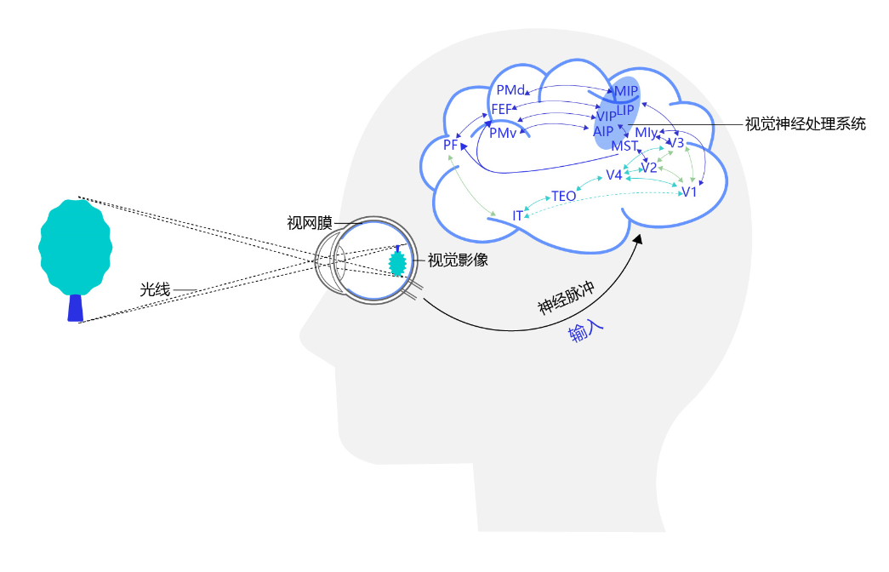


图2：人类视觉感知

对人类来说，识别猫和狗是件非常容易的事。但对计算机来说，即使是一个精通编程的高手，也很难轻松写出具有通用性的程序（比如：假设程序认为体型大的是狗，体型小的是猫，但由于拍摄角度不同，可能一张图片上猫占据的像素比狗还多）。那么，如何让计算机也能像人一样看懂周围的世界呢？研究者尝试着从不同的角度去解决这个问题，由此也发展出一系列的子任务，如 **图3** 所示。 


图3：计算机视觉子任务示意图

- **(a) Image Classification：** 图像分类，用于识别图像中物体的类别（如：bottle、cup、cube）。
- **(b) Object Localization：** 目标检测，用于检测图像中每个物体的类别，并准确标出它们的位置。
- **© Semantic Segmentation：** 图像语义分割，用于标出图像中每个像素点所属的类别，属于同一类别的像素点用一个颜色标识。
- **(d) Instance Segmentation：** 实例分割，值得注意的是，（b）中的目标检测任务只需要标注出物体位置，而（d）中的实例分割任务不仅要标注出物体位置，还需要标注出物体的外形轮廓。

在早期的图像分类任务中，通常是先人工提取图像特征，再用机器学习算法对这些特征进行分类，分类的结果强依赖于特征提取方法，往往只有经验丰富的研究者才能完成，如 **图4** 所示。 

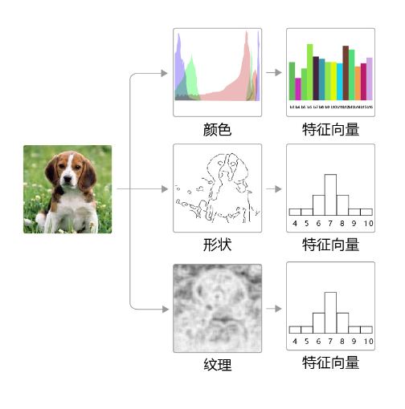
图4：早期的图像分类任务

在这种背景下，基于神经网络的特征提取方法应运而生。Yann  LeCun是最早将卷积神经网络应用到图像识别领域的，其主要逻辑是使用卷积神经网络提取图像特征，并对图像所属类别进行预测，通过训练数据不断调整网络参数，最终形成一套能自动提取图像特征并对这些特征进行分类的网络，如 **图5** 所示。 


图5：早期的卷积神经网络处理图像任务示意

这一方法在手写数字识别任务上取得了极大的成功，但在接下来的时间里，却没有得到很好的发展。其主要原因一方面是数据集不完善，只能处理简单任务，在大尺寸的数据上容易发生过拟合；另一方面是硬件瓶颈，网络模型复杂时，计算速度会特别慢。

目前，随着互联网技术的不断进步，数据量呈现大规模的增长，越来越丰富的数据集不断涌现。另外，得益于硬件能力的提升，计算机的算力也越来越强大。不断有研究者将新的模型和算法应用到计算机视觉领域。由此催生了越来越丰富的模型结构和更加准确的精度，同时计算机视觉所处理的问题也越来越丰富，包括分类、检测、分割、场景描述、图像生成和风格变换等，甚至还不仅仅局限于2维图片，包括视频处理技术和3D视觉等。

# 2 卷积神经网络

卷积神经网络是目前计算机视觉中使用最普遍的模型结构。本章节主要向读者介绍卷积神经网络的一些基础模块，包括：

- 卷积（Convolution）
- 池化（Pooling）
- ReLU激活函数
- 批归一化（Batch Normalization）
- 丢弃法（Dropout）

回顾一下，在上一章“一个案例带你吃透深度学习”中，我们介绍了手写数字识别任务，应用的是全连接网络进行特征提取，即将一张图片上的所有像素点展开成一个1维向量输入网络，存在如下两个问题：

**1. 输入数据的空间信息被丢失。** 空间上相邻的像素点往往具有相似的RGB值，RGB的各个通道之间的数据通常密切相关，但是转化成1维向量时，这些信息被丢失。同时，图像数据的形状信息中，可能隐藏着某种本质的模式，但是转变成1维向量输入全连接神经网络时，这些模式也会被忽略。

**2. 模型参数过多，容易发生过拟合。** 在手写数字识别案例中，每个像素点都要跟所有输出的神经元相连接。当图片尺寸变大时，输入神经元的个数会按图片尺寸的平方增大，导致模型参数过多，容易发生过拟合。

为了解决上述问题，我们引入卷积神经网络进行特征提取，既能提取到相邻像素点之间的特征模式，又能保证参数的个数不随图片尺寸变化。**图6** 是一个典型的卷积神经网络结构，多层卷积和池化层组合作用在输入图片上，在网络的最后通常会加入一系列全连接层，ReLU激活函数一般加在卷积或者全连接层的输出上，网络中通常还会加入Dropout来防止过拟合。


图6：卷积神经网络经典结构


**说明：**

在卷积神经网络中，计算范围是在像素点的空间邻域内进行的，卷积核参数的数目也远小于全连接层。卷积核本身与输入图片大小无关，它代表了对空间邻域内某种特征模式的提取。比如，有些卷积核提取物体边缘特征，有些卷积核提取物体拐角处的特征，图像上不同区域共享同一个卷积核。当输入图片大小不一样时，仍然可以使用同一个卷积核进行操作。


## 2.1 卷积（Convolution）

这一小节将为读者介绍卷积算法的原理和实现方案，并通过具体的案例展示如何使用卷积对图片进行操作，主要涵盖如下内容：

- 卷积计算
- 填充（padding）
- 步幅（stride）
- 感受野（Receptive Field）
- 多输入通道、多输出通道和批量操作
- 卷积算子应用举例

## 2.2 卷积计算

卷积是数学分析中的一种积分变换的方法，在图像处理中采用的是卷积的离散形式。这里需要说明的是，在卷积神经网络中，卷积层的实现方式实际上是数学中定义的互相关   （cross-correlation）运算，与数学分析中的卷积定义有所不同，这里跟其他框架和卷积神经网络的教程保持一致，都使用互相关运算作为卷积的定义，具体的计算过程如 **图7** 所示。


图7：卷积计算过程


**说明：**

卷积核（kernel）也被叫做滤波器（filter），假设卷积核的高和宽分别为$k_h$和$k_w$，则将称为$k_h*k_w$卷积，比如$3×5$卷积，就是指卷积核的高为3, 宽为5。


- 如图7（a）所示：左边的图大小是$3*3$，表示输入数据是一个维度为$3*3$的二维数组；中间的图大小是$2*2$，表示一个维度为$2*2$的二维数组，我们将这个二维数组称为卷积核。先将卷积核的左上角与输入数据的左上角（即：输入数据的(0, 0)位置）对齐，把卷积核的每个元素跟其位置对应的输入数据中的元素相乘，再把所有乘积相加，得到卷积输出的第一个结果：

  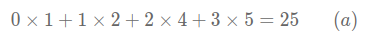

- 如图7（b）所示：将卷积核向右滑动，让卷积核左上角与输入数据中的(0,1)位置对齐，同样将卷积核的每个元素跟其位置对应的输入数据中的元素相乘，再把这4个乘积相加，得到卷积输出的第二个结果：

  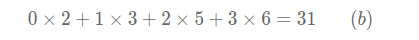

- 如图7（c）所示：将卷积核向下滑动，让卷积核左上角与输入数据中的(1, 0)位置对齐，可以计算得到卷积输出的第三个结果：

  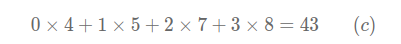

- 如图7（d）所示：将卷积核向右滑动，让卷积核左上角与输入数据中的(1, 1)位置对齐，可以计算得到卷积输出的第四个结果：

  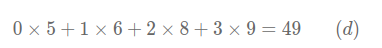

卷积核的计算过程可以用下面的数学公式表示，其中 aaa 代表输入图片， bbb 代表输出特征图，www 是卷积核参数，它们都是二维数组，$\sum u,v$ 表示对卷积核参数进行遍历并求和。

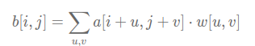

举例说明，假如上图中卷积核大小是2×22\times 22×2，则uuu可以取0和1，vvv也可以取0和1，也就是说：

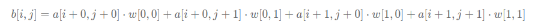

读者可以自行验证，当$[i,j]$取不同值时，根据此公式计算的结果与上图中的例子是否一致。


**其它说明：**

在卷积神经网络中，一个卷积算子除了上面描述的卷积过程之外，还包括加上偏置项的操作。例如假设偏置为1，则上面卷积计算的结果为：

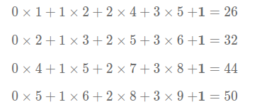


## 2.3 填充（padding）

在上面的例子中，输入图片尺寸为$3*3$，输出图片尺寸为$2*2$，经过一次卷积之后，图片尺寸变小。卷积输出特征图的尺寸计算方法如下（卷积核的高和宽分别为$k_h k_w$）：

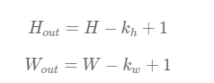

如果输入尺寸为4，卷积核大小为3时，输出尺寸为4−3+1=24-3+1=24−3+1=2。读者可以自行检查当输入图片和卷积核为其他尺寸时，上述计算式是否成立。当卷积核尺寸大于1时，输出特征图的尺寸会小于输入图片尺寸。如果经过多次卷积，输出图片尺寸会不断减小。为了避免卷积之后图片尺寸变小，通常会在图片的外围进行填充(padding)，如 **图8** 所示。

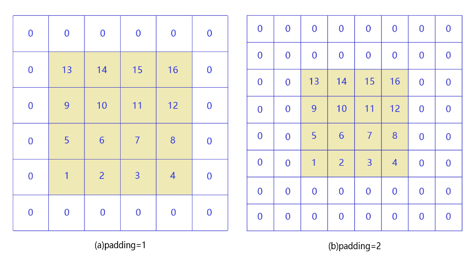
图8：图形填充 

- 如图8（a）所示：填充的大小为1，填充值为0。填充之后，输入图片尺寸从4×4变成了6×6，使用3×33\times33×3的卷积核，输出图片尺寸为4×4。
- 如图8（b）所示：填充的大小为2，填充值为0。填充之后，输入图片尺寸从4×4变成了8×8，使用3×3的卷积核，输出图片尺寸为6×6。

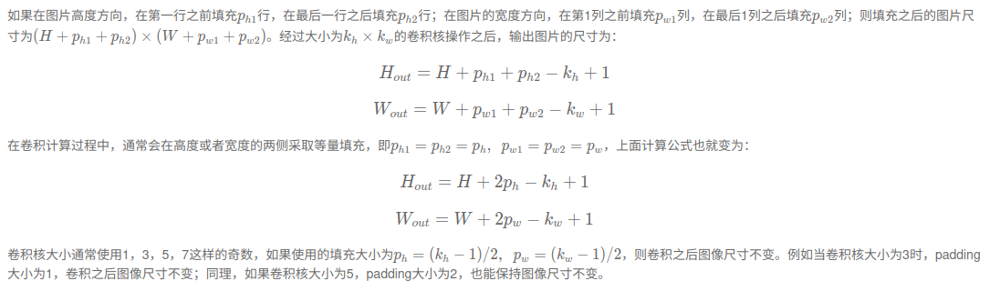

按照我们上面讲的图片卷积，如果原始图片尺寸为 n×n，filter尺寸为 f × f ，则卷积后的图片尺寸为 ( n − f + 1 ) × ( n − f + 1 ) ，注意 f 一般为奇数。这样会带来两个问题：

* 卷积运算后，输出图片尺寸缩小
* 原始图片边缘信息对输出贡献得少，输出图片丢失边缘信息

为了解决图片缩小的问题，可以 使用padding方法，即把原始图片尺寸进行扩展，扩展区域补零，用 p  来表示每个方向扩展的宽度。
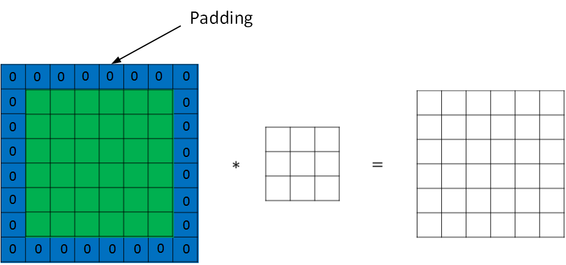
经过padding之后:

| 原始图像padding后尺寸 | filter尺寸 | 卷积后的图像尺寸        |
| --------------------- | ---------- | ----------------------- |
| $(n+2p)*(n+2p)$       | $(f*f)$    | $(n+2p−f+1)×(n+2p−f+1)$ |

若要保证卷积前后图像尺寸不变，则p应满足：

$n=(n+2p−f+1)$即$p={f−1\over 2}$

总结：

* 无padding操作， $p = 0$ ，我们称之为 Valid convolutions （不填充）
* 有padding操作，$p={f−1\over 2}$，我们称之为 Same convolutions （填充，输入输出大小相等）

## 2.4 步幅（stride）

**图8** 中卷积核每次滑动一个像素点，这是步幅为1的特殊情况。**图9** 是步幅为2的卷积过程，卷积核在图片上移动时，每次移动大小为2个像素点。 

图9：步幅为2的卷积过程 

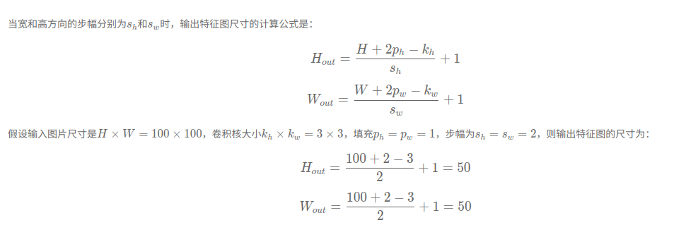

## 2.5 感受野（Receptive Field）

输出特征图上每个点的数值，是由输入图片上大小为$k_h * k_w$的区域的元素与卷积核每个元素相乘再相加得到的，所以输入图像上$k_h * k_w$区域内每个元素数值的改变，都会影响输出点的像素值。我们将这个区域叫做输出特征图上对应点的感受野。感受野内每个元素数值的变动，都会影响输出点的数值变化。比如$3×3$卷积对应的感受野大小就是$3×3$，如 **图10** 所示。


图10：感受野为3×3的卷积 

而当通过两层$3×3$的卷积之后，感受野的大小将会增加到$5×5$，如 **图11** 所示。

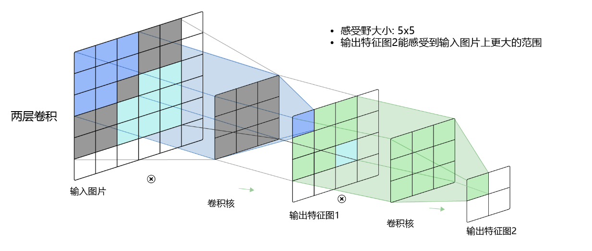
图11：感受野为5×5的卷积 

因此，当增加卷积网络深度的同时，感受野将会增大，输出特征图中的一个像素点将会包含更多的图像语义信息。

## 2.6 多输入通道、多输出通道和批量操作

前面介绍的卷积计算过程比较简单，实际应用时，处理的问题要复杂的多。例如：对于彩色图片有RGB三个通道，需要处理多输入通道的场景。输出特征图往往也会具有多个通道，而且在神经网络的计算中常常是把一个批次的样本放在一起计算，所以卷积算子需要具有批量处理多输入和多输出通道数据的功能，下面将分别介绍这几种场景的操作方式。

- **多输入通道场景**

上面的例子中，卷积层的数据是一个2维数组，但实际上一张图片往往含有RGB三个通道，要计算卷积的输出结果，卷积核的形式也会发生变化。假设输入图片的通道数为$C_{in}$，输入数据的形状是，$C_{in} * H_{in} * W_{in}$计算过程如 **图12** 所示。

1. 对每个通道分别设计一个2维数组作为卷积核，卷积核数组的形状是$C_{in} * k_h * k_w$。

2. 对任一通道Cin∈[0,Cin)，分别用大小为$k_h * k_w$的卷积核在大小为$H_{in} * W_{in}$的二维数组上做卷积。

3. 将这$C_{in}$个通道的计算结果相加，得到的是一个形状为$H_{out} * W_{out}$的二维数组。 

   


图12：多输入通道计算过程 

- **多输出通道场景**

  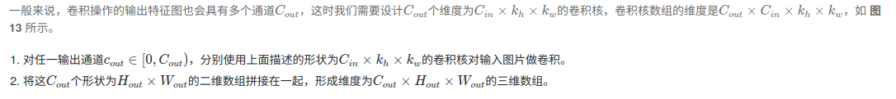

  

  **说明：**

  通常将卷积核的输出通道数叫做卷积核的个数。

  

  

- **批量操作**

  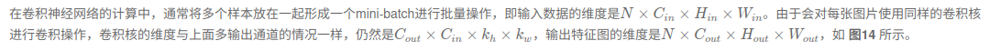

  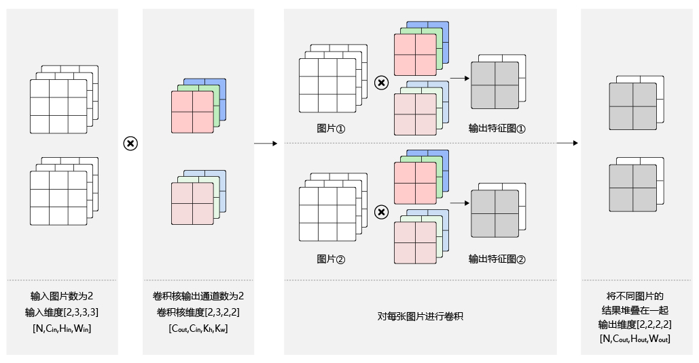

## 2.7 卷积算子应用举例

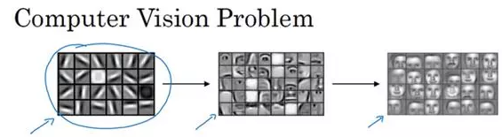

神经网络的前几层只能检测边缘边缘，比如：人脸的鼻子旁边的垂直线，后面的几层检测目标物体的部分区域，比如：人脸的鼻子、眼睛等，更靠后面的层就可以检测到完整的目标物体，比如：人脸。神经网络正是这样将一张图中的人脸分部来检测和提取特征从而识别出人脸，就像我们完成一项工作，将所有事情先分为一小步，完成这一步之后再进行下一步。

现在我们就以边缘检测来说明卷积运算是如何进行操作的

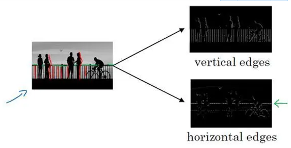

让我们举个例子，给了这样一张图片，让电脑去搞清楚这张照片里有什么物体，你可能做的第一件事是检测图片中的垂直边缘。

比如说，在这张图片中的栏杆就对应垂直线，与此同时，这些行人的轮廓线某种程度上也是垂线，这些线是垂直边缘检测器的输出。同样，你可能也想检测水平边缘，比如说这些栏杆就是很明显的水平线，它们也能被检测到，结果在这。

所以如何在图像中检测这些边缘？

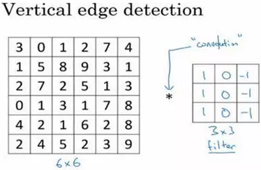

看一个例子，这是一个6×6的灰度图像。因为是灰度图像，所以它是6×6×1的矩阵，而不是6×6×3的，因为没有RGB三通道。为了检测图像中的垂直边缘，你可以构造一个3×3矩阵。**在共用习惯中，在卷积神经网络的术语中，它被称为过滤器(或者叫做卷积核)。**我要构造一个3×3的过滤器，像这样

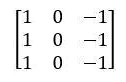

在论文它有时候会被称为核，而不是过滤器，但在这个笔记中，我将使用过滤器这个术语。对这个6×6的图像进行卷积运算，卷积运算用“*”来表示，用3×3的过滤器对其进行卷积。

### 2.7.1 垂直边缘检测器

为什么中间的这个3*3的矩阵可以做垂直边缘检测器呢？这里举例一个更加简单形象的例子。

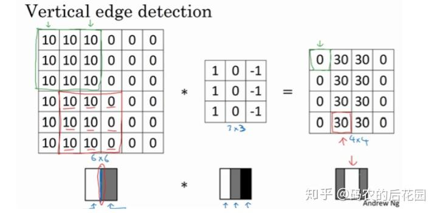

左边是一个简单的6*6的图像，右边的一半是像素值为10，右边一半像素值为0，这在图片中的效果就是，图片的左边看起来是白色的，因为10更接近255，那么图片的右边看起来是灰色的，右边像素值比较暗，我使用灰色来表示 0，尽管它也可以被画成黑的，但是这里为了举例，就画灰色的。有一个特别明显的垂直边缘在图像中间，**蓝色垂直分割线**，从白色到深色的分割线，这也就是我们的垂直边缘特征。

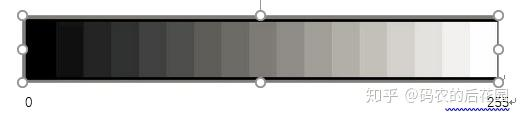

灰度级图像的灰度级分布

那么对于我们的垂直边缘检测器而言，如上图，左边是明亮的像素，中间的是一个过渡，0是灰色，然后右边是深色的，经过卷积运算之后，得到的结果则是一个4*4的矩阵，当做图像来说就是，左边是灰色，中间是白色，右边是灰色，中间的这个白色就是亮一点的区域，可以看成是由亮向暗过渡，就是我们6*6的原图中间的**蓝色垂直边缘**，这是一个十分明显的**垂直边缘**，也就是**原图中由亮到暗的过渡**，这样我们就把图片的垂直边缘特征提取出来了。

**如果将图片进行了翻转，还能检测出来吗?**

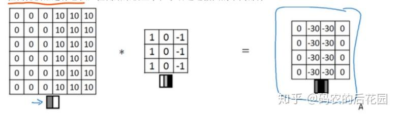

原图它的颜色被翻转了，变成了左边比较暗，右边比较亮。现 在亮度为 10 的点跑到了右边，为 0  的点则跑到了左边。我们用用相同的锤之边缘过滤器进行卷积，最后得到的卷积结果矩阵图中间元素会是-30，而不是  30。如果你将矩阵转换为图片，就会是该矩阵下面 图片的样子。现在中间的过渡部分被翻转了，**之前的 30 翻转成了-30，表明是由暗向亮过渡， 而不是由亮向暗过渡。**那么如何检测水平边缘特征呢？水平边缘过滤器又是什么样子呢？

### 2.7.2 水平边缘检测器

我们看一个更加复杂的例子,假设原图是像素点值不是那么绝对对称那么是怎么,难想到我们的水平边缘检测器长下面中间的这个样子，它的上边相对较亮，下边相对较暗比较暗，中间是过渡的灰色。可以看做将垂直边缘检测器，九十度向右翻转得到。

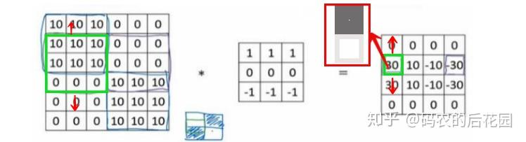

对于左边的这个原图中的绿色区域，它的上部是相对比较亮，向上的箭头，它的像素值为10，它的下部是相对较暗，像素值为0。卷积后的结果是右图的绿色的30，可以看到它的上部是较暗的，较亮的，说明这是由暗到亮的过渡，中间是有一条水平分割线的，这条分割线就是我们的水平边缘特征。

**哪有的是呈现角度的边缘特征呢？不一定都是水平和垂直特征，这又应该怎么进行检测呢？**

比如下面的这张美女图片，帽子的边缘特征呈现角度，对于这样的复杂边缘特征该如何进行检测呢？


**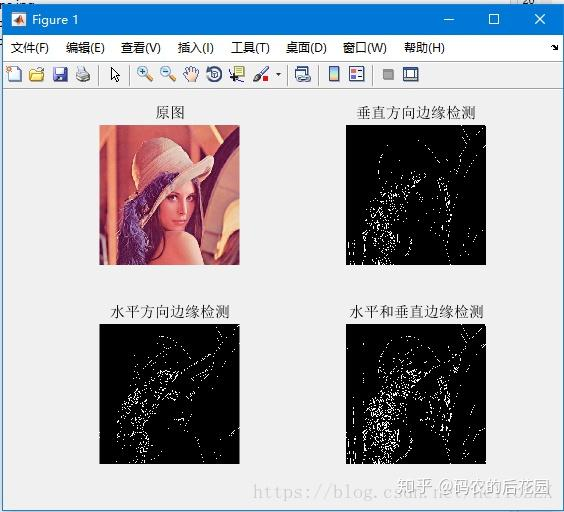**


事实上，上面提到的3*3的过滤器，也就是3*3的矩阵中的9个元素，在神经网络中事实上是9个参数，也就带参数的过滤器，我们可以任意组合，直至能够很好的检测到边缘特征。

**下面是Sobel算子的过滤器参数**，分别实现水平、垂直、45度、135度图像边缘检测，可以看到参数都不一样，这种就叫做**sobel过滤器,还有许许多多的检测器，也就是过滤器，其实还有180度边缘检测、270边缘检测等，只是卷积核，也就是过滤器参数的不同而已。**

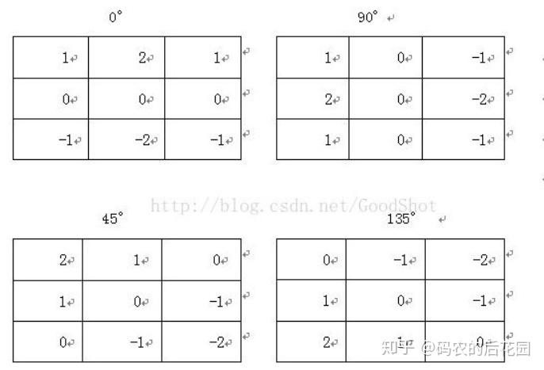

下图和上图是分别使用**Sobel算子实现45度、135度角边缘检测效果**

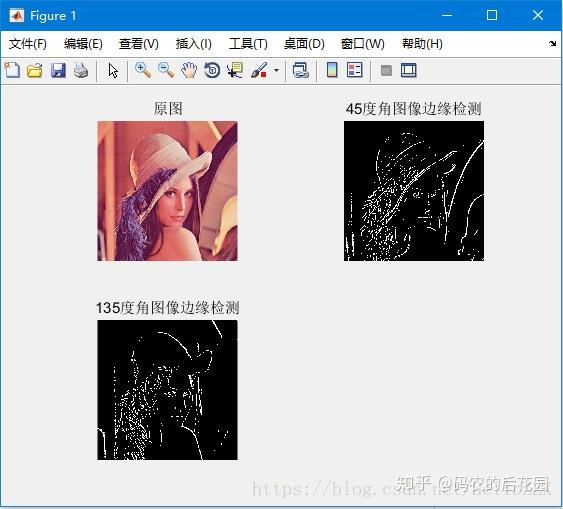


我们可以看到，45度和135度的边缘检测器效果更好。

垂直边缘检测和水平边缘检测的滤波器算子如下所示：

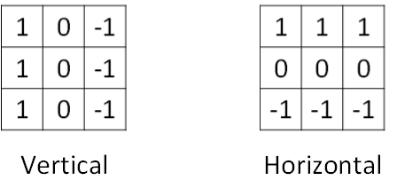
除了上面提到的这种简单的Vertical、Horizontal滤波器之外，还有其它常用的filters，例如Sobel filter和Scharr filter。这两种滤波器的特点是增加图片中心区域的权重。（下图展示的是垂直边缘检测算子，水平边缘检测算子只需将上图顺时针翻转90度即可。）

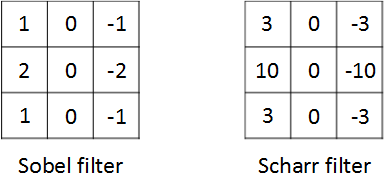
在深度学习中，如果我们想检测图像的各种边缘特征，而不仅限于垂直边缘和水平边缘，那么 filter 的数值一般需要通过模型训练得到，类似于标准神经网络中的权重 w w w 一样由反向传播算法迭代求得。CNN的主要目的就是计算出这些 filter 的数值。确定得到了这些 filter 后，CNN浅层网络也就实现了对图片所有边缘特征的检测。
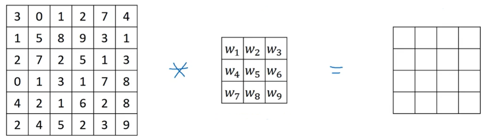

### 2.7.3 **案例1——简单的黑白边界检测**

下面是使用Conv2D算子完成一个图像边界检测的任务。图像左边为光亮部分，右边为黑暗部分，需要检测出光亮跟黑暗的分界处。

设置宽度方向的卷积核为[1,0,−1][1, 0, -1][1,0,−1]，此卷积核会将宽度方向间隔为1的两个像素点的数值相减。当卷积核在图片上滑动时，如果它所覆盖的像素点位于亮度相同的区域，则左右间隔为1的两个像素点数值的差为0。只有当卷积核覆盖的像素点有的处于光亮区域，有的处在黑暗区域时，左右间隔为1的两个点像素值的差才不为0。将此卷积核作用到图片上，输出特征图上只有对应黑白分界线的地方像素值才不为0。具体代码如下所示，结果输出在下方的图案中。

```python
import matplotlib.pyplot as plt
import numpy as np
import paddle
from paddle.nn import Conv2D
from paddle.nn.initializer import Assign
%matplotlib inline

# 创建初始化权重参数w
w = np.array([1, 0, -1], dtype='float32')
# 将权重参数调整成维度为[cout, cin, kh, kw]的四维张量
w = w.reshape([1, 1, 1, 3])
# 创建卷积算子，设置输出通道数，卷积核大小，和初始化权重参数
# kernel_size = [1, 3]表示kh = 1, kw=3
# 创建卷积算子的时候，通过参数属性weight_attr指定参数初始化方式
# 这里的初始化方式时，从numpy.ndarray初始化卷积参数
conv = Conv2D(in_channels=1, out_channels=1, kernel_size=[1, 3],
       weight_attr=paddle.ParamAttr(
          initializer=Assign(value=w)))

# 创建输入图片，图片左边的像素点取值为1，右边的像素点取值为0
img = np.ones([50,50], dtype='float32')
img[:, 30:] = 0.
# 将图片形状调整为[N, C, H, W]的形式
x = img.reshape([1,1,50,50])
# 将numpy.ndarray转化成paddle中的tensor
x = paddle.to_tensor(x)
# 使用卷积算子作用在输入图片上
y = conv(x)
# 将输出tensor转化为numpy.ndarray
out = y.numpy()
f = plt.subplot(121)
f.set_title('input image', fontsize=15)
plt.imshow(img, cmap='gray')
f = plt.subplot(122)
f.set_title('output featuremap', fontsize=15)
# 卷积算子Conv2D输出数据形状为[N, C, H, W]形式
# 此处N, C=1，输出数据形状为[1, 1, H, W]，是4维数组
# 但是画图函数plt.imshow画灰度图时，只接受2维数组
# 通过numpy.squeeze函数将大小为1的维度消除
plt.imshow(out.squeeze(), cmap='gray')
plt.show()
```

### 2.7.4 **案例2——图像中物体边缘检测**

上面展示的是一个人为构造出来的简单图片，使用卷积网络检测图片明暗分界处的示例。对于真实的图片，也可以使用合适的卷积核(3*3卷积核的中间值是8，周围一圈的值是8个-1)对其进行操作，用来检测物体的外形轮廓，观察输出特征图跟原图之间的对应关系，如下代码所示：

```python
import matplotlib.pyplot as plt
from PIL import Image
import numpy as np
import paddle
from paddle.nn import Conv2D
from paddle.nn.initializer import Assign
img = Image.open('./work/images/section1/000000098520.jpg')

# 设置卷积核参数
w = np.array([[-1,-1,-1], [-1,8,-1], [-1,-1,-1]], dtype='float32')/8
w = w.reshape([1, 1, 3, 3])
# 由于输入通道数是3，将卷积核的形状从[1,1,3,3]调整为[1,3,3,3]
w = np.repeat(w, 3, axis=1)
# 创建卷积算子，输出通道数为1，卷积核大小为3x3，
# 并使用上面的设置好的数值作为卷积核权重的初始化参数
conv = Conv2D(in_channels=3, out_channels=1, kernel_size=[3, 3], 
            weight_attr=paddle.ParamAttr(
              initializer=Assign(value=w)))
    
# 将读入的图片转化为float32类型的numpy.ndarray
x = np.array(img).astype('float32')
# 图片读入成ndarry时，形状是[H, W, 3]，
# 将通道这一维度调整到最前面
x = np.transpose(x, (2,0,1))
# 将数据形状调整为[N, C, H, W]格式
x = x.reshape(1, 3, img.height, img.width)
x = paddle.to_tensor(x)
y = conv(x)
out = y.numpy()
plt.figure(figsize=(20, 10))
f = plt.subplot(121)
f.set_title('input image', fontsize=15)
plt.imshow(img)
f = plt.subplot(122)
f.set_title('output feature map', fontsize=15)
plt.imshow(out.squeeze(), cmap='gray')
plt.show()
```

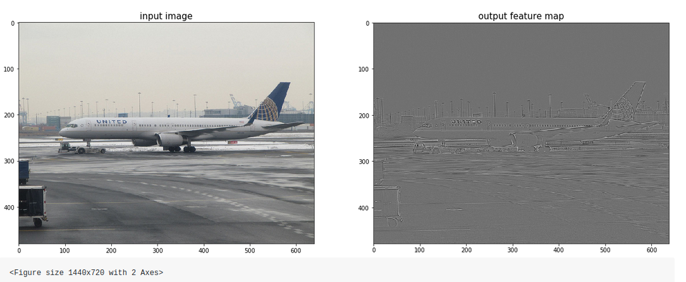

### 2.7.5 **案例3——图像均值模糊**

另外一种比较常见的卷积核（5*5的卷积核中每个值均为1）是用当前像素跟它邻域内的像素取平均，这样可以使图像上噪声比较大的点变得更平滑，如下代码所示：

```python
import paddle
import matplotlib.pyplot as plt
from PIL import Image
import numpy as np
from paddle.nn import Conv2D
from paddle.nn.initializer import Assign
# 读入图片并转成numpy.ndarray
# 换成灰度图
img = Image.open('./work/images/section1/000000355610.jpg').convert('L')
img = np.array(img)

# 创建初始化参数
w = np.ones([1, 1, 5, 5], dtype = 'float32')/25
conv = Conv2D(in_channels=1, out_channels=1, kernel_size=[5, 5], 
        weight_attr=paddle.ParamAttr(
         initializer=Assign(value=w)))
x = img.astype('float32')
x = x.reshape(1,1,img.shape[0], img.shape[1])
x = paddle.to_tensor(x)
y = conv(x)
out = y.numpy()

plt.figure(figsize=(20, 12))
f = plt.subplot(121)
f.set_title('input image')
plt.imshow(img, cmap='gray')

f = plt.subplot(122)
f.set_title('output feature map')
out = out.squeeze()
plt.imshow(out, cmap='gray')

plt.show()
```

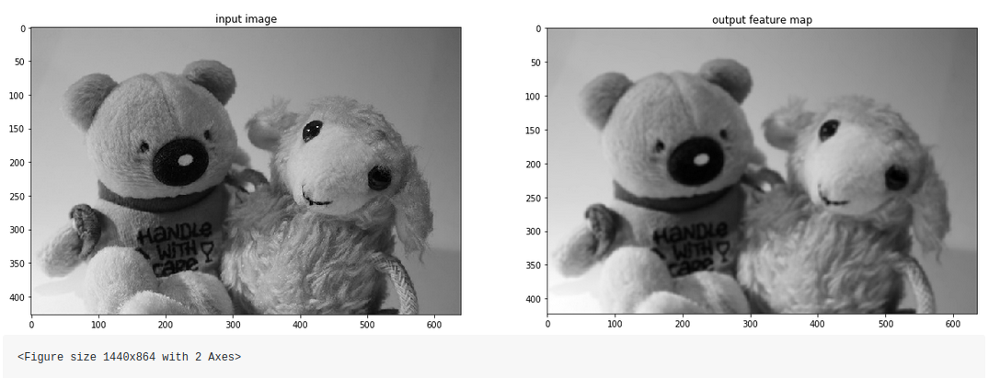

## 2.8 单层卷积网络

（One layer of a convolutional network）

卷积神经网络的单层结构如下所示：

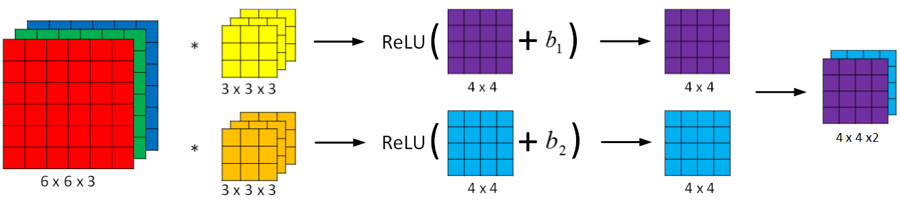

 相比之前单独的卷积过程，**CNN的单层结构多了激活函数ReLU和偏移量b**。整个过程与标准的神经网络单层结构非常类似：

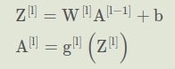                                                         

卷积运算对应着上式中的乘积运算，滤波器组数值对应着权重 $W^{[1]}$ ，所选的激活函数为ReLU。

我们来计算一下上图中参数的数目：每个滤波器组有3x3x3=27个参数，还有1个偏移量b，则每个滤波器组有27+1=28个参数，两个滤波器组总共包含28×2=56个参数。我们发现，选定滤波器组后，参数数目与输入图片尺寸无关。所以，就不存在由于图片尺寸过大，造成参数过多的情况。例如一张1000x1000x3的图片，标准神经网络输入层的维度将达到3百万，而在CNN中，参数数目只由滤波器组决定，数目相对来说要少得多，这是CNN的优势之一。

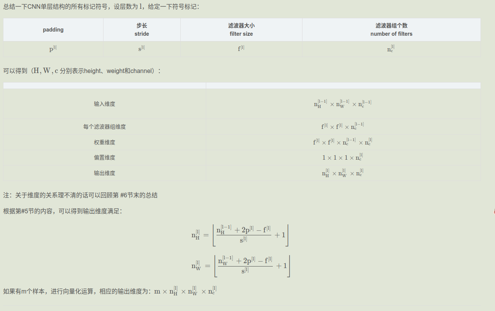


## 2.9 简单卷积网络示例

（A simple convolution network example）

下面介绍一个简单的CNN网络模型（计算过程见上节公式）：

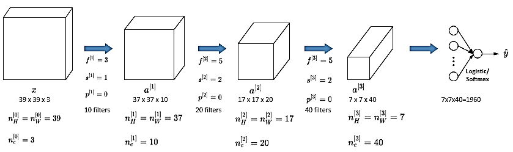

$a^{[3]}$的维度是$7 x 7 x 40$，将$a^{[3]}$排列成1列，维度为$1960 x 1$，然后连接最后一级输出层。输出层可以是一个神经元，即二元分类（logistic）；也可以是多个神经元，即多元分类（softmax）。最后得到预测输出$\hat y$

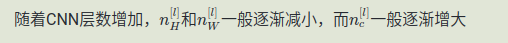

一个典型的卷积神经网络通常有三层：

- 卷积层：Convolution layers（**CONV**）
- 池化层：Pooling layers（**POOL**）
- 全连接层：Fully connected layers（**FC**）

## 2.10 池化（Pooling）

池化是使用某一位置的相邻输出的总体统计特征代替网络在该位置的输出，其好处是当输入数据做出少量平移时，经过池化函数后的大多数输出还能保持不变。比如：当识别一张图像是否是人脸时，我们需要知道人脸左边有一只眼睛，右边也有一只眼睛，而不需要知道眼睛的精确位置，这时候通过池化某一片区域的像素点来得到总体统计特征会显得很有用。由于池化之后特征图会变得更小，如果后面连接的是全连接层，能有效的减小神经元的个数，节省存储空间并提高计算效率。 如 **图15** 所示，将一个$2*2$的区域池化成一个像素点。通常有两种方法，平均池化和最大池化。

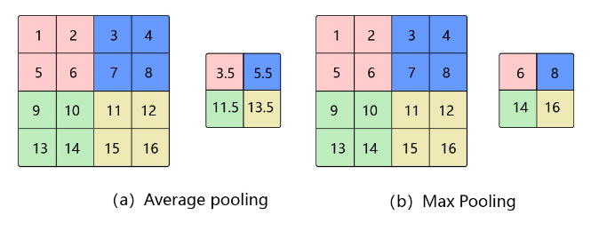

- 如图15（a）：平均池化。这里使用大小为$2*2$的池化窗口，每次移动的步幅为2，对池化窗口覆盖区域内的像素取平均值，得到相应的输出特征图的像素值。
- 如图15（b）：最大池化。对池化窗口覆盖区域内的像素取最大值，得到输出特征图的像素值。当池化窗口在图片上滑动时，会得到整张输出特征图。池化窗口的大小称为池化大小，用$k_h * k_w$表示。在卷积神经网络中用的比较多的是窗口大小为$2*2$，步幅为2的池化。

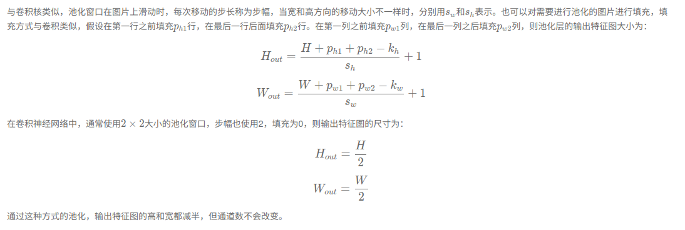

（Pooling layers）

Pooling layers是CNN中用来减小尺寸，提高运算速度的，同样能减小noise影响，让各特征更具有健壮性。

Pooling layers 的做法比 Convolution layers 简单许多，没有卷积运算，仅仅是在滤波器算子滑动区域内取最大值，即max pooling，这是最常用的做法。(我的理解是类似于降采样)

注意，超参数p(padding)很少在pooling layers中使用。

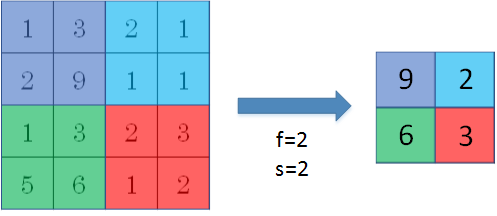
Max pooling的好处是只保留区域内的最大值（特征)，忽略其它值，降低noise影响，提高模型健壮性。而且，max pooling需要的超参数仅为滤波器尺寸 f f f 和滤波器步长 s s s，没有其他参数需要模型训练得到，计算量很小。

如果是多个通道，那么就每个通道单独进行max pooling操作。

除了max pooling之外，还有一种做法：average pooling。顾名思义，average pooling就是在滤波器算子滑动区域计算平均值。

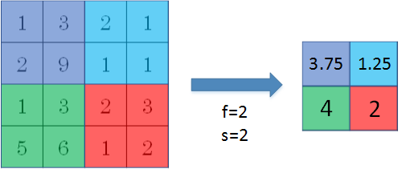
实际应用中，max pooling比average pooling更为常用。

## 2.1 激活函数

前面介绍的网络结构中，普遍使用Sigmoid函数做激活函数。在神经网络发展的早期，Sigmoid函数用的比较多，而目前用的较多的激活函数是ReLU。这是因为Sigmoid函数在反向传播过程中，容易造成梯度的衰减。让我们仔细观察Sigmoid函数的形式，就能发现这一问题。

Sigmoid激活函数定义如下：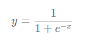

ReLU激活函数的定义如下：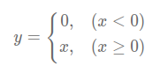

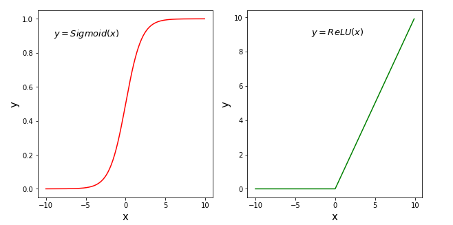

**梯度消失现象**

在神经网络里，将经过反向传播之后，梯度值衰减到接近于零的现象称作梯度消失现象。

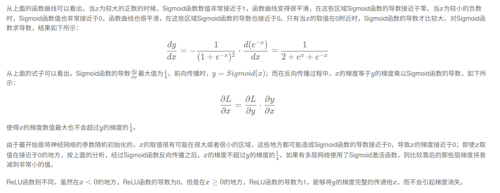

## 2.12 批归一化（Batch Normalization）

[批归一化方法](https://arxiv.org/abs/1502.03167)（Batch Normalization，BatchNorm）是由Ioffe和Szegedy于2015年提出的，已被广泛应用在深度学习中，其目的是对神经网络中间层的输出进行标准化处理，使得中间层的输出更加稳定。

通常我们会对神经网络的数据进行标准化处理，处理后的样本数据集满足均值为0，方差为1的统计分布，这是因为当输入数据的分布比较固定时，有利于算法的稳定和收敛。对于深度神经网络来说，由于参数是不断更新的，即使输入数据已经做过标准化处理，但是对于比较靠后的那些层，其接收到的输入仍然是剧烈变化的，通常会导致数值不稳定，模型很难收敛。BatchNorm能够使神经网络中间层的输出变得更加稳定，并有如下三个优点：

- 使学习快速进行（能够使用较大的学习率）
- 降低模型对初始值的敏感性
- 从一定程度上抑制过拟合

BatchNorm主要思路是在训练时以mini-batch为单位，对神经元的数值进行归一化，使数据的分布满足均值为0，方差为1。具体计算过程如下：

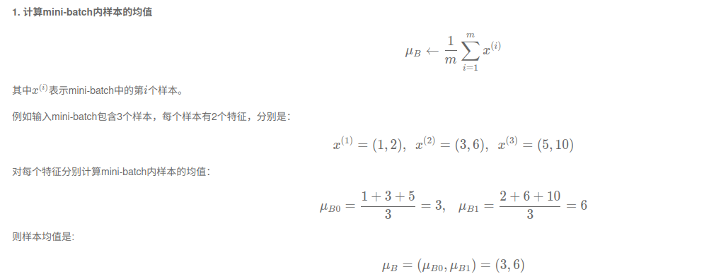

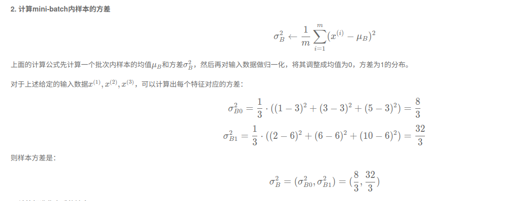

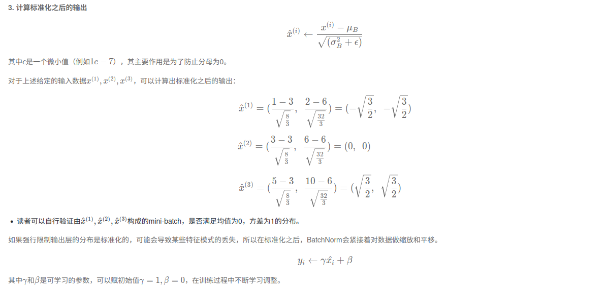

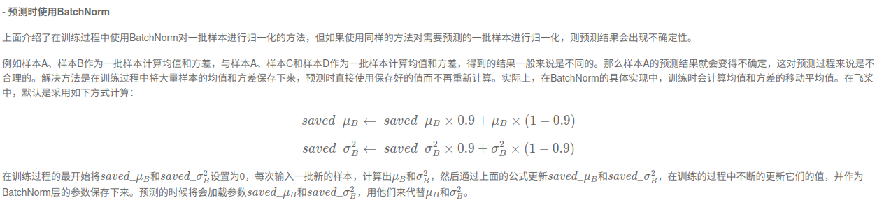

## 2.13 丢弃法（Dropout）

丢弃法（Dropout）是深度学习中一种常用的抑制过拟合的方法，其做法是在神经网络学习过程中，随机删除一部分神经元。训练时，随机选出一部分神经元，将其输出设置为0，这些神经元将不对外传递信号。

**图16** 是Dropout示意图，左边是完整的神经网络，右边是应用了Dropout之后的网络结构。应用Dropout之后，会将标了×\times×的神经元从网络中删除，让它们不向后面的层传递信号。在学习过程中，丢弃哪些神经元是随机决定，因此模型不会过度依赖某些神经元，能一定程度上抑制过拟合。

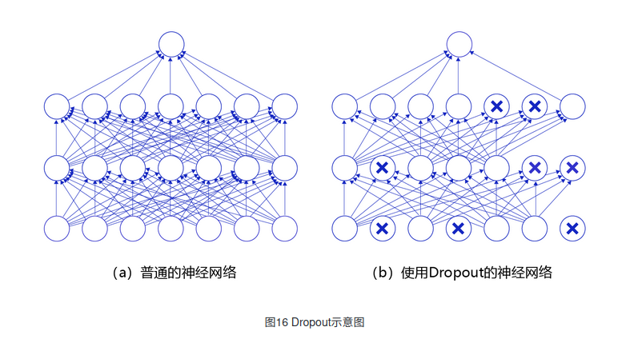

## 2.14 卷积神经网络示例

（Convolutional neural network example）

下面介绍一个简单的数字识别的CNN例子：

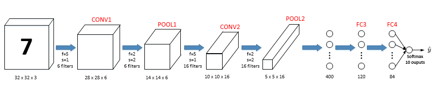

图中，CONV层后面紧接一个POOL层，**CONV1 和 POOL1 构成Layer1**，**CONV2 和 POOL2 构成 Layer2**（一般在统计网络层数时，只计算具有权重的层，因为池化层没有权重和参数，只有一些超参数。因此我们把CONV1和POOL1共同作为一个卷积，并标记为Layer1）。

特别注意的是FC3和FC4为全连接层FC，它跟标准的神经网络结构一致。最后的输出层（softmax）由10个神经元构成。

整个网络各层的尺寸和参数如下表格所示

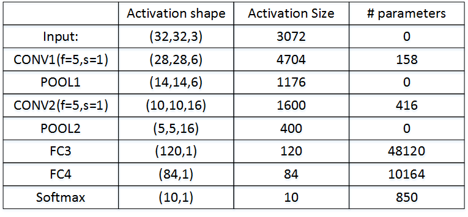

有几点要注意，第一，池化层和最大池化层没有参数；第二，卷积层的参数相对较少，前面课上我们提到过，其实许多参数都存在于神经网络的全连接层。

观察可发现，随着神经网络的加深，激活值尺寸会逐渐变小，如果激活值尺寸下降太快，也会影响神经网络性能。示例中，激活值尺寸在第一层为6000，然后减少到1600，慢慢减少到84，最后输出softmax结果。我们发现，许多卷积网络都具有这些属性，模式上也相似。

## 2.15 为什么使用卷积？

（Why convolutions?）

相比标准神经网络，CNN的优势之一就是参数数目要少得多。参数数目少的原因有两个：

* 参数共享：一个特征检测器（例如垂直边缘检测）对图片某块区域有用，同时也可能作用在图片其它区域。
* 局部感知：因为滤波器算子尺寸限制，每一层的每个输出只与输入部分区域内有关。

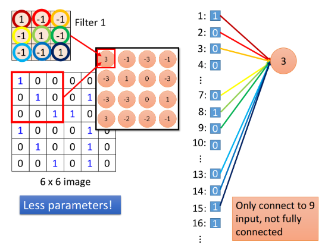

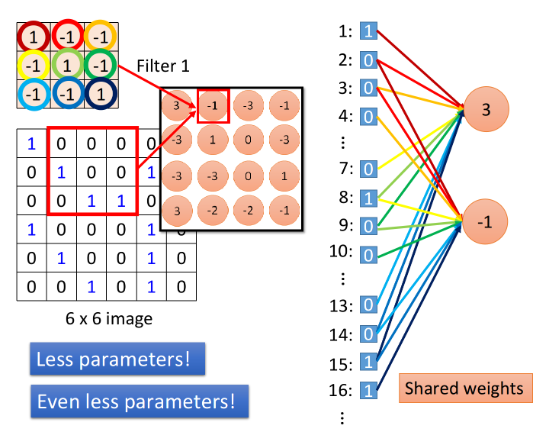

 除此之外，由于CNN参数数目较小，所需的训练样本就相对较少，从而一定程度上不容易发生过拟合现象。而且，CNN比较擅长捕捉区域位置偏移。也就是说CNN进行物体检测时，不太受物体所处图片位置的影响，增加检测的准确性和系统的健壮性。

# 附录：

* [零基础实践深度学习第三章：计算机视觉（上）卷积神经网络基础](https://www.paddlepaddle.org.cn/tutorials/projectdetail/4282406)
* [CNN基础](https://blog.csdn.net/m0_37867091/article/details/105462334?spm=1001.2014.3001.5501)
* 