# 1 前言

在深度学习中，一般我们有一张图片输入到模型中，需要提前对图片进行前处理。

为什么需要前处理？

主要是模型的输入是固定的尺寸，例如yolo模型输入的图像大小是640×640。但是我们一般拿到的相机原始图像是其他的值，比如是1280×1080等

前处理的功能：

* resize，也就是图片大小的缩放

* 通道转换，HWC转换为CHW

  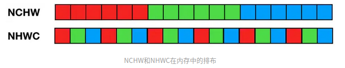

* 归一化。`c0 = (c0 * 1/255 - norm.mean[0]) / norm.std[0];`

# 2 cuda代码分析

这里先给出一个cuda代码实现的例子，下面进行分析


```C
//这里的线程总数是和resize后的像素点相同，也就是para.outW * para.outH
__global__ void image_resize_bilinear_and_normalize_kernel(uint8_t* pSrcBase, float* pDstBase, struct ImageResizePara para)
{
	int position = blockDim.x * blockIdx.x + threadIdx.x;
	// if (position >= edge) return;
	if (position >= para.outW * para.outH)
	{
		return;
	}

	int dx	  = position % para.outW;
	int dy	  = position / para.outW;
	float c0=114.0, c1=114.0, c2=114.0;//默认值灰色
	float src_x ,src_y;
	int y_low,x_low,y_high,x_high,ly,lx,hy,hx,w1,w2,w3,w4;

	if (dx < para.t_width  && dy < para.t_height)
	{
		// if(resize_flag)
		if(1)
		{
			src_x = (dx + 0.5f) * para.scale_w - 0.5f; //2023/02/13 14:02:72 zyd:Bbox sx->para.scale_w  sy->para.scale_h
			src_y = (dy + 0.5f) * para.scale_h - 0.5f;

			y_low = floorf(src_y);
			x_low = floorf(src_x);
			y_high = limit(y_low + 1, 0, para.inH - 1);
			x_high = limit(x_low + 1, 0, para.inW - 1);
			y_low = limit(y_low, 0, para.inH - 1);
			x_low = limit(x_low, 0, para.inW - 1);

			ly	= rint((src_y - y_low) * INTER_RESIZE_COEF_SCALE);
			lx	= rint((src_x - x_low) * INTER_RESIZE_COEF_SCALE);
			hy	= INTER_RESIZE_COEF_SCALE - ly;
			hx	= INTER_RESIZE_COEF_SCALE - lx;
			w1	= hy * hx;
			w2 = hy * lx;
			w3 = ly * hx;
			w4 = ly * lx;
			int stride = 0;
			if(para.inputFmt == FMT_RGBARGBARGBA)
			{
				stride = 4;
			}
			else
			{
				stride = 3;
			}
			// float* pdst = pDstBase + dy * para.outW + dx * 3;
			uint8_t* v1 = pSrcBase + y_low * para.inW*stride + x_low * stride;
			uint8_t* v2 = pSrcBase + y_low * para.inW*stride + x_high * stride;
			uint8_t* v3 = pSrcBase + y_high * para.inW*stride + x_low * stride;
			uint8_t* v4 = pSrcBase + y_high * para.inW*stride + x_high * stride;

			c0 = resize_cast(w1 * v1[0] + w2 * v2[0] + w3 * v3[0] + w4 * v4[0]);
			c1 = resize_cast(w1 * v1[1] + w2 * v2[1] + w3 * v3[1] + w4 * v4[1]);
			c2 = resize_cast(w1 * v1[2] + w2 * v2[2] + w3 * v3[2] + w4 * v4[2]);

			if(para.bgr == 1)
			{
				float t = c2;
				c2 = c0;  c0 = t;
			}
		}
		else{
			uint8_t* v = pSrcBase + dy * para.inW*3  + dx *3;
			c0 = v[0];
			c1 = v[1];
			c2 = v[2];
		}
		// if(norm.type == NormType::MeanStd){
		// 	c0 = (c0 * norm.alpha - norm.mean[0]) / norm.std[0];
		// 	c1 = (c1 * norm.alpha - norm.mean[1]) / norm.std[1];
		// 	c2 = (c2 * norm.alpha - norm.mean[2]) / norm.std[2];
		// }else if(norm.type == NormType::AlphaBeta){
		// 	c0 = c0 * norm.alpha + norm.beta;
		// 	c1 = c1 * norm.alpha + norm.beta;
		// 	c2 = c2 * norm.alpha + norm.beta;
		// }
		c0 = (c0 * 1/255 - 123.675f/255.0f) / (58.395f/255.0f);
		c1 = (c1 * 1/255 - 116.280f/255.0f) / (57.120f/255.0f);
		c2 = (c2 * 1/255 - 103.530f/255.0f) / (57.375f/255.0f);
	}
	else
	{
		c0 = 0.f;
		c1 = 0.f;
		c2 = 0.f;
	}

	int area = para.outW * para.outH;
	float* pdst_c0 = pDstBase + dy * para.outW + dx;
	float* pdst_c1 = pdst_c0 + area;
	float* pdst_c2 = pdst_c1 + area;
	*pdst_c0 = c0;
	*pdst_c1 = c1;
	*pdst_c2 = c2;

}
```

**代码分析**

首先线程总数是和resize后的像素点相同，也就是para.outW * para.outH，每一个thread处理一个像素点。

上面的11、12行先计算resize后的像素坐标。如下：

```c
	int dx	  = position % para.outW;
	int dy	  = position / para.outW;
```

然后第22行到57行是使用双线性插值计算resize后的像素值

```c
			src_x = (dx + 0.5f) * para.scale_w - 0.5f; 
			src_y = (dy + 0.5f) * para.scale_h - 0.5f;

			y_low = floorf(src_y);
			x_low = floorf(src_x);
			y_high = limit(y_low + 1, 0, para.inH - 1);
			x_high = limit(x_low + 1, 0, para.inW - 1);
			y_low = limit(y_low, 0, para.inH - 1);
			x_low = limit(x_low, 0, para.inW - 1);

			ly	= rint((src_y - y_low) * INTER_RESIZE_COEF_SCALE);
			lx	= rint((src_x - x_low) * INTER_RESIZE_COEF_SCALE);
			hy	= INTER_RESIZE_COEF_SCALE - ly;
			hx	= INTER_RESIZE_COEF_SCALE - lx;
			w1	= hy * hx;
			w2 = hy * lx;
			w3 = ly * hx;
			w4 = ly * lx;
			int stride = 0;
			if(para.inputFmt == FMT_RGBARGBARGBA)
			{
				stride = 4;
			}
			else
			{
				stride = 3;
			}
			// float* pdst = pDstBase + dy * para.outW + dx * 3;
			uint8_t* v1 = pSrcBase + y_low * para.inW*stride + x_low * stride;
			uint8_t* v2 = pSrcBase + y_low * para.inW*stride + x_high * stride;
			uint8_t* v3 = pSrcBase + y_high * para.inW*stride + x_low * stride;
			uint8_t* v4 = pSrcBase + y_high * para.inW*stride + x_high * stride;

			c0 = resize_cast(w1 * v1[0] + w2 * v2[0] + w3 * v3[0] + w4 * v4[0]);
			c1 = resize_cast(w1 * v1[1] + w2 * v2[1] + w3 * v3[1] + w4 * v4[1]);
			c2 = resize_cast(w1 * v1[2] + w2 * v2[2] + w3 * v3[2] + w4 * v4[2]);
```

## 2.1 双线性插值原理

在进行双线性插值计算前，关键的一步是要得到插值点在原图的坐标表示，用该坐标与最近的四个点对应的像素值进行加权计算得到插值点的像素值。

下图中b是resize后的图片，a是原始图像。如何知道b中（100,200）位置应该填充什么值呢？

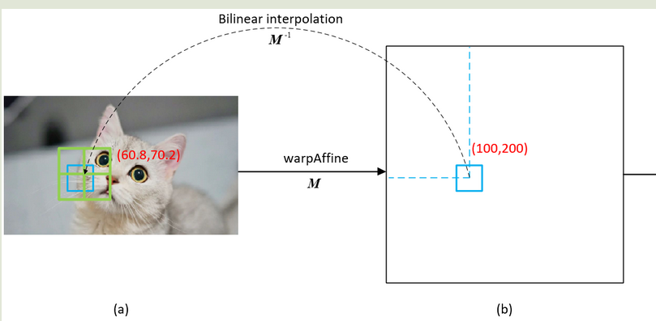

关键步骤分为两步

* 计算resize后像素点对应于原图中的坐标值
* 用计算出的原图坐标与最近的**四个点**对应的像素值进行**加权**计算得到插值点的像素值。


结合下面图

因为我们计算出的原图的坐标值不一定是一个整数值，例如上面的图中就是（60.8,70.2）我们可以先找其周围最近的四个像素点v1(60,70)、v2(61,70)、v3(60,71)、v4(61,71)，这四个像素点的像素值是已知的，然后再计算这四个像素点到未知像素点对应的面积作为其权重即W1、W2、W3、W4，那么最终目标图像(100,200)位置的像素值可用下式计算

$dst(100,200)=v1*w1+v2*w2+v3*w3+v4*w4$

注意上面的`v1`和`w1`的位置关系（v1、v2、v3、v4为四个像素，w1、w2、w3、w4为面积）

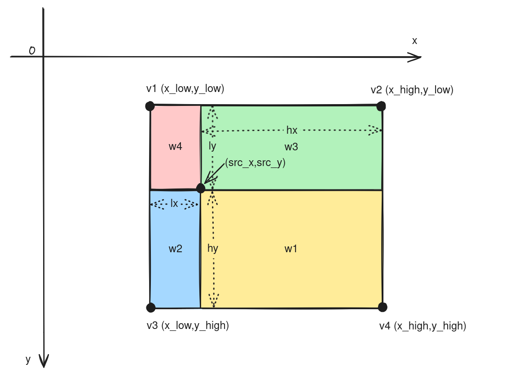

### 2.1.1 原图坐标值计算

#### 2.1.1.1 单线性插值

已知中P1点和P2点，坐标分别为(x1, y1)、(x2, y2)，要计算 [x1, x2] 区间内某一位置 x 在直线上的y值

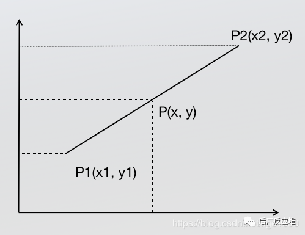

根据初中的知识，2点求一条直线公式(这是双线性插值所需要的唯一的基础公式)

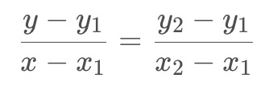

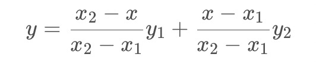

#### 2.1.1.2 双线性插值

已知Q11(x1,y1)、Q12(x1,y2)、Q21(x2,y1)、Q22(x2,y2)，求其中点P(x,y)的值。

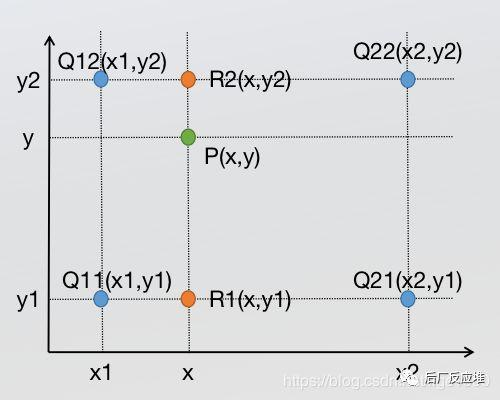

到此双线性插值的计算已经完成了，但是我们现在只能说是勉强的完成双线性插值算法，为什么这么说，现在的计算方式有比较大的问题，看下面的内容。

我们代码中计算原图坐标的代码为

```c
			src_x = (dx + 0.5f) * para.scale_w - 0.5f; 
			src_y = (dy + 0.5f) * para.scale_h - 0.5f;
```

按理说不是计算一个比例就可以了，为什么还会有一个加减0.5的操作？

理论上是

`src_x = des_x * src_w/des_w`

`src_y = des_y * src_w/des_w`

实际上是

`src_x = (des_x+0.5) * src_w/des_w-0.5`

`src_y = (des_y+0.5) * src_w/des_w-0.5`

例如把一个5×5图像缩放到3×3大小，那么我们看像素对应关系，只看第一行:

$I_{(3×3)}(0,0)=I_{(5×5)}(0,0)$

$I_{(3×3)}(1,0)=I_{(5×5)}({5\over 3},0)$

$I_{(3×3)}(2,0)=I_{(5×5)}({10\over 3},0)$

那么可以得到如下示意图:

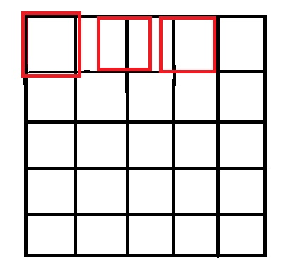

可以看到，按照这种情况，两张图并不是中心对齐的，实际会片左上角。那么如何解决这个问题呢:

在计算缩放坐标前先加上(0.5,0.5)取中心点坐标，再乘以变换系数，然后再变换回左上角坐标，即减去(0.5,0.5).

也就是

`src_x = (des_x+0.5) * src_w/des_w-0.5`

`src_y = (des_y+0.5) * src_w/des_w-0.5`

计算得到

$I_{(3×3)}(0,0)=I_{(5×5)}(0,0)$

$I_{(3×3)}(1,0)=I_{(5×5)}({2},0)$

$I_{(3×3)}(2,0)=I_{(5×5)}({11\over 3},0)$

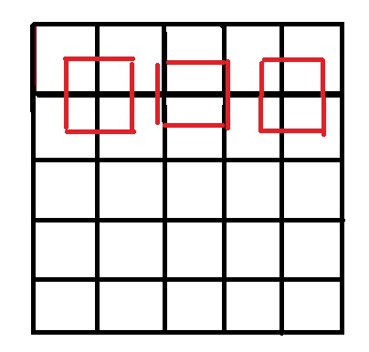

如何理解呢？

如果采用`src_x = des_x * src_w/des_w`，那么如下图注意到，原图和采样结果图的几何中心不在同个位置，这样会导致最终插值结果不准确。（图一：黄色点代表原图像素点，绿色点代表采样后图片的像素点）

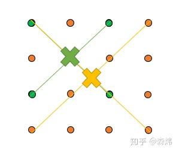

因此，要保证变换前后图像的几何中心一致，即保证像素中心对齐。如下图

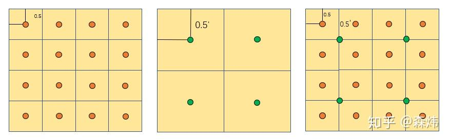

将像素视为 1×1 的正方形，像素坐标  $+{1\over2}$后为像素中心坐标

因此有

${srcw\over{srcx+0.5}}={dstw\over{dstx+0.5}}$

`src_x = (des_x+0.5) * src_w/des_w-0.5`

### 2.1.2 计算像素值

上面计算了resize后相对原图的坐标点。可以根据最近的**四个点**对应的像素值进行**加权**计算得到插值点的像素值。

如下图

* `(src_x,src_y)`是根据上面的算法计算出来的映射到原始图像的坐标值
* `v1 v2 v3 v4`是`(src_x,src_y)`临近的四个像素点（双三次插值(Bicubic interpolation)：双三次插值是用原图像中16(4*4)个点计算新图像中1个点，效果比较好，但是计算代价过大。）
* 根据公式计算像素值$src(x,y)=v1*w1+v2*w2+v3*w3+v4*w4$


对应代码如下

```c
			y_low = floorf(src_y);
			x_low = floorf(src_x);
			y_high = limit(y_low + 1, 0, para.inH - 1);
			x_high = limit(x_low + 1, 0, para.inW - 1);
			y_low = limit(y_low, 0, para.inH - 1);
			x_low = limit(x_low, 0, para.inW - 1);

			ly	= rint((src_y - y_low) * INTER_RESIZE_COEF_SCALE);
			lx	= rint((src_x - x_low) * INTER_RESIZE_COEF_SCALE);
			hy	= INTER_RESIZE_COEF_SCALE - ly;
			hx	= INTER_RESIZE_COEF_SCALE - lx;
			w1	= hy * hx;
			w2 = hy * lx;
			w3 = ly * hx;
			w4 = ly * lx;
			int stride = 0;
			if(para.inputFmt == FMT_RGBARGBARGBA)
			{
				stride = 4;
			}
			else
			{
				stride = 3;
			}
			// float* pdst = pDstBase + dy * para.outW + dx * 3;
			uint8_t* v1 = pSrcBase + y_low * para.inW*stride + x_low * stride;//这里多乘stride，是因为原始像素的HCW格式（RGBRGBRGB或者RGBARGBARGBA）
			uint8_t* v2 = pSrcBase + y_low * para.inW*stride + x_high * stride;
			uint8_t* v3 = pSrcBase + y_high * para.inW*stride + x_low * stride;
			uint8_t* v4 = pSrcBase + y_high * para.inW*stride + x_high * stride;

			c0 = resize_cast(w1 * v1[0] + w2 * v2[0] + w3 * v3[0] + w4 * v4[0]);
			c1 = resize_cast(w1 * v1[1] + w2 * v2[1] + w3 * v3[1] + w4 * v4[1]);
			c2 = resize_cast(w1 * v1[2] + w2 * v2[2] + w3 * v3[2] + w4 * v4[2]);
```

### 2.1.3 通道转换和归一化

下面代码判断需要不需要进行RGB到BGR的通道转换

```c
if(para.bgr == 1)
{
    float t = c2;
    c2 = c0;  c0 = t;
}
```

下面代码是计算归一化

```c
c0 = (c0 * 1/255 - 123.675f/255.0f) / (58.395f/255.0f);
c1 = (c1 * 1/255 - 116.280f/255.0f) / (57.120f/255.0f);
c2 = (c2 * 1/255 - 103.530f/255.0f) / (57.375f/255.0f);
```

最后是将resize后的图像存到目标位置

```c
int area = para.outW * para.outH;
float* pdst_c0 = pDstBase + dy * para.outW + dx;
float* pdst_c1 = pdst_c0 + area;
float* pdst_c2 = pdst_c1 + area;
*pdst_c0 = c0;
*pdst_c1 = c1;
*pdst_c2 = c2;
```


# 附录

*  [     图像Resize中0.5像素中心对齐的问题       ](https://www.cnblogs.com/jymg/p/11654554.html)

* [双线性插值原理](https://www.cnblogs.com/will-w/p/15222885.html)

* [如何理解双线性插值中图像坐标映射带0.5偏移](https://zhuanlan.zhihu.com/p/161457977)

  