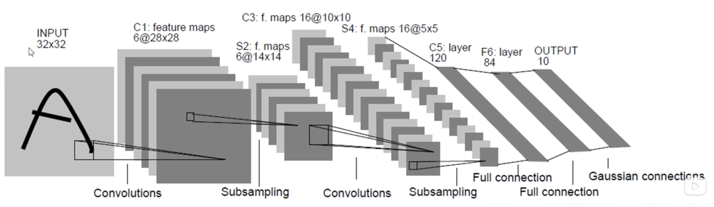
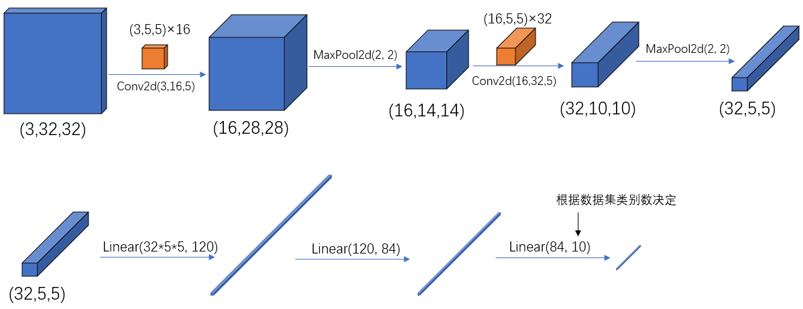
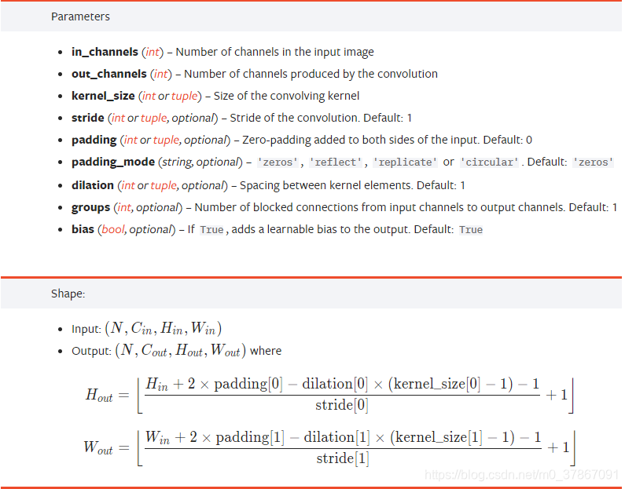
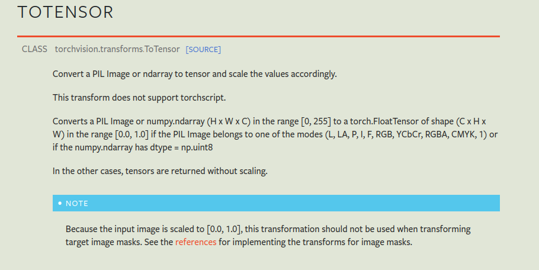
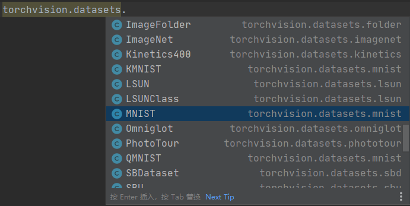
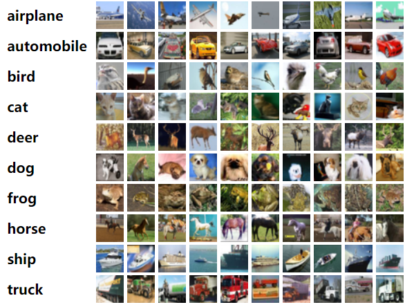

# 前言

最近在b站发现了一个非常好的 计算机视觉 + pytorch实战 的教程，相见恨晚，能让初学者少走很多弯路。
因此决定按着up给的教程路线：图像分类→目标检测→…一步步学习用 pytorch 实现深度学习在 cv 上的应用，并做笔记整理和总结。

up主教程给出了pytorch和tensorflow两个版本的实现，我暂时只记录pytorch版本的笔记。

参考内容来自：

* [up主的b站链接](https://space.bilibili.com/18161609/channel/index)
* [up主将代码和ppt都放在了github](https://github.com/WZMIAOMIAO/deep-learning-for-image-processing)
* [up主的CSDN博客](https://blog.csdn.net/qq_37541097/article/details/103482003)

# 1 文件结构

```shell
├── cat.jpg
├── data
├── Lenet.pth
├── model.py
├── predict.py
└── train.py
```

文件结构如上图

* cat.jpg : 自己用来测试模型预测的图片
* data: 训练和验证数据集目录。
* model.py :定义LeNet网络模型
* train.py :加载数据集并训练，训练集计算loss，测试集计算accuracy，保存训练好的网络参数
* predict.py:得到训练好的网络参数后，用自己找的图像进行分类测试

# 2 LeNet网络模型model.py



网络模型的结构在model.py中定义

```python
#model.py
import torch.nn as nn
import torch.nn.functional as F


class LeNet(nn.Module):                  # 继承于nn.Module这个父类
    def __init__(self):                  # 初始化网络结构
        super(LeNet, self).__init__()    # 多继承需用到super函数
        self.conv1 = nn.Conv2d(3, 16, 5) # 卷积 Conv2d
        self.pool1 = nn.MaxPool2d(2, 2)  # 池化 MaxPool2d
        self.conv2 = nn.Conv2d(16, 32, 5)
        self.pool2 = nn.MaxPool2d(2, 2)
        self.fc1 = nn.Linear(32*5*5, 120) # 全连接 Linear
        self.fc2 = nn.Linear(120, 84)
        self.fc3 = nn.Linear(84, 10)

    def forward(self, x):            # 正向传播过程
        x = F.relu(self.conv1(x))    # input(3, 32, 32) output(16, 28, 28)
        x = self.pool1(x)            # output(16, 14, 14)
        x = F.relu(self.conv2(x))    # output(32, 10, 10)
        x = self.pool2(x)            # output(32, 5, 5)
        x = x.view(-1, 32*5*5)       # output(32*5*5) Tensor的展平：view() 数据还是一个三维的Tensor (32, 5, 5)，需要先经过展平后(32*5*5)再传到全连接层
        x = F.relu(self.fc1(x))      # output(120)
        x = F.relu(self.fc2(x))      # output(84)
        x = self.fc3(x)              # output(10)
        return x

myLeNet = LeNet()
print(myLeNet)

```

输出如下：（注意这里的输出没有体现Conv2d后面的relu层，原因下面解释）

```	shell
LeNet(
  (conv1): Conv2d(3, 16, kernel_size=(5, 5), stride=(1, 1))
  (pool1): MaxPool2d(kernel_size=2, stride=2, padding=0, dilation=1, ceil_mode=False)
  (conv2): Conv2d(16, 32, kernel_size=(5, 5), stride=(1, 1))
  (pool2): MaxPool2d(kernel_size=2, stride=2, padding=0, dilation=1, ceil_mode=False)
  (fc1): Linear(in_features=800, out_features=120, bias=True)
  (fc2): Linear(in_features=120, out_features=84, bias=True)
  (fc3): Linear(in_features=84, out_features=10, bias=True)
)
```

* pytorch 中 tensor（也就是输入输出层）的 通道排序为：`[batch, channel, height, width]`

- pytorch中的卷积、池化、输入输出层中参数的含义与位置，可配合下图一起食用：

  

## 2.1 创建网络

要在 PyTorch 中定义一个神经网络，我们需要创建一个继承自 nn.Module 的类。我们在` __init__ `函数中定义网络的层数，并在 `forward `函数中指定数据如何通过网络。为了加速神经网络中的操作，我们将其移至 GPU 或 MPS（如果可用）。

下面使用两个简单的例子并打印模型的结构，看出两种模型的创建方式打印区别

```python
import torch.nn as nn
import torch.nn.functional as F


class Model(nn.Module):
    def __init__(self):
        super().__init__()
        self.conv1 = nn.Conv2d(1, 20, 5)
        self.conv2 = nn.Conv2d(20, 20, 5)

    def forward(self, x):
        x = F.relu(self.conv1(x))
        return F.relu(self.conv2(x))
model1 = Model()
print(model1)

class Model2(nn.Module):
    def __init__(self):
        super().__init__()
        self.SeqModel = nn.Sequential(
            nn.Conv2d(1, 20, 5),
            nn.ReLU(),
            nn.Conv2d(20, 20, 5),
            nn.ReLU()
        )
    def forward(self, x):
        x = self.SeqModel(x)
        return x
model2 = Model2()
print(model2)
```

打印输出为

```shell
Model(
  (conv1): Conv2d(1, 20, kernel_size=(5, 5), stride=(1, 1))
  (conv2): Conv2d(20, 20, kernel_size=(5, 5), stride=(1, 1))
)
Model2(
  (SeqModel): Sequential(
    (0): Conv2d(1, 20, kernel_size=(5, 5), stride=(1, 1))
    (1): ReLU()
    (2): Conv2d(20, 20, kernel_size=(5, 5), stride=(1, 1))
    (3): ReLU()
  )
)
```

* 第一种模型的结构定义

  在第一个模型`Model1`的定义中`F.relu` 是在 `forward` 方法中应用于 `self.conv1` 和 `self.conv2` 的输出。然而，当你打印模型时，它只显示模型的结构而不会显示每个层的具体操作，因此你不会在打印输出中看到 `F.relu`。

* 第二种模型的结构定义

  ```python
  class
  torch.nn.Sequential(arg: OrderedDict[str, Module])
  ```

  一个顺序容器。模块将按照它们在构造函数中传递的顺序添加到其中。或者，可以传入模块的 OrderedDict。Sequential  的forward()  方法接受任何输入并将其转发到它包含的第一个模块。然后，它将输出按顺序“链接”到每个后续模块的输入，最后返回最后一个模块的输出。

  ```python
  
  
  # Using Sequential to create a small model. When `model` is run,
  # input will first be passed to `Conv2d(1,20,5)`. The output of
  # `Conv2d(1,20,5)` will be used as the input to the first
  # `ReLU`; the output of the first `ReLU` will become the input
  # for `Conv2d(20,64,5)`. Finally, the output of
  # `Conv2d(20,64,5)` will be used as input to the second `ReLU`
  model = nn.Sequential(
            nn.Conv2d(1,20,5),
            nn.ReLU(),
            nn.Conv2d(20,64,5),
            nn.ReLU()
          )
  
  # Using Sequential with OrderedDict. This is functionally the
  # same as the above code
  model = nn.Sequential(OrderedDict([
            ('conv1', nn.Conv2d(1,20,5)),
            ('relu1', nn.ReLU()),
            ('conv2', nn.Conv2d(20,64,5)),
            ('relu2', nn.ReLU())
          ]))
  
  ```

创建LeNet


## 2.1 卷积 Conv2d

我们常用的卷积（Conv2d）在pytorch中对应的函数是：

https://pytorch.org/docs/stable/generated/torch.nn.Conv2d.html#conv2d

```python
torch.nn.Conv2d(in_channels, out_channels, kernel_size, stride=1, padding=0, dilation=1, groups=1, bias=True, padding_mode='zeros')
```

一般使用时关注以下几个参数即可：

* in_channels：输入特征矩阵的深度。如输入一张RGB彩色图像，那in_channels=3
* out_channels：输入特征矩阵的深度。也等于卷积核的个数，使用n个卷积核输出的特征矩阵深度就是n
* kernel_size：卷积核的尺寸。可以是int类型，如3 代表卷积核的height=width=3，也可以是tuple类型如(3, 5)代表卷积核的height=3，width=5
* stride：卷积核的步长。默认为1，和kernel_size一样输入可以是int型，也可以是tuple类型
* padding：补零操作，默认为0。可以为int型如1即补一圈0，如果输入为tuple型如(2, 1) 代表在上下补2行，左右补1列。



经卷积后的输出层尺寸计算公式为：

$Output = {\frac{( W − F + 2 P ) }{S}} + 1$

* 输入图片大小 `W×W`（一般情况下Width=Height）
* Filter大小` F×F`
* 步长` S`
* padding的像素数 `P`

若计算结果不为整数呢？参考[pytorch中的卷积操作详解](https://blog.csdn.net/qq_37541097/article/details/102926037)

## 2.2 池化 MaxPool2d

最大池化（MaxPool2d）在 pytorch 中对应的函数是：

```python
MaxPool2d(kernel_size, stride)
```

## 2.3 Tensor的展平：view()

注意到，在经过第二个池化层后，数据还是一个三维的Tensor (32, 5, 5)，需要先经过展平后(32*5*5)再传到全连接层：

```python
 x = x.view(-1, 32*5*5)       # output(32*5*5) Tensor的展平：view() 数据还是一个三维的Tensor (32, 5, 5)，需要先经过展平后(32*5*5)再传到全连接层
```

## 2.4 全连接 Linear

全连接（ Linear）在 pytorch 中对应的函数是：

```python
Linear(in_features, out_features, bias=True)
```

# 3 模型训练 tran.py

```python
#tran.py
import torch
import torchvision
import torch.nn as nn
from model import LeNet
import torch.optim as optim
import torchvision.transforms as transforms
import time


def main():
    # 预处理过程
    transform = transforms.Compose( 
        [transforms.ToTensor(),
         transforms.Normalize((0.5, 0.5, 0.5), (0.5, 0.5, 0.5))])

    # 50000张训练图片
    # 第一次使用时要将download设置为True才会自动去下载数据集
    train_set = torchvision.datasets.CIFAR10(root='./data', train=True,
                                             download=True, transform=transform)
    train_loader = torch.utils.data.DataLoader(train_set, batch_size=100,# 每批训练的样本数100
                                               shuffle=True, num_workers=0)

    # 10000张验证图片
    # 第一次使用时要将download设置为True才会自动去下载数据集
    val_set = torchvision.datasets.CIFAR10(root='./data', train=False,
                                           download=True, transform=transform)
    val_loader = torch.utils.data.DataLoader(val_set, batch_size=5000,# 每批用于验证的样本数
                                             shuffle=False, num_workers=0)
    # 获取测试集中的图像和标签，用于accuracy计算
    val_data_iter = iter(val_loader)
    val_image, val_label = next(val_data_iter)

    device = torch.device("cuda" if torch.cuda.is_available() else "cpu")
    print(device)
    
    # classes = ('plane', 'car', 'bird', 'cat',
    #            'deer', 'dog', 'frog', 'horse', 'ship', 'truck')

    net = LeNet()  # 自己定义训练的网络模型
    if torch.cuda.is_available():# GPU is available
        net.to(device) # 将网络分配到指定的device中
    loss_function = nn.CrossEntropyLoss()# 定义损失函数为交叉熵损失函数 
    optimizer = optim.Adam(net.parameters(), lr=0.001)# 定义优化器（训练参数，学习率）

    for epoch in range(5):  # loop over the dataset multiple times
        time_start = time.perf_counter()
        running_loss = 0.0
        for step, data in enumerate(train_loader, start=0):# 遍历训练集，step从0开始计算
            # get the inputs; data is a list of [inputs, labels]
            inputs, labels = data # 获取训练集的图像和标签

            # zero the parameter gradients
            optimizer.zero_grad() # 清除历史梯度
            # forward + backward + optimize
            if torch.cuda.is_available():# GPU is available
                outputs = net(inputs.to(device))				  # 正向传播 将inputs分配到指定的device中
                loss = loss_function(outputs, labels.to(device))  # 计算损失 将labels分配到指定的device中
            else:
                outputs = net(inputs)
                loss = loss_function(outputs, labels)
            loss.backward()                                   # 反向传播
            optimizer.step()                                  # 优化器更新参数

            # print statistics
            running_loss += loss.item()
            if step % 500 == 499:    # print every 500 mini-batches
                with torch.no_grad():# 在以下步骤中（验证过程中）不用计算每个节点的损失梯度，防止内存占用
                    if torch.cuda.is_available(): #GPU is available
                        outputs = net(val_image.to(device)) # 测试集传入网络（test_batch_size=5000），output维度为[5000,10]
                        predict_y = torch.max(outputs, dim=1)[1] # 以output中值最大位置对应的索引（标签）作为预测输出
                        # accuracy = torch.eq(predict_y, val_label).sum().item() / val_label.size(0)
                        accuracy = torch.eq(predict_y, val_label.to(device)).sum().item() / val_label.size(0)# 将val_label分配到指定的device中
                    else: # CPU
                        outputs = net(val_image)  # [batch, 10]
                        predict_y = torch.max(outputs, dim=1)[1] # 以output中值最大位置对应的索引（标签）作为预测输出
                        accuracy = torch.eq(predict_y, val_label).sum().item() / val_label.size(0)

                    print('[%d, %5d] train_loss: %.3f  test_accuracy: %.3f' %
                          (epoch + 1, step + 1, running_loss / 500, accuracy))
                    print('%f s' % (time.perf_counter() - time_start))        # 打印耗时
                    running_loss = 0.0

    print('Finished Training')

    save_path = './Lenet.pth'
    torch.save(net.state_dict(), save_path)


if __name__ == '__main__':
    main()

```

打印信息如下

```shell
LeNet(
  (conv1): Conv2d(3, 16, kernel_size=(5, 5), stride=(1, 1))
  (pool1): MaxPool2d(kernel_size=2, stride=2, padding=0, dilation=1, ceil_mode=False)
  (conv2): Conv2d(16, 32, kernel_size=(5, 5), stride=(1, 1))
  (pool2): MaxPool2d(kernel_size=2, stride=2, padding=0, dilation=1, ceil_mode=False)
  (fc1): Linear(in_features=800, out_features=120, bias=True)
  (fc2): Linear(in_features=120, out_features=84, bias=True)
  (fc3): Linear(in_features=84, out_features=10, bias=True)
)
Files already downloaded and verified
Files already downloaded and verified
cuda
[1,   500] train_loss: 1.588  test_accuracy: 0.529
15.412723 s
[2,   500] train_loss: 1.243  test_accuracy: 0.582
15.092248 s
[3,   500] train_loss: 1.084  test_accuracy: 0.632
15.218796 s
[4,   500] train_loss: 0.986  test_accuracy: 0.656
15.351273 s
[5,   500] train_loss: 0.910  test_accuracy: 0.660
15.559884 s
Finished Training
```

## 3.1 数据预处理

对输入的图像数据做预处理，即由shape (H x W x C) in the range [0, 255] → shape (C x H x W) in the range [0.0, 1.0]

```python
# 预处理过程
    transform = transforms.Compose( 
        [transforms.ToTensor(),
         transforms.Normalize((0.5, 0.5, 0.5), (0.5, 0.5, 0.5))])
```

参考[ToTensor](https://pytorch.org/vision/stable/generated/torchvision.transforms.ToTensor.html?highlight=totensor#torchvision.transforms.ToTensor)



## 3.2 数据集

利用`torchvision.datasets`函数可以在线导入pytorch中的数据集，包含一些常见的数据集如MNIST等



 此demo用的是CIFAR10数据集，也是一个很经典的图像分类数据集，由 Hinton 的学生 Alex Krizhevsky 和 Ilya Sutskever 整理的一个用于识别普适物体的小型数据集，一共包含 10 个类别的 RGB 彩色图片。



### 3.2.1 导入、加载 训练集

```python
    # 50000张训练图片
    # 第一次使用时要将download设置为True才会自动去下载数据集
    train_set = torchvision.datasets.CIFAR10(root='./data', train=True,
                                             download=True, transform=transform)
    train_loader = torch.utils.data.DataLoader(train_set, batch_size=100,# 每批训练的样本数100
                                               shuffle=True, num_workers=0)
```

### 3.2.2 导入、加载 测试集

```python
# 10000张验证图片
    # 第一次使用时要将download设置为True才会自动去下载数据集
    val_set = torchvision.datasets.CIFAR10(root='./data', train=False,
                                           download=True, transform=transform)
    val_loader = torch.utils.data.DataLoader(val_set, batch_size=5000,# 每批用于验证的样本数
                                             shuffle=False, num_workers=0)
```

自动下载数据集后目录结构如下，可以看出data目录下的变化

```shell
├── cat.jpg
├── data
│   ├── cifar-10-batches-py
│   │   ├── batches.meta
│   │   ├── data_batch_1
│   │   ├── data_batch_2
│   │   ├── data_batch_3
│   │   ├── data_batch_4
│   │   ├── data_batch_5
│   │   ├── readme.html
│   │   └── test_batch
│   └── cifar-10-python.tar.gz
├── Lenet.pth
├── model.py
├── predict.py
├── __pycache__
│   └── model.cpython-310.pyc
└── train.py
```

​     在CIFAR-10 数据集中，文件data_batch_1.bin、data_batch_2.bin 、··data_batch_5.bin 和test_ batch.bin 中各有10000 个样本。一个样本由3073 个字节组成，第一个字节为标签label ，剩下3072 个字节为图像数据。样本和样本之间没高多余的字节分割， 因此这几个二进制文件的大小都是30730000 字节。

| ***\*文件名\****                                             | ***\*文件用途\****                                           |
| ------------------------------------------------------------ | ------------------------------------------------------------ |
| batches.meta. bet                                            | 文件存储了每个类别的英文名称。可以用记事本或其他文本文件阅读器打开浏览查看 |
| data batch I.bin 、<br/>data batch 2.bm 、<br/>……<br/>data batch 5.bin<br/><br/>这5 个文件是CIFAR- 10 数据集中的训练数据。每个文件以二进制格式存储了10000 张32 × 32 的彩色图像和这些图像对应的类别标签。一共50000 张训练图像 |                                                              |
| test batch.bin                                               | 这个文件存储的是测试图像和测试图像的标签。一共10000 张       |
| readme.html                                                  | 数据集介绍文件                                               |

## 3.3 训练过程

| 名词              | 定义                                                         |
| ----------------- | ------------------------------------------------------------ |
| epoch             | 对训练集的全部数据进行一次完整的训练，称为 一次 epoch        |
| batch             | 由于硬件算力有限，实际训练时将训练集分成多个批次训练，每批数据的大小为 batch_size |
| iteration 或 step | 对一个batch的数据训练的过程称为 一个 iteration 或 step       |

以本demo为例，训练集一共有50000个样本，batch_size=100，那么完整的训练一次样本epoch=1：iteration或step=500，

```python
    # 获取测试集中的图像和标签，用于accuracy计算
    val_data_iter = iter(val_loader)
    val_image, val_label = next(val_data_iter)

    device = torch.device("cuda" if torch.cuda.is_available() else "cpu")
    print(device)
    
    # classes = ('plane', 'car', 'bird', 'cat',
    #            'deer', 'dog', 'frog', 'horse', 'ship', 'truck')

    net = LeNet()  # 自己定义训练的网络模型
    if torch.cuda.is_available():# GPU is available
        net.to(device) # 将网络分配到指定的device中
    loss_function = nn.CrossEntropyLoss()# 定义损失函数为交叉熵损失函数 
    optimizer = optim.Adam(net.parameters(), lr=0.001)# 定义优化器（训练参数，学习率）

    for epoch in range(5):  # loop over the dataset multiple times
        time_start = time.perf_counter()
        running_loss = 0.0
        for step, data in enumerate(train_loader, start=0):# 遍历训练集，step从0开始计算
            # get the inputs; data is a list of [inputs, labels]
            inputs, labels = data # 获取训练集的图像和标签

            # zero the parameter gradients
            optimizer.zero_grad() # 清除历史梯度
            # forward + backward + optimize
            if torch.cuda.is_available():# GPU is available
                outputs = net(inputs.to(device))				  # 正向传播 将inputs分配到指定的device中
                loss = loss_function(outputs, labels.to(device))  # 计算损失 将labels分配到指定的device中
            else:
                outputs = net(inputs)
                loss = loss_function(outputs, labels)
            loss.backward()                                   # 反向传播
            optimizer.step()                                  # 优化器更新参数

            # print statistics
            running_loss += loss.item()
            if step % 500 == 499:    # print every 500 mini-batches
                with torch.no_grad():# 在以下步骤中（验证过程中）不用计算每个节点的损失梯度，防止内存占用
                    if torch.cuda.is_available(): #GPU is available
                        outputs = net(val_image.to(device)) # 测试集传入网络（test_batch_size=5000），output维度为[5000,10]
                        predict_y = torch.max(outputs, dim=1)[1] # 以output中值最大位置对应的索引（标签）作为预测输出
                        # accuracy = torch.eq(predict_y, val_label).sum().item() / val_label.size(0)
                        accuracy = torch.eq(predict_y, val_label.to(device)).sum().item() / val_label.size(0)# 将val_label分配到指定的device中
                    else: # CPU
                        outputs = net(val_image)  # [batch, 10]
                        predict_y = torch.max(outputs, dim=1)[1] # 以output中值最大位置对应的索引（标签）作为预测输出
                        accuracy = torch.eq(predict_y, val_label).sum().item() / val_label.size(0)

                    print('[%d, %5d] train_loss: %.3f  test_accuracy: %.3f' %
                          (epoch + 1, step + 1, running_loss / 500, accuracy))
                    print('%f s' % (time.perf_counter() - time_start))        # 打印耗时
                    running_loss = 0.0

    print('Finished Training')

    save_path = './Lenet.pth'
    torch.save(net.state_dict(), save_path)
```

### 3.3.1 使用GPU/CPU训练

使用下面语句可以在有GPU时使用GPU，无GPU时使用CPU进行训练

```python
device = torch.device("cuda" if torch.cuda.is_available() else "cpu")
print(device)
```

也可以直接指定

```python
device = torch.device("cuda")
# 或者
# device = torch.device("cpu")
```

对应的，需要用`to()`函数来将Tensor在CPU和GPU之间相互移动，分配到指定的device中计算

# 4 使用训练的模型预测predict.py

```python
#predict.py
import torch
import torchvision.transforms as transforms
from PIL import Image

from model import LeNet


def main():
    # 数据预处理
    transform = transforms.Compose(
        [transforms.Resize((32, 32)),# 首先需resize成跟训练集图像一样的大小
         transforms.ToTensor(),
         transforms.Normalize((0.5, 0.5, 0.5), (0.5, 0.5, 0.5))])

    classes = ('plane', 'car', 'bird', 'cat',
               'deer', 'dog', 'frog', 'horse', 'ship', 'truck')
    
    device = torch.device("cuda" if torch.cuda.is_available() else "cpu")
    print(device)

    net = LeNet()
    net.load_state_dict(torch.load('Lenet.pth'))
    if torch.cuda.is_available():
        net.to(device) # 将网络分配到指定的device中

    im = Image.open('cat.jpg')# 导入要测试的图像（自己找的，不在数据集中），放在源文件目录下
    im = transform(im)  # [C, H, W]
    im = torch.unsqueeze(im, dim=0)  # [N, C, H, W]

    with torch.no_grad():
        if torch.cuda.is_available():
            outputs = net(im.to(device))
            predict = torch.max(outputs.cpu(), dim=1)[1].numpy()
        else:
            outputs = net(im)
            predict = torch.max(outputs, dim=1)[1].numpy()
        
        print(outputs)
    print(classes[int(predict)])


if __name__ == '__main__':
    main()

```

这里的`cat.jpg`是自己下载的图片

# 附录：

* [pytorch图像分类篇：2.pytorch官方demo实现一个分类器(LeNet)](https://blog.csdn.net/m0_37867091/article/details/107136477?spm=1001.2014.3001.5501)

