# 1 前言

最近在b站发现了一个非常好的 计算机视觉 + pytorch实战 的教程，相见恨晚，能让初学者少走很多弯路。
因此决定按着up给的教程路线：图像分类→目标检测→…一步步学习用pytorch实现深度学习在cv上的应用，并做笔记整理和总结。

up主教程给出了pytorch和tensorflow两个版本的实现，我暂时只记录pytorch版本的笔记。

参考内容来自：

* up主的b站链接：https://space.bilibili.com/18161609/channel/index
* up主将代码和ppt都放在了github：https://github.com/WZMIAOMIAO/deep-learning-for-image-processing
* up主的CSDN博客：https://blog.csdn.net/qq_37541097/article/details/103482003

# 2 AlexNet详解

AlexNet 是2012年 ISLVRC ( ImageNet Large Scale Visual Recognition Challenge)竞赛的冠军网络，分类准确率由传统的70%+提升到80%+。它是由Hinton和他的学生Alex Krizhevsky设计的。 也是在那年之后，深度学习开始迅速发展。

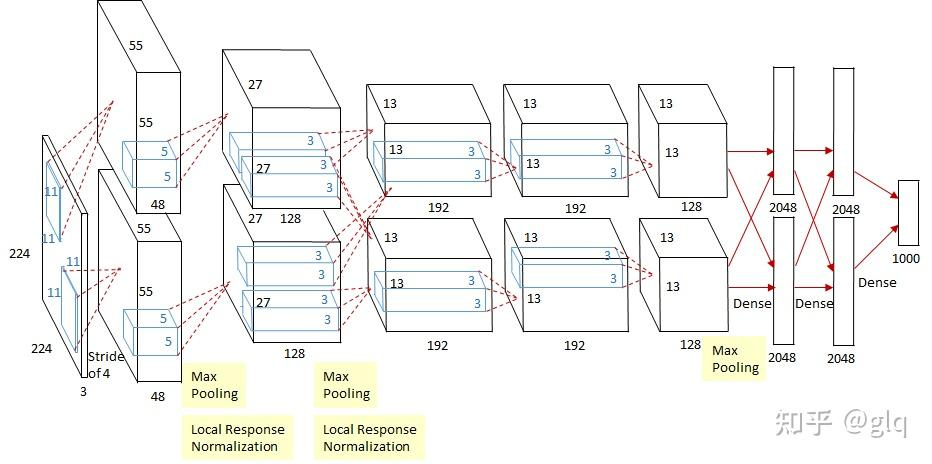

该网络的亮点在于：

* 首次使用GPU进行网络加速训练

* 首次使用RelU激活函数而不是传统的Sigmiod激活函数以及Tanh激活函数（求导简单，并解决网络较深时候的梯度消失问题）

* 使用了LRN局部响应归一化

  * LRN是在卷积层和池化层之间添加的一种归一化操作。在卷积层中，每个卷积核都对应一个特征图（feature map），LRN就是对这些特征图进行归一化。具体来说，对于每个特征图上的每个位置，计算该位置周围的像素的平方和，然后将当前位置的像素值除以这个和。LRN本质是抑制邻近神经元的响应，从而增强了神经元的较大响应。这种技术在一定程度上能够避免过拟合，并提高网络的泛化能力。[参考](https://dgschwend.github.io/netscope/#/preset/alexnet)

    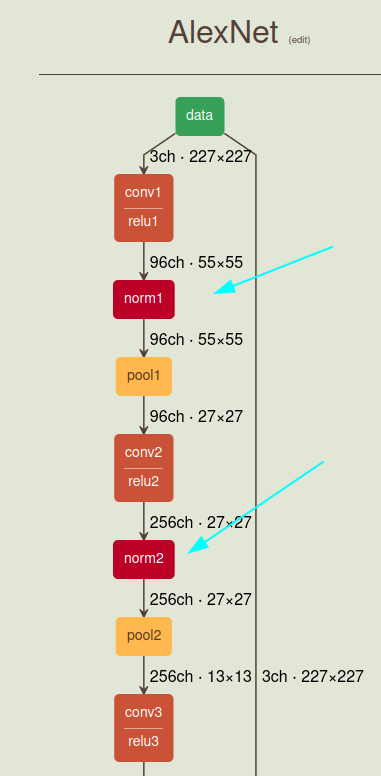

* 在全连接层前的前两层中使用了Dropout随机失活神经元，以减少过拟合。

**过拟合**

如下图最右侧就是过拟合的情况。

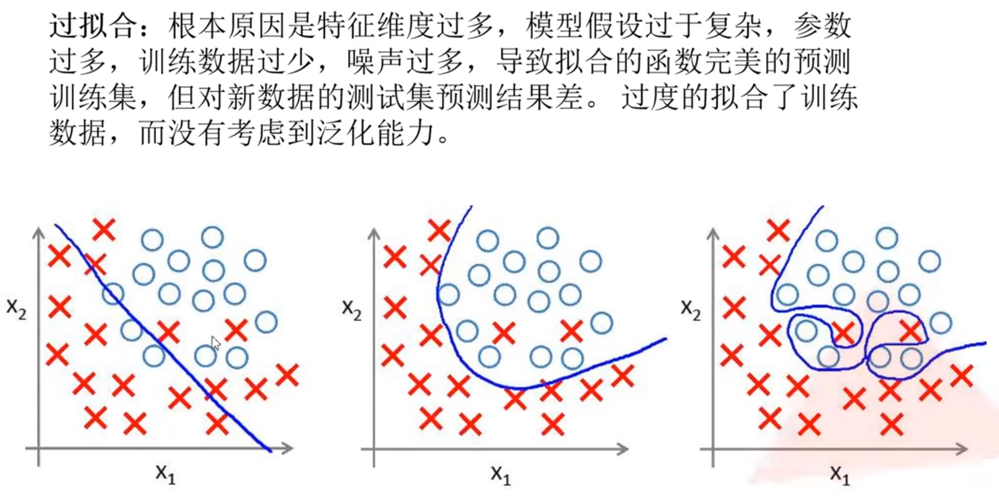

**Dropout**

作者使用Dropout的方式减少过拟合的情况

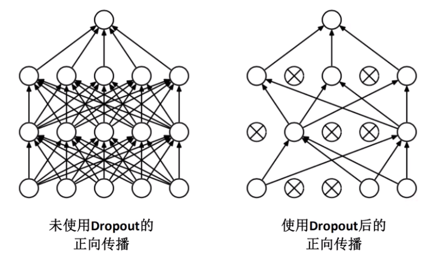

卷及后矩阵计算公式为

$N= {(W-F+2P)\over S} +1$

* 输入图片大小`W*W`
* Filter大小`F*F`
* 步长`S`
* `padding`像素数`P`

## 2.1 分层讲解

### 2.1.1 Conv1

由于网络上下结构一样，我们只看下面的结构就可以了

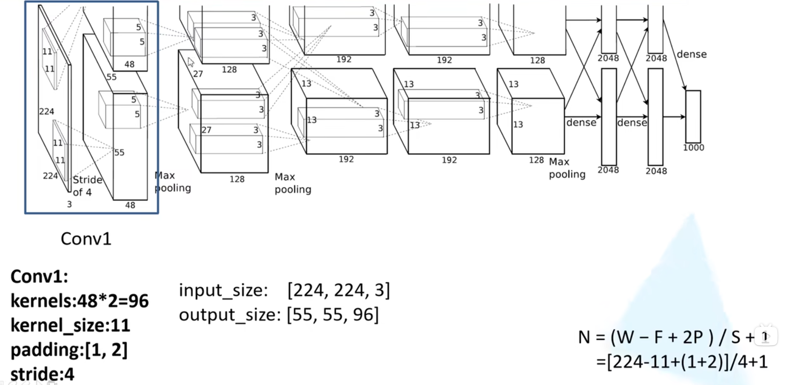

上面的`padding[1,2]`代表在原图上面加上一行0,下面加上两行0.左边加上一列0,右边加上两列0.

### 2.1.2 Max pooling

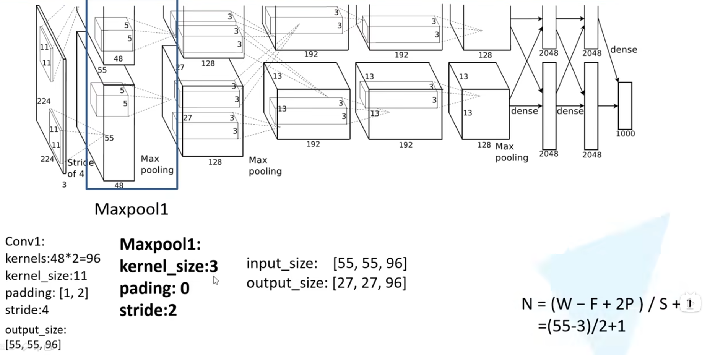

### 2.1.3 Conv2

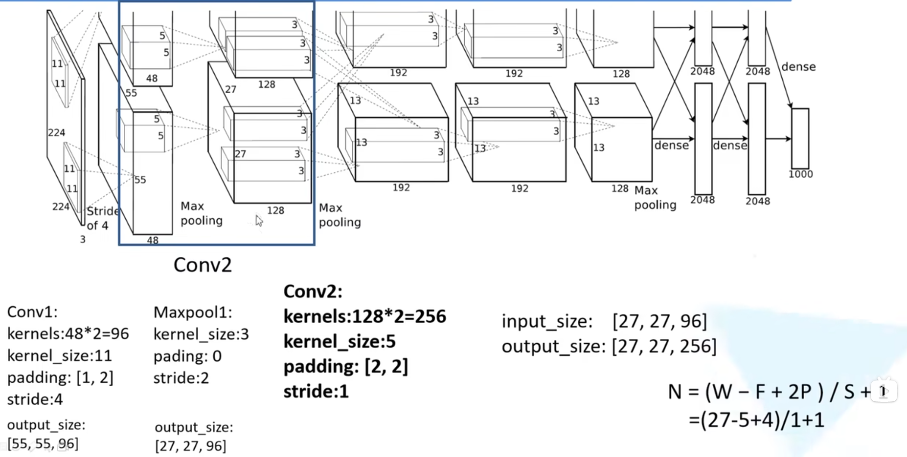

### 2.1.4 Max pooling2

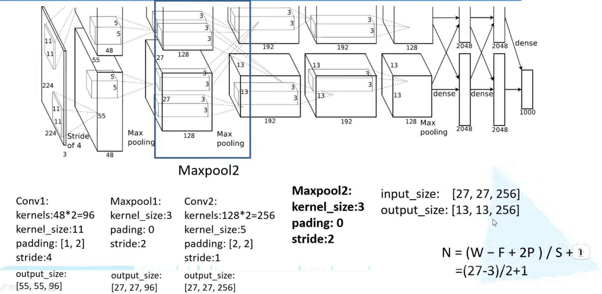

### 2.1.5 Conv3

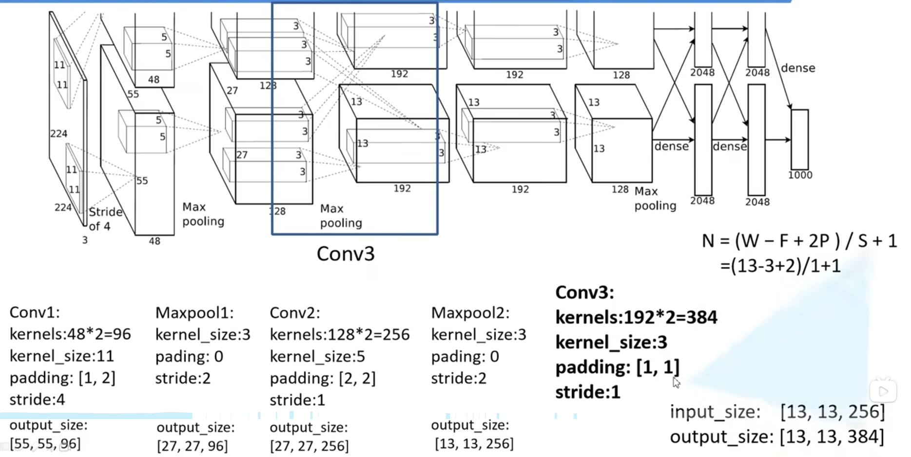

### 2.1.6 Conv4

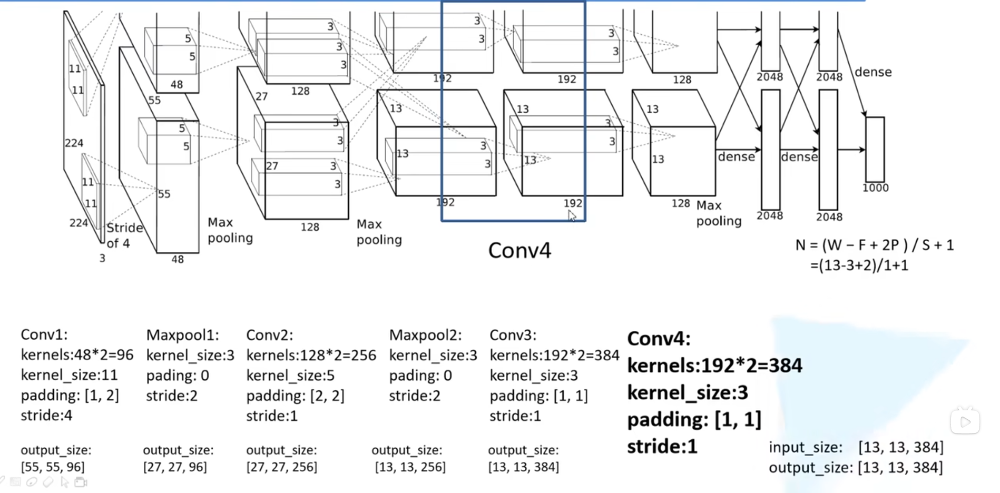

### 2.1.7 Conv5

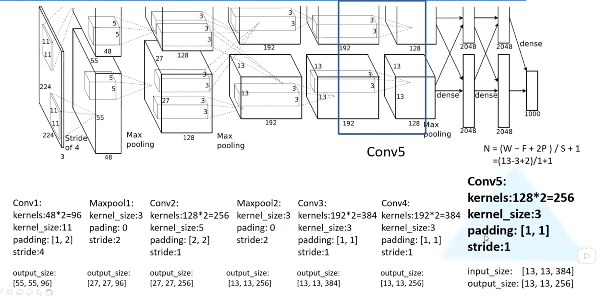

### 2.1.8 Max pooling3

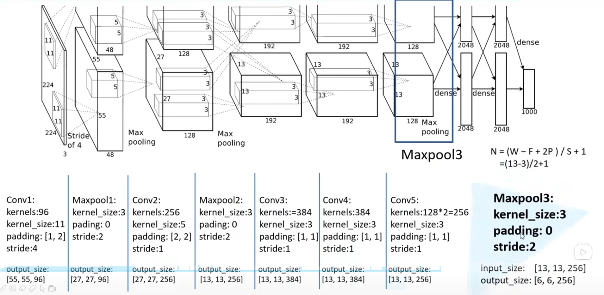

### 2.1.9 Fully connected

只需要注意最后一个全连接层是1000,因为数据集是1000个类别，如果是自己的数据集，例如5分类，那么需要修好最后一层为5.

# 3 代码和数据集

TODO。其实看作者的github代码即可，没什么讲的。