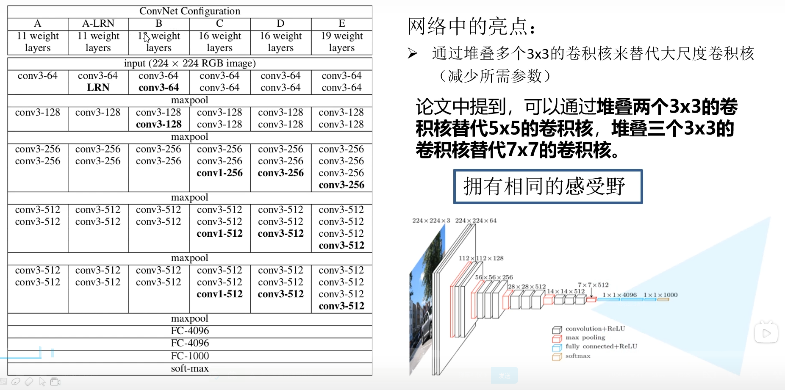
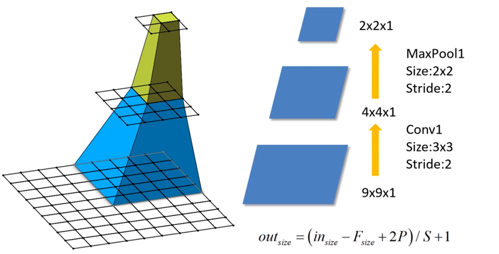
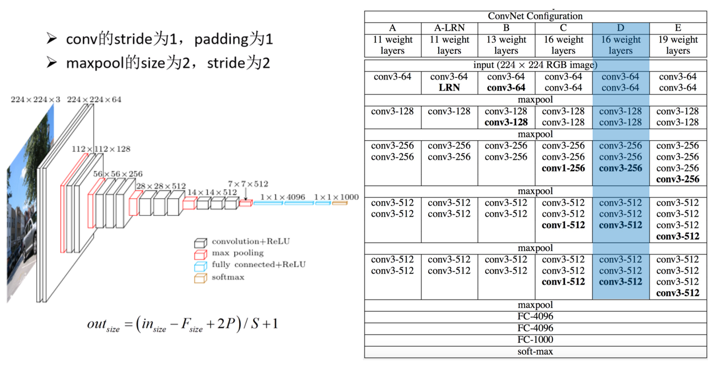
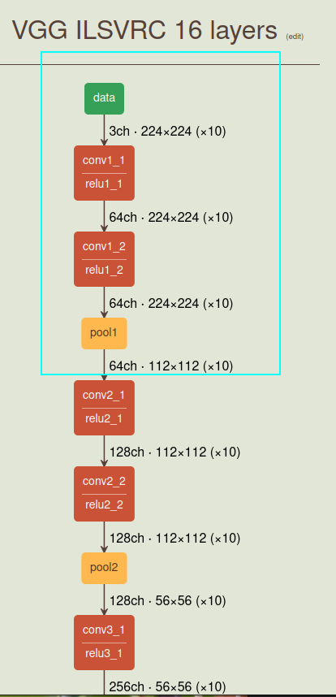

# 1 前言

最近在b站发现了一个非常好的 计算机视觉 + pytorch实战 的教程，相见恨晚，能让初学者少走很多弯路。
因此决定按着up给的教程路线：图像分类→目标检测→…一步步学习用pytorch实现深度学习在cv上的应用，并做笔记整理和总结。

up主教程给出了pytorch和tensorflow两个版本的实现，我暂时只记录pytorch版本的笔记。

参考内容来自：

* up主的b站链接：https://space.bilibili.com/18161609/channel/index
* up主将代码和ppt都放在了github：https://github.com/WZMIAOMIAO/deep-learning-for-image-processing
* up主的CSDN博客：https://blog.csdn.net/qq_37541097/article/details/103482003

# 2 VGG详解

VGG 在2014年由牛津大学著名研究组 VGG（Visual Geometry Group）提出，斩获该年 ImageNet 竞赛中 Localization Task（定位任务）第一名和 Classification Task（分类任务）第二名。
原论文地址：Very Deep Convolutional Networks for Large-Scale Image Recognition

VGG网络的创新点：

* **通过堆叠多个小卷积核来替代大尺度卷积核，可以减少训练参数，同时能保证相同的感受野。**

论文中提到，**可以通过堆叠两个3×3的卷积核替代5x5的卷积核，堆叠三个3×3的卷积核替代7x7的卷积核。**

下面给出了原作者的多种配置，**常用的是下图的D配置。也就是VGG-16**（16的意思就是13个卷积层和三个全连接层）

## 2.1 CNN感受野

在卷积神经网络中，决定某一层输出结果中一个元素所对应的输入层的区域大小，被称作感受野（receptive field）。
通俗的解释是，输出feature map上的一个单元 对应 输入层上的区域大小。

以下图为例，输出层 layer3 中一个单元 对应 输入层 layer2 上区域大小为2×2（池化操作），对应输入层 layer1 上大小为5×5
（可以这么理解，layer2中 2×2区域中的每一块对应一个3×3的卷积核，又因为 stride=2，所以layer1的感受野为5×5）

感受野的计算公式为：
$F ( i ) = ( F ( i + 1 ) − 1 ) × Stride  + Ksize $

* F ( i )  为第 i层感受野
* Stride为第 i 层的步距
* Ksize 为 卷积核 或 池化核 尺寸

以上图为例：

Feature map: $F(3)=1$
Pool1：$F(2)=(1−1)×2+2=2$

Conv1: $F(1)=(2−1)×2+3=5$

现在，我们来验证下VGG论文中的两点结论：

1. 堆叠两个3×3的卷积核替代5x5的卷积核，堆叠三个3×3的卷积核替代7x7的卷积核。替代前后感受野是否相同？

（注：VGG网络中卷积的Stride默认为1）

Feature map:$F=1$
Conv3x3(3):  $F=(1−1)×1+3=3$
Conv3x3(2): $F=(3−1)×1+3=5$ （5×5卷积核感受野）
Conv3x3(1): $F=(5−1)×1+3=7 $（7×7卷积核感受野）

2. 堆叠3×3卷积核后训练参数是否真的减少了？

注：CNN参数个数 = 卷积核尺寸×卷积核深度 × 卷积核组数 = 卷积核尺寸 × 输入特征矩阵深度 × 输出特征矩阵深度
现假设 输入特征矩阵深度 = 输出特征矩阵深度 = C

使用7×7卷积核所需参数个数： $7×7×C×C=49C^2$
堆叠三个3×3的卷积核所需参数个数：$3×3×C×C+3×3×C×C+3×3×C×C=27C^2$

## 2.2 VGG网络结构

VGG网络有多个版本，一般常用的是VGG-16模型，其网络结构如下如所示：

 稍作计算可以发现，padding=1 stride=1的 3×3卷积的特征矩阵的尺寸是不改变的

这里只是给出前两个卷积和一个Maxpool的图示，详细可以[查看](https://dgschwend.github.io/netscope/#/preset/vgg-16)

# 3 VGG代码实现

TODO，可以直接查看上面给出的github