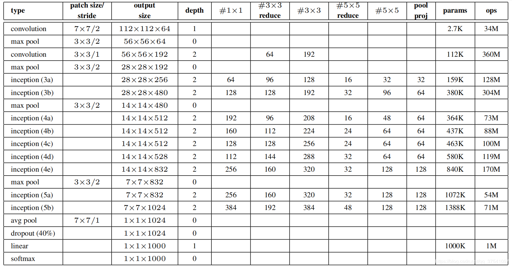

# 1 前言

最近在b站发现了一个非常好的 计算机视觉 + pytorch 的教程，相见恨晚，能让初学者少走很多弯路。
因此决定按着up给的教程路线：图像分类→目标检测→…一步步学习用pytorch实现深度学习在cv上的应用，并做笔记整理和总结。

up主教程给出了pytorch和tensorflow两个版本的实现，我暂时只记录pytorch版本的笔记。

参考内容来自：

* up主的b站链接：https://space.bilibili.com/18161609/channel/index
* up主将代码和ppt都放在了github：https://github.com/WZMIAOMIAO/deep-learning-for-image-processing\
* up主的CSDN博客：https://blog.csdn.net/qq_37541097/article/details/103482003

# 2 GoogLeNet网络详解

GoogLeNet在2014年由Google团队提出（与VGG网络同年，注意GoogLeNet中的L大写是为了致敬LeNet），斩获当年ImageNet竞赛中Classification Task (分类任务) 第一名。

原论文地址：Going deeper with convolutions

GoogLeNet 的创新点：

* 引入了 Inception 结构（融合不同尺度的特征信息）
* 使用1x1的卷积核进行降维以及映射处理 （虽然VGG网络中也有，但该论文介绍的更详细）
* 添加两个辅助分类器帮助训练
* 丢弃全连接层，使用平均池化层（大大减少模型参数，除去两个辅助分类器，网络大小只有vgg的1/20）

## 2.1 inception 结构

传统的CNN结构如AlexNet、VggNet（下图）都是串联的结构，即将一系列的卷积层和池化层进行串联得到的结构。

GoogLeNet 提出了一种并联结构，

* 图a是论文中提出的inception原始结构，将特征矩阵**同时输入到多个分支**进行处理，并将输出的特征矩阵**按深度进行拼接**，得到最终输出。
* 图b是添加了降维（使用1×1卷积来做），目的是为了降维（减小深度），减少模型训练参数，减少计算量。

同样是对一个深度为512的特征矩阵使用64个大小为5x5的卷积核进行卷积，不使用1x1卷积核进行降维的 话一共需要819200个参数，如果使用1x1卷积核进行降维一共需要50688个参数，明显少了很多。

 注：CNN参数个数 = 卷积核尺寸×卷积核深度 × 卷积核组数 = 卷积核尺寸 × 输入特征矩阵深度 × 输出特征矩阵深度

参考[这里](https://dgschwend.github.io/netscope/#/preset/googlenet)可以看一下细节

## 2.2 辅助分类器（Auxiliary Classifier）

AlexNet 和 VGG 都只有1个输出层，GoogLeNet 有3个输出层，其中的两个是辅助分类层。

如下图所示，网络主干右边的 两个分支 就是 辅助分类器，其结构一模一样。
在训练模型时，将两个辅助分类器的损失乘以权重（论文中是0.3）加到网络的整体损失上，再进行反向传播。

辅助分类器的两个分支有什么用呢？

作用一：可以把他看做inception网络中的一个小细节，它确保了即便是隐藏单元和中间层也参与了特征计算，他们也能预测图片的类别，他在inception网络中起到一种调整的效果，并且能防止网络发生过拟合。
作用二：给定深度相对较大的网络，有效传播梯度反向通过所有层的能力是一个问题。通过将辅助分类器添加到这些中间层，可以期望较低阶段分类器的判别力。在训练期间，它们的损失以折扣权重（辅助分类器损失的权重是0.3）加到网络的整个损失上。

## 2.3 GoogLeNet 网络参数

下面是原论文中给出的网络参数列表，配合上图查看

 对于Inception模块，所需要使用到参数有`#1x1`, `#3x3reduce`, `#3x3`, `#5x5reduce`, `#5x5`, `poolproj`，这6个参数，分别对应着所使用的卷积核个数。

* `#1x1`对应着分支1上1x1的卷积核个数
* `#3x3reduce`对应着分支2上1x1的卷积核个数
* `#3x3`对应着分支2上3x3的卷积核个数
* `#5x5reduce`对应着分支3上1x1的卷积核个数
* `#5x5`对应着分支3上5x5的卷积核个数
* `poolproj`对应着分支4上1x1的卷积核个数

参数数量对比，GoogleNet参数小得多

# 3 代码实现

TODO