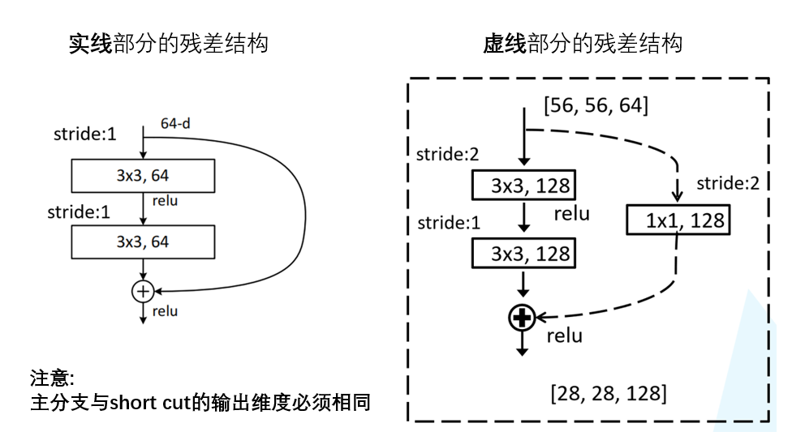

# 1 前言

最近在b站发现了一个非常好的 计算机视觉 + pytorch 的教程，相见恨晚，能让初学者少走很多弯路。
因此决定按着up给的教程路线：图像分类→目标检测→…一步步学习用pytorch实现深度学习在cv上的应用，并做笔记整理和总结。

up主教程给出了pytorch和tensorflow两个版本的实现，我暂时只记录pytorch版本的笔记。

参考内容来自：

* up主的b站链接：https://space.bilibili.com/18161609/channel/index
* up主将代码和ppt都放在了github：https://github.com/WZMIAOMIAO/deep-learning-for-image-processing\
* up主的CSDN博客：https://blog.csdn.net/qq_37541097/article/details/103482003
* 2 

# 2  ResNet 详解

原论文地址：Deep Residual Learning for Image Recognition（作者是CV大佬何凯明团队）

ResNet 网络是在 2015年 由微软实验室提出，斩获当年ImageNet竞赛中分类任务第一名，目标检测第一名。获得COCO数据集中目标检测第一名，图像分割第一名。

在ResNet网络的创新点：

* 提出 Residual 结构（残差结构），并搭建超深的网络结构（可突破1000层）（之前的只有十几层）
* 使用 Batch Normalization 加速训练（丢弃dropout）

下图是ResNet34层模型的结构简图：

## 2.1 Why residual?

在ResNet网络提出之前，传统的卷积神经网络都是通过将一系列卷积层与池化层进行堆叠得到的。

一般我们会觉得网络越深，特征信息越丰富，模型效果应该越好。但是实验证明，当网络堆叠到一定深度时，会出现两个问题：

**梯度消失或梯度爆炸**

* 关于梯度消失和梯度爆炸，其实看名字理解最好：\
* 若每一层的误差梯度小于1，反向传播时，网络越深，梯度越趋近于0
* 反之，若每一层的误差梯度大于1，反向传播时，网路越深，梯度越来越大

**退化问题**(degradation problem)：在解决了梯度消失、爆炸问题后，仍然存在深层网络的效果可能比浅层网络差的现象

总结就是，**当网络堆叠到一定深度时，反而会出现深层网络比浅层网络效果差的情况**。

如下图所示，20层网络 反而比 56层网络 的误差更小：

* 对于梯度消失或梯度爆炸问题，ResNet论文提出通过数据的预处理以及在网络中使用 BN（Batch Normalization）层来解决。

* 对于退化问题，ResNet论文提出了 residual结构（残差结构）来减轻退化问题，下图是使用residual结构的卷积网络，可以看到随着网络的不断加深，效果并没有变差，而是变的更好了。（虚线是train error，实线是test error）

  

## 2.2 What is residual？

为了解决深层网络中的退化问题，可以人为地让神经网络某些层跳过下一层神经元的连接，隔层相连，弱化每层之间的强联系。这种神经网络被称为 残差网络 (ResNets)。

残差网络由许多隔层相连的神经元子模块组成，我们称之为 残差块 Residual block。单个残差块的结构如下图所示：

上图中红色部分称为 short cut 或者 skip connection（也称 捷径分支），直接建立 $a^{[l]}$  与 $ a^{[l+2]} $之间的隔层联系。

由多个 残差块 组成的神经网络就是 残差网络 。其结构如下图所示：

实验表明，这种模型结构对于训练非常深的神经网络,效果很好。另外，为了便于区分，我们把 **非残差网络** 称为 **Plain Network。**

## 2.3 ResNet中的residual结构

跟VggNet类似，ResNet也有多个不同层的版本，而残差结构也有两种对应浅层和深层网络：

|          | ResNet           | 残差结构   |
| -------- | ---------------- | ---------- |
| 浅层网络 | ResNet18/34      | BasicBlock |
| 深层网络 | ResNet50/101/152 | Bottleneck |

下图中左侧残差结构称为 BasicBlock，右侧残差结构称为 Bottleneck（**注意下面的相加不是深度方向的拼接，是特征矩阵的相加（矩阵加法）**）

**上图中右侧多了一个1×1的卷积层，主要是改变深度。**

可以计算一下，假设两个残差结构的输入特征和输出特征矩阵的深度都是256维，如下

那么两个残差结构所需的参数为：

左侧： $3×3×256×256+3×3×256×256=1,179,648$
右侧： $1×1×256×64+3×3×64×64+1×1×64×256=69,632$

注：CNN参数个数 = 卷积核尺寸×卷积核深度 × 卷积核组数 = 卷积核尺寸 × 输入特征矩阵深度 × 输出特征矩阵深度  
明显搭建深层网络时，使用右侧的残差结构更合适。

观察下图的 ResNet18层网络，可以发现有些残差块的 short cut 是实线的，而有些则是虚线的。

这些虚线的 short cut 上通过1×1的卷积核进行了维度处理（特征矩阵在长宽方向降采样，深度方向调整成下一层残差结构所需要的channel）。

 下图是原论文给出的不同深度的ResNet网络结构配置，注意表中的残差结构给出了主分支上卷积核的大小与卷积核个数，表中 残差块×N 表示将该残差结构重复N次。

原文的表注中已说明，conv3_x, conv4_x, conv5_x所对应的一系列残差结构的第一层残差结构都是虚线残差结构。因为这一系列残差结构的第一层都有调整输入特征矩阵shape的使命（将特征矩阵的高和宽缩减为原来的一半，将深度channel调整成下一层残差结构所需要的channel）

需要注意的是，对于ResNet50/101/152，其实conv2_x所对应的一系列残差结构的第一层也是虚线残差结构，因为它需要调整输入特征矩阵的channel。根据表格可知通过3x3的max pool之后输出的特征矩阵shape应该是[56, 56, 64]，但conv2_x所对应的一系列残差结构中的实线残差结构它们期望的输入特征矩阵shape是[56, 56, 256]（因为这样才能保证输入输出特征矩阵shape相同，才能将捷径分支的输出与主分支的输出进行相加）。所以第一层残差结构需要将shape从[56, 56, 64] --> [56, 56, 256]。注意，这里只调整channel维度，高和宽不变（而conv3_x, conv4_x, conv5_x所对应的一系列残差结构的第一层虚线残差结构不仅要调整channel还要将高和宽缩减为原来的一半）。

下面是 ResNet 18/34 和 ResNet 50/101/152 具体的实线/虚线残差结构图：

**ResNet 18/34**

例如针对34-layer的conv3_x来说，输入的shape为[56,56,64]，输出shape为[28,28,128]，因此需要虚线得到的输出也是[28,28,128]。因此通过stride=2改变56为28,在通过128通道改变通道数64为128.

**ResNet 50/101/152s**

# 3 BN层

就是针对feature map进行处理（是针对**batch的处理**，不是一张照片的feture map进行处理）

# 4 迁移学习

迁移学习是一个比较大的领域，我们这里说的迁移学习是指神经网络训练中使用到的迁移学习。

在迁移学习中，我们希望利用源任务（Source Task）学到的知识帮助学习目标任务 (Target Task)。例如，一个训练好的图像分类网络能够被用于另一个图像相关的任务。再比如，一个网络在仿真环境学习的知识可以被迁移到真实环境的网络。迁移学习一个典型的例子就是载入训练好VGG网络，这个大规模分类网络能将图像分到1000个类别，然后把这个网络用于另一个任务，如医学图像分类。

为什么可以这么做呢？如下图所示，神经网络逐层提取图像的深层信息，这样，预训练网络就相当于一个特征提取器。

使用迁移学习的优势：

* 能够快速的训练出一个理想的结果
* 当数据集较小时也能训练出理想的效果

   注意：使用别人预训练好的模型参数时，要注意别人的预处理方式。

常见的迁移学习方式：

* 载入权重后训练所有参数
* 载入权重后只训练最后几层参数
* 载入权重后在原网络基础上再添加一层全连接层，仅训练最后一个全连接层

