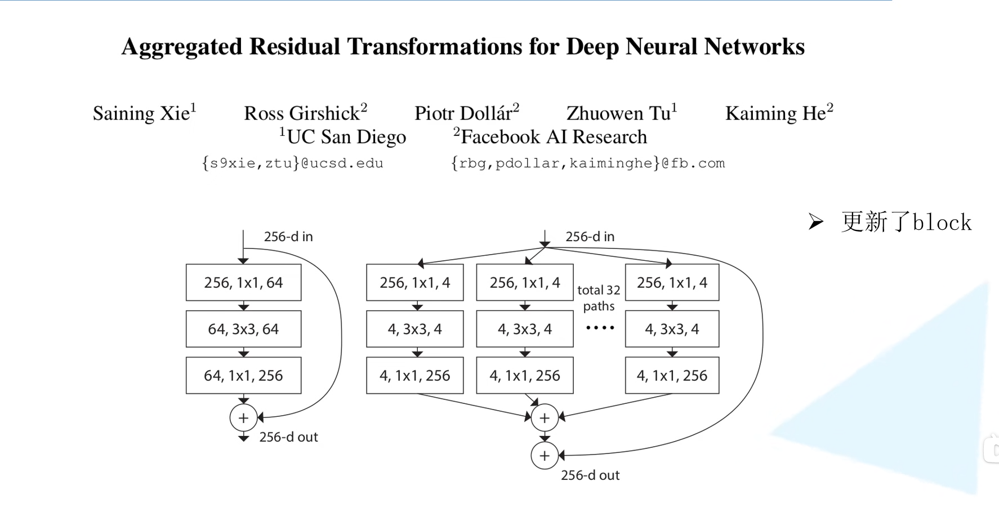
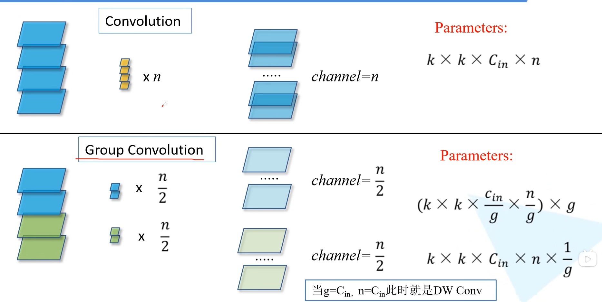
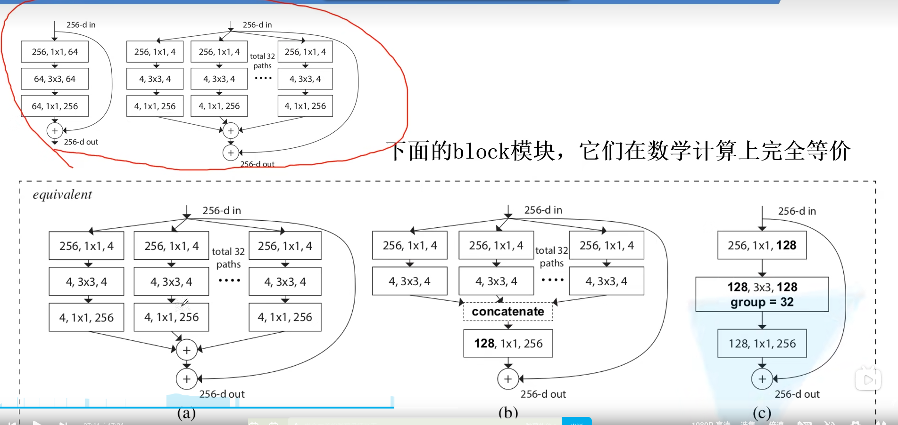
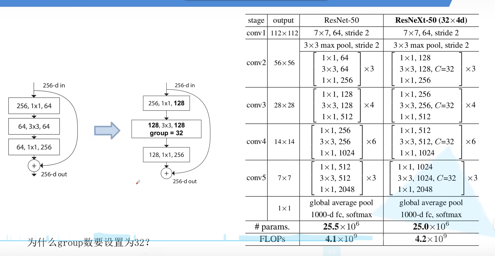
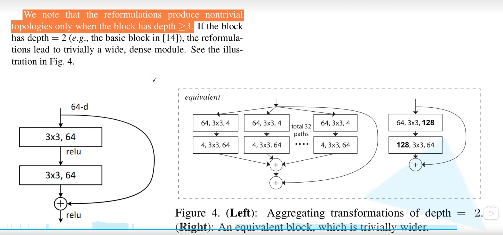

# 1 前言

最近在b站发现了一个非常好的 计算机视觉 + pytorch 的教程，相见恨晚，能让初学者少走很多弯路。
因此决定按着up给的教程路线：图像分类→目标检测→…一步步学习用pytorch实现深度学习在cv上的应用，并做笔记整理和总结。

up主教程给出了pytorch和tensorflow两个版本的实现，我暂时只记录pytorch版本的笔记。

参考内容来自：

* up主的b站链接：https://space.bilibili.com/18161609/channel/index
* up主将代码和ppt都放在了github：https://github.com/WZMIAOMIAO/deep-learning-for-image-processing\
* up主的CSDN博客：https://blog.csdn.net/qq_37541097/article/details/103482003

# 2 ResNeXt 详解

对比上一节的ResNet，只是修改了block

如下图，左侧就是我们上一节ResNet中的block，右侧是修改后的block

## 2.1 Group Convolution

**Group Convolution**：

如上图左侧，分为两组卷积，每组的通道数为n/2。分别进行卷积后再合并通道数为n。

**参数个数**

上图中上面的普通卷积参数个数：$k*k*C_{in}*n$

下面使用Group Convolution时参数个数：$(k*k*{C_{in}\over g}*{n\over g})*g$

其中

n：输入特征的通道数 

k：卷积核大小

g：分为g组卷积

因此原有的block就可以替换为下图

group设置为32是因为作者测试效果最好。

最后如果是原block层数小于3,那么是不需要转换block的。

