# 1 前言

最近在b站发现了一个非常好的 计算机视觉 + pytorch 的教程，相见恨晚，能让初学者少走很多弯路。
因此决定按着up给的教程路线：图像分类→目标检测→…一步步学习用pytorch实现深度学习在cv上的应用，并做笔记整理和总结。

up主教程给出了pytorch和tensorflow两个版本的实现，我暂时只记录pytorch版本的笔记。

参考内容来自：

* up主的b站链接：https://space.bilibili.com/18161609/channel/index
* up主将代码和ppt都放在了github：https://github.com/WZMIAOMIAO/deep-learning-for-image-processing\
* up主的CSDN博客：https://blog.csdn.net/qq_37541097/article/details/103482003

# 2 MobileNet详解

之前将的VGG16模型权重大小大约490M，resNet152层模型权重大约644M，模型参数太大，不能在嵌入式设别运行。

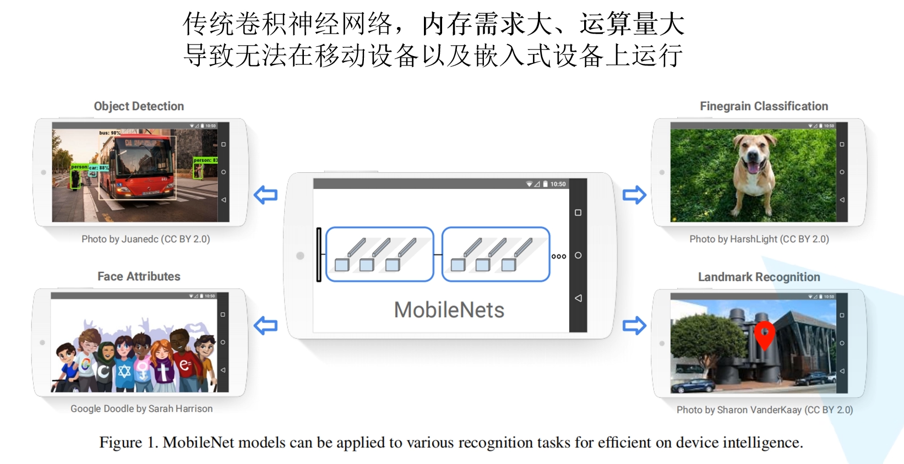

MobileNet参数量大大减少，同时精度小幅下降

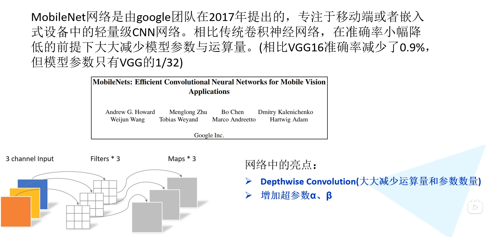

**MobileNet网络的亮点**

* 使用Depthwise Convolution大大减少运算量和参数量
* 增加了两个超参数控制卷积蹭卷积核个数α，和控制输入图像大小的β。

## 2.1 Depthwise Conv

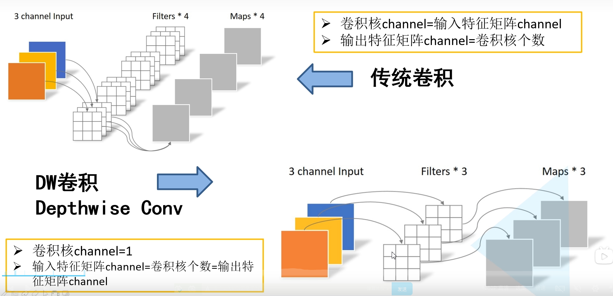

上图是对比传统的卷积和DW卷积

* 传统卷积：
  * 卷积核channel=输入特征矩阵chennel
  * 输出特征矩阵channel=卷积核个数
* DW卷积
  * 卷积核channel=1
  * 输入特征矩阵channel=卷积核个数=输出特征矩阵channel

## 2.2 Depthwise Separable Conv

深度可分离卷积Depthwise Separable Conv如下图

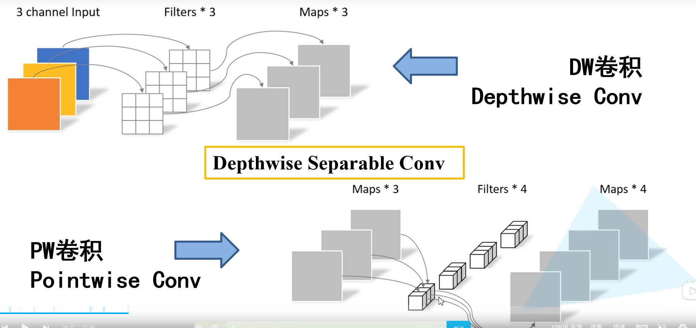

DW卷积上面介绍过了

PW卷积就是普通的卷积，只不过卷积核的大小是`1*1`

DW和PW是组合使用的 如下图

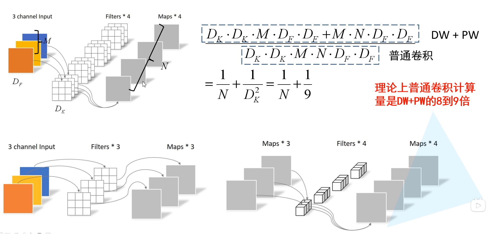

上图中上面的普通的卷积，下面是DW和PW组合的，参数如上图所示。

## 2.3 网络结构

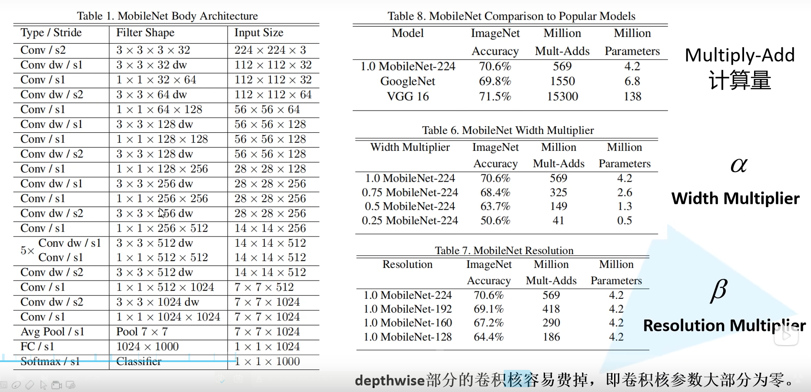

分析一下每一层网络

* 第一层 
  * Conv/s2 :普通卷积，步距为2    
  * Filter Shape 3×3×3×32： 卷积核3×3    3通道输入（彩色图像）   32个卷积核
* 第二层
  * Conv dw/s1 ：DW卷积操作 步距为1  
  * Filter Shape 3×3×32dw： 卷积核3×3    单通道输入   32个卷积核
* 下面的类似 串联即可

α，和β可以影响准确率和计算量，参数量。

# 3 MobileNet v2

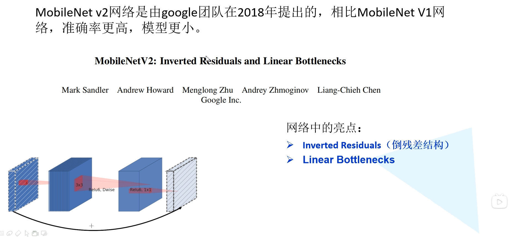

## 3.1 Inverted Residuals

下图对比一下之前将的残差网络的block和这里的Inverted Residuals倒残差结构

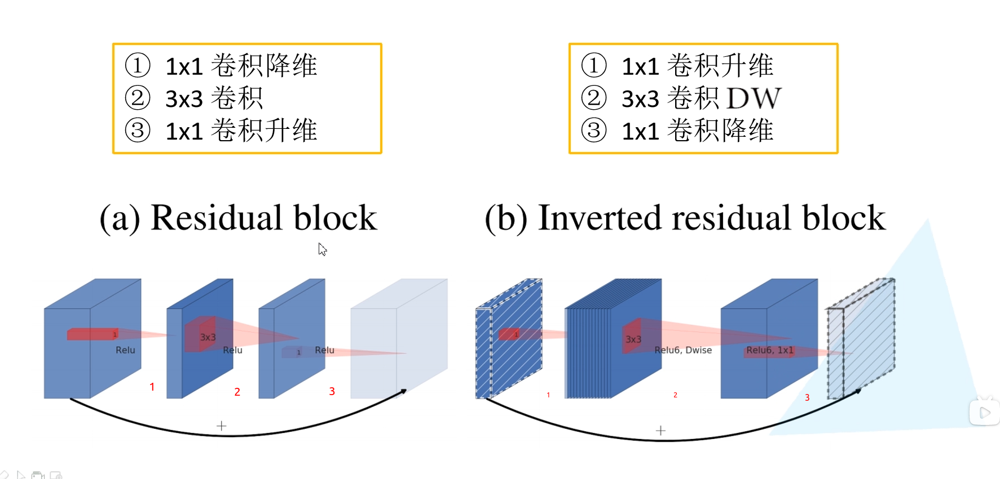

**Residual block中是先降维再升维，采用的relu激活函数**

**Inverted residual block中是先升维再降维，采用的是Relu6激活函数**

注意下图中最后一个conv 1×1使用的激活函数是Linear

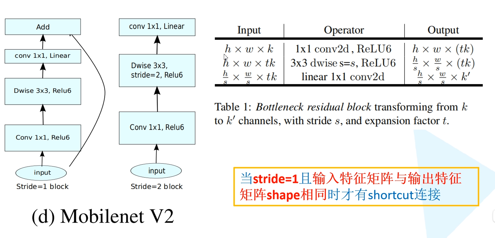

Inverted Residuals 结构的核心问题在于：为什么要升维再降维？

MobileNetV1 网络主要思路就是深度可分离卷积的堆叠，这和 VGG 的堆叠思想基本一致。Inverted Residuals 结构包含 DW 卷积结构之外，还使用了Expansion layer和 Projection layer。这个 Projection layer 就是使用 1 × 1 1 \times 1 1×1 卷积网络结构，其目的是希望把高维特征映射到低维空间去。补充说一句，使用 1 × 1 1 \times 1 1×1 卷积网络结构将高维空间映射到低维空间的设计有的时候我们也称之为 Bottleneck layer。Expansion layer 的功能正相反，使用 1 × 1 1 \times 1 1×1 卷积网络结构，其目的是将低维空间映射到高维空间。这里 Expansion 有一个超参数是维度扩展几倍。可以根据实际情况来做调整的，默认值是 6，也就是扩展 6 倍。

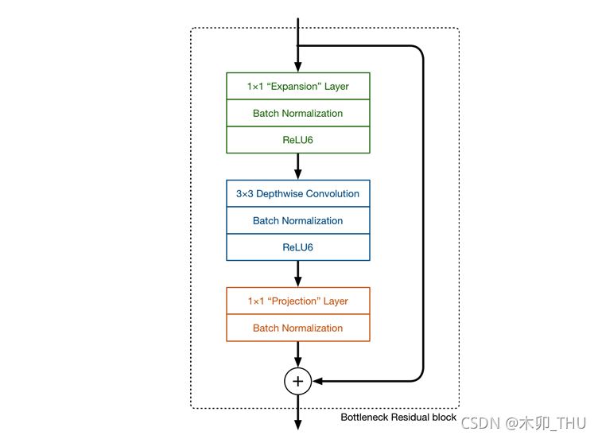

我们知道：如果 Tensor 维度越低，卷积层的乘/加法计算量就越小。那么如果整个网络都是低维的 Tensor，那么整体计算速度就会很快(这个和 MobileNet 的初心一致呀)。然而，如果只是使用低维的 Tensor 效果并不会好（在 ICIP2021 的文章 MEPDNet 中提到了倒三角，不是增加维度，而是增加尺寸）。如果卷积层的 filter 都是使用低维的 Tensor 来提取特征的话，那么就没有办法提取到整体的足够多的信息。所以，如果提取特征数据的话，我们可能更希望有高维的 Tensor 来做这个事情。总结而言就是：在没有办法确定这些特征是否充足或者完备的情况下，那就多来点特征你自己去选来用，韩信点兵多多益善。MobileNetV2 便设计这样一个结构来达到平衡。

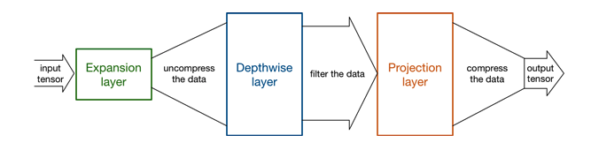

先通过 Expansion layer 来扩展维度，之后在用深度可分离卷积来提取特征，之后使用 Projection layer 来压缩数据，让网络从新变小。因为 Expansion layer 和 Projection layer 都是有可以学习的参数，所以整个网络结构可以学习到如何更好的扩展数据和从新压缩数据。哪为什么原来的结构不先升再降呢？简单，因为他们中间 3 × 3 3 \times 3 3×3 卷积计算量太大。MobileNetV2 之所以敢这么做，还是源自于 DW 卷积计算量小，如果中间是普通卷积，计算量太大了，就需要先降维再升维来降低计算量和参数量。

### 3.1.1 Relu6

对比与relu激活函数，只是大于6的时候输出6。

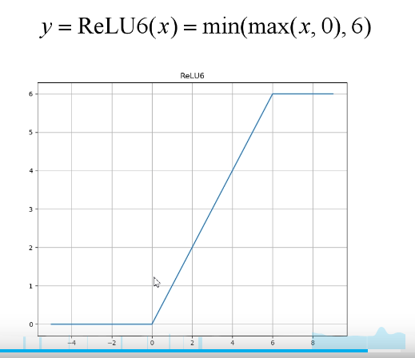

为什么要使用relu6呢？原论文指出是relu激活函数对低维信息有大量的损失，而我们的Inverted residual block正好是中间维度高两边维度低，为了减少损失才替换为relu6。

在原文中，作者针对 Inverted Residuals 结构的最后一个 1 × 1 1 \times 1 1×1 卷积层使用线性激活函数而非 ReLU 激活函数。作者做了一个实验来说明这一点，首先输入是一个二维的矩阵，channel = 1。我们采用不同的 matrix T T T 把它进行升维到更高的维度上，使用激活函数 ReLU，然后再使用 T T T 的逆矩阵 T − 1 T^{-1} T−1 对其进行还原。当 T T T 的维度为 2 或者 3 时，还原回 2 维特征矩阵后丢失了很多信息。但是随着维度的增加，丢失的信息越来越少。可见，ReLU 激活函数对低维特征信息会造成大量损失。因为 Inverted Residuals 结构两头小中间大，在最后输出的时候是一个低维的特征了，所以改为线性激活函数而非 ReLU 激活函数。实验证明，使用 linear bottleneck 可以防止非线性破坏太多信息。

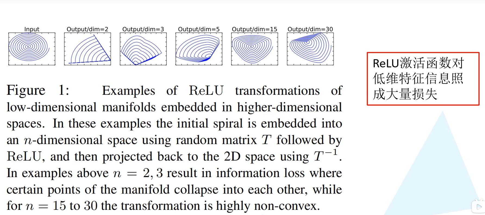

## 3.2 网络结构

下图展示了 MobileNetV2 网络结构配置图。其中 t 表示在 Inverted Residuals 结构中 1 × 1 1 \times 1 1×1 卷积升维的倍率 (相较于输入通道而言的)，c 是输出特征矩阵的深度 channel。n 表示 bottleneck (即 Inverted Residuals 结构) 重复的次数。s 表示步距，但是只表示第一个 bottleneck 中 DW 卷积的步距，后面重复 bottleneck 的 stride 都是等于 1 的。

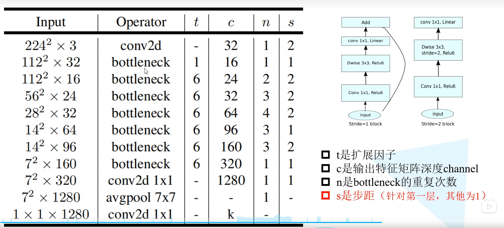

