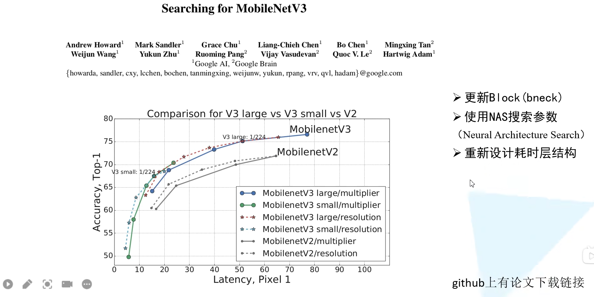
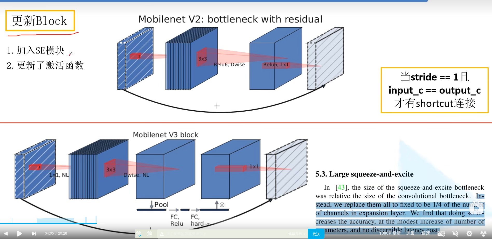
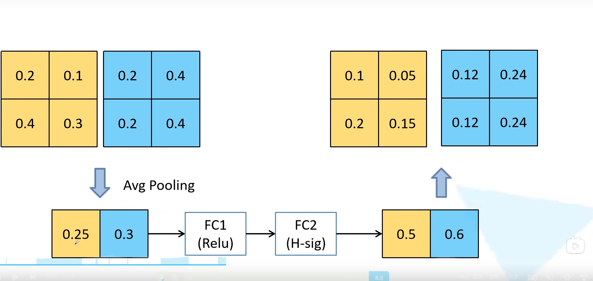
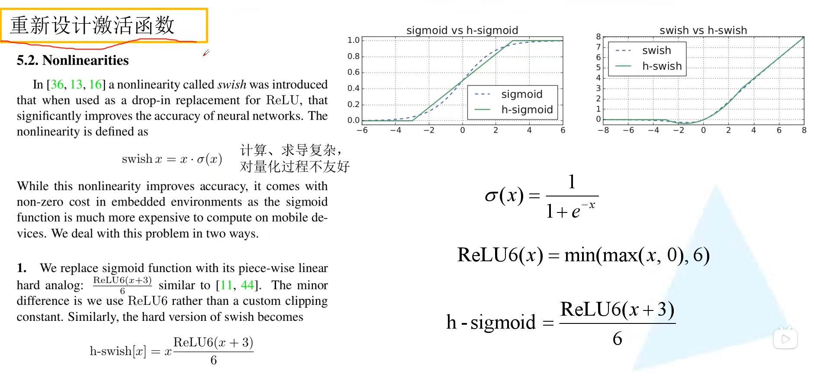
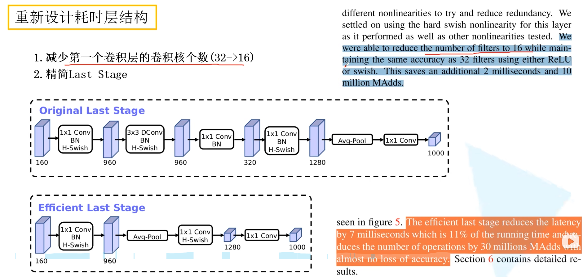
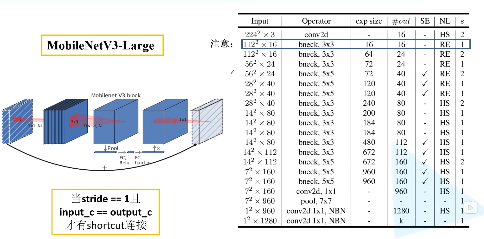

# 1 前言

最近在b站发现了一个非常好的 计算机视觉 + pytorch 的教程，相见恨晚，能让初学者少走很多弯路。
因此决定按着up给的教程路线：图像分类→目标检测→…一步步学习用pytorch实现深度学习在cv上的应用，并做笔记整理和总结。

up主教程给出了pytorch和tensorflow两个版本的实现，我暂时只记录pytorch版本的笔记。

参考内容来自：

* up主的b站链接：https://space.bilibili.com/18161609/channel/index
* up主将代码和ppt都放在了github：https://github.com/WZMIAOMIAO/deep-learning-for-image-processing\
* up主的CSDN博客：https://blog.csdn.net/qq_37541097/article/details/103482003

# 2 MobileNetV3

MobileNetV3 是由 google 团队在 2019 年提出的，其原始论文为 Searching for MobileNetV3。MobileNetV3 有以下三点值得注意：

* 更新 Block (bneck)
* 使用 NAS 搜索参数 (Neural Architecture Search)
* 重新设计耗时层结构

相比于 MobileNetV2 版本而言，具体 MobileNetV3 在性能上有哪些提升呢？在原论文摘要中，作者提到在 ImageNet 分类任务中正确率上升了 3.2%，计算延时还降低了 20%。

## 2.1 更新 BlocK (bneck)

首先我们来看一下在 MobileNetV3 中 block 如何被更新的。乍一看没有太大的区别，最显眼的部分就是加入了 SE 模块，即注意力机制；其次是更新了激活函数。

### 2.1.1 SE模块

上图下方的Pool FC部分就是SE模块，也就是注意力机制这里的注意力机制想法非常简单，即针对每一个 channel 进行池化处理，就得到了 channel 个数个元素，通过两个全连接层，得到输出的这个向量。值得注意的是，第一个全连接层的节点个数等于 channel 个数的 1/4，然后第二个全连接层的节点就和 channel 保持一致。这个得到的输出就相当于对原始的特征矩阵的每个 channel 分析出来了其重要程度，越重要的赋予越大的权重，越不重要的就赋予越小的权重。我们用下图来进行理解，首先采用平均池化将每一个 channel 变为一个值，然后经过两个全连接层之后得到通道权重的输出，值得注意的是第二个全连接层使用 Hard-Sigmoid 激活函数。然后将通道的权重乘回原来的特征矩阵就得到了新的特征矩阵。

在 MobileNetV3 中 block 的激活函数标注的是 NL，表示的是非线性激活函数的意思。因为在不同层用的不一样，所以这里标注的是 NL。一样的，最后 1 × 1 1 \times 1 1×1 卷积后使用线性激活函数（或者说就是没有激活函数）。

### 2.1.2 重新设计激活函数

我们来重点讲一讲重新设计激活函数这个部分，之前在 MobileNetV2 都是使用 ReLU6 激活函数。现在比较常用的是 swish 激活函数，即 x 乘上 sigmoid 激活函数。使用 swish 激活函数确实能够提高网络的准确率，但是呢它也有一些问题。首先就是其计算和求导时间复杂，光一个 sigmoid 进行计算和求导就比较头疼了。第二个就是对量化过程非常不友好，特别是对于移动端的设备，为了加速一般都会进行量化操作。为此，作者提出了一个叫做 h-swish 的激活函数。

在说 h-swish 之前，首先要说说 h-sigmoid 激活函数，它其实是 ReLU6 ( x + 3 ) / 6 \text{ReLU6}(x+3)/6 ReLU6(x+3)/6。可以看出来它和 sigmoid 非常接近，但是计算公式和求导简单太多了。由于 swish 是 x 乘上 sigmoid，自然而言得到 h-swish 是 x 乘上 h-sigmoid。可以看到 swish 激活函数的曲线和 h-swish 激活函数的曲线还是非常相似的。作者在原论文中提到，经过将 swish 激活函数替换为 h-swish，sigmoid 激活函数替换为 h-sigmoid 激活函数，对网络的推理速度是有帮助的，并且对量化过程也是很友好的。注意，h-swish 实现虽然说比 swish 快，但和 ReLU 比还是慢不少

### 2.1.3 重新设计耗时层结构

关于重新设计耗时层结构，原论文主要讲了两个部分。首先是针对第一层卷积层，因为卷积核比较大，所以将第一层卷积核个数从 32 减少到 16。作者通过实验发现，这样做其实准确率并没有改变，但是参数量小了呀，有节省大概 2ms 的时间！

第二个则是精简 Last Stage。作者在使用过程中发现原始的最后结构比较耗时。精简之后第一个卷积没有变化，紧接着直接进行平均池化操作，再跟两个卷积层。和原来比起来明显少了很多层结构。作者通过实验发现这样做正确率基本没有损失，但是速度快了很多，节省了 7ms 的推理时间，别看 7ms 少，它占据了全部推理时间的 11%。

NAS

虽然 MobileNetV3 结构我们已经知道了，但是 如何设计出的这个网络，如何进行网络结构的搜索？ 结合论文标题 “Searching for” 我们还是有必要简单提一下。之所以简单说，是因为我现在也不太懂 。总体而言，先使用 NAS 算法，优化每一个 block，得到大体的网络结构，然后使用 NetAdapt 算法来确定每个 filter 的 channel 的数量。由于small model 的精度以及耗时影响相对较大，MobileNetV3-large 和 MobileNetV3-small 是分别使用 NAS 设计的。具体过程如下：

* 先用 NAS 找到一个可用的结构 A
  * 在 A 的基础上生成一系类的候选结构，并且这些候选结构消耗在一点点减少，即穷举子结构
  * 对于每个候选结构，使用前一个模型进行初始化，（前一个模型没有的参数随机初始化就行），finetune T 个 epoch，得到一个大致的精度
  * 在这些候选结构中，找到最好的
* 反复迭代，直到到达结束条件，找到最合适的结果

候选子结构包括：降低 expansion layer 的升维 size 以及减少 projection layer 的降维 size。

关于网络架构搜索 (NAS) 并不是 MobileNetV3 这篇文章首先提出来的，而是在 18 年同是谷歌的一篇文章 MnasNet: Platform-Aware Neural Architecture Search for Mobile 提出来的，有兴趣的可以看一看。

## 2.2 MobileNetV3 网络结构

下表给出的是 MobileNetV3-large 的网络配置。Input 表示输入当前层的特征矩阵的 shape，#out 代表的就是输出的通道大小。exp size 表示 bneck 中第一个升维的 1 × 1 1 \times 1 1×1 卷积输出的维度，SE 表示是否使用注意力机制，NL 表示当前使用的非线性激活函数，s 为步距 stride。bneck 后面跟的就是 DW 卷积的卷积核大小。注意最后有一个 NBN 表示分类器部分的卷积不会去使用 BN 层。

还需要注意的是第一个 bneck 结构，它的 exp size 和输出维度是一样的，也就是第一个 1 × 1 1 \times 1 1×1 卷积并没有做升维处理，所以在 pytorch 和 tensorflow 的官方实现中，第一个 bneck 结构中就没有使用 1 × 1 1 \times 1 1×1 卷积了，直接就是 DW 卷积了。

与 MobileNetV2 一致，只有当 stride = 1 且 input channel = output channel 的时候才有 shortcut 连接。

